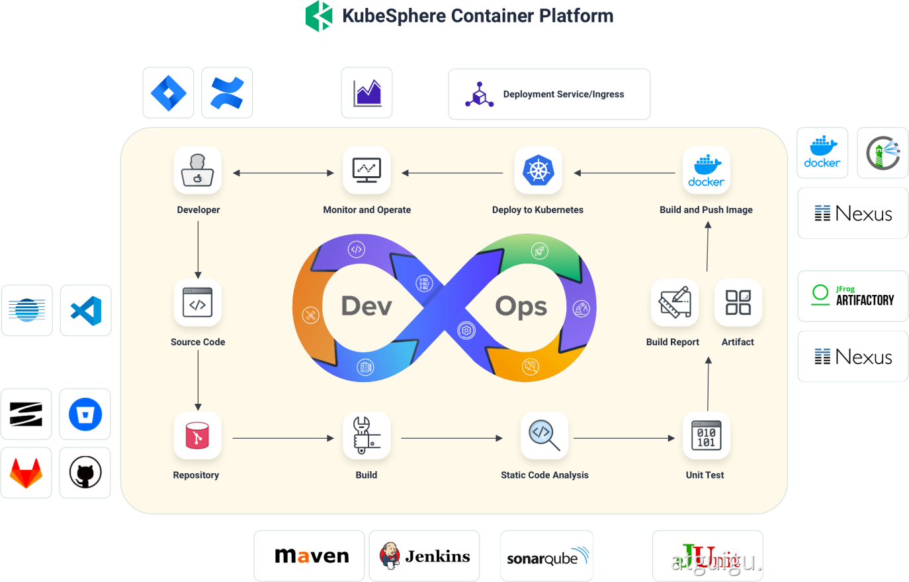
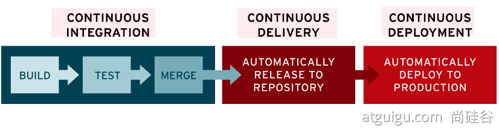

# DevOps基础

## DevOps简介

DevOps **是一系列做法和工具**，可以使 IT 和软件开发团队之间的**流程实现自动化**。其中，随着敏捷软件开发日趋流行，**持续集成 (CI)** 和**持续交付 (CD)** 已经成为该领域一个理想的解决方案。在 CI/CD 工作流中，每次集成都通过自动化构建来验证，包括编码、发布和测试，从而帮助开发者提前发现集成错误，团队也可以快速、安全、可靠地将内部软件交付到生产环境。

## DevOps落地

[官方文档](https://kubesphere.com.cn/docs/devops-user-guide/understand-and-manage-devops-projects/overview/)

[内置的Agent](https://kubesphere.com.cn/docs/devops-user-guide/how-to-use/choose-jenkins-agent/)

## Jenkins与KubeSphere

- 通过KubeSphere在图形界面生成流水线JenkinsFile用来编辑和创建项目的流水线的配置。

### Jenkins概念

#### 代理

> 根据要完成的不同功能使用不同的代理。

##### 内置命令

- unzip		
- which
- make
- wget
- zip
- bzip2
- git

- `base`
  - 提供稳定CentOS系统及命令。
- `node`
  - 提供稳定版的NodeJs环境。
- `go`
  - 提供稳定版本的GO语言的环境。
- `maven`
  - 提供稳定的JAVA语言环境。

#### 阶段

> 流水线上的某一阶段。

##### 条件

- 触发阶段的条件。

##### 任务

- 满足条件后触发的任务。