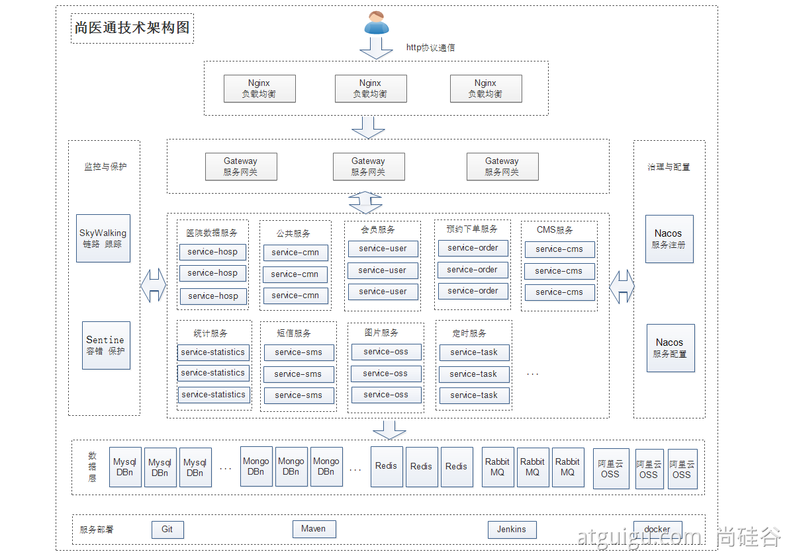

# 项目上云

## 项目架构



```yaml
yygh-parent
|---common                                  //通用模块
|---hospital-manage                         //医院后台				[9999]   
|---model																		//数据模型
|---server-gateway													//网关    				[80]
|---service																	//微服务层
|-------service-cmn													//公共服务				[8202]
|-------service-hosp												//医院数据服务		[8201]
|-------service-order												//预约下单服务		[8206]
|-------service-oss													//对象存储服务		[8205]
|-------service-sms													//短信服务				[8204]
|-------service-statistics									//统计服务				[8208]
|-------service-task												//定时服务				[8207]
|-------service-user												//会员服务				[8203]

====================================================================

yygh-admin																	//医院管理后台		[9528]
yygh-site																		//挂号平台				[3000]
```

## 中间件

| 中间件        | 集群内地址                       |
| ------------- | -------------------------------- |
| Nacos         | his-nacos.his:8848               |
| MySQL         | his-mysql.his:3306               |
| Redis         | his-redis.his:6379               |
| Sentinel      | his-sentinel.his:8080            |
| MongoDB       | mongodb.his:**27017**            |
| RabbitMQ      | rabbitm-yp1tx4-rabbitmq.his:5672 |
| ElasticSearch | his-es.his:9200                  |

## 流水线

### 项目地址

- https://gitee.com/leifengyang/yygh-parent

- https://gitee.com/leifengyang/yygh-admin

- https://gitee.com/leifengyang/yygh-site

### 项目默认规则

- 每个微服务项目，在生产环境时，会自动获取   ` 微服务名-prod.yml ` 作为自己的核心配置文件。
- 每个微服务项目，在生产环境时，默认都是使用 `8080` 端口。

### 生产与开发配置隔离

- docker打包生产环境的镜像的时候，指定启动命令中启用生产配置。


### deploy.yaml

```yaml
apiVersion: apps/v1
kind: Deployment
metadata:
  labels:
    app: service-cart
  name: service-cart
  namespace: his   #一定要写名称空间
spec:
  progressDeadlineSeconds: 600
  replicas: 1
  selector:
    matchLabels:
      app: service-cart
  strategy:
    rollingUpdate:
      maxSurge: 50%
      maxUnavailable: 50%
    type: RollingUpdate
  template:
    metadata:
      labels:
        app: service-cart
    spec:
      imagePullSecrets:
        - name: aliyun-docker-hub  #提前在项目下配置访问阿里云的账号密码
      containers:
        - image: $REGISTRY/$ALIYUNHUB_NAMESPACE/service-cart
          readinessProbe:
            httpGet:
              path: /actuator/health
              port: 8080
            timeoutSeconds: 10
            failureThreshold: 30
            periodSeconds: 5
          imagePullPolicy: Always
          name: app
          ports:
            - containerPort: 8080
              protocol: TCP
          resources:
            limits:
              cpu: 300m
              memory: 600Mi
          terminationMessagePath: /dev/termination-log
          terminationMessagePolicy: File
      dnsPolicy: ClusterFirst
      restartPolicy: Always
      terminationGracePeriodSeconds: 30
---
apiVersion: v1
kind: Service
metadata:
  labels:
    app: service-cart
  name: service-cart
  namespace: his
spec:
  ports:
    - name: http
      port: 8080
      protocol: TCP
      targetPort: 8080
  selector:
    app: service-cart
  sessionAffinity: None
  type: ClusterIP
```

## DevOps 实战

### 配置阿里云Maven镜像

- 使用admin登陆ks。
- 进入集群管理。

- 进入配置中心。
- 找到配置。
  - [ks-devops-agent](http://139.198.165.238:30880/clusters/default/projects/kubesphere-devops-system/configmaps/ks-devops-agent)。
  - 修改配置，加入maven阿里云镜像加速地址。


### 缓存机制

- 已经下载过的jar包，下一次流水线的启动，不会重复下载。


### 部署到k8s集群

- 给每一个微服务准备一个`deploy.yaml`，k8s的部署配置文件。

- 传入`deploy.yaml`的位置就能部署。

  ```yaml
  kubectl apply -f xxxx
  ```

- 一定在项目里面而不是流水线项目，找到配置密钥，配置一个阿里云的访问账号密码。

### 前端项目

#### vue项目

- `npm install --registry=https://registry.npm.taobao.org ` 安装项目依赖。
- `npm run build` 会生成 `dist` 目录。
- 打包完成后把 `.nuxt ,static, nuxt.config.js, package.json ` 这四个关键文件复制到 `node ` 环境。
- `npm install` 再使用`npm run start` 即可运行。

### webhook

- 每个项目，都有流水线文件。
- 每次修改完项目，手动点击运行。
- 希望，每次修改完项目，代码推送，流水线能自动运行。
- 使用。
  1. 写代码并提交到仓库。
  2. 给指定的地方发请求`webhook`。
  3. `kubesphere`平台感知到。
  4. 自动启动流水线继续运行。

