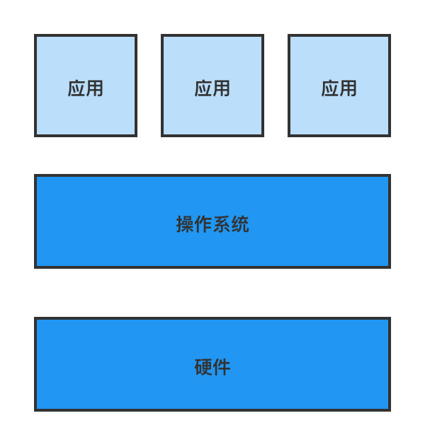
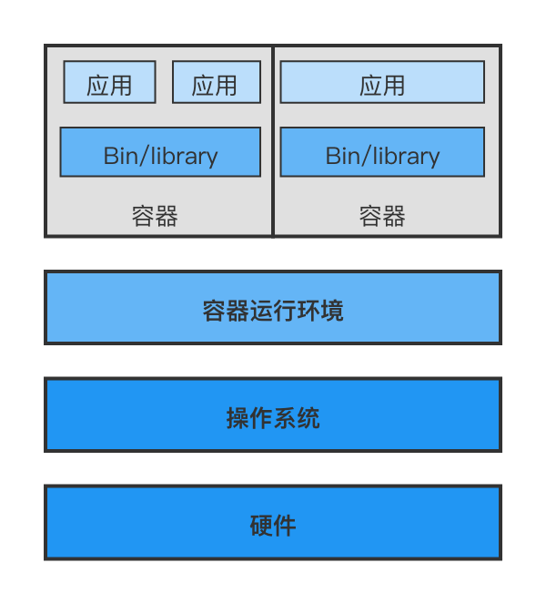
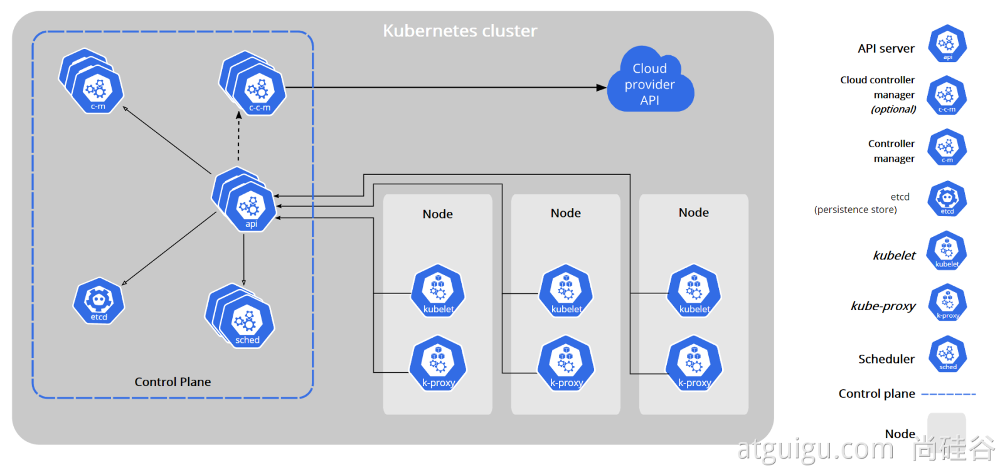

# Kubernetes 基础

## 运行环境进化史

### 单机时代



### 虚拟机时代


### 容器时代



进入到容器化时代之后，需要一个大规模的高效稳定的容器编排系统来对容器资源进行管理和调控。

## 简介

kubernetes，简称K8s，是用8代替名字中间的8个字符“ubernete”而成的缩写。Kubernetes是Google开源的一个容器编排引擎，它支持自动化部署、大规模可伸缩、应用容器化管理。在生产环境中部署一个应用程序时，通常要部署该应用的多个实例以便对应用请求进行负载均衡。

在Kubernetes中，我们可以创建多个容器，每个容器里面运行一个应用实例，然后通过内置的负载均衡策略，实现对这一组应用实例的管理、发现、访问，而这些细节都不需要运维人员去进行复杂的手工配置和处理。

## 特性

Kubernetes 为你提供了一个可弹性运行分布式系统的框架。 

Kubernetes 会满足你的扩展要求、故障转移、部署模式等。

- **服务发现和负载均衡**
  Kubernetes 可以使用`DNS 名称`或`自己的IP地址`**公开容器**，如果进入容器的流量很大，Kubernetes 可以**负载均衡**并**分配网络流量**，从而使部署稳定。
- **存储编排**
  Kubernetes 允许**自动挂载**你选择的存储系统，例如**本地存储**、**公共云提供商**等。
- **自动部署和回滚**
  可以使用 Kubernetes **描述已部署容器的所需状态**，它可以以受控的速率将实际状态更改为**期望状态**。例如，你可以自动化 Kubernetes 来为你的部署创建新容器，删除现有容器并将它们的所有资源用于新容器。

- **自动完成装箱计算**
  Kubernetes 允许你**指定每个容器所需 CPU 和内存（RAM）**。 当容器指定了资源请求时，Kubernetes 可以做出更好的决策来管理容器的资源。
- **自我修复**
  Kubernetes **重新启动失败的容器**、**替换容器**、**杀死不响应用户定义的运行状况检查的容器**，并且在准备好服务之前不将其通告给客户端。

- **密钥与配置管理**
  Kubernetes 允许你**存储和管理敏感信息**，例如`密码`、`OAuth令牌`和 `ssh密钥`。 可以**在不重建容器镜像的情况下部署和更新密钥和应用程序配置，也无需在堆栈配置中暴露密钥**。

## 架构

### 工作方式

Kubernetes **Cluster** **=** N **Master** Node **+** N **Worker** Node : N主节点 + N工作节点。 `N>=1`

### 组件架构



#### 控制平面组件

> Control Plane Components

- 控制平面的组件对集群做出**全局决策(**比如调度)，以及**检测和响应集群事件**。（例如，当不满足部署的 `replicas` 字段时，启动新的[pod](https://kubernetes.io/docs/concepts/workloads/pods/pod-overview/)）。

- 控制平面组件**可以在集群中的任何节点上运行**。 然而，为了简单起见，设置脚本通常会在同一个计算机上启动所有控制平面组件， 并且不会在此计算机上运行用户容器。

##### kube-apiserver

- API 服务器是 Kubernetes [控制面](https://kubernetes.io/zh/docs/reference/glossary/?all=true#term-control-plane)的组件， 该组件公开了 Kubernetes API。 
- **API 服务器是 Kubernetes 控制面的前端**。
- Kubernetes API 服务器的主要实现是 [kube-apiserver](https://kubernetes.io/zh/docs/reference/command-line-tools-reference/kube-apiserver/)。 kube-apiserver 设计上考虑了**水平伸缩**，也就是说，它可通过部署多个实例进行伸缩进行流量平衡。

##### etcd

- [官方文档](https://etcd.io/docs/)

- etcd 是**兼具一致性和高可用性的键值数据库**，可以作为保存 Kubernetes 所有集群数据的后台数据库。

##### kube-scheduler

- 控制平面组件，负责**监视新创建的、未指定运行[节点（node）](https://kubernetes.io/zh/docs/concepts/architecture/nodes/)的 [Pods](https://kubernetes.io/docs/concepts/workloads/pods/pod-overview/)，选择节点让 Pod 在上面运行**。

- 调度决策考虑的因素包括单个 Pod 和 Pod 集合的资源需求、硬件、软件、策略约束、亲和性和反亲和性规范、数据位置、工作负载间的干扰和最后时限。

###### kube-controller-manager

- 在**主节点**上运行 [控制器](https://kubernetes.io/zh/docs/concepts/architecture/controller/) 的组件。

- 从逻辑上讲，每个[控制器](https://kubernetes.io/zh/docs/concepts/architecture/controller/)都是一个单独的进程， 但是**为了降低复杂性，它们都被编译到同一个可执行文件，并在一个进程中运行**。
  - `Node Controller`  节点控制器，负责在节点出现故障时进行通知和响应。
  - `Job Controller`  任务控制器，监测代表一次性任务的 Job 对象，然后创建 Pods 来运行这些任务直至完成。
  - `Endpoints Controller`  端点控制器，填充端点`Endpoints`对象(即加入 Service 与 Pod)。
  - `Service Account & Token Controllers`  服务帐户和令牌控制器，为新的命名空间创建默认帐户和 API 访问令牌。

##### cloud-controller-manager

- 云控制器管理器是指**嵌入特定云的控制逻辑的 [控制平面](https://kubernetes.io/zh/docs/reference/glossary/?all=true#term-control-plane)组件**。 
- 云控制器管理器允许您**链接集群到云提供商的应用编程接口**中， 并把和该云平台交互的组件与只和您的集群交互的组件分离开。
- `cloud-controller-manager` **仅运行特定于云平台的控制回路**。 
- 与 `kube-controller-manager` 类似，`cloud-controller-manager` 将若干逻辑上独立的控制回路组合到同一个可执行文件中，供你以同一进程的方式运行。 
- 可以对`cloud-controller-manager`执行**水平扩容**以提升性能或者增强容错能力。

- 控制器都包含对云平台驱动的依赖：
  - `Node Controller`  节点控制器，用于在节点终止响应后检查云提供商以确定节点是否已被删除。
  - `Route Controller`  路由控制器，用于在底层云基础架构中设置路由。
  - `Service Controller`  服务控制器，用于创建、更新和删除云提供商负载均衡器。

#### Node组件

>节点组件在每个节点上运行，维护运行的 Pod 并提供 Kubernetes 运行环境。

##### kubelet

- 一个在集群中每个[节点（node）](https://kubernetes.io/zh/docs/concepts/architecture/nodes/)上运行的代理。 
- 保证[容器（containers）](https://kubernetes.io/zh/docs/concepts/overview/what-is-kubernetes/#why-containers)都 运行在 [Pod](https://kubernetes.io/docs/concepts/workloads/pods/pod-overview/) 中。
- kubelet 接收一组通过各类机制提供给它的 PodSpecs，确保这些 PodSpecs 中描述的容器处于运行状态且健康。
- kubelet 不会管理不是由 Kubernetes 创建的容器。

##### kube-proxy

- [kube-proxy](https://kubernetes.io/zh/docs/reference/command-line-tools-reference/kube-proxy/) 是集群中每个节点上运行的网络代理， 实现 Kubernetes [服务（Service）](https://kubernetes.io/zh/docs/concepts/services-networking/service/) 概念的一部分。
- kube-proxy 维护节点上的网络规则。这些网络规则**允许从集群内部或外部的网络会话与 Pod 进行网络通信**。
- 如果操作系统提供了**数据包过滤层**并可用的话，kube-proxy 会通过它来实现网络规则。否则，kube-proxy 仅转发流量本身。

### 组件架构图解


## kubeadm创建集群

### 安装kubeadm

- 一台兼容的 Linux 主机。Kubernetes 项目为基于 Debian 和 Red Hat 的 Linux 发行版以及一些不提供包管理器的发行版提供通用的指令。
- 每台机器 2 GB 或更多的 RAM。

- 2 CPU 核或更多。
- 集群中的所有机器的网络彼此均能相互连接(公网和内网都可以)。

- - **设置防火墙放行规则**

- 节点之中不可以有重复的主机名、MAC 地址或 product_uuid。

- - **设置不同hostname**

- 开启机器上的某些端口。

- - **内网互信**

- 禁用交换分区。为了保证 kubelet 正常工作，**必须禁用**交换分区。

- - **永久关闭**

#### 基础环境

```bash
#各个机器设置自己的域名
hostnamectl set-hostname xxxx

# 将 SELinux 设置为 permissive 模式（相当于将其禁用）
sudo setenforce 0
sudo sed -i 's/^SELINUX=enforcing$/SELINUX=permissive/' /etc/selinux/config

#关闭swap
swapoff -a  
sed -ri 's/.*swap.*/#&/' /etc/fstab

#允许 iptables 检查桥接流量
cat <<EOF | sudo tee /etc/modules-load.d/k8s.conf
br_netfilter
EOF

cat <<EOF | sudo tee /etc/sysctl.d/k8s.conf
net.bridge.bridge-nf-call-ip6tables = 1
net.bridge.bridge-nf-call-iptables = 1
EOF
sudo sysctl --system

```


#### 安装kubelet、kubeadm、kubectl

>kubelet 现在每隔几秒就会重启，因为它陷入了一个等待 kubeadm 指令的死循环。

```bash
cat <<EOF | sudo tee /etc/yum.repos.d/kubernetes.repo
[kubernetes]
name=Kubernetes
baseurl=http://mirrors.aliyun.com/kubernetes/yum/repos/kubernetes-el7-x86_64
enabled=1
gpgcheck=0
repo_gpgcheck=0
gpgkey=http://mirrors.aliyun.com/kubernetes/yum/doc/yum-key.gpg
   http://mirrors.aliyun.com/kubernetes/yum/doc/rpm-package-key.gpg
exclude=kubelet kubeadm kubectl
EOF

sudo yum install -y kubelet-1.20.9 kubeadm-1.20.9 kubectl-1.20.9 --disableexcludes=kubernetes

sudo systemctl enable --now kubelet
```

### 使用kubeadm引导集群

#### 下载各个机器需要的镜像

```bash
sudo tee ./images.sh <<-'EOF'
#!/bin/bash
images=(
kube-apiserver:v1.20.9
kube-proxy:v1.20.9
kube-controller-manager:v1.20.9
kube-scheduler:v1.20.9
coredns:1.7.0
etcd:3.4.13-0
pause:3.2
)
for imageName in ${images[@]} ; do
docker pull registry.cn-hangzhou.aliyuncs.com/lfy_k8s_images/$imageName
done
EOF
   
chmod +x ./images.sh && ./images.sh
```

#### 初始化主节点

```bash
#所有机器添加master域名映射，以下需要修改为自己的
echo "172.31.0.4  cluster-endpoint" >> /etc/hosts

#主节点初始化
kubeadm init \
--apiserver-advertise-address=172.31.0.4 \
--control-plane-endpoint=cluster-endpoint \
--image-repository registry.cn-hangzhou.aliyuncs.com/lfy_k8s_images \
--kubernetes-version v1.20.9 \
--service-cidr=10.96.0.0/16 \
--pod-network-cidr=192.168.0.0/16

#所有网络范围不重叠
```


```bash
Your Kubernetes control-plane has initialized successfully!

To start using your cluster, you need to run the following as a regular user:

  mkdir -p $HOME/.kube
  sudo cp -i /etc/kubernetes/admin.conf $HOME/.kube/config
  sudo chown $(id -u):$(id -g) $HOME/.kube/config

Alternatively, if you are the root user, you can run:

  export KUBECONFIG=/etc/kubernetes/admin.conf

You should now deploy a pod network to the cluster.
Run "kubectl apply -f [podnetwork].yaml" with one of the options listed at:
  https://kubernetes.io/docs/concepts/cluster-administration/addons/

You can now join any number of control-plane nodes by copying certificate authorities
and service account keys on each node and then running the following as root:

  kubeadm join cluster-endpoint:6443 --token hums8f.vyx71prsg74ofce7 \
    --discovery-token-ca-cert-hash sha256:a394d059dd51d68bb007a532a037d0a477131480ae95f75840c461e85e2c6ae3 \
    --control-plane 

Then you can join any number of worker nodes by running the following on each as root:

kubeadm join cluster-endpoint:6443 --token hums8f.vyx71prsg74ofce7 \
    --discovery-token-ca-cert-hash sha256:a394d059dd51d68bb007a532a037d0a477131480ae95f75840c461e85e2c6ae3
```

```bash
#查看集群所有节点
kubectl get nodes

#根据配置文件，给集群创建资源
kubectl apply -f xxxx.yaml

#查看集群部署了哪些应用？
docker ps   ===   kubectl get pods -A
# 运行中的应用在docker里面叫容器，在k8s里面叫Pod
kubectl get pods -A
```

#### 根据提示继续

##### 设置.kube/config

xx

##### 安装网络组件

[calico官网文档](https://docs.projectcalico.org/getting-started/kubernetes/self-managed-onprem/onpremises#install-calico-with-kubernetes-api-datastore-more-than-50-nodes)

```bash
curl https://docs.projectcalico.org/manifests/calico.yaml -O

kubectl apply -f calico.yaml
```

#### 加入node节点

>高可用部署方式，也是在这一步的时候，使用添加主节点的命令即可。

```bash
kubeadm join cluster-endpoint:6443 --token x5g4uy.wpjjdbgra92s25pp \
	--discovery-token-ca-cert-hash sha256:6255797916eaee52bf9dda9429db616fcd828436708345a308f4b917d3457a22
```

创建新令牌

```bash
kubeadm token create --print-join-command
```

#### 验证集群

验证集群节点状态

```bash
kubectl get nodes
```

#### 部署dashboard

##### 部署

kubernetes[官方提供的可视化界面](https://github.com/kubernetes/dashboard)

```bash
kubectl apply -f https://raw.githubusercontent.com/kubernetes/dashboard/v2.3.1/aio/deploy/recommended.yaml
```

```yaml
# Copyright 2017 The Kubernetes Authors.
#
# Licensed under the Apache License, Version 2.0 (the "License");
# you may not use this file except in compliance with the License.
# You may obtain a copy of the License at
#
#     http://www.apache.org/licenses/LICENSE-2.0
#
# Unless required by applicable law or agreed to in writing, software
# distributed under the License is distributed on an "AS IS" BASIS,
# WITHOUT WARRANTIES OR CONDITIONS OF ANY KIND, either express or implied.
# See the License for the specific language governing permissions and
# limitations under the License.

apiVersion: v1
kind: Namespace
metadata:
  name: kubernetes-dashboard

---

apiVersion: v1
kind: ServiceAccount
metadata:
  labels:
    k8s-app: kubernetes-dashboard
  name: kubernetes-dashboard
  namespace: kubernetes-dashboard

---

kind: Service
apiVersion: v1
metadata:
  labels:
    k8s-app: kubernetes-dashboard
  name: kubernetes-dashboard
  namespace: kubernetes-dashboard
spec:
  ports:
    - port: 443
      targetPort: 8443
  selector:
    k8s-app: kubernetes-dashboard

---

apiVersion: v1
kind: Secret
metadata:
  labels:
    k8s-app: kubernetes-dashboard
  name: kubernetes-dashboard-certs
  namespace: kubernetes-dashboard
type: Opaque

---

apiVersion: v1
kind: Secret
metadata:
  labels:
    k8s-app: kubernetes-dashboard
  name: kubernetes-dashboard-csrf
  namespace: kubernetes-dashboard
type: Opaque
data:
  csrf: ""

---

apiVersion: v1
kind: Secret
metadata:
  labels:
    k8s-app: kubernetes-dashboard
  name: kubernetes-dashboard-key-holder
  namespace: kubernetes-dashboard
type: Opaque

---

kind: ConfigMap
apiVersion: v1
metadata:
  labels:
    k8s-app: kubernetes-dashboard
  name: kubernetes-dashboard-settings
  namespace: kubernetes-dashboard

---

kind: Role
apiVersion: rbac.authorization.k8s.io/v1
metadata:
  labels:
    k8s-app: kubernetes-dashboard
  name: kubernetes-dashboard
  namespace: kubernetes-dashboard
rules:
  # Allow Dashboard to get, update and delete Dashboard exclusive secrets.
  - apiGroups: [""]
    resources: ["secrets"]
    resourceNames: ["kubernetes-dashboard-key-holder", "kubernetes-dashboard-certs", "kubernetes-dashboard-csrf"]
    verbs: ["get", "update", "delete"]
    # Allow Dashboard to get and update 'kubernetes-dashboard-settings' config map.
  - apiGroups: [""]
    resources: ["configmaps"]
    resourceNames: ["kubernetes-dashboard-settings"]
    verbs: ["get", "update"]
    # Allow Dashboard to get metrics.
  - apiGroups: [""]
    resources: ["services"]
    resourceNames: ["heapster", "dashboard-metrics-scraper"]
    verbs: ["proxy"]
  - apiGroups: [""]
    resources: ["services/proxy"]
    resourceNames: ["heapster", "http:heapster:", "https:heapster:", "dashboard-metrics-scraper", "http:dashboard-metrics-scraper"]
    verbs: ["get"]

---

kind: ClusterRole
apiVersion: rbac.authorization.k8s.io/v1
metadata:
  labels:
    k8s-app: kubernetes-dashboard
  name: kubernetes-dashboard
rules:
  # Allow Metrics Scraper to get metrics from the Metrics server
  - apiGroups: ["metrics.k8s.io"]
    resources: ["pods", "nodes"]
    verbs: ["get", "list", "watch"]

---

apiVersion: rbac.authorization.k8s.io/v1
kind: RoleBinding
metadata:
  labels:
    k8s-app: kubernetes-dashboard
  name: kubernetes-dashboard
  namespace: kubernetes-dashboard
roleRef:
  apiGroup: rbac.authorization.k8s.io
  kind: Role
  name: kubernetes-dashboard
subjects:
  - kind: ServiceAccount
    name: kubernetes-dashboard
    namespace: kubernetes-dashboard

---

apiVersion: rbac.authorization.k8s.io/v1
kind: ClusterRoleBinding
metadata:
  name: kubernetes-dashboard
roleRef:
  apiGroup: rbac.authorization.k8s.io
  kind: ClusterRole
  name: kubernetes-dashboard
subjects:
  - kind: ServiceAccount
    name: kubernetes-dashboard
    namespace: kubernetes-dashboard

---

kind: Deployment
apiVersion: apps/v1
metadata:
  labels:
    k8s-app: kubernetes-dashboard
  name: kubernetes-dashboard
  namespace: kubernetes-dashboard
spec:
  replicas: 1
  revisionHistoryLimit: 10
  selector:
    matchLabels:
      k8s-app: kubernetes-dashboard
  template:
    metadata:
      labels:
        k8s-app: kubernetes-dashboard
    spec:
      containers:
        - name: kubernetes-dashboard
          image: kubernetesui/dashboard:v2.3.1
          imagePullPolicy: Always
          ports:
            - containerPort: 8443
              protocol: TCP
          args:
            - --auto-generate-certificates
            - --namespace=kubernetes-dashboard
            # Uncomment the following line to manually specify Kubernetes API server Host
            # If not specified, Dashboard will attempt to auto discover the API server and connect
            # to it. Uncomment only if the default does not work.
            # - --apiserver-host=http://my-address:port
          volumeMounts:
            - name: kubernetes-dashboard-certs
              mountPath: /certs
              # Create on-disk volume to store exec logs
            - mountPath: /tmp
              name: tmp-volume
          livenessProbe:
            httpGet:
              scheme: HTTPS
              path: /
              port: 8443
            initialDelaySeconds: 30
            timeoutSeconds: 30
          securityContext:
            allowPrivilegeEscalation: false
            readOnlyRootFilesystem: true
            runAsUser: 1001
            runAsGroup: 2001
      volumes:
        - name: kubernetes-dashboard-certs
          secret:
            secretName: kubernetes-dashboard-certs
        - name: tmp-volume
          emptyDir: {}
      serviceAccountName: kubernetes-dashboard
      nodeSelector:
        "kubernetes.io/os": linux
      # Comment the following tolerations if Dashboard must not be deployed on master
      tolerations:
        - key: node-role.kubernetes.io/master
          effect: NoSchedule

---

kind: Service
apiVersion: v1
metadata:
  labels:
    k8s-app: dashboard-metrics-scraper
  name: dashboard-metrics-scraper
  namespace: kubernetes-dashboard
spec:
  ports:
    - port: 8000
      targetPort: 8000
  selector:
    k8s-app: dashboard-metrics-scraper

---

kind: Deployment
apiVersion: apps/v1
metadata:
  labels:
    k8s-app: dashboard-metrics-scraper
  name: dashboard-metrics-scraper
  namespace: kubernetes-dashboard
spec:
  replicas: 1
  revisionHistoryLimit: 10
  selector:
    matchLabels:
      k8s-app: dashboard-metrics-scraper
  template:
    metadata:
      labels:
        k8s-app: dashboard-metrics-scraper
      annotations:
        seccomp.security.alpha.kubernetes.io/pod: 'runtime/default'
    spec:
      containers:
        - name: dashboard-metrics-scraper
          image: kubernetesui/metrics-scraper:v1.0.6
          ports:
            - containerPort: 8000
              protocol: TCP
          livenessProbe:
            httpGet:
              scheme: HTTP
              path: /
              port: 8000
            initialDelaySeconds: 30
            timeoutSeconds: 30
          volumeMounts:
          - mountPath: /tmp
            name: tmp-volume
          securityContext:
            allowPrivilegeEscalation: false
            readOnlyRootFilesystem: true
            runAsUser: 1001
            runAsGroup: 2001
      serviceAccountName: kubernetes-dashboard
      nodeSelector:
        "kubernetes.io/os": linux
      # Comment the following tolerations if Dashboard must not be deployed on master
      tolerations:
        - key: node-role.kubernetes.io/master
          effect: NoSchedule
      volumes:
        - name: tmp-volume
          emptyDir: {}
```

##### 设置访问端口

```bash
kubectl edit svc kubernetes-dashboard -n kubernetes-dashboard
```

```bash
kubectl get svc -A |grep kubernetes-dashboard
## 找到端口，在安全组放行
```

访问地址

https://集群任意IP:端口

##### 创建访问账号

```yaml
#创建访问账号，准备一个yaml文件； vi dash.yaml
apiVersion: v1
kind: ServiceAccount
metadata:
  name: admin-user
  namespace: kubernetes-dashboard
---
apiVersion: rbac.authorization.k8s.io/v1
kind: ClusterRoleBinding
metadata:
  name: admin-user
roleRef:
  apiGroup: rbac.authorization.k8s.io
  kind: ClusterRole
  name: cluster-admin
subjects:
- kind: ServiceAccount
  name: admin-user
  namespace: kubernetes-dashboard
```


```bash
kubectl apply -f dash.yaml
```

##### 令牌访问

```bash
#获取访问令牌
kubectl -n kubernetes-dashboard get secret $(kubectl -n kubernetes-dashboard get sa/admin-user -o jsonpath="{.secrets[0].name}") -o go-template="{{.data.token | base64decode}}"
```


- 


