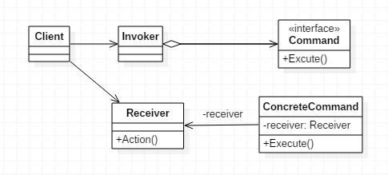

# 命令模式

>Command。

## 定义

- **命令模式（Command）**，将一个请求封装为一个对象，从而使你可用不同的请求对客户进行参数化。
- 对请求排队或记录请求日志，以及支持可撤销的操作。
- `宏命令` 命令模式 + 组合模式。
- `多次undo` 命令模式 + 责任链模式。
- `事务回滚` 命令模式 + 记忆模式。

## 使用场景

- 在某些场合，如要对行为进行“记录、撤销/重做、事务”等处理时。
- 认为是命令的地方都可以使用。
- 系统需要支持命令的撤销/恢复操作时。

## 优点

- 类间耦合，调用者角色与接收者角色之间没有任何依赖关系。
- 可扩展性。
- 命令模式结合职责链模式可以实现命令族解析任务
- 结合模板方法模式可以减少Command子类的膨胀问题。

## 缺点

- 可能导致某些系统有过多的具体命令类。

## 类图



## 代码

### Command类

- 用来声明执行操作的接口/抽象类。

```java
public abstract class Command {

    protected Receiver receiver;

    public Command(Receiver receiver) {
        this.receiver = receiver;
    }

    //执行命令的方法
    abstract public void execute();

}
```

### ConcreteCommand

- 具体的Command类，用于构造传递接收者，根据环境需求，具体的命令类也可能有n个。

```java
public class ConcreteCommand extends Command {

    //构造传递接收者
    public ConcreteCommand(Receiver receiver) {
        super(receiver);
    }

    //必须实现一个命令
    @Override
    public void execute() {
        receiver.action();
    }

}
```

### Invoker类

- 接收命令，并执行命令。

```java
public class Invoker {

    private Command command;

    //接受命令
    public void setCommand(Command command) {
        this.command = command;
    }

    //执行命令
    public void executeCommand() {
        command.execute();
    }

}
```

### Receiver类

- 该角色就是干活的角色， 命令传递到这里是应该被执行的。

```java
public class Receiver {

    public void action() {
        System.out.println("执行请求！");
    }

}
```

### Client类

首先定义一个接收者，然后定义一个命令用于发送给接收者，之后再声明一个调用者，即可把命令交给调用者执行。

```java
public class Client {

    public static void main(String[] args) {
        //定义接收者
        Receiver receiver = new Receiver();
        //定义一个发送给接收者的命令
        Command command = new ConcreteCommand(receiver);
        //声明调用者
        Invoker invoker = new Invoker();

        //把命令交给调用者执行
        invoker.setCommand(command);
        invoker.executeCommand();
    }

}
```

## 代码示例

### Command接口

```java
public interface Command {

    void doit(Resource resource);

    void undo(Resource resource);

}
```

### 实现类

```java
public class DeleteCommand implements Command {

    private String delete = "delete";

    private String old = "";

    @Override
    public void doit(Resource resource) {
        old = resource.msg;
        resource.msg = resource.msg.replace(delete, "");
    }

    @Override
    public void undo(Resource resource) {
        resource.msg = old;
        old = null;
    }
}


public class InsertCommand implements Command {

    private String insert = "insert str";

    private String old = "";

    @Override
    public void doit(Resource resource) {
        old = resource.msg;
        resource.msg = resource.msg + insert;
    }

    @Override
    public void undo(Resource resource) {
        resource.msg = old;
        old = null;
    }
}

```

### 资源类

```java
public class Resource {

    protected String msg;

    public Resource(String msg) {
        this.msg = msg;
    }
}
```

### 客户端

```java
public class CommandTest {

    public static void main(String[] args) {
        Resource resource = new Resource("deletestr,hello,world!");
        System.out.println(resource.msg);
        Command insert = new InsertCommand();
        insert.doit(resource);
        System.out.println(resource.msg);
        insert.undo(resource);
        System.out.println(resource.msg);
        Command delete = new DeleteCommand();
        delete.doit(resource);
        System.out.println(resource.msg);
        delete.undo(resource);
        System.out.println(resource.msg);
    }

}
```

