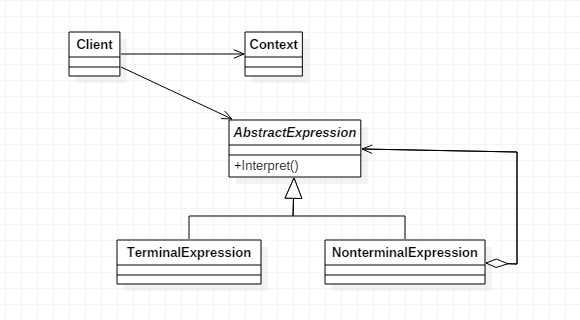

# 解释器模式

> Interpreter。

## 定义

- 给定一个语言，定义它的文法的一种表示，并定义一个解释器，这个解释器使用该表示来解释语言中的句子。


## 使用场景

- 可以将一个需要解释执行的语言中的句子表示为一个抽象语法树。

- 一些重复出现的问题可以用一种简单的语言来表达。
- 一个简单语法需要解释的场景。

## 优点

- 可扩展性好。


## 缺点

- 解释器模式会引起类膨胀。

- 解释器模式采用递归调用方法，将会导致调试非常复杂。
- 使用了大量的循环和递归，效率是一个不容忽视的问题。

## 类图

- `Context` 是环境角色，包含解释器之外的一些全局信息。
- `AbstractExpression` 为抽象表达式，声明一个抽象的解释操作，这个接口为抽象语法树中所有的节点所共享。
- `TerminalExression` 为终结符表达式，实现与文法中的终结符相关联的解释操作。
- `NonterminalExpression` 为非终结符表达式，为文法中的非终结符实现解释操作，对文法中每一条规则R1、R2……Rn都需要一个具体的非终结符表达式类。



## 代码

### Context环境角色

```java
public class Context {

    private String input;
    private String output;

    public String getInput() {
        return input;
    }
    public void setInput(String input) {
        this.input = input;
    }
    public String getOutput() {
        return output;
    }
    public void setOutput(String output) {
        this.output = output;
    }

}
```

### 抽象表达式

- 抽象表达式是生成语法集合（语法树）的关键，每个语法集合完成指定语法解析任务，它是通过递归调用的方式，最终由最小的语法单元进行解析完成。

```java
public abstract class AbstractExpression {
    public abstract void Interpret(Context context);
}
```

### 终结符表达式

- 通常，终结符表达式比较简单，主要处理场景元素和数据的转换。

```java
public class TerminalExpression extends AbstractExpression {

    @Override
    public void Interpret(Context context) {
        System.out.println("终端解释器");
    }

}
```

### 非终结符表达式

- 每个非终结符表达式都代表了一个文法规则，并且每个文法规则都只关心自己周边的文法规则的结果，因此这就产生了每个非终结符表达式调用自己周边的非终结符表达式，然后最终、最小的文法规则就是终结符表达式。

```java
public class NonterminalExpression extends AbstractExpression {

    @Override
    public void Interpret(Context context) {
        System.out.println("非终端解释器");
    }

}
```

### Client客户端

- 其中list为一个语法容器，容纳一个具体的表达式。
- 通常Client是一个封装类，封装的结果就是传递进来一个规范语法文件，解析器分析后产生结果并返回，避免了调用者与语法分析器的耦合关系。

```java
public class Client {

    public static void main(String[] args) {
        Context context = new Context();
        List<AbstractExpression> list = new ArrayList<>();

        list.add(new TerminalExpression());
        list.add(new NonterminalExpression());
        list.add(new TerminalExpression());
        list.add(new TerminalExpression());

        for (AbstractExpression abstractExpression : list) {
            abstractExpression.Interpret(context);
        }
    }

}
```

