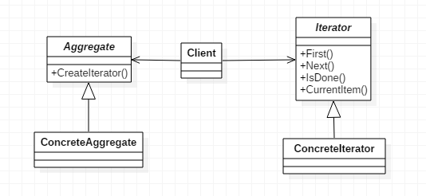

# 迭代器模式

> Iterator。

## 定义

- 迭代器这个词在Java中出现过，即Java中使用Iterator迭代器对集合进行遍历，但迭代器模式算是一个**没落**的模式，基本上没人会单独写一个迭代器，除非是产品性质的开发。
- 迭代器模式提供一种方法**顺序访问**一个聚合对象中各个元素，而又**不暴露该对象的内部**表示。

## 使用场景

- 访问一个聚合对象的内容无需暴露它的内部表示时。
- 需要为聚合对象提供多种便利方式时。
- 为遍历不同的聚合结构提供一个统一的接口。

## 优点

- 支持以不同的方式遍历一个聚合对象。
- 迭代器简化了聚合类。
- 在同一个聚合上可以有多个遍历。
- 增加新的聚合类和迭代器类都很方便，无需修改原有代码。

## 缺点

- 增加了系统的复杂性。因为迭代器模式将存储数据和遍历数据的职责分离，增加了新的聚合类需要对应增加新的迭代器类，增加了系统的复杂性。

## 类图

- `Aggregate`是聚集抽象类，负责提供创建具体迭代器角色的接口。
- `Iterator`是迭代抽象类，用于定义得到开始对象、得到下一个对象、判断是否到结尾、当前对象等抽象方法，统一接口。
- `ConcreteAggregate`是具体聚集类，继承`Aggregate`。
- `ConcreteIterator`是具体迭代器类，继承Iterator，实现开始、下一个、是否结尾、当前对象等方法。



## 代码

### 抽象容器

- 负责提供接口，比如存在一个类似createIterator()这样的方法，在Java中一般是iterator()方法。

```java
public interface Aggregate {

    public void add(Object object);

    public void remove(Object object);

    public Iterator iterator();

}
```

### 抽象迭代器

- 负责定义访问和遍历元素的接口，基本上有固定的三个方法。
  - `first()`获取第一个元素。
  - `next()`访问下一个元素。
  - `hasNext()`是否已经遍历到底部。

```java
public interface Iterator {

    public Object next();    //遍历到下一个元素

    public boolean hasNext();    //是否已经遍历到尾部

    public boolean remove();    //删除当前指向的元素

}
```

### 具体容器

```java
public class ConcreteAggregate implements Aggregate {

    private Vector vector = new Vector();

    @Override
    public void add(Object object) {
        this.vector.add(object);
    }

    public void remove(Object object) {
        this.remove(object);
    }

    @Override
    public Iterator iterator() {
        return new ConcreteIterator(this.vector);
    }

}
```


### 具体迭代器

- 简单的实现就是通过一个游标，在一个容器中上下翻滚，遍历所有它需要查看的元素。

```java
public class ConcreteIterator implements Iterator {

    private Vector vector = new Vector();
    public int cursor = 0;    //定义当前游标

    public ConcreteIterator(Vector vector) {
        this.vector = vector;
    }

    @Override
    public Object next() {
        Object result = null;

        if (this.hasNext()) {
            result = this.vector.get(this.cursor ++);
        } else {
            result = null;
        }
        return result;
    }

    @Override
    public boolean hasNext() {
        if (this.cursor == this.vector.size()) {
            return false;
        }

        return true;
    }

    @Override
    public boolean remove() {
        this.vector.remove(this.cursor);
        return true;
    }

}
```

### Client客户端

```java
public class Client {

    public static void main(String[] args) {
        Aggregate aggregate = new ConcreteAggregate();
        aggregate.add("abc");
        aggregate.add("aaa");
        aggregate.add("1234");

        //遍历
        Iterator iterator = aggregate.iterator();
        while (iterator.hasNext()) {
            System.out.println(iterator.next());
        }
    }

}
```

