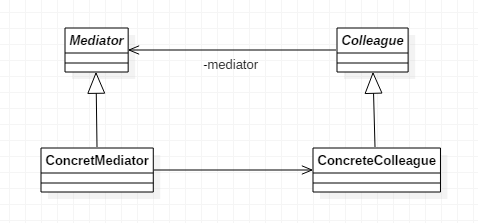

# 中介者模式

>Mediator。

## 定义

- 用一个中介对象来封装一系列的对象交互。
- 中介者使各个对象不需要显式地相互引用，从而使其耦合松散，而且可以独立地改变它们之间的交互。

## 使用场景

- 系统中对象之间存在比较复杂的引用关系。
- 想通过一个中间类来封装多个类的行为，而又不想生成太多的子类。

## 优点

- 减少类间依赖，降低了耦合。
- 符合迪米特原则。

## 缺点

- 中介者会膨胀的很大，而且逻辑复杂。

## 类图

- `Mediator` 是抽象中介者，定义了同事对象到中介者对象的接口。
- `Colleague` 是抽象同事类。
- `ConcreteMediator` 是具体中介者对象，实现抽象类的方法，它需要知道所有具体同事类，并从具体同事接收消息，向具体同事对象发出命令。
- `ConcreteColleague` 是具体同事类，每个具体同事只知道自己的行为，而不了解其它同事类的情况，但它们却都认识中介者对象。



## 代码

### 抽象中介者

- 抽象中介者角色定义统一的接口，用于各同事角色之间的通信。

```java
public abstract class Mediator {

    // 抽象的发送消息方法
    public abstract void send(String message, Colleague colleague);

}
```

### 抽象同事类

- 每一个同事角色都知道中介者角色，而且与其它的同事角色通信的时候，一定要通过中介者角色协作。
- 每个同事类的行为分两种。
  - 一种是同事本身行为，比如改变对象本身的状态，处理自己的行为等，这种行为叫做自发行为，与其它同事类或者中介者没有任何依赖。
  - 第二种是必须依赖中介者才能完成的行为，叫做依赖方法。

```java
public abstract class Colleague {

    protected Mediator mediator;

    public Colleague(Mediator mediator) {
        this.mediator = mediator;
    }

}
```

### 具体中介者类

- 具体中介者角色通过协调各同事角色实现协作行为，因此它必须依赖于各个同事角色。

```java
public class ConcreteMediator extends Mediator {

    private ConcreteColleague1 colleague1;
    private ConcreteColleague2 colleague2;

    public void setColleague1(ConcreteColleague1 colleague1) {
        this.colleague1 = colleague1;
    }

    public void setColleague2(ConcreteColleague2 colleague2) {
        this.colleague2 = colleague2;
    }

    @Override
    public void send(String message, Colleague colleague) {
        if(colleague == colleague1) {
            colleague2.notify(message);
        } else {
            colleague1.notify(message);
        }
    }

}
```

### 具体同事类

- 这里以ConcreteColleague1为例，ConcreteColleague2不再赘述。

```java
public class ConcreteColleague1 extends Colleague {

    public ConcreteColleague1(Mediator mediator) {
        super(mediator);
    }

    public void send(String message) {
        mediator.send(message, this);
    }

    public void notify(String message) {
        System.out.println("同事1得到消息：" + message);
    }

}
```

### Client客户端

- 创建一个具体中介者对象。
- 实例化两个具体同事类并与该中介者进行绑定，colleague1与colleague2通过中介者发送信息。

```java
public class Client {

    public static void main(String[] args) {
        ConcreteMediator mediator = new ConcreteMediator();

        ConcreteColleague1 colleague1 = new ConcreteColleague1(mediator);
        ConcreteColleague2 colleague2 = new ConcreteColleague2(mediator);

        mediator.setColleague1(colleague1);
        mediator.setColleague2(colleague2);

        colleague1.send("Nice to meet u.");
        colleague2.send("Nice to meet u too.");
    }

}
```

