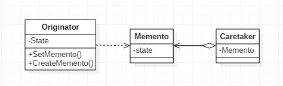

# 备忘录模式

> Memento。

## 定义

- 在不破坏封装性的前提下，捕获一个对象的内部状态，并在该对象之外保存着这个状态。这样以后就可将该对象恢复到原先保存的状态。

- 为了符合迪米特法则，需要有一个管理备忘录的类
- 不要在频繁建立备份的场景中使用备忘录模式。为了节约内存，可使用原型模式+备忘录模式

## 使用场景

- 需要保存和恢复数据的相关场景。
- 提供一个可回滚的操作，如ctrl+z、浏览器回退按钮、Backspace键等。
- 需要监控的副本场景。

## 优点

- 给用户提供了一种可以恢复状态的机制，可以使用能够比较方便地回到某个历史的状态。
- 实现了信息的封装，使得用户不需要关心状态的保存细节。

## 缺点

- 消耗资源。

## 类图



## 代码

### 发起人角色

- 记录当前时刻的内部状态，并负责创建和恢复备忘录数据，允许访问返回到先前状态所需的所有数据。

```java
public class Originator {

    private String state;

    public String getState() {
        return state;
    }

    public void setState(String state) {
        this.state = state;
    }

    public Memento createMento() {
        return (new Memento(state));
    }

    public void setMemento(Memento memento) {
        state = memento.getState();
    }

    public void show() {
        System.out.println("state = " + state);
    }

}
```

### 备忘录角色

- 负责存储Originator发起人对象的内部状态，在需要的时候提供发起人需要的内部状态。

```java
public class Memento {

    private String state;

    public Memento(String state) {
        this.state = state;
    }

    public String getState() {
        return state;
    }

}
```

### 备忘录管理员角色

- 对备忘录进行管理、保存和提供备忘录，只能将备忘录传递给其他角色。

```java
public class Caretaker {

    private Memento memento;

    public Memento getMemento() {
        return memento;
    }

    public void setMemento(Memento memento) {
        this.memento = memento;
    }

}
```

### Client客户端

```java
public class Client {

    public static void main(String[] args) {
        Originator originator = new Originator();
        originator.setState("On");    //Originator初始状态
        originator.show();

        Caretaker caretaker = new Caretaker();
        caretaker.setMemento(originator.createMento());

        originator.setState("Off");    //Originator状态变为Off
        originator.show();

        originator.setMemento(caretaker.getMemento());    //回复初始状态
        originator.show();
    }

}
```

## 代码示例

### 要记录的类

```java
public class Person implements Serializable {

    public Person(String name, Integer age) {
        this.name = name;
        this.age = age;
    }

    public Person(Person p) {
        this.name = p.name;
        this.age = p.age;
    }

    String name;
    Integer age;

    @Override
    public String toString() {
        return "Person {" +
            "name='" + name + '\'' +
            ", age=" + age +
            '}';
    }
}
```

### 备忘录类

```java
public class Momentor {

    private Person state;

    public Person getState() {
        return state;
    }

    public void setState(Person p) {
        this.state = new Person(p);
    }
}
```


### Client

```java
public class MomentoTest {

    public static void main(String[] args) {
        Person p = new Person("zhangsan",18);
        System.out.println(p);
        Momentor m = new Momentor();
        m.setState(p);
        p.age = 19;
        p.name = "lisi";
        System.out.println(p);
        p = m.getState();
        System.out.println(p);
    }

}
```

