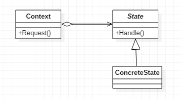

# 状态模式

>State。

## 定义

- 当一个对象的内在状态改变时允许改变其行为，这个对象看起来像是改变了其类。

## 使用场景

- 行为随状态改变而改变的场景。
- 条件、分支判断语句的替代者。

## 优点

- 结构清晰，避免了过多的switch…case或if…else语句的使用。
- 很好的体现了开闭原则和单一职责原则，想要增加状态就增加子类，想要修改状态就修改子类即可。
- 封装性非常好，状态变化放置到了类的内部来实现，外部调用不需要知道类内部如何实现状态和行为的变换。

## 缺点

- 子类会太多，也即类膨胀。

## 类图



## 代码

### Context类

环境角色具有两个职责，即处理本状态必须完成的任务，及决定是否可以过渡到其它状态。对于环境角色，有几个不成文的约束：

- 即把状态对象声明为静态常量，有几个状态对象就声明几个状态常量。
- 环境角色具有状态抽象角色定义的所有行为，具体执行使用委托方式。

```java
public class Context {

    //定义状态
    public final static State STATE1 = new ConcreteState1();
    public final static State STATE2 = new ConcreteState2();

    //当前状态
    private State currentState;

    //获得当前状态
    public State getCurrentState() {
        return currentState;
    }

    //设置当前状态
    public void setCurrentState(State currentState) {
        this.currentState = currentState;
//        System.out.println("当前状态：" + currentState);
        //切换状态
        this.currentState.setContext(this);
    }

    public void handle1() {
        this.currentState.handle1();
    }
    public void handle2() {
        this.currentState.handle2();
    }

}
```

### State抽象状态类

- 抽象环境中声明一个环境角色，提供各个状态类自行访问，并且提供所有状态的抽象行为，由各个实现类实现。

```java
public abstract class State {

    protected Context context;
    public void setContext(Context context) {
        this.context = context;
    }

    // 行为1
    public abstract void handle1();
    // 行为2
    public abstract void handle2();

}
```

### 具体状态

- 具体状态实现，这里以定义ConcreteState1和ConcreteState2两个具体状态类为例，ConcreteState2的具体内容同ConcreteState1。

```java
public class ConcreteState1 extends State {

    @Override
    public void handle1() {
        //...
        System.out.println("ConcreteState1 的 handle1 方法");
    }

    @Override
    public void handle2() {
        super.context.setCurrentState(Context.STATE2);
        System.out.println("ConcreteState1 的 handle2 方法");
    }

}
```

### Client客户端

```java
public class Client {

    public static void main(String[] args) {
        //定义环境角色
        Context context = new Context();
        //初始化状态
        context.setCurrentState(new ConcreteState1());
        //行为执行
        context.handle1();
        context.handle2();
    }

}
```

## 代码示例

### 容器类

```java
public class QiuQiu {

    public QiuQiu(StateAction state) {
        this.state = state;
    }

    private StateAction state;

    void say() {
        state.say();
    }

    void cry() {
        state.cry();
    }
}
```

### State抽象状态类

```java
public abstract class StateAction {

    abstract void say();

    abstract void cry();

}
```

### State实现类

```java
public class HappyState extends StateAction{

    @Override
    void say() {
        System.out.println("happy say");
    }

    @Override
    void cry() {
        System.out.println("happy cry");
    }
}


public class SadState extends StateAction{

    @Override
    void say() {
        System.out.println("sad say");
    }

    @Override
    void cry() {
        System.out.println("sad cry");
    }
}
```


## 有限状态机

