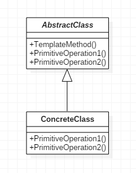

# 模板方法模式

>TemplateMethod。

## 定义

- 定义一个操作中的算法的骨架，而将一些步骤延迟到子类中，使得子类可以不改变一个算法的结构即可重定义该算法的某些特定步骤。

## 使用场景

- 有一些通用的方法时。
- 有多个子类共有的方法，且逻辑相同。
- 重要的、复杂的方法，可以考虑作为模板方法。
- 重构时，模板方法模式是一个经常使用到的模式，把相同的代码抽取到父类中，通过钩子函数约束其行为。

## 优点

- 封装不变部分，扩展可变部分。
- 提取公共部分代码，便于维护。
- 行为由父类控制，子类实现。

## 缺点

- 每一个不同的实现都需要一个子类实现，导致类的个数增加，使得系统更加庞大。

## 类图



## 代码

### 抽象模板类

- 定义一个模板方法来组合`PrimitiveOperation1()`和`PrimitiveOperation2()`两个方法形成一个算法，然后让子类重定义这两个方法。

```java
public abstract class AbstractClass {

    public abstract void PrimitiveOperation1();
    public abstract void PrimitiveOperation2();

    public void TemplateMethod() {
        PrimitiveOperation1();
        PrimitiveOperation2();
    }

}
```

### 具体模板类

- 这里定义两个具体模板类，ConcreteClassA及ConcreteClassB来进行测试，继承抽象模板类，实现具体方法。

```java
public class ConcreteClassA extends AbstractClass {

    @Override
    public void PrimitiveOperation1() {
        System.out.println("具体方法A方法1实现");
    }

    @Override
    public void PrimitiveOperation2() {
        System.out.println("具体方法A方法2实现");
    }

}
```

### Client客户端

- 通过调用模板方法来分别得到不同的结果。

```java
public class Client {

    public static void main(String[] args) {
        AbstractClass abstractClass;

        abstractClass = new ConcreteClassA();
        abstractClass.TemplateMethod();

        abstractClass = new ConcreteClassB();
        abstractClass.TemplateMethod();
    }

}
```

## 代码示例

### 抽象模板类

```java
public abstract class Template {

    public void doIt() {
        doFirst();
        doSecond();
    }

    protected abstract void doSecond();

    protected abstract void doFirst();

}
```

### 实现类

```java
public class PrintTemplate extends Template{

    @Override
    protected void doSecond() {
        System.out.println("print do second");
    }

    @Override
    protected void doFirst() {
        System.out.println("print do first");

    }
}

public class WriteTemplate extends Template{

    @Override
    protected void doSecond() {
        System.out.println("write do second");
    }

    @Override
    protected void doFirst() {
        System.out.println("write do first");

    }
}
```

### 客户端

```java
public class MethodTemplateTest {

    public static void main(String[] args) {
        Template t = new PrintTemplate();
        t.doIt();
        t = new WriteTemplate();
        t.doIt();
    }

}
```

