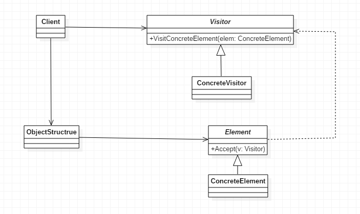

# 访问者模式

> Visitor，在结构不变的情况下动态改变对于内部元素的动作。

## 定义

访问者模式是一个相对比较简单，但结构又稍显复杂的模式，它讲的是表示一个作用于某对象结构中的各元素的操作，它使你可以在不改变各元素的类的前提下定义作用于这些元素的新操作。

## 使用场景

- 一个对象结构包含很多类对象，它们有不同的接口，而你想对这些对象实施一些依赖与其具体类的操作，也就是用迭代器模式已经不能胜任的情景。
- 需要对一个对结构中的对象进行很多不同并且不相关的操作，而你想避免让这些操作“污染”这些对象。
- 访问者模式适用于数据结构相对**稳定**的系统。
- 绝大多数的使用场景是用在**抽象语法树**（AST）上，编译器根据抽象语法树进行不同的操作。

## 优点

- 符合单一职责原则。
- 优秀的扩展性。
- 灵活性非常高。

## 缺点

- 具体元素对访问者公布细节，也就是说访问者关注了其他类的内部细节，这是迪米特法则所不建议的。
- 具体元素变更比较困难。
- 违背了依赖倒转原则。访问者依赖的是具体元素，而不是抽象元素。

## 类图



## 代码实现

### 抽象访问者

- 此处可为抽象类或接口，用于声明访问者可以访问哪些元素，具体到程序中就是visit方法的参数定义哪些对象是可以被访问的。

```java
public abstract class Visitor {

    public abstract void visitConcreteElementA(ConcreteElementA concreteElementA);

    public abstract void visitConcreteElementB(ConcreteElementB concreteElementB);

}
```

### 具体访问者

- 影响访问者访问到一个类后该干什么、怎么干。

```java
public class ConcreteVisitor1 extends Visitor {

    @Override
    public void visitConcreteElementA(ConcreteElementA concreteElementA) {
        System.out.println(concreteElementA.getClass().getName() + " 被 " + this.getClass().getName() + " 访问");
    }

    @Override
    public void visitConcreteElementB(ConcreteElementB concreteElementB) {
        System.out.println(concreteElementB.getClass().getName() + " 被 " + this.getClass().getName() + " 访问");
    }

}
```


### 抽象元素

- 此处为接口后抽象类，用于声明接受哪一类访问者访问，程序上是通过accpet方法中的参数来定义的。

```java
public abstract class Element {
     
     public abstract void accept(Visitor visitor);
 
}
```

### 具体元素

- 实现accept方法，通常是visitor.visit(this)。

```java
public class ConcreteElementA extends Element {

    @Override
    public void accept(Visitor visitor) {
        visitor.visitConcreteElementA(this);
    }

    //其它方法
    public void operationA() {

    }
}
```

### 结构对象

- 元素生产者，一般容纳在多个不同类、不同接口的容器，如List、Set、Map等，在项目中，一般很少抽象出这个角色。

```java
public class ObjectStructure {

    private List<Element> elements = new LinkedList<>();

    public void attach(Element element) {
        elements.add(element);
    }

    public void detach(Element element) {
        elements.remove(element);
    }

    public void accept(Visitor visitor) {
        for (Element element : elements) {
            element.accept(visitor);
        }
    }

}
```

### Client客户端

```java
public class Client {

    public static void main(String[] args) {
        ObjectStructure objectStructure = new ObjectStructure();

        objectStructure.attach(new ConcreteElementA());
        objectStructure.attach(new ConcreteElementB());

        ConcreteVisitor1 visitor1 = new ConcreteVisitor1();
        ConcreteVisitor2 visitor2 = new ConcreteVisitor2();

        objectStructure.accept(visitor1);
        objectStructure.accept(visitor2);
    }

}
```

