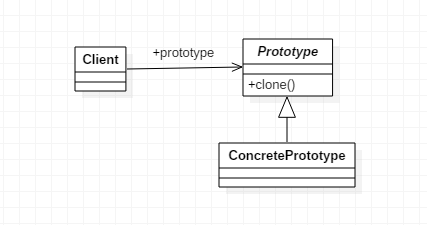

# 原型模式

>Prototype。

### 定义

- 用原型实例指定创建对象的种类，并且通过拷贝这些原型创建新的对象。

## 使用场景

- 资源优化场景。
- 性能和安全要求的场景。
- 一个对象多个修改者的场景。
- 一般与工厂方法模式一起出现，通过clone方法创建一个对象，然后由工厂方法提供给调用者。

## 类图



## 优点

- 性能优良。不用重新初始化对象，而是动态地获取对象运行时的状态。
- 逃避构造函数的约束。

## 缺点

- 配置克隆方法需要对类的功能进行通盘考虑。
- 必须实现Cloneable接口。

## 代码

### Prototype

```java
public abstract class Prototype implements Cloneable {

    private String id;

    public Prototype(String id) {
        this.id = id;
    }

    public String getId() {
        return id;
    }

    @Override
    public Prototype clone() {
        Prototype prototype = null;

        try {
            prototype = (Prototype) super.clone();
        } catch (CloneNotSupportedException e) {
            e.printStackTrace();
        }

        return prototype;
    }

}
```

### ConcretePrototype

- 创建当前对象的浅表副本。

```java
public class ConcretePrototype extends Prototype {

    public ConcretePrototype(String id) {
        super(id);
    }

}
```

### Client

```java
public class Client {

    public static void main(String[] args) {
        ConcretePrototype p1 = new ConcretePrototype("Hello");
        ConcretePrototype c1 = (ConcretePrototype) p1.clone();
        System.out.println(c1.getId());
    }

}
```

## 代码示例

### 浅克隆

- 要被克隆的类实现Cloneable接口，标记性接口，不实现在运行期间会报错。
- 重写`clone()`方法。
- `Obj obj2 = obj1.clone()`。

```java
public class Person implements Cloneable {

    public Person(String name, Integer age) {
        this.name = name;
        this.age = age;
    }

    String name;

    Integer age;

    Location location;

    @Override
    protected Object clone() throws CloneNotSupportedException {
        return super.clone();
    }

    @Override
    public String toString() {
        return "Person{" +
            "name='" + name + '\'' +
            ", age=" + age +
            ", location=" + location +
            '}';
    }
}


public class Location {

    String provice;

    String city;

    public Location(String provice, String city) {
        this.provice = provice;
        this.city = city;
    }

    @Override
    public String toString() {
        return "Location{" +
            "provice='" + provice + '\'' +
            ", city='" + city + '\'' +
            '}';
    }
}

public class PrototypeTest {

    public static void main(String[] args) throws CloneNotSupportedException {
        Person zs = new Person("zhangsan", 17);
        zs.location = new Location("beijng", "beijing");
        Person ls = (Person) zs.clone();
        System.out.println(ls);
    }

}
```


### 深克隆

- 外部类的clone方法内调用引用属性类的clone方法。
- 将引用进行深克隆。
- 单纯的String类型不用深拷贝。
- StringBuilder、new String的对象需要进行深拷贝。

```java
public class Location implements Cloneable {

    String provice;

    String city;

    public Location(String provice, String city) {
        this.provice = provice;
        this.city = city;
    }

    @Override
    protected Object clone() throws CloneNotSupportedException {
        return super.clone();
    }

    @Override
    public String toString() {
        return "Location{" +
            "provice='" + provice + '\'' +
            ", city='" + city + '\'' +
            '}';
    }
}

public class Person implements Cloneable {

    public Person(String name, Integer age) {
        this.name = name;
        this.age = age;
    }

    String name;

    Integer age;

    Location location;

    @Override
    protected Object clone() throws CloneNotSupportedException {
        Person clone = (Person) super.clone();
        clone.location = (Location) this.location.clone();
        return clone;
    }

    @Override
    public String toString() {
        return "Person{" +
            "name='" + name + '\'' +
            ", age=" + age +
            ", location=" + location +
            '}';
    }
}


public class PrototypeTest {

    public static void main(String[] args) throws CloneNotSupportedException {
        Person zs = new Person("zhangsan", 17);
        zs.location = new Location("beijng", "beijing");
        Person ls = (Person) zs.clone();
        zs.location.provice = "shanghai";
        zs.location.city = "shanghai";
        ls.name = "lisi";
        System.out.println(zs);
        System.out.println(ls);
    }

}

```

