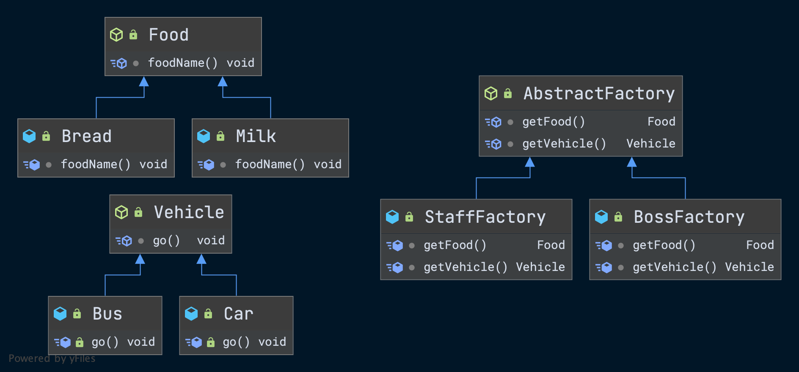

# 抽象工厂方法模式

## 定义

- 用于灵活指定和切换**产品族**的设计模式，可以获取同一系列产品族的各项产品实现对象。

- 想要获取一个新的产品族组合，只需要新建一个全新的产品族工厂即可。

- 当产品族中增加新的一项产品的时候，所有的抽象工厂的实现都需要修改。

  

  

## 类结构图



## 代码

### 抽象工厂

```java
public abstract class AbstractFactory {

    abstract Food getFood();

    abstract Vehicle getVehicle();

}
```

### 具体产品族工厂实现

```java
public class BossFactory extends AbstractFactory {

    @Override
    Food getFood() {
        return new Milk();
    }

    @Override
    Vehicle getVehicle() {
        return new Car();
    }
}
```

```java
public class StaffFactory extends AbstractFactory {

    @Override
    Food getFood() {
        return new Bread();
    }

    @Override
    Vehicle getVehicle() {
        return new Bus();
    }
}
```

### 交通工具

```java
public abstract class Vehicle {

    abstract void go();

}
```

### 具体交通工具

```java
public class Car extends Vehicle {

    @Override
    public void go() {
        System.out.println("car go dididi...");
    }
}

public class Bus extends Vehicle {

    @Override
    public void go() {
        System.out.println("bus go huhuhu...");
    }
}
```

### 食物

```java
public abstract class Food {

    abstract void foodName();

}
```

### 具体食物

```java
public class Milk extends Food {
    
    @Override
    void foodName() {
        System.out.println("i'm milk...");
    }
}

public class Bread extends Food {

    @Override
    void foodName() {
        System.out.println("i'm bread...");
    }
}
```

