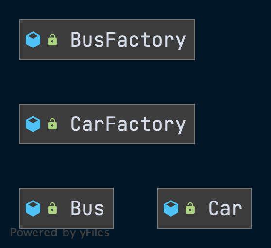

# 工厂方法模式

## 定义

- 任何可以产生对象的方式或者类，都可以称之为工厂。
- 单例也是一种工厂。

## 简单工厂

- 不在GOF的23种设计模式中。
- 封装了产品的生成过程，可以自定义生产过程。
- 简单工厂的扩展性不好，每次增加一个产品都需要修改现有的工厂类。

### 代码

- 通用的工厂，定制多种产品。

```java
public class SimpleVehicleFactory {

    public Car getCar() {
        System.out.println("do something");
        return new Car();
    }

    public Bus getBus() {
        System.out.println("do something");
        return new Bus();
    }

}
```

- 专属的工厂，定制专属的产品，新的产品的产生不需要修改历史的类。
- 但是每新产生一种产品，都需要配置一个专属的工厂，当产品过多的时候，会造成工厂类爆炸。

```java
public class CarFactory {

    public Movealbe create() {
        System.out.println("do ...");
        return new Car();
    }

}
```


## 静态工厂

- 不在GOF的23种设计模式中。

## 工厂方法

>Factory Method。

- 在产品维度容易扩展，产生一个新的产品就对应创建一个新的工厂即可。
- 随着产品类数量的增多，容易造成类爆炸。

### 类图



### 代码

略