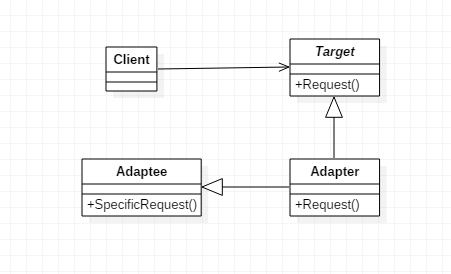
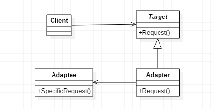

# 适配器模式

> Adapter。

## 定义

- **适配器模式（Adapter）**，将一个类的接口转换成客户希望的另外一个接口。使原本由于接口不兼容而不能一起工作的那些类可以一起工作。

## 使用场景

- 系统需要使用现有的类，而此类的接口不符合系统的需要。
- 想建立一个可以重复使用的类，用于一些彼此之间没有太大关联的一些类。
- 通过接口转换，将一个类插入另一个类系中。

## 优点

- 可以让任何两个没有关联的类一起运行。
- 增加了类的透明性。我们访问Target目标角色，但具体实现都委托给了源角色，而这些对高层模块是透明的，也是不需要关心的。
- 提高了类的复用度。源角色在原有的系统中还是可以正常使用，而在目标角色中也可以充当新的演员。
- 灵活性非常好。什么时候不想要适配器了，直接删掉就可以了，基本上就类似一个灵活的构件，想用就用，不想用就卸载。

## 缺点

- 过多使用适配器，会使系统非常零乱。
- 由于Java至多继承一个类，所以至多只能适配一个适配者类，而且目标类必须是抽象类。

## 类图

### 类适配器

- 通过继承进行适配（类间继承）。



### 对象适配器

-  通过对象层次的关联关系进行委托（对象的合成关系/关联关系）。



## 代码

### 类适配器

#### Target

- Target目标角色，该角色定义把其他类转换为何种接口，也就是期望接口，通常情况下是一个接口或一个抽象类，一般不会是实现类。

```java
public interface Target {
    
    public void request();
 
}
```

#### Adaptee

- Adaptee源角色，想把谁转换为目标角色，这个“谁”就是源角色，它是已经存在的、运行良好的类或对象。

```java
public class Adaptee {

    public void specificRequest() {
        System.out.println("特殊请求");
    }

}
```

#### Adapter

- Adapter适配器角色，是适配器模式的核心角色，它的职责是通过继承或是类关联的方式把源角色转换为目标角色。

```java
public class Adapter extends Adaptee implements Target {

    @Override
    public void request() {
        super.specificRequest();
    }

}
```

#### ConcreteTarget

- 目标角色的实现类。

```java
public class ConcreteTarget implements Target {

    @Override
    public void request() {
        System.out.println("普通请求");
    }

}
```

#### Client

```java
public class Client {

    public static void main(String[] args) {
        //原有业务逻辑
        Target target = new ConcreteTarget();
        target.request();

        //增加适配器后的业务逻辑
        Target target2 = new Adapter();
        target2.request();
    }

}
```

### 对象适配器

- 通过对象层次的关联关系进行委托（对象的合成关系/关联关系）。

#### Target

- 客户所期待的接口。目标可以是具体的或抽象的类，也可以是接口。

```java
public class Target {

    public void request() {
        System.out.println("普通请求");
    }

}
```

#### Adaptee

-  需要适配的类。

```java
public class Adaptee {

    public void specificRequest() {
        System.out.println("特殊请求");
    }

}
```

#### Adapter

- 通过在内部包装一个Adaptee对象，把源接口转换成目标接口。

```java
public class Adapter extends Target {

    private Adaptee adaptee = new Adaptee();

    @Override
    public void request() {
        adaptee.specificRequest();
    }
}
```

#### Client

```java
public class Client {

    public static void main(String[] args) {
        Target target = new Adapter();
        target.request();
    }

}
```

