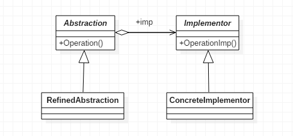

# 桥接模式

> Bridge。

## 定义

-  **桥接模式（Bridge）**，将抽象部分与它的实现部分分离，使它们都可以独立地变化。

## 使用场景

- 系统可能有多个角度分类，每一种角度都可能变化时。
- 不希望或不适用使用继承的场景。
- 接口或抽象类不稳定的场景。
- 重用性要求较高的场景。

## 优点

- 抽象和实现分离。桥梁模式完全是为了解决继承的缺点而提出的设计模式。
- 优秀的扩展能力。
- 实现细节对客户透明。客户不用关心细节的实现，它已经由抽象层通过聚合关系完成了封装。

## 缺点

- 会增加系统的理解与设计难度。由于聚合关联关系建立在抽象层，要求开发者针对抽象进行设计与编程。

## 类图



## 代码

### Abstraction抽象类

```java
public abstract class Abstraction {

    private Implementor imp;

    //约束子类必须实现该构造函数
    public Abstraction(Implementor imp) {
        this.imp = imp;
    }

    public Implementor getImp() {
        return imp;
    }

    //自身的行为和属性
    public void request() {
        this.imp.doSomething();
    }

}
```

### Implementor抽象类

```java
public abstract class Implementor {

    public abstract void doSomething();
    public abstract void doAnything();

}
```

### ConcreteImplementor

```java
public class ConcreteImplementorA extends Implementor {

    @Override
    public void doSomething() {
        System.out.println("具体实现A的doSomething执行");
    }

    @Override
    public void doAnything() {
        System.out.println("具体实现A的doAnything执行");
    }
}
```

### RefinedAbstraction

```java
public class RefinedAbstraction extends Abstraction {

    // 覆写构造函数
    public RefinedAbstraction(Implementor imp) {
        super(imp);
    }

    // 修正父类行为
    @Override
    public void request() {
        super.request();
        super.getImp().doAnything();
    }

}
```

### Client客户端

```java
public class Client {

    public static void main(String[] args) {
        Implementor imp = new ConcreteImplementorA();
        Abstraction abs = new RefinedAbstraction(imp);
        abs.request();
    }

}
```

## 代码示例

### 父类及父类实现类

```java
public class Gift {

    public Gift(String name) {
        this.name = name;
    }

    protected String name;

    protected GiftImpl impl;

}

public class GiftImpl extends Gift {

    public GiftImpl(String name) {
        super(name);
    }
}
```

### 父类维度扩展的子类

```java
public class WarmGift extends Gift {

    protected GiftImpl impl;

    public WarmGift(String name) {
        super(name);
    }
}

public class CoolGift extends Gift {

    protected String name;

    protected GiftImpl impl;

    public CoolGift(String name) {
        super(name);
    }
}
```

### 实现类维度扩展的子类

```java
public class CarGiftImpl extends GiftImpl {

    public CarGiftImpl(String name) {
        super(name);
    }

}

public class FlowerGiftImpl extends GiftImpl {

    public FlowerGiftImpl(String name) {
        super(name);
    }
}

```

### 客户端

```java
public class BridgeTest {

    public static void main(String[] args) {

        Gift warmGift = new WarmGift("温馨的礼物");
        warmGift.impl = new FlowerGiftImpl("小跑车");
        System.out.println(warmGift.name + warmGift.impl.name);
    }

}
```

