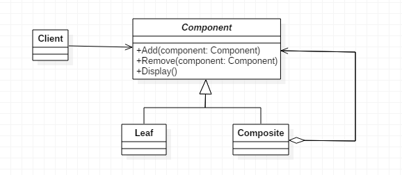

# 组合模式

>Composite。

## 定义

- 树状结构专用模式。

## 类图




## 优点

- 高层模块调用简单。一棵树形机构中的所有节点都是Component，局部和整体对调用者来说没有任何区别，高层模块不必关心自己处理的是单个对象还是整个组合结构。

## 缺点

- 使用组合模式时，其叶子和树枝的声明都是实现类，而不是接口，违反了依赖倒转原则。

## 代码

### Node接口

```java
public interface Node {

    void print();

}
```

### 实现类

```java
public class Dir implements Node {

    String name;

    public Dir(String name) {
        this.name = name;
    }

    public List<Node> nodes = new ArrayList<>();

    public void add(Node n) {
        nodes.add(n);
    }

    @Override
    public void print() {
        System.out.println(name);
    }
}

public class File implements Node {

    String name;

    public File(String name) {
        this.name = name;
    }

    @Override
    public void print() {
        System.out.println(name);
    }
}
```

### 客户端调用

```java
public class CompositeTest {

    public static void main(String[] args) {
        Dir root = new Dir("D:\\");
        Dir dir1 = new Dir("vedio");
        File f11 = new File("龙珠Z.mp4");
        File f12 = new File("大鱼海棠.mp4");
        Dir dir11 = new Dir("火影忍者");
        Dir dir2 = new Dir("book");
        Dir dir21 = new Dir("chinese");
        File f211 = new File("西游记.txt");
        Dir dir22 = new Dir("english");
        File f222 = new File("哈姆雷特.txt");
        root.add(dir1);
        dir1.add(f11);
        dir1.add(f12);
        dir1.add(dir11);
        root.add(dir2);
        dir2.add(dir21);
        dir2.add(dir22);
        dir21.add(f211);
        dir22.add(f222);
        printNodes(root, 0);
    }

    private static void printNodes(Node root, int depth) {
        for (int i = 0; i < depth; i++) {
            System.out.print("-");
        }
        root.print();
        if (root instanceof Dir) {
            for (Node node : ((Dir) root).nodes) {
                printNodes(node, depth + 2);
            }
        }
    }

}
```

## 树的安全模式