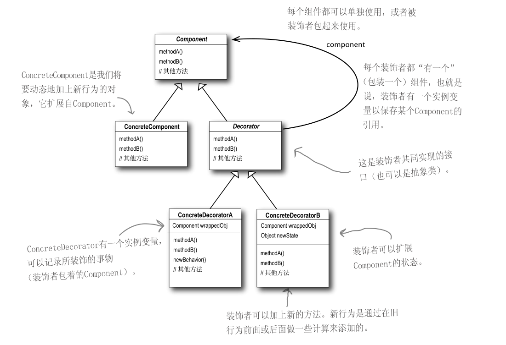

# 装饰者模式

> Decorator。

## 定义

- **动态地将责任附加到对象上**。若要扩展功能，装饰者提供了比继承更有弹性的替代方案。

## 问题

- 想要给现有的类增加一些装饰，通过继承的方式来实现会导致类爆炸。

## 解决方案

- 用**聚合**代替继承。

## 类图



## 代码

### 接口

```java
public interface GameObject {

    void print();

}
```

### 实现对象

```java
public class Bullet implements GameObject{

    @Override
    public void print() {
        System.out.println("bullet is printing");
    }
}

public class Tank implements GameObject{

    @Override
    public void print() {
        System.out.println("print tank...");
    }
}
```

### 装饰者

```java
public class TailDecorator implements GameObject {

    public TailDecorator(GameObject gameObject) {
        this.gameObject = gameObject;
    }

    private final GameObject gameObject;

    @Override
    public void print() {
        gameObject.print();
        System.out.println("tail is printing");
    }
}

public class DoubleDecorator implements GameObject {

    public DoubleDecorator(GameObject gameObject) {
        this.gameObject = gameObject;
    }

    private final GameObject gameObject;

    @Override
    public void print() {
        gameObject.print();
        System.out.println("double ...");
        gameObject.print();
    }
}
```

### 组合调用

```java
public class DecoratorTest {

    public static void main(String[] args) {
        GameObject gameObject = new Tank();
        gameObject = new TailDecorator(gameObject);
        gameObject = new DoubleDecorator(gameObject);
        gameObject.print();
    }

}
```

