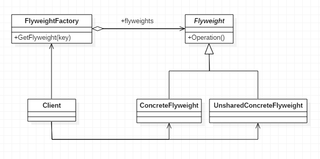

# 享元模式

> Flyweight。

## 定义

- 共享元数据，将小对象放到统一的池子里，共享小对象，避免小对象泛滥的情况。
- String常量池、数据库连接池、缓冲池等等都是享元模式的应用，所以说享元模式是池技术的重要实现方式。

## 使用场景

- 系统中有大量对象时。
- 这些对象消耗大量内存时。
- 这些对象的状态大部分可以外部化时。

## 优点

- 大大减少了对象的创建，降低了程序内存的占用，提高效率。

## 缺点

- 提高了系统的复杂度。需要分离出内部状态和外部状态，而外部状态具有固化特性，不应该随着内部状态的改变而改变。

## 注意事项

- 注意划分内部状态和外部状态，否则可能会引起线程安全问题。
- 这些类必须有一个工厂类加以控制。

## 类图

- `Flyweight`是抽象享元角色。它是产品的抽象类，同时定义出对象的外部状态和内部状态（外部状态及内部状态相关内容见后方）的接口或实现。
- `ConcreteFlyweight`是具体享元角色，是具体的产品类，实现抽象角色定义的业务。
- `UnsharedConcreteFlyweight`是不可共享的享元角色，一般不会出现在享元工厂中。
- `FlyweightFactory`是享元工厂，它用于构造一个池容器，同时提供从池中获得对象的方法。



## 代码实现

### Flyweight抽象类

所有具体享元类的超类或接口，通过这个接口，Flyweight可以接受并作用于外部状态。

```java
public abstract class Flyweight {

    //内部状态
    public String intrinsic;
    //外部状态
    protected final String extrinsic;

    //要求享元角色必须接受外部状态
    public Flyweight(String extrinsic) {
        this.extrinsic = extrinsic;
    }

    //定义业务操作
    public abstract void operate(int extrinsic);

    public String getIntrinsic() {
        return intrinsic;
    }

    public void setIntrinsic(String intrinsic) {
        this.intrinsic = intrinsic;
    }

}
```

### ConcreteFlyweight类

继承Flyweight超类或实现Flyweight接口，并为其内部状态增加存储空间。

```java
public class ConcreteFlyweight extends Flyweight {

    //接受外部状态
    public ConcreteFlyweight(String extrinsic) {
        super(extrinsic);
    }

    //根据外部状态进行逻辑处理
    @Override
    public void operate(int extrinsic) {
        System.out.println("具体Flyweight:" + extrinsic);
    }

}
```

### UnsharedConcreteFlyweight类

指那些不需要共享的Flyweight子类。

```java
public class UnsharedConcreteFlyweight extends Flyweight {

    public UnsharedConcreteFlyweight(String extrinsic) {
        super(extrinsic);
    }

    @Override
    public void operate(int extrinsic) {
        System.out.println("不共享的具体Flyweight:" + extrinsic);
    }

}
```

### FlyweightFactory类

一个享元工厂，用来创建并管理Flyweight对象，主要是用来确保合理地共享Flyweight，当用户请求一个Flyweight时，FlyweightFactory对象提供一个已创建的实例或创建一个实例。

```java
public class FlyweightFactory {

    //定义一个池容器
    private static HashMap<String, Flyweight> pool = new HashMap<>();

    //享元工厂
    public static Flyweight getFlyweight(String extrinsic) {
        Flyweight flyweight = null;

        if(pool.containsKey(extrinsic)) {    //池中有该对象
            flyweight = pool.get(extrinsic);
            System.out.print("已有 " + extrinsic + " 直接从池中取---->");
        } else {
            //根据外部状态创建享元对象
            flyweight = new ConcreteFlyweight(extrinsic);
            //放入池中
            pool.put(extrinsic, flyweight);
            System.out.print("创建 " + extrinsic + " 并从池中取出---->");
        }

        return flyweight;
    }
}
```

### Client客户端

```java
public class Client {

    public static void main(String[] args) {
        int extrinsic = 22;

        Flyweight flyweightX = FlyweightFactory.getFlyweight("X");
        flyweightX.operate(++ extrinsic);

        Flyweight flyweightY = FlyweightFactory.getFlyweight("Y");
        flyweightY.operate(++ extrinsic);

        Flyweight flyweightZ = FlyweightFactory.getFlyweight("Z");
        flyweightZ.operate(++ extrinsic);

        Flyweight flyweightReX = FlyweightFactory.getFlyweight("X");
        flyweightReX.operate(++ extrinsic);

        Flyweight unsharedFlyweight = new UnsharedConcreteFlyweight("X");
        unsharedFlyweight.operate(++ extrinsic);
    }

}
```

## 应用


## Java字符串的享元模式

- Java 的常量字符串常量池实际上就是使用了享元模式。
- 同一个字符串在常量池内只有一个。
- String对象内部也指向对应的常量。

```java
public static void main(String[] args) {
  	String s1 = "abc";
	  String s2 = "abc";
  	String s3 = new String("abc");
	  String s4 = new String("abc");

  	System.out.println(s1 == s2);
	  System.out.println(s1 == s3);
  	System.out.println(s3 == s4);
	  // intern获取常量池里的引用
  	System.out.println(s3.intern() == s1);
	  System.out.println(s3.intern() == s4.intern());
}
```

## 结合Composite的享元模式

> 结合组合模式的享元模式。

- 享元模式中的小对象，可以组成新的小对象，对外共享使用。

