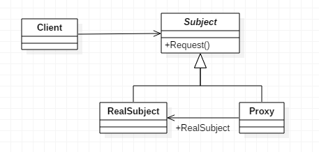
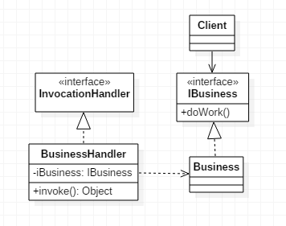

# 代理模式

> Proxy。

## 定义

- 为其他对象提供一种代理以控制对这个对象的访问。
- 代理模式和装饰者模式很像，主要是语义上的区别。

## 使用场景

- 远程代理。为一个对象在不同的地址空间提供局部代表。
- 虚拟代理。根据需要创建开销很大的对象，通过它来存放实例化需要很长时间的真实对象。
- 安全代理。用来控制真实对象访问时的权限。
- 智能指引，当调用真实的对象时，代理处理另外一些事。

## 优点

- 职责清晰。真实的角色就是实现实际的业务逻辑，不用担心其他非本职责的事务。
- 高扩展性。代理类完全可以在不做任何修改的情况下使用。
- 智能化。比如动态代理。

## 缺点

- 有些类型的代理模式可能会造成请求的处理速度变慢。
- 实现代理模式需要额外的工作，有些代理模式的实现非常复杂。

## 类图

- `Subject`是主题角色，定义了`RealSubject`和`Proxy`的共同接口。
- `RealSubject`是具体主题角色，定义了`Proxy`所代表的真实实体。
- `Proxy`为代理主题角色，保存一个引用使代理可以访问实体，并提供一个与`Subject`的接口相同的接口。




## 静态代理

- 由程序员创建或由特定工具自动生成源代码，再对其进行编译。在程序运行之前，代理类的.class文件就已经存在了。 
- 在代理类中注入依赖，即引入需要代理的实体类，通过代理类来调用实体类中的方法来实现静态代理。
- 静态代理由我们自己去生成固定的代码进行编译。需要定义接口或抽象的父类作为抽象目标类，具体目标类和代理类一起实现相同的接口或继承相同的类，然后通过调用相同的方法来调用目标对象的方法。
- 静态代理需要目标对象和代理对象实现相同的接口。可以在不修改目标对象功能的前提下，对目标功能进行扩展。

### Subject抽象类

- 定义了RealSubject和Proxy的共同接口，这样就在任何使用RealSubject的地方都可以使用Proxy。

```java
public abstract class Subject {

    public abstract void request();
    
}
```

### RealSubject类

- 定义了Proxy所代表的真实实体。

```java
public class RealSubject extends Subject {

    @Override
    public void request() {
        System.out.println("真实的请求RealSubject");
    }

}
```

### Proxy类

- 代理类。一个代理类可以代理多个被委托者或被代理者，因此一个代理类具体代理哪个真实主题角色，是由场景类决定的。

```java
public class Proxy extends Subject {

    private RealSubject realSubject = null;

    public Proxy() {
        this.realSubject = new RealSubject();
    }

    @Override
    public void request() {
        this.before();
        this.realSubject.request();
        this.after();
    }

    //预处理
    private void before() {
        System.out.println("-------before------");
    }

    //善后处理
    private void after() {
        System.out.println("-------after-------");
    }
}
```

### Client客户端

```java
public class Client {

    public static void main(String[] args) {
        Proxy proxy = new Proxy();
        proxy.request();
    }

}
```

## 动态代理

- 在程序运行时，动态代理类是运用反射机制创建而成的。在抽象工厂模式的最后有提到用反射来代理switch语句进行选择，这里就运用到了类似的思想。
- 通过动态代理，我们不再需要手动创建代理类，只需编写一个动态处理器即可，而真正的代理对象由JDK在运行时帮我们创建。
- 底层使用了ASM框架直接操作**二进制码**，ASM框架本身十分精简，只有几十KB。
- 通过使用ASM生成代理对象的功能之后，Java才具有“动态语言”的能力。
- 可以为final的类生成代理类。

### 创建步骤

1. 写一个代理类实现`InvocationHandler`接口，通过构造函数把代理对象（具体目标类）传入到此处理器中，在`invoke()`方法中增加`method.invoke(realSubject, args)`。
2. 在调用方法时，通过`java.lang.reflect.Proxy`和`newProxyInstance()`来获取代理实现类，生成代理对象时，直接调用方法即可。

### 类图



### 代码实现

#### IBusiness接口

- 被代理的接口。

```java
public interface IBusiness {

    public void doWork();
     
}
```

#### Business类

- 具体实现类/被代理的对象。

```java
public class Business implements IBusiness {

    @Override
    public void doWork() {
        System.out.println("进行业务逻辑处理");
    }

}
```

#### BusinessHandler类

- `BusinessHandler`类实现类`Invocation`接口，它是方法调用接口，声明了负责调用任意一个方法的`invoke()`方法。
  - 参数`proxy`指定动态代理类实例。
  - 参数`method`指定被调用的方法。
  - 参数`args`指定向被调用方法传递的参数。
- invoke()方法的返回值表示被调用方法的返回值。其中`method.invoke(iBusiness, args)`相当于`iBusiness.method(args)`。

```java
public class BusinessHandler implements InvocationHandler {

    private IBusiness iBusiness;

    public BusinessHandler(IBusiness iBusiness) {
        this.iBusiness = iBusiness;
    }

    @Override
    public Object invoke(Object proxy, Method method, Object[] args) throws Throwable {
        System.out.println("before");
        method.invoke(iBusiness, args);
        System.out.println("after");
        return null;
    }

}
```

#### Client客户端

- 通过`java.lang.reflect.Proxy`类的`newProxyInstance()`方法来生成代理类对象。
- JDK提供的生成代理类的方法。
- 依赖于接口，如果被代理类没有实现接口，不能创建代理对象。

```java
public static Object newProxyInstance(ClassLoader loader, Class<?>[] interfaces, InvocationHandler handler) throws IllegalArgumentException

public class Client {

    public static void main(String[] args) {
      
      	System.getProperties().put("sun.misc.ProxyGenerator.saveGeneratedFiles", "true");
      
        Business business = new Business();

        //生成代理类对象
        IBusiness proxy = (IBusiness) Proxy.newProxyInstance(
                business.getClass().getClassLoader(),
                business.getClass().getInterfaces(),
                new BusinessHandler(business));

        proxy.doWork();
    }

}
```

#### 代理类文件

```java
package com.sun.proxy;

import java.lang.reflect.InvocationHandler;
import java.lang.reflect.Method;
import java.lang.reflect.Proxy;
import java.lang.reflect.UndeclaredThrowableException;
import proxy.Moveable;

public final class $Proxy0 extends Proxy implements Moveable {
    private static Method m1;
    private static Method m3;
    private static Method m2;
    private static Method m0;

    public $Proxy0(InvocationHandler var1) throws  {
        super(var1);
    }

    public final boolean equals(Object var1) throws  {
        try {
            return (Boolean)super.h.invoke(this, m1, new Object[]{var1});
        } catch (RuntimeException | Error var3) {
            throw var3;
        } catch (Throwable var4) {
            throw new UndeclaredThrowableException(var4);
        }
    }

    public final void run() throws  {
        try {
            super.h.invoke(this, m3, (Object[])null);
        } catch (RuntimeException | Error var2) {
            throw var2;
        } catch (Throwable var3) {
            throw new UndeclaredThrowableException(var3);
        }
    }

    public final String toString() throws  {
        try {
            return (String)super.h.invoke(this, m2, (Object[])null);
        } catch (RuntimeException | Error var2) {
            throw var2;
        } catch (Throwable var3) {
            throw new UndeclaredThrowableException(var3);
        }
    }

    public final int hashCode() throws  {
        try {
            return (Integer)super.h.invoke(this, m0, (Object[])null);
        } catch (RuntimeException | Error var2) {
            throw var2;
        } catch (Throwable var3) {
            throw new UndeclaredThrowableException(var3);
        }
    }

    static {
        try {
            m1 = Class.forName("java.lang.Object").getMethod("equals", Class.forName("java.lang.Object"));
            m3 = Class.forName("proxy.Moveable").getMethod("run");
            m2 = Class.forName("java.lang.Object").getMethod("toString");
            m0 = Class.forName("java.lang.Object").getMethod("hashCode");
        } catch (NoSuchMethodException var2) {
            throw new NoSuchMethodError(var2.getMessage());
        } catch (ClassNotFoundException var3) {
            throw new NoClassDefFoundError(var3.getMessage());
        }
    }
}

```


## CGLIB代理

- cglib是一个强大的高性能代码生成包，底层是通过使用一个小而快的字节码处理框架**ASM**来转换并生成新的类，所以我们一般也称之为cglib字节码生成。
- 与JDK动态代理不同，cglib是针对类来实现代理的，所以对于没有接口的类我们可以**通过cglib字节码生成来实现代理**。原理是对指定的业务类生成一个子类，并覆盖其中的业务方法实现代理。但**因为采用的是继承，所以不能对final修饰的类进行代理**。
- **CGLIB**的底层使用的也是**ASM**。

### 使用方式

- 创建被代理类，创建拦截器（实现MethodInterceptor）。
- 实现Enhancer工具类，允许为非接口类型创建一个Java代理。
- 使用setSuperclass()方法设置父类。
- 使用setCallback()方法设置回调函数（默认执行intercept方法）。
- 使用create()方法创建子类。

### 代码

#### 被代理类

- 定义业务类，无需实现接口。

```java
public class Hello {

    public void sayHello() {
        System.out.println("Hello World!");
    }

}
```

#### 拦截器

- 定义一个拦截器，通过实现MethodInterceptor接口的intercept()方法来实现回调方法，通过invokeSuper()执行目标对象的方法。

```java
public class HelloMethodInterceptor implements MethodInterceptor {

    @Override
    public Object intercept(Object object, Method method , Object[] objects , MethodProxy methodProxy ) throws Throwable {
        System.out.println("before " + method.getName());
        methodProxy.invokeSuper(object, objects);
        System.out.println("after " + method.getName());
        return null;
    }

}
```

#### 演示

```java
public class CglibTest {

    public static void main(String[] args) {
        Enhancer enhancer = new Enhancer();
        enhancer.setSuperclass(Tank.class);
        enhancer.setCallback((MethodInterceptor) (o, method, objects, methodProxy) -> {
            System.out.println("before");
            Object result = methodProxy.invokeSuper(o, objects);
            System.out.println("after");
            return result;
        });
        Tank tankProxy = (Tank) enhancer.create();
        tankProxy.run();
    }
}
```


#### Client客户端

- 通过`Enhancer`加强类来创建动态代理类，通过它的`setSuperclass()`方法来指定**要代理的业务类**（即为下方生成的代理类指定父类），然后通过`create()`方法生成代理类对象。
- 在`enhance.create()`创建完代理对象后，在代理类调用方法中，会被我们实现的方法拦截器HelloMethodInterceptor拦截。
- 如果被代理类被`final`修饰，则该类不能被继承，即**不能被代理**。
- 如果被代理类存在**final修饰的方法**，则**该方法不能被代理**。

```java
public class Client {

    public static void main(String[] args) {
        Enhancer enhancer = new Enhancer();        //工具类
        enhancer.setSuperclass(Hello.class);    //继承被代理类
        enhancer.setCallback(new HelloMethodInterceptor());        //设置回调

        Hello hello = (Hello) enhancer.create();    //生成代理类对象
        hello.sayHello();
    }

}
```

## Spring AOP

- 有接口的目标对象采用JDK代理，无接口的目标对象采用cglib代理。
- 