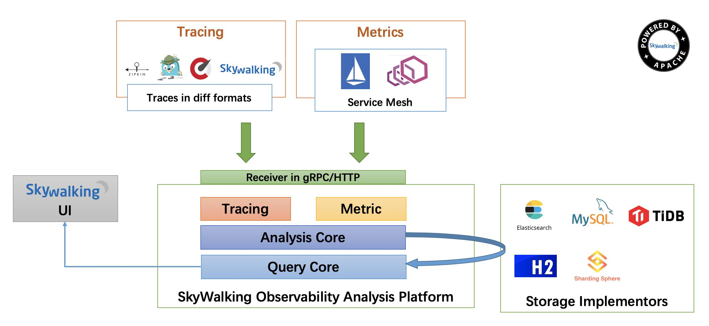

# SkyWalking

## APM 简介

> Application Performance Management，应用性能管理。

- 通过各种探针采集并上报数据，收集关键指标，同时搭配数据展示以实现对应用程序**性能管理**和**故障管理**的系统化解决方案。

- 目前主要的一些 APM 工具有: Cat、Zipkin、Pinpoint、SkyWalking。
- SkyWalking 是一款优秀的国产 APM 工具，包括了**分布式追踪**、**性能指标分析**、**应用和服务依赖分析**等。
- Zabbix、Premetheus、open-falcon等监控系统主要关注**服务器硬件指标与系统服务运行状态**等，而**APM系统则更重视程序内部执行过程指标和服务之间链路调用情况的监控**，**APM更有利于深入代码找到请求响应“慢”的根本问题，与Zabbix之类的监控是互补关系。**

## 分布式链路追踪

- 分布式追踪的目的是为了让我们最终在页面上、UI上、和数据上能够复现微服务接收请求后内部调用的整个过程。
- 分布式链路追中要拿到整个完整的链路，包括精确的响应时间、访问的方法、访问的 circle，访问的 Redis 的 key等，这些是做分布式追踪的时候需要展现的一个完整的信息。

## Apache SkyWalking 简介

- **分布式系统**的**应用程序性能监视**工具，专为微服务、云原生架构和基于容器（Docker、K8s、Mesos）架构而设计。
- Apache Skywalking 通过加载 **探针-非侵入式** 的方式收集应用调用链路信息，并对采集的调用链路信息进行分析，生成应用间关系和服务间关系以及服务指标。
- Apache Skywalking 目前支持多种语言，其中包括`Java`、`.Net Core`、`Node.js`和`Go`语言。

## 可视化维度

- 总览视图

  `Global view`，应用和组件的全局视图，其中包括组件和应用数量，应用的告警波动，慢服务列表以及应用吞吐量。

- 拓扑图

  `topology view`，从应用依赖关系出发，展现整个应用的拓扑关系。

- 应用视图

  从单个应用的角度，展现应用的上下游关系，TopN的服务和服务器，JVM的相关信息以及对应的主机信息。

- 服务视图

  关注单个服务入口的运行情况以及此服务的上下游依赖关系，依赖度，帮助用户针对单个服务的优化和监控。

- 调用链

  `trace`，展现了调用的单次请求经过的所有埋点以及每个埋点的执行时长。

- 告警视图

  `alarm`，根据配置阈值针对应用、服务器、服务进行实时告警。

## 原理架构图



## 核心模块

>SkyWalking采用组件式开发，易于扩展。

### Skywalking Agent

- 链路数据采集tracing（调用链数据）和metric（指标）信息并上报。
- 上报通过HTTP或者gRPC方式发送数据到Skywalking Collector。

### Skywalking Collector

- 链路数据收集器，对agent传过来的tracing和metric数据进行整合分析。
- 通过Analysis Core模块处理并落入相关的数据存储中。
- 同时会通过Query Core模块进行二次统计和监控告警。

### Storage

-  Skywalking的存储，支持以ElasticSearch、Mysql、TiDB、H2等主流存储作为存储介质进行数据存储。
- H2仅作为临时演示单机用。

### SkyWalking UI

-  Web可视化平台，用来展示落地的数据。
- 目前官方采纳了RocketBot作为SkyWalking的主UI。

## 集成使用

1. 从 skywalking 的[官网](http://skywalking.apache.org/downloads/)下载应用包。
2. 启动skywalking收集器服务，启动脚本是`/bin/startup.sh`。
3.  拷贝`skywalking-agent`目录到所需位置。
4. 不要改变`skywalking-agent`目录结构，可修改`agent.config`配置`agent.application_code=xxl-job`为自己的应用名。
5. 应用增加JVM启动参数。`-javaagent:/path/to/skywalking-agent/skywalking-agent.jar`。参数值为`skywalking-agent.jar`的**绝对路径**。

## 集成traceId与日志组件

```xml
<appender name="console" class="ch.qos.logback.core.ConsoleAppender">
  <layout class="org.apache.skywalking.apm.toolkit.log.logback.v1.x.TraceIdPatternLogbackLayout">
    <pattern>
      %d{yyyy-MM-dd HH:mm:ss} [%thread] %-5level %logger{36} - %tid - %msg%n
    </pattern>
  </layout>
</appender>
```

## dubbo请求拦截插件

- `DubboInterceptor`插件拦截dubbo中的`MonitorFilter`这个类中的`invoke`方法。
- 通过获取dubbo的上下文 `RpcContext` 先**对消费者调用之前加入sky walking的跨进程协议header信息**`sw:traceId`，然后到生产者取出。
- 在调用结束后结束，把span的详情信息发送给collector，具体实现在类`org.apache.skywalking.apm.agent.core.context.TracingContext`的`stopSpan(AbstractSpan span)`方法。

## 限制

- 只支持已知的代理，如果使用的中间件还未被支持，需要自己写插件。
- 跨线程的场景不支持自动代理，比如任务分配，任务池，批处理的场景。