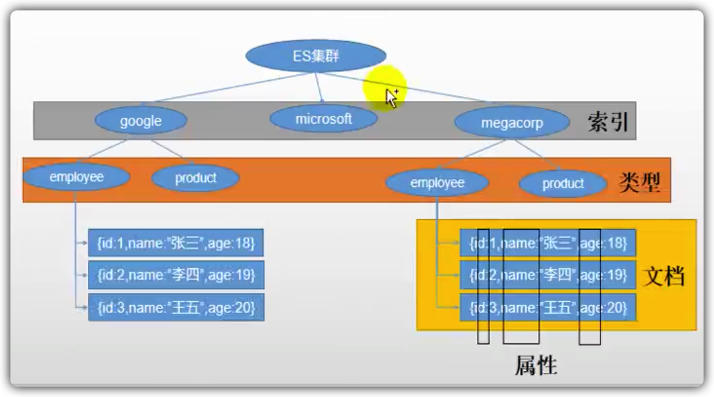

#   ElasticSearch

## 简介

### 基本概念

Elastic Search 是目前全文搜索引擎的首选。

可以快速地储存、搜索和分析海量数据。

Elastic Search底层是开源库 Lucene。

Elastic 是对 Lucene 的封装，提供了 REST API的操作接口，开箱即用。 

#### Index(索引)

- 动词，相当于 MySQL 中的 insert。
- 名词，相当于 MySQL 中的Database。 

#### Type(类型)

- 在 Index 中，可以定义一个或多个类型。
- 类似于 MySQL 中的 Table。
- 每种类型的数据放在一起。

#### Document(文档)

- 保存在某个索引下，某种类型的一个数据。
- 文档是 JSON 格式的。
- Document 就是像 MySQL 中的某个 Table 里面的内容。




#### 倒排索引

>倒排索引表维护了拆分的单词在哪些记录里有的情况。

- 分词，将整句拆分为单词。
- 检索的时候也对待检索的词进行分词，再去匹配。
- 相关性得分:检索出的相关性记录会根据相关性得分按照从高到低的排序。

 

## Docker 安装

### 下载镜像

```shell
docker pull elasticsearch:7.4.2
docker pull kibana:7.4.2
```

### 创建实例

```shell
docker run --name elasticsearch -p 9200:9200 -p 9300:9300 -e "discovery.type=single-node" -e ES_JAVA_OPTS="-Xms128m -Xmx256m" -v /Users/zhengjl/Desktop/Temps/tempdata/elasticsearch/data:/usr/share/elasticsearch/data -d elasticsearch:7.4.2
```

### 验证

```http
# 启动信息验证
GET http://xx:9200
```

### 获取节点信息

```http
GET http://xx:9200/_cat/nodes
```

### 启动 Kibana

ip地址一定是如下格式的，不能是 `localhost` 或者 `127.0.0.1`。

```shell
docker run --name kibana -e ELASTICSEARCH_HOSTS=http://192.168.50.226:9200 -p 5601:5601 -d kibana:7.4.2
```

## 初步检索

### _cat

- 查看所有节点

  ```http
  GET /_cat/nodes
  ```

- 查看 ES 健康情况

  ```http
  GET /_cat/health
  ```

- 查看主节点

  ```http
  GET /_cat/master
  ```

- 查看所有索引

  ```http
  GET /_cat/indices
  ```

  

### 索引一个文档(保存)

#### PUT

需要指定保存到哪个索引的哪个类型下，并指定唯一标识。

PUT 可以新增可以修改。PUT`必须指定 ID`；由于 PUT 需要指定 id，我们一般都用来做修改操作，不指定 id 会报错。

```http
PUT customer/external/1
{
	"name":"qiuqiu",
	"age":18
}
```

响应体

- 以`_`开头的代表是元数据。
- **_shards** 代表分片信息。
  - created 新建
  - updated 更新
- **_result** 代表创建结果。

```json
{
    "_index": "customer",
    "_type": "external",
    "_id": "1",
    "_version": 1,
    "result": "created",
    "_shards": {
        "total": 2,
        "successful": 1,
        "failed": 0
    },
    "_seq_no": 0,
    "_primary_term": 1
}
```

#### POST

POST 新増。如果不指定 id，会自动生成 id。指定 id 就会修改这个数据，并新增版本号。

```http
POST customer/external

{
	"name":"qiuqiu",
	"age":18
}
```

### 查询文档

指明查询哪个索引哪个类型的数据，可以组合很多过滤条件。

```http
GET /customer/external/1
```

响应

- `_seq_no`序列号，并发控制字段，每次更新就会+1, 用来做乐观锁。
  - ?if_seq_no=1
- `_primary_term` 同上，主分片重新分配，如重启，就会变化 。
  - ?if_primary_term=1
- `_source`真正的数据

```json
{
    "_index": "customer",
    "_type": "external",
    "_id": "1",
    "_version": 3,
    "_seq_no": 2,
    "_primary_term": 1,
    "found": true,
    "_source": {
        "name": "qiuqiu",
        "age": 18
    }
}
```

### 更新文档

1. POST 请求包含操作的目标文档 id 且指明更新。

   - 只有此方式 会对比更新前和更新后的数据区别，如果一样，则不进行更新，版本号等信息不变。
   - 可以增加字段属性。

   ```http
   POST /customer/external/id/_update
   {
   	"doc": {
   		"pet":  "666"
   	}
   }
   ```

2. POST 请求包含操作的目标文档 id。

   - 可以增加字段属性。
   - 不对比历史数据直接更新。

3. PUT 请求包含操作的目标文档 id。

   - 可以增加字段属性。
   - 不对比历史数据直接更新。

### 删除文档

```http
DELETE /索引/类型/id
```

### 删除索引

```http
DELETE /索引
```

### bulk 批量 API

**示例**

```http
POST /customer/external/_bulk
{"index": {"_id": 1}}
{"name": "QiuQiu"}
```

**语法**

```json
{action: {metadata}}\n
{request body}\n
```

| action | 备注 |
| :----- | ---- |
| index  | 添加 |
| delete | 删除 |
| create | 创建 |
| update | 更新 |

## 进阶检索

>HTTP 客户端工具(POSTMAN)， get 请求不能携帯请求体。我们 POST 一个 JSON 风格的查询请求体到 `_search API`也是一样的。
>
>一旦搜索的结果被返回，ElasticSearch 就完成了这次请求，并且不会维护任何服务端的资源或者结果的 cursor（游标）。

### Search API

ES支持两种基本方式检索

- `uri+检索参数` 通过使用 REST request URI 发送搜索参数。
- `uri+请求体` 通过使用 REST request body 来发送。

#### 检索参数

参数解释

| 参数    | 备注         |
| ------- | ------------ |
| _search | 检索         |
| q       | 请求         |
| sort    | 排序规则     |
| asc     | 正序进行排序 |
| took    | 请求花费时间 |
| hits    | 命中的记录   |

请求示例

```http
GET bank/_search?q=*&sort=account_number:asc
```

响应示例

```json
{
  "took" : 16,
  "timed_out" : false,
  "_shards" : {
    "total" : 1,
    "successful" : 1,
    "skipped" : 0,
    "failed" : 0
  },
  "hits" : {
    "total" : {
    },
    "max_score" : null,
    "hits" : [
    ]
  }
}
```

#### 请求体

参数解释

| 参数      | 备注     |
| --------- | -------- |
| query     | 查询     |
| match_all | 匹配全部 |
| desc      | 倒序     |

请求示例

```http
GET bank/_search
{
  "query": {
    "match_all": {}
  },
  "sort": [
    {
      "account_number": "desc"
    }
  ]
}
```

### Query DLS

> 请求体方式就是 Query DLS。

#### 关键字

| 关键字        | 备注                                 |
| ------------- | ------------------------------------ |
| query         | 查询                                 |
| sort          | 排序                                 |
| form          | 从 xx 条记录开始                     |
| size          | 查询数量                             |
| match_all     | 匹配全部                             |
| _source       | 返回部分字段，中括号中包含指定属性名 |
| must          | 必须满足                             |
| must_not      | 必须不满足                           |
| should        | 最好满足，不满足也可                 |
| range         | 区间                                 |
| gte           | 大于等于                             |
| lte           | 小于等于                             |
| FIELD.keyword | 匹配字段的精确值                     |


#### 基本语法格式

```http
GET 索引/_search
{
  QUERY_NAME: {
    ARGUMENT: VALUE,
    ARGUMENT: VALUE...
  }
}
```

#### 针对某个字段的语法格式

```http
GET 索引/_search
{
  QUERY_NAME: {
    FIELD_NAME: {
      ARGUMENT: VALUE,
    	ARGUMENT: VALUE...
    }
  }
}
```

#### match 匹配查询

`基本类型（非字符串）`，精准匹配。

```http
GET 索引/_search
{
  "query":{
    "match":{
      "FIELD_NAME": VALUE
    }
  }
}
```

`字符串`，全文检索。

全文索引按照评分进行排序，会对检索条件进行`分词匹配`。

```http
GET 索引/_search
{
  "query":{
    "match":{
      "FIELD_NAME": "String"
    }
  }
}
```

#### match_phrase 短语匹配

将需要匹配的值当成一个整体单词（不分词）进行检索。

```http
GET 索引/_search
{
  "query":{
    "match_phrase":{
      "FIELD_NAME": "String"
    }
  }
}
```

#### multi_match 多字段匹配

其中一个字段满足分词匹配即可。

```http
GET 索引/_search
{
  "query":{
    "multi_match":{
    	"query":"String",
      "fields": ["FIELD_NAME","FIELD_NAME"...]
    }
  }
}
```

#### bool 复合查询

构造一个复杂的查询，合并多个查询条件。

```http
GET /bank/_search
{
  "query": {
    "bool": {
      "must": [
        { "match": { "age": "40" } }
      ],
      "must_not": [
        { "match": { "state": "ID" } }
      ]
    }
  }
}
```

#### filter 结果过滤

功能类似于 must 和 mustnot，filter 不会贡献相关性得分。

```http
GET /bank/_search
{
  "query": {
    "bool": {
      "must": { "match_all": {} },
      "filter": {
        "range": {
          "balance": {
            "gte": 20000,
            "lte": 30000
          }
        }
      }
    }
  }
}
```

#### term 查询

 功能和 match 类似。 查询是文本字段的时候尽量避免使用 term。精确类型字段检索建议使用 term。

```http
GET /_search
{
  "query": {
    "term": {
      "user.id": {
        "value": "kimchy",
        "boost": 1.0
      }
    }
  }
}
```

## aggregations 执行聚合

聚合提供了从数据中`分组`和`提取数据`的能力。最简单的聚合方法大致等于 SQL GROUP BY 和 SQL 聚合函数。在 Elasticsearch 中，您有执行搜索返回 hits（命中结果），并且同时返回聚合结果，把一个响应中的所有 hits（命中结果）分隔开的能力。这是非常强大且有效的，您可以执行查询和多个聚合，并且在一次使用中得到各自的（任何一个的）返回结果，使用一次简洁和简化的 API 来避免网络往返。

### 语法

```json
"aggregations" : {
    "<aggregation_name>" : {
        "<aggregation_type>" : {
            <aggregation_body>
        }
        [,"meta" : {  [<meta_data_body>] } ]?
        [,"aggregations" : { [<sub_aggregation>]+ } ]?
    }
    [,"<aggregation_name_2>" : { ... } ]*
}
```

### 示例代码

```http
GET bank/_search
{
  "query": {
    "match": {
      "address": "mill"
    }
  },
  "aggs": {
    "ageagg": {
      "terms": {
        "field": "age",
        "size": 10
      }
    },
    "ageAvg":{
      "avg": {
        "field": "age"
      }
    }
  }
}
```

### Bucketing Aggregations

桶聚合

### Metric Aggregations


### Matrix Aggregations

矩阵聚合

### Pipeline Aggregations

流聚合

### 聚合类型

| 聚合类型 | 备注   |
| -------- | ------ |
| avg      | 平均值 |
| max      | 最大值 |
| min      | 最小值 |
| terms    | 分布   |
| ...      | ...    |

## Mapping 映射

### 移出类型 Type

ElasticSearch6及以后移出了 Type 类型的概念。

关系型数据库中两个数据表示是独立的，即使他们里面有相同名称的列也不影响使用，但 ES 中不是这样的。elasticsearch 是基于 `Lucene` 开发的搜索引擎，而 ==ES 中不同 type 下名称相同的 filed 最终在 Lucene 中的处理方式是一样的==。

- 两个不同 type 下的两个 name，在 ES 同一个索引下其实被认为是同一个 Field，你必须在两个不同的 type 中定义相同的 Field 映射。否则，==不同 type 中的相同字段名称就会在处理中出现冲突的情况，导致 Lucene 处理效率下降==。
- 去掉 type 就是为了提高 ES 处理数据的效率。

**ElasticSearch 7.x**

URL 中的 type 参数为可选。比如，索引一个文档不再要求提供文档类型。

**ElasticSearch 8.x**

不再支持 URL 中的 type 参数。

将索引从多类型迁移到单类型，每种类型文档一个独立索引。 

### 映射概念

Mapping 用来定义个文档（document）以及它所包含的属性 Field 是如何存储和索引的。

比如，用 mapping 来定义：

- 哪些字符串属性应该被看全文本属性（full text fields）。
- 哪些属性包含数字，日期或者地理位置。
- 文档中的所有属性是否都能被索引（_all 配置）。
- 日期的格式。
- 自定义映射规则来执行动态添加属性。

映射可以不具体指定，首次索引文档的时候 ElasticSearch 会进行类型推测。

### 查看 mapping 信息

```http
GET bank/_mapping
```

| 类型    | 备注                             |
| ------- | -------------------------------- |
| long    | 数字                             |
| text    | 文本类型，默认进行全文检索、分词 |
| keyword | 用于精确匹配                     |
| ...     | ...                              |

### 创建索引时指定映射

**示例代码**

```http
PUT /my-index
{
  "mappings": {
    "properties": {
      "age":    { "type": "integer" }, 
      "email":  { "type": "keyword"  },
      "name":   { "type": "text"  }    
    }
  }
}
```

### 添加新的字段映射

**示例代码**

```http
PUT /my-index/_mapping
{
  "properties": {
    "employee-id": {
      "type": "keyword",
      "index": false // 不需要被索引的字段
    }
  }
}
```

### 更新映射

对于已经存在的映射字段，不能更新。更新必须==创建新的索引进行数据迁移==。

### 数据迁移

**示例代码**

```http
POST _reindex
{
  "source": {
    "index": "twitter"
  },
  "dest": {
    "index": "new_twitter"
  }
}
```

## 分词

>一个 tokenizer（分词器）接收一个字符流，将之分割为独立的 tokens（词元，通常是独立的单词），然后输出 tokens 流。
>

Elastic  Search 提供了一系列默认的分词器。

### 测试分词器

```http
POST _analyze
{
  "analyzer": "standard",
  "text": "The 2 QUICK Brown-Foxes jumped over the lazy dog's bone."
}
```


### 安装 ik 分词器

- 从 ik 分词器官方 git 项目中找到和 Elastic Search 版本对应的程序包。
- 将程序包放到 Elastic Search安装目录下的 `plugins` 目录下。
- 解压 ik 分词器压缩包。
- 重启 Elastic Search。

### 测试 ik 分词器

| 分词器种类  | 备注             |
| ----------- | ---------------- |
| ik_smart    | 中文智能分词     |
| ik_max_word | 最大单词组合分词 |

 ```http
POST _analyze
{
	"analyzer":"ik_max_word",
	"text":"我是中国人"
}
 ```

### 自定义词库

- 修改 `ik/config`中的`IKAnalyzer.cfg.xml`指定一个远程词库。
  - 每行是一个词，换行表示结束。
- 重启 Elastic Search。

## 整合 Spingboot & Elastic Search

### TCP-9300

不建议连接9300端口进行操作

-  spring-data-elasticsearch:transport-api.jar
  - springboot 版本不同，transport-api.jar不同，不能适配 es 版本。
  - 7.x 已经不建议使用，8以后要废弃。

### HTTP-9200

- JestClient 非官方，更新慢。
- RestTemplate 模拟发送 HTTP 请求，ES 很多操作需要自己封装。
- HttpClient 同上。
- Elastic-Rest-Client 官方 RestClient，封装了 ES 操作，

### 整合 Elastic-Rest-Client

#### 导入依赖

```xml
<dependency>
    <groupId>org.elasticsearch.client</groupId>
    <artifactId>elasticsearch-rest-high-level-client</artifactId>
    <version>7.12.0</version>
</dependency>
```

#### 编写配置

```java
RestHighLevelClient client = new RestHighLevelClient(
        RestClient.builder(
                new HttpHost("localhost", 9200, "http"),
                new HttpHost("localhost", 9201, "http")));
```

```java
client.close();
```

### Elastic-Rest-Client API

[官方文档](https://artifacts.elastic.co/javadoc/org/elasticsearch/client/elasticsearch-rest-high-level-client/7.12.0/index.html)
