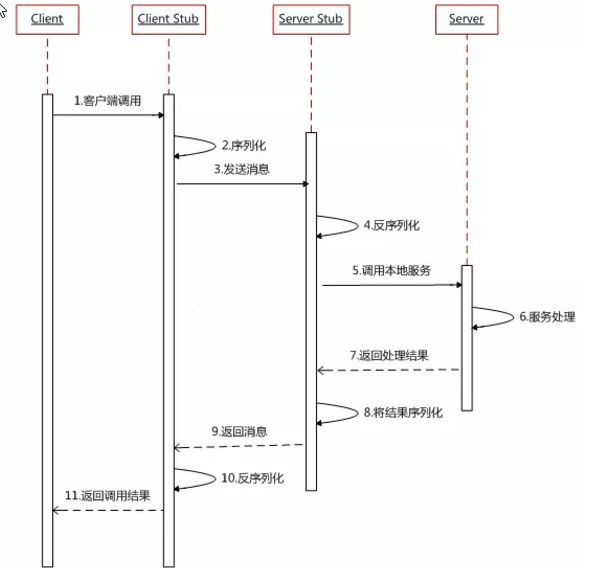

# 基础知识

## 分布式系统 

《分布式系统原理与范型》定义：“分布式系统是若干独立计算机的集合，这些计算机对于用户来说就像单个相关系统”。

分布式系统(distributed system)是建立在网络之上的软件系统。

随着互联网的发展，网站应用的规模不断扩大，常规的**垂直应用架构**已无法应对，**分布式服务架构**以及**流动计算架构**势在必行，亟需一个**治理系统**确保架构有条不紊的演进。

## RPC

### 什么是RPC

RPC `Remote Procedure Call` 是指**远程过程调用**，是一种**进程**间通信方式，是一种技术的思想，而不是规范。

它允许程序调用另一个地址空间（通常是共享网络的另一台机器上）的过程或函数，而不用程序员显式编码这个远程调用的细节。即程序员无论是调用本地的还是远程的函数，本质上编写的调用代码基本相同。

### 解决的问题

**让分布式或者微服务系统中不同服务之间的调用像本地调用一样简单。**

### 基本原理

### 调用过程

1. 服务消费方`client`调用以本地调用方式调用服务。
2. `client stub`接收到调用后负责将方法、参数等组装成能够进行网络传输的消息体。
3. client stub找到服务地址，并将消息发送到服务端。
4. `server stub`收到消息后进行解码。
5. `server stub`根据解码结果调用本地的服务。
6. 本地服务执行并将结果返回给`server stub`。
7. `server stub`将返回结果打包成消息并发送至消费方。
8. `client stub`接收到消息，并进行解码。
9. 服务消费方得到最终结果。

### 时序图

### 常见的 RPC 框架总结

- `RMI` JDK自带的RPC，有很多局限性，不推荐使用。
- `Dubbo` Dubbo是 阿里巴巴公司开源的一个高性能优秀的服务框架，使得应用可通过高性能的 RPC 实现服务的输出和输入功能，可以和 Spring框架无缝集成。目前 Dubbo 已经成为 Spring Cloud Alibaba 中的官方组件。
- `gRPC`  gRPC是可以在任何环境中运行的现代开源高性能RPC框架。它可以通过可插拔的支持来有效地连接数据中心内和跨数据中心的服务，以实现负载平衡、跟踪、运行状况检查和身份验证。它也适用于分布式计算的最后一英里，以将设备、移动应用程序和浏览器连接到后端服务。
- `Hessian` Hessian是一个**轻量级**的`remotingonhttp`工具，使用简单的方法提供了RMI的功能。 相比WebService，Hessian更简单、快捷。采用的是**二进制**RPC协议，适合于发送二进制数据。
- `Thrift` Apache Thrift是Facebook开源的跨语言的RPC通信框架，目前已经捐献给Apache基金会管理，由于其跨语言特性和出色的性能，在很多互联网公司得到应用，有能力的公司甚至会基于thrift研发一套分布式服务框架，增加诸如服务注册、服务发现等功能。