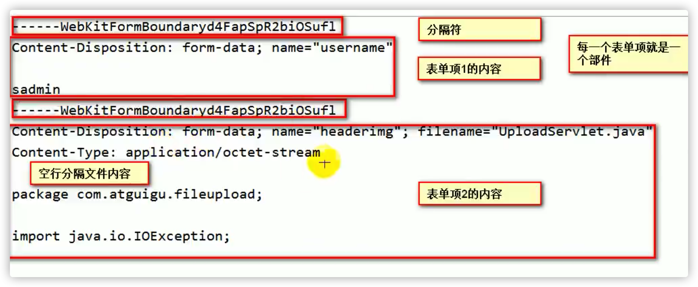

# JavaWeb

## 简介

- 浏览器和服务器通讯的技术。

------

## 域对象

### PageContext

- 本页中能获取到相关属性。

### Request

- 本次请求中能获取到相关属性。

### Session

- 本次会话中能获取到相关属性。

### Application

- 本个应用中能获取到相关属性。

## 监听器

>Listener。

- Listener 是 JavaWeb 三大组件之一。
- JavaWeb 一种定义了八种监听器。

### ServletContextEvents

>ServletContext 事件。

- javax.servlet.ServletContextListener

  - 监听 ServletContext 生命周期的监听器。
  - 从创建到销毁的过程。
  - 服务器启动创建，做一些初始化操作。

  - 服务器停止销毁，做一些资源关闭的操作。
  - **使用频率最高的监听器**。

- javax.servlet.ServletContextAttributeListener

  - 监听 ServletContext 域中属性变化的监听器。

### HTTPSessionEvents

>HTTPSession 事件。

- javax.servlet.http.HttpSessionListener
  - 监听 HttpSession 的生命周期。
  - Session 第一次使用的时候创建，不是打开浏览器的时候创建。
  - Session 超时或者手动清空 Session 时销毁。
- javax.servlet.http.HttpSessionAttributeListener
  - 监听所有对象在 HttpSession 域中属性的变化的监听器。
- javax.servlet.http.HttpSessionActivationListener
  - 监听某个对象随着 HttpSession 活化钝化的监听器。
  - 不需要在 web.xml 中注册的监听器。
- javax.servlet.http.HttpSessionBindingListener
  - 监听某个对象保存（绑定）到 session 中和从 session 中移除（解绑）的监听器。
  - 不需要在 web.xml 中注册的监听器。

### ServletRequestEvents

>ServletRequest 事件。

- javax.servlet.ServletRequestListener
  - 监听 ServletRequest 的生命周期。
  - 请求进来的时候创建 Request 对象保存请求的详细信息。
  - 请求完成后销毁 Request 对象。
- javax.servlet.ServletRequestAttributeListener
  - 监听 ServletRequest 域中属性变化的监听器。

### 使用流程

- 定义类实现监听器接口。
- 实现监听器逻辑。
- 在 `web.xml` 配置监听器。

## Session

### 简介

xxx

### 生命周期

#### 创建

- 第一次使用 Session 的使用，进行创建。
- 如果根据 `JSESSIONID` 获取不到指定的 Session，服务器会创建一个新的 Session 并返回。

#### 销毁

- 调用 Session 对象的 invalidate 方法。
- 超时自动销毁。

### 活化钝化

- `活化`、`钝化`、`绑定`、`解绑` 都是操作具体的 Session 属性的，属性的类直接实现相关接口。
- Session 中的对象属性想要支持活化或者钝化功能，需要实现 `Serializable` 接口。
- Session 中属性对象随着 Session 一起活化的时候，钝化的对象通过反序列化创建一个一个新的活化对象。

------

## 国际化

### 简介

- 国际化也叫做 `i18n`，是 `Internationalization` 的简称。
- 为了让程序可以适配多国环境，包含计数法、货币单位、日期表示、语言等。

### Locale

#### 简介

- 区域、地点，是代表区域信息的类。
- Locale 类中包含很多静态属性，枚举了全部的区域信息。

#### 格式

- `语言代码_国家代码`。

### ResourceBundle

- 资源绑定，管理了国际化资源文件。
- 通过调用`ResourceBundle.getBundle()`加载获取指定区域信息的国际化配置。
- 通过调用 `ResourceBundle` 对象的 `getString()` 方法，获取到指定 `key` 的配置值。

### 国际化配置文件

- 创建国际化配置文件，`xxx_语言代码_国家代码.properties`。
- 配置文件通过 `key-value` 的方式存储国际化相关的信息。

### 浏览器语言设置

- 设置浏览器的语言信息的项目和优先级可以影响获取到的国际化配置的结果。
- 请求头中的 `Accept-Language` 包含了请求对于区域的优先级排序情况。

### 语言国际化流程

1. 获取到当前浏览器带来的区域信息。
2. 使用 ResourceBundle 管理国际化资源文件。
3. 动态获取配置文件中值。

### 日期格式化

- `DateFormat` 是对**日期**进行格式化的接口。
- 通过调用 `DateFormat.getXXXInstance` 静态方法通过传入**风格**和**区域信息**可以获得对应的格式化器实例。
- 通过调用日期格式化实例对象的 `format`方法，传入日期对象，将日期格式化特定区域的特定风格展示。

### 数字格式化

- `NumberFormat` 是对**数字**进行格式化的接口。
- 使用方式和 `DateFormat` 一样。
- `NumberFormat` 支持对**数字**和**货币**进行格式化操作。

### 自定义消息格式化

- `MessageFormat` 是对自定义消息进行格式化的接口。
- 在国际化配置文件中，通过 `{0}`、`{1}` 的方式预置一个占位符，索引从 0 开始。
- `MessageFormat#format` 方法可以对预置参数的国际化配置传入具体的信息，替换占位符。

### fmt标签库

- `fmt` 标签库是JSTL中定义用来专门为处理国际化信息的标签。
- 通过 `<%@ taglib prefix="fmt" uri="http://java.sun.com/jsp/jstl/fmt" %>`引入标签。
- 通过 `<fmt: setLocale="xxx">` 设置区域信息。
- 通过 `<fmt: setBundle basename="xxx"/>` 设置绑定的国际化配置的基础路径。
- 在需要引用国际化文件的地方使用 `<fmt: message key="xxx"/>` 即可引用对应的配置。
- 通过 `<fmt: param>` 标签给指定的预置国际化配置绑定对应的参数值。

------

## 文件上传下载

- **上传**，浏览器将本地的文件上传到服务器上，交给服务器保存。
- **下载**，浏览器把服务器保存的内容下载来本地。

### 上传

#### 简介

- 文件上传必须是 `POST` 类型的表单提交。
- 文件是以流的方式交给服务器的。
- 文件上传的表单是一种新的解析方式。
- 文件上传不能使用普通的 `<form action="" method="post"/>`表单。
- `request#getParameter`方法不能获取到参数信息。
- `enctype`，`encodeType` 的缩写，编码类型，规定表单数据在发送到服务器之前应该如何编码。
  - `application/x-www-form-urlencoded`
    - 在发送前编码所有字符。
    - 默认。
  - `multipart/form-data` 
    - 不对字符编码。
    - 在使用包含文件上传控件的表单时，必须使用该值。
  - `text/plain`
    - 空格转换为”+”加号，但不对特殊字符编码。
- IE浏览器获取到的文件名是带路径的，需要特殊处理。

#### 表单内容

- 多部件上传文件的表单内容不同于普通的表单内容。

- 格式

  ```xml
  分隔符
  部件1头信息
  空行
  部件1内容
  分隔符
  部件2头信息
  空行
  部件2内容
  ```

  

#### 解析流程

- 导入 `commons-fileupload.jar`、`commons-io.jar`。
- 通过`ServletFileUplead#isMultipartContent(request)`方法用来判断请求是否是**多部件表单请求**。
- 通过 `ServletFileUpload#parseRequest` 解析多部件请求，返回一个包含全部表单项的 `FileItem` 集合。
- 通过 `FileItem#isFormField`方法判断是普通的表单项还是文件项。
- `IOUtil.copy(is, os)` 方法可以进行流拷贝。

### 下载

- 将服务器中文件的流交给浏览器。
- 浏览器收到流之后的默认行为。
  - 认识的打开。
  - 不认识的下载。

#### 流程

- 通过`response#getOutputStream` 方法获取到输出流。

-  设置响应头，让浏览器下载文件，而不是打开。

  ```java
  Response.setHeader("Content-Disposition", "attachment;filename=xxx");
  ```

- 不指定文件名的情况下，文件名默认会使用请求名称。

- 通过 `new String(filename.getBytes("GBK"), "ISO-8859-1");` 给文件名转码解决中文文件名乱码问题。

  - 利用了GBK、UTF-8、ISO8859-1字符集的兼容性解决的问题。
  - 存在轻微漏洞，如果文件名碰巧叫**图片**，会出现乱码。

------

## Tomcat

### 简介

- Apache 下的顶级项目。
- 应用广泛的 Web 服务器。

### 目录结构

- `bin` 可执行程序。
  - Tomcat的各种脚本在这个目录下。
  - `startup.bat`、`startup.sh` 启动脚本。
  - `shutdown.bat`、`shutdown.sh` 关闭脚本。
- `conf` Tomcat配置文件的目录。
  - `server.xml` Tomcat服务器配置集中的地方。
  - `web.xml` Tomcat 所有 web 项目都需要遵循的一个 xml。
- `lib` Tomcat运行期间需要使用的 jar 包。
- `logs` 运行日志。
- `temp` 临时目录。
- `webapps` 运行项目的集合。
  - 每一个项目都是一个独立的文件夹的形式。
- `work` 存在运行期间编译的一些文件。
  - JSP页面。

------

## Servlet

xx

------

