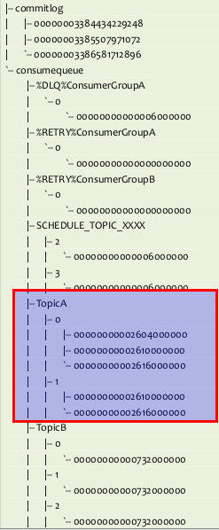
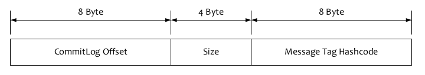

# RocketMQ 核心概念

## 消息存储

RocketMQ的消息存储是由`consume queue`和`commit log`配合完成的。

### Consume Queue

- consume queue是消息的逻辑队列，相当于字典的目录，用来指定消息在物理文件`commit log`上的位置。

- 可以在配置中指定`consume queue`与`commitlog`存储的目录。

  ```shell
  ${rocketmq.home}/store/consumequeue/${topicName}/${queueId}/${fileName}
  ```

#### Consume Queue 文件结构

- 根据`topic`和`queueId`来组织文件，图中TopicA有两个队列0,1，那么TopicA和QueueId=0组成一个`ConsumeQueue`，TopicA和QueueId=1组成另一个`ConsumeQueue`。
- 按照消费端的`GroupName`来分组**重试队列**，**如果消费端消费失败，消息将被发往重试队列中**，比如图中的`%RETRY%ConsumerGroupA`。
- 按照消费端的`GroupName`来分组**死信队列**，**如果消费端消费失败，并重试指定次数后，仍然失败，则发往死信队列**，比如图中的`%DLQ%ConsumerGroupA`。
- 死信队列（Dead Letter Queue）一般用于存放由于某种原因无法传递的消息，比如处理失败或者已经过期的消息。



#### 存储单元



- Consume Queue中存储单元是一个20字节定长的二进制数据，顺序写顺序读。
- `CommitLog Offset` 是指这条消息在Commit Log文件中的实际偏移量。
- Size 存储中消息的大小。
- `Message Tag HashCode` 存储消息的Tag的哈希值。主要用于订阅时消息过滤（订阅时如果指定了Tag，会根据HashCode来快速查找到订阅的消息）

### Commit Log

- 消息存放的物理文件，每台`broker`上的`commitlog`被本机所有的`queue`共享，不做任何区分。
- 文件的默认位置`${user.home} \store\${commitlog}\${fileName}`，可通过配置文件修改。
- `CommitLog`的消息存储单元**长度不固定**，文件顺序写，随机读。

- 消息的存储结构如下，按照编号顺序以及编号对应的内容依次存储。


| 序号 | 消息存储结构                | 备注                                                         | 长度（字节数）       |
| ---- | --------------------------- | ------------------------------------------------------------ | -------------------- |
| 1    | TOTALSIZE                   | 消息大小                                                     | 4                    |
| 2    | MAGICCODE                   | 消息的MAGIC CODE: daa320a7                                   | 4                    |
| 3    | BODYCRC                     | 消息体BODY CRC，当broker重启时会校验                         | 4                    |
| 4    | QUEUEID                     | 队列编号queueId                                              | 4                    |
| 5    | FLAG                        | 不处理                                                       | 4                    |
| 6    | QUEUEOFFSET                 | 自增值，不是真正的 consume queues 的偏移量，可以代表这个队列中消息的个数，要通过这个值查找到 consume queue 中数据，QUEUEOFFSET* 20 才是偏移地址 | 8                    |
| 7    | PHYSICALOFFSET              | 消息在 `commitLog` 中的物理起始地址偏移量                    | 8                    |
| 8    | SYSFLAG                     | 消息标志，指明消息是事物事物状态等等消息特征                 | 4                    |
| 9    | BORNTIMESTAMP               | 消息生产端（producer）的时间戳                               | 8                    |
| 10   | BORNHOST (IP+PORT)          | 生产者地址                                                   | 8                    |
| 11   | STORETIMESTAMP              | 存储时间戳                                                   | 8                    |
| 12   | STOREHOST (IP+PORT)         | 消息存储到 broker 的地址                                     | 8                    |
| 13   | RECONSUMETIMES              | 消息被某个订阅组重新消费了几次（订阅组之间独立计数）         | 8                    |
| 14   | Prepared Transaction Offset | 表示该消息是 prepared 状态的事物消息                         | 8                    |
| 15   | BODY                        | 前 4 个字节存放消息体大小值，后 body Length 大小空间存储了消息体内容 | 4 + bodyLength       |
| 16   | TOPIC                       | 前 1 个字节存放 topic 名称内容大小，后存放了 topic 的内容    | 1 + topicLength      |
| 17   | propertles                  | 前 2 个字节（short）存放属性值大小，后存放 o、propertiesLength 大小的属性数据 | 2 + propertiesLength |

## 集群消费

- 当使用集群消费模式时，MQ 认为任意一条消息只需要被集群内的任意一个消费者处理即可。

### 使用场景及注意事项

- 消费端集群化部署，每条消息只需要被处理一次。
- 由于消费进度在服务端维护，可靠性更高。

- 集群消费模式下，不保证消息的每一次失败重投等逻辑都能路由到同一台机器上，因此处理消息时不应该做任何确定性假设。

## 广播消费

- 当使用广播消费模式时，MQ 会将每条消息推送给集群内所有注册过的客户端，保证消息至少被每台机器消费一次。

### 使用场景及注意事项

- 每条消息都需要被相同逻辑的多台机器处理。
- 消费进度在客户端维护，出现重复的概率稍大于集群模式。
- 广播模式下，MQ 保证每条消息至少被每台客户端消费一次，但是并不会对消费失败的消息进行失败重投，因此业务方需要关注消费失败的情况。
- 广播模式下，第一次启动时**默认从最新消息消费**，客户端的消费进度是被持久化在客户端本地的隐藏文件中，因此不建议删除该隐藏文件，否则会丢失部分消息。
- **目前仅 Java 客户端支持广播模式**。
- 广播模式下服务端不维护消费进度，所以服务端不提供堆积查询和报警功能。