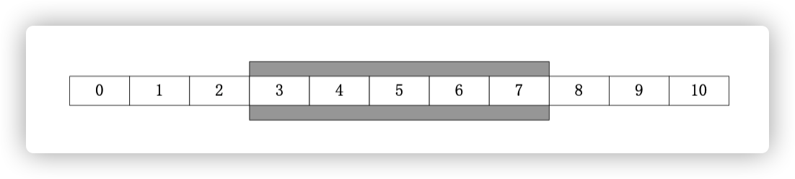

# RocketMQ 开发指南


## 产品发展史

### 1.x

- ````````````````Metaq```````````````` Metamorphosis，1.x。
- 由开源社区 killme2008 维护，开源社区非常活跃。

### 2.x

- Metaq 2.x。
- 于2012年10月份上线，在淘宝内部被广泛使用。

### 3.x

- 更名为RocketMQ。
- 基于阿里公司内部开源共建原则，RocketMQ项目只维护核心功能，去除了所有其他运行时依赖，核心功能最简化。
- 每个BU的个性化需求都在RocketMQ项目上进行深度定制。

- 在 RocketMQ 项目基础上衍生的项目如下
  - 为淘宝应用提供消息服务，`com.taobao.metaq v3.0` = RocketMQ + 淘宝个性化需求。
  - 为支付宝应用提供消息服务，`com.alipay.zpullmsg v1.0` = RocketMQ + 支付宝个性化需求。
  - 为B2B应用提供消息服务，`com.alibaba.commonmq v1.0` = Notify + RocketMQ + B2B 个性化需求。


## 专业术语

- `Producer` 消息生产者，负责产生消息，一般由业务系统负责产生消息。

- `Consumer` 消息消费者，负责消费消息，一般是后台系统负责异步消费。
- `Push Consumer` Consumer 的一种，应用通常向Consumer对象**注册一个 Listener 接口**，一旦收到消息，Consumer对象**立刻回调** Listener 接口方法。
- `Pull Consumer` Consumer 的一种，应用通常**主动调用 Consumer 的拉消息方法从 Broker 拉消息**，主动权由应用控制。
- `Producer Group` 一类 Producer 的集合名称，这类 Producer 通常发送一类消息，且发送逻辑一致。
- `Consumer Group` 一类 Consumer 的集合名称，这类 Consumer 通常消费一类消息，且消费逻辑一致。
- `Broker` **消息中转角色**，负责**存储消息**，**收发**消息，一般也称为 Server。在 JMS 规范中称为 Provider。
- `广播消费` 
  - 一条消息被多个 Consumer 消费，即使这些 Consumer 属于**同一个** `ConsumerGroup`，消息也会被 `ConsumerGroup` 中的每个 Consumer 都消费一次，广播消费中的 ConsumerGroup 概念可以认为在消息划分方面无意义。
  - 在 CORBA Notification 规范中，消费方式都属于广播消费。
  - 在 JMS 规范中，相当于`JMS publish/subscribe model`。

- `集群消费`
  - 一个 `ConsumerGroup` 中的 Consumer 实例**平均分摊**消费消息。
  - 在 CORBA Notification 规范中，无此消费方式。
  - 在 JMS 规范中，`JMS point-to-point model` 与之类似，但是 RocketMQ 的集群消费功能**大等于** PTP 模型。因为 RocketMQ 单个 ConsumerGroup 内的消费者类似于 PTP，但是一个 Topic/Queue 可以被多个 ConsumerGroup 消费。

- `顺序消息`
  - **消费消息的顺序要同发送消息的顺序一致**。
  - 在 RocketMQ 中，主要指的是**局部顺序**，即一类消息为满足顺序性，必须 Producer 单线程顺序发送，且发送到同一个队列，这样Consumer 就可以按照 Producer 发送的顺序去消费消息。
- `普通顺序消息`
  - 顺序消息的一种，**正常情况下可以保证完全的顺序消息**，但是一旦发生通信异常，Broker 重启，由于队列总数发生发化，**哈希取模**后定位的队列会发化，产生短暂的消息顺序不一致。
  - 如果业务能容忍在集群异常情况（如某个 Broker 宕机或者重启）下，消息短暂的乱序，使用普通顺序方式比较合适。
- 严格顺序消息
  - 顺序消息的一种，无论正常异常情况都能保证顺序，但是**牺牲了分布式 Failover 特性**，即 Broker 集群中只要有一台机器不可用，则整个集群都不可用，服务可用性大大降低。
  - 如果服务器部署为同步双写模式，此缺陷可通过备机**自动切换**为主避免，不过仍然会存在几分钟的服务不可用。
  - 目前已知的应用只有数据库 binlog 同步强依赖严格顺序消息，其他应用绝大部分都可以容忍短暂乱序，推荐使用普通的顺序消息。
- `Message Queue`
  - 在 RocketMQ 中，所有消息队列都是**持久化**，**长度无限**的数据结构。所谓长度无限是指队列中的每个存储单元都是定长，访问其中的存储单元使用 `Offset` 来访问，`Offset` 为 java long 类型，64 位，理论上在 100 年内不会溢出，所以认为是长度无限。
  - 队列中只保存最近几天的数据，之前的数据会按照过期时间来删除。
  - 也可以讣为 Message Queue 是一个长度无限的数组，offset 就是下标。


## 消息中间件要解决的问题

### Publish / Subscribe

- 发布订阅是消息中间件的最基本功能，也是相对于传统 RPC 通信而言。

### Message Priority

- 规范中描述的优先级是只在一个消息队列中，每条消息都有不同的优先级，一般用**整数**来描述，优先级高的消息先投递，如果消息完全在一个内存队列中，那么在投递前可以按照优先级排序，令优先级高的先投递。
- 由于 RocketMQ 所有消息都是持久化的，所以如果按照优先级来排序，开销会非常大，因此 RocketMQ 没有特意支持消息优先级，但是可以通过变通的方式实现类似功能。
  - 即单独配置一个优先级高的队列，和一个普通优先级的队列， 将不同优先级发送到不同队列即可。
- 优先级问题
  - 只要达到优先级目的即可，不是严格意以上的优先级，通常将优先级划分为高、中、低，或者再多几个级别。**每个优先级可以用不同的 topic 表示**，发消息时，指定不同的 topic 来表示优先级，这种方式可以解决绝大部分的优先级问题，但是对业务的优先级精确性做了妥协。
  - 严格的优先级，优先级用整数表示，例如 0 ~ 65535，这种优先级问题一般使用不同 topic 解决就非常不合适。如果要让 MQ 解决此问题，会对 MQ 的性能造成非常大的影响。

### Message Order

- 消息有序指的是**一类消息消费时，能按照发送的顺序来消费**。
- RocketMQ 可以严格的保证消息有序。

### Message Filter

#### Broker 端消息过滤

- 在 Broker 中，按照 Consumer 的要求做过滤。
- 优点是减少了对于 Consumer 无用消息的网络传输，缺点是增加了 Broker 的负担，实现相对复杂。
- 淘宝 Notify 支持多种过滤方式，包含直接按照消息类型过滤，灵活的语法表达式过滤，几乎可以满足最苛刻的过滤需求。
- 淘宝 RocketMQ 支持按照简单的 `Message Tag` 过滤，也支持挄照 `Message Header`、body 进行过滤。
- CORBA Notification 规范中也支持灵活的语法表达式过滤。

#### Consumer 端消息过滤

- 这种过滤方式可由应用完全自定义实现，但是缺点是很多无用的消息要传输到 Consumer 端。

### Message Persistence

1. 持久化到数据库。
2. 持久化到 KV 存储。
3. 文件记录形式持久化，例如kafka、RocketMQ。
4. 对内存数据做一个持久化镜像。


- 1、2、3三种持久化方式都具有将内存队列 Buffer 进行扩展的能力。
- 4只是一个内存的镜像，作用是当 Broker 挂掉重启后仍然能将之前内存的数据恢复出来。
- JMS 不 CORBA Notification 规范没有明确说明如何持久化，但是**持久化部分的性能直接决定了整个消息中间件的性能**。
- RocketMQ 参考了 Kafka 的持久化方式，充分**利用 Linux 文件系统内存 cache 来提高性能**。

### Message Reliablity

影响消息可靠性的几种情况

1. Broker 正常关闭。
2. Broker 异常 Crash。
3. OS Crash。
4. 机器掉电，但是能立即恢复供电情况。
5. 机器无法开机（可能是 cpu、主板、内存等关键设备损坏）。
6. 磁盘设备损坏。


- 1、2、3、4四种情况都**属于硬件资源可立即恢复情况**，RocketMQ 在返四种情况下能保证消息不用丢，或者丢失少量数据（依赖刷盘方式是同步还是异步）。
- 5、6属于单点故障，无无法恢复，一旦发生，在此**单点上的消息全部丢失**。RocketMQ 在这两种情况下，通过**异步复制**，可保证 99%的消息不丢，但是仍然会有极少量的消息可能丢失。
- 通过**同步双写技术**可以完全规避单点，**同步双写势必会影响性能，适合对消息可靠性要求极高的场合**。
- RocketMQ 从 3.0 版本开始支持同步双写。

### Low Latency Messaging

- 在消息不堆积情况下，消息到达 Broker 后，能立刻到达 Consumer。
- RocketMQ 使用**长轮询 Pull 方式**，可保证消息非常实时，消息实时性不低于 Push。

### At least Once

- 指每个消息必须投递一次。
- RocketMQ Consumer 先 pull 消息到本地，**消费完成后，才向服务器返回 ack**，如果没有消费一定不会 ack 消息， 所以 RocketMQ 可以很好的支持此特性。

### Exactly Only Once

1. 发送消息阶段，不允许发送重复的消息。

2. 消费消息阶段，不允许消费重复的消息。

   

- 只有以上两个条件都满足情况下，才能认为消息是`Exactly Only Once`，而要实现以上两点，在分布式系统环境下，不可避免要**产生巨大的开销**。
- RocketMQ 为了追求高性能，并**不保证此特性**，要求在**业务上进行去重**， 也就是说消费消息要做到**幂等性**。

- RocketMQ 虽然不能严格保证不重复，但是**正常情况下很少会出现重复发送、消费情况，只有网络异常，Consumer 启停等异常情况下会出现消息重复**。
  - 此问题的本质原因是网络调用存在不确定性，即既不成功也不失败的第三种状态，所以才产生了消息重复性问题。

### Broker 的 Buffer 满了怎么办

Broker 的 Buffer 通常指的是 **Broker 中一个队列的内存 Buffer 大小**，这类 Buffer 通常大小有限，如果 Buffer 满了以后怎么办。

#### CORBA Notification 规范中处理方式

- RejectNewEvents
  - 拒绝新来的消息，向 Producer 返回 RejectNewEvents 错误码。
- 按照特定策略丢弃已有消息
  - `AnyOrder` - Any event may be discarded on overflow. This is the default setting for this property.
  - `FifoOrder` - The first event received will be the first discarded.
  - `LifoOrder` - The last event received will be the first discarded.
  - `PriorityOrder` - Events should be discarded in priority order, such that lower priority events will be discarded before higher priority events.
  - `DeadlineOrder` - Events should be discarded in the order of shortest expiry deadline first.

#### RocketMQ实现

- RocketMQ **没有内存 Buffer 概念**，RocketMQ 的队列**都是持久化磁盘，数据定期清除**。
- 对于此问题的解决思路，RocketMQ 同其他 MQ **有非常显著的区别**，**RocketMQ 的内存 Buffer 抽象成一个无限长度的队列**，不管有多少数据进来都能装得下，这个无限是有前提的，Broker 会定期删除过期的数据。

### 回溯消费

- 回溯消费是指 Consumer 已经消费成功的消息，由于业务上需求需要重新消费，要支持此功能，**Broker 在向 Consumer 投递成功消息后，消息仍然需要保留**。
- 重新消费一般是按照时间维度，例如由于 Consumer 系统故障， 恢复后需要重新消费 1 小时前的数据，那么 Broker 要提供一种机制，可以**按照时间维度来回退消费进度**。
- **RocketMQ 支持按照时间回溯消费，时间维度精确到毫秒，可以向前回溯，也可以向后回溯**。

### 消息堆积

消息中间件的主要功能是异步解耦，迓有个重要功能是挡住前端的数据洪峰，保证后端系统的稳定性，返就要求消息中间件具有一定的消息堆积能力。

#### Buffer满载

- 消息堆积在内存 Buffer，一旦超过内存 Buffer，可以根据一定的丢弃策略来丢弃消息，如 CORBA Notification 规范中描述。
- 丢弃策略适合能容忍丢弃消息的业务，这种情况消息的**堆积能力主要在于内存 Buffer 大小**，而且**消息堆积后，性能下降不会太大，因为内存中数据多少对于对外提供的访问能力影响有限**。

#### 磁盘IO瓶颈

- 消息堆积到持久化存储系统中，文件记录形式，当消息不能在内存 Cache 命中时，要不可避免的访问磁盘，会产生大量读 IO，**读 IO 的吞吐量直接决定了消息堆积后的访问能力**。

#### 评估消息堆积能力

- 消息能堆积多少条，多少字节？即消息的堆积容量。
- 消息堆积后，发消息的吞吐量大小，是否会受堆积影响？
- 消息堆积后，正常消费的 Consumer 是否会受影响？
- 消息堆积后，访问堆积在磁盘的消息时，吞吐量有多大？

### 分布式事务

- 已知的几个分布式事务规范，如 XA，JTA 等。
  - XA 规范被各大数据库厂商广泛支持，如 Oracle，Mysql 等。 
  - XA 的 TM 实现佼佼者如 Oracle Tuxedo，在金融、电信等领域被广泛应用。
- 分布式事务涉及到**两阶段提交**问题，在数据存储方面的方面必然需要 KV 存储的支持，因为**第二阶段的提交回滚需要修改消息状态**，一定涉及到**根据 Key 去查找 Message 的动作**。
- RocketMQ 在第二阶段**绕过了根据 Key 去查找 Message** 的问题，采用第一阶段发送 `Prepared` 消息时，拿到了消息的 `Offset`，第二阶段**通过 Offset 去访问消息**，并修改状态，**Offset 就是数据的地址**。
- RocketMQ 返种实现事务方式，没有通过 KV 存储做，而是通过 Offset 方式，存在一个显著缺陷，即**通过 Offset 更改数据，会令系统的脏页过多**，需要特别关注。

### 定时消息

- 定时消息是指消息发到 Broker 后，不能立刻被 Consumer 消费，要到特定的时间点或者等待特定的时间后才能被消费。
- 如果要支持任意的时间精度，在 Broker 局面，必须要做**消息排序**，如果再**涉及到持久化，那么消息排序要不可避免的产生巨大性能开销**。
- RocketMQ 支持定时消息，但是**不支持任意时间精度**，**支持特定的 level**。

### 消息重试

Consumer 消费消息失败后，要提供一种重试机制，令消息再消费一次。

Consumer 消费消息失败通常可以认为有以下几种情况。

- 由于消息本身的原因，例如反序列化失败，消息数据本身无法处理等。

  这种错误通常需要跳过这条消息，再消费其他消息，而返条失败的消息即使立刻重试消费，99%也不成功， 所以最好提供一种定时重试机制，即过 10s 秒后再重试。

- 由于依赖的下游应用服务不可用，例如 db 连接不可用，外系统网络不可达等。

  遇到这种错误，即使跳过当前失败的消息，消费其他消息同样也会报错。这种情况建议应用 sleep 30s，再消费下一条消息，这样可以减轻 Broker 重试消息的压力。

## Overview

### RocketMQ是什么

- 是一个队列模型的消息中间件，具有高性能、高可靠、高实时、分布式特点。
- Producer、Consumer、队列都可以分布式。
- Producer 向一些队列**轮流**发送消息，**队列集合称为 Topic**。
- Consumer 如果做**广播消费**，则一个 Consumer 实例消费这个Topic对应的所有队列。
- Consumer 如果做**集群消费**，则多个 Consumer 实例**平均消费**这个Topic对应的队列集合。
- 能够保证严格的消息顺序。
- 提供丰富的消息拉叏模式。
- 高效的订阅者水平扩展能力。
- 实时的消息订阅机制。
- 亿级消息堆积能力。
- 较少的依赖。


### 物理部署结构

#### 网络部署特点

- Name Server 是一个几乎无状态节点，可集群部署，节点之间无任何信息同步。
- Broker 部署相对复杂，Broker 分为 Master 与 Slave。
  - 一个 Master 可以对应多个 Slave，但是一个 Slave 只能对应一个 Master。
  - Master 与 Slave 的对应关系通过指定相同的 BrokerName，不同的 BrokerId 来定义。
  - BrokerId 为 0 表示 Master，非 0 表示 Slave。
  - Master 也可以部署多个。每个 Broker 与 Name Server 集群中的所有节点建立长连接，定时注册 Topic 信息到所有 Name Server。
- Producer 与 Name Server 集群中的其中一个节点（随机选择）建立长连接，定期从 Name Server 取 Topic 路由信息，并向提供 Topic 服务的 Master 建立长连接，且定时向 Master 发送心跳。Producer 完全无状态，可集群部署。
- Consumer 与 Name Server 集群中的其中一个节点（随机选择）建立长连接，定期从 Name Server 取 Topic 路由信息，并向提供 Topic 服务的 Master、Slave 建立长连接，且定时向 Master、Slave 发送心跳。**Consumer 既可以从 Master 订阅消息，也可以从 Slave 订阅消息，订阅规则由 Broker 配置决定。**


### 逻辑部署结构

#### Producer Group

- 用来表示一个发送消息应用。
- 一个 Producer Group 下包含多个 Producer 实例，可以是多台机器，也可以是一台机器的多个进程，或者一个进程的多个 Producer 对象。
- 一个 Producer Group 可以发送多个 Topic 消息。
- Producer Group 作用
  - 标识一类 Producer。
  - 可以通过运维工具查询这个发送消息应用下有多个 Producer 实例。
  - **发送分布式事务消息时，如果 Producer 中途意外宕机，Broker 会主动回调 Producer Group 内的任意一台机器来确认事务状态。**

#### Consumer Group

- 用来表示一个消费消息应用。
- 一个 Consumer Group 下包含多个 Consumer 实例，可以是多台机器，也可以是多个进程，或者是一个进程的多个 Consumer 对象。
- 一个 Consumer Group 下的多个 Consumer 以**均摊方式消费消息**，如果设置为广播方式，那举这个 Consumer Group 下的每个实例都消费全量数据。


## 存储特点

### 零拷贝原理

> Consumer 消费消息过程，使用了零拷贝。

#### 使用 mmap + write 方式

**优点**

- 即使频繁调用，使用小块文件传输，效率也很高。

**缺点**

- 不能很好的利用 DMA 方式，会比 sendfile **多消耗 CPU**，**内存安全性控制复杂，需要避免 JVM Crash 问题**。

#### 使用 sendfile 方式

**优点**

- 可以利用 DMA 方式，**消耗 CPU 较少**，**大块文件传输效率高，无内存安全新问题**。

**缺点**

- 小块文件效率低于 mmap 方式，**只能是 BIO 方式传输，不能使用 NIO**。


RocketMQ 选择了第一种方式，**mmap+write** 方式，因为**有小块数据传输的需求**，效果会比 sendfile 更好。

### 文件系统

RocketMQ 选择 Linux Ext4 文件系统。

- Ext4 文件系统**删除** 1G 大小的文件通常耗时小于 50ms，而 **Ext3 文件系统耗时约 1s 左右，且删除文件时，磁盘 IO 压力极大，会导致 IO 写入超时**。
- 文件系统层面需要做调优措施。
  - 文件系统 IO 调度算法需要调整为 `deadline`，因为 deadline 算法在**随机读情况下，可以**合并读请求为顺序跳跃方式，从而提高读 IO 吞吐量**。
- Ext4 文件系统有 Bug，请注意。

### 数据存储结构


### 存储目录结构


### 数据可靠性

略

## 关键特性

### 单机性能

- 单机支持1万以上持久化队列。

- 所有数据单独存储到一个 `Commit Log`，**完全顺序写，随机读**。
- 对最终用户展现的**队列实际只存储消息在 Commit Log 的位置信息**，并且串行方式刷盘。

**优点**

- 队列轻量化，单个队列数据量非常少。
- 对磁盘的访问串行化，避免磁盘竟争，**不会因为队列增加导致 IOWAIT 增高**。

**缺点**

- **写虽然完全是顺序写，但是读却变成了完全的随机读**。
- 读一条消息，会先读 Consume Queue，再读 Commit Log，**增加了开销**。
- 要保证 Commit Log 与 Consume Queue 完全的一致，增加了编程的复杂度。

**缺点的解决方案**

- 随机读，**尽可能让读命中 PAGECACHE，减少 IO 读操作，所以内存越大越好**。如果系统中堆积的消息过多， 读数据要访问磁盘不会由于随机读导致系统性能急剧下降。
  - 访问 PAGECACHE 时，即使只访问 1k 的消息，系统也会提前预读出更多数据，在下次读时，就可能命中内存。
  - 随机访问 Commit Log 磁盘数据，**系统 IO 调度算法设置为 NOOP 方式**，会在**一定程度上将完全的随机读变成顺序跳跃方式**，而**顺序跳跃方式读较完全的随机读性能会高 5 倍以上**。
  - 4k 的消息在完全随机访问情况下，仍然可以达到 8K 次每秒以上的读性能。
- 由于 **Consume Queue 存储数据量极少**，而且是**顺序读**，在 PAGECACHE 预读作用下，即使堆积情况下，**Consume Queue 的读性能几乎与内存一致**。所以可以为 `Consume Queue` 完全不会阻碍读性能。
- Commit Log 中**存储了所有的元信息**，包含消息体，类似于 Mysql、Oracle 的 redolog，所以只要有 Commit Log 在，Consume Queue 即使数据丢失，仍然可以恢复出来。


### 刷盘策略

RocketMQ 的所有消息都是持久化的，**先写入系统 PAGECACHE，然后刷盘**，可以保证内存与磁盘都有一份数据， 访问时，直接从内存读取。

#### 异步刷盘


在有 RAID 卡，SAS 15000 转磁盘测试顺序写文件，速度可以达到 300M 每秒左右，而线上的网卡一般都为千兆网卡，写磁盘速度明显快于数据网络入口速度，那么是否可以做到写完内存就向用户返回，由后台线程刷盘呢。

- 由于磁盘速度大于网卡速度，那么刷盘的速度肯定可以跟上消息的写入速度。
- 即使由于此时系统压力过大，堆积消息，除了写入 IO，还有读取 IO，出现磁盘读取落后情况， 也不会导致系统内存溢出。
  - 写入消息到 PAGECACHE 时，如果内存不足，则尝试丢弃干净的 PAGE，腾出内存供新消息使用，策略 是 LRU 方式。
  - 如果干净页不足，此时**写入 PAGECACHE 会被阻塞**，系统尝试刷盘部分数据，大约每次尝试 32 个 PAGE，来找出更多干净 PAGE。

#### 同步刷盘

>同步刷盘与异步刷盘的唯一区别是**异步刷盘写完 PAGECACHE 直接返回，而同步刷盘需要等待刷盘完成才返回**。


同步刷盘流程。

- 写入 PAGECACHE 后，线程等待，通知刷盘线程刷盘。
- 刷盘线程刷盘后，唤醒前端等待线程，可能是一批线程。
- 前端等待线程向用户返回成功。

### 消息查询

#### 按照 Message Id 查询消息

MessageId的组成


- MsgId 总共 16 字节，包含消息存储主机地址，消息 Commit Log offset。
- 从 MsgId 中解析出 Broker 的地址和 Commit Log 的偏移地址，然后按照存储格式所在位置消息 buffer 解析成一个完整的消息。

#### 按照 Message Key 查询消息

索引的逻辑结构，类似HashMap的实现。


1. 根据查询的 key 的 `hashcode%slotNum` 得到具体的槽的位置，`slotNum` 是一个索引文件里面包含的最大槽的数目。
2. 根据 `slotValue`(slot 位置对应的值)查找到索引项列表的最后一项，倒序排列，`slotValue` 总是指向最新的一个索引项。
3. 遍历索引项列表返回查询时间范围内的结果集(默认一次最大返回的 32 条记录)。
4. Hash 冲突。
   - 寻找 key 的 slot 位置时相当于执行了两次散列函数，一次 key 的 hash，一次 key 的 hash 值取模， 因此返里存在两次冲突的情况。
   - 第一种，key 的 hash 值不同但模数相同，此时查询的时候会在比较一次 key 的 hash 值（每个索引项保存了 key 的 hash 值），过滤掉 hash 值不相等的项。
   - 第二种，hash 值相等但 key 不等， 出于性能的考虑冲突的检测放到客户端处理（key 的原始值是存储在消息文件中的，避免对数据文件的解析）， 客户端比较一次消息体的 key 是否相同。
5. 存储。
   - 为了节省空间索引项中存储的时间是时间差值（存储时间-开始时间，开始时间存储在索引文件头文件中）。
   - 整个索引文件是定长的，结构也是固定的。

### 服务器消息过滤

RocketMQ 的消息过滤方式有别于其他消息中间件，是在订阅时，再做过滤。

`Comsume Queue` **单个存储单元结构**。


1. 在 Broker 端进行 Message Tag 比对，先遍历 Consume Queue，如果存储的 Message Tag 与订阅的 Message Tag 不符合，则跳过，继续比对下一个，符合则传输给 Consumer。注意：Message Tag 是字符串形式，**Consume Queue 中存储的是其对应的 hashcode，比对时也是比对 hashcode**。
2. Consumer 收到过滤后的消息后，同样也要执行在 Broker 端的操作，但是**比对的是真实的 Message Tag 字符串，而不是 Hashcode**。


设计的如此过滤的原因

- Message Tag 存储 Hashcode，是为了在 Consume Queue **定长方式存储**，节约空间。
- **过滤过程中不会访问 Commit Log 数据，可以保证堆积情况下也能高效过滤**。
- 即使存在 Hash 冲突，也可以在 Consumer 端进行修正，保证万无一失。

### 长轮询Pull

- RocketMQ 的 Consumer 都是**从 Broker 拉消息来消费**，但是为了能做到实时收消息，RocketMQ 使用**长轮询**方式，可以保证消息实时性同 Push 方式一致。

- 这种长轮询方式类似于 Web QQ 收发消息机制。

### 顺序消息

#### 顺序消息原理


#### 顺序消息缺陷

- 发送顺序消息无法利用集群 FailOver 特性。
- 消费顺序消息的并行度依赖于**队列数量**。
- 队列热点问题，个别队列由于哈希不均导致消息过多，消费速度跟不上，产生消息堆积问题。
- 遇到消息失败的消息，无法跳过，当前队列消费暂停。

### 事务消息


### 发送消息负载均衡


- Producer采用了`Roundbin`方式，轮询发送消息到Topic下的每个Queue。
- 通过增加机器，可以水平扩展队列容量。

### 订阅消息负载均衡


- 消费者注册后，会消费指定队列中的消息。
- 可以**水平扩展** Consumer 来提供消费能力。
- Consumer 数量要小于等于队列数量，如果 Consumer 超过队列数量，那么多余的 Consumer 将不能消费消息。


负载均衡示例

| 队列数量 | Consumer数量 | Rebalance结果          |
| -------- | ------------ | ---------------------- |
| 5        | 2            | C1: 3，C2: 2           |
| 6        | 3            | C1: 2，C2: 2，C3: 2    |
| 10       | 20           | C1~C10: 1，C11~C20: 0  |
| 20       | 6            | C1: 4，C2: 4，c3~C6: 3 |

### 单队列并行消费



- 单队列并行消费采用滑动窗口方式并行消费。
- 消息在一个**滑动窗口**区间，可以有多个线程并行消费，但是每次提交的 Offset 都是**最小 Offset**。

### 发送定时消息

略

### 消息消费失败，定时重试

略

### HA

高可用方案

- 同步双写。
- 异步复制。
  - 异步复制的实现思路非常简单，Slave 启动一个线程，不断从 Master 拉取 `Commit Log` 中的数据，然后在**异步 build 出 Consume Queue 数据结构**。
  - 整个实现过程基本同 Mysql 主从同步类似。

### 单个JVM进程利用超大内存


1. Producer 发送消息，消息从 socket 迕入 java 堆。
2. Producer 发送消息，消息从 java 堆转入 PAGACACHE，物理内存。
3. Producer 发送消息，由**异步线程刷盘**，消息从 PAGECACHE 刷入磁盘。
4. Consumer 拉消息（正常消费），消息直接从 PAGECACHE（数据在物理内存）转入 socket，到达 consumer， 不经过 java 堆。这种消费场景最多，线上 96G 物理内存，按照 1K 消息算，可以在物理内存缓存 1 亿条消息。
5. Consumer 拉消息（异常消费），消息直接从 PAGECACHE（数据在虚拟内存）转入 socket。
6. Consumer 拉消息（异常消费），由于 Socket 访问了虚拟内存，产生缺页中断，此时会产生磁盘 IO，从磁盘 Load 消息到 PAGECACHE，然后直接从 socket 发出去。

### 消息堆积问题解决方法

性能堆积指标

| 被影响的性能指标                   | 堆积性能指标                                              |
| ---------------------------------- | --------------------------------------------------------- |
| 消息的堆积容量                     | 依赖磁盘大小                                              |
| 发消息吞吐量大小                   | 无 SLAVE 情况，会受一定影响 <br />有 SLAVE 情况，不受影响 |
| 正常消费的Consumer                 | 无 SLAVE 情况，会受一定影响 <br />有 SLAVE 情况，不受影响 |
| 访问堆积在磁盘的消息时，吞吐量影响 | 与访问的并发有关，最慢会降到 5000 左右                    |


- 在有 Slave 情况下，Master 一旦发现 Consumer 访问堆积在磁盘的数据时，会向 Consumer 下达一个重定向指令，令 Consumer 从 Slave 拉取数据，这样正常的发消息不正常消费的 Consumer 都不会因为消息堆积受影响，因为**系统将堆积场景与非堆积场景分割在了两个不同的节点处理**。
- Slave 不会写性能下降。Slave 的消息写入只追求吞吐量，不追求实时性，只要整体的吞吐量高就可以。
- Slave 每次都是从 Master 拉取一批数据，如 1M，这种批量顺序写入方式即使堆积情况，整体吞吐量影响相对较小，只是**写入 RT 会变长**。


## 消息过滤

### 简单消息过滤

- 简单消息过滤通过指定多个 Tag 来过滤消息，过滤动作在服务器进行。

#### 高级消息过滤


- Broker 所在的机器会启动多个 `FilterServer` 过滤进程。
- **Consumer 启动后，会向 FilterServer 上传一个过滤的 Java 类。**
- Consumer 从 FilterServer 拉消息，FilterServer 将请求转发给 Broker，FilterServer 从 Broker 收到消息后，按照 Consumer 上传的 Java 过滤程序做过滤，过滤完成后返回给 Consumer。


方案总结

- 使用 CPU 资源来换取网卡流量资源。
- FilterServer 与 Broker 部署在同一台机器，数据通过本地回环通信，不走网卡。
- 一台 Broker 部署多个 FilterServer，充分利用 CPU 资源，因为单个 Jvm 难以全面利用高配的物理机 CPU 资源。
- 因为过滤代码使用 Java 语言来编写，应用几乎可以做任意形式的服务器端消息过滤。
- 使用 Java 诧言迕行作为过滤表达式是一个双刃剑，方便了应用的过滤操作，但是带来了服务器端的**安全风险**。 需要应用来保证过滤代码安全，例如在过滤程序里尽可能不做申请大内存，创建线程等操作。避免 Broker 服 务器发生资源泄漏。


## 通讯组件

- RocketMQ 通信组件使用了 `Netty-4.0.9.Final`，在之上做了简单的协议封装。

### 网络协议


1. 大端 4 个字节整数，等于 2、3、4 长度总和。
2. 大端 4 个字节整数，等于 3 的长度。
3. 使用 json 序列化数据。
4. 应用自定义二进制序列化数据。

#### Header格式

```json
{
    "code":0,
    "language":"JAVA",
    "version":0,
    "opaque":0,
    "flag":1,
    "remark":"hello, I am respponse /127.0.0.1:27603",
    "extFields":{
        "count":"0",
        "messageTitle":"HelloMessageTitle"
    }
}
```

| Header字段名 | 类型                   | Request                                                      | Response                                        |
| ------------ | ---------------------- | ------------------------------------------------------------ | ----------------------------------------------- |
| code         | 整数                   | 请求操作代码，请求接收方根据不同的代码做不同的操作           | 应答结果代码，0 表示成功，非 0 表示各种错误代码 |
| language     | 字符串                 | 请求发起方实现语言，默认 JAVA                                | 应答接收方实现语言                              |
| version      | 整数                   | 请求发起方程序版本                                           | 应答接收方程序版本                              |
| opaque       | 整数                   | 请求发起方在同一连接上不同的请求标识代码，多线程连接复用使用 | 应答方不做修改，直接返回                        |
| flag         | 整数                   | 通信层的标志位                                               | 通信层的标志位                                  |
| remark       | 字符串                 | 传输自定义文本信息                                           | 错误详细描述信息                                |
| extFields    | HashMap<String,String> | 请求自定义字段                                               | 应答自定义字段                                  |

### 心跳处理

- 通信组件本身不处理心跳，由上层进行心跳处理。

### 连接复用

- 同一个网络连接，客户端多个线程可以同时发送请求，应答响应通过 `header` 中的 `opaque` 字段来标识。

### 超时连接

- 如果某个连接超过特定时间没有活动（无读写事件），则自动关闭此连接，并通知上层业务，清除连接对应的注册信息。


## 服务发现

>Name Server。

- Name Server 是专为 RocketMQ 设计的**轻量级名称服务**，代码小于 1000 行，具有简单、**可集群横向扩展**、**无状态**等特点。
- **RocketMQ 将要支持的主备自动切换功能会强依赖 Name Server。**


## 客户端使用指南

### 客户端如何寻址

RocketMQ 有多种配置方式可以令客户端找到 Name Server，然后通过 Name Server 再找到 Broker。优先级由高到低，高优先级会覆盖低优先级。

#### 代码中指定

```java
producer.setNamesrvAddr("192.168.0.1:9876;192.168.0.2:9876");
consumer.setNamesrvAddr("192.168.0.1:9876;192.168.0.2:9876");
```

#### Java 启动参数中指定

```sh
-Drocketmq.namesrv.addr=192.168.0.1:9876;192.168.0.2:9876
```

#### 环境变量指定

```sh
export NAMESRV_ADDR=192.168.0.1:9876;192.168.0.2:9876
```

#### HTTP 静态服务器寻址

- 默认的方式。
- 客户端启动后，会定时访问一个静态 HTTP 服务器，`http://jmenv.tbsite.net:8080/rocketmq/nsaddr`。

- 客户端默认每隔 2 分钟访问一次这个 HTTP 服务器，并更新本地的 Name Server 地址。

- URL 已经在代码中写死，可通过修改 `/etc/hosts` 文件来改发要访问的服务器，例如在`/etc/hosts` 增加如下配置。

  ```sh
  10.232.22.67  jmenv.taobao.net
  ```

- **推荐使用 HTTP 静态服务器寻址方式，好处是客户端部署简单，丏 Name Server 集群可以热升级。**

### 自定义客户端行为

#### 客户端API形式

- `DefaultMQProducer`、`TransactionMQProducer`、`DefaultMQPushConsumer`、`DefaultMQPullConsumer` 都继承于 `ClientConfig` 类，`ClientConfig` 为客户端的公共配置类。

- 客户端的配置都是 get、set 形式，每个参数都可以用 spring 来配置，也可以在代码中配置。

#### 客户端的公共配置

| 参数名                        | 默认值  | 说明                                                         |
| ----------------------------- | ------- | ------------------------------------------------------------ |
| namesrvAddr                   |         | Name Server 地址列表，多个 NameServer 地址用分号隔开。       |
| clientIP                      | 本机IP  | 客户端本机 IP 地址，某些机器会发生无法识别客户端 IP 地址情况，需要应用在代码中强制指定 |
| instanceName                  | DEFAULT | 客户端实例名称，客户端创建的多个 Producer、 Consumer 实际是共用一个内部实例（这个实例包含网络连接、线程资源等） |
| clientCallbackExecutorThreads | 4       | 通信层异步回调线程数                                         |
| pollNameServerInteval         | 30000   | 轮询 Name Server 间隔时间，单位毫秒                          |
| heartbeatBrokerInterval       | 30000   | 向 Broker 发送心跳间隔时间，单位毫秒                         |
| persistConsumerOffsetInterval | 5000    | 持久化 Consumer 消费进度间隔时间，单位毫秒                   |


#### Producer 配置

| 参数名                           | 默认值           | 说明                                                         |
| -------------------------------- | ---------------- | ------------------------------------------------------------ |
| producerGroup                    | DEFAULT_PRODUCER | Producer 组名，多个 Producer 如果属于一个应用，发送同样的消息，则应该将它们归为同一组 |
| createTopicKey                   | TBW102           | 在发送消息时，自动创建服务器不存在的 topic，需要指定 Key     |
| defaultTopicQueueNums            | 4                | 在发送消息时，自动创建服务器不存在的 topic，默认创建的队列数 |
| sendMsgTimeout                   | 10000            | 发送消息超时时间，单位毫秒                                   |
| compressMsgBodyOverHowmuch       | 4096             | 消息 Body 超过多大开始压缩(Consumer 收到消息会自动解压缩)，单位字节 |
| retryAnotherBrokerWhenNotStoreOK | FALSE            | 如果发送消息返回 sendResult，但是 `sendStatus!=SEND_OK`，是否重试发送 |
| maxMessageSize                   | 131072           | 客户端限制的消息大小，超过报错，同时服务端也会限制，128K     |
| transactionCheckListener         |                  | 事务消息回查监听器，如果发送事务消息， 必须设置              |
| checkThreadPoolMinSize           | 1                | Broker 回查 Producer 事务状态时，线程池大小                  |
| checkThreadPoolMaxSize           | 1                | Broker 回查 Producer 事务状态时，线程池大小                  |
| checkRequestHoldMax              | 2000             | Broker 回查 Producer 事务状态时， Producer 本地缓冲请求队列大小 |


#### PushConsumer 配置

| 参数名                       | 默认值                        | 说明                                                         |
| ---------------------------- | ----------------------------- | ------------------------------------------------------------ |
| consumerGroup                | DEFAULT_CONSUMER              | Consumer 组名，多个 Consumer 如果属于一个应用，订阅同样的消息，且消费逻辑一致，则应该将它们归为同一组 |
| messageModel                 | CLUSTERING                    | 消息模型，支持以下两种 1、集群消费 2、广播消费               |
| consumeFromWhere             | CONSUME_FROM_LAST_OFFSET      | Consumer 启动后，默认从什么位置开始消费                      |
| allocateMessageQueueStrategy | AllocateMessageQueueAveragely | Rebalance 算法实现策略                                       |
| subscription                 | {}                            | 订阅关系                                                     |
| messageListener              |                               | 消息监听器                                                   |
| offsetStore                  |                               | 消费进度存储                                                 |
| consumeThreadMin             | 10                            | 消费线程池数量                                               |
| consumeThreadMax             | 20                            | 消费线程池数量                                               |
| consumeConcurrentlyMaxSpan   | 2000                          | 单队列并行消费允许的最大跨度                                 |
| pullThresholdForQueue        | 1000                          | 拉消息本地队列缓存消息最大数                                 |
| pullInterval                 | 0                             | 拉消息间隔，由于是长轮询，所以 为 0，但是如果应用为了流控，也 可以设置大于 0 的值，单位毫秒 |
| consumeMessageBatchMaxSize   | 1                             | 批量消费，一次消费多少条消息                                 |
| pullBatchSize                | 32                            | 批量拉消息，一次最多拉多少条                                 |


#### PullConsumer 配置

| 参数名                           | 默认值                        | 说明                                                         |
| -------------------------------- | ----------------------------- | ------------------------------------------------------------ |
| consumerGroup                    | DEFAULT_CONSUMER              | Consumer 组名，多个 Consumer 如果属于一个应 用，订阅同样的消息，且消 费逻辑一致，则应该将它们 归为同一组 |
| brokerSuspendMaxTimeMillis       | 20000                         | 长轮询，Consumer 拉消息请求在 Broker 挂起最长时间， 单位毫秒 |
| consumerTimeoutMillisWhenSuspend | 30000                         | 长轮询，Consumer 拉消息请 求在 Broker 挂起超过指定时 间，客户端认为超时，单位 毫秒 |
| consumerPullTimeoutMillis        | 10000                         | 非长轮询，拉消息超时时间， 单位毫秒                          |
| messageModel                     | BROADCASTING                  | 消息模型，支持以下两种 1、集群消费 2、广播消费               |
| messageQueueListener             |                               | 监听队列变化                                                 |
| offsetStore                      |                               | 消费进度存储                                                 |
| registerTopics                   | []                            | 注册的 topic 集合                                            |
| allocateMessageQueueStrategy     | AllocateMessageQueueAveragely | Rebalance 算法实现策略                                       |

### Message 数据结构

#### 针对 Producer

| 字段名         | 默认值 | 说明                                                         |
| -------------- | ------ | ------------------------------------------------------------ |
| Topic          | null   | 必填，线下环境不需要申请，线上环境需要申请后才能使用         |
| Body           | null   | 必填，二进制形式，序列化由应用决定，Producer 与 Consumer 要协商好序列化形式 |
| Tags           | null   | 选填，类似于 Gmail 为每封邮件设置的标签，方便服务器过滤使用。目前只支持每个消息设置一个 tag，所以也可以类比为 Notify 的 `MessageType` 概念 |
| Keys           | null   | 选填，代表这条消息的业务关键词，服务器会根据 keys 创建哈希索引，设置后， 可以在 Console 系统根据 Topic、Keys 来查询消息，由于是哈希索引，请尽可能保证 key 唯一，例如订单号，商品 Id 等 |
| Flag           | 0      | 选填，完全由应用来设置，RocketMQ 不做干预                    |
| DelayTimeLevel | 0      | 选填，消息延时级别，0 表示不延时，大于 0 会延时特定的时间才会被消费 |
| WaitStoreMsgOK | TRUE   | 选填，表示消息是否在服务器落盘后才返回应答                   |

#### 针对 Consumer

- 在 Producer 端，使用 `com.alibaba.rocketmq.common.message.Message` 这个数据结构。

- 由于 **Broker 会为 Message 增加数据结构**， 所以消息到达 Consumer 后， 会在 Message 基础之上增加多个字段。

-  Consumer 看到的是 `com.alibaba.rocketmq.common.message.MessageExt` 这个数据结构，MessageExt 继承于 Message。

## Broker 使用指南

### Broker配置参数

#### 获取Broker的默认配置

```shell
sh mqbroker -m
```

#### Broker 启动时，如何加载配置

```shell
### 第一步生成 Broker 默讣配置模版

sh mqbroker -m > broker.p

### 第二步修改配置文件, broker.p

### 第三步加载修改过的配置文件

nohup sh mqbroker -c broker.p
```

#### 动态更新地址

```shell
### 修改地址为 192.168.1.100:10911 的 Broker 消息保存时间为 24 小时

sh mqadmin updateBrokerConfig -b 192.168.1.100:10911 -k fileReservedTime -v 24
```

| 字段名                            | 默认值                   | 说明                                                         |
| --------------------------------- | ------------------------ | ------------------------------------------------------------ |
| listenPort                        | 10911                    | Broker 对外服务的监听端口                                    |
| namesrvAddr                       | null                     | Name Server 地址                                             |
| brokerIP1                         | 本机 IP                  | 本机 IP 地址，默认系统自动 识别，但是某些多网卡机器会 存在识别错误的情况，这种情 况下可以人工配置 |
| brokerName                        | 本机主机名               |                                                              |
| brokerClusterName                 | DefaultCluster           | Broker 所属哪个集群                                          |
| brokerId                          | 0                        | BrokerId，必须是大等于 0 的 整数，0 表示 Master，>0 表 示 Slave，一个 Master 可以挂 多个 Slave，Master 与 Slave 通过 BrokerName 来配对 |
| autoCreateTopicEnable             | TRUE                     | 是否允许 Broker 自动创建 Topic，建议线下开启，线上 关闭      |
| autoCreateSubscriptionGroup       | TRUE                     | 是否允许 Broker 自动创建订 阅组，建议线下开启，线上关 闭     |
| rejectTransactionMessage          | FALSE                    | 是否拒绝事务消息接入                                         |
| fetchNamesrvAddrByAddressServer   | FALSE                    | 是否从 web 服务器获取 Name Server 地址，针对大规模的 Broker 集群建议使用这种方式 |
| storePathCommitLog                | $HOME/store/commitlog    | commitLog 存储路径                                           |
| storePathConsumeQueue             | $HOME/store/consumequeue | 消费队列存储路径                                             |
| storePathIndex                    | $HOME/store/index        | 消息索引存储路径                                             |
| storeCheckpoint                   | $HOME/store/checkpoint   | checkpoint 文件存储路径                                      |
| abortFile                         | $HOME/store/abort        | abort 文件存储路径                                           |
| deleteWhen                        | 4                        | 删除文件时间点，默认凌晨 4 点                                |
| fileReservedTime                  | 48                       | 文件保留时间，默认 48 小时                                   |
| maxTransferBytesOnMessageInMemory | 262144                   | 单次 Pull 消息（内存）传输的最大字节数，256K                 |
| maxTransferCountOnMessageInMemory | 32                       | 单次 Pull 消息（内存）传输的最大条数                         |
| maxTransferBytesOnMessageInDisk   | 65536                    | 单次 Pull 消息（磁盘）传输的最大字节数，64K                  |
| maxTransferCountOnMessageInDisk   | 8                        | 单次 Pull 消息（磁盘）传输的最大条数                         |
| messageIndexEnable                | TRUE                     | 是否开启消息索引功能                                         |
| messageIndexSafe                  | FALSE                    | 是否提供安全的消息索引机 制，索引保证不丢                    |
| haMasterAddress                   |                          | 在 Slave 上直接设置 Master 地址，默认从 Name Server 上自动获取，也可以手工强制配置 |
| brokerRole                        | ASYNC_MASTER             | Broker 的角色：<br />`ASYNC_MASTER` 异步复制、`Master- SYNC_MASTER` 同步、双写 Master- SLAVE |
| flushDiskType                     | ASYNC_FLUSH              | 刷盘方式：<br />`ASYNC_FLUSH` 异步刷盘、 `SYNC_FLUSH` 同步刷盘 |
| cleanFileForciblyEnable           | TRUE                     | 磁盘满、且无过期文件情况下 TRUE 表示强制删除文件，优 先保证服务可用 FALSE 标记服务不可用，文件不删除 |

### Broker 集群搭建

- Slave 不可写，但可读，类似于 Mysql 主备方式。

#### 单个 Master

- 这种方式风险较大，一旦 Broker 重启或者宕机时，会导致整个服务不可用，不建议线上环境使用。

#### 多 Master 模式

- 一个集群无 Slave，全是 Master。
- `优点` 
  - 配置简单，单个 Master 宕机或重启维护对应用无影响。
  - 在磁盘配置为 RAID10 时，即使机器宕机不可恢复情况下，由于 RAID10 磁盘非常可靠，消息也不会丢（异步刷盘丢失少量消息，同步刷盘一条不丢）。
  - 性能最高。
- 缺点
  - 单台机器宕机期间，这台机器上未被消费的消息在机器恢复之前不可订阅，消息实时性会受到影响。

配置

```shell
### 先启动 Name Server，例如机器 IP 为：192.168.1.1:9876

nohup sh mqnamesrv &

### 在机器 A，启动第一个 Master

nohup sh mqbroker -n 192.168.1.1:9876 -c $ROCKETMQ_HOME/conf/2m-noslave/broker-a.properties &

### 在机器 B，启动第二个 Master

nohup sh mqbroker -n 192.168.1.1:9876 -c $ROCKETMQ_HOME/conf/2m-noslave/broker-b.properties &
```

#### 多 Master 多Slave模式，异步复制

- 每个 Master 配置一个 Slave，有多对 Master-Slave。
- HA 采用**异步复制**方式，**主备有短暂消息延迟，毫秒级。**
- 优点
  - 即使磁盘损坏，消息丢失的非常少，且消息实时性不会受到影响，因为 Master 宕机后，消费者仍然可以从 Slave 消费，此过程对应用透明。
  - 不需要人工干预。性能同多 Master 模式几乎一样。
- 缺点
  - Master 宕机，磁盘损坏情况，会丢失少量消息。


**启动方式**

```shell
### 先启动 Name Server，例如机器 IP 为：192.168.1.1:9876

nohup sh mqnamesrv &

### 在机器A，启动第一个 Master

nohup sh mqbroker -n 192.168.1.1:9876 -c $ROCKETMQ_HOME/conf/2m-2s-async/broker-a.properties &

### 在机器B，启动第二个 Master

nohup sh mqbroker -n 192.168.1.1:9876 -c $ROCKETMQ_HOME/conf/2m-2s-async/broker-b.properties &

### 在机器 C，启动第一个 Slave
nohup sh mqbroker -n 192.168.1.1:9876 -c $ROCKETMQ_HOME/conf/2m-2s-async/broker-a-s.properties &

### 在机器 D，启动第二个 Slave

nohup sh mqbroker -n 192.168.1.1:9876 -c $ROCKETMQ_HOME/conf/2m-2s-async/broker-b-s.properties &
```


#### 多 Master 多 Slave 模式，同步双写

- 每个 Master 配置一个 Slave，有多对 Master-Slave。
- **HA 采用同步双写方式，主备都写成功，向应用返回成功**。
- 优点
  - 数据与服务都无单点，Master 宕机情况下，消息无延迟，服务可用性与数据可用性都非常高。
- 缺点
  - 性能比异步复制模式略低，大约低 10%左右，发送单个消息的 RT 会略高。
  - 目前主宕机后，备机不能自动切换为主机，后续会支持自动切换功能。


配置

- Broker 与 Slave 配对是通过指定相同的 brokerName 参数来配对。
- Master 的 BrokerId 必须是 0，Slave 的 BrokerId 必须是大于 0 的数。
-  Master 下面可以挂载多个 Slave，同一 Master 下的多个 Slave 通过指定不同的 BrokerId 来区分。
- `$ROCKETMQ_HOST` 指的是 RocketMQ 安装目录，需要用户自己设置此环境变量。

```shell
### 先启动 Name Server，例如机器 IP 为：192.168.1.1:9876

nohup sh mqnamesrv &

### 在机器 A，启动第一个 Master

nohup sh mqbroker -n 192.168.1.1:9876 -c $ROCKETMQ_HOME/conf/2m-2s-sync/broker-a.properties &

### 在机器 B，启动第二个 Master

nohup sh mqbroker -n 192.168.1.1:9876 -c $ROCKETMQ_HOME/conf/2m-2s-sync/broker-b.properties &

### 在机器 C，启动第一个 Slave

nohup sh mqbroker -n 192.168.1.1:9876 -c $ROCKETMQ_HOME/conf/2m-2s-sync/broker-a-s.properties &

### 在机器 D，启动第二个 Slave

nohup sh mqbroker -n 192.168.1.1:9876 -c $ROCKETMQ_HOME/conf/2m-2s-sync/broker-b-s.properties &
```

### Broker 重启对客户端的影响

- Broker 重启可能会导致正在发往这台机器的的消息发送失败。

- RocketMQ 提供了一种优雅关闭 Broker 的方法，通过执行命令清除 Broker 的写权限，过 40s 后，所有客户端都会更新 Broker 路由信息，此时再关闭 Broker 就不会发生发送消息失败的情况，因为所有消息都发往了其他 Broker。

  ```shell
  sh mqadmin wipeWritePerm -b brokerName -n namesrvAddr
  ```

  

## Producer 最佳实践

### 发送消息注意事项

- 一个应用尽可能用一个 Topic，**消息子类型用 tags 来标识**，tags 可以由应用自由设置。只有发送消息设置了 tags，**消费方在订阅消息时，才可以利用 tags 在 broker 做消息过滤**。
- **每个消息在业务局面的唯一标识码，要设置到 keys 字段**，方便将来定位消息丢失问题。服务器会为每个消息创建索引（哈希索引），应用可以通过 topic，key 来查询返条消息内容，以及消息被谁消费。**由于是哈希索引，请务必保证 key 尽可能唯一，这样可以避免潜在的哈希冲突**。

- 消息发送成功或者失败，要打印消息日志，务必要打印 `sendresult` 和 `key` 字段。
- **send 消息方法，只要不抛异常，就代表发送成功**。但是发送成功会有多个状态，在 sendResult 里定义。
  - `SEND_OK` 消息发送成功。
  - `FLUSH_DISK_TIMEOUT` 消息发送成功，但是服务器刷盘超时，消息已经进入服务器队列，只有此时服务器宕机，消息才会丢失。
  - `FLUSH_SLAVE_TIMEOUT` 消息发送成功，但是服务器同步到 Slave 时超时，消息已经进入服务器队列，只有此时服务器宕机，消息才会丢失。
  - `SLAVE_NOT_AVAILABLE` 消息发送成功，但是此时 slave 不可用，消息已经进入服务器队列，只有此时服务器宕机，消息才会丢失。
- 对于精卫发送**顺序消息**的应用， 由于顺序消息的局限性， 可能会涉及到主备自动切换问题， 所以如果 sendresult 中的 status 字段不等于SEND_OK，就应该尝试重试。对于其他应用，则没有必要返样。
- **对于消息不可丢失应用，务必要有消息重发机制。**例如如果消息发送失败，存储到数据库，能有定时程序尝试重发，或者人工触发重发。

### 消息发送失败如何处理

- Producer 的 send 方法本身支持内部重试。
  - 至多重试 3 次。
  - 如果发送失败，则轮转到下一个 Broker。
  - 这个方法的**总耗时**时间不超过 `sendMsgTimeout` 设置的值，默认 10s。所以，**如果本身向 broker 发送消息产生超时异常，就不会再做重试**。
- 以上策略仍然不能保证消息一定发送成功，为保证消息一定成功，**如果调用 send 同步方法发送失败，则尝试将消息存储到 db，由后台线程定时重试，保证消息一定到达 Broker**。
- MQ内部没有做持久化重试的原因。
  - MQ 的客户端设计为无状态模式，方便任意的水平扩展，且对机器资源的消耗仅仅是 cpu、内存、网络。
  - 如果 MQ 客户端内部集成一个 KV 存储模块，那举数据只有同步落盘才能较可靠，而同步落盘本身性能开销较大，所以通常会采用异步落盘，又由亍应用关闭过程不受 MQ 运维人员控制，可能经常会发生 kill -9 返样 暴力方式关闭，造成数据没有及时落盘而丢失。
  - Producer 所在机器的可靠性较低，一般为虚拟机，不适合存储重要数据。

### 选择 oneway 形式发送

一个 RPC 调用的过程

1. 客户端发送请求到服务器。
2. 服务器处理该请求。
3. 服务器向客户端返回应答。


一个 RPC 的耗时时间是上述三个步骤的总和，而某些场景要求耗时非常短，但是对可靠性要求并不高，例日志收集类应用，此类应用可以采用 oneway 形式调用，**oneway 形式只发送请求不等待应答**，而发送请求在客户端实现层面仅仅是一个 os 系统调用的开销，即将数据写入客户端的 socket 缓冲区，此过程耗时通常在微秒级。

### 发送顺序消息注意事项

略

## Consumer 最佳实践

### 消费过程做到幂等

RocketMQ 无法避免消息重复，所以如果业务对消费重复非常敏感，务必要在业务层面去重。

- 将消息的唯一键，可以是 msgId，也可以是消息内容中的唯一标识字段，例如订单 Id 等，消费之前判断是否在 Db 或者 Tair(全局 KV 存储)中存在，如果不存在则插入，并消费，否则跳过。
- 使用业务层面的状态机去重。

### 消费失败处理方式

略

### 消费速度慢处理方式

#### 提高消费并行度

消息并行度与消息吞吐量关系


消费并行度与消费 RT 关系


- 绝大部分消息消费行为属于 IO 密集型，即可能是操作数据库，或者调用 RPC，这类消费行为的消费速度在于**后端数据库或者外系统的吞吐量**，**通过增加消费并行度，可以提高总的消费吞吐量**，但是并行度增加到一定程度，反而会下降，如图所示，呈现抛物线形式。
- 修改消费并行度方法。
  - **同一个 ConsumerGroup 下，通过增加 Consumer 实例数量来提高并行度，超过订阅队列数的 Consumer 实例无效**。可以通过加机器，或者在已有机器启动多个进程的方式。
  - 提高单个 Consumer 的消费并行线程，通过修改以下参数。
    - consumeThreadMin。
    - consumeThreadMax。

#### 批量方式消费

- 某些业务流程如果支持**批量方式**消费，则可以很大程度上提高消费吞吐量。
- 通过设置 consumer 的 `consumeMessageBatchMaxSize` 参数，默认是 1，即一次只消费一条消息，例如设置为 N，那举每次消费的消息数小于等于 N。

#### 跳过非重要消息

- **发生消息堆积时，如果消费速度一直追不上发送速度，可以选择丢弃不重要的消息。**
- 当某个队列的消息数堆积到 100000 条以上，则尝试丢弃部分或全部消息，这样就可以快速追上发送消息的速度。


判断堆积的代码

```java
    public ConsumeConcurrentlyStatus consumeMessage(List<MessageExt> msgs, ConsumeConcurrentlyContext context) {
        long offset = msgs.get(0).getQueueOffset();
        String maxOffset = msgs.get(0).getProperty(Message.PROPERTY_MAX_OFFSET);
        long diff = Long.parseLong(maxOffset) - offset;
        if (diff > 100000) {
            // TODO 消息堆积情况的特殊处理
            return ConsumeConcurrentlyStatus.CONSUME_SUCCESS;
        }
        // TODO 正常消费过程
        return ConsumeConcurrentlyStatus.CONSUME_SUCCESS;
    }
```

#### 优化每条消息消费过程

- 优化处理流程，减少DB交互次数，提升消费速度。

### 消费打印日志

- 如果消息量较少，建议在消费入口方法打印消息，方便后续排查问题。
- 如果能打印每条消息消费耗时，那么在排查消费慢等线上问题时，会更方便。

### 利用服务器消息过滤，避免多余的消息传输

略
