# Java并发编程的艺术

## 并发编程的挑战

### 上下文切换

CPU通过时间片分配算法来循环执行任务，当前任务执行一个时间片后会切换到下一个任务。

但是，在切换前会保存上一个任务的状态，以便下次切换回这个任务时，可以再加载这个任务的状态。所以`任务从保存到再加载的过程就是一次上下文切换`。

`线程有创建和上下文切换的开销`，可能导致在某些情况下，并行执行效率不如串行。

#### 如何减少上下文切换

减少上下文切换的方法有无锁并发编程、CAS算法、使用最少线程和使用协程。

- 无锁并发编程。`多线程竞争锁时，会引起上下文切换`，所以多线程处理数据时，可以用一些办法来避免使用锁，如将数据的ID按照Hash算法取模分段，不同的线程处理不同段的数据。
- CAS算法。Java的Atomic包使用CAS算法来更新数据，而不需要加锁。
- 使用最少线程。避免创建不需要的线程，比如任务很少，但是创建了很多线程来处理，这 样会造成大量线程都处于等待状态。
- 协程：在单线程里实现多任务的调度，并在单线程里维持多个任务间的切换。

#### 减少上下文切换实战

> 通过减少线上大量WAITING的线程，来减少上下文切换次数。

以优化JBOSS线程池为例

1. 用jstack命令dump线程信息，看看pid为3117的进程里的线程都在做什么。
2. 统计所有线程分别处于什么状态，发现300多个线程处于WAITING（onobjectmonitor）状态。
3. 打开dump文件查看处于WAITING（onobjectmonitor）的线程在做什么。发现这些线程基本全是JBOSS的工作线程，在await。说明JBOSS线程池里线程接收到的任务太少，大量线程都闲着。
4. 减少JBOSS的工作线程数，找到JBOSS的线程池配置信息，将maxThreads降到 100。
5. 重启JBOSS，再dump线程信息，然后统计WAITING（onobjectmonitor）的线程，发现 减少了175个。


WAITING的线程少了，系统上下文切换的次数就会少，因为每一次从 WAITTING到RUNNABLE都会进行一次上下文的切换。读者也可以使用vmstat命令测试一下。

### 死锁

#### 避免死锁的常见方法

- 避免一个线程同时获取多个锁。
- 避免一个线程在锁内同时占用多个资源，尽量保证每个锁只占用一个资源。
- 尝试使用定时锁，使用lock.tryLock(timeout)来替代使用内部锁机制。

- 对于数据库锁，加锁和解锁必须在一个数据库连接里，否则会出现解锁失败的情况。

### 资源限制的挑战

#### 什么是资源限制

资源限制是指在进行并发编程时，程序的执行速度受限于计算机硬件资源或软件资源。

- 硬件资源限制有带宽的上传/下载速度、硬盘读写速度和CPU的处理速度。
- 软件资源限制有数据库的连接数和socket连接数等。

#### 资源限制引发的问题

在并发编程中，将代码执行速度加快的原则是将代码中串行执行的部分变成并发执行， 但是如果将某段串行的代码并发执行，因为受限于资源，仍然在串行执行，这时候程序不仅不会加快执行，反而会更慢，因为增加了`上下文切换`和`资源调度`的时间。

#### 如何解决资源限制的问题

- 对于硬件资源限制，可以考虑使用集群并行执行程序。既然单机的资源有限制，那么就让程序在多机上运行。
- 对于软件资源限制，可以考虑使用资源池将资源复用。比如使用连接池将数据库和Socket连接复用，或者在调用对方webservice接口获取数据时，只建立一个连接。

#### 在资源限制情况下进行并发编程

根据不同的资源限制调整程序的并发度。

- 下载文件程序依赖于两个资源——带宽和硬盘读写速度。
- 有数据库操作时，涉及数据库连接数，如果SQL语句执行非常快，而线程的数量比数据库连接数大很多，则某些线程会被阻塞，等待数据库连接。
- ...

## Java并发机制的底层实现原理

>Java代码在编译后会变成Java字节码，字节码被类加载器加载到JVM里，JVM执行字节码，最终需要转化为汇编指令在CPU上执行，Java中所使用的并发机制依赖于JVM的实现和CPU的指令。

### volatile的应用

>在多线程并发编程中synchronized和volatile都扮演着重要的角色，volatile是轻量级的 synchronized，它在多处理器开发中保证了共享变量的“可见性”。
>
>可见性的意思是当一个线程修改一个共享变量时，另外一个线程能读到这个修改的值。如果volatile变量修饰符使用恰当的话，它比synchronized的使用和执行成本更低，因为它不会引起线程上下文的切换和调度。

#### volatile的定义与实现原理

Java语言规范第3版中对volatile的定义如下：Java编程语言允许线程访问共享变量，为了确保共享变量能被`准确`和`一致`地更新，线程应该确保通过`排他锁`单独获得这个变量。

Java语言提供了volatile，在某些情况下比锁要更加方便。如果一个字段被声明成volatile，`Java线程内存模型确保所有线程看到这个变量的值是一致的`。

**CPU的术语定义**

| 术语       | 英文单词               | 术语描述                                                     |
| ---------- | ---------------------- | ------------------------------------------------------------ |
| 内存屏障   | memory barris          | 是一组处理器指令。用于实现对内存操作的`顺序限制`。           |
| 缓冲行     | cache line             | 缓存中可以分配的`最小储存单元`。处理器填写缓存线时会加载整个缓存线，需要使用多个主内存读周期。 |
| 原子操作   | atomic operations      | `不可中断`的一个或一系列操作。                               |
| 缓存行填充 | cache line fill        | 当`处理器识别到从内存中读取操作数是可缓存的`，处理器读取整个缓存行到适当的缓存（L1, L2, L3 的或所有）。 |
| 缓存命中   | cache hit              | 如果进行高速缓存行填充操作的内存位置仍然是下次处理器访问的地址时，处理器从缓存中读取操作数，而不是从内存读取。 |
| 写命中     | write hit              | 当处理器将操作数写回到一个内存缓存的区域时，它首先会检査这个缓存的内存地址是否在缓存行中，如果存在一个有效的缓存行，则处理器将这个操作数写回到缓存，而不是写回到内存，这个操作被称为写命中。 |
| 写缺失     | write misses the cache | 一个有效的缓存行被写入到不存在的内存区域。                   |


在X86处理器下通过工具获取JIT编译器生成的汇编指令来查看对volatile进行写操作时，CPU会做什么事情。

java代码如下

```java
instance = new Singleton(); // instance是volatile变量
```

汇编代码如下

```code
0x01a3de1d: movb $0×0,0×1104800(%esi);0x01a3de24: lock addl $0×0,(%esp);
```

有volatile变量修饰的共享变量进行写操作的时候会`多出第二行汇编代码`，通过查IA-32架构软件开发者手册可知，`Lock前缀的指令`在多核处理器下会引发了两件事情 。

- 将当前处理器缓存行的数据写回到系统内存。
- 这个写回内存的操作会使在其他CPU里缓存了该内存地址的数据无效。

为了提高处理速度，处理器不直接和内存进行通信，而是先将系统内存的数据读到内部缓存（L1，L2或其他）后再进行操作，但操作完不知道何时会写到内存。

如果对声明了`volatile`的变量进行`写操作`，`JVM`就会向处理器发送一条`Lock前缀的指令`，`将这个变量所在缓存行的数据写回到系统内存`。但是，就算写回到内存，如果其他处理器缓存的值还是`旧的`，再执行计算操作就会有问题。

所以，在`多处理器`下，为了`保证各个处理器的缓存是一致`的，就会实现`缓存一 致性协议`，每个处理器通过`嗅探在总线上传播的数据来检查自己缓存的值是不是过期了`，当处理器发现自己缓存行对应的内存地址`被修改`，就会将当前处理器的缓存行`设置成无效状态`，当处理器对这个数据进行`修改操作`的时候，会`重新从系统内存中把数据读到处理器缓存里`。

具体讲解volatile的两条实现原则。

- **Lock前缀指令会引起处理器缓存回写到内存**

  ​	Lock前缀指令导致在执行指令期间，声言处理器的LOCK#信号。`在多处理器环境中，LOCK#信号确保在声言该信号期间，处理器可以独占任何共享内存`。但是，在最近的处理器里，LOCK＃信号一般`不锁总线`，而是`锁缓存`，毕竟锁总线开销的比较大。

  ​	对于Intel486和Pentium处理器，在锁操作时，总是在总线上声言LOCK#信号。但在P6和目前的处理器中，如果访问的内存区域已经缓存在处理器内部，则不会声言LOCK#信号。相反，它会锁定这块内存区域的缓存并回写到内存，并使用`缓存一致性机制来确保修改的原子性`，此操作被称为`缓存锁定`，缓存一致性机制会`阻止同时修改由两个以上处理器缓存的内存区域数据`。

- **一个处理器的缓存回写到内存会导致其他处理器的缓存无效**

  ​	IA-32处理器和Intel64处理器使用`MESI`（修改、独占、共享、无效）控制协议去维护内部缓存和其他处理器缓存的一致性。

  ​	在多核处理器系统中进行操作的时候，IA-32和Intel64处理器能`嗅探其他处理器访问系统内存和它们的内部缓存`。

  ​	`处理器使用嗅探技术保证它的内部缓存、系统内存和其他处理器的缓存的数据在总线上保持一致`。

  ​	例如，在Pentium和P6 family处理器中，`如果通过嗅探一个处理 器来检测其他处理器打算写内存地址，而这个地址当前处于共享状态，那么正在嗅探的处理器将使它的缓存行无效，在下次访问相同内存地址时，强制执行缓存行填充`。

#### volatile的使用优化

著名的Java并发编程大师Doug lea在JDK7的并发包里新增一个队列集合类`LinkedTransferQueue`，它在使用volatile变量时，用一种`追加字节的方式`来优化队列出队和入队的性能。

LinkedTransferQueue的代码如下

```java
/** 队列中的头部节点 */
private transient final PaddedAtomicReference<QNode> head; 
/** 队列中的尾部节点 */
private transient final PaddedAtomicReference<QNode> tail;

static final class PaddedAtomicReference <T> extends AtomicReference T> {
// 使用很多4个字节的引用追加到64个字节
Object p0, p1, p2, p3, p4, p5, p6, p7, p8, p9, pa, pb, pc, pd, pe;

	PaddedAtomicReference(T r) {
		super(r);
  }
} 
public class AtomicReference <V> implements java.io.Serializable {

private volatile V value;
// 省略其他代码
｝
```

LinkedTransferQueue这个类，它使用一个内部类类型来定义队列的头节点（head）和尾节点（tail），而这个内部类PaddedAtomicReference相对于父类 AtomicReference只做了一件事情，就是将共享变量追加到64字节。

一个对象的引用占4个字节，它追加了15个变量（共占60个字节），再加上父类的value变量，一共64个字节。

因为对于英特尔酷睿i7、酷睿、Atom和NetBurst，以及Core Solo和Pentium M处理器的`L1、L2或L3缓存的高速缓存行是64个字节宽`，不支持部分填充缓存行。

这意味着，如果队列的头节点和尾节点都不足64字节的话，处理器会将它们都读到同一个高速缓存行中，在多处理器下每个处理器都会缓存同样的头、尾节点，当一个处理器试图修改头节点时，会将整个缓存行锁定，那么在缓存一致性机制的作用下，会`导致其他处理器不能访问自己高速缓存中的尾节点`，而`队列的入队和出队操作则需要不停修改头节点和尾节点`，所以`在多处理器的情况下将会严重影响到队列的入队和出队效率`。Doug lea使用追加到64字节的方式来填满高速缓冲区的缓存行，`避免头节点和尾节点加载到同一个缓存行`，使头、尾节点在修改时不会互相锁定。

**两种不应该追加到64字节的场景**

- `缓存行非64字节宽的处理器。`如P6系列和奔腾处理器，它们的L1和L2高速缓存行是32个字节宽。
- `共享变量不会被频繁地写`。因为使用追加字节的方式需要处理器读取更多的字节到高速缓冲区，这本身就会带来一定的性能消耗，如果共享变量不被频繁写的话，锁的几率也非常小，就没必要通过追加字节的方式来避免相互锁定。

不过这种追加字节的方式在Java7下可能不生效，因为Java7变得更加智慧，它会淘汰或重新排列无用字段，需要使用其他追加字节的方式。

### synchronized的实现原理与应用

在多线程并发编程中synchronized一直是元老级角色，很多人都会称呼它为重量级锁。但是，随着Java SE 1.6对synchronized进行了各种优化之后，有些情况下它就并不那么重了。

Java中的每一个对象都可以作为锁。

**synchronized的表现形式**

- 对于普通同步方法，锁是当前实例对象。
- 对于静态同步方法，锁是当前类的Class对象。
- 对于同步方法块，锁是Synchonized括号里配置的对象。

当一个线程试图访问同步代码块时，它首先必须得到锁，退出或抛出异常时必须释放锁。

从JVM规范中可以看到Synchonized在JVM里的实现原理，`JVM基于进入和退出Monitor对象来实现方法同步和代码块同步`，但两者的`实现细节不一样`。

- 代码块同步是使用`monitorenter`和`monitorexit`指令实现的。
- 方法同步是使用`另外一种方式实现`的，细节在JVM规范里并没有详细说明。但是，方法的同步同样可以使用`monitorenter`和`monitorexit`这两个指令来实现。

`monitorenter`指令是在编译后插入到`同步代码块的开始位置`，而`monitorexit`是插入到`方法结束处`和`异常处`，JVM要保证每个monitorenter必须有对应的monitorexit与之`配对`。

`任何对象都有一个monitor与之关联，当且一个monitor被持有后，它将处于锁定状态。`

线程执行到monitorenter指令时，将会尝试获取对象所对应的monitor的所有权，即尝试获得对象的锁。

#### Java对象头

synchronized用的锁是存在`Java对象头`里的。

如果对象是数组类型，则虚拟机用3个字宽（Word）存储对象头，如果对象是非数组类型，则用2字宽存储对象头。

在32位虚拟机中，1字宽等于4字节，即32bit。

**Java对象头的长度**

|   长度   | 内容                   | 说明                             |
| :------: | ---------------------- | -------------------------------- |
| 32/64bit | MarkWord               | 存储对象的 hash Code 或锁信息等  |
| 32/64bit | Class Metadata Address | 存储到对象类型数据的指针         |
| 32/32bit | Array Length           | 数组的长度（如果当前对象是数组） |

Java对象头里的Mark Word里默认存储对象的HashCode、分代年龄和锁标记位。

**32位JVM的MarkWord的默认存储结构**

| 锁状态   | 25bit          | 4bit         | 1bit是否是偏向锁 | 2bit锁标志位 |
| -------- | -------------- | ------------ | ---------------- | ------------ |
| 无锁状态 | 对象的hashCode | 对象分代年龄 | 0                | 01           |

在运行期间，Mark Word里存储的数据会随着锁标志位的变化而变化。


**在64位虚拟机下，Mark Word是64bit大小的**


#### 锁的升级与对比

JavaSE 1.6为了减少获得锁和释放锁带来的性能消耗，引入了“偏向锁”和“轻量级锁”。

在 Java SE 1.6中，锁一共有4种状态，级别从低到高依次是:

- 无锁状态
- 偏向锁状态
- 轻量级锁状态
- 重量级锁状态

这几个状态会随着竞争情况`逐渐升级`。

锁可以升级但`不能降级`，意味着偏向锁升级成轻量级锁后不能降级成偏向锁。这种锁升级却不能降级的策略，目的是为了`提高获得锁和释放锁的效率`。

##### 偏向锁

HotSpot 的作者经过研究发现，大多数情况下，锁`不仅不存在多线程竞争`，而且总是由`同一线程多次获得`，为了让线程获得锁的`代价更低`而引入了偏向锁。

当一个线程访问同步块并获取锁时，会在`对象头`和`栈帧`中的锁记录里存储`锁偏向的线程ID`，以后该线程在`进入`和`退出`同步块时不需要进行CAS操作来加锁和解锁，只需简单地测试一下`对象头的MarkWord里是否存储着指向当前线程的偏向锁`。

- 如果测试成功，表示线程已经获得了锁。
- 如果测试失败。需要再测试一下MarkWord中偏向锁的标识是否设置成1（表示当前是偏向锁）。
  - 如果没有设置，则使用CAS竞争锁。
  - 如果设置了，则尝试使用CAS将对象头的偏向锁指向当前线程。

**偏向锁的撤销**

偏向锁使用了一种`等到竞争出现才释放锁`的机制，所以当其他线程尝试竞争偏向锁时，持有偏向锁的线程才会释放锁。

偏向锁的撤销，需要等待`全局安全点`（在这个时间点上没有正在执行的字节码）。

它会首先暂停拥有偏向锁的线程，然后检查持有偏向锁的线程是否活着。

- 如果线程不处于活动状态，则将对象头设置成无锁状态。
- 如果线程仍然活着，拥有偏向锁的栈会被执行，遍历偏向对象的锁记录，栈中的锁记录和对象头的Mark Word要么重新偏向于其他线程，要么恢复到无锁或者标记对象不适合作为偏向锁，最后唤醒暂停的线程。

图中的线程1演示了偏向锁初始化的流程，线程2演示了偏向锁撤销的流程。


**关闭偏向锁**

偏向锁在Java6和Java7里是默认启用的，但是它在应用程序启动几秒钟之后才激活。

如有必要可以使用JVM参数来关闭延迟`-XX:BiasedLockingStartupDelay=0`。

如果你确定应用程序里所有的锁通常情况下处于竞争状态，可以通过JVM参数关闭偏向锁：`-XX:UseBiasedLocking=false`，那么程序默认会进入轻量级锁状态。

##### 轻量级锁

**轻量级锁加锁**

`线程在执行同步块之前，JVM会先在当前线程的栈桢中创建用于存储锁记录的空间，并 将对象头中的MarkWord复制到锁记录中，官方称为Displaced Mark Word。`

然后线程尝试使用 CAS将对象头中的Mark Word替换为指向锁记录的指针。

- 如果成功，当前线程获得锁。
- 如果失败，表示其他线程竞争锁，当前线程便尝试使用自旋来获取锁。

**轻量级锁解锁**

轻量级解锁时，会使用原子的CAS操作将Displaced Mark Word替换回到对象头。

- 如果成功，则表示没有竞争发生。
- 如果失败，表示当前锁存在竞争，锁就会膨胀成重量级锁。

图是两个线程同时争夺锁，导致锁膨胀的流程图。


因为自旋会消耗CPU，为了`避免无用的自旋`（比如获得锁的线程被阻塞住了），一旦锁升级成重量级锁，就不会再恢复到轻量级锁状态。

当锁处于这个状态下，其他线程试图获取锁时， 都会被`阻塞`住，当持有锁的线程释放锁之后会唤醒这些线程，被唤醒的线程就会进行新一轮的夺锁之争。

**锁的优缺点对比**

| 锁       | 优点                                                         | 缺点                                             | 适合场景                                   |
| -------- | ------------------------------------------------------------ | ------------------------------------------------ | ------------------------------------------ |
| 偏向锁   | 加锁和解锁不需要额外的消耗，和执行非同步方法相比仅存在纳秒级的差距。 | 如果线程间存在锁竞争会带来额外的锁撤销的消耗。   | 适用于只有一个线程访问同步块场景。         |
| 轻量级锁 | 竞争的线程不会阻塞，提高了程序的响应速度。                   | 如果始终得不到锁竟争自线程，使用自旋会消耗 CPU。 | 追求响应时间；<br/><同步块执行速度非常快。 |
| 重量级锁 | 线程竞争不使用自旋，不会消耗 CPU。                           | 线程阻塞，响应时间缓慢。                         | 追求吞吐量；<br/>同步块执行速度较长。      |

### 原子操作的实现原理

>原子（atomic）本意是“不能被进一步分割的最小粒子”。
>
>原子操作（atomic operation）意为“不可被中断的一个或一系列操作”。
>
>在多处理器上实现原子操作就变得有点复杂。

#### 术语定义

| 术语名称     | 英文                   | 解释                                                         |
| ------------ | ---------------------- | ------------------------------------------------------------ |
| 缓存行       | Cache line             | 缓存的最小操作单位。                                         |
| 比较并替换   | Compare and Swap       | CAS 操作需要输入两个数值，一个旧值（期望操作前的值）和个新值，在操作期间先比较旧值有没有发生变化，如果没有发生变化，才交换成新值，发生了变化则不交换。 |
| CPU流水线    | CPU pipeline           | CPU 流水线的工作方式就像工业生产上的装配流水线，在 CPU中由 5~6 个不同功能的电路单元组成一条指令处理流水线，然后将一条 X86 指令分成 5~6 步后再由这些电路单元分别执行，这样就能实现在`一个CPU时钟周期完成一条指令`，因此提高 CPU 的运算速度。 |
| 内存顺序冲突 | Memory order violation | 内存顺序冲突一般是由假共享引起的，假共享是指`多个CPU同时修改同一个缓存行的不同部分而引起其中一个CPU的操作无效`，当出现这个内存顺序冲突时，CPU必须清空流水线。 |

#### 处理器如何实现原子操作

32位IA-32处理器使用基于对`缓存加锁`或`总线加锁`的方式来实现`多处理器之间的原子操作`。

首先处理器会`自动保证基本的内存操作的原子性`。处理器保证`从系统内存中读取或者写 入一个字节是原子的`，意思是当一个处理器读取一个字节时，其他处理器不能访问这个字节 的内存地址。

Pentium 6和最新的处理器能`自动保证单处理器对同一个缓存行里进行16/32/64位 的操作是原子的`，但是`复杂的内存操作处理器是不能自动保证其原子性的`，比如跨总线宽度、 跨多个缓存行和跨页表的访问。但是，处理器提供`总线锁定`和`缓存锁定`两个机制来保证复杂内存操作的原子性。

##### 使用总线锁保证原子性

`第一个机制是通过总线锁保证原子性`。如果`多个处理器同时对共享变量进行读改写操作` （i++就是经典的读改写操作），那么`共享变量就会被多个处理器同时进行操作`，这样`读改写操作就不是原子的`，操作完之后共享变量的值会和期望的不一致。

举个例子，如果i=1，我们进行两次i++操作，我们期望的结果是3，但是有可能结果是2。


原因可能是多个处理器同时从各自的缓存中读取变量i，分别进行加1操作，然后分别写入系统内存中。那么，想要保证读改写共享变量的操作是原子的，就必须保证CPU1读改写共享变量的时候，CPU2不能操作缓存了该共享变量内存地址的缓存。

处理器使用`总线锁`就是来解决这个问题的。所谓总线锁就是使用处理器提供的一个 `LOCK＃`信号，`当一个处理器在总线上输出此信号时，其他处理器的请求将被阻塞住，那么该处理器可以独占共享内存`。

##### 使用缓存锁保证原子性

`第二个机制是通过缓存锁定来保证原子性`。在同一时刻，我们只需保证`对某个内存地址 的操作是原子性`即可，但`总线锁定把CPU和内存之间的通信锁住`了，这使得锁定期间，其他处理器不能操作其他内存地址的数据，所以`总线锁定的开销比较大`，目前处理器在某些场合下使用`缓存锁定`代替总线锁定来进行优化。

频繁使用的内存会缓存在处理器的L1、L2和L3高速缓存里，那么原子操作就可以直接在 处理器内部缓存中进行，并不需要声明总线锁。

在Pentium 6和目前的处理器中可以使用`缓存锁定`的方式来实现复杂的原子性。

所谓`缓存锁定`是指内存区域如果被缓存在处理器的缓存行中，并且在Lock操作期间被锁定，那么当它`执行锁操作回写到内存`时，`处理器不在总线上声言LOCK＃信号，而是修改内部的内存地址，并允许它的缓存一致性机制来保证操作的原子性`，因为缓存一致性机制会阻止同时修改由两个以上处理器缓存的内存区域数据，当其他处理器回写已被锁定的缓存行的数据时，会使缓存行无效。

但是有两种情况下处理器不会使用缓存锁定。

- 当`操作的数据不能被缓存在处理器内部`，或`操作的数据跨多个缓存行`(cache line)时，则处理器会调用总线锁定。

- `有些处理器不支持缓存锁定`。对于Intel486和Pentium处理器，就算锁定的内存区域在处理器的缓存行中也会调用总线锁定。

针对以上两个机制，我们通过Intel处理器提供了很多Lock前缀的指令来实现。

例如，`位测试`和`修改指令`：BTS、BTR、BTC；`交换指令`XADD、CMPXCHG，以及其他一些`操作数`和`逻辑指令`（如ADD、OR）等，`被这些指令操作的内存区域就会加锁，导致其他处理器不能同时访问它`。

#### Java如何实现原子操作

在Java中可以通过锁和循环CAS的方式来实现原子操作。

##### 使用循环CAS实现原子操作

JVM中的CAS操作正是`利用了处理器提供的CMPXCHG指令实现`的。

自旋CAS实现的基本思路就是`循环进行CAS操作直到成功为止`。

从Java 1.5开始，JDK的并发包里提供了一些类来支持原子操作。

- AtomicBoolean（用原子方式更新的boolean值）。
- AtomicInteger（用原子方式更新的int值）。
- AtomicLong（用原子方式更新的long值）。

这些原子包装类还提供了有用的工具方法，比如以原子的方式将当前值自增1和自减1。

##### CAS实现原子操作的三大问题

在Java并发包中有一些并发框架也使用了自旋CAS的方式来实现原子操作，比如 LinkedTransferQueue类的Xfer方法。

CAS虽然很高效地解决了原子操作，但是CAS仍然存在三大问题。

- `ABA问题`。
- `循环时间长开销大`。
- 只能保证`一个`共享变量的原子操作。

**ABA问题**

因为CAS需要在操作值的时候，检查值有没有发生变化，如果没有发生变化则更新，但是如果一个值原来是A，变成了B，又变成了A，那么使用CAS进行检查时会发现它的值没有发生变化，但是实际上却变化了。

ABA问题的解决思路就是`使用版本号`。

Java 1.5开始，JDK的Atomic包里提供了一个类`AtomicStampedReference`来解决ABA问题。这个类的`compareAndSet`方法的作用是`首先检查当前引用是否等于预期引用`，并且`检查当前标志是否等于预期标志`，如果全部相等，则以原子方式将该引用和该标志的值设置为给定的更新值。


**循环时间长开销大**

自旋CAS如果长时间不成功，会给CPU带来非常大的执行开销。

如果JVM能支持处理器提供的`pause`指令，那么效率会有一定的提升。

pause指令有两个作用。

- 它可以延迟流水线执行指令（de-pipeline），使CPU不会消耗过多的执行资源，延迟的时间取决于具体实现的版本，在一些处理器上延迟时间是零。
- 它可以避免在退出循环的时候因内存顺序冲突（Memory Order Violation）而引起CPU流水线被清空（CPU Pipeline Flush），从而提高CPU的执行效率。

**只能保证一个共享变量的原子操作**

当对一个共享变量执行操作时，我们可以使用循环CAS的方式来保证原子操作，但是对`多个共享变量操作时，循环CAS就无法保证操作的原子性`，这个时候就可以用锁。

还有一个取巧的办法，就是把多个共享变量合并成一个共享变量来操作。

从Java 1.5开始，JDK提供了`AtomicReference`类来保证引用对象之间的原子性，就可以把多个变量放在一个对象里来进行CAS操作。

##### 使用锁机制实现原子操作

`锁机制保证了只有获得锁的线程才能够操作锁定的内存区域`。

JVM内部实现了很多种锁机制，有`偏向锁`、`轻量级锁`和`互斥锁`。

有意思的是除了偏向锁，JVM实现锁的方式都用了循环CAS，即当一个线程想进入同步块的时候使用循环CAS的方式来获取锁，当它退出同步块的时候使用循环CAS释放锁。

## Java内存模型

### Java内存模型的基础

#### 并发编程模型的两个关键问题

在并发编程中，需要处理两个关键问题

- 线程之间如何通信。
- 线程之间如何同步（这里的线程是指并发执行的活动实体）。

通信是指线程之间以`何种机制来交换信息`。

同步是指程序中用于控制不同线程间操作发生相对顺序的机制。

在`命令式编程`中，线程之间的通信机制有两种

- 共享内存
  - 在共享内存的并发模型里，`线程之间共享程序的公共状态`，通过写-读内存中的公共状态进行隐式通信。
  - 在共享内存并发模型里，同步是显式进行的。程序员必须显式指定某个方法或某段代码需要在线程之间互斥执行。
- 消息传递
  - 在消息传递的并发模型里，线程之间没有公共状态，线程之间必须通过`发送消`息来显式进行通信。
  - 在消息传递的并发模型里由于消息的发送必须在消息的接收之前，因此同步是隐式进行的。

`Java的并发采用的是共享内存模型`，`Java线程之间的通信总是隐式进行`，整个通信过程对程序员完全透明。

#### Java内存模型的抽象结构

在Java中，所有`实例域`、`静态域`和`数组元素`都存储在`堆内存中`，堆内存在线程之间共享。

局部变量（Local Variables），方法定义参数（Java语言规范称之为Formal Method Parameters）和异常处理器参数（Exception Handler Parameters）不会在线程之间共享，它们不会有内存可见性问题，也不受内存模型的影响。

`Java线程之间的通信由Java内存模型[JMM]控制`，JMM决定一个线程对共享变量的写入何时对另一个线程可见。

从抽象的角度来看，JMM定义了`线程`和`主内存`之间的抽象关系：线程之间的`共享变量存储在主内存`（Main Memory）中，每个线程都有一个`私有的本地内存`（Local Memory），本地内存中存储了该线程`以读/写共享变量的副本`。

本地内存是JMM的一个`抽象概念`，并不真实存在。它涵盖了`缓存`、`写缓冲区`、`寄存器`以及`其他的硬件`和`编译器优化`。


如果线程A与线程B之间要通信的话，必须要经历下面2个步骤。

- 线程A把本地内存A中更新过的共享变量刷新到主内存中去。
- 线程B到主内存中去读取线程A之前已更新过的共享变量。


本地内存A和本地内存B由主内存中共享变量x的副本。假设初始时，这3个内存中的x值都为0。线程A在执行时，把更新后的x值（假设值为1）临时存放在自己的本地内存A中。当线程A和线程B需要通信时，线程A首先会把自己本地内存中修改后的x值刷新到主内存中，此时主内存中的x值变为了1。随后，线程B到主内存中去读取线程A更新后的x值，此时线程B的本地内存的x值也变为了1。

从整体来看，这两个步骤实质上是`线程A在向线程B发送消息`，而且这个通信过程`必须要 经过主内存`。JMM通过控制主内存与每个线程的本地内存之间的交互，来为Java程序员提供 `内存可见性`保证。

#### 从源代码到指令序列的重排序

在执行程序时，`为了提高性能`，`编译器`和`处理器`常常会`对指令做重排序`。重排序分3种类型。

1. `编译器优化的重排序`。编译器在`不改变单线程程序语义的前提下`，可以重新安排语句的执行顺序。
2. `指令级并行的重排序`。现代处理器采用了指令级并行技术（Instruction-Level Parallelism，ILP）来`将多条指令重叠执行`。`如果不存在数据依赖性，处理器可以改变语句对应机器指令的执行顺序`。
3. `内存系统的重排序`。由于处理器使用`缓存`和`读/写缓冲区`，这使得加载和存储操作看上去可能是在乱序执行。

从Java源代码到最终实际执行的指令序列，会分别经历下面3种重排序。


上述的1属于编译器重排序，2和3属于处理器重排序。

这些`重排序可能会导致多线程程序出现内存可见性问题`。

对于编译器，JMM的编译器重排序规则会禁止特定类型的编译器重排序（不是所有的编译器重排序都要禁止）。

对于处理器重排序，JMM的处理器重排序规则会要求Java编译器在生成指令序列时，插入特定类型的`内存屏障`（Memory Barriers，Intel称之为 Memory Fence）指令，通过`内存屏障指令来禁止特定类型的处理器重排序`。

JMM属于语言级的内存模型，它确保在不同的编译器和不同的处理器平台之上，通过`禁 止特定类型的编译器重排序和处理器重排序`，为程序员提供一致的内存可见性保证。

#### 并发编程模型的分类

现代的处理器使用`写缓冲区临时保存向内存写入的数据`。写缓冲区可以`保证指令流水线 持续运行`，它可以`避免由于处理器停顿下来等待向内存写入数据而产生的延迟`。

同时，`通过以批处理的方式刷新写缓冲区，以及合并写缓冲区中对同一内存地址的多次写，减少对内存总线的占用`。

虽然写缓冲区有这么多好处，但每个处理器上的写缓冲区，`仅仅对它所在的处理器可见`。这个特性会对内存操作的执行顺序产生重要的影响。`处理器对内存的读/写操作的执行 顺序，不一定与内存实际发生的读/写操作顺序一致`！


假设处理器A和处理器B按程序的顺序并行执行内存访问，最终可能得到x=y=0的结果。


这里处理器A和处理器B可以同时把`共享变量写入自己的写缓冲区`（A1，B1），然后从内存中`读取另一个共享变量`（A2，B2），最后才把自己写缓存区中保存的脏数据刷新到内存中（A3，B3）。当以这种时序执行时，程序就可以得到x=y=0的结果。

从内存操作实际发生的顺序来看，直到处理器A执行A3来刷新自己的写缓存区，写操作A1才算真正执行了。虽然处理器A执行内存操作的顺序为：A1→A2，但内存操作实际发生的顺序却是A2→A1。

这里的关键是，由于`写缓冲区仅对自己的处理器可见`，它会导致`处理器执行内存操作的顺序可能会与内存实际的操作执行顺序不一致`。`由于现代的处理器都会使用写缓冲区，因此现代的处理器都会允许对写-读操作进行重排序`。

常见处理器允许的重排序类型的列表。


单元格中的"N"表示处理器不允许两个操作重排序，"Y"表示允许重排序。

- 常见的处理器都允许`Store-Load重排序`。
- 常见的处理器都`不允许对存在数据依赖的操作做重排序`。
- sparc-TSO和X86拥有`相对较强的处理器内存模型`，它们`仅允许对写-读操作做重排序`（因为它们都使用了写缓冲区）。

**注**

- sparc-TSO是指以TSO（Total Store Order）内存模型运行时sparc处理器的特性。
- X86包括X64及AMD64。
- 由于ARM处理器的内存模型与PowerPC处理器的内存模型非常类似。

`为了保证内存可见性，Java编译器在生成指令序列的适当位置会插入内存屏障指令来禁止特定类型的处理器重排序`。

JMM把内存屏障指令分为4类。

| 屏障类型            | 指令示例                 | 说明                                                         |
| ------------------- | ------------------------ | ------------------------------------------------------------ |
| LoadLoad Barriers   | Load1;LoadLoad;Load2     | 确保Load1数据的装载先于Load2及所有后续装载指令的装载。       |
| StoreStore Barriers | Store1;StoreStore;Store2 | 确保Store1数据对其他处理器可见（刷新到内存）先于Store2及所有后续存储指令的存储。 |
| LoadStore Barriers  | Load1;LoadStore;Store2   | 确保Load1数据装载先于Store2及所有后续的存储指令刷新到内存。  |
| StoreLoad Barriers  | Store1;StoreLoad;Load2   | 确保Store1数据对其他处理器变得可见（指刷新到内存先于Load2及所有后续装载指令的装载。<br />StoreLoad Barriers会使该屏障之前的所有内存访问指令（存储和装载指令）完成之后，才执行该屏障之后的内存访问指令。 |

StoreLoad Barriers是一个**全能型**的屏障，它同时具有其他3个屏障的效果。

现代的多处理器大多`支持该屏障`（其他类型的屏障`不一定`被所有处理器支持）。

执行该屏障开`销会很昂贵`，因为当前处理器通常要`把写缓冲区中的数据全部刷新到内存中`（Buffer Fully Flush）。

#### happens-before简介

从JDK 5开始，Java使用新的JSR-133内存模型。JSR-133使用happens-before的概念来阐述`操作之间的内存可见性`。

在JMM中，如果一个操作执行的结果需要对另一个操作可见，那么这两个操作之间必须要存在happens-before关系。这里提到的两个操作既可以是`在一个线程之内`，也可以是`在不同线程之间`。

与程序员密切相关的happens-before规则如下。

- `程序顺序规则` 一个线程中的每个操作，happens-before于该线程中的任意后续操作。

- `监视器锁规则` 对一个锁的解锁，happens-before于随后对这个锁的加锁。
- `volatile变量规则` 对一个volatile域的写，happens-before于任意后续对这个volatile域的读。

- `传递性` 如果A happens-before B，且B happens-before C，那么A happens-before C。

**注**

两个操作之间具有happens-before关系，并`不意味着前一个操作必须要在后一个操作之前执行`！`happens-before仅仅要求前一个操作（执行的结果）对后一个操作可见，且前一个操作按顺序排在第二个操作之前`（the first is visible to and ordered before the second）。

happens-before与JMM的关系。


一个happens-before规则对应于`一个或多个编译器和处理器重排序规则`。

对于Java程序员来说，happens-before规则简单易懂，它避免Java程序员为了理解JMM提供的内存可见性保证而去学习复杂的重排序规则以及这些规则的具体实现方法。

### 重排序

>重排序是指编译器和处理器为了优化程序性能而对指令序列进行重新排序的一种手段。

#### 数据依赖性

如果两个操作访问同一个变量，且这两个操作中有一个为写操作，此时这两个操作之间 就存在数据依赖性。

数据依赖分为下列3种类型。

| 名称   | 代码示例 | 说明                         |
| ------ | -------- | ---------------------------- |
| 写后读 | a=1;b=a  | 写一个变量之后，再读这个位置 |
| 写后写 | a=1;a=2  | 写一个变量之后，再写这个变量 |
| 读后写 | a=b;b=1  | 读一个变量之后，再写这个变量 |

`上面3种情况，只要重排序两个操作的执行顺序，程序的执行结果就会被改变`。

编译器和处理器可能会对操作做重排序。编译器和处理器在重排序时，会遵守数据依赖性，编译器和处理器`不会改变存在数据依赖关系的两个操作的执行顺序`。

这里所说的数据依赖性`仅针对单个处理器中执行的指令序列和单个线程中执行的操作`，`不同处理器之间和不同线程之间的数据依赖性不被编译器和处理器考虑`。

#### as-if-serial语义

as-if-serial语义的意思是：不管怎么重排序（编译器和处理器为了提高并行度），`（单线程）程序的执行结果不能被改变`。`编译器`、`runtime`和`处理器`都必须遵守as-if-serial语义。

为了遵守as-if-serial语义，编译器和处理器不会对存在数据依赖关系的操作做重排序，因 为这种重排序会改变执行结果。但是，如果操作之间不存在数据依赖关系，这些操作就可能被编译器和处理器重排序。


上面3个操作的数据依赖关系如图。


A和C之间存在数据依赖关系，同时B和C之间也存在数据依赖关系。因此在最终执行的指令序列中，C不能被重排序到A和B的前面（C排到A和B的前面，程序的结果将会被改变）。但A和B之间没有数据依赖关系，编译器和处理器可以重排序A和B之间的执行顺序。


as-if-serial语义把单线程程序保护了起来，`遵守as-if-serial语义的编译器、runtime和处理器共同为编写单线程程序的程序员创建了一个幻觉：单线程程序是按程序的顺序来执行的`。asif-serial语义使单线程程序员无需担心重排序会干扰他们，也无需担心内存可见性问题。

#### 程序顺序规则

根据happens-before的程序顺序规则，上面计算圆的面积的示例代码存在3个happens-before关系。

1. A　happens-before B。
2. B　happens-before C。
3. A　happens-before C。

这里的第3个happens-before关系，是根据happens-before的`传递性`推导出来的。

这里A happens-before B，但实际执行时B却可以排在A之前执行（看上面的重排序后的执行顺序）。如果A happens-before B，JMM并不要求A一定要在B之前执行。`JMM仅仅要求前一个操作（执行的结果）对后一个操作可见，且前一个操作按顺序排在第二个操作之前`。

这里操作A的执行结果不需要对操作B可见；而且重排序操作A和操作B后的执行结果，与操作A和操作B按happens-before顺序执行的结果一致。`在这种情况下，JMM会认为这种重排序并不非法（not illegal），JMM允许这种重排序`。

在计算机中，软件技术和硬件技术有一个共同的目标：`在不改变程序执行结果的前提下，尽可能提高并行度`。编译器和处理器遵从这一目标，从happens-before的定义我们可以看出，JMM同样遵从这一目标。

#### 重排序对多线程的影响


flag变量是个标记，用来标识变量a是否已被写入。这里假设有两个线程A和B，A首先执行 writer()方法，随后B线程接着执行reader()方法。线程B在执行操作4时，能否看到线程A在操作 1对共享变量a的写入呢？

`答案是：不一定能看到。`

- 由于操作1和操作2没有数据依赖关系，编译器和处理器可以对这两个操作重排序
- 操作3和操作4没有数据依赖关系，编译器和处理器也可以对这两个操作重排序。

**操作1和操作2重排序**


程序执行时，线程A首先写标记变量flag，随后线程B读这个变量。由于条件判断为真，线程B将读取变量a。此时，变量a还没有被线程A写入，在这里`多线程程序的语义被重排序破坏了`！


**操作3和操作4重排序**


操作3和操作4`存在控制依赖关系`。`当代码中存在控制依赖性时，会影响指令序列执行的并行度`。为此，编译器和处理器会采用`猜测（Speculation）执行`来克服控制相关性对并行度的影响。

以处理器的猜测执行为例，执行线程B的处理器可以提前读取并计算a*a，然后把计算结果临时保存到一个名为`重排序缓冲（Reorder Buffer，ROB）的硬件缓存`中。当操作3的条件判断为真时，就把该计算结果写入变量i中。

猜测执行实质上对操作3和4做了重排序。`重排序在这里破坏了多线程程序的语义`！

`在单线程程序中，对存在控制依赖的操作重排序，不会改变执行结果（这也是as-if-serial 语义允许对存在控制依赖的操作做重排序的原因）`。

但`在多线程程序中，对存在控制依赖的操作重排序，可能会改变程序的执行结果`。

### 顺序一致性

>顺序一致性内存模型是一个理论参考模型，在设计的时候，处理器的内存模型和编程语言的内存模型都会以顺序一致性内存模型作为参照。

#### 数据竞争与顺序一致性

当程序未正确同步时，就可能会存在数据竞争。Java内存模型规范对数据竞争的定义：在一个线程中写一个变量，在另一个线程读同一个变量，而且写和读没有通过同步来排序。

当代码中包含数据竞争时，程序的执行往往产生违反直觉的结果。

如果一个多线程程序能正确同步，这个程序将是一个没有数据竞争的程序。

JMM对正确同步的多线程程序的内存一致性做了如下保证。

如果程序是`正确同步`的，程序的执行将具有顺序一致性（Sequentially Consistent）——即`程序的执行结果与该程序在顺序一致性内存模型中的执行结果相同`。

这对于程序员来说是一个极强的保证。这里的同步是指广义上的同步，包括对常用同步原语 （synchronized、volatile和final）的正确使用。

#### 顺序一致性内存模型

顺序一致性内存模型是一个被计算机科学家理想化了的理论参考模型，它为程序员提供了极强的内存可见性保证。顺序一致性内存模型有两大特性。

- 一个线程中的所有操作必须按照程序的顺序来执行。
- （不管程序是否同步）所有线程都只能看到一个单一的操作执行顺序。在顺序一致性内存模型中，`每个操作都必须原子执行且立刻对所有线程可见`。

顺序一致性内存模型为程序员提供的视图。


在概念上，`顺序一致性模型有一个单一的全局内存`，这个内存通过一个左右摆动的开关可以连接到任意一个线程，同时`每一个线程必须按照程序的顺序来执行内存读/写操作`。

从上面的示意图可以看出，`在任意时间点最多只能有一个线程可以连接到内存`。

`当多个线程并发执行时，图中的开关装置能把所有线程的所有内存读/写操作串行化（即在顺序一致性模型中，所有操作之间具有全序关系）。`

通过两个示意图来对顺序一致性模型的特性做进一步的说明。

假设有两个线程A和B并发执行。其中A线程有3个操作，它们在程序中的顺序是：A1→A2→A3`。B线程也有3个操作，它们在程序中的顺序是：`B1→B2→B3`。

假设这两个线程使用监视器锁来正确同步：A线程的3个操作执行后释放监视器锁，随后B线程获取同一个监视器锁。那么程序在顺序一致性模型中的执行效果将如图所示。


假设这两个线程没有做同步，下面是这个未同步程序在顺序一致性模型中的 执行示意图，如图所示。


未同步程序在顺序一致性模型中虽然整体执行顺序是无序的，但所有线程都只能看到一个一致的整体执行顺序。

以上图为例，线程A和B看到的执行顺序都是：B1→A1→A2→B2→A3→B3。之所以能得到这个保证是因为`顺序一致性内存模型`中的`每个操作必须立即对任意线程可见`。

但是，`在JMM中就没有这个保证`。未同步程序在JMM中不但整体的执行顺序是无序的，而且所有线程看到的操作执行顺序也可能不一致。

比如，在当前线程把写过的数据缓存在本地内存中，在没有刷新到主内存之前，这个写操作仅对当前线程可见；从其他线程的角度来观察，会认为这个写操作根本没有被当前线程执行。只有当前线程把本地内存中写过的数据刷新到主内存之后，这个写操作才能对其他线程可见。在这种情况下，当前线程和其他线程看到的操作执行顺序将不一致。

#### 同步程序的顺序一致性效果


在上面示例代码中，假设A线程执行writer()方法后，B线程执行reader()方法。这是一个正 确同步的多线程程序。根据JMM规范，该程序的执行结果将与该程序在顺序一致性模型中的执行结果相同。

`顺序一致性模型中，所有操作完全按程序的顺序串行执行`。而在JMM中，`临界区内`的代码可以重排序（但JMM不允许临界区内的代码`逸出`到临界区之外，那样会破坏监视器的语义）。

JMM会在退出临界区和进入临界区这两个关键时间点做一些特别处理，使得线程在这两个时间点具有与顺序一致性模型相同的内存视图。

虽然线程A在临界区内做了重排序，但由于`监视器互斥执行`的特性，这里的线程B根本无法“观察”到线程A在临界区内的重排序。`这种重排序既提高了执行效率，又没有改变程序的执行结果`。


JMM在具体实现上的基本方针为：在不改变（正确同步的）程序执行结果的前提下，尽可能地为编译器和处理器的优化打开方便之门。

#### 未同步程序的执行特性

对于未同步或未正确同步的多线程程序，JMM只提供`最小安全性`：线程执行时读取到的值，要么是之前某个线程写入的值，要么是默认值（0，Null，False），JMM保证线程读操作读取到的值不会无中生有（Out Of Thin Air）的冒出来。

为了实现最小安全性，JVM在堆上分配对象时，首先会对内存空间进行清零，然后才会在上面分配对象（JVM内部会同步这两个操作）。因此，在已清零的内存空间（Pre-zeroed Memory）分配对象时，域的默认初始化已经完成了。

`JMM不保证未同步程序的执行结果与该程序在顺序一致性模型中的执行结果一致`。

因为如果想要保证执行结果一致，JMM需要禁止大量的处理器和编译器的优化，这对程序的执行 性能会产生很大的影响。而且未同步程序在顺序一致性模型中执行时，整体是无序的，其执行结果往往无法预知。而且，保证未同步程序在这两个模型中的执行结果一致没什么意义。

未同步程序在JMM中的执行时，整体上是无序的，其执行结果无法预知。未同步程序在两个模型中的执行特性有如下几个差异。

- 顺序一致性模型保证单线程内的操作会按程序的顺序执行，而JMM不保证单线程内的操作会按程序的顺序执行（比如上面正确同步的多线程程序在临界区内的重排序）。
- 顺序一致性模型保证所有线程只能看到一致的操作执行顺序，而JMM不保证所有线程能看到一致的操作执行顺序。

- `JMM不保证对64位的long型和double型变量的写操作具有原子性`，而顺序一致性模型保证对所有的内存读/写操作都具有原子性。

第3个差异`与处理器总线的工作机制密切相关`。在计算机中，数据通过总线在处理器和内存之间传递。每次处理器和内存之间的数据传递都是通过一系列步骤来完成的，这一系列步骤称之为`总线事务`（Bus Transaction）。

总线事务包括`读事务`（Read Transaction）和`写事务`（WriteTransaction）。读事务从内存传送数据到处理器，写事务从处理器传送数据到内存，每个事务会读/写内存中一个或多个物理上连续的字。

这里的关键是，`总线会同步试图并发使用总线的事务。在一个处理器执行总线事务期间，总线会禁止其他的处理器和I/O设备执行内存的读/写`。


假设处理器A，B和C同时向总线发起总线事务，这时`总线仲裁`（Bus Arbitration）会对竞争做出裁决，这里假设总线在仲裁后判定处理器A在竞争中获胜（总线仲裁会确保所有处理器都能公平的访问内存）。此时处理器A继续它的总线事务，而其他两个处理器则要等待处理器A的总线事务完成后才能再次执行内存访问。假设在处理器A执行总线事务期间（不管这个总线事务是读事务还是写事务），处理器D向总线发起了总线事务，此时处理器D的请求会被总线禁止。

总线的这些工作机制可以`把所有处理器对内存的访问以串行化的方式来执行`。`在任意时间点，最多只能有一个处理器可以访问内存。这个特性确保了单个总线事务之中的内存读/写操作具有原子性`。

在一些32位的处理器上，如果要求对64位数据的写操作具有原子性，会有比较大的开销。为了照顾这种处理器，Java语言规范`鼓励但不强求`JVM对64位的long型变量和double型变量的写操作具有原子性。

当JVM在这种处理器上运行时，可能会把一个64位long/double型变量的写操作拆分为两个32位的写操作来执行。这两个32位的写操作可能会被分配到不同的总线事务中执行，此时对这个64位变量的写操作将不具有原子性。

当单个内存操作不具有原子性时，可能会产生意想不到后果。


假设处理器A写一个long型变量，同时处理器B要读这个long型变量。处理器A中64位的写操作被拆分为两个32位的写操作，且这两个32位的写操作被分配到不同的写事 务中执行。同时，处理器B中64位的读操作被分配到单个的读事务中执行。当处理器A和B按上图的时序来执行时，处理器B将看到仅仅被处理器A“写了一半”的无效值。

**注意**

在JSR-133之前的旧内存模型中，一个64位long/double型变量的`读/写操作`可以被拆分为两个32位的读/写操作来执行。

从JSR-133内存模型开始（即从JDK5开始），仅仅只允许把一个64位long/double型变量的`写操作`拆分为两个32位的写操作来执行，任意的读操作在JSR133中都必须具有原子性（即任意读操作必须要在单个读事务中执行）。

### volatile的内存语义

#### volatile的特性

理解volatile特性的一个好方法是把对volatile变量的单个读/写，看成是使用同一个锁对这 些单个读/写操作做了同步。


假设有多个线程分别调用上面程序的3个方法，这个程序在语义上和下面程序等价。


如上面示例程序所示，一个volatile变量的单个读/写操作，与一个普通变量的读/写操作都是使用同一个锁来同步，它们之间的执行效果相同。

`锁的happens-before规则保证释放锁和获取锁的两个线程之间的内存可见性`，这意味着对一个volatile变量的读，总是能看到（任意线程）对这个volatile变量最后的写入。

`锁的语义决定了临界区代码的执行具有原子性`。这意味着，`即使是64位的long型和double型变量，只要它是volatile变量，对该变量的读/写就具有原子性`。如果是多个volatile操作或类似于volatile++这种`复合操作，这些操作整体上不具有原子性`。

简而言之，volatile变量自身具有下列特性。

- 可见性：对一个volatile变量的读，总是能看到（任意线程）对这个volatile变量最后的写入。


- 原子性：对任意单个volatile变量的读/写具有原子性，但类似于volatile++这种复合操作不具有原子性。

#### volatile写-读建立的happens-before关系

从JSR-133开始（即从JDK5开始），`volatile变量的写-读可以实现线程之间的通信`。

从内存语义的角度来说，`volatile的写-读`与`锁的释放-获取`有相同的内存效果。

- volatile写和锁的释放有相同的内存语义。

- volatile读与锁的获取有相同的内存语义。


假设线程A执行writer()方法之后，线程B执行reader()方法。根据happens-before规则，这个 过程建立的happens-before关系可以分为3类：

1. 根据程序次序规则，1 happens-before 2;3 happens-before 4。
2. 根据volatile规则，2 happens-before 3。
3. 根据happens-before的传递性规则，1 happens-before 4。


每一个箭头链接的两个节点，代表了一个happens-before关系。黑色箭头表示程序顺序规则；橙色箭头表示volatile规则；蓝色箭头表示组合这些规则后提供的happens-before保证。

这里A线程写一个volatile变量后，B线程读同一个volatile变量。A线程在写volatile变量之前所有可见的共享变量，在B线程读同一个volatile变量后，将立即变得对B线程可见。

#### volatile写-读的内存语义

`当写一个volatile变量时，JMM会把该线程对应的本地内存中的共享变量值刷新到主内存`。

`当读一个volatile变量时，JMM会把该线程对应的本地内存置为无效。线程接下来将从主内存中读取共享变量`。

对volatile写和volatile读的内存语义的总结：

- 线程A写一个volatile变量，实质上是线程A向接下来将要读这个volatile变量的某个线程 发出了（其对共享变量所做修改的）消息。

- 线程B读一个volatile变量，实质上是线程B接收了之前某个线程发出的（在写这个volatile变量之前对共享变量所做修改的）消息。
- 线程A写一个volatile变量，随后线程B读这个volatile变量，这个过程实质上是线程A通过主内存向线程B发送消息。


#### volatile内存语义的实现

为了实现volatile内存语义，JMM会分别限制编译器重排序和处理器重排序。


- 当第二个操作是volatile写时，不管第一个操作是什么，都不能重排序。这个规则确保 volatile写之前的操作不会被编译器重排序到volatile写之后。

- 当第一个操作是volatile读时，不管第二个操作是什么，都不能重排序。这个规则确保 volatile读之后的操作不会被编译器重排序到volatile读之前。

- 当第一个操作是volatile写，第二个操作是volatile读时，不能重排序。

为了实现volatile的内存语义，`编译器在生成字节码时，会在指令序列中插入内存屏障来禁止特定类型的处理器重排序`。对于编译器来说，发现一个最优布置来最小化插入屏障的总数几乎不可能。为此，`JMM采取保守策略`。下面是基于保守策略的JMM内存屏障插入策略。

- 在每个volatile写操作的前面插入一个StoreStore屏障。
- 在每个volatile写操作的后面插入一个StoreLoad屏障。
- 在每个volatile读操作的后面插入一个LoadLoad屏障。

- 在每个volatile读操作的后面插入一个LoadStore屏障。

上述内存屏障插入策略非常保守，但它`可以保证在任意处理器平台，任意的程序中都能得到正确的volatile内存语义`。

保守策略下，`volatile写`插入内存屏障后生成的指令序列示意图。

`StoreStore屏障可以保证在volatile写之前，其前面的所有普通写操作已经对任意处理器可见了。这是因为StoreStore屏障将保障上面所有的普通写在volatile写之前刷新到主内存。`

这里比较有意思的是，volatile写后面的StoreLoad屏障。此屏障的作用是避免volatile写与后面可能有的volatile读/写操作重排序。因为编译器常常无法准确判断在一个volatile写的后面是否需要插入一个StoreLoad屏障（比如，一个volatile写之后方法立即return）。为了保证能正确实现volatile的内存语义，JMM在采取了保守策略：`在每个volatile写的后面，或者在每个volatile读的前面插入一个StoreLoad屏障。`

从整体执行效率的角度考虑，JMM最终选择了在每个volatile写的后面插入一个StoreLoad屏障。因为volatile写-读内存语义的常见使用模式是：一个写线程写volatile变量，多个读线程读同一个volatile变量。当读线程的数量大大超过写线程时，选择在volatile写之后插入StoreLoad屏障将带来可观的执行效率的提升。从这里可以看到JMM在实现上的一个特点：首先确保正确性，然后再去追求执行效率。

在保守策略下，volatile读插入内存屏障后生成的指令序列示意图。


LoadLoad屏障用来禁止处理器把上面的volatile读与下面的普通读重排序。

LoadStore屏障用来禁止处理器把上面的volatile读与下面的普通写重排序。

上述volatile写和volatile读的内存屏障插入策略非常保守。在实际执行时，`只要不改变 volatile写-读的内存语义，编译器可以根据具体情况省略不必要的屏障`。


针对readAndWrite()方法，编译器在生成字节码时可以做如下的优化。


注意，最后的StoreLoad屏障不能省略。因为第二个volatile写之后，方法立即return。此时编 译器可能无法准确断定后面是否会有volatile读或写，为了安全起见，编译器通常会在这里插 入一个StoreLoad屏障。

上面的优化针对任意处理器平台，`由于不同的处理器有不同“松紧度”的处理器内存模型，内存屏障的插入还可以根据具体的处理器内存模型继续优化。`

前面保守策略下的volatile读和写，在X86处理器平台可以优化成如图。

`X86处理器仅会对写-读操作做重排序`。X86不会对读-读、读-写和写-写操作做重排序，因此在X86处理器中会`省略`掉这3种操作类型对应的内存屏障。

在X86中，JMM仅需在volatile写后面插入一个StoreLoad屏障即可正确实现volatile写-读的内存语义。这意味着在X86处理器中，volatile写的开销比volatile读的开销会大很多（因为执行StoreLoad屏障开销会比较大）。


#### JSR-133为什么要增强volatile的内存语义

在JSR-133之前的旧Java内存模型中，虽然不允许volatile变量之间重排序，但旧的Java内 存模型允许volatile变量与普通变量重排序。在旧的内存模型中，VolatileExample示例程序可能 被重排序成下列时序来执行。


在旧的内存模型中，当1和2之间没有数据依赖关系时，1和2之间就可能被重排序（3和4类 似）。其结果就是：读线程B执行4时，不一定能看到写线程A在执行1时对共享变量的修改。

因此，`在旧的内存模型中，volatile的写-读没有锁的释放-获所具有的内存语义`。为了提供一种比锁更轻量级的线程之间通信的机制，JSR-133专家组决定增强volatile的内存语义：`严格限制编译器和处理器对volatile变量与普通变量的重排序，确保volatile的写-读和锁的释放-获取具有相同的内存语义`。

从编译器重排序规则和处理器内存屏障插入策略来看，只要volatile变量与普通变量之间的重排序可能会破坏volatile的内存语义，这种重排序就会被编译器重排序规则和处理器内存屏障插入策略禁止。

由于`volatile仅仅保证对单个volatile变量的读/写具有原子性`，而锁的互斥执行的特性可以 `确保对整个临界区代码的执行具有原子性`。

`在功能上，锁比volatile更强大；在可伸缩性和执行性能上，volatile更有优势。`

### 锁的内存语义

#### 锁的释放-获取建立的happens-before关系

锁是Java并发编程中最重要的同步机制。锁除了让临界区互斥执行外，还可以`让释放锁的线程向获取同一个锁的线程发送消息`。


假设线程A执行writer()方法，随后线程B执行reader()方法。根据happens-before规则，这个过程包含的happens-before关系可以分为3类。

1. 根据程序次序规则，1 happens-before 2,2 happens-before 3;4 happens-before 5,5 happens-before 6。
2. 根据监视器锁规则，3 happens-before 4。
3. 根据happens-before的传递性，2 happens-before 5。

上述happens-before关系的图形化表现形式如图。


每一个箭头链接的两个节点，代表了一个happens-before关系。黑色箭头表示程序顺序规则；橙色箭头表示监视器锁规则；蓝色箭头表示组合这些规则后提供的happensbefore保证。

在线程A释放了锁之后，随后线程B获取同一个锁。在上图中，2 happens-before 5。因此，线程A在释放锁之前所有可见的共享变量，在线程B获取同一个锁之后，将立刻变得对B线程可见。

#### 锁的释放和获取的内存语义

`当线程释放锁时，JMM会把该线程对应的本地内存中的共享变量刷新到主内存中。`

以上面的MonitorExample程序为例，A线程释放锁后，共享数据的状态示意图如图。


`当线程获取锁时，JMM会把该线程对应的本地内存置为无效。从而使得被监视器保护的临界区代码必须从主内存中读取共享变量。`


对比锁释放-获取的内存语义与volatile写-读的内存语义可以看出：

- 锁释放与volatile写有相同的内存语义。
- 锁获取与volatile读有相同的内存语义。

对锁释放和锁获取的内存语义的总结：

- 线程A释放一个锁，实质上是线程A向接下来将要获取这个锁的某个线程发出了（线程A对共享变量所做修改的）消息。
- 线程B获取一个锁，实质上是线程B接收了之前某个线程发出的（在释放这个锁之前对共享变量所做修改的）消息。

- 线程A释放锁，随后线程B获取这个锁，这个过程实质上是线程A通过主内存向线程B发送消息。

#### 锁内存语义的实现

借助ReentrantLock的源代码，来分析锁内存语义的具体实现机制。


在ReentrantLock中，调用lock()方法获取锁；调用unlock()方法释放锁。

ReentrantLock的实现依赖于Java同步器框架AbstractQueuedSynchronizer（AQS）。AQS使用一个整型的volatile变量（命名为state）来维护同步状态。

ReentrantLock的部分类图。


`ReentrantLock分为公平锁和非公平锁。`

使用公平锁时，加锁方法lock()调用轨迹如下。

1. ReentrantLock:lock()。
2. FairSync:lock()。
3. AbstractQueuedSynchronizer:acquire(int arg)。
4. ReentrantLock:tryAcquire(int acquires)。

在第4步真正开始加锁，下面是该方法的源代码。


从上面源代码中我们可以看出，加锁方法首先读volatile变量state。

在使用公平锁时，解锁方法unlock()调用轨迹如下。

1. ReentrantLock:unlock()。
2. AbstractQueuedSynchronizer:release(int arg)。
3. Sync:tryRelease(int releases)。

在第3步真正开始释放锁，下面是该方法的源代码。


从上面的源代码可以看出，在释放锁的最后写volatile变量state。

`公平锁在释放锁的最后写volatile变量state，在获取锁时首先读这个volatile变量`。

`根据volatile的happens-before规则，释放锁的线程在写volatile变量之前可见的共享变量，在获取锁的线程读取同一个volatile变量后将立即变得对获取锁的线程可见`。

非公平锁的释放和公平锁完全一样，所以这里仅仅分析非公平锁的获取。使用非公平锁时，加锁方法lock()调用轨迹如下。

1. ReentrantLock:lock()。
2. NonfairSync:lock()。
3. AbstractQueuedSynchronizer:compareAndSetState(int expect,int update)。

在第3步真正开始加锁，下面是该方法的源代码。

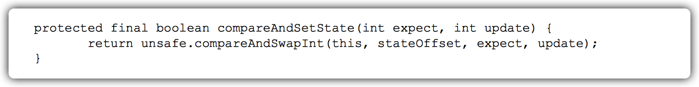

该方法以`原子操作`的方式更新state变量。

Java的compareAndSet()方法调用简称为CAS。

JDK文档对该方法的说明如下：如果当前状态值等于预期值，则以原子方式将同步状态设置为给定的更新值。`此操作具有volatile读和写的内存语义`。

`编译器不会对volatile读与volatile读后面的任意内存操作重排序`；`编译器不会对volatile写与volatile写前面的任意内存操作重排序`。

组合这两个条件，意味着为了同时实现volatile读和volatile写的内存语义，`编译器不能对CAS与CAS前面和后面的任意内存操作重排序`。

在常见的intel X86处理器中，CAS是如何同时具有volatile读和volatile写的内存语义的。

下面是sun.misc.Unsafe类的compareAndSwapInt()方法的源代码。


可以看到，这是一个`本地方法调用`。这个本地方法在openjdk中依次调用的c++代码为： unsafe.cpp，atomic.cpp和atomic_windows_x86.inline.hpp。

下面是对应于intel X86处理器的源代码的片段。


如上面源代码所示，程序会`根据当前处理器的类型来决定是否为cmpxchg指令添加lock前缀`。

`如果程序是在多处理器上运行，就为cmpxchg指令加上lock前缀（Lock Cmpxchg）`。反之，`如果程序是在单处理器上运行，就省略lock前缀（单处理器自身会维护单处理器内的顺序一致性，不需要lock前缀提供的内存屏障效果）`。

intel的手册对lock前缀的说明如下。

1. `确保对内存的读-改-写操作原子执行`。

   ​	在Pentium及Pentium之前的处理器中，带有lock前缀的指令在执行期间会`锁住总线`，使得其他处理器暂时无法通过总线访问内存。很显然，这会带来昂贵的开销。

   ​	从Pentium 4、Intel Xeon及P6处理器开始，Intel使用`缓存锁定`（Cache Locking） 来保证指令执行的原子性。缓存锁定将大大降低lock前缀指令的执行开销。

2. `禁止该指令，与之前和之后的读和写指令重排序`。

3. `把写缓冲区中的所有数据刷新到内存中`。

第2点和第3点所具有的内存屏障效果，足以同时实现volatile读和volatile写的内存语义。所以JDK文档说CAS同时具有volatile读和volatile写的内存语义了。

对公平锁和非公平锁的内存语义的总结：

- 公平锁和非公平锁释放时，最后都要写一个volatile变量state。
- 公平锁获取时，首先会去读volatile变量。
- 非公平锁获取时，首先会用CAS更新volatile变量，这个操作同时具有volatile读和volatile 写的内存语义。

锁释放-获取的内存语义的实现至少有下面两种方式。

- 利用volatile变量的写-读所具有的内存语义。
- 利用CAS所附带的volatile读和volatile写的内存语义。

#### concurrent包的实现

由于Java的CAS同时具有volatile读和volatile写的内存语义，因此Java线程之间的通信现 在有了下面4种方式。

1. A线程写volatile变量，随后B线程读这个volatile变量。
2. A线程写volatile变量，随后B线程用CAS更新这个volatile变量。
3. A线程用CAS更新一个volatile变量，随后B线程用CAS更新这个volatile变量。
4. A线程用CAS更新一个volatile变量，随后B线程读这个volatile变量。

Java的CAS会使用现代处理器上提供的`高效机器级别的原子指令`，这些原子指令以原子方式对内存执行读-改-写操作，这是在多处理器中实现同步的关键（从本质上来说，能够支持原子性读-改-写指令的计算机，是顺序计算图灵机的异步等价机器，因此任何现代的多处理器都会去支持某种能对内存执行原子性读-改-写操作的原子指令）。

同时，`volatile变量的读/写和CAS可以实现线程之间的通信`。把这些特性整合在一起，就形成了整个concurrent包得以实现的基石。如果我们仔细分析concurrent包的源代码实现，会发现一个通用化的实现模式。

- 首先，声明共享变量为volatile。
- 然后，使用CAS的原子条件更新来实现线程之间的同步。
- 同时，配合以volatile的读/写和CAS所具有的volatile读和写的内存语义来实现线程之间的通信。

`AQS`，`非阻塞数据结构`和`原子变量类`（java.util.concurrent.atomic包中的类），这些concurrent包中的基础类都是使用这种模式来实现的，而concurrent包中的高层类又是依赖于这些基础类来实现的。

从整体来看，concurrent包的实现示意图。


### final域的内存语义

>与锁和volatile相比，对final域的读和写更像是普通的变量访问。

#### final域的重排序规则

对于final域，编译器和处理器要遵守两个重排序规则。

1. 在构造函数内对一个final域的写入，与随后把这个被构造对象的引用赋值给一个引用变量，这两个操作之间不能重排序。
2. 初次读一个包含final域的对象的引用，与随后初次读这个final域，这两个操作之间不能重排序。


这里假设一个线程A执行writer()方法，随后另一个线程B执行reader()方法。下面通过这两个线程的交互来说明这两个规则。

#### 写final域的重排序规则

写final域的重排序规则禁止把final域的写重排序到构造函数之外。这个规则的实现包含下面2个方面。

1. JMM禁止编译器把final域的写重排序到构造函数之外。
2. 编译器会在final域的写之后，构造函数return之前，插入一个StoreStore屏障。这个屏障禁止处理器把final域的写重排序到构造函数之外。

writer()方法只包含一行代码。这行代码包含两个步骤，如下。

1. 构造一个FinalExample类型的对象。
2. 把这个对象的引用赋值给引用变量obj。

假设线程B读对象引用与读对象的成员域之间没有重排序。

写普通域的操作被`编译器重排序到了构造函数之外`，`读线程B错误地读取了普通变量i初始化之前的值`。

写final域的操作，被写final域的重排序规则**限定**在了构造函数之内，读线程B正确地读取了final变量初始化之后的值。

`写final域的重排序规则可以确保：在对象引用为任意线程可见之前，对象的final域已经被正确初始化过了，而普通域不具有这个保障。`

以上图为例，在读线程B“看到”对象引用obj时，很可能obj对象还没有构造完成（对普通域i的写操作被重排序到构造函数外，此时初始值1还没有写入普通域i）。


#### 读final域的重排序规则

读final域的重排序规则是，`在一个线程中，初次读对象引用与初次读该对象包含的final域，JMM禁止处理器重排序这两个操作`（注意，这个规则仅仅针对处理器）。编译器会在读final域操作的前面插入一个LoadLoad屏障。

初次读对象引用与初次读该对象包含的final域，这两个操作之间存在间接依赖关系。`由于编译器遵守间接依赖关系，因此编译器不会重排序这两个操作`。

`大多数处理器也会遵守间接依赖，也不会重排序这两个操作。但有少数处理器允许对存在间接依赖关系的操作做重排序（比如alpha处理器），这个规则就是专门用来针对这种处理器的。`

reader()方法包含3个操作。

1. 初次读引用变量obj。
2. 初次读引用变量obj指向对象的普通域j。
3. 初次读引用变量obj指向对象的final域i。

现在假设写线程A没有发生任何重排序，同时程序在不遵守间接依赖的处理器上执行。


读对象的普通域的操作被处理器重排序到读对象引用之前。`读普通域时，该域还没有被写线程A写入，这是一个错误的读取操作`。

读final域的重排序规则会把读对象 final域的操作**限定**在读对象引用之后，此时该final域已经被A线程初始化过了，这是一个正确的读取操作。

`读final域的重排序规则可以确保：在读一个对象的final域之前，一定会先读包含这个final域的对象的引用。`

在这个示例程序中，如果该引用不为null，那么引用对象的final域一定已经 被A线程初始化过了。

#### final域为引用类型


本例final域为一个引用类型，它引用一个int型的数组对象。

对于`引用类型`，`写final域`的重排序规则对编译器和处理器增加了如下约束：`在构造函数内对一个final引用的对象的成员域的写入，与随后在构造函数外把这个被构造对象的引用赋值给一个引用变量，这两个操作之间不能重排序。`

假设首先线程A执行writerOne()方法，执行完后线程B执行 writerTwo()方法，执行完后线程C执行reader()方法。


JMM可以`确保`读线程C至少能看到写线程A在构造函数中对final引用对象的成员域的写入。即C至少能看到数组下标0的值为1。而写线程B对数组元素的写入，读线程C`可能看得到，也可能看不到`。JMM不保证线程B的写入对读线程C可见，因为写线程B和读线程C之间存在数据竞争，此时的执行结果不可预知。

如果想要确保读线程C看到写线程B对数组元素的写入，写线程B和读线程C之间需要使用`同步原语`（lock或volatile）来确保`内存可见性`。

#### 为什么final引用不能从构造函数内“溢出”

`写final域`的重排序规则可以确保：`在引用变量为任意线程可见之前，该引用变量指向的对象的final域已经在构造函数中被正确初始化过了`。其实，要得到这个效果，还需要一个保证：`在构造函数内部，不能让这个被构造对象的引用为其他线程所见`，也就是对象引用不能在构造函数中“逸出”。


假设一个线程A执行writer()方法，另一个线程B执行reader()方法。

这里的操作2使得对象还未完成构造前就为线程B可见。即使这里的操作2是构造函数的最后一步，且在程序中操作2排在操作1后面，执行read()方法的线程仍然可能无法看到final域被初始化后的值，因为这里的操作1和操作2之间可能被重排序。


`在构造函数返回前，被构造对象的引用不能为其他线程所见，因为此时的final域可能还没有被初始化。`

`在构造函数返回后，任意线程都将保证能看到final域正确初始化之后的值。`

#### final语义在处理器中的实现

以X86处理器为例，说明final语义在处理器中的具体实现。

`写final域的重排序规则会要求编译器在final域的写之后，构造函数return 之前插入一个StoreStore障屏。`

`读final域的重排序规则要求编译器在读final域的操作前面插入一个LoadLoad屏障。`

由于X86处理器`不会对写-写操作做重排序`，所以在X86处理器中，`写final域需要的StoreStore障屏会被省略掉`。

同样，由于X86处理器不会对存在间接依赖关系的操作做重排序，所以在X86处理器中，读final域需要的`LoadLoad`屏障也会被省略掉。

也就是说，`在X86处理器中，final域的读/写不会插入任何内存屏障`！

#### JSR-133为什么要增强final的语义

在旧的Java内存模型中，一个最严重的缺陷就是`线程可能看到final域的值会改变`。

比如，一个线程当前看到一个整型final域的值为0（还未初始化之前的默认值），过一段时间之后这个线程再去读这个final域的值时，却发现值变为1（被某个线程初始化之后的值）。

最常见的例子就是在旧的Java内存模型中，String的值可能会改变。

为了修补这个漏洞，JSR-133专家组增强了final的语义。`通过为final域增加写和读重排序规则`，可以为Java程序员`提供初始化安全保证`：要对象是`正确构造`的（`被构造对象的引用在构造函数中没有“逸出”`），那么`不需要使用同步`（指lock和volatile的使用）就可以保证`任意线程都能看到这个final域在构造函数中被初始化之后的值`。

### happens-before

>happens-before是JMM最核心的概念。
>
>理解happens-before是理解 JMM的关键。

#### JMM的设计

从JMM设计者的角度，在设计JMM时，需要考虑两个关键因素。

- 程序员对内存模型的使用。程序员希望内存模型`易于理解`、`易于编程`。程序员希望基于一个`强内存模型`来编写代码。

- 编译器和处理器对内存模型的实现。编译器和处理器希望内存模型对它们的`束缚越少越好`，这样它们就可以做尽可能多的优化来提高性能。编译器和处理器希望实现一个`弱内存模型`。

由于这两个因素互相`矛盾`，所以JSR-133专家组在设计JMM时的核心目标就是找到一个好的`平衡点`：一方面，要为程序员提供`足够强的内存可见性保证`；另一方面，对编译器和处理器的`限制要尽可能地放松`。


上面计算圆的面积的示例代码存在3个happens-before关系，如下。

1. A happens-before B。
2. B happens-before C。
3. A happens-before C。

在3个happens-before关系中，2和3是必需的，但1是不必要的。因此，JMM把happens-before 要求禁止的重排序分为了下面两类。

1. 会改变程序执行结果的重排序。
2. 不会改变程序执行结果的重排序。

JMM对这两种不同性质的重排序，采取了不同的策略，如下。

- 对于`会改变`程序执行结果的重排序，JMM要求编译器和处理器`必须禁止`这种重排序。

- 对于`不会改变`程序执行结果的重排序，JMM对编译器和处理器`不做要求`（JMM允许这种重排序）。


从图可以看出两点，如下。

- JMM向程序员提供的`happens-before规则`能`满足程序员的需求`。JMM的happens-before规则不但`简单易懂`，而且也向程序员提供了`足够强的内存可见性保证`（有些内存可见性保证其实并不一定真实存在，比如上面的A happens-before B）。

- JMM对编译器和处理器的`束缚已经尽可能少`。从上面的分析可以看出，JMM其实是在遵循一个基本原则：只要不改变程序的执行结果（`指的是单线程程序和正确同步的多线程程序`）， 编译器和处理器怎么优化都行。

  例如，如果编译器经过细致的分析后，认定一个锁只会被单个线程访问，那么这个锁可以被消除。再如，如果编译器经过细致的分析后，认定一个volatile变量只会被单个线程访问，那么编译器可以把这个volatile变量当作一个普通变量来对待。这些优化`既不会改变程序的执行结果，又能提高程序的执行效率`。

#### happens-before的定义

happens-before的概念最初由Leslie Lamport在其一篇影响深远的论文（《Time，Clocks and the Ordering of Events in a Distributed System》）中提出。Leslie Lamport使用happens-before来定义分布式系统中事件之间的偏序关系（partial ordering）。Leslie Lamport在这篇论文中给出了一个分布式算法，该算法可以将该偏序关系扩展为某种全序关系。

JSR-133使用happens-before的概念来`指定两个操作之间的执行顺序`。由于这两个操作`可以在一个线程之内，也可以是在不同线程之间`。因此，JMM可以通过happens-before关系向程序员提供`跨线程的内存可见性保证`（如果A线程的写操作a与B线程的读操作b之间存在happens-before关系，尽管a操作和b操作在不同的线程中执行，但`JMM向程序员保证a操作将对b操作可见`）。

《JSR-133:Java Memory Model and Thread Specification》对happens-before关系的定义如下。

1. 如果一个操作happens-before另一个操作，那么第一个操作的执行结果将对第二个操作可见，而且第一个操作的`执行顺序`排在第二个操作之前。
2. 两个操作之间存在happens-before关系，并不意味着Java平台的具体实现必须要按照happens-before关系指定的顺序来执行。如`果重排序之后的执行结果，与按happens-before关系来执行的结果一致，那么这种重排序并不非法`（也就是说，JMM允许这种重排序）。

1.是`JMM对程序员的承诺`。从程序员的角度来说，可以这样理解happens-before关系：如果`A happens-before B`，那么Java内存模型将向程序员保证——`A操作的结果将对B可见， 且A的执行顺序排在B之前`。注意，这只是Java内存模型向程序员做出的保证！

2.是`JMM对编译器和处理器重排序的约束原则`。JMM其实是在遵循一个基本原则：只要不改变程序的执行结果（指的是单线程程序和正确同步的多线程程序）， 编译器和处理器怎么优化都行。JMM这么做的原因是：程序员对于这两个操作是否真的被重排序并不关心，程序员关心的是程序执行时的语义不能被改变（即执行结果不能被改变）。因此，`happens-before关系本质上和as-if-serial语义是一回事`。

- as-if-serial语义保证`单线程内`程序的`执行结果不被改变`，happens-before关系保证`正确同步的多线程程序的执行结果不被改变`。
- as-if-serial语义给编写单线程程序的程序员创造了一个幻境：单线程程序是按程序的顺序来执行的。happens-before关系给编写正确同步的多线程程序的程序员创造了一个幻境：正确同步的多线程程序是按happens-before指定的顺序来执行的。

as-if-serial语义和happens-before这么做的目的，都是为了在`不改变程序执行结果的前提下`，尽可能地`提高程序执行的并行度`。

#### happens-before规则

《JSR-133:Java Memory Model and Thread Specification》定义了如下happens-before规则。

1. `程序顺序规则：一个线程中的每个操作，happens-before于该线程中的任意后续操作`。
2. `监视器锁规则：对一个锁的解锁，happens-before于随后对这个锁的加锁`。
3. `volatile变量规则：对一个volatile域的写，happens-before于任意后续对这个volatile域的读`。
4. `传递性`：如果A happens-before B，且B happens-before C，那么A happens-before C。
5. start()规则：如果线程A执行操作ThreadB.start()（启动线程B），那么A线程的 ThreadB.start()操作happens-before于线程B中的任意操作。
6. join()规则：如果线程A执行操作ThreadB.join()并成功返回，那么线程B中的任意操作 happens-before于线程A从ThreadB.join()操作成功返回。


结合图做以下分析。

1. 1 happens-before 2和3 happens-before 4由`程序顺序规则`产生。由于编译器和处理器都要遵守as-if-serial语义，也就是说，`as-if-serial语义保证了程序顺序规则`。因此，`可以把程序顺序规则看成是对as-if-serial语义的“封装”`。
2. 2 happens-before 3是由`volatile规则产生`。前面提到过，对一个volatile变量的读，总是能看到（任意线程）之前对这个volatile变量最后的写入。因此，volatile的这个特性可以保证实现volatile规则。
3. 1 happens-before 4是由传递性规则产生的。这里的传递性是`由volatile的内存屏障插入策略和volatile的编译器重排序规则共同来保证的`。


分析start()规则。假设线程A在执行的过程中，通过执行ThreadB.start()来启动线 程B；同时，假设线程A在执行ThreadB.start()之前修改了一些共享变量，线程B在开始执行后会 读这些共享变量。


1 happens-before 2由程序顺序规则产生。2 happens-before 4由start()规则产 生。根据传递性，将有1 happens-before 4。这实意味着，线程A在执行ThreadB.start()之前对共享变量所做的修改，接下来在线程B开始执行后都将确保对线程B可见。

分析join()规则。假设线程A在执行的过程中，通过执行ThreadB.join()来等待线 程B终止；同时，假设线程B在终止之前修改了一些共享变量，线程A从ThreadB.join()返回后会 读这些共享变量。


2 happens-before 4由join()规则产生；4 happens-before 5由程序顺序规则产生根据传递性规则，将有2 happens-before 5。这意味着，线程A执行操作ThreadB.join()并成功返回后，线程B中的任意操作都将对线程A可见。

### 双重检查锁定与延迟初始化

>在Java多线程程序中，有时候需要采用延迟初始化来降低初始化类和创建对象的开销。双重检查锁定是常见的延迟初始化技术，但它是一个错误的用法。

#### 双重检查锁定的由来

在Java程序中，有时候可能需要推迟一些高开销的对象初始化操作，并且只有在使用这些 对象时才进行初始化。此时，程序员可能会采用`延迟初始化`。但要正确实现线程安全的延迟初 始化需要一些技巧，否则很容易出现问题。

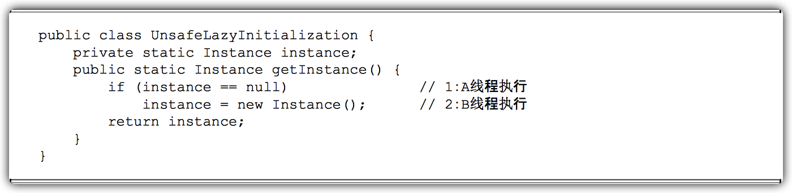

在UnsafeLazyInitialization类中，假设A线程执行代码1的同时，B线程执行代码2。此时，线程A可能会看到instance引用的对象还没有完成初始化。

对于UnsafeLazyInitialization类，我们可以对getInstance()方法做`同步处理`来实现线程安全的延迟初始化。


由于对getInstance()方法做了同步处理，`synchronized将导致性能开销`。

如果getInstance()方法被多个线程频繁的调用，将会导致程序执行性能的下降。反之，如果getInstance()方法不会被多个线程频繁的调用，那么这个延迟初始化方案将能提供令人满意的性能。

`在早期的JVM中，synchronized（甚至是无竞争的synchronized）存在巨大的性能开销`。因此，人们想出了一个“聪明”的技巧：`双重检查锁定`（Double-Checked Locking）。人们想通过双重检查锁定来降低同步的开销。


如果第一次检查instance不为null，那么就不需要执行下面的加锁和初始化操作。因此，可以大幅降低synchronized带来的性能开销。上面代码表面上看起来，似乎两全其美。

- 多个线程试图在同一时间创建对象时，会通过加锁来保证只有一个线程能创建对象。
- 在对象创建好之后，执行getInstance()方法将不需要获取锁，直接返回已创建好的对象。

双重检查锁定看起来似乎很完美，但这是一个错误的优化！在线程执行到第4行，代码读 取到instance不为null时，instance`引用的对象有可能还没有完成初始化`。

#### 问题的根源

前面的双重检查锁定示例代码的第7行创建了一个对象。这一行代码可以分解为如下的3行伪代码。


上面3行伪代码中的2和3之间，`可能会被重排序`（在一些JIT编译器上，这种重排序是真实 发生的，详情见“Out-of-order writes”部分）。2和3之间重排序之后的执行时序如下。


根据《The Java Language Specification,Java SE 7 Edition》（后文简称为Java语言规范），所有线程在执行Java程序时必须要遵守intra-thread semantics。intra-thread semantics保证重排序不会改变单线程内的程序执行结果。换句话说，`intra-thread semantics允许那些在单线程内，不会改变单线程程序执行结果的重排序`。上面3行伪代码的2和3之间虽然被重排序了，但这个重排序并不会违反intra-thread semantics。这个重排序在没有改变单线程程序执行结果的前提下，可以提高程序的执行性能。

为了更好地理解`intra-thread semantics`，请看如图所示的示意图（假设一个线程A在构造对象后，立即访问这个对象）。

只要保证2排在4的前面，即使2和3之间重排序了，也不会违反intra-thread semantics。


查看多线程并发执行的情况。


由于单线程内要遵守intra-thread semantics，从而能保证A线程的执行结果不会被改变。但是，当线程A和B按图的时序执行时，B线程将看到一个还`没有被初始化的对象`。

DoubleCheckedLocking示例代码的第7行（instance=new Singleton();）如果 发生`重排序`，另一个并发执行的线程B就有可能在第4行判断instance不为null。`线程B接下来将访问instance所引用的对象，但此时这个对象可能还没有被A线程初始化`！


这里A2和A3虽然重排序了，但Java内存模型的`intra-thread semantics`将确保A2一定会排在A4前面执行。因此，线程A的intra-thread semantics没有改变，但A2和A3的重排序，将导致线程B在B1处判断出instance不为空，线程B接下来将访问instance引用的对象。此时，线程B将会访问到一个还未初始化的对象。

在知晓了问题发生的根源之后，我们可以想出两个办法来实现线程安全的延迟初始化。

- 不允许2和3重排序。
- 允许2和3重排序，但不允许其他线程“看到”这个重排序。

#### 基于volatile的解决方案

对于前面的基于双重检查锁定来实现延迟初始化的方案（指DoubleCheckedLocking示例代码），只需要做一点小的修改（把instance声明为volatile型），就可以实现线程安全的延迟初始化。


这个解决方案需要`JDK 5或更高版本`（因为从JDK 5开始使用新的JSR-133内存模型规范，这个规范增强了volatile的语义）。

当声明对象的引用为volatile后，new Instance()中的3行伪代码中的2和3之间的重排序，在多线程环境中将会被禁止。


这个方案本质上是通过`禁止`图中的2和3之间的重排序，来保证线程安全的延迟初始化。

#### 基于类初始化的解决方案

JVM在类的初始化阶段（即`在Class被加载后，且被线程使用之前`），会执行类的初始化。在执行类的初始化期间，JVM会去获取一个锁。这个锁可以同步多个线程对同一个类的初始化。

基于这个特性，可以实现另一种线程安全的`延迟初始化方案`（这个方案被称之为 Initialization On Demand Holder idiom）。


假设两个线程并发执行getInstance()方法，下面是执行的示意图。


这个方案的实质是：允许getInstance()的3行伪代码中的2和3重排序，但`不允许非构造线程（这里指线程B）“看到”这个重排序`。

初始化一个类，包括执行这个类的`静态初始化`和`初始化在这个类中声明的静态字段`。根据Java语言规范，在首次发生下列任意一种情况时，一个类或接口类型T将被立即初始化。

- T是一个类，而且一个T类型的实例被创建。
- T是一个类，且T中声明的一个静态方法被调用。
- T中声明的一个静态字段被赋值。
- T中声明的一个静态字段被使用，而且这个字段不是一个常量字段。
- T是一个顶级类（Top Level Class，见Java语言规范的§7.6），而且一个断言语句嵌套在T内部被执行。

在InstanceFactory示例代码中，首次执行getInstance()方法的线程将导致InstanceHolder类被初始化（符合情况4）。

由于`Java语言是多线程`的，`多个线程`可能在`同一时间`尝试去初始化`同一个类或接口`（比如这里多个线程可能在同一时刻调用getInstance()方法来初始化InstanceHolder类）。因此，在Java中初始化一个类或者接口时，需要做`细致的同步处理`。

Java语言规范规定，对于每一个类或接口C，都有一个`唯一的初始化锁LC`与之对应。从C到LC的映射，由JVM的具体实现去自由实现。`JVM在类初始化期间会获取这个初始化锁，并且每个线程至少获取一次锁来确保这个类已经被初始化过了`（事实上，Java语言规范允许JVM的 具体实现在这里做一些优化）。

对于类或接口的初始化，Java语言规范制定了精巧而复杂的类初始化处理过程。Java初始化一个类或接口的处理过程如下（这里对类初始化处理过程的说明，省略了与本文无关的部分；同时为了更好的说明类初始化过程中的同步处理机制，把类初始化的处理过程分为了5个阶段）。

假设Class对象当前还没有被初始化（初始化状态state，此时被标记为state=noInitialization），且有两个线程A和B试图同时初始化这个Class对象。

1. `第1阶段：通过在Class对象上同步（即获取Class对象的初始化锁），来控制类或接口的初始化。这个获取锁的线程会一直等待，直到当前线程能够获取到这个初始化锁。`

   

   | 时间 | 线程A                                                        | 线程B                                                        |
   | ---- | ------------------------------------------------------------ | ------------------------------------------------------------ |
   | t1   | A1:尝试获取Class对象的初始化锁。这里假设线程A获取到了初始化锁。 | B1:尝试获取Class对象的初始化锁，由于线程A获取到了锁，线程B 将一直等待获取初始化锁。 |
   | t2   | A2:线程A看到线程还未被初始化（因为读取到state==initialization），线程设置state=initializing。 |                                                              |
   | t3   | A3:线程A释放初始化锁。                                       |                                                              |

2. `第2阶段：线程A执行类的初始化，同时线程B在初始化锁对应的condition上等待。`

   

   | 时间 | 线程A                                             | 线程B                             |
   | ---- | ------------------------------------------------- | --------------------------------- |
   | t1   | A1:执行类的静态初始化和初始化类中声明的静态字段。 | B1:获取到初始化锁。               |
   | t2   |                                                   | B1:获取到初始化锁。               |
   | t3   |                                                   | B3:释放初始化锁。                 |
   | t4   |                                                   | B4:在初始化锁的 condition中等待。 |

3. `第3阶段:线程A设置state=initialized，然后唤醒在condition中等待的所有线程。`

   

   | 时间 | 线程A                                              | 线程B |
   | ---- | -------------------------------------------------- | ----- |
   | t1   | A1: 完成类的静态初始化和初始化类中声明的静态字段。 |       |
   | t2   | A2:修改state=initialized。                         |       |
   | t3   | A3:唤醒所有等待condition的线程。                   |       |
   | t4   | A4:释放初始化锁。                                  |       |
   | t5   | A5:A线程结束。                                     |       |

4. `第4阶段：线程B结束类的初始化处理。`

   

   | 时间 | 线程B                            |
   | ---- | -------------------------------- |
   | t1   | B1: 获取初始化锁。               |
   | t2   | B2: 读取到 state=initialized。   |
   | t3   | B3: 释放初始化锁。               |
   | t4   | B4:线程B的类初始化处理过程完成。 |

   

   ​	

   ​	线程A在第2阶段的A1执行类的初始化，并在`第3阶段的A4释放初始化锁`；线程B在第4阶段的B1获取同一个初始化锁，并在第4阶段的B4之后才开始访问这个类。

   ​	根据Java内存模型规范的锁规则，这里将存happens-before关系。

   这个happens-before关系将保证：`线程A执行类的初始化时的写入操作（执行类的静态初始化和初始化类中声明的静态字段），线程B一定能看到。`

5. `第5阶段：线程C执行类的初始化的处理。`

   

   | 时间 | 线程C                             |
   | ---- | --------------------------------- |
   | t1   | C1: 获取初始化锁。                |
   | t2   | C2: 读取到state=initialized。     |
   | t3   | C3: 释放初始化锁。                |
   | t4   | C4: 线程C的类初始化处理过程完成。 |

   ​	在第3阶段之后，类已经完成了初始化。因此线程C在第5阶段的类初始化处理过程相对简单一些（前面的线程A和B的类初始化处理过程都经历了两次锁获取-锁释放，而线程C的类初始化处理只需要经历一次锁获取-锁释放）。

   ​	线程A在第2阶段的A1执行类的初始化，并在第3阶段的A4释放锁；线程C在第5阶段的C1获取同一个锁，并在在第5阶段的C4之后才开始访问这个类。根据Java内存模型规范的锁规 则将存在happens-before关系。

   ​	这个happens-before关系将保证：线程A执行类的初始化时的写入操作，线程C一定能看到。

这里的condition和state标记是`虚构`出来的。Java语言规范并`没有硬性规定`一定要使用`condition`和`state`标记。JVM的具体实现只要实现类似功能即可。

Java语言规范允许Java的具体实现，优化类的初始化处理过程。


通过对比基于volatile的双重检查锁定的方案和基于类初始化的方案，我们会发现`基于类初始化的方案的实现代码更简洁`。

基于volatile的双重检查锁定的方案有一个额外的优势：`除了可以对静态字段实现延迟初始化外，还可以对实例字段实现延迟初始化`。

`字段延迟初始化降低了初始化类或创建实例的开销，但增加了访问被延迟初始化的字段的开销`。

**在大多数时候，正常的初始化要优于延迟初始化**。

### Java内存模型综述

#### 处理器的内存模型

`顺序一致性内存模型是一个理论参考模型`，JMM和处理器内存模型在设计时通常会以顺序一致性内存模型为参照。

在设计时，JMM和处理器内存模型会对顺序一致性模型`做一些放松`，因为如果完全按照顺序一致性模型来实现处理器和JMM，那么很多的处理器和编译器优化都要被禁止，这对`执行性能将会有很大的影响`。

根据对不同类型的读/写操作组合的执行顺序的放松，可以把常见处理器的内存模型划分为如下几种类型。

- 放松程序中写-读操作的顺序，由此产生了Total Store Ordering内存模型（简称为TSO）。
- 在上面的基础上，继续放松程序中写-写操作的顺序，由此产生了Partial Store Order内存模型（简称为PSO）。
- 在前面两条的基础上，继续放松程序中读-写和读-读操作的顺序，由此产生了Relaxed Memory Order内存模型（简称为RMO）和PowerPC内存模型。

这里处理器对`读/写操作`的放松，是以两个操作之间`不存在数据依赖性`为前提的（`因为处理器要遵守as-if-serial语义，处理器不会对存在数据依赖性的两个内存操作做重排序`）。


所有处理器内存模型都允许`写-读`重排序，原因是`它们都使用了写缓存区`。`写缓存区可能导致写-读操作重排序`。

这些处理器内存模型都`允许更早读到当前处理器的写`，原因同样是因为写缓存区。`由于写缓存区仅对当前处理器可见`，这个特性导致当前处理器可以比其他处理器先看到临时保存在自己写缓存区中的写。

图中的各种处理器内存模型，从上到下，模型由强变弱。`越是追求性能的处理器，内存模型设计得会越弱`。因为这些处理器希望内存模型对它们的束缚越少越好，这样它们就可以做尽可能多的优化来提高性能。

`由于常见的处理器内存模型比JMM要弱，Java编译器在生成字节码时，会在执行指令序列的适当位置插入内存屏障来限制处理器的重排序`。同时，由于各种处理器内存模型的强弱不同，为了在不同的处理器平台向程序员展示一个一致的内存模型，JMM在不同的处理器中需要插入的内存屏障的数量和种类也不相同。

JMM屏蔽了不同处理器内存模型的差异，它在不同的处理器平台之上为Java程序员呈现了一个一致的内存模型。

图展示了JMM在不同处理器内存模型中需要插入的内存屏障的示意图。


#### 各种内存模型之间的关系

JMM是一个`语言级的内存模`型，处理器内存模型是`硬件级的内存模型`，顺序一致性内存模型是一个理论参考模型。

下面是语言内存模型、处理器内存模型和顺序一致性内存模型的强弱对比示意图。


- 常见的4种处理器内存模型比常用的3中语言内存模型要弱。
- 处理器内存模型和语言内存模型都比顺序一致性内存模型要弱。
- 同处理器内存模型一样，越是追求执行性能的语言，内存模型设计得会越弱。

#### JMM的内存可见性保证

按程序类型，Java程序的内存可见性保证可以分为下列3类。

- **单线程程序**。单线程程序`不会`出现内存可见性问题。编译器、runtime和处理器会共同确保单线程程序的执行结果与该程序在顺序一致性模型中的执行结果相同。

- **正确同步的多线程程序**。`正确同步的多线程程序的执行将具有顺序一致性`（程序的执行结果与该程序在顺序一致性内存模型中的执行结果相同）。这是JMM关注的重点，JMM通过`限制编译器和处理器的重排序`来为程序员提供内存可见性保证。
- **未同步/未正确同步的多线程程序**。JMM为它们提供了`最小安全性保障`：线程执行时读取到的值，`要么是之前某个线程写入的值`，`要么是默认值`（0、null、false）。

**注意**

`最小安全性保障`与`64位数据的非原子性写`并不矛盾。它们是两个不同的概念，它们“发生”的时间点也不同。

- `最小安全性保证对象默认初始化之后`（设置成员域为0、null或 false），才会被任意线程使用。
- `最小安全性“发生”在对象被任意线程使用之前`。
- `64位数据的非原子性写“发生”在对象被多个线程使用的过程中（写共享变量）。`
  - 当发生问题时（处理器B看到仅仅被处理器A“写了一半”的无效值），这里虽然处理器B读取到一个被写了一半的无效值，但这个值仍然是处理器A写入的，只不过是处理器A还没有写完而已。
- 最小安全性保证线程读取到的值，要么是之前某个线程写入的值，要么是默认值（0、null、false）。但最小安全性并不保证线程读取到的值，一定是某个线程写完后的值。
- 最小安全性保证线程读取到的值不会无中生有的冒出来，但并不保证线程读取到的值一定是正确的。

图展示了这3类程序在JMM中与在顺序一致性内存模型中的执行结果的异同。


只要多线程程序是正确同步的，JMM保证该程序在任意的处理器平台上的执行结果，与该程序在顺序一致性内存模型中的执行结果一致。

#### JSR-133对旧内存模型的修补

JSR-133对JDK5之前的旧内存模型的修补主要有两个。

- `增强volatile的内存语义`。旧内存模型允许volatile变量与普通变量重排序。JSR-133严格限制volatile变量与普通变量的重排序，使`volatile的写-读和锁的释放-获取具有相同的内存语义`。
- `增强final的内存语义`。在旧内存模型中，多次读取同一个final变量的值可能会不相同。为此，JSR-133为final增加了两个重排序规则。`在保证final引用不会从构造函数内逸出的情况下， final具有了初始化安全性。`

## Java并发编程基础

### 线程简介

#### 什么是线程

`现代操作系统在运行一个程序时，会为其创建一个进程。`

例如，启动一个Java程序，操作系统就会创建一个Java进程。`现代操作系统调度的最小单元是线程，也叫轻量级进程（Light Weight Process）`，在一个进程里可以创建多个线程，这些线程都拥有各自的计数器、堆栈和局部变量等属性，并且能够访问共享的内存变量。处理器在这些线程上高速切换，让使用者感觉到这些线程在同时执行。

一个Java程序从main()方法开始执行，然后按照既定的代码逻辑执行，看似没有其他线程参与，但实际上`Java程序天生就是多线程程序`，因为执行main()方法的是一个名称为main的线程。


输出如下所示（输出内容可能不同）。


可以看到，一个Java程序的运行不仅仅是main()方法的运行，而是main线程和多个其他线程的同时运行。

#### 为什么要使用多线程

正确使用多线程，总是能够给开发人员带来显著的好处，而使用多线 程的原因主要有以下几点。

1. **更多的处理器核心**

   随着处理器上的核心数量越来越多，以及超线程技术的广泛运用，现在大多数计算机都比以往更加擅长并行计算，而处理器性能的提升方式，也从更高的主频向更多的核心发展。如何利用好处理器上的多个核心也成了现在的主要问题。

   ​	`线程是大多数操作系统调度的基本单元，一个程序作为一个进程来运行，程序运行过程中能够创建多个线程，而一个线程在一个时刻只能运行在一个处理器核心上。`一个单线程程序在运行时只能使用一个处理器核心，那么再多的处理器核心加入也无法显著提升该程序的执行效率。相反，如果该程序使用多线程技术，将计算逻辑分配到多个处理器核心上，就会显著减少程序的处理时间，并且随着更多处理器核心的加入而变得更有效率。

2. **更快的响应时间**

   ​	使用多线程技术，即将数据一致性不强的操作派发给其他线程处理（也可以使用消息队列）。这样做的好处是响应用户请求的线程能够尽可能快地处理完成，缩短了响应时间，提升了用户体验。

3. **更好的编程模型**

   ​	`Java为多线程编程提供了良好、考究并且一致的编程模型`，使开发人员能够更加专注于问题的解决，即为所遇到的问题建立合适的模型，而不是绞尽脑汁地考虑如何将其多线程化。一 旦开发人员建立好了模型，稍做修改总是能够方便地映射到Java提供的多线程编程模型上。

#### 线程优先级	

现代操作系统基本`采用时分的形式调度运行的线程`，操作系统会分出一个个时间片，线程会分配到若干时间片，当线程的时间片用完了就会发生线程调度，并等待着下次分配。线程分配到的时间片多少也就决定了线程使用处理器资源的多少，而`线程优先级`就是决定线程需要多或者少分配一些处理器资源的`线程属性`。

在Java线程中，通过一个整型成员变量`priority`来控制优先级，优先级的范围从1~10，在线程构建的时候可以通过setPriority(int)方法来修改优先级，`默认优先级是5`，**优先级高的线程分配时间片的数量要多于优先级低的线程**。

`设置线程优先级时，针对频繁阻塞（休眠或者I/O操作）的线程需要设置较高优先级`。

`偏重计算（需要较多CPU时间或者偏运算）的线程则设置较低的优先级，确保处理器不会被独占`。在不同的JVM以及操作系统上，线程规划会存在差异，有些操作系统甚至会忽略对线程优先级的设定。


输出结果。


从输出可以看到线程优先级没有生效，优先级1和优先级10的Job计数的结果非常相近， 没有明显差距。这表示`程序正确性不能依赖线程的优先级高低`。

#### 线程的状态

Java线程在运行的生命周期中可能处于`6种不同的状态`，在给定的一个时刻，线程`只能处于其中的一个状态`。

| 状态名称     | 说明                                                         |
| ------------ | ------------------------------------------------------------ |
| NEW          | 初始状态，线程被构建，但是还没有调用start()方法。            |
| RUNNABLE     | 运行状态，Java线程将操作系统中的就绪和运行两种状态笼统地称作“运行中”。 |
| BLOCKED      | 阻塞状态，表示线程阻塞于锁。                                 |
| WATING       | 等待状态，表示线程进入等待状态，进入该状态表示当前线程需要等待其他线程做出一些特定动作（通知或中断）。 |
| TIME_WAITING | 超时等待状态，该状态不同于WAITING，它是可以在指定的时间自行返回的。 |
| TERMINATED   | 终止状态，表示当前线程已经执行完毕。                         |

使用jstack工具（可以选择打开终端，键入jstack或者到JDK安装目录的bin目录下 执行命令），尝试查看示例代码运行时的线程信息，更加深入地理解线程状态。


运行该示例，打开终端或者命令提示符，键入“jps”，输出如下。


可以看到运行示例对应的进程ID是929，接着再键入“jstack 929”（这里的进程ID需要和读 者自己键入jps得出的ID一致），部分输出如下所示。


`线程在自身的生命周期中， 并不是固定地处于某个状态，而是随着代码的执行在不同的状态之间进行切换。`


- 线程创建之后，调用start()方法开始运行。
- 当线程执行wait()方法之 后，线程进入等待状态。
- 进入等待状态的线程需要依靠其他线程的通知才能够返回到运行状态。
- 超时等待状态相当于在等待状态的基础上增加了超时限制，也就是超时时间到达时将会返回到运行状态。
- 当线程调用同步方法时，在没有获取到锁的情况下，线程将会进入到阻塞 状态。
- 线程在执行Runnable的run()方法之后将会进入到终止状态。

`Java将操作系统中的运行和就绪两个状态合并称为运行状态`。阻塞状态是线程阻塞在进入synchronized关键字修饰的方法或代码块（获取锁）时的状态，但是阻塞在java.concurrent包中Lock接口的线程状态却是等待状态，因为java.concurrent包中Lock接口对于阻塞的实现均使用了LockSupport类中的相关方法。

#### Daemon线程

Daemon线程是一种支持型线程，因为它主要被用作`程序中后台调度以及支持性工作`。这意味着，`当一个Java虚拟机中不存在非Daemon线程的时候，Java虚拟机将会退出`。

可以通过调用`Thread.setDaemon(true)`将线程设置为Daemon线程。

Daemon属性需要在启动线程之前设置，不能在启动线程之后设置。

Daemon线程被用作完成支持性工作，但是`在Java虚拟机退出时Daemon线程中的finally块并不一定会执行`。


运行Daemon程序，可以看到在终端或者命令提示符上没有任何输出。main线程（非Daemon线程）在启动了线程DaemonRunner之后随着main方法执行完毕而终止，而此时Java虚拟机中已经没有非Daemon线程，虚拟机需要退出。Java虚拟机中的所有Daemon线程都需要立即终止，因此DaemonRunner立即终止，但是DaemonRunner中的finally块并没有执行。

`在构建Daemon线程时，不能依靠finally块中的内容来确保执行关闭或清理资源的逻辑。`

### 启动和终止线程

#### 构造线程

在运行线程之前首先要`构造一个线程对象`，线程对象在构造的时候需要提供线程所需要的`属性`，如`线程所属的线程组`、`线程优先级`、`是否是Daemon线程`等信息。

下面代码摘自java.lang.Thread中对线程进行初始化的部分。

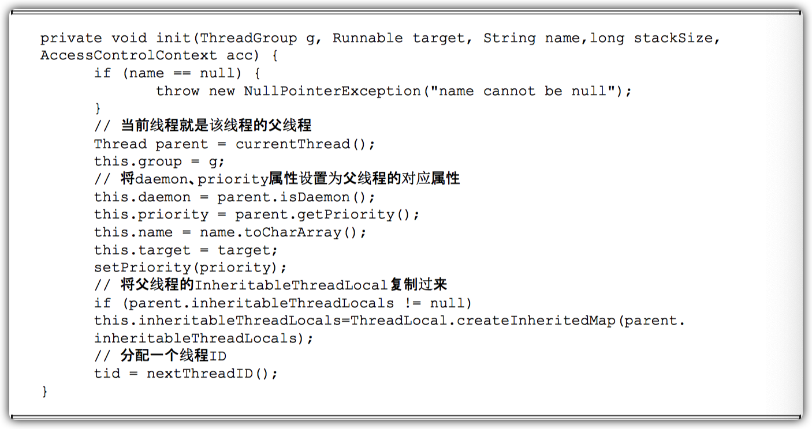

一个新构造的线程对象是由其`parent线程来进行空间分配的`，而child线程 继承了parent是否为Daemon、`优先级`和`加载资源的contextClassLoader`以及`可继承的ThreadLocal`，同时还会分配一个唯一的ID来标识这个child线程。至此，一个能够运行的线程对象就初始化好了，在堆内存中等待着运行。

#### 启动线程

线程对象在初始化完成之后，`调用start()方法`就可以启动这个线程。线程start()方法的含义是：`当前线程（即parent线程）同步告知Java虚拟机，只要线程规划器空闲，应立即启动调用start()方法的线程`。

启动一个线程前，最好为这个线程设置线程名称，因为这样在使用jstack分析程序或者进行问题排查时，就会给开发人员提供一些提示，自定义的线程最好能够起个名字。

#### 理解中断

中断可以理解为线程的`一个标识位属性`，它表示一个运行中的线程是否被其他线程进行了中断操作。中断好比其他线程对该线程打了个招呼，`其他线程通过调用该线程的interrupt()方法对其进行中断操作`。

`线程通过检查自身是否被中断来进行响应`。

- 线程通过方法`isInterrupted()`来进行判断是否被中断。
- 可以调用静态方法`Thread.interrupted()对当前线程的中断标识位进行复位`。

`如果该线程已经处于终结状态，即使该线程被中断过，在调用该线程对象的isInterrupted()时依旧会返回false。`

从Java的API中可以看到，许多声明抛出`InterruptedException`的方法（例如Thread.sleep(long millis)方法）。

`这些方法在抛出InterruptedException之前，Java虚拟机会先将该线程的中断标识位清除，然后抛出InterruptedException，此时调用isInterrupted()方法将会返回false。`

创建了两个线程，SleepThread和BusyThread，前者不停地睡眠，后者一直运行，然后对这两个线程分别进行中断操作，观察二者的中断标识位。


输出如下。


结果可以看出，抛出`InterruptedException`的线程SleepThread，其`中断标识位被清除了`，而一直忙碌运作的线程BusyThread，中断标识位没有被清除。

#### 过期的suspend()、resume()和stop()

对音乐播放做出的暂停、恢复和停止操作对应在线程Thread的API就是`suspend()`、`resume()`和`stop()`。


输出如下。


suspend()、resume()和stop()方法完成了线程的暂停、恢复和终止工作，而且非常“人性化”。`但是这些API是过期的，也就是不建议使用的。`

不建议使用的原因主要有：以suspend()方法为例，在调用后，线程`不会释放已经占有的资源（比如锁），而是占有着资源进入睡眠状态，这样容易引发死锁问题`。同样，`stop()方法在终结一个线程时不会保证线程的资源正常释放`，通常是没有给予线程完成资源释放工作的机会， 因此会导致程序可能工作在不确定状态下。

#### 安全地终止线程

`中断状态是线程的一个标识位`，而中断操作是一种简便的线程间交互方式，而这种交互方式最适合用来`取消`或`停止任务`。除了中断以外，还可以利用一个boolean变量来控制`是否需要停止任务并终止该线程`。

创建了一个线程CountThread，它不断地进行变量累加，而主线程尝试对其进行中断操作和停止操作。

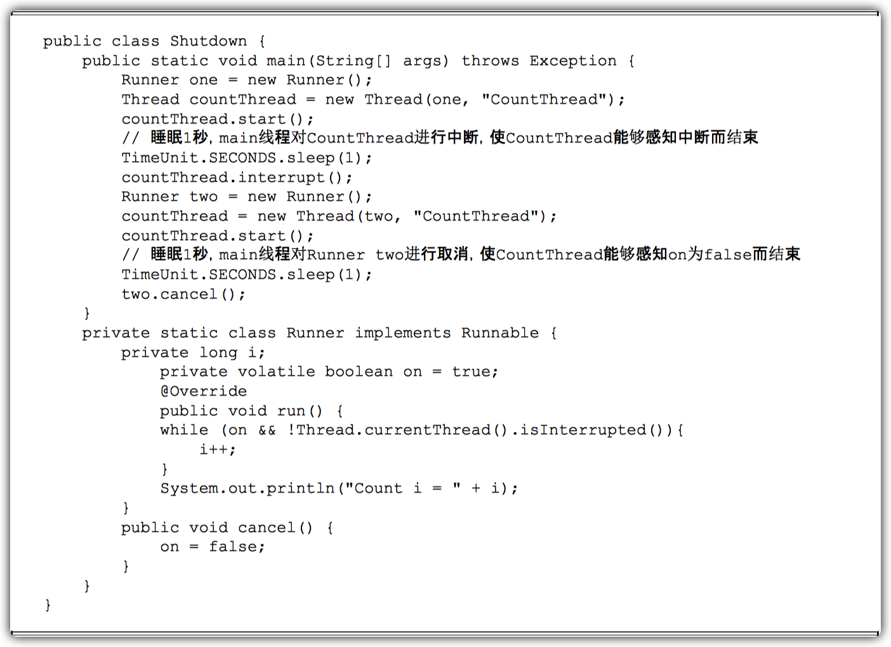

输出结果如下所示（输出内容可能不同）。


main线程通过`中断操作`和`cancel()方法`均可使CountThread得以终止。 这种`通过标识位或者中断操作的方式`能够使线程`在终止时有机会去清理资源`，而不是武断地将线程停止，因此这种终止线程的做法显得更加`安全`和`优雅`。

### 线程间通信

线程开始运行，拥有自己的`栈`空间，就如同一个脚本一样，按照既定的代码一步一步地执行，直到终止。但是，每个运行中的线程，如果仅仅是孤立地运行，那么没有一点儿价值，或者说价值很少，如果多个线程能够相互配合完成工作，这将会带来巨大的价值。

#### volatile和synchronized关键字

Java支持多个线程同时访问一个对象或者对象的成员变量，由于每个线程可以拥有这个变量的拷贝（虽然对象以及成员变量分配的内存是在共享内存中的，但是每个执行的线程还是可以拥有一份拷贝，这样做的目的是加速程序的执行，这是现代多核处理器的一个显著特性），所以程序在执行过程中，`一个线程看到的变量并不一定是最新的`。

关键字volatile可以用来`修饰字段（成员变量）`，就是`告知程序任何对该变量的访问均需要从共享内存中获取`，而对`它的改变必须同步刷新回共享内存`，它能`保证所有线程对变量访问的可见性`。

举个例子，定义一个表示程序是否运行的成员变量boolean on=true，那么另一个线程可能对它执行关闭动作（on=false），这里涉及多个线程对变量的访问，因此需要将其定义成为 volatile boolean on＝true，这样其他线程对它进行改变时，可以让所有线程感知到变化，因为所有对on变量的访问和修改都需要以共享内存为准。但是，`过多地使用volatile是不必要的，因为它会降低程序执行的效率`。

关键字synchronized可以`修饰方法或者以同步块`的形式来进行使用，它主要`确保多个线程在同一个时刻，只能有一个线程处于方法或者同步块中`，它保证了线程对变量访问的`可见性`和`排他性`。

使用了同步块和同步方法，通过使用javap工具查看生成的class文件信息来分析synchronized关键字的实现细节，示例如下。


在Synchronized.class同级目录执行javap–v Synchronized.class，部分相关输出如下所示。


分析上面class信息。

- 对于`同步块`的实现使用了`monitorenter`和`monitorexit`指令。
- 同步方法则是依靠方法修饰符上的`ACC_SYNCHRONIZED`来完成的。
- 无论采用哪种方式，`其本质是对一个对象的监视器（monitor）进行获取`，而这个获取过程是排他的，也就是同一时刻只能有一个线程获取到由synchronized所保护对象的监视器。

任意一个对象都拥有自己的监视器，当这个对象由同步块或者这个对象的同步方法调用时，`执行方法的线程必须先获取到该对象的监视器才能进入同步块或者同步方法`，而`没有获取到监视器（执行该方法）的线程将会被阻塞在同步块和同步方法的入口处，进入BLOCKED状态`。

图描述了对象、对象的监视器、同步队列和执行线程之间的关系。


从图可以看到，任意线程对Object（Object由synchronized保护）的访问，`首先要获得Object的监视器`。如果获取失败，线程进入同步队列，`线程状态变为BLOCKED`。当访问Object的前驱（获得了锁的线程）释放了锁，则该释放操作唤醒阻塞在同步队列中的线程，使其重新 尝试对监视器的获取。

#### 等待/通知机制

一个线程修改了一个对象的值，而另一个线程感知到了变化，然后进行相应的操作，整个过程开始于一个线程，而最终执行又是另一个线程。	前者是生产者，后者就是消费者，这种模式隔离了`做什么`（what）和`怎么做`（How），在功能层面上实现了解耦，体系结构上具备了良好的伸缩性。

简单的办法是让消费者线程不断地循环检查变量是否符合预期，如下面代码所示，在while循环中设置不满足的条件，如果条件满足则退出while循环，从而完成消费者的工作。


上面这段伪代码在条件不满足时就睡眠一段时间，这样做的目的是防止过快的“无效”尝试，这种方式看似能够解实现所需的功能，但是却存在问题。

- `难以确保及时性`。在睡眠时，基本不消耗处理器资源，但是如果睡得过久，就不能及时发现条件已经变化，也就是及时性难以保证。
- `难以降低开销`。如果降低睡眠的时间，比如休眠1毫秒，这样消费者能更加迅速地发现 条件变化，但是却可能消耗更多的处理器资源，造成了无端的浪费。

以上两个问题，看似矛盾难以调和，但是Java通过内置的`等待/通知机制`能够很好地解决这个矛盾并实现所需的功能。

`等待/通知`的相关方法是`任意`Java对象都具备的，因为这些方法被定义在所有对象的超类`java.lang.Object`上。

| 方法名称       | 描述                                                         |
| -------------- | ------------------------------------------------------------ |
| notify()       | 通知一个在对象上等待的线程，使其从wait方法返回，而返回的前提是该线程获取到了对象的锁。 |
| notifyAll()    | 通知所有等待在该对象上的线程。                               |
| wait()         | 调用该方法的线程进入`WAITING`状态，只有等待另外线程的通知或被中断才会返回，需要注意，调用 wait()方法后，`会释放对象的锁`。 |
| wait(long)     | 超时等待一段时间，这里的参数时间是毫秒，也就是等待长达n毫秒，如果没有通知就超时返回。 |
| wait(long,int) | 对于超时时间更细粒度的控制，可以达到纳秒。                   |

等待/通知机制，是指一个线程A调用了对象O的wait()方法进入等待状态，而另一个线程B调用了对象O的notify()或者notifyAll()方法，线程A收到通知后从对象O的wait()方法返回，进而执行后续操作。

上述两个线程通过对象O来完成交互，而对象上的wait()和notify/notifyAll()的关系就如同开关信号一样，用来完成`等待方`和`通知方`之间的交互工作。

下面例子中，创建了两个线程——WaitThread和NotifyThread，前者检查flag值是否为false，如果符合要求，进行后续操作，否则在lock上等待，后者在睡眠了一段时间后对lock进行通知。


输出如下（输出内容可能不同，主要区别在时间上）。


上述第3行和第4行输出的顺序可能会互换，而上述例子主要说明了调用wait()、notify()以及notifyAll()时需要注意的细节，如下。

- 使用wait()、notify()和notifyAll()时需要先对调用对象加锁。
- 调用wait()方法后，线程状态由`RUNNING`变为`WAITING`，并`将当前线程放置到对象的等待队列`。

- `notify()或notifyAll()方法调用后，等待线程依旧不会从wait()返回，需要调用notify()或notifAll()的线程释放锁之后，等待线程才有机会从wait()返回`。

- notify()方法将`等待队列中的一个等待线程`从`等待队列`中移到`同步队列`中。
- notifyAll()方法则是将`等待队列中所有的线程全部移到同步队列`，被移动的线程状态由`WAITING`变为`BLOCKED`。
- 从wait()方法返回的`前提是获得了调用对象的锁`。

等待/通知机制`依托于同步机制`，其目的就是`确保等待线程从 wait()方法返回时能够感知到通知线程对变量做出的修改`。


WaitThread首先获取了对象的锁，然后调用对象的wait()方法，从而放弃了锁并进入了对象的等待队列WaitQueue中，进入等待状态。由于WaitThread释放了对象的锁，NotifyThread随后获取了对象的锁，并调用对象的notify()方法，将WaitThread从WaitQueue移到 SynchronizedQueue中，此时WaitThread的状态变为阻塞状态。NotifyThread释放了锁之后，WaitThread再次获取到锁并从wait()方法返回继续执行。

#### 等待/通知的经典范式

上面的WaitNotify示例中可以提炼出等待/通知的经典范式，该范式分为两部分，分别针对等待方（消费者）和通知方（生产者）。

**等待方遵循如下原则**。

- 获取对象的锁。
- 如果条件不满足，那么调用对象的wait()方法，被通知后仍要检查条件。
- 条件满足则执行对应的逻辑。

```java
synchronized (对象) {
    while (条件不满足) {
        对象.wait();
    }
    对应的处理逻辑
}
```

**通知方遵循如下原则。**

- 获得对象的锁。
- 改变条件。
- 通知所有等待在对象上的线程。

```java
synchronized (对象) {
    改变条件
    对象.notifyAll();
}
```

#### 管道输入/输出流

`管道输入/输出流`和`普通的文件输入/输出流`或者`网络输入/输出流`不同之处在于，它主要用于`线程之间的数据传输`，而传输的媒介为`内存`。

管道输入/输出流主要包括了如下4种具体实：

- 面向字节
  - PipedOutputStream
  - PipedInputStream
- 面向字符
  - PipedReader
  - PipedWriter

下面例子中，创建了printThread，它用来接受main线程的输入，任何main线程的输入均通过PipedWriter写入，而printThread在另一端通过PipedReader将内容读出并打印。


运行该示例，输入一组字符串，可以看到被printThread进行了原样输出。


`对于Piped类型的流，必须先要进行绑定，也就是调用connect()方法，如果没有将输入/输出流绑定起来，对于该流的访问将会抛出异常`。

#### Thread.join()的使用

如果一个线程A执行了thread.join()语句，其含义是：`当前线程A等待thread线程终止之后才从thread.join()返回`。

线程Thread除了提供join()方法之外，还提供了join(long millis)和join(long millis,int nanos)两个具备超时特性的方法。这两个超时方法表示，如果线程thread在给定的超时时间里没有终止，那么将会从该超时方法中返回。

例子中，创建了10个线程，编号0~9，每个线程调用前一个线程的 join()方法，也就是线程0结束了，线程1才能从join()方法中返回，而线程0需要等待main线程结束。


输出如下。

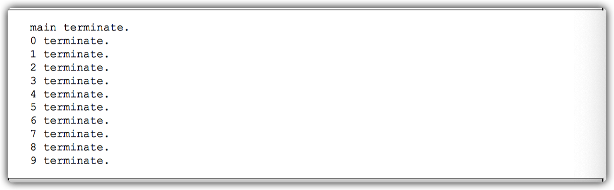

从上述输出可以看到，每个线程终止的前提是前驱线程的终止，`每个线程等待前驱线程终止后，才从join()方法返回`，这里涉及了等待/通知机制（等待前驱线程结束，接收前驱线程结束通知）。

JDK中Thread.join()方法的源码（进行了部分调整）。


`当线程终止时，会调用线程自身的notifyAll()方法，会通知所有等待在该线程对象上的线程。`

可以看到`join()方法的逻辑结构`与`等待/通知经典范式一致`，即`加锁、循环和处理逻辑`3个步骤。

#### ThreadLocal的使用

ThreadLocal，即线程变量，是一个以`ThreadLocal对象为键`、`任意对象为值`的存储结构。这个结构被附带在线程上，也就是说一个线程可以根据一个ThreadLocal对象查询到绑定在这个线程上的一个值。

可以通过set(T)方法来设置一个值，在当前线程下再通过get()方法获取到原先设置的值。

在下面例子中，构建了一个常用的Profiler类，它具有begin()和end()两个方法，而end()方法返回从begin()方法调用开始到end()方法被调用时的时间差，单位是毫秒。


输出结果如下所示。


Profiler可以被复用在方法调用耗时统计的功能上，在方法的入口前执行begin()方法，在方法调用后执行end()方法，好处是两个方法的调用不用在一个方法或者类中，比如在AOP（面向方面编程）中，可以在方法调用前的切入点执行begin()方法，而在方法调用后的切入点执行 end()方法，这样依旧可以获得方法的执行耗时。

### 线程应用实例

#### 等待超时模式

调用一个方法时等待一段时间（一般来说是给定一个时间段），如果该方法能够在给定的时间段之内得到结果，那么将结果立刻返回，反之，超时返回默认结果。

等待/通知的经典范式，即`加锁、条件循环和处理逻辑`3个步骤，而这种范式`无法做到超时等待`。而超时等待的加入，只需要对经典范式做出非常小的改动。

假设超时时间段是T，那么可以推断出在当前时间`now+T`之后就会超时。

定义如下变量。

- 等待持续时间：REMAINING=T。
- 超时时间：FUTURE=now+T。

这时仅需要wait(REMAINING)即可，在wait(REMAINING)返回之后会将执行：`REMAINING=FUTURE–now`。

- 如果REMAINING小于等于0，表示已经超时，直接退出。

- 否则将继续执行wait(REMAINING)。


可以看出，等待超时模式就是在等待/通知范式基础上增加了`超时控制`，这使得该模式相比原有范式更具有灵活性，因为即使方法执行时间过长，也不会“永久”阻塞调用者，而是会按照调用者的要求“按时”返回。

#### 一个简单的数据库连接池示例

我们使用`等待超时模式`来构造一个简单的数据库连接池，在示例中模拟从连接池中获取、使用和释放连接的过程，而客户端获取连接的过程被设定为等待超时的模式，也就是在1000毫秒内如果无法获取到可用连接，将会返回给客户端一个null。设定连接池的大小为10个，然后通过调节客户端的线程数来模拟无法获取连接的场景。

连接池的定义。它通过构造函数初始化连接的最大上限，通过一个双向队列 来维护连接，调用方需要先调用fetchConnection(long)方法来指定在多少毫秒内超时获取连接，当连接使用完成后，需要调用releaseConnection(Connection)方法将连接放回线程池，示例如图所示。

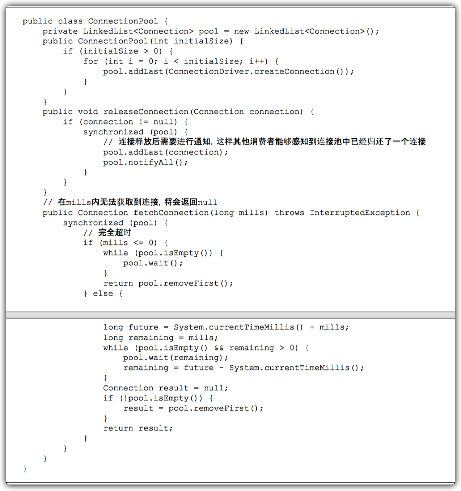

由于java.sql.Connection是一个接口，最终的实现是由数据库驱动提供方来实现的，考虑到只是个示例，我们通过动态代理构造了一个Connection，该Connection的代理实现仅仅是在 commit()方法调用时休眠100毫秒。


通过一个示例来测试简易数据库连接池的工作情况，模拟客户端ConnectionRunner获取、使用、最后释放连接的过程，当它使用时连接将会增加获取到连接的数量，反之，将会增加未获取到连接的数量。


上述示例中使用了`CountDownLatch`来确保ConnectionRunnerThread能够同时开始执行，并且在全部结束之后，才使main线程从等待状态中返回。当前设定的场景是10个线程同时运行 获取连接池（10个连接）中的连接，通过调节线程数量来观察未获取到连接的情况。线程数、总获取次数、获取到的数量、未获取到的数量以及未获取到的比率。


从表中的数据统计可以看出，`在资源一定的情况下（连接池中的10个连接），随着客户端线程的逐步增加，客户端出现超时无法获取连接的比率不断升高`。

虽然客户端线程在这种超时获取的模式下会出现连接无法获取的情况，但是它能够保证客户端线程不会一直挂在连接获取的操作上，而是“按时”返回，并告知客户端连接获取出现问题，是系统的一种自我保护机制。

数据库连接池的设计也可以复用到其他的资源获取的场景，针对昂贵资源（比如数据库连接）的获取都应该加以超时限制。

#### 线程池技术及其示例

对于服务端的程序，经常面对的是客户端传入的短小（执行时间短、工作内容较为单一）任务，需要服务端快速处理并返回结果。如果服务端每次接受到一个任务，创建一个线程，然后进行执行，这在原型阶段是个不错的选择，但是面对成千上万的任务递交进服务器时，如果还是采用一个任务一个线程的方式，那么将会创建数以万记的线程，这不是一个好的选择。因为这会使操作系统频繁的进行线程上下文切换，无故增加系统的负载，而线程的创建和消亡都是需要耗费系统资源的，也无疑浪费了系统资源。

线程池技术能够很好地解决这个问题，它预先创建了若干数量的线程，并且不能由用户直接对线程的创建进行控制，在这个前提下重复使用固定或较为固定数目的线程来完成任务的执行。这样做的好处是，一方面，`消除了频繁创建和消亡线程的系统资源开销`，另一方面，`面对过量任务的提交能够平缓的劣化`。

一个简单的线程池接口定义。


客户端可以通过execute(Job)方法将Job提交入线程池执行，而客户端自身不用等待Job的 执行完成。除了execute(Job)方法以外，线程池接口提供了增大/减少工作者线程以及关闭线程 池的方法。这里工作者线程代表着一个重复执行Job的线程，而每个由客户端提交的Job都将进入到一个工作队列中等待工作者线程的处理。

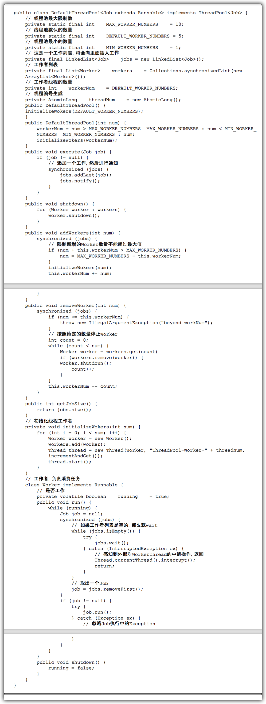

从线程池的实现可以看到，当客户端调用execute(Job)方法时，会不断地向任务列表jobs中添加Job，而每个工作者线程会不断地从jobs上取出一个Job进行执行，当jobs为空时，工作者线程进入等待状态。

添加一个Job后，对工作队列jobs调用了其notify()方法，而不是notifyAll()方法，因为能够确定有工作者线程被唤醒，这时使用notify()方法将会比notifyAll()方法获得更小的开销（`避免将等待队列中的线程全部移动到阻塞队列中`）。

可以看到，线程池的本质就是`使用了一个线程安全的工作队列连接工作者线程和客户端线程`，客户端线程将任务放入工作队列后便返回，而工作者线程则不断地从工作队列上取出工作并执行。当工作队列为空时，所有的工作者线程均等待在工作队列上，当有客户端提交了一个任务之后会`通知任意一个工作者线程`，随着大量的任务被提交，更多的工作者线程会被唤醒。

#### 一个基于线程池技术的简单Web服务器

目前的浏览器都支持多线程访问，比如说在请求一个HTML页面的时候，页面中包含的图片资源、样式资源会被浏览器发起并发的获取，这样用户就不会遇到一直等到一个图片完全下载完成才能继续查看文字内容的尴尬情况。

如果Web服务器是单线程的，多线程的浏览器也没有用武之地，因为服务端还是一个请求一个请求的顺序处理。因此，`大部分Web服务器都是支持并发访问的`。常用的Java Web服务器，如Tomcat、Jetty，在其`处理请求的过程中都使用到了线程池技术`。

通过使用前一节中的线程池来构造一个简单的Web服务器，这个Web服务器用来处理HTTP请求，目前只能处理简单的文本和JPG图片内容。这个Web服务器使用main线程不断地接受客户端Socket的连接，将连接以及请求提交给线程池处理，这样使得Web服务器能够同时处理多个客户端请求。


SimpleHttpServer在建立了与客户端的连接之后，并不会处理客户端的请求，而是将其包装成HttpRequestHandler并交由线程池处理。在线程池中的Worker处理客户端请求的同时，SimpleHttpServer能够继续完成后续客户端连接的建立，不会阻塞后续客户端的请求。

时序图。


测试的html。


将SimpleHttpServer的根目录设定到该HTML页面所在目录，并启动SimpleHttpServer，通过Apache HTTP server benchmarking tool（版本2.3）来测试不同线程数下，SimpleHttpServer的吞吐量表现。

测试场景是5000次请求，分10个线程并发执行，测试内容主要考察响应时间（越小越好）和每秒查询的数量（越高越好）。


可以看到，`随着线程池中线程数量的增加`，SimpleHttpServer的`吞吐量不断增大`，`响应时间不断变小`，线程池的作用非常明显。

但是，线程池中线程数量`并不是越多越好`，具体的数量需要`评估每个任务的处理时间`，以及`当前计算机的处理器能力和数量`。

- 使用的线程过少，无法发挥处理器的性能。
- 使用的线程过多，将会增加系统的无故开销，起到相反的作用。

## Java中的锁

### Lock接口

`锁是用来控制多个线程访问共享资源的方式`，一般来说，一个锁能够防止多个线程同时访问共享资源（但是有些锁可以允许多个线程并发的访问共享资源，比如读写锁）。

在Lock接口出现之前，Java 程序是靠`synchronized`关键字实现锁功能的，而JavaSE 5之后，并发包中新增了Lock接口（以及相关实现类）用来实现锁功能，它`提供了与synchronized关键字类似的同步功 能`，只是在`使用时需要显式地获取和释放锁`。

虽然它缺少了（通过synchronized块或者方法所提供的）隐式获取释放锁的便捷性，但是却拥有了`锁获取与释放的可操作性`、`可中断的获取锁`以及`超时获取锁`等多种synchronized关键字所不具备的同步特性。

使用synchronized关键字将会`隐式地获取锁`，但是它将锁的获取和释放固化了，也就是先获取再释放。当然，这种方式`简化了同步的管理`，可是`扩展性没有显示的锁获取和释放来的好`。

例如，针对一个场景，手把手进行锁获取和释放，先获得锁A，然后再获取锁B，当锁B获得后，释放锁A同时获取锁C，当锁C获得后，再释放B同时获取锁D，以此类推。这种场景下，synchronized关键字就不那么容易实现了，而使用Lock却容易许多。

Lock的使用的方式。


`在finally块中释放锁，目的是保证在获取到锁之后，最终能够被释放。`

`不要将获取锁的过程写在try块中`，因为如果在获取锁（自定义锁的实现）时发生了异常，`异常抛出的同时，也会导致锁无故释放`。

Lock接口提供的synchronized关键字`所不具备`的主要特性如表所示。

| 特性               | 描述                                                         |
| ------------------ | ------------------------------------------------------------ |
| 尝试非阻塞地获取锁 | 当前线程尝试获取锁，如果这一时刻锁没有被其他线程获取到，则成功获取并持有锁。 |
| 能被中断地获取锁   | 与 synchronized 不同，获取到锁的线程能够`响应中断`，当获取到锁的线程被中断时，`中断异常将会被抛出，同时锁会被释放`。 |
| 超时获取锁         | 在指定的截止时间之前获取锁，如果截止时间到了仍旧无法获取锁，则返回。 |

Lock是一个接口，它定义了锁获取和释放的基本操作，Lock的API如表所示。

- | 方法名称                                                     | 描述                                                         |
  | ------------------------------------------------------------ | ------------------------------------------------------------ |
  | void lock()                                                  | 获取锁，用该方法当前线程将会获取锁，当锁获得后，从该方法返回。 |
  | void lockInterruptibly() throws InterruptedException         | 可中断地获取锁，和 lock()方法的不同之处在于该`方法会响应中断`，`即在锁的获取中可以中断当前线程`。 |
  | boolean tryLock()                                            | `尝试非阻塞的获取锁，调用该方法后立刻返回`，如果能够获取则返回 true，否则返回false。 |
  | boolean tryLock(long time,TimeUnit unit) throws InterruptedException | 超时的获取锁，当前线程在以下3 种情况下会返回：<br />1. 当前线程在超时时间内获得了锁。<br />2. 当前线程在超时时间内被中断。<br />3. 超时时间结，返回 false。 |
  | void unlock()                                                | 释放锁。                                                     |
  | Condition newCondition()                                     | 获取等待通知组件，该组件和当前的锁绑定，当前线程只有获得了锁，才能调用该组件的 wait()方法，而调用后，当前线程将释放锁 |

Lock接口的实现基本都是通过聚合了一个同步器(AQS)的子类来完成线程访问控制的。

### 队列同步器

队列同步器 `AbstractQueuedSynchronizer`（以下简称同步器），是用来`构建锁`或者`其他同步组件`的`基础框架`，它`使用了一个int成员变量表示同步状态`，通过`内置的FIFO队列来完成资源获取线程的排队工作`，并发包的作者（Doug Lea）期望它能够成为实现大部分同步需求的基础。

同步器的主要使用方式是`继承`，子类通过继承同步器并实现它的抽象方法来管理同步状态。

在抽象方法的实现过程中免不了要对同步状态进行更改，这时就需要使用同步器提供的3个方法`getState()`、`setState(int newState)`和`compareAndSetState(int expect,int update)`来进行操作，因为它们能够保证状态的改变是安全的。

子类推荐被定义为`自定义同步组件的静态内部类`，同步器自身没有实现任何同步接口，它仅仅是定义了若干同步状态获取和释放的方法来供自定义同步组件使用，同步器既可以支持`独占式地获取同步状态`，也可以支持`共享式地获取同步状态`，这样就可以方便实现不同类型的同步组件（ReentrantLock、ReentrantReadWriteLock和CountDownLatch等）。

`同步器是实现锁（也可以是任意同步组件）的关键`，在锁的实现中`聚合`同步器，利用同步器实现锁的语义。可以这样理解二者之间的关系。

- 锁是面向`使用者`的，它`定义了使用者与锁交互的接口`（比如可以允许两个线程并行访问），隐藏了实现细节。
- 同步器面向的是`锁的实现者`，它简化了锁的实现方式，屏蔽了同步状态管理、线程的排队、等待与唤醒等底层操作。
- 锁和同步器很好地隔离了使用者和实现者所需关注的领域。

#### 队列同步器的接口与示例

同步器的设计是基于`模板方法模式`的，也就是说，使用者需要继承同步器并重写指定的方法，随后将`同步器`组合在自`定义同步组件`的实现中，并调用同步器提供的模板方法，而这些模板方法将会调用使用者重写的方法。

重写同步器指定的方法时，需要使用同步器提供的如下3个方法来访问或修改同步状态。

- **getState()**

  获取当前同步状态。

- **setState(int newState)**

  设置当前同步状态。

- **compareAndSetState(int expect,int update)**

  使用CAS设置当前状态，该方法能够保证状态设置的原子性。

`同步器可重写的方法`与描述如表所示。

| 方法名称                                    | 描述                                                         |
| ------------------------------------------- | ------------------------------------------------------------ |
| protected boolean tryAcquire(int arg)       | `独占式获取同步状态`，实现该方法需要询当前状态并判断同步状态是否符合预期，然后再进行CAS设置同步状态。 |
| protected boolean tryRelease(int arg)       | `独占式释放同步状态`，等待获取同步状态的线程将有机会获取同步状态。 |
| protected int tryAcquireShared(int arg)     | 共享式获取同步状态，返回大于等于0 的值，表示获取成功，反之，获取失败。 |
| protected boolean tryReleaseShared(int arg) | 共享式释放同步状态。                                         |
| protected boolean isHeldExclusively()       | 当前同步器是否在独占模式下被线程占用，一般该方法表示`是否被当前线程所独占`。 |

实现`自定义同步组件`时，将会调用同步器提供的模板方法，这些（部分）`模板方法`与描述如所示。

| 方法名称                                            | 描述                                                         |
| --------------------------------------------------- | ------------------------------------------------------------ |
| void acquire (int arg)                              | 独占式获取同步状态，如果当前线程获取同步状态成功，则由该方法返回，否则，将会进入`同步队列等待`，该方法将会调用重写的 `tryAcquire (int arg)`方法。 |
| void acquireInterruptibly (int arg)                 | 与 acquire (int arg）相同，但是该方法响应中断，当前线程未获取到同步状态而进入同步队列中，如果当前线程被中断，则该方法会抛出  Interruptedexception 并返回。 |
| boolean tryAcquireNanos (int arg, long nanos)       | 在 acquireInterruptibly (int arg）基础上増加了`超时限制`，如果当前线程在超时时间内没有获取到同步状态，那么将会返回 false，如果获取到了返回 true。 |
| void acquireShared (int arg)                        | 共享式的获取同步状态，如果当前线程未获取到同步状态，将会进入同步队列等待，与独占式获取的主要区別是在`同一时刻可以有多个线程获取到同步状态`。 |
| void acquire SharedInterruptibly (int arg)          | 与acquireShared(int arg)相同，该方法响应中断。               |
| boolean tryAcquireSharedNanos (int arg, long nanos) | 在 acquire SharedInterruptibly(int arg)基础上增加了超时限制。 |
| boolean release (int arg)                           | 独占式的释放同步状态，该方法会在释放同步状态之后，将同步队列中`第一个节点包含的线程唤醒`。 |
| boolean releaseShared (int arg)                     | 共享式的释放同步状态。                                       |
| Collection <Thread> getQueuedThreads()              | 获取等待在同步队列上的线程集合。                             |

同步器提供的模板方法基本上分为3类：

- 独占式获取与释放同步状态。
- 共享式获取与释放同步状态。
- 查询同步队列中的等待线程情况。

自定义同步组件将使用同步器提供的模板方法来`实现自己的同步语义`。

通过一个独占锁的示例来深入了解一下同步器的工作原理。

**独占锁**就是在同一时刻只能有一个线程获取到锁，而其他获取锁的线程只能处于同步队列中等待，只有获取锁的线程释放了锁，后继的线程才能够获取锁。


独占锁Mutex是一个`自定义同步组件`，它在`同一时刻只允许一个线程占有锁`。

Mutex中定义了一个`静态内部类`，该内部类`继承了同步器并实现了独占式获取和释放同步状态`。

- 在tryAcquire(int acquires)方法中，如果经过CAS设置成功（同步状态设置为1），则代表获取了同步状态。
- 在tryRelease(int releases)方法中只是将同步状态重置为0。

用户使用Mutex时并不会直接和内部同步器的实现打交道，而是调用Mutex提供的方法。

在Mutex的实现中，以获取锁的lock()方法为例，只需要在方法实现中调用同步器的模板方法acquire(int args)即可，当前线程调用该方法获取同步状态失败后会被加入到同步队列中等待，这样就`大大降低了实现一个可靠自定义同步组件的门槛`。

#### 队列同步器的实现分析

从实现角度分析同步器是如何完成线程同步的，主要包括：`同步队列`、`独占式同步状态获取与释放`、`共享式同步状态获取与释放`以及`超时获取同步状态`等同步器的核心数据结构与模板方法。

##### 同步队列

同步器依赖内部的`同步队列（一个FIFO双向队列）来完成同步状态的管理`。

当前线程获取同步状态`失败`时，同步器会将`当前线程`以及`等待状态等`信息`构造`成为一个`节点（Node）`并将其`加入同步队列`，同时会`阻塞当前线程`，当同步状态释放时，会把`首节点`中的线程`唤醒`，使其`再次尝试获取同步状态`。

同步队列中的节点（Node）用来保存`获取同步状态失败的线程引用`、`等待状态`以及`前驱`和`后继`节点，节点的属性类型与名称以及描述如表所示。

| 属性类型与名称  | 描述                                                         |
| --------------- | ------------------------------------------------------------ |
| int waitStatus  | 等待状态。包含如下状态。<br />1. CANCELLED，值为1，由于在同步队列中等待的线程等待超时或者被中断，需要从同步队列中取消等待，节点进入该状态将不会变化。<br />2. SIGNAL，值为-1，后继节点的线程处于等待状态，而当前节点的线程如果释放了同步状态或者被取消，将会通知后继节点，使后继节点的线程得以运行。<br />3. CONDITION，值为-2，节点在等待队列中，节点线程等待在Condition上，当其他线程对Condition调用了signal()方法后，该节点将会从等待队列中转移到同步队列中，加入到对同步状。<br />4. PROPAGATE，值为-3，表示下一次共享式同步状态获取将会无条件地被传播下去。<br />5. INITIAL，值为0，初始状态。 |
| Node prev       | 前驱节点，当节点加入同步队列时被设置（尾部添加）。           |
| Node next       | 后继节点。                                                   |
| Node nextWaiter | `等待队列`中的后继节点。如果当前节点是共享的，那么这个字段将是一个SHARED常量，也就是说节点类型（独占和共享）和等待队列中的后继节点共用同一个字段。 |
| Thread thread   | 获取同步状态的线程。                                         |

`节点是构成同步队列（等待队列）的基础`，同步器拥有首节点（head） 和尾节点（tail），`没有成功获取同步状态的线程将会成为节点加入该队列的尾部`，同步队列的基本结构如图所示。


同步器包含了两个节点类型的引用，一个指向`头节点`，而另一个指向`尾节点`。当一个线程成功地获取了同步状态（或者锁），其他线程将无法获取到同步状态，转而被构造成为节点并加入到同步队列中，而这个`加入队列的过程必须要保证线程安全`，因此同步器提供了一个基于CAS的设置尾节点的方法：`compareAndSetTail(Node expect,Node update)`，它需要传递当前线程“认为”的尾节点和当前节点，只有设置成功后，当前节点才正式与之前的尾节点建立关联。

同步队列遵循`FIFO`，`首节点是获取同步状态成功的节点`，首节点的线程在释放同步状态时，将`会唤醒后继节点`，而`后继节点将会在获取同步状态成功时将自己设置为首节点`。


`设置首节点是通过获取同步状态成功的线程来完成的`，由于只有一个线程能够成功获取到同步状态，因此设置头节点的方法`并不需要使用CAS`来保证，它只需要将首节点设置成为原首节点的后继节点并断开原首节点的next引用即可。

##### 独占式同步状态获取与释放

通过调用同步器的`acquire(int arg)`方法可以获取同步状态，该方法对中断不敏感，也就是`由于线程获取同步状态失败后进入同步队列中，后续对线程进行中断操作时，线程不会从同步队列中移出`。

该方法代码如图所示。


上述代码主要完成了`同步状态获取`、`节点构造`、`加入同步队列`以及在`同步队列中自旋等待`的相关工作，其主要逻辑是：

1. 首先调用自定义同步器实现的tryAcquire(int arg)方法，该方法保证线程安全的获取同步状态。
2. 如果同步状态获取失败，则构造同步节点（独占式 Node.EXCLUSIVE，同一时刻只能有一个线程成功获取同步状态）。
3. 通过addWaiter(Node node) 方法将该节点加入到同步队列的尾部。
4. 最后调用acquireQueued(Node node,int arg)方法，使得该节点以“死循环”的方式获取同步状态。
5. 如果获取不到则阻塞节点中的线程，而被阻塞线程的唤醒主要依靠前驱节点的出队或阻塞线程被中断来实现。

**分析相关工作**

同步器的addWaiter和enq方法。


上述代码通过使用compareAndSetTail(Node expect, Node update)方法来确保节点能够被线程`安全添加`。

试想一下：如果使用一个普通的LinkedList来维护节点之间的关系，那么当一个线程获取了同步状态，而其他多个线程由于调用tryAcquire(int arg)方法获取同步状态失败而并发地被添加到LinkedList时，LinkedList将难以保证Node的正确添加，最终的结果可能是节点的`数量有偏差`，而且`顺序也是混乱`的。

在enq(final Node node)方法中，`同步器通过“死循环”来保证节点的正确添加`，在“死循环”中只有通过`CAS`将节点设置成为尾节点之后，当前线程才能从该方法返回，否则，当前线程不断地尝试设置。可以看出，enq(final Node node)方法`将并发添加节点的请求通过CAS变 得“串行化”了`。

节点进入同步队列之后，就进入了一个自旋的过程，每个节点（或者说每个线程）都在自省地观察，当条件满足，获取到了同步状态，就可以从这个自旋过程中退出，否则依旧留在这个自旋过程中（并会阻塞节点的线程）。


在acquireQueued(final Node node,int arg)方法中，当前`线程在“死循环”中尝试获取同步状态`，而`只有前驱节点是头节点才能够尝试获取同步状态`。

- `头节点是成功获取到同步状态的节点`，而头节点的线程释放了同步状态之后，将会`唤醒其后继节点`，后继节点的线程被唤醒后需要`检查`自己的前驱节点是否是头节点。
- 维护同步队列的FIFO原则。


由于`非首节点线程前驱节点出队`或者`被中断而从等待状态返回`，随后`检查自己的前驱是否是头节点`，如果是则`尝试获取同步状态`。可以看到节点和节点之间在循环检查的过程中基本不相互通信，而是简单地判断自己的前驱是否为头节点，这样就使得节点的释放规则`符合FIFO`，并且也便于对过早通知的处理（过早通知是指前驱节点不是头节点的线程由于中断而被唤醒）。

独占式同步状态获取流程，也就是acquire(int arg)方法调用流程。


`前驱节点为头节点`且能够`获取同步状态的判断条件`和`线程进入等待状态`是`获取同步状态的自旋过程`。当同步状态获取成功之后，`当前线程从acquire(int arg)方法返回`，如果对于锁这种并发组件而言，代表着当前线程`获取了锁`。

当前线程获取同步状态并执行了相应逻辑之后，就需要释放同步状态，使得后续节点能够继续获取同步状态。通过调用同步器的`release(int arg)方法`可以释放同步状态，该方法在释放了同步状态之后，会`唤醒其后继节点`（进而使后继节点重新尝试获取同步状态）。


该方法执行时，会唤醒头节点的后继节点线程，unparkSuccessor(Node node)方法使用`LockSupport`来唤醒处于等待状态的线程。

`独占式同步状态`获取和释放过程的总结：

- 在获取同步状态时，同步器维护一个同步队列。
- 获取状态失败的线程都会被加入到队列中并在队列中进行自旋。
- 移出队列（或停止自旋）的条件是`前驱节点为头节点`且`成功获取了同步状态`。
- 在释放同步状态时，同步器调用tryRelease(int arg)方法释放同步状态，然后唤醒头节点的后继节点。

##### 共享式同步状态获取与释放

共享式获取与独占式获取最主要的区别在于`同一时刻能否有多个线程同时获取到同步状态`。

以文件的读写为例，如果一个程序在对文件进行读操作，那么这一时刻对于该文件的写操作均被阻塞，而读操作能够同时进行。`写操作要求对资源的独占式访问`，而`读操作可以是共享式访问`，两种不同的访问模式在同一时刻对文件或资源的访问情况。


- 左半部分，共享式访问资源时，其他共享式的访问均被允许，而独占式访问被阻塞。
- 右半部分是独占式访问资源时，同一时刻其他访问均被阻塞。

通过调用同步器的acquireShared(int arg)方法可以共享式地获取同步状态。


在`acquireShared(int arg)`方法中，同步器调用tryAcquireShared(int arg)方法尝试获取同步状态，`tryAcquireShared(int arg)`方法返回值为int类型，当`返回值大于等于0时，表示能够获取到同步状态`。因此，`在共享式获取的自旋过程中，成功获取到同步状态并退出自旋的条件就是 tryAcquireShared(int arg)方法返回值大于等于0`。

可以看到，在`doAcquireShared(int arg)`方法的自旋过程中，如果当前节点的前驱为头节点时，尝试获取同步状态，如果返回值大于等于0，表示该次获取同步状态成功并从自旋过程中退出。

与独占式一样，共享式获取也需要释放同步状态，通过调用releaseShared(int arg)方法可以释放同步状态。


该方法在释放同步状态之后，将会唤醒后续处于等待状态的节点。对于能够支持多个线 程同时访问的并发组件（比如Semaphore），它和独占式主要区别在于`tryReleaseShared(int arg) 方法必须确保同步状态（或者资源数）线程安全释放，一般是通过循环和CAS来保证的`，因为释放同步状态的操作会同时来自多个线程。

##### 独占式超时获取同步状态

通过调用同步器的`doAcquireNanos(int arg,long nanosTimeout)`方法可以`超时获取同步状态`，即`在指定的时间段内获取同步状态，如果获取到同步状态则返回true，否则，返回false`。该方法提供了传统Java同步操作（比如synchronized关键字）所不具备的特性。

**简介响应中断的同步状态获取过程**

在Java5之前，当一个线程获取不到锁而被阻塞在synchronized之外时，对该线程进行中断操作，此时该线程的`中断标志位会被修改`，但线程依旧会`阻塞在synchronized上，等待着获取锁`。

在Java5中，同步器 提供了acquireInterruptibly(int arg)方法，这个方法`在等待获取同步状态时，如果当前线程被中断，会立刻返回，并抛出InterruptedException`。

超时获取同步状态过程可以被视作`响应中断获取同步状态过程的“增强版”`，doAcquireNanos(int arg, long nanosTimeout)方法在支持响应中断的基础上，增加了`超时获取`的特性。

针对超时获取，主要需要计算出需要睡眠的时间间隔nanosTimeout，为了防止过早通知，nanosTimeout计算公式为：`nanosTimeout-=now-lastTime`。

- now为当前唤醒时间，lastTime为上次唤醒时间。
- 如果nanosTimeout大于0则表示超时时间未到，需要继续睡眠nanosTimeout纳秒。
-  反之，表示已经超时。


该方法在自旋过程中，`当节点的前驱节点为头节点时尝试获取同步状态`，如果获取成功则从该方法返回，这个过程和`独占式同步获取`的过程类似，但是在同步状态获取失败的处理上`有所不同`。

如果当前线程获取同步状态失败，则判断是否超时（nanosTimeout小于等于0表示 已经超时），如果没有超时，`重新计算超时间隔`nanosTimeout，然后使当前线程等待 nanosTimeout纳秒（当已到设置的超时时间，该线程会从LockSupport.parkNanos(Object blocker,long nanos)方法返回）。

`如果nanosTimeout小于等于spinForTimeoutThreshold（1000纳秒）时`，将不会使该线程进行超时等待，而是`进入快速的自旋过程`。原因在于，`非常短的超时等待无法做到十分精确`，如果这时再进行超时等待，相反会让nanosTimeout的超时从整体上表现得反而不精确。因此，`在超时非常短的场景下，同步器会进入无条件的快速自旋`。

独占式超时获取同步态的流程如图所示。


`独占式超时获取同步状态`doAcquireNanos(int arg,long nanosTimeout) 和`独占式获取同步状态`acquire(int args)在`流程上非常相似`，其主要区别在于未获取到同步状态时的处理逻辑。

acquire(int args)在未获取到同步状态时，将会`使当前线程一直处于等待状态`，而doAcquireNanos(int arg,long nanosTimeout)会`使当前线程等待nanosTimeout纳秒`，如果当前线程在nanosTimeout纳秒内没有获取到同步状态，将会从等待逻辑中`自动返回`。

##### 自定义同步组件——TwinsLock

设计一个同步工具：该工具在同一时刻，只允许`至多两个线程同时访问`，超过两个线程的访问将被阻塞，将这个同步工具命名为TwinsLock。

首先，确定`访问模式`。TwinsLock能够在同一时刻支持多个线程的访问，这显然是`共享式访问`，因此，需要`使用同步器提供的acquireShared(int args)方法等`和Shared相关的方法，这就要求TwinsLock必须重写`tryAcquireShared(int args)`方法和`tryReleaseShared(int args)方法`，这样才能保证同步器的共享式同步状态的获取与释放方法得以执行。

其次，`定义资源数`。TwinsLock在同一时刻允许至多两个线程的同时访问，表明同步资源数为2，这样可以`设置初始状态status为2`，当一个线程进行获取，status减1，该线程释放，则status加1，状态的合法范围为0、1和2，其中0表示当前已经有两个线程获取了同步资源，`此时再有其他线程对同步状态进行获取，该线程只能被阻塞`。`在同步状态变更时，需要使用compareAndSet(int expect,int update)方法做原子性保障`。

最后，组合自定义同步器。`自定义同步组件`通过组合`自定义同步器`来完成同步功能，一般情况下`自定义同步器会被定义为自定义同步组件的内部类`。

TwinsLock（部分）代码如图所示。


TwinsLock`实现了Lock接口`，提供了`面向使用者的接口`，使用者调用lock()方法获取锁，随后调用unlock()方法释放锁，而同一时刻只能有两个线程同时获取到锁。 TwinsLock同时包含了一个`自定义同步器Sync`，而该同步器`面向线程访问和同步状态控制`。

以共享式获取同步状态为例：`同步器会先计算出获取后的同步状态，然后通过CAS确保状态的正确设置`，当tryAcquireShared(int reduceCount)方法返回值大于等于0时，当前线程才获取同步状态，对于上层的TwinsLock而言，则表示当前线程获得了锁。

同步器作为一个`桥梁`，连接`线程访问以及同步状态控制等底层技术`与`不同并发组件`（比如 Lock、CountDownLatch等）的接口语义。

### 重入锁

重入锁`ReentrantLock`，顾名思义，就是支持重进入的锁，它表示该锁能够`支持一个线程对资源的重复加锁`。除此之外，该锁的还`支持获取锁时的公平和非公平性选择`。

当一个线程调用Mutex的lock() 方法获取锁之后，如果再次调用lock()方法，则该线程将会被自己所阻塞，原因是Mutex在实现 tryAcquire(int acquires)方法时没有考虑占有锁的线程再次获取锁的场景，而在调用tryAcquire(int acquires)方法时返回了false，导致该线程被阻塞。简单地说，Mutex是一个不支持重进入的锁。而`synchronized关键字隐式的支持重进入`，比如一个synchronized修饰的递归方法，在方法执行时，执行线程在获取了锁之后仍能连续多次地获得该锁，而不像Mutex由于获取了锁，而在下一次获取锁时出现阻塞自己的情况。

ReentrantLock虽然没能像synchronized关键字一样支持隐式的重进入，但是在调用lock()方法时，`已经获取到锁的线程，能够再次调用lock()方法获取锁而不被阻塞`。

锁获取的公平性问题，如果在绝对时间上，先对锁进行获取的请求一定先被满足，那么这个锁是公平的，反之，是不公平的。公平的获取锁，也就是等待时间最长的线程最优先获取锁，也可以说锁获取是顺序的。

ReentrantLock提供了一个`构造函数`，能够控制锁是否是公平的。

事实上，`公平的锁机制往往没有非公平的效率高`，但是，并不是任何场景都是以TPS作为唯一的指标，`公平锁能够减少“饥饿”发生的概率，等待越久的请求越是能够得到优先满足`。

#### 实现重进入

重进入是指任意线程`在获取到锁之后能够再次获取该锁而不会被锁所阻`塞，该特性的实现需要解决以下两个问题。

1. `线程再次获取锁`。锁需要去识别获取锁的线程是否为当前占据锁的线程，如果是，则再次成功获取。
2. `锁的最终释放`。线程重复n次获取了锁，随后在第n次释放该锁后，其他线程能够获取到该锁。锁的最终释放要求锁对于获取进行计数自增，计数表示当前锁被重复获取的次数，而锁被释放时，计数自减，当`计数等于0时表示锁已经成功释放`。

ReentrantLock是通过`组合自定义同步器`来实现锁的获取与释放，以非公平性（默认的）实现为例。


该方法增加了`再次获取同步状态的处理逻辑`。通过`判断当前线程是否为获取锁的线程来决定获取操作是否成功`，如果是获取锁的线程再次请求，则`将同步状态值进行增加`并返回true，表示获取同步状态成功。

成功获取锁的线程再次获取锁，只是增加了同步状态值，这也就要求ReentrantLock在释放同步状态时减少同步状态值。

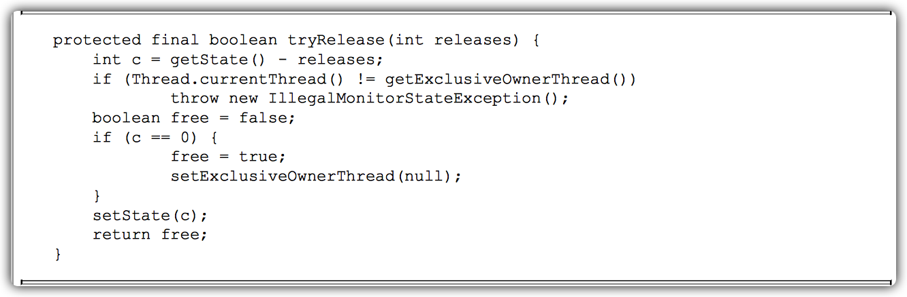

如果该锁被获取了n次，那么前(n-1)次tryRelease(int releases)方法必须返回false，而只有`同步状态完全释放了，才能返回true`。该方法将同步状态是否为0作为最终释放的条件，当同步状态为0时，将占有线程设置为null，并返回true，表示释放成功。

#### 公平与非公平获取锁的区别

公平性与否是针对获取锁而言的，如果一个锁是公平的，那么锁的获取顺序就应该符合 请求的绝对时间顺序，也就是FIFO。

对于非公平锁，只要CAS设置同步状态成功，则表示当前线程获取了锁，而`公平锁则不同`。


该方法与`nonfairTryAcquire(int acquires)`比较，唯一不同的位置为判断条件多了`hasQueuedPredecessors()`方法，即加入了`同步队列中当前节点是否有前驱节点`的判断，如果该方法返回true，则表示有线程比当前线程`更早地请求获取锁`，因此需要`等待前驱线程获取并释放锁之后才能继续获取锁`。

公平性锁每次都是从同步队列中的`第一个节点`获取到锁，而非公平性锁出现了`一个线程连续获取锁`的情况。

回顾nonfairTryAcquire(int acquires)方法，当一个线程请求锁时，只要获取了同步状态即成功获取锁。在这个前提下，刚释放锁的线程再次获取同步状态的几率会非常大，使得其他线程只能在同步队列中等待。

非公平性锁可能使线程“饥饿”，但是因为它的`开销更小`一些所以被设定成默认的实现。

运行测试用例（测试环境：ubuntu server 14.04 i5-34708GB，测试场景：10个线程，每个线程获取100000次锁），通过vmstat统计测试运行时系统线程上下文切换的次数，运行结果如表所示。


在测试中公平性锁与非公平性锁相比，总耗时是其94.3倍，总切换次数是其133倍。

- `公平性`锁保证了锁的获取按照FIFO原则，而代价是进`行大量的线程切换`。

- `非公平性`锁虽然可能造成线程“饥饿”，但`极少的线程切换`，保证了其更大的`吞吐量`。

### 读写锁

之前提到锁（如Mutex和ReentrantLock）基本都是`排他锁`，这些锁在`同一时刻只允许一个线程进行访问`，而读写锁在`同一时刻可以允许多个读线程访问`，但是在`写线程`访问时，`所有的读线程和其他写线程均被阻塞`。

读写锁维护了一对锁，一个读锁和一个写锁，通过分离读锁和写锁，使得`并发性相比一般的排他锁有了很大提升`。

除了`保证写操作对读操作的可见性`以及`并发性的提升`之外，读写锁能够`简化读写交互场景`的编程方式。假设在程序中定义一个共享的用作缓存数据结构，它大部分时间提供读服务（例如查询和搜索），而写操作占有的时间很少，但是写操作完成之后的更新需要对后续的读服务可见。

在没有读写锁支持的（Java 5之前）时候，如果需要完成上述工作就要使用Java的等待通知机制，就是当写操作开始时，所有晚于写操作的读操作均会进入等待状态，只有写操作完成并进行通知之后，所有等待的读操作才能继续执行（写操作之间依靠synchronized关键进行同步），这样做的目的是使读操作能读取到正确的数据，不会出现脏读。

改用读写锁实现上述功能，只需要在读操作时获取读锁，写操作时获取写锁即可。当写锁被获取到时，后续（非当前写操作线程）的读写操作都会被阻塞，写锁释放之后，所有操作继续执行，编程方式相对于使用等待通知机制的实现方式而言，变得简单明了。

一般情况下，读写锁的性能都会比排它锁好，因为大多数场景读是多于写的。`在读多于写的情况下，读写锁能够提供比排它锁更好的并发性和吞吐量`。Java并发包提供读写锁的实现是`ReentrantReadWriteLock`，它提供的特性如表所示。

| 特性       | 说明                                                         |
| ---------- | ------------------------------------------------------------ |
| 公平性选择 | 支持非公平（默认）和公平的锁获取方式，吞吐量还是非公平优于公平。 |
| 重进入     | 该锁支持重进入，以读写线程为例：读线程在获取了读锁之后，能够再次获取读锁。而`写线程`在获取了`写锁`之后能够再次获取`写锁`，同时也可以获取`读锁`。 |
| 锁降级     |                                                              |

#### 读写锁的接口与示例

`ReadWriteLock`仅定义了`获取读锁和写锁`的两个方法，即`readLock()`方法和`writeLock()`方法，而其实现——`ReentrantReadWriteLock`，除了接口方法之外，还提供了一些`便于外界监控其内部工作状态的方法`，这些方法以及描述如表所示。

| 方法名称                | 描述                                                         |
| ----------------------- | ------------------------------------------------------------ |
| int getReadLockCount()  | 返回`当前读锁被获取的次数`。该次数不等于获取读锁的线程数，例如，仅一个线程它连续获取（重进入）了n次读锁，那么`占据读锁的线程数是1`， 但该方法返回n。 |
| int getReadHoldCount()  | 返回`当前线程获取读锁的次数`。该方法在Java6中加入到 ReentrantReadWriteLock 中，使用Threadlocal 保存当前线程获取的次数，这也使得Java6的实现变得更加复杂。 |
| boolean isWriteLocked() | 判断写锁是否被获取。                                         |
| int getWriteHoldCount() | 返回当前写锁被获取的次数。                                   |

通过一个缓存示例说明读写锁的使用方式，示例代码如图所示。


Cache`组合一个非线程安全的HashMap作为缓存的实现`，同时`使用读写锁的读锁和写锁来保证Cache是线程安全的`。

- 在读操作get(String key)方法中，需要获取读锁，这使得并发访问该方法时不会被阻塞。
- 写操作put(String key,Object value)方法和clear()方法，在更新 HashMap时必须提前获取写锁，当获取写锁后，其他线程对于读锁和写锁的获取均被阻塞，而只有写锁被释放之后，其他读写操作才能继续。

Cache使用读写锁提升读操作的并发性，也保证每次写操作对所有的读写操作的可见性，同时简化了编程方式。

#### 读写锁的实现分析

##### 读写状态的设计

读写锁同样依赖`自定义同步器`来实现同步功能，而`读写状态就是其同步器的同步状态`。 回想`ReentrantLock中自定义同步器的实现`，`同步状态表示锁被一个线程重复获取的次数`。

读写锁的自定义同步器需要在同步状态（`一个整型变量`）上维护`多个读线`程和`一个写线程`的状态，使得该状态的设计成为读写锁实现的关键。

如果`在一个整型变量上维护多种状态`，就一定需要**按位切割使用**这个变量，读写锁将变量切分成了两个部分，`高16位表示读`，`低16位表示写`。


当前同步状态表示一个线程已经获取了写锁，且重进入了两次，同时也连续获取了两次 读锁。

读写锁是通过`位运算`迅速确定读和写各自的状态。

假设当前同步状态值为S，写状态等于S&0x0000FFFF（将高16位全部抹去），读状态等于S>>>16（无符号补0右移16位）。当写状态增加1时，等于S+1，当读状态增加1时，等于S+(1<<16)，也就是S+0x00010000。

根据状态的划分能得出一个推论：S不等于0时，当写状态（S&0x0000FFFF）等于0时，则读状态（S>>>16）大于0，即读锁已被获取。

##### 写锁的获取与释放

写锁是一个`支持重进入的排它锁`。如果当前线程已经获取了写锁，则增加写状态。如果当前线程在获取写锁时，`读锁已经被获取`（读状态不为0）或者`该线程不是已经获取写锁的线程`，则当前线程进入等待状态。


该方法除了`重入条件`（当前线程为获取了写锁的线程）之外，增加了一个`读锁是否存在`的判断。如果存在读锁，则写锁不能被获取，原因在于：读写锁要确保写锁的操作对读锁可见，如果允许读锁在已被获取的情况下对写锁的获取，那么正在运行的其他读线程就无法感知到当前写线程的操作。因此，只有等待`其他读线程都释放了读锁，写锁才能被当前线程获取`，而`写锁一旦被获取，则其他读写线程的后续访问均被阻塞`。

写锁的释放与ReentrantLock的释放过程基本类似，每次释放均减少写状态，当写状态为0时表示写锁已被释放，从而等待的读写线程能够继续访问读写锁，同时前次写线程的修改对后续读写线程可见。

##### 读锁的获取与释放

读锁是一个`支持重进入的共享锁`，它能够被多个线程同时获取，在`没有其他写线程访问 （或者写状态为0）时`，读锁总会被成功地获取，而所做的也只是（线程安全的）增加读状态。如果当前线程已经获取了读锁，则增加读状态。如果当前线程在获取读锁时，写锁已被其他线程获取，则进入等待状态。

获取读锁的实现从Java5到Java6变得复杂许多，主要原因是新增了一些功能，例如`getReadHoldCount()`方法，作用是`返回当前线程获取读锁的次数`。读状态是所有线程获取读锁次数的总和，而每个线程各自获取读锁的次数只能选择保存在ThreadLocal中，由线程自身维护，这使获取读锁的实现变得复杂。


- 如果其他线程已经获取了写锁，则当前线程获取读锁失败，进入等待状态。
- 如果当前线程获取了写锁或者写锁未被获取，则当前线程（线程安全，依靠`CAS`保证）增加读状态，成功获取读锁。

##### 锁降级


锁降级指的是`写锁降级成为读锁`。

如果当前线程拥有写锁，然后将其释放，最后再获取读锁，这种分段完成的过程不能称之为锁降级。`锁降级是指把持住（当前拥有的）写锁，再获取到读锁，随后释放（先前拥有的）写锁的过程`。

 	

一个锁降级的示例。因为数据不常变化，所以多个线程可以并发地进行数据处理，当数据变更后，如果当前线程感知到数据变化，则进行数据的准备工作，同时其他处理线程被阻塞，直到当前线程完成数据的准备工作，如图所示。


当数据发生变更后，update变量（布尔类型且volatile修饰）被设置为false，此 时所有访问processData()方法的线程都能够感知到变化，但只有一个线程能够获取到写锁，其他线程会被阻塞在读锁和写锁的lock()方法上。当前线程获取写锁完成数据准备之后，再获取读锁，随后释放写锁，完成锁降级。

锁降级中读锁的获取是必要的。主要是`为了保证数据的可见性`，如果当前线程不获取读锁而是直接释放写锁，假设此刻另一个线程（记作线程T）获取了写锁并修改了数据，那么当前线程无法感知线程T的数据更新。如果当前线程获取读锁，即遵循锁降级的步骤，则线程T将会被阻塞，直到当前线程使用数据并释放读锁之后，线程T才能获取写锁进行数据更新。

RentrantReadWriteLock`不支持锁升级`（把持读锁、获取写锁，最后释放读锁的过程）。目的也是`保证数据可见性`，如果读锁已被多个线程获取，其中任意线程成功获取了写锁并更新了数据，则其更新对其他获取到读锁的线程是不可见的。

### LockSupport工具

当需要`阻塞`或`唤醒`一个线程的时候，都会使用`LockSupport工具类`来完成相应工作。LockSupport定义了`一组`的`公共静态方法`，这些方法提供了`最基本的线程阻塞和唤醒功能`，而LockSupport也`成为构建同步组件的基础工具`。

LockSupport定义了一组`以park开头的方法用来阻塞当前线程`，`以及unpark(Thread thread) 方法来唤醒一个被阻塞的线程`。

Park有停车的意思，假设线程为车辆，那么park方法代表着停车，而unpark方法则是指车辆启动离开。

| 方法名称                      | 描述                                                         |
| ----------------------------- | ------------------------------------------------------------ |
| void park()                   | `阻塞当前线程`，如果调用 unpark (Thread thread）方法或者当前线程被中断，才能从park()方法返回。 |
| void parkNanos(long nanos)    | 阻塞当前线程，最长不超过 nanos 纳秒，返回条件在 park()的基础上増加了超时返回。 |
| void parkUntil(long deadline) | 阻塞当前线程，直到 deadline 时间（从1970年开始到 deadline时间的毫秒数）。 |
| void unpark(Thread thread)    | 唤醒处于阻塞状态的线程thread。                               |

在Java 6中，LockSupport增加了`park(Object blocker)`、`parkNanos(Object blocker,long nanos)`和`parkUntil(Object blocker,long deadline)` 3个方法，用于实现`阻塞当前线程`的功能，其中参数 `blocker`是用来`标识当前线程在等待的对象`（以下称为阻塞对象），该对象主要用于问`题排查`和`系统监控`。

对比parkNanos(long nanos)方法和parkNanos(Object blocker,long nanos)方法来展示`阻塞对象blocker`的用处，代码片段和线程dump（部分）。

从图的线程dump结果可以看出，代码片段的内容都是阻塞当前线程10秒，但从线程 dump结果可以看出，有阻塞对象的parkNanos方法能够传递给开发人员更多的现场信息。

在Java5之前，当线程阻塞（使用synchronized关键字）在一个对象上时，通过线程dump能够查看到该线程的阻塞对象，方便问题定位，而Java5推出的Lock等并发工具时却遗漏了这一点，致使在线程dump时无法提供阻塞对象的信息。因此，在Java6中，LockSupport新增了上述3个含有阻塞对象的park方法，用以替代原有的park方法。


### Condition接口

任意一个Java对象，都拥有一组监视器方法（定义在java.lang.Object上），主要包括`wait()`、`wait(long timeout)`、`notify()`以及`notifyAll()`方法，这些方法与`synchronized`同步关键字配合，可以实现`等待/通知模式`。

Condition接口也提供了类似Object的监视器方法，`与Lock配合可以实现等待/通知模式`，但是这两者在`使用方式`以及`功能特性`上还是`有差别`的。

通过对比Object的监视器方法和Condition接口，可以更详细地了解Condition的特性，对比项与结果如图所示。


#### Condition接口与示例

Condition定义了`等待/通知两种类型的方法`，当前线程调用这些方法时，需要`提前获取到Condition对象关联的锁`。

Condition对象是由Lock对象（调用Lock对象的newCondition()方法）创建出来的，换句话说，`Condition是依赖Lock对象的`。


如示例所示，一般都会`将Condition对象作为成员变量`。

`当调用await()方法后，当前线程会释放锁并在此等待`。

其他线程调用Condition对象的signal()方法，通知当前线程后，当前线程才从await()方法返回，并且`在返回前已经获取了锁`。

Condition定义的（部分）方法以及描述如图所示。

| 方法名称                                                     | 描述                                                         |
| ------------------------------------------------------------ | ------------------------------------------------------------ |
| void await throw InterruptedException                        | 当前线程进入等待状态直到被通知（signal）或中断，当前线程将进入运行状态且从 await 方法返回的情况，包括：<br />其他线程调用该 Condition 的 signal()或 signalAll()方法，而当前线程被选中唤醒<br />其他线程（调用 interrupt（方法）中断当前线程<br />如果当前等待线程从 await()方法返回，那么表明该线程`已经获取`了 Condition 对象所对应的锁 |
| void awaitUninterruptibly()                                  | 当前线程进入等待状`直到被通知`，从方法名称上可以看出该方法对中断不敏感。 |
| long awaitNanos(long nanosTimeout) throws InterruptedException | `当前线程进入等待状态直到被通知、中断或者超时`。返回值表示剩余的时间，如果在 nanostimeout 纳秒之前被唤醒，那么返回值就是（nanostimeout 实际耗时）。如果返回值是0或者负数，那么可以认定已经超时了。 |
| boolean awaitUntil(Date deadline) throws InterruptedException | `当前线程进入等待状态直到被通知、中断或者到某个时间`。如果没有到指定时间就被通知，方法返回 tue，否则，表示到了指定时间，方法返回 false。 |
| void signal()                                                | 唤醒`一个`等待在Condition上的线程，该线程从等待方法返回前必须获得与  Condition相关联的锁 |
| void signalAll()                                             | 唤醒`所有`等待在Condition上的线程，能够从等待方法返回的线程必须获得Condition相关联的锁。 |

获取一个Condition必须通过`Lock`的`newCondition()`方法。

通过一个`有界队列`的示例来深入了解Condition的使用方式。有界队列是一种特殊的队列，当队列为空时，队列的获取操作将会阻塞获取线程，直到队列中有新增元素，当队列已满时，队列的插入操作将会阻塞插入线程，直到队列出现“空位”。


以添加方法为例。

首先需要获得锁，目的是`确保数组修改的可见性和排他性`。

- 当数组数量等于数组长度时，表示数组已满，则调用notFull.await()，当前线程随之释放锁并进入等待状态。
- 如果数组数量不等于数组长度，表示数组未满，则添加元素到数组中，同时通知等待在notEmpty上的线程，数组中已经有新元素可以获取。

在添加和删除方法中使用`while循环而非if判断，目的是防止过早或意外的通知`，只有条件符合才能够退出循环。

与之前提到的等待/通知的经典范式，二者是非常类似的。

#### Condition的实现分析

ConditionObject是同步器AbstractQueuedSynchronizer的`内部类`，因为Condition的操作需要`获取相关联的锁`，所以作为同步器的内部类也较为合理。每个Condition对象都包含着一个队列（以下称为`等待队列`），该队列是Condition对象实现等待/通知功能的`关键`。

##### 等待队列

等待队列是一个`FIFO`的队列，在队列中的每个节点都包含了一个`线程引用`，该线程就是在Condition对象上`等待`的线程，如果一个线程调用了Condition.await()方法，那么该**线程将会释放锁、构造成节点加入等待队列并进入等待状态**。事实上，节点的定义复用了同步器中节点的定义，也就是说，`同步队列`和`等待队列`中节点类型都是`同步器的静态内部类 AbstractQueuedSynchronizer.Node`。

一个Condition包含一个等待队列，Condition拥有首节点（firstWaiter）和尾节点（lastWaiter）。当前线程调用Condition.await()方法，将会以当前线程构造节点，并将节点从尾部加入等待队列，等待队列的基本结构如图所示。


如图所示，`Condition拥有首尾节点的引用`，而新增节点只需要将原有的尾节点nextWaiter指向它，并且更新尾节点即可。

上述节点引用更新的过程并没有使用CAS保证，原因在于调用await()方法的线程必定是获取了锁的线程，也就是说该过程是由锁来保证线程安全的。

`在Object的监视器模型上，一个对象拥有一个同步队列和等待队列`，而`并发包中的 Lock（更确切地说是同步器）拥有一个同步队列和多个等待队列`，其对应关系如图所示。


Condition的实现是同步器的`内部类`，因此每个Condition实例都能够访问同步器 提供的方法，相当于`每个Condition都拥有所属同步器的引用`。

##### 等待

调用Condition的await()方法（或者以await开头的方法），会使当前线程`进入等待队列并释放锁`，同时`线程状态变为等待状态`。当从await()方法返回时，当前线程一定`获取了Condition相联的锁`。

如果从队列（同步队列和等待队列）的角度看await()方法，当调用await()方法时，相当于**同步队列的首节点**（获取了锁的节点）移动到**Condition的等待队列中**。

Condition的await()方法，如图所示。

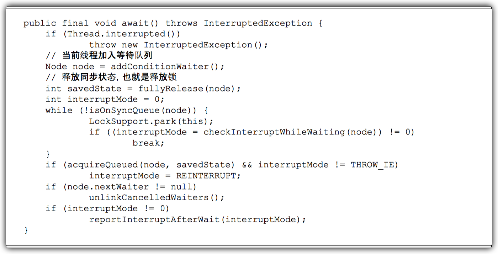

**调用该方法的线程成功获取了锁的线程，也就是同步队列中的首节点**，该方法会将当前线程构造成节点并加入等待队列中，然后释放同步状态，`唤醒同步队列中的后继节点`，然后当 前线程会进入等待状态。

当等待队列中的节点被唤醒，则唤醒节点的线程开始尝试获取同步状态。如果不是通过 其他线程调用Condition.signal()方法唤醒，而是对等待线程进行中断，则会抛出 InterruptedException。

如果从队列的角度去看，当前线程加入Condition的等待队列，该过程如图示。


如图所示，`同步队列的首节点并不会直接加入等待队列，而是通过addConditionWaiter()方法把当前线程构造成一个新的节点并将其加入等待队列中`。

##### 通知

调用Condition的signal()方法，将会`唤醒在等待队列中等待时间最长的节点（首节点）`，==在唤醒节点之前，会将节点移到同步队列中==。

Condition的signal()方法，如图所示。


调用该方法的前置条件是`当前线程必须获取了`锁，可以看到signal()方法进行了 isHeldExclusively()检查，也就是当前线程必须是获取了锁的线程。接着获取等待队列的首节点，将其移动到同步队列并使用LockSupport唤醒节点中的线程。

节点从等待队列移动到同步队列的过程如图所示。


通过调用同步器的enq(Node node)方法，`等待队列中的头节点线程安全地移动到同步队列`。当节点移动到同步队列后，当前线程再使用LockSupport唤醒该节点的线程。

被唤醒后的线程，将从await()方法中的while循环中退出（isOnSyncQueue(Node node)方法返回true，节点已经在同步队列中），进而调用同步器的acquireQueued()方法加入到获取同步状态的竞争中。

成功获取同步状态（或者说锁）之后，被唤醒的线程将从先前调用的await()方法返回，此时该线程已经成功地获取了锁。

Condition的signalAll()方法，相当于对等待队列中的每个节点均执行一次signal()方法，效果就是将等待队列中所有节点全部移动到同步队列中，并唤醒每个节点的线程。

## Java并发容器和框架

### ConcurrentHashMap的实现原理与使用

#### 为什么要使用ConcurrentHashMap

1. 在并发编程中使用`HashMap可能导致程序死循环`。
2. 使`用线程安全的HashTable效率又非常低下`。

基于以上两个原因，便有了ConcurrentHashMap的登场机会。

##### 线程不安全的HashMap

在多线程环境下，使用HashMap进行`put`操作会引起死循环，`导致CPU利用率接近100%`，所以在并发情况下不能使用HashMap。例如，执行以下代码会引起死循环。


HashMap在并发执行put操作时会引起死循环，是因为多线程会导致HashMap的`Entry链表形成环形数据结构`，一旦形成环形数据结构，`Entry的next节点永远不为空`，就会产生死循环获取Entry。

##### 效率低下的HashTable

HashTable容器使用`synchronized`来保证线程安全，但在线程竞争激烈的情况下HashTable的效率非常低下。因为当一个线程访问HashTable的同步方法，其他线程也访问HashTable的同步方法时，会`进入阻塞或轮询状态`。如线程1使用put进行元素添加，线程2不但不能使用put方法添加元素，也不能使用get方法来获取元素，所以竞争越激烈效率越低。

##### ConcurrentHashMap的锁分段技术可有效提升并发访问率

HashTable容器在竞争激烈的并发环境下表现出效率低下的原因是所有访问HashTable的线程都必须竞争同一把锁，假如容器里有`多把锁`，每一把锁用于锁容器其中一部分数据，那么当多线程访问容器里不同数据段的数据时，线程间就不会存在锁竞争，从而可以有效提高并发访问效率，这就是ConcurrentHashMap所使用的`锁分段技术`。

首先将数据分成一段一段地存储，然后给每一段数据配一把锁，当一个线程占用锁访问其中一个段数据的时候，其他段的数据也能被其他线程访问。

#### ConcurrentHashMap的结构

通过ConcurrentHashMap的类图来分析ConcurrentHashMap的结构，如图所示。


- ConcurrentHashMap是由`Segment数组结构`和`HashEntry数组结构组成`。
- `Segment是一种可重入锁（ReentrantLock），在ConcurrentHashMap里扮演锁的角色`。
- `HashEntry则用于存储键值对数据`。

- 一个ConcurrentHashMap里包含一个Segment数组。
- Segment的结构和HashMap类似，是一种数组和链表结构。
- 一个Segment里包含一个HashEntry数组，每个HashEntry是一个链表结构的元 素，每个Segment守护着一个HashEntry数组里的元素，当对HashEntry数组的数据进行修改时，必须首先获得与它对应的Segment锁。


#### ConcurrentHashMap的初始化

ConcurrentHashMap初始化方法是通过`initialCapacity`、`loadFactor`和`concurrencyLevel`等几个参数来初始化**segment数组**、**段偏移量segmentShift**、**段掩码segmentMask**和**每个segment里的HashEntry数组**来实现的。

##### 初始化segments数组


由上面的代码可知，segments数组的长度`ssize`是通过`concurrencyLevel`计算得出的。为了能通过按位与的散列算法来定位segments数组的索引，`必须保证segments数组的长度是2的N次方`（power-of-two size），所以`必须计算出一个大于或等于concurrencyLevel的最小的2的N次方值来作为segments数组的长度`。

假如concurrencyLevel等于14、15或16，ssize都会等于16，即容器里锁的个数也是16。

concurrencyLevel的最大值是65535，这意味着segments数组的长度最大为65536，对应的二进制是16位。

##### 初始化segmentShift和segmentMask

这两个全局变量需要在定位segment时的散列算法里使用，`sshift等于ssize从1向左移位的次数`，在默认情况下concurrencyLevel等于16，1需要向左移位移动4次，所以sshift等于4。 

segmentShift用于定位参与散列运算的位数，`segmentShift等于32减sshift`，所以等于28，这里之所以用32是因为ConcurrentHashMap里的`hash()方法输出的最大数是32位的`。

`segmentMask是散列运算的掩码`，`等于ssize减1`，即15，掩码的二进制各个位的值都是1。因为ssize的最大长度是65536，所以segmentShift最大值是16，segmentMask最大值是65535，对应的二进制是16位，每个位都是1。

##### 初始化每个segment

输入参数`initialCapacity`是ConcurrentHashMap的`初始化容量`，`loadfactor`是每个segment的`负载因子`，在构造方法里需要通过这两个参数来初始化数组中的每个segment。

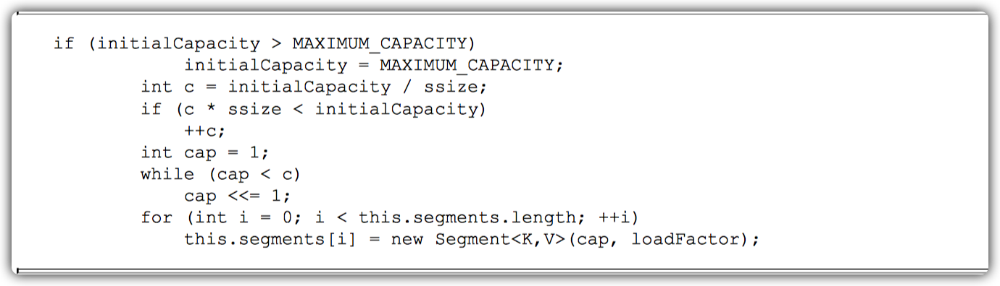

上面代码中的变量cap就是segment里HashEntry数组的长度，它等于`initialCapacity除以ssize的倍数c`。如果c大于1，就会取大于等于c的2的N次方值，所以cap`不是1，就是2的N次方`。 

segment的容量`threshold＝(int)cap*loadFactor`，默认情况下initialCapacity等于16，loadfactor等于0.75，通过运算cap等于1，threshold等于零。

#### 定位Segment

既然ConcurrentHashMap使用分段锁Segment来保护不同段的数据，那么在插入和获取元素的时候，必须`先通过散列算法定位到Segment`。可以看到ConcurrentHashMap会首先使用 Wang/Jenkins `hash的变种算法`对元素的hashCode`进行一次再散列`。


之所以进行再散列，目的是`减少散列冲突`，使元素能够`均匀地分布在不同的Segment上`，从而`提高容器的存取效率`。

假如散列的质量差到极点，那么所有的元素都在一个Segment中，不仅存取元素缓慢，分段锁也会失去意义。

如果不通过再散列而直接执行散列计算。


计算后输出的散列值全是15，通过这个例子可以发现，`如果不进行再散列，散列冲突会非常严重，因为只要低位一样，无论高位是什么数，其散列值总是一样`。

再把上面的二进制数据进行再散列后结果如下（为了方便阅读，不足32位的高位补了0，每隔4位用竖线分割下）。


可以发现，每一位的数据都散列开了，通过这种`再散列能让数字的每一位都参加到散列运算当中，从而减少散列冲突`。

ConcurrentHashMap通过以下散列算法定位segment。


默认情况下`segmentShift为28`，`segmentMask为15`，再散列后的数最大是32位二进制数据， 向右无符号移动28位，意思是`让高4位参与到散列运算中`，`(hash>>>segmentShift)&segmentMask`的运算结果分别是4、15、7和8，可以看到散列值没有发生冲突。

#### ConcurrentHashMap的操作

##### get操作

Segment的get操作实现非常简单和高效。`先经过一次再散列，然后使用这个散列值通过散列运算定位到Segment，再通过散列算法定位到元素`，代码如下。


get操作的高效之处在于`整个get过程不需要加锁`，`除非读到的值是空才会加锁重读`。

HashTable容器的get方法是需要加锁的，而ConcurrentHashMap的get方法里将要使用的`共享变量都定义成volatile类型`，如用于统计当前 Segement大小的`count字段`和用于存储值的HashEntry的`value`。定义成volatile的变量，能够在线程之间保持可见性，能够被多线程同时读，并且保证不会读到过期的值，但是只能`被单线程写`（有一种情况可以被多线程写，就是写入的值不依赖于原值），在get操作里只需要读不需要写共享变量count和value，所以可以不用加锁。

之所以不会读到过期的值，是因为根据`Java内存模型的happen before原则`，对volatile字段的写入操作先于读操作，即使两个线程同时修改和获取 volatile变量，get操作也能拿到最新的值，这是`用volatile替换锁`的经典应用场景。


在定位元素的代码里我们可以发现，`定位HashEntry`和`定位Segment`的`散列算法虽然一样`，都与数组的长度减去1再相“与”，但是相“与”的值不一样。

- 定位Segment使用的是元素的hashcode通过`再散列后得到的值的高位`。
- 定位HashEntry直接使用的是`再散列后的值`。

其目的是`避免两次散列后的值一样`，虽然元素在Segment里散列开了，但是却没有在HashEntry里散列开。


##### put操作

由于put方法里需要对共享变量进行写入操作，所以为了线程安全，在操作共享变量时`必须加锁`。

put方法首先定位到Segment，然后在Segment里进行插入操作。插入操作需要经历两个步骤。

1. 第一步判断是否需要对Segment里的HashEntry数组进行扩容。
2. 第二步定位添加元素的位置，然后将其放在HashEntry数组里。

**是否需要扩容**

在插入元素前会先判断Segment里的HashEntry数组是否超过容量`threshold`，如果超过阈值，则对数组进行扩容。

值得一提的是，Segment的扩容判断比HashMap更恰当，因为HashMap是在插入元素后判断元素是否已经到达容量的，如果到达了就进行扩容，但是很有可能扩容之后没有新元素插入，这时HashMap就进行了一次`无效的扩容`。

**如何扩容**

在扩容的时候，首先会创建一个容量是`原来容量两倍的数组`，然后`将原数组里的元素进行再散列后插入到新的数组里`。

为了高效，ConcurrentHashMap`不会对整个容器进行扩容`，而`只对某个segment进行扩容`。

##### size操作

如果要统计整个ConcurrentHashMap里元素的大小，就必须统计所有Segment里元素的大小后求和。

Segment里的全局变量count是一个volatile变量，那么在多线程场景下，是不是直接把所有Segment的count相加就可以得到整个ConcurrentHashMap大小了呢？

不是的，虽然相加时可以获取每个Segment的count的最新值，但是`可能累加前使用的count发生了变化`，那么统计结果就不准了。所以，最安全的做法是在统计size的时候把所有Segment的`put`、`remove`和`clean`方法`全部锁住`，但是这种做法显然非常低效。

因为在累加count操作过程中，之前累加过的count发生变化的几率非常小，所以ConcurrentHashMap的做法是`先尝试2次通过不锁住Segment的方式来统计各个Segment大小`，`如果统计的过程中，容器的count发生了变化，则再采用加锁的方式来统计所有Segment的大小`。

使用`modCount`变量，在put、remove和clean方法里操作元素前都会将变量modCount进行加1，那么`在统计size前后比较modCount是否发生变化`，从而得知容器的大小是否发生变化。

### ConcurrentLinkedQueue

在并发编程中，有时候需要使用线程安全的队列。

- 使用阻塞算法的队列可以用一个锁（入队和出队用同一把锁）或两个锁（入队和出队用不同的锁）等方式来实现。
- 非阻塞的实现方式则可以使用循环CAS的方式来实现。

ConcurrentLinkedQueue是一个基于链接节点的无界线程安全队列，它采用`先进先出`的规则对节点进行排序。

- 当我们添加一个元素的时候，它会添加到队列的尾部。
- 当我们获取一个元素时，它会返回队列头部的元素。

它采用了“wait-free”算法（即CAS算法）来实现，该算法在 Michael&Scott算法上进行了一些修改。

#### ConcurrentLinkedQueue的结构

通过ConcurrentLinkedQueue的类图来分析一下它的结构，如图所示。


ConcurrentLinkedQueue由`head节点`和`tail节点`组成，每个节点（Node）由节点元素（item）和 指向下一个节点（next）的引用组成，节点与节点之间就是通过这个next关联起来，从而组成`一张链表结构的队列`。

默认情况下head节点存储的元素为空，tail节点等于head节点。


#### 入队列

##### 入队列的过程

入队列就是`将入队节点添加到队列的尾部`。为了方便理解入队时队列的变化，以及head节点和tail节点的变化，这里以一个示例来展开介绍。假设我们想在一个队列中依次插入4个节点，为了帮助大家理解，每添加一个节点就做了一个队列的快照图。


- 添加元素1。队列更新head节点的next节点为元素1节点。又因为tail节点默认情况下等于head节点，所以它们的next节点都指向元素1节点。
- 添加元素2。队列首先设置元素1节点的next节点为元素2节点，然后更新tail节点指向元素 2节点。
- 添加元素3，设置tail节点的next节点为元素3节点。
- 添加元素4，设置元素3的next节点为元素4节点，然后将tail节点指向元素4节点。

通过调试入队过程并观察head节点和tail节点的变化，发现入队主要做两件事情。

1. 将入队节点设置成当前队列尾节点的下一个节点。
2. 更新tail节点，如果tail节点的next节点不为空，则将入队节点设置成tail节点，如果tail节点的next节点为空，则将入队节点设置成 tail的next节点，所以tail节点不总是尾节点（理解这一点对于我们研究源码会非常有帮助）。

通过对上面的分析，我们从单线程入队的角度理解了入队过程，但是多个线程同时进行入队的情况就变得更加复杂了，因为可能会出现`其他线程插队`的情况。如果有一个线程正在入队，那么它必须先获取尾节点，然后设置尾节点的下一个节点为入队节点，但这时可能有另外一个线程插队了，那么队列的尾节点就会发生变化，这时当前线程要暂停入队操作，然后重新获取尾节点。

通过源码来详细分析一下它是如何使用`CAS算法`来入队的。


从源代码角度来看，整个`入队`过程主要做两件事情。

1. 定位出尾节点。
2. 使用CAS算法将入队节点设置成尾节点的next节点，如不成功则重试。

##### 定位尾节点

`tail节点并不总是尾节点`，所以每次入队都必须先通过tail节点来找到尾节点。`尾节点可能是tail节点，也可能是tail节点的next节点`。

代码中循环体中的第一个if就是判断tail是否有next节点，有则表示next节点可能是尾节点。获取tail节点的next节点需要注意的是p节点等于p的next 节点的情况，只有一种可能就是`p节点和p的next节点都等于空，表示这个队列刚初始化`，正准备添加节点，所以需要返回head节点。

获取p节点的next节点代码如下。


##### 设置入队节点为尾节点

p.casNext(null，n)方法用于将入队节点设置为当前队列尾节点的next节点，`如果p是null，表示p是当前队列的尾节点`，`如果不为null，表示有其他线程更新了尾节点，则需要重新获取当前队列的尾节点`。

##### HOPS的设计意图

上面分析过对于先进先出的队列入队所要做的事情是将入队节点设置成尾节点，doug lea 写的代码和逻辑还是稍微有点复杂。

那么，用以下方式来实现是否可行。


让tail节点永远作为队列的尾节点，这样实现代码量非常少，而且逻辑清晰和易懂。

但是，这么做有个缺点，每次都需要使用`循环CAS更新tail节点`。如果能减少CAS更新tail节点的次数，就能提高入队的效率，所以doug lea使用hops变量来控制并减少tail节点的更新频率，并不是每次节点入队后都将tail节点更新成尾节点，而是当tail节点和尾节点的距离大于等于常量HOPS的值(默认等于1)时才更新tail节点，`tail和尾节点的距离越长，使用CAS更新tail节点的次 数就会越少`，但是距离越长带来的负面效果就是每次入队时定位尾节点的时间就越长，因为循环体需要多循环一次来定位出尾节点，但是这样仍然能提高入队的效率，因为从本质上来看它`通过增加对volatile变量的读操作来减少对volatile变量的写操作`，而`对volatile变量的写操作开销要远远大于读操作`，所以入队效率会有所提升。


入队方法永远返回true，所以不要通过返回值判断入队是否成功。

#### 出队列

出队列的就是`从队列里返回一个节点元素，并清空该节点对元素的引用`。让我们通过每个节点出队的快照来观察一下head节点的变化，如图所示。


从图中可知，并不是每次出队时都更新head节点，当head节点里有元素时，直接弹出head节点里的元素，而不会更新head节点。`只有当head节点里没有元素时，出队操作才会更新head节点`。

这种做法也是通过`hops变量`来减少使用CAS更新head节点的消耗，从而提高出队效率。


首先获取头节点的元素，然后判断头节点元素是否为空，如果为空，表示另外一个线程已经进行了一次出队操作将该节点的元素取走，如果不为空，则使用CAS的方式将头节点的引用设置成null，如果CAS成功，则直接返回头节点的元素，如果不成功，表示另外一个线程已经进行了一次出队操作更新了head节点，导致元素发生了变化，需要重新获取头节点。

### Java中的阻塞队列

#### 什么是阻塞队列

阻塞队列（BlockingQueue）是一个支持两个附加操作的队列。这两个附加的操作`支持阻塞的插入和移除方法`。

- **支持阻塞的插入方法** 

  当队列满时，队列会阻塞插入元素的线程，直到队列不满。

- **支持阻塞的移除方法**

  在队列为空时，获取元素的线程会等待队列变为非空。

阻塞队列常用于`生产者和消费者的场景`，生产者是向队列里添加元素的线程，消费者是从队列里取元素的线程。阻塞队列就是生产者用来存放元素、消费者用来获取元素的容器。

在阻塞队列不可用时，这两个附加操作提供了4种处理方式，如表所示。

| 方法/处理方式 | 抛出异常  | 返回特殊值 | 一直阻塞 | 超时退出             |
| ------------- | --------- | ---------- | -------- | -------------------- |
| 插入方法      | add(e)    | offer(e)   | put(e)   | offer(e, time, unit) |
| 移除方法      | remove()  | poll()     | take()   | poll(time, unit)     |
| 检查方法      | element() | peek()     | 不可用   | 不可用               |

- 抛出异常
  - 当队列满时，如果再往队列里插入元素，会抛出IllegalStateException（"Queue full"）异常。
  - 当队列空时，从队列里获取元素会抛出NoSuchElementException异常。
- 返回特殊值
  - 当往队列插入元素时，会返回元素是否插入成功，成功返回true。
  - 如果是移除方法，则是从队列里取出一个元素，如果没有则返回null。

- 一直阻塞
  - 当阻塞队列满时，如果生产者线程往队列里put元素，队列会一直阻塞生产者线程，直到队列可用或者响应中断退出。
  - 当队列空时，如果消费者线程从队列里take元素，队列会阻塞住消费者线程，直到队列不为空。
- 超时退出
  - 当阻塞队列满时，如果生产者线程往队列里插入元素，队列会阻塞生产者线程一段时间，如果超过了指定的时间，生产者线程就会退出。
  - 当阻塞队列空时，如果消费者线程从队列里获取元素，队列会阻塞消费者线程一段时间，如果超过了指定的时间，消费者线程就会退出。

如果是`无界阻塞队列`，队列不可能会出现满的情况，所以使用put或offer方法永远不会被阻塞，而且使用offer方法时，该方法永远返回true。

#### Java里的阻塞队列

JDK 7提供了7个阻塞队列，如下。

- **ArrayBlockingQueue** 一个由数组结构组成的有界阻塞队列。
- **LinkedBlockingQueue** 一个由链表结构组成的有界阻塞队列。 
- **PriorityBlockingQueue** 一个支持优先级排序的无界阻塞队列。 
- **DelayQueue** 一个使用优先级队列实现的无界阻塞队列。 
- **SynchronousQueue** 一个不存储元素的阻塞队列。 
- **LinkedTransferQueue** 一个由链表结构组成的无界阻塞队列。 
- **LinkedBlockingDeque** 一个由链表结构组成的双向阻塞队列。

##### ArrayBlockingQueue

ArrayBlockingQueue是一个用`数组`实现的`有界阻塞队列`。此队列按照先进先出（FIFO）的原则对元素进行排序。

默认情况下`不保证线程公平的访问队列`，所谓公平访问队列是指阻塞的线程，可以按照阻塞的先后顺序访问队列，即先阻塞线程先访问队列。

非公平性是对先等待的线程是非公平的，当队列可用时，阻塞的线程都可以争夺访问队列的资格，有可能先阻塞的线程最后才访问队列。

`为了保证公平性，通常会降低吞吐量`。我们可以使用以下代码创建一个公平的阻塞队列。


##### LinkedBlockingQueue

LinkedBlockingQueue是一个用`链表`实现的`有界阻塞队列`。此队列的`默认和最大长度为Integer.MAX_VALUE`。此队列按照先进先出的原则对元素进行排序。

##### PriorityBlockingQueue

PriorityBlockingQueue是一个`支持优先级`的`无界阻塞队列`。

`默认情况下元素采取自然顺序升序排列`。也可以自定义类实现compareTo()方法来指定元素排序规则，或者初始化PriorityBlockingQueue时，指定构造参数Comparator来对元素进行排序。需要注意的是`不能保证同优先级元素的顺序`。

##### DelayQueue

DelayQueue是一个`支持延时获取元素`的`无界阻塞队列`。队列使用PriorityQueue来实现。`队列中的元素必须实现Delayed接口`，在创建元素时可以`指定多久才能从队列中获取当前元素`。只有在延迟期满时才能从队列中提取元素。

DelayQueue非常有用，可以将DelayQueue运用在以下应用场景。

- **缓存系统的设计**

  ​	可以用DelayQueue保存缓存元素的有效期，使用一个线程循环查询DelayQueue，一旦能从DelayQueue中获取元素时，表示缓存有效期到了。

- **定时任务调度**

  ​	使用DelayQueue`保存当天将会执行的任务和执行时间`，一旦从 DelayQueue中获取到任务就开始执行，比如TimerQueue就是使用DelayQueue实现的。

###### 如何实现Delayed接口

`DelayQueue队列的元素必须实现Delayed接口`。参考ScheduledThreadPoolExecutor里`ScheduledFutureTask`类的实现，一共有三步。

1. 在对象创建的时候，初始化基本数据。

   使用time记录当前对象延迟到什么时候可以使用，使用`sequenceNumber`来标识元素在队列中的先后顺序。代码如下。

   

2. 实现getDelay方法，该方法返回当前元素还需要延时多长时间，单位是纳秒，代码如下。

   

   通过构造函数可以看出延迟时间参数ns的单位是纳秒，自己设计的时候最好使用纳秒，因为实现getDelay()方法时可以指定任意单位，一旦以秒或分作为单位，而延时时间又精确不到纳秒就麻烦了。使用时请注意当time小于当前时间时，getDelay会返回负数。

3. 实现compareTo方法来指定元素的顺序。例如，让延时时间最长的放在队列的末尾。实现代码如下。

   

###### 如何实现延时阻塞队列

延时阻塞队列的实现很简单，当消费者从队列里获取元素时，如果元素没有达到延时时间，就阻塞当前线程。


代码中的变量`leader`是`一个等待获取队列头部元素的线程`。如果leader不等于空，表示已经有线程在等待获取队列的头元素。所以，使用await()方法让当前线程等待信号。如果leader等于空，则把当前线程设置成leader，并使用awaitNanos()方法让当前线程等待接收信号或等待delay时间。

##### SynchronousQueue

SynchronousQueue是一个`不存储元素的阻塞队列`。每一个put操作必须等待一个take操作，否则不能继续添加元素。

它`支持公平访问队列`。`默认情况下线程采用非公平性策略访问队列`。使用以下构造方法可以创建公平性访问的SynchronousQueue，如果设置为true，则等待的线程会采用先进先出的顺序访问队列。


SynchronousQueue可以看成是一个传球手，负责把生产者线程处理的数据直接传递给消费者线程。`队列本身并不存储任何元素，非常适合传递性场景`。SynchronousQueue的`吞吐量高于`LinkedBlockingQueue和ArrayBlockingQueue。

##### LinkedTransferQueue

LinkedTransferQueue是一个由`链表结构`组成的`无界阻塞TransferQueue队列`。相对于其他阻塞队列，LinkedTransferQueue多了`tryTransfer`和`transfer`方法。

###### transfer方法

如果当前有消费者正在等待接收元素（消费者使用take()方法或带时间限制的poll()方法时），transfer方法可以`把生产者传入的元素立刻transfer（传输）给消费者`。

如果没有消费者在等待接收元素，transfer方法会将元素存放在队列的tail节点，并`等到该元素被消费者消费了才返回`。

transfer方法的关键代码如下。


- 第一行代码是试图把存放当前元素的s节点作为tail节点。
- 第二行代码是让CPU自旋等待 消费者消费元素。因为自旋会消耗CPU，所以自旋一定的次数后使用Thread.yield()方法来暂停 当前正在执行的线程，并执行其他线程。

###### tryTransfer方法

tryTransfer方法是用来`试探生产者传入的元素是否能直接传给消费者`。如果没有消费者等待接收元素，则返回false。和transfer方法的区别是`tryTransfer方法无论消费者是否接收，方法立即返回`，而transfer方法是必须等到消费者消费了才返回。

对于带有时间限制的tryTransfer(E e，long timeout，TimeUnit unit)方法，试图把生产者传入的元素直接传给消费者，但是如果没有消费者消费该元素则等待指定的时间再返回，如果超时还没消费元素，则返回false，如果在超时时间内消费了元素，则返回true。

##### LinkedBlockingDeque

LinkedBlockingDeque是一个由`链表结构`组成的`双向阻塞队列`。所谓双向队列指的是`可以从队列的两端插入和移出元素`。

双向队列因为多了一个操作队列的入口，在多线程同时入队时，也就减少了一半的竞争。相比其他的阻塞队列，LinkedBlockingDeque多了`addFirst`、 `addLast`、`offerFirst`、`offerLast`、`peekFirst`和`peekLast`等方法。

- 以First单词结尾的方法，表示插入、获取（peek）或移除双端队列的第一个元素。
- 以Last单词结尾的方法，表示插入、获取或移除双端队列的最后一个元素。
- 另外，插入方法add等同于addLast，移除方法remove等效于 removeFirst。
- 但是take方法却等同于takeFirst，不知道是不是JDK的bug，使用时还是用带有First和Last后缀的方法更清楚。

在初始化LinkedBlockingDeque时可以`设置容量防止其过度膨胀`。另外，双向阻塞队列可以运用在**工作窃取**模式中。

#### 阻塞队列的实现原理

`使用通知模式实现。`

所谓通知模式，就是当生产者往满的队列里添加元素时会阻塞住生产者，当消费者消费了一个队列中的元素后，会通知生产者当前队列可用。

通过查看JDK源码 发现ArrayBlockingQueue使用了`Condition`来实现，代码如下。


当往队列里插入一个元素时，如果队列不可用，那么阻塞生产者主要通过 `LockSupport.park(this)`来实现。


继续进入源码，发现调用setBlocker先保存一下将要阻塞的线程，然后调用`unsafe.park`阻塞当前线程。


unsafe.park是个`native方法`，代码如下。


`park`这个方法会`阻塞当前线程`，只有以下4种情况中的一种发生时，该方法才会返回。

- 与park对应的`unpark执行或已经执行时`。**已经执行**是指unpark先执行，然后再执行park的情况。
- 线程被中断时。
- 等待完time参数指定的毫秒数时。
- 异常现象发生时，这个异常现象没有任何原因。

看一下JVM是如何实现park方法：`park在不同的操作系统中使用不同的方式实现`，在Linux下使用的是系统方法`pthread_cond_wait实现`。实现代码在JVM源码路径**src/os/linux/vm/os_linux.cpp**里的**os::PlatformEvent::park**方法，代码如下。


pthread_cond_wait是一个`多线程的条件变量函数`，cond是condition的缩写，字面意思可以理解为`线程在等待一个条件发生，这个条件是一个全局变量`。这个方法接收两个参数：一个`共享变量_cond`，一个`互斥量_mutex`。

`unpark`方法在Linux下是使用`pthread_cond_signal`实现的。

park方法在Windows下则是使用`WaitForSingleObject`实现的。

当线程被阻塞队列阻塞时，线程会进入WAITING(parking)状态。我们可以使用jstack dump 阻塞的生产者线程看到这点，如下。


### Fork/Join框架

#### 什么是Fork/Join框架

Fork/Join框架是Java 7提供的一个用于`并行执行任务`的框架，是`一个把大任务分割成若干个小任务，最终汇总每个小任务结果后得到大任务结果的框架`。

- Fork就是把一个大任务切分 为若干子任务并行的执行。
- Join就是合并这些子任务的执行结果，最后得到这个大任务的结果。

Fork/Join的运行流程如图所示。


#### 工作窃取算法

工作窃取(`work-stealing`)算法是指`某个线程从其他队列里窃取任务来执行`。

假如我们需要做一个比较大的任务，可以把这个任务分割为若干互不依赖的子任务，为了减少线程间的竞争，把这些子任务分别放到不同的队列里，并为每个队列创建一个单独的线程来执行队列里的任务，线程和队列一一对应。

比如A线程负责处理A队列里的任务。但是，有的线程会先把自己队列里的任务干完，而其他线程对应的队列里还有任务等待处理。干完活的线程与其等着，不如去帮其他线程干活，于是它就`去其他线程的队列里窃取一个任务来执行`。而在这时它们会访问同一个队列，所以`为了减少窃取任务线程和被窃取任务线程之间的竞争，通常会使用双端队列`，`被窃取任务线程永远从双端队列的头部拿任务执行，而窃取任务的线程永远从双端队列的尾部拿任务执行`。

工作窃取的运行流程如图所示。


工作窃取算法的优点：`充分利用线程进行并行计算，减少了线程间的竞争`。 

工作窃取算法的缺点：在某些情况下还是存在竞争，比如双端队列里只有一个任务时。并且该算法会消耗了更多的系统资源，比如创建多个线程和多个双端队列。

#### Fork/Join框架的设计

1. **分割任务**。首先我们需要有一个`fork类`来把大任务分割成子任务，有可能子任务还是很大，所以还需要不停地分割，直到分割出的子任务足够小。
2. **执行任务并合并结果**。分割的子任务分别放在双端队列里，然后几个启动线程分别从双端队列里获取任务执行。`子任务执行完的结果都统一放在一个队列里，启动一个线程 从队列里拿数据，然后合并这些数据`。

Fork/Join使用两个类来完成以上两件事情。

**ForkJoinTask**

要使用ForkJoin框架，必须首先创建一个ForkJoin任务。它提供在任务 中执行fork()和join()操作的机制。通常情况下，我们不需要直接继承ForkJoinTask类，只需要继承它的子类，Fork/Join框架提供了以下两个子类。

- `RecursiveAction` 用于没有返回结果的任务。
- `RecursiveTask` 用于有返回结果的任务。

**ForkJoinPool**

ForkJoinTask需要通过ForkJoinPool来执行。

任务分割出的子任务会添加到当前工作线程所维护的双端队列中，进入队列的头部。当一个工作线程的队列里暂时没有任务时，它会`随机`从其他工作线程的队列的尾部获取一个任务。

#### 使用Fork/Join框架

需求是：计算1+2+3+4的结果。

使用Fork/Join框架首先要考虑到的是`如何分割任务`，如果希望每个子任务最多执行两个数的相加，那么我们设置分割的`阈值是2`，由于是4个数字相加，所以Fork/Join框架会把这个任务fork成两个子任务，子任务一负责计算1+2，子任务二负责计算3+4，然后再join两个子任务 的结果。

因为是有结果的任务，所以必须继承RecursiveTask，实现代码如下。


ForkJoinTask与一般任务的主要区别在于它需要`实现compute方法`，在这个方法里，`首先需要判断任务是否足够小，如果足够小就直接执行任务`。`如果不足够小，就必须分割成两个子任务，每个子任务在调用fork方法时，又会进入 compute方法`，看看当前子任务是否需要继续分割成子任务，如果不需要继续分割，则执行当前子任务并返回结果。

`使用join方法会等待子任务执行完并得到其结果。`

#### Fork/Join框架的异常处理

ForkJoinTask在执行的时候可能会抛出异常，但是我们`没办法在主线程里直接捕获异常`，所以ForkJoinTask提供了`isCompletedAbnormally()`方法来`检查任务是否已经抛出异常或已经被取消`了，并且`可以通过ForkJoinTask的getException方法获取异常`。


getException方法返回`Throwable`对象，如果任务`被取消了则返回CancellationException`。

如果任务没有完成或者没有抛出异常则`返回null`。

#### Fork/Join框架的实现原理

ForkJoinPool由`ForkJoinTask数组`和`ForkJoinWorkerThread数组`组成。

- ForkJoinTask数组负责将存放程序提交给ForkJoinPool的任务。
- ForkJoinWorkerThread数组负责执行这些任务。

##### ForkJoinTask的fork方法实现原理

调用ForkJoinTask的`fork`方法时，程序会调用ForkJoinWorkerThread的pushTask方法`异步地执行`这个任务，然后立即返回结果。代码如下。


`pushTask`方法把当前任务存放在ForkJoinTask数组队列里。然后再调用ForkJoinPool的`signalWork`()方法`唤醒或创建一个工作线程来执行任务`。代码如下。


##### ForkJoinTask的join方法实现原理

Join方法的主要作用是`阻塞当前线程并等待获取结果`。代码如下。


首先，它调用了doJoin()方法，通过doJoin()方法`得到当前任务的状态来判断返回什么结果`，任务状态有4种：

1. 已完成（NORMAL）

   如果任务状态是已完成，则直接返回任务结果。

2. 被取消（CANCELLED）

   如果任务状态是被取消，则直接抛出CancellationException。

3. 信号（SIGNAL）

4. 出现异常（EXCEPTIONAL）

   如果任务状态是抛出异常，则直接抛出对应的异常。

doJoin()方法的实现代码。


在doJoin()方法里，首先通过查看任务的状态，看任务是否已经执行完成，如果执行完成，则直接返回任务状态；如果没有执行完，则从任务数组里取出任务并执行。如果任务顺利执行完成，则设置任务状态为NORMAL，如果出现异常，则记录异常，并将任务状态设置为EXCEPTIONAL。

## Java中的13个原子操作类

### 原子更新基本类型类

使用原子的方式更新基本类型，Atomic包提供了以下3个类。

- AtomicBoolean：原子更新布尔类型。
- AtomicInteger：原子更新整型。
- AtomicLong：原子更新长整型。

以上3个类提供的方法几乎一模一样，所以仅以AtomicInteger为例进行讲解，`AtomicInteger`的常用方法如下。

- int addAndGet(int delta)

  以原子方式将输入的数值与实例中的值(AtomicInteger里的 value)相加，并返回结果。

- boolean compareAndSet(int expect，int update)

  如果输入的数值等于预期值，则以原子方式将该值设置为输入的值。

- int getAndIncrement()

  以原子方式将当前值加1，注意，这里返回的是`自增前`的值。

- void lazySet(int newValue)

  `最终`会设置成newValue，使用lazySet设置值后，可能导致其他线程在`之后的一小段时间内还是可以读到旧的值`。

- int getAndSet(int newValue)

  以原子方式设置为newValue的值，并返回旧值。

getAndIncrement的源码如图所示。


1. 先取得AtomicInteger里存储的数值。
2. 对AtomicInteger的当前数值进行加1操作。
3. 关键的调用`compareAndSet`方法来进行原子更新操作，该方法先检查当前数值是否等于current，等于意味着AtomicInteger的值没有被其他线程修改过，则将AtomicInteger的当前数值更新成next的值，如果不等compareAndSet方法会返回false，程序会进入for循环重新进行compareAndSet操作。

Atomic包里的类基本都是使用Unsafe实现的原子更新，源码如图所示。


通过代码，我们发现Unsafe只提供了3种CAS方法：

- compareAndSwapObject
- compareAndSwapInt
- compareAndSwapLong

观察AtomicBoolean源码，发现它是先把Boolean`转换成整型`，再使用`compareAndSwapInt`进行CAS，所以`原子更新char、float和double变量也可以用类似的思路来实现`。

### 原子更新数组

通过原子的方式更新数组里的某个元素，Atomic包提供了以下三个类。

- AtomicIntegerArray：原子更新`整型数组`里的元素。

- AtomicLongArray：原子更新`长整型数组`里的元素。

- AtomicReferenceArray：原子`更新引用类型数组`里的元素。

AtomicIntegerArray类主要是`提供原子的方式更新数组里的整型`，其常用方法如下。

- int addAndGet(int i，int delta)

  以原子方式将输入值与数组中索引i的元素`相加`。

- boolean compareAndSet(int i，int expect，int update)

  如果当前值等于预期值，则以原子方式将数组位置i的元素`设置`成update值。

以上几个类提供的方法几乎一样。

AtomicIntegerArray的使用实例代码如图所示。


以下是输出的结果。


需要注意的是，数组value通过构造方法传递进去，然后AtomicIntegerArray会`将当前数组复制一份`，所以当AtomicIntegerArray对内部的数组元素进行修改时，`不会影响传入的数组`。

### 原子更新引用类型

原子更新基本类型的AtomicInteger，`只能更新一个变量`，如果要原子更新多个变量，就需要使用这个`原子更新引用类型`提供的类。Atomic包提供了以下3个类。

- AtomicReference：原子更新引用类型。
- AtomicReferenceFieldUpdater：原子更新引用类型里的`字段`。

- AtomicMarkableReference：原子更新`带有标记位的引用类型`。

  可以原子更新一个`布尔类型的标记位`和`引用类型`。构造方法是AtomicMarkableReference(V initialRef，boolean initialMark)。

以上几个类提供的方法几乎一样，仅以AtomicReference为例进行分析。


代码中首先构建一个user对象，然后把user对象设置进AtomicReferenc中，最后调用`compareAndSet`方法进行`原子更新操作`，实现原理同AtomicInteger里的compareAndSet方法。

代码执行后输出结果如下。


#### 原子更新字段类

如果需`原子地更新某个类里的某个字段`时，就需要使用`原子更新字段类`，Atomic包提供了以下3个类进行原子字段更新。

- AtomicIntegerFieldUpdater：原子`更新整型的字段`的更新器。
- AtomicLongFieldUpdater：原子`更新长整型字段`的更新器。

- `AtomicStampedReference`：原子`更新带有版本号的引用类型`。

  该类将`整数值与引用关联起来`，可用于`原子的更新数据`和`数据的版本号`，可以解决使用CAS进行原子更新时可能出现的`ABA`问题。

要想原子地更新字段类需要两步。

1. 因为原子更新字段类都是抽象类，每次使用的时候`必须使用静态方法newUpdater()创建一个更新器`，并且需要设置`想要更新的类和属性`。
2. 更新类的字段（属性）必须使用 `public volatile` 修饰符。

以上3个类提供的方法几乎一样，仅以AstomicIntegerFieldUpdater为例进行分析。


代码执行后输出如下。


## Java中的并发工具类

### 等待多线程完成的CountDownLatch

CountDownLatch`允许一个或多个线程`**等待**`其他线程完成操作`。

使用join()实现多线程等待的实例。


join用于`让当前执行线程等待join线程执行结束`。

其实现原理是`不停检查join线程是否存活`，如果join线程存活则让当前线程永远等待。其中，wait(0)表示永远等待下去，代码片段如下。


直到join线程中止后，线程的this.notifyAll()方法会被调用，调用notifyAll()方法是在`JVM`里实现的，所以在JDK里看不到。

在JDK 1.5之后的并发包中提供的CountDownLatch也可以实现join的功能，并且比join的功能更多，如图所示。


CountDownLatch的构造函数接收一个int类型的参数作为计数器，如果你想等待N个点完成，这里就传入N。

调用CountDownLatch的countDown方法时，N就会减1，CountDownLatch的`await方法会阻塞当前线程，直到N变成零`。

由于countDown方法可以用在任何地方，所以这里说的N个点，可以是N个线程，也可以是1个线程里的N个执行步骤。`用在多个线程时，只需要把这个 CountDownLatch的引用传递到线程里即可`。

如果有某个人物线程处理得比较慢，我们不可能让主线程一直等待，所以可以使用另外一个`带指定时间的await方法`——`await(long time，TimeUnit unit)`，这个方法等待特定时间后，就会不再阻塞当前线程。join也有类似的方法。

计数器必须大于等于0，只是等于0时候，计数器就是零，调用await方法时不会阻塞当前线程。

CountDownLatch`不可能重新初始化或者修改`CountDownLatch对象的`内部计数器的值`。

`一个线程调用countDown方法happen-before，另外一个线程调用await方法。`

### 同步屏障CyclicBarrier

CyclicBarrier的字面意思是可循环使用(Cyclic)的屏障(Barrier)。

它要做的事情是，`让一组线程到达一个屏障（也可以叫同步点）时被阻塞，直到最后一个线程到达屏障时，屏障才会开门，所有被屏障拦截的线程才会继续运行`。

#### CyclicBarrier简介

CyclicBarrier默认的构造方法是CyclicBarrier(int parties)，其参数表示屏障拦截的线程数量，每个线程调用`await`方法告诉CyclicBarrier我已经到达了屏障，然后`当前线程被阻塞`。


因为主线程和子线程的调度是由CPU决定的，两个线程都有可能先执行，所以会产生两种输出。


如果把new CyclicBarrier(2)修改成new CyclicBarrier(3)，则主线程和子线程会永远等待，

因为没有第三个线程执行await方法，即没有第三个线程到达屏障，所以之前到达屏障的两个线程都不会继续执行。

CyclicBarrier还提供一个更高级的构造函数`CyclicBarrier(int parties，Runnable barrierAction)`，用于`在线程到达屏障时，优先执行barrierAction`，方便处理更复杂的业务场景。

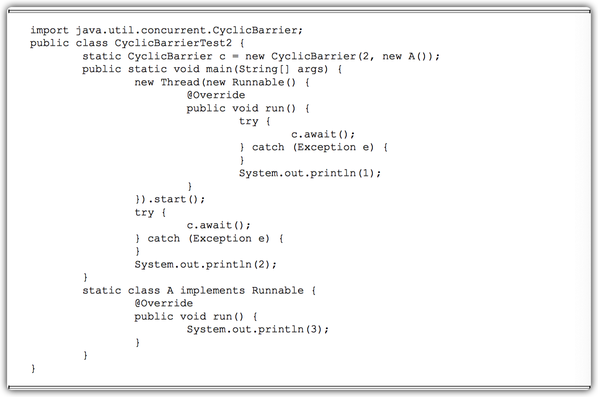

因为CyclicBarrier设置了拦截线程的数量是2，所以必须等代码中的第一个线程和线程A都执行完之后，才会继续执行主线程，然后输出2。


#### CyclicBarrier的应用场景

CyclicBarrier可以用于`多线程计算数据`，`最后合并计算结果的场景`。

例如，用一个Excel保存了用户所有银行流水，每个Sheet保存一个账户近一年的每笔银行流水，现在需要统计用户的日均银行流水，先用多线程处理每个sheet里的银行流水，都执行完之后，得到每个sheet的日均银行流水，最后，再用barrierAction用这些线程的计算结果，计算出整个Excel的日均银行流水。


使用线程池创建4个线程，分别计算每个sheet里的数据，每个sheet计算结果是1，再由BankWaterService线程汇总4个sheet计算出的结果。

#### CyclicBarrier和CountDownLatch的区别

`CountDownLatch的计数器只能使用一次`，而`CyclicBarrier的计数器可以使用reset()方法重置`。所以CyclicBarrier能处理`更为复杂的业务场景`。

例如，如果计算发生错误，可以重置计数器，并让线程重新执行一次。

CyclicBarrier还提供其他有用的方法：

- `getNumberWaiting()`方法可以获得CyclicBarrier`阻塞的线程数量`。
- `isBroken()方法用来了解阻塞的线程是否被中断`。


输出如下所示。


### 控制并发线程数的Semaphore

Semaphore（信号量）是用来`控制同时访问特定资源的线程数量`，它通过协调各个线程，以保证`合理的使用公共资源`。

从字面上很难理解Semaphore所表达的含义，只能把它比作是控制流量的红绿灯。

#### 应用场景

Semaphore可以用于做`流量控制`，特别是`公用资源有限`的应用场景，比如数据库连接。

假如有一个需求，要读取几万个文件的数据，因为都是IO密集型任务，我们可以启动几十个线程并发地读取，但是如果读到内存后，还需要存储到数据库中，而数据库的连接数只有10个，这时我们必须控制只有10个线程同时获取数据库连接保存数据，否则会报错无法获取数据库连接。


在代码中，虽然有30个线程在执行，但是只允许10个并发执行。Semaphore的构造方法 Semaphore(int permits)接受一个整型的数字，表示可用的许可证数量。

Semaphore(10)表示允许10个线程获取许可证，也就是最大并发数是10。Semaphore的用法也很简单。首先线程使用Semaphore的`acquire()方法获取一个许可证`，使用完之后`调用release()方法归还许可证`。还可以用`tryAcquire()方法尝试获取许可证`。

#### 其他方法

Semaphore还提供一些其他方法。

- int availablePermits()：返回此信号量中`当前可用的许可证数`。

- int getQueueLength()：返回`正在等待获取许可证的线程数`。

- boolean hasQueuedThreads()：是否有线程正在等待获取许可证。

- void reducePermits(int reduction)：减少reduction个许可证，是个protected方法。

- Collection getQueuedThreads()：返回所有等待获取许可证的线程集合，是个protected方法。

### 线程间交换数据的Exchanger

Exchanger（交换者）是一个用于`线程间协作的工具类`。Exchanger用于进行`线程间的数据交换`。

它提供一个`同步点`，在这个同步点，`两个线程可以交换彼此的数据`。这两个线程通过`exchange方法`交换数据，如果第一个线程先执行exchange()方法，它会`一直等待`第二个线程也执行exchange方法，当两个线程都到达同步点时，这两个线程就可以交换数据，将本线程生产出来的数据传递给对方。

#### 应用场景

- Exchanger可以用于`遗传算法`，遗传算法里需要`选出两个人作为交配对象，这时候会交换两人的数据，并使用交叉规则得出2个交配结果`。

- Exchanger也可以用于`校对工作`，比如我们需要将纸制银行流水通过人工的方式录入成电子银行流水，为了避免错误，采用AB岗两人进行录入，录入到Excel之后，系统需要加载这两个Excel，并对两个Excel数据进行校对，看看`是否录入一致`。


如果两个线程有一个没有执行exchange()方法，则会一直等待，如果担心有特殊情况发生，避免一直等待，可以使用exchange(V x，longtimeout，TimeUnit unit)`设置最大等待时长`。

## Java中的线程池

Java中的线程池是运用场景最多的并发框架，几乎所有需要异步或并发执行任务的程序都可以使用线程池。在开发过程中，合理地使用线程池能够带来3个好处。

- **降低资源消耗**。通过重复利用已创建的线程降低线程创建和销毁造成的消耗。

- **提高响应速度**。当任务到达时，任务可以不需要等到线程创建就能立即执行。

- **提高线程的可管理性**。线程是稀缺资源，如果无限制地创建，不仅会消耗系统资源，还会降低系统的稳定性，使用线程池可以进行`统一分配`、`调优`和`监控`。

### 线程池的实现原理

当向线程池提交一个任务之后，线程池的主要处理流程，处理流程图如图所示。


1. 线程池判断`核心线程池`里的线程是否都在执行任务。

   - 如果不是，则创建一个新的工作线程来执行任务。
   - 如果核心线程池里的线程都在执行任务，则进入下个流程。

2. 线程池判断`工作队列`是否已经满。

   - 如果工作队列没有满，则将新提交的`任务存储`在这个工作队列里。
   - 如果工作队列满了，则进入下个流程。

3. 线程池判断线程池的线程`是否都处于工作状态`。

   - 如果没有，则`创建一个新的工作线程`来执行任务。

   - 如果已经满了，则交给`饱和策略`来处理这个任务。

     

ThreadPoolExecutor执行`execute()`方法的示意图，如图所示。


ThreadPoolExecutor执行`execute方法`分下面4种情况。

1. 如果`当前运行的线程少于corePoolSize`，则创建新线程来执行任务（注意，执行这一步骤需要`获取全局锁`）。
2. 如果运行的线程等于或多于corePoolSize，则将任务加入`BlockingQueue`。
3. 如果无法将任务加入BlockingQueue（队列已满），则`创建新的线程来处理任务`（注意，执行这一步骤需要获取全局锁）。
4. 如果`创建新线程将使当前运行的线程超出maximumPoolSize，任务将被拒绝`，并调RejectedExecutionHandler.rejectedExecution()方法。

ThreadPoolExecutor采取上述步骤的总体设计思路，是为了在执行execute()方法时，`尽可能地避免获取全局锁`（那将会是一个严重的可伸缩瓶颈）。

在ThreadPoolExecutor完成预热之后 （当前运行的线程数大于等于corePoolSize），几乎所有的execute()方法调用都是执行步骤2，而步骤2不需要获取全局锁。

#### 源码分析


#### 工作线程

`线程池创建线程时，会将线程封装成工作线程Worker`，Worker在`执行完任务后，还会循环获取工作队列里的任务来执行`。我们可以从Worker类的run()方法里看到这点。

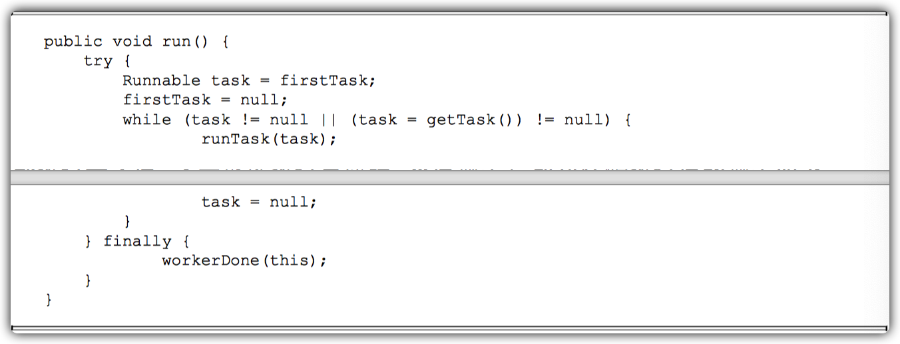

ThreadPoolExecutor中线程执行任务的示意图如图所示。


线程池中的线程执行任务分两种情况，如下。

1. 在execute()方法中创建一个线程时，会让这个线程执行当前任务。
2. 这个线程执行完上图中1的任务后，会反复从`BlockingQueue`获取任务来执行。

### 线程池的使用

#### 线程池的创建

可以通过ThreadPoolExecutor来创建一个线程池。

```java
ThreadPoolExecutor(int corePoolSize, int maximumPoolSize, long keepAliveTime, TimeUnit unit, BlockingQueue<Runnable> workQueue, RejectedExecutionHandler handler)
```

创建一个线程池时需要输入几个参数，如下。

1. corePoolSize（线程池的基本大小）

   ​	当提交一个任务到线程池时，线程池会创建一个线程来执行任务，`即使其他空闲的基本线程能够执行新任务也会创建线程`，`等到需要执行的任务数大于线程池基本大小时就不再创建`。

   ​	如果调用了线程池的prestartAllCoreThreads()方法，线程池会提前创建并启动所有基本线程。

2. runnableTaskQueue（任务队列）

   用于保存等待执行的任务的阻塞队列。可以选择以下几个阻塞队列。

   - ArrayBlockingQueue：是一个基于数组结构的有界阻塞队列，此队列按FIFO（先进先出）原则对元素进行排序。

   - LinkedBlockingQueue：一个基于链表结构的阻塞队列，此队列按FIFO排序元素，`吞吐量通常要高于ArrayBlockingQueue`。

     静态工厂方法Executors.newFixedThreadPool()使用了这个队列。

   - SynchronousQueue：`一个不存储元素的阻塞队列`。每个插入操作必须等到另一个线程调用移除操作，否则插入操作一直处于阻塞状态，`吞吐量通常要高于LinkedBlockingQueue。

     静态工厂方法Executors.newCachedThreadPool使用了这个队列。

   - PriorityBlockingQueue：一个具有优先级的`无限`阻塞队列。

3. maximumPoolSize（线程池最大数量）

   ​	线程池允许创建的最大线程数。如果队列满了，并且已创建的线程数小于最大线程数，则线程池会再创建新的线程执行任务。

   值得注意的是，如果`使用了无界的任务队列这个参数就没什么效果`。

4. ThreadFactory

   ​	用于设置创建线程的工厂，可以通过线程工厂给每个创建出来的线程设 置更有意义的名字。

   ​	使用开源框架guava提供的`ThreadFactoryBuilder`可以快速给线程池里的线程设置有意义的名字。

   ```java
   new ThreadFactoryBuilder().setNameFormat("XX-task-%d").build();
   ```

   

5. RejectedExecutionHandler（饱和策略）

   ​	当队列和线程池都满了，说明线程池处于饱和状

   态，那么必须采取一种策略处理提交的新任务。这个策略默认情况下是AbortPolicy，表示无法处理新任务时抛出异常。

   ​	在JDK 1.5中Java线程池框架提供了以下4种策略。

   - AbortPolicy：直接抛出异常。

   - CallerRunsPolicy：只`用调用者所在线程来运行任务`。

   - DiscardOldestPolicy：`丢弃`队列里最近的一个任务，并执行当前任务。

   - DiscardPolicy：不处理，丢弃掉。

     当然，也可以根据应用场景需要来实现RejectedExecutionHandler接口`自定义策略`。如记录日志或持久化存储不能处理的任务。

6. keepAliveTime（线程活动保持时间）

   ​	线程池的工作线程`空闲后，保持存活的时间`。所以，如果任务很多，并且每个任务执行的时间比较短，可以调大时间，提高线程的利用率。

7. TimeUnit（线程活动保持时间的单位）

   可选的单位有天（DAYS）、小时（HOURS）、分钟（MINUTES）、毫秒（MILLISECONDS）、微秒（MICROSECONDS，千分之一毫秒）和纳秒（NANOSECONDS，千分之一微秒）。

8. ​	

#### 向线程池提交任务

可以使用两个方法向线程池提交任务，分别为`execute()`和`submit()`方法。

##### execute

execute()方法用于提交`不需要返回值的任务`，所以无法判断任务是否被线程池执行成功。 

通过以下代码可知execute()方法输入的任务是一个Runnable类的实例。


##### submit

submit()方法用于提交`需要返回值的任务`。线程池会`返回一个future类型的对象`，通过这个future对象可以判断任务是否执行成功，并且可以通过future的`get()`方法来获取返回值，get()方法会`阻塞当前线程直到任务完成`，而使用get(long timeout，TimeUnit unit)方法则会阻塞当前线程一段时间后立即返回，这时候有可能任务没有执行完。


#### 关闭线程池

可以通过调用线程池的`shutdown`或`shutdownNow`方法来关闭线程池。

它们的原理是遍历线程池中的工作线程，然后逐个调用线程的`interrupt方法`来中断线程，所以`无法响应中断的任务可能永远无法终止`。

shutdownNow首先将线程池的状态设置成`STOP`，然后`尝试停止所有的正在执行或暂停任务的线程，并返回等待执行任务的列表`。

shutdown只是将线程池的状态设置成`SHUTDOWN`状态，然后中断所有`没有正在执行任务`的线程。

只要调用了这两个关闭方法中的任意一个，`isShutdown方法就会返回true`。

当所有的任务都已关闭后，才表示线程池关闭成功，这时调用`isTerminaed方法会返回true`。至于应该调用哪一种方法来关闭线程池，应该由提交到线程池的任务特性决定，通常调用`shutdown`方法来关闭线程池，如果任务不一定要执行完，则可以调用shutdownNow方法。

#### 合理地配置线程池

要想合理地配置线程池，就必须首先分析任务特性，可以从以下几个角度来分析。

- 任务的性质：CPU密集型任务、IO密集型任务和混合型任务。
- 任务的优先级：高、中和低。
- 任务的依赖性：是否依赖其他系统资源，如数据库连接。

性质不同的任务可以用不同规模的线程池分开处理。

- `CPU密集型任务应配置尽可能小的线程`，如配置Ncpu+1个线程的线程池。
- 由于IO密集型任务线程并不是一直在执行任务，则应配置尽可能多的线程，如2*Ncpu。
- 混合型的任务，如果可以拆分，将其拆分成一个CPU密集型任务和一个IO密集型任务，只要这两个任务执行的时间相差不是太大，那么分解后执行的吞吐量将高于串行执行的吞吐量。如果这两个任务执行时间相差太大，则没必要进行分解。
- 可以通过 Runtime.getRuntime().availableProcessors()方法获得当前设备的CPU个数。

`优先级不同的任务`可以使用优先级队列`PriorityBlockingQueue`来处理。它可以让优先级高的任务先执行。如果一直有优先级高的任务提交到队列里，那么优先级低的任务可能永远不能执行。

执行时间不同的任务可以交给不同规模的线程池来处理，或者可以使用优先级队列，让执行时间短的任务先执行。

依赖数据库连接池的任务，因为线程提交SQL后需要等待数据库返回结果，等待的时间越长，则CPU空闲时间就越长，那么线程数应该设置得越大，这样才能更好地利用CPU。

`建议使用有界队列`。有界队列能`增加系统的稳定性和预警能力`，可以根据需要设大一点儿，比如几千。

#### 线程池的监控

如果在系统中大量使用线程池，则有必要对线程池进行`监控`，方便在出现问题时，可以根据线程池的使用状况快速定位问题。

可以通过线程池提供的参数进行监控，在监控线程池的时候可以使用以下属性。

- taskCount：线程池需要执行的任务数量。
- completedTaskCount：线程池在运行过程中已完成的任务数量，小于或等于taskCount。
- largestPoolSize：线程池里曾经创建过的最大线程数量。通过这个数据可以知道线程池是否曾经满过。如该数值等于线程池的最大大小，则表示线程池曾经满过。
- getPoolSize：线程池的线程数量。如果线程池不销毁的话，线程池里的线程不会自动销毁，所以这个大小只增不减。
- getActiveCount：获取活动的线程数。

`通过扩展线程池进行监控`。可以通过`继承线程池来自定义线程池`，重写线程池的`beforeExecute`、`afterExecute`和`terminated`方法，也可以在任务执行前、执行后和线程池关闭前执行一些代码来进行监控。

例如，监控任务的平均执行时间、最大执行时间和最小执行时间等。这几个方法在线程池里是`空方法`。


## Executor框架

在Java中，使用线程来异步执行任务。Java线程的创建与销毁需要一定的开销，如果我们为每一个任务创建一个新线程来执行，这些线程的创建与销毁将消耗大量的计算资源。同时，为每一个任务创建一个新线程来执行，这种策略可能会使处于高负荷状态的应用最终崩溃。

Java的线程既是`工作单元`，也是`执行机制`。从JDK 5开始，把工作单元与执行机制分离开来。工作单元包括`Runnable`和`Callable`，而执行机制由`Executor框架`提供。

### Executor框架简介

#### Executor框架的两级调度模型

在HotSpot VM的线程模型中，Java线程（java.lang.Thread）被一对一映射为`本地操作系统线程`。

Java线程启动时会创建一个本地操作系统线程；当该Java线程终止时，这个操作系统线程也会被回收。操作系统会调度所有线程并将它们分配给可用的CPU。

在上层，Java多线程程序通常把应用分解为若干个任务，然后使用用户级的调度器(Executor框架)将这些任务映射为固定数量的线程；在底层，操作系统内核将这些线程映射到硬件处理器上。这种两级调度模型的示意图如图所示。


从图中可以看出，应用程序通过Executor框架控制上层的调度；而下层的调度由操作系统内核控制，下层的调度不受应用程序的控制。

#### Executor框架的结构与成员

##### Executor框架的结构

Executor框架主要由3大部分组成如下。

- 任务。包括被执行任务需要实现的接口：Runnable接口或Callable接口。
- 任务的执行。包括任务执行机制的核心接口Executor，以及继承自Executor的ExecutorService接口。Executor框架有两个关键类实现了ExecutorService接口（`ThreadPoolExecutor`和`ScheduledThreadPoolExecutor`）。
- 异步计算的结果。包括接口`Future`和实现Future接口的`FutureTask`类。

关于这些类和接口的简介。

- Executor是一个接口，它是Executor框架的基础，它将`任务的提交`与`任务的执行`分离开来。
- ThreadPoolExecutor是`线程池的核心实现类`，用来`执行被提交的任务`。
- ScheduledThreadPoolExecutor是一个实现类，可以在给定的延迟后运行命令，或者定期执行命令。ScheduledThreadPoolExecutor比Timer更灵活，功能更强大。
- Future接口和实现Future接口的FutureTask类，代表`异步计算的结果`。
- Runnable接口和Callable接口的实现类，都可以被ThreadPoolExecutor或ScheduledThreadPoolExecutor执行。

Executor框架的使用示意图如图所示。


### ThreadPoolExecutor详解

Executor框架最核心的类是ThreadPoolExecutor，它是线程池的实现类，主要由下列4个组件构成。

- corePool：核心线程池的大小。
- maximumPool：最大线程池的大小。
- BlockingQueue：用来暂时保存任务的工作队列。
- RejectedExecutionHandler：当ThreadPoolExecutor已经关闭或ThreadPoolExecutor已经饱和时（达到了最大线程池大小且工作队列已满），execute()方法将要调用的Handler。

通过Executor框架的工具类Executors，可以创建3种类型的ThreadPoolExecutor。

- FixedThreadPool。
- SingleThreadExecutor。
- CachedThreadPool。

#### FixedThreadPool详解

FixedThreadPool被称为可重用固定线程数的线程池。下面是FixedThreadPool的源代码实现。


FixedThreadPool的`corePoolSize`和`maximumPoolSize`都被设置为创建FixedThreadPool时指定的参数`nThreads`。

当线程池中的线程数大于corePoolSize时，keepAliveTime为多余的空闲线程等待新任务的最长时间，超过这个时间后多余的线程将被终止。这里把keepAliveTime设置为0L，意味着`多余的空闲线程会被立即终止`。

FixedThreadPool的execute()方法的运行示意图如图所示。


1. 如果当前运行的线程数少于corePoolSize，则创建新线程来执行任务。
2. 在线程池完成预热之后（当前运行的线程数等于corePoolSize），将任务加入 LinkedBlockingQueue。
3. 线程执行完1中的任务后，会在循环中反复从LinkedBlockingQueue获取任务来执行。

FixedThreadPool使用`无界队列`LinkedBlockingQueue作为线程池的工作队列（队列的容量为Integer.MAX_VALUE）。

使用无界队列作为工作队列会对线程池带来如下影响。

1. 当线程池中的线程数达到corePoolSize后，新任务将在无界队列中等待，因此线程池中的线程数不会超过corePoolSize。
2. 由于1，使用无界队列时maximumPoolSize将是一个无效参数。
3. 由于1和2，使用无界队列时keepAliveTime将是一个无效参数。
4. 由于使用无界队列，运行中的FixedThreadPool（未执行方法shutdown()或 shutdownNow()）不会拒绝任务（不会调用RejectedExecutionHandler.rejectedExecution方法）。

#### SingleThreadExecutor详解

SingleThreadExecutor是使用`单个worker线程`的Executor。下面是SingleThreadExecutor的源代码实现。


SingleThreadExecutor的corePoolSize和maximumPoolSize被设置为`1`。`其他参数与FixedThreadPool相同`。SingleThreadExecutor使用无界队列LinkedBlockingQueue作为线程池的工作队列（队列的容量为Integer.MAX_VALUE）。

SingleThreadExecutor使用无界队列作为工作队列对线程池带来的影响与FixedThreadPool相同，这里就不赘述了。

SingleThreadExecutor的运行示意图如图所示。


1. 如果当前运行的线程数少于corePoolSize（即线程池中无运行的线程），则创建一个新线程来执行任务。
2. 在线程池完成预热之后（当前线程池中有一个运行的线程），将任务加入LinkedBlockingQueue。
3. 线程执行完1中的任务后，会在一个无限循环中反复从LinkedBlockingQueue获取任务来执行。

#### CachedThreadPool详解

CachedThreadPool是一个`会根据需要创建新线程的线程池`。下面是创建CachedThreadPool的源代码。


CachedThreadPool的corePoolSize被设置为0，即`corePool为空`；maximumPoolSize被设置为Integer.MAX_VALUE，即`maximumPool是无界的`。这里把keepAliveTime设置为60L，意味着CachedThreadPool中的`空闲线程等待新任务的最长时间为60秒`，空闲线程超过60秒后将会被终止。

FixedThreadPool和SingleThreadExecutor使用无界队列LinkedBlockingQueue作为线程池的工作队列。CachedThreadPool使用`没有容量的SynchronousQueue作为线程池的工作队列`，但CachedThreadPool的maximumPool是无界的。这意味着，如果主线程提交任务的速度高于 maximumPool中线程处理任务的速度时，CachedThreadPool会不断创建新线程。

极端情况下，CachedThreadPool会因为`创建过多线程而耗尽CPU和内存资源`。

CachedThreadPool的execute()方法的执行示意图如图所示。


1. 首先执行SynchronousQueue.offer(Runnable task)。如果当前maximumPool中有空闲线程正在执行SynchronousQueue.poll(keepAliveTime，TimeUnit.NANOSECONDS)，那么主线程执行offer操作与空闲线程执行的poll操作配对成功，主线程把任务交给空闲线程执行，execute()方法执行完成；否则执行下面的步骤2）。
2. 当初始maximumPool为空，或者maximumPool中当前没有空闲线程时，将没有线程执行SynchronousQueue.poll(keepAliveTime，TimeUnit.NANOSECONDS)。这种情况下，步骤1将失败。此时CachedThreadPool会创建一个新线程执行任务，execute()方法执行完成。
3. 在步骤2中新创建的线程将任务执行完后，会执行 SynchronousQueue.poll(keepAliveTime，TimeUnit.NANOSECONDS)。这个poll操作会让空闲线程最多在SynchronousQueue中等待60秒钟。如果60秒钟内主线程提交了一个新任务（主线程执 行步骤1）），那么这个空闲线程将执行主线程提交的新任务；否则，这个空闲线程将终止。由于空闲60秒的空闲线程会被终止，因此长时间保持空闲的CachedThreadPool不会使用任何资源。

SynchronousQueue是一个`没有容量的阻塞队列`。每个插入操作必须等待另一个线程的对应移除操作，反之亦然。CachedThreadPool使用SynchronousQueue，把主线程提交的任务传递给空闲线程执行。CachedThreadPool中任务传递的示意图如图所示。


### ScheduledThreadPoolExecutor详解

ScheduledThreadPoolExecutor继承自ThreadPoolExecutor。它主要用来`在给定的延迟之后运行任务`，或者`定期执行任务`。ScheduledThreadPoolExecutor的功能与Timer类似，但 ScheduledThreadPoolExecutor功能更强大、更灵活。

Timer对应的是`单个后台线程`，而ScheduledThreadPoolExecutor可以在构造函数中`指定多个对应的后台线程数`。

#### ScheduledThreadPoolExecutor的运行机制

ScheduledThreadPoolExecutor的执行示意图（基于JDK 6）如所示。


`DelayQueue是一个无界队列`，所以ThreadPoolExecutor的maximumPoolSize在ScheduledThreadPoolExecutor中没有什么意义（设置maximumPoolSize的大小没有什么效果）。

ScheduledThreadPoolExecutor的执行主要分为两大部分。

1. 当调用ScheduledThreadPoolExecutor的`scheduleAtFixedRate()`方法或者`scheduleWithFixedDelay()`方法时，会向ScheduledThreadPoolExecutor的DelayQueue添加一个实现了RunnableScheduledFuture接口的`ScheduledFutureTask`。
2. 线程池中的线程从DelayQueue中获取ScheduledFutureTask，然后执行任务。

ScheduledThreadPoolExecutor为了`实现周期性的执行任务`，对ThreadPoolExecutor做了如下的修改。

- 使用DelayQueue作为任务队列。
- 获取任务的方式不同。
- 执行周期任务后，增加了额外的处理。

#### ScheduledThreadPoolExecutor的实现

ScheduledThreadPoolExecutor会把待调度的任务(ScheduledFutureTask)放到一个DelayQueue中。

ScheduledFutureTask主要包含3个成员变量，如下。

- long型成员变量time，表示这个任务`将要被执行的具体时间`。
- long型成员变量sequenceNumber，表示这个任务被添加到ScheduledThreadPoolExecutor中的`序号`。
- long型成员变量period，表示任务执行的`间隔周期`。

DelayQueue封装了一个`PriorityQueue`，这个PriorityQueue会对队列中的ScheduledFutureTask`进行排序`。排序时，time小的排在前面（时间早的任务将被先执行）。如果两个ScheduledFutureTask的time相同，就比较sequenceNumber，sequenceNumber小的排在前面（也就是说，`如果两个任务的执行时间相同，那么先提交的任务将被先执行`）。

图是ScheduledThreadPoolExecutor中的线程1`执行某个周期任务`的4个步骤。


1. 线程1从DelayQueue中获取已到期的ScheduledFutureTask(DelayQueue.take())。到期任务是指ScheduledFutureTask的time大于等于当前时间。
2. 线程1执行这个ScheduledFutureTask。
3. 线程1修改ScheduledFutureTask的time变量为下次将要被执行的时间。
4. 线程1把这个修改time之后的ScheduledFutureTask放回DelayQueue中（DelayQueue.add()）。

分析获取任务的过程。下面是DelayQueue.take()方法的源代码实现。


下图是DelayQueue.take()的执行示意图。


1. 获取Lock。
2. 获取周期任务。
   - 如果PriorityQueue为空，当前线程到Condition中等待；否则执行下面的2.2。
   - 如果PriorityQueue的头元素的time时间比当前时间大，到Condition中等待到time时间；否则执行下面的2.3。
   - 获取PriorityQueue的头元素（2.3.1）；如果PriorityQueue不为空，则唤醒在Condition中等待的所有线程（2.3.2）。
3. 释放Lock。

ScheduledThreadPoolExecutor在一个循环中执行步骤2，直到线程从PriorityQueue获取到一个元素之后（执行2.3.1之后），才会退出无限循环（结束步骤2）。

分析ScheduledThreadPoolExecutor中的线程执行任务的步骤4，把 ScheduledFutureTask放入DelayQueue中的过程。下面是DelayQueue.add()的源代码实现。


图是DelayQueue.add()的执行示意图。


1. 获取Lock。
2. 添加任务。
   - 向PriorityQueue添加任务。
   - 如果在上面2.1中添加的任务是PriorityQueue的头元素，唤醒在Condition中等待的所有线程。
3. 释放Lock。

### FutureTask详解

`Future接口`和实现Future接口的`FutureTask类`，代表`异步计算的结果`。

#### FutureTask简介

FutureTask除了实现Future接口外，还实现了Runnable接口。因此，FutureTask可以交给Executor执行，也可以由调用线程直接执行（FutureTask.run()）。根据FutureTask.run()方法被执行的时机，FutureTask可以处于下面3种状态。

- `未启动`。FutureTask.run()方法还没有被执行之前，FutureTask处于未启动状态。当创建一个FutureTask，且没有执行FutureTask.run()方法之前，这个FutureTask处于未启动状态。
- `已启动`。FutureTask.run()方法被执行的过程中，FutureTask处于已启动状态。
- `已完成`。FutureTask.run()方法执行完后正常结束，或被取消(FutureTask.cancel(…))，或执行FutureTask.run()方法时抛出异常而异常结束，FutureTask处于已完成状态。

图是FutureTask的状态迁移的示意图。


- 当FutureTask处于未启动或已启动状态时，执行FutureTask.get()方法将导致调用线程阻塞。
- 当FutureTask处于已完成状态时，执行FutureTask.get()方法将导致调用线程`立即返回结果`或`抛出异常`。
- 当FutureTask处于未启动状态时，执行FutureTask.cancel()方法将导致此任务`永远不会被执行`。
- 当FutureTask处于已启动状态时，执行FutureTask.cancel(true)方法将以`中断执行此任务线程`的方式来试图停止任务；
- 当FutureTask处于已启动状态时，执行FutureTask.cancel(false)方法将不会对正在执行此任务的线程产生影响（让正在执行的任务运行完成）。
- 当FutureTask处于已完成状态时，执行FutureTask.cancel(…)方法将`返回false`。

图是get方法和cancel方法的执行示意图。


#### FutureTask的使用

- 可以把FutureTask交给Executor执行。
- 可以通过ExecutorService.submit(…)方法返回一个FutureTask，然后执行FutureTask.get()方法或FutureTask.cancel(…)方法。
- 可以单独使用FutureTask。

当一个线程需要等待另一个线程把某个任务执行完后它才能继续执行，此时可以使用FutureTask。假设有多个线程执行若干任务，每个任务最多只能被执行一次。当多个线程试图同时执行同一个任务时，只允许一个线程执行任务，其他线程需要等待这个任务执行完后才能继续执行。

下面是对应的示例代码。


上述代码的执行示意图如图所示。


当两个线程试图`同时执行同一个任务`时，如果Thread1执行1.3后Thread2执行2.1，那么接下来Thread2将在2.2等待，直到Thread1执行完1.4后Thread2才能从2.2(FutureTask.get())返回。

#### FutureTask的实现

FutureTask的实现基于AbstractQueuedSynchronizer(以下简称为AQS)。java.util.concurrent中的很多可阻塞类（比如ReentrantLock）都是基于AQS来实现的。AQS是一个同步框架，它提供`通用机制来原子性管理同步状态、阻塞和唤醒线程`，以及`维护被阻塞线程的队列`。

JDK6中AQS被广泛使用，基于AQS实现的同步器包括：ReentrantLock、Semaphore、ReentrantReadWriteLock、CountDownLatch和FutureTask。

每一个基于AQS实现的同步器都会包含两种类型的操作，如下。

- 至少一个`acquire`操作。这个操作阻塞调用线程，除非/直到AQS的状态允许这个线程继续执行。FutureTask的acquire操作为get()/get(long timeout，TimeUnit unit)方法调用。
- 至少一个`release`操作。这个操作改变AQS的状态，改变后的状态可允许一个或多个阻塞线程被解除阻塞。FutureTask的release操作包括run()方法和cancel(…)方法。

基于`复合优先于继承`的原则，FutureTask声明了一个内部私有的继承于AQS的子类Sync，对FutureTask所有公有方法的调用都会委托给这个内部子类。

FutureTask的设计示意图如图所示。


如图所示，Sync是FutureTask的内部私有类，它继承自AQS。创建FutureTask时会创建内部私有的成员对象Sync，FutureTask所有的的公有方法都直接委托给了内部私有的Sync。

FutureTask.get()方法调用AQS.acquireSharedInterruptibly(int arg)方法，方法的执行过程如下。

1. 调用AQS.acquireSharedInterruptibly(int arg)方法，这个方法首先会回调在子类Sync中实现的tryAcquireShared()方法来判断acquire操作是否可以成功。acquire操作可以成功的条件为：state为执行完成状态RAN或已取消状态CANCELLED，且runner不为null。
2. 如果成功则get()方法立即返回。如果失败则到线程等待队列中去等待其他线程执行release操作。
3. 当其他线程执行release操作（比如FutureTask.run()或FutureTask.cancel(…)）唤醒当前线程后，当前线程再次执行tryAcquireShared()将返回正值1，当前线程将离开线程等待队列并唤醒它的后继线程（这里会产生级联唤醒的效果）。
4. 最后返回计算的结果或抛出异常。


FutureTask.run()的执行过程如下。

1. 执行在构造函数中指定的任务(Callable.call())。
2. 以原子方式来更新同步状态（调用AQS.compareAndSetState(int expect，int update)，设置state为执行完成状态RAN）。如果这个原子操作成功，就设置代表计算结果的变量result的值为 Callable.call()的返回值，然后调用AQS.releaseShared(int arg)。
3. AQS.releaseShared(int arg)首先会回调在子类Sync中实现的tryReleaseShared(arg)来执行release操作（设置运行任务的线程runner为null，然会返回true）；AQS.releaseShared(int arg)，然后唤醒线程等待队列中的第一个线程。
4. 调用FutureTask.done()。

当执行FutureTask.get()方法时，如果FutureTask不是处于执行完成状态RAN或已取消状态CANCELLED，当前执行线程将到AQS的线程等待队列中等待（见下图的线程A、B、C和D）。当某个线程执行FutureTask.run()方法或FutureTask.cancel(...)方法时，会唤醒线程等待队列的第一个线程（见图所示的线程E唤醒线程A）。


假设开始时FutureTask处于未启动状态或已启动状态，等待队列中已经有3个线程（A、B和 C）在等待。此时，线程D执行get()方法将导致线程D也到等待队列中去等待。

当线程E执行run()方法时，会`唤醒队列中的第一个线程`A。线程A被唤醒后，首先把自己从队列中删除，然后唤醒它的后继线程B，最后线程A从get()方法返回。线程B、C和D重复A线程的处理流程。最终，在队列中等待的所有线程都被`级联唤醒`并从get()方法返回。

## Java并发编程实践

### 生产者和消费者模式

在并发编程中使用生产者和消费者模式能够解决绝大多数并发问题。该模式通过`平衡生产线程和消费线程的工作能力来提高程序整体处理数据的速度`。

在线程世界里，生产者就是生产数据的线程，消费者就是消费数据的线程。

在多线程开发中，如果生产者处理速度很快，而消费者处理速度很慢，那么生产者就必须等待消费者处理完，才能继续生产数据。同样的道理，如果消费者的处理能力大于生产者，那么消费者就必须等待生产者。为了解决这种生产消费能力不均衡的问题，便有了生产者和消费者模式。

#### 什么是生产者和消费者模式

生产者和消费者模式是`通过一个容器来解决生产者和消费者的强耦合问题`。生产者和消费者彼此之间`不直接通信`，而是通过`阻塞队列`来进行通信，所以生产者生产完数据之后不用等待消费者处理，直接扔给阻塞队列，消费者不找生产者要数据，而是直接从阻塞队列里取，`阻塞队列就相当于一个缓冲区`，平衡了生产者和消费者的处理能力。

这个阻塞队列就是用来给生产者和消费者解耦的。纵观大多数设计模式，都会找一个第三者出来进行解耦，如工厂模式的第三者是工厂类，模板模式的第三者是模板类。

#### 生产者消费者模式实战

#### 多生产者和多消费者场景

在多核时代，多线程并发处理速度比单线程处理速度更快，所以可以使用多个线程来生产数据，同样可以使用多个消费线程来消费数据。而更复杂的情况是，消费者消费的数据，有可能需要继续处理，于是消费者处理完数据之后，它又要作为生产者把数据放在新的队列里，交给其他消费者继续处理，如图所示。


我们在一个`长连接服务器`中使用了这种模式，生产者1负责将所有客户端发送的消息存放在阻塞队列1里，消费者1从队列里读消息，然后通过消息ID进行散列得到N个队列中的一个，然后根据编号将消息存放在到不同的队列里，每个阻塞队列会分配一个线程来消费阻塞队列里的数据。如果消费者2无法消费消息，就将消息再`抛回`到阻塞队列1中，交给其他消费者处理。

以下是消息总队列的代码。


启动一个消息分发线程。在这个线程里子队列自动去总队列里获取消息。


使用散列（hash）算法获取一个子队列，代码如下。


使用的时候，只需要往总队列里发消息。


#### 线程池与生产消费者模式

Java中的线程池类其实就是一种生产者和消费者模式的实现方式，但是我觉得其实现方式更加高明。生产者把任务丢给线程池，线程池创建线程并处理任务，如果`将要运行的任务数大于线程池的基本线程数就把任务扔到阻塞队列里`，这种做法比只使用一个阻塞队列来实现生产者和消费者模式显然要高明很多，因为消费者能够处理直接就处理掉了，这样速度更快，而生产者先存，消费者再取这种方式显然慢一些。

我们的系统也可以使用线程池来实现多生产者和消费者模式。例如，创建N个不同规模的 Java线程池来处理不同性质的任务，比如线程池1将数据读到内存之后，交给线程池2里的线程 继续处理压缩数据。线程池1主要处理IO密集型任务，线程池2主要处理CPU密集型任务。

### 线上问题定位

有时候，有很多问题只有在线上或者预发环境才能发现，而线上又不能调试代码，所以线上问题定位就只能`看日志`、`系统状态`和`dump线程`。

#### TOP命令查看每个进程的情况

在Linux命令行下使用TOP命令查看每个进程的情况，显示如下。


我们的程序是Java应用，所以只需要关注COMMAND是Java的性能数据，COMMAND表示启动当前进程的命令，在Java进程这一行里可以看到CPU利用率是300%，不用担心，这个是当前机器所有核加在一起的CPU利用率。

#### top的交互命令数字1查看每个CPU的性能数据

使用top的交互命令数字1查看每个CPU的性能数据。

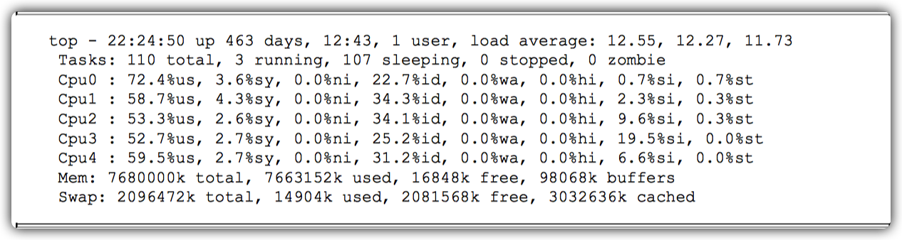

命令行显示了CPU4，说明这是一个5核的虚拟机，平均每个CPU利用率在60%以上。如果这里显示CPU利用率100%，则很有可能程序里写了一个死循环。


#### 使用top的交互命令H查看每个线程的性能信息


在这里可能会出现3种情况。

1. 第一种情况，某个线程CPU利用率一直100%，则说明是这个线程有可能有死循环，那么请记住这个`PID`。
2. 第二种情况，某个线程一直在TOP10的位置，这说明这个线程可能有性能问题。
3. 第三种情况，CPU利用率高的几个线程在不停变化，说明并不是由某一个线程导致CPU偏高。

如果是第一种情况，也有可能是GC造成，可以用jstat命令看一下GC情况，看看是不是因为持久代或年老代满了，产生FullGC，导致CPU利用率持续飙高，命令和回显如下。


还可以把线程dump下来，看看究竟是哪个线程、执行什么代码造成的CPU利用率高。执行以下命令，把线程dump到文件dump17里。执行如下命令。

```shell
sudo -u admin /opt/taobao/java/bin/jstack 31177 > /home/root/dump17
```

dump出来内容的类似下面内容。


dump出来的线程ID（nid）是十六进制的，而我们用TOP命令看到的线程ID是十进制的，所以要用printf命令转换一下进制。然后用十六进制的ID去dump里找到对应的线程。


输出：7b46。

### 性能测试

#### 思路

- 了解需要达到的QPS。
- 根据单机能接受1000QPS的基础进行集群搭建。
- 测试并观察。
- 升级CPU、内存、硬盘等硬件瓶颈。
- 优化SQL、网络、算法等软件瓶颈。

#### 性能测试中使用的其他命令

##### 查看网络流量


##### 查看系统平均负载


##### 查看系统内存情况


##### 查看CPU的利用率


### 异步任务池

Java中的线程池设计得非常巧妙，可以高效并发执行多个任务，但是在某些场景下需要对线程池进行扩展才能更好地服务于系统。

例如，如果一个任务仍进线程池之后，运行线程池的程序重启了，那么线程池里的任务就会丢失。另外，线程池只能处理本机的任务，在集群环境下不能有效地调度所有机器的任务。所以，需要结合线程池开发一个`异步任务处理池`。


任务池的主要处理流程是，每台机器会启动一个任务池，每个任务池里有多个线程池，当某台机器将一个任务交给任务池后，任务池会先将这个任务保存到数据中，然后某台机器上的任务池会从数据库中获取待执行的任务，再执行这个任务。

每个任务有几种状态，分别是创建（NEW）、执行中（EXECUTING）、RETRY（重试）、挂起 （SUSPEND）、中止（TEMINER）和执行完成（FINISH）。

- 创建：提交给任务池之后的状态。
- 执行中：任务池从数据库中拿到任务执行时的状态。
- 重试：当执行任务时出现错误，程序显式地告诉任务池这个任务需要重试，并设置下一次 执行时间。
- 挂起：当一个任务的执行`依赖于其他任务完成`时，可以将这个任务挂起，当收到消息后，再开始执行。
- 中止：任务执行失败，让任务池停止执行这个任务，并设置错误消息告诉调用端。
- 执行完成：任务执行结束。

`任务池的任务隔离`。异步任务有很多种类型，比如抓取网页任务、同步数据任务等，不同类型的任务优先级不一样，但是系统资源是有限的，如果低优先级的任务非常多，高优先级的任务就可能得不到执行，所以必须对任务进行隔离执行。`使用不同的线程池处理不同的任务`，或者不同的线程池处理不同优先级的任务，`如果任务类型非常少，建议用任务类型来隔离，如果任务类型非常多，比如几十个，建议采用优先级的方式来隔离`。

`任务池的重试策略`。根据不同的任务类型设置不同的重试策略，有的任务对实时性要求高，那么每次的重试间隔就会非常短，如果对实时性要求不高，可以采用默认的重试策略，重试间隔随着次数的增加，时间不断增长，比如间隔几秒、几分钟到几小时。`每个任务类型可以设置执行该任务类型线程池的最小和最大线程数、最大重试次数`。

`使用任务池的注意事项`。任务必须`无状态`：任务不能在执行任务的机器中保存数据，比如某个任务是处理上传的文件，任务的属性里有文件的上传路径，如果文件上传到机器1，机器2获取到了任务则会处理失败，所以上传的文件必须存在其他的集群里，比如OSS或SFTP。

`异步任务的属性`。包括`任务名称`、`下次执行时间`、`已执行次数`、`任务类型`、`任务优先级`和`执行时的报错信息`（用于快速定位问题）。

