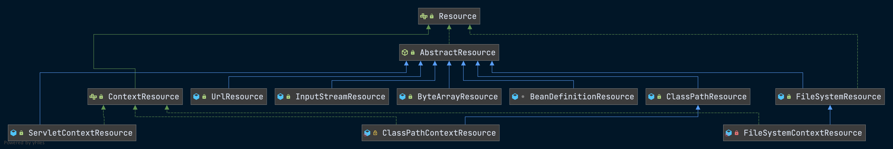
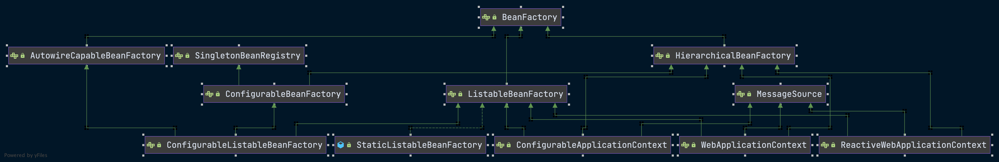
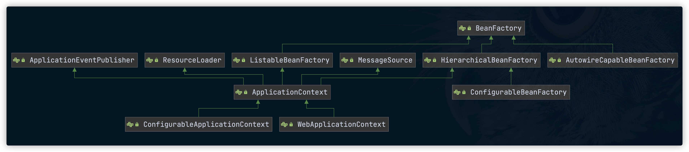
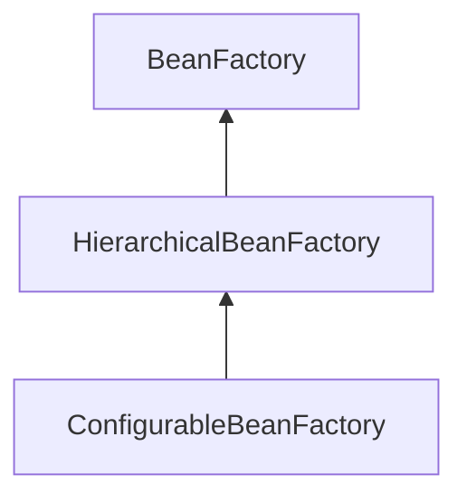
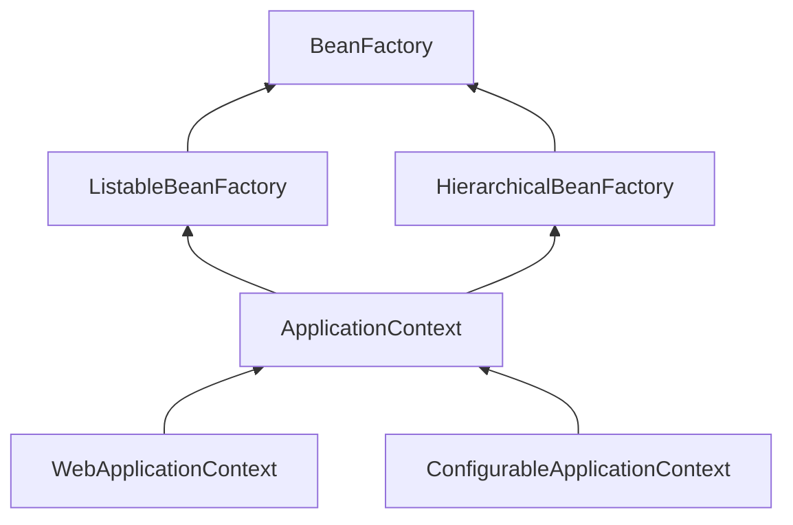
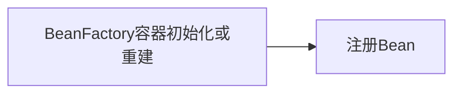
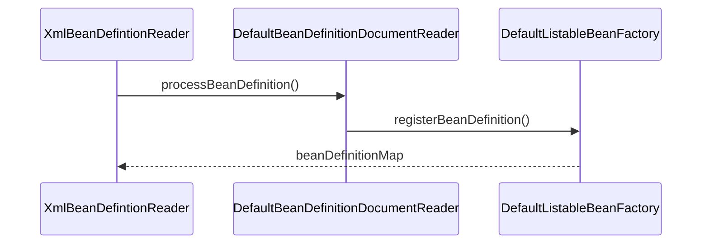
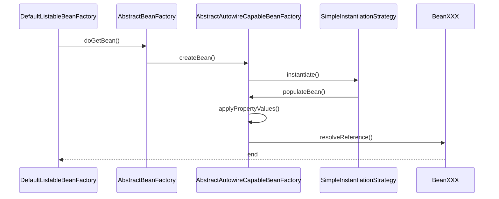
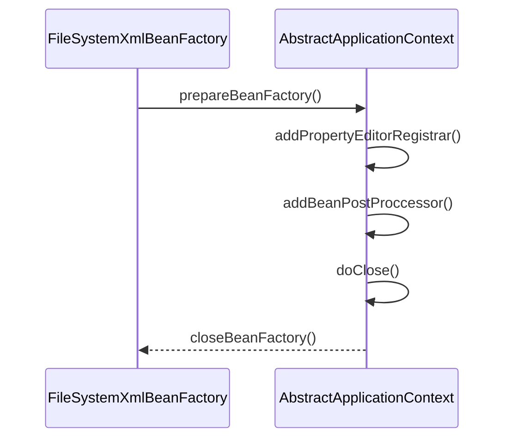

# IoC容器的实现

>Inversion of Control，控制反转。

## IoC容器概述

### IoC容器和依赖反转模式

- 相对于**控制反转**这个名称，更合适的叫法就是**依赖注入**。
- 由**具体对象来管理和维护合作对象的引用和依赖关系**的话，会导致代码的高度耦合及较低的可测试性。
- 在面向对象系统中，对象封装了数据和对数据的处理过程，对象的依赖关系常常体现在对**数据**和**方法**的依赖上。
- 把**控制权从具体业务对象手中转交到平台或者框架中**，是降低面向对象系统设计复杂性和提高面向对象系统可测试性的一个有效的解决方案。
- `IoC`是`Spring`框架的核心。
- 通过使用`IoC`容器，对象依赖关系的管理被反转了，转到`IoC`容器中来了，对象之间的相互依赖关系由`IoC`容器进行管理，并由`Ioc`容器完成对象的注入。

### Spring IoC对比EJB

- Spring IoC提供了一个**基本的JavaBean容器**，通过IoC模式**管理依赖关系**，并通过**依赖注入**和**AOP切面增强**了为JavaBean这样的POJO对象赋予事务管理、生命周期管理等基本功能。
- 对于EJB，一个简单的EJB组件需要编写远程/本地接口、Home接口以及Bean的实现类，而且EJB运行是不能脱离EJB容器的，查找其他EJB组件也需要通过诸如JNDI这样的方式。
- Spring把EJB组件还原成了POJO对象或者JavaBean对象，降低了应用开发对传统J2EE技术规范的依赖。

### Spring的注入实现

- 接口注入。
- **setter注入**。
- 构造器注入。

## IoC容器系列的设计与实现

>BeanFactory 和 ApplicationContext。

- `BeanFactory`—— 简单容器系列，只实现了容器的最基本功能。是作为最基本的接口类出现在Spring的IoC容器体系中的。
- `ApplicationContext`——  应用上下文，它作为容器的**高级形态**而存在。
- Spring通过定义`BeanDefinition`来管理基于Spring的应用中的**各种对象以及它们之间的相互依赖关系**。

### IoC容器系列

#### IoC容器系列结构概况





### IoC容器的设计



#### ConfigurableBeanFactory接口关系




- `BeanFactory`定义了IoC容器的基础规范。包含从IoC容器中获取到Bean的`getBean()`这样的基础方法。

- `HierarchicalBeanFactory`增加了`getParentBeanFactory()`的接口功能，使BeanFactory具备了**双亲IoC容器的管理功能**。

- `ConfigurableBeanFactory`主要定义了一些对BeanFactory的配置功能，比如通过`setParentBeanFactory()`设置双亲IoC容器，通过`addBeanPostProcessor()`配置Bean后置处理器。

#### ApplicationContext接口关系




- 在这个接口体系中，`ListableBeanFactory`和`HierarchicalBeanFactory`两个接口，**连接** `BeanFactory`接口定义和`ApplicationConext`应用上下文的接口定义。
- 在`ListableBeanFactory`接口中，**细化了许多BeanFactory的接口功能**，比如定义了`getBeanDefinitionNames()`接口方法。
- 对于`ApplicationContext`接口，它通过继承`MessageSource`、`ResourceLoader`、`ApplicationEventPublisher`接口，在BeanFactory简单IoC容器的基础上**添加了许多对高级容器的特性的支持**。

- 这个接口系统是以`BeanFactory`和`ApplicationContext`为核心的。
- `BeanFactory`实现是IoC容器的**基本形式**，而各种`ApplicationContext`的实现是IoC容器的**高级表现形式**。
- `DefaultListableBeanFactory`实际上包含了基本IoC容器所具有的重要功能，也是在很多地方都会用到的容器系列中的一个基本产品。
- 在Spring中，实际上是把`DefaultListableBeanFactory`作为一个**默认的功能完整的IoC容器**来使用的。

#### BeanFactory应用场景及常用方法

- BeanFactory提供的是最基本的IoC容器的功能。

- 用户使用容器时，可以使用转义符`＆`来得到FactoryBean本身，用来区分通过容器来获取FactoryBean产生的对象和获取FactoryBean本身。

- `containsBean()`

  够判断容器是否**含有指定名字的Bean**。

- `isSingleton()`

  查询指定名字的Bean**是否是Singleton类型的**Bean。对于Singleton属性，用户可以在`BeanDefinition`中指定。

- `isPrototype()`

  来查询指定名字的Bean**是否是prototype类型的**。与Singleton属性一样，这个属性也可以由用户在BeanDefinition中指定。

- `isTypeMatch()`

  查询指定了名字的Bean的Class类型是否是特定的Class类型。这个Class类型可以由用户来指定。

- `getType()`

  查询指定名字的Bean的Class类型。

- `getAliases()`

  查询指定了名字的Bean的所有别名，这些别名都是用户在BeanDefinition中定义的。

#### BeanFactory和FactoryBean

!>  经典问题

##### BeanFactory

- `BeanFactory`是所有Spring Bean的容器根接口，给Spring 的容器定义一套规范，给IOC容器提供了一套完整的规范。

- `BeanFactory`是**Factory**，被称为**IoC容器**或**对象工厂**。
- Spring中Bean都是由`BeanFactory`（也就是IoC容器）来进行管理的。
- `BeanFactory`接口设计了`getBean`方法，这个方法是使用IoC容器API的主要方法，通过这个方法，可以取得IoC容器中管理的Bean，Bean的取得是通过指定名字来索引的。

##### FactoryBean

- `FactoryBean`是**Bean**，该类是SpringIOC容器是**创建Bean的一种形式**，这种方式创建Bean会有加成方式，融合了简单的**工厂设计模式**和**装饰器模式**。
- 可以通过`FactoryBean`获取一个特定类型的Bean实例，并且隐藏了内部的构造细节。
- 提供了三个方法
  - `getObject()`——返回实例。
  - `getObjectType()`——返回该装饰对象的Bean的类型。
  - `isSingleton()`——判断Bean是否为单例。

#### Ioc容器实现的关键类

- `Resource`——定义封装了各种资源。
- `DefaultListableBeanFactory`——默认具有完整功能的IoC容器。
- `BeanDefinitionReader`——Bean定义的解析器。

#### 编程式的Ioc容器

- 创建IoC配置文件的抽象资源，即`Resource`抽象资源，这个抽象资源包括了`BeanDefinition`的定义信息。
- 创建一个`BeanFactory`，可以使用`DeafultListableBeanFactory`。
- 创建一个载入`BeanDefinition`的读取器。

```java
ClassPathResource res = new ClassPathResource("bean.xml");
DefaultListableBeanFactory factory = new DefaultListableBeanFactory();
XmlBeanDefinitionReader reader = new XmlBeanDefinitionReader(factory);
reader.loadBeanDefinitions(res);
```

#### ApplicationContext的应用场景

**提供的高级功能**

- **支持不同的信息源**。我们看到`ApplicationContext`扩展了`MessageSource`接口，这些信息源的扩展功能可以**支持国际化**的实现，为开发多语言版本的应用提供服务。
- **访问资源**。这一特性体现在对`ResourceLoader`和`Resource`的支持上，这样我们可以从不同地方得到Bean定义资源。
- **支持应用事件**。继承了接口`ApplicationEventPublisher`，从而在上下文中引入了事件机制。这些事件和Bean的生命周期的结合为Bean的管理提供了便利。

#### ApplicationContext容器的设计原理

以FileSystemXmlApplicationContext为例。

- `ApplicationContext`应用上下文的主要功能已经在`FileSystemXmlApplicationContext`的基类`AbstractXmlApplicationContext`中实现了。
- 在`FileSystemXmlApplicationContext`中，作为一个具体的应用上下文，只需要实现和它自身设计相关的两个功能。
  - 如果应用直接使用`FileSystemXmlApplicationContext`，对于实例化这个应用上下文的支持，同时启动IoC容器的`refresh()`过程。
  - 从文件系统中加载XML的Bean定义资源。


### IoC容器的初始化过程

>refresh()方法的基本过程主要包括BeanDefinition的Resource定位、载入、注册。Spring把这三个过程分开，并使用不同的模块来完成。


#### Resource资源定位

##### 基础概念

- `BeanDefinition`的资源定位，它由`ResourceLoader`通过统一的`Resource`接口来完成，这个`Resource`对各种形式的`BeanDefinition`的使用都提供了统一接口。
- 这个定位过程类似于**容器寻找数据**的过程，可以从文件系统中、类路径中寻找。
- Spring通过`BeanDefinitionReader`来对这些信息进行处理。
- `ApplicationContext`中，Spring已经为我们提供了一系列加载不同`Resource`的读取器的实现，而`DefaultListableBeanFactory`只是一个纯粹的IoC容器，需要为它配置特定的读取器才能完成这些功能。
- `DefaultListableBeanFactory`这种更底层的容器，能**提高定制IoC容器的灵活性**。

##### Resource的继承关系


##### 资源定位流程

!>以DefaultListableBeanFactory为例。

- 定义一个`Resource`来定位容器使用的`BeanDefinition`。

- `ClassPathResource`，意味着Spring会在**类路径中去寻找以文件形式存在的BeanDefinition信息**。

  ```java
  ClassPathResource res = new ClassPathResource("beans.xml");
  ```

- FileSystemXMLApplicationContext的继承体系


- `FileSystemXmlApplicationContext`已经通过继承`AbstractApplicationContext`具备了`ResourceLoader`读入以Resource定义的BeanDefinition的能力，因为`AbstractApplicationContext`的基类是**`DefaultResourceLoader`**。

- `BeanDefinitionReader.loadBeanDefintion()`采用了模板模式，具体的定位实现实际上是由各个子类来完成的。

- **getResourceByPath**流程

  

  - `AbstractRefreshableApplicationContext`的`refreshBeanFactory`方法的实现被`FileSystemXmlApplicationContext`构造函数中的`refresh()`调用。
  - 通过`createBeanFactroy()`构建了一个IoC容器`DefaultListableBeanFactory`供`ApplicationContext`使用。
  - `DefaultListableBeanFactory`启动了`loadBeanDefinitions()`来载入`BeanDefinition`。

- AbstractRefreshableApplicationContext对容器的初始化

  ```java
  @Override
  protected final void refreshBeanFactory() throws BeansException {
    // 如果已经存在BeanFactory，关闭当前的BeanFactory
    if (hasBeanFactory()) {
      destroyBeans();
      closeBeanFactory();
    }
    try {
  		// 创建并设置持有的DefaultListableBeanFactory的地方同时调用
      DefaultListableBeanFactory beanFactory = createBeanFactory();
      beanFactory.setSerializationId(getId());
      customizeBeanFactory(beanFactory);
      // loadBeanDefinitions载入BeanDefinition的信息
      loadBeanDefinitions(beanFactory);
      synchronized (this.beanFactoryMonitor) {
        this.beanFactory = beanFactory;
      }
    }
    catch (IOException ex) {
      throw new ApplicationContextException("I/O error parsing bean definition source for " + getDisplayName(), ex);
    }
  }
  ```

- FileSystemXmlApplicationContext生成FileSystemResource对象

  ```java
  @Override
  protected Resource getResourceByPath(String path) {
    if (path.startsWith("/")) {
      path = path.substring(1);
    }
    return new FileSystemResource(path);
  }
  ```

#### BeanDefinition载入、解析

##### 概述

- `BeanDefinition`，实际上就是**POJO对象在IoC容器中的抽象**，载入过程的任务是**把定义的BeanDefinition在IoC容器中转化成一个Spring内部表示的数据结构**。
- IoC容器对Bean的**管理**和**依赖注入**功能的实现，是通过对其持有的`BeanDefinition`进行各种相关操作来完成的。
- `BeanDefinition`数据在IoC容器中通过一个`HashMap`来**保持**和**维护**。
- Bean相关定义的数据结构可以以`AbstractBeanDefinition`为入口，让IoC容器执行索引、查询和操作。


##### 容器初始化流程分析

>以DefaultListableBeanFactory为例。




- 容器的`refresh()`方法，是载入`BeanDefinition`的入口，涵盖了整个`ApplicationContext`的初始化过程。

- `refresh()`方法分析

  !> 经典问题

  ```java
  @Override
  public void refresh() throws BeansException, IllegalStateException {
    synchronized (this.startupShutdownMonitor) {
      // Prepare this context for refreshing.
      prepareRefresh();
  
      // 在子类中启动refreshBeanFactory()的地方
      ConfigurableListableBeanFactory beanFactory = obtainFreshBeanFactory();
  
      // Prepare the bean factory for use in this context.
      prepareBeanFactory(beanFactory);
  
      try {
        // 设置BeanFactory的后置处理器
        postProcessBeanFactory(beanFactory);
  
        // 调用BeanFactory的后置处理器，这些处理器是在Bean定义中向容器中注册过的
        invokeBeanFactoryPostProcessors(beanFactory);
  
        // 注册Bean的后置处理器，在Bean创建过程中调用。
        registerBeanPostProcessors(beanFactory);
  
        // 对上下文中的消息源进行初始化
        initMessageSource();
  
        // 初始化上下文中的时间机制
        initApplicationEventMulticaster();
  
        // 初始化其他特殊的Bean
        onRefresh();
  
        // 检查监听Bean并且注册到容器中
        registerListeners();
  
        // 实例化所有非延迟加载的Bean
        finishBeanFactoryInitialization(beanFactory);
  
        // 发布容器事件，结束refresh()过程
        finishRefresh();
      }
  
      catch (BeansException ex) {
        if (logger.isWarnEnabled()) {
          logger.warn("Exception encountered during context initialization - " +
                      "cancelling refresh attempt: " + ex);
        }
  
        // 发生异常时，为防止Bean资源占用，在异常处理中，销毁已经在前面过程中生成的单例Bean
        destroyBeans();
  
        // 重置标识位
        cancelRefresh(ex);
  
        // Propagate exception to caller.
        throw ex;
      }
  
      finally {
        // Reset common introspection caches in Spring's core, since we
        // might not ever need metadata for singleton beans anymore...
        resetCommonCaches();
      }
    }
  }
  ```

##### 刷新BeanFactory

> 以AbstractRefreshableApplicationContext的refreshBeanFactory()为例。

- `refreshBeanFactory()`方法中创建了`BeanFactory`。

- 在创建IoC容器前，如果已经有容器存在，那么需要**把已有的容器销毁和关闭**，保证在refresh以后使用的是新建立起来的IoC容器。

- 在建立好当前的IoC容器以后，开始了对容器的初始化过程。

- `loadBeanDefinitions()`是一个抽象的方法，具体的实现交给子类，是Spring中常见的**模板方法**模式。

- 流程分析

  ```mermaid
  sequenceDiagram
  participant aac as AbstractApplicationContext
  participant arac as AbstractRefreshableApplicationContext
  participant dlbf as DefaultListableBeanFactory
  participant xbdr as XmlBeanDefintionReader
  participant bdpd as BeanDefintionParserDelegate
  aac ->> arac: refresh()
  arac ->> dlbf: createBeanFactory()
  arac ->> xbdr: loadBeanDefintions()
  xbdr ->> bdpd: parseBeanDefinitionElement()
  bdpd -->> aac: 结束
  ```

  

- refreshBeanFactory()

  ```java
  @Override
  protected final void refreshBeanFactory() throws BeansException {
    // 销毁关闭现有的容器
    if (hasBeanFactory()) {
      destroyBeans();
      closeBeanFactory();
    }
    try {
      // 创建IoC容器，这里使用的是DefaultListableBeanFactory
      DefaultListableBeanFactory beanFactory = createBeanFactory();
      beanFactory.setSerializationId(getId());
      customizeBeanFactory(beanFactory);
      // 启动对BeanDefintion的载入
      loadBeanDefinitions(beanFactory);
      synchronized (this.beanFactoryMonitor) {
        this.beanFactory = beanFactory;
      }
    }
    catch (IOException ex) {
      throw new ApplicationContextException("I/O error parsing bean definition source for " + getDisplayName(), ex);
    }
  }
  ```

- AbstractXmlApplicationContext中loadBeanDefinitions()的实现

  ```java
  @Override
  protected void loadBeanDefinitions(DefaultListableBeanFactory beanFactory) throws BeansException, IOException {
  
    // 创建XmlBeanDefinitionReader，并通过回调设置到BeanFactory中去，创建BeanFactory的过程可以				// 参考上文对编程式使用IoC容器的相关分析，这里和前面一样，使用的也是DefaultListableBeanFactory
    XmlBeanDefinitionReader beanDefinitionReader = new XmlBeanDefinitionReader(beanFactory);
  
    // Configure the bean definition reader with this context's
    // resource loading environment.
    beanDefinitionReader.setEnvironment(this.getEnvironment());
    // 设置XmlBeanDefinitionReader，为XmlBeanDefinitionReader配ResourceLoader
    beanDefinitionReader.setResourceLoader(this);
    beanDefinitionReader.setEntityResolver(new ResourceEntityResolver(this));
  
    // 启动Bean定义信息载入的过程
    initBeanDefinitionReader(beanDefinitionReader);
    loadBeanDefinitions(beanDefinitionReader);
  }
  
  protected void loadBeanDefinitions(XmlBeanDefinitionReader reader) throws IOException {
    // 以String的形式获得配置文件的位置
    String[] configLocations = getConfigLocations();
    if (configLocations != null) {
      for (String configLocation : configLocations) {
        reader.loadBeanDefinitions(configLocation);
      }
    }
  }
  ```

- AbstractBeanDefinitionReader的loadBeanDefinitions()

  >方法用于载入BeanDefinition

  ```java
  	@Override
  	public int loadBeanDefinitions(Resource... resources) throws BeanDefinitionStoreException {
          // 非空判断
  		Assert.notNull(resources, "Resource array must not be null");
  		int count = 0;
  	    // 循环遍历加载BeanDefinition
  		for (Resource resource : resources) {
        		// loadBeanDefinitions接口方法在子类中实现，抽象类AbstractBeanDefinitionReader中没有实现。
  			count += loadBeanDefinitions(resource);
  		}
  		return count;
  	}
  ```

- XmlBeanDefinitionReader的loadBeanDefinitions()

  >是XmlBeanDefinitionReader对抽象父类中未实现的接口方法做的具体实现，解析Xml的XmlBeanDefinition。

  ```java
  	// 	方法入口，传入解码后的资源对象，解析xml并加载Definitions
  	public int loadBeanDefinitions(EncodedResource encodedResource) throws BeanDefinitionStoreException {
  		Assert.notNull(encodedResource, "EncodedResource must not be null");
  		if (logger.isTraceEnabled()) {
  			logger.trace("Loading XML bean definitions from " + encodedResource);
  		}
  
  		Set<EncodedResource> currentResources = this.resourcesCurrentlyBeingLoaded.get();
  
  		if (!currentResources.add(encodedResource)) {
  			throw new BeanDefinitionStoreException(
  					"Detected cyclic loading of " + encodedResource + " - check your import definitions!");
  		}
  		// 得到XML文件，并得到IO的InputSource准备进行读取
  		try (InputStream inputStream = encodedResource.getResource().getInputStream()) {
  			InputSource inputSource = new InputSource(inputStream);
  			if (encodedResource.getEncoding() != null) {
  				inputSource.setEncoding(encodedResource.getEncoding());
  			}
  			return doLoadBeanDefinitions(inputSource, encodedResource.getResource());
  		}
  		catch (IOException ex) {
  			throw new BeanDefinitionStoreException(
  					"IOException parsing XML document from " + encodedResource.getResource(), ex);
  		}
  		finally {
  			currentResources.remove(encodedResource);
  			if (currentResources.isEmpty()) {
  				this.resourcesCurrentlyBeingLoaded.remove();
  			}
  		}
  	}
  	// 真正的加载解析工作
  	protected int doLoadBeanDefinitions(InputSource inputSource, Resource resource)
  			throws BeanDefinitionStoreException {
  
  		try {
  		     // 获取到xml文档结构
  			Document doc = doLoadDocument(inputSource, resource);
  		     // 解析并注册Bean
  			int count = registerBeanDefinitions(doc, resource);
  			if (logger.isDebugEnabled()) {
  				logger.debug("Loaded " + count + " bean definitions from " + resource);
  			}
  			return count;
  		}
  		catch (BeanDefinitionStoreException ex) {
  			throw ex;
  		}
  		catch (SAXParseException ex) {
  			throw new XmlBeanDefinitionStoreException(resource.getDescription(),
  					"Line " + ex.getLineNumber() + " in XML document from " + resource + " is invalid", ex);
  		}
  		catch (SAXException ex) {
  			throw new XmlBeanDefinitionStoreException(resource.getDescription(),
  					"XML document from " + resource + " is invalid", ex);
  		}
  		catch (ParserConfigurationException ex) {
  			throw new BeanDefinitionStoreException(resource.getDescription(),
  					"Parser configuration exception parsing XML from " + resource, ex);
  		}
  		catch (IOException ex) {
  			throw new BeanDefinitionStoreException(resource.getDescription(),
  					"IOException parsing XML document from " + resource, ex);
  		}
  		catch (Throwable ex) {
  			throw new BeanDefinitionStoreException(resource.getDescription(),
  					"Unexpected exception parsing XML document from " + resource, ex);
  		}
  	}
  	// 注册BeanDefinition
  	public int registerBeanDefinitions(Document doc, Resource resource) throws BeanDefinitionStoreException {
      	// 获取解析器
  		BeanDefinitionDocumentReader documentReader = createBeanDefinitionDocumentReader();
  		int countBefore = getRegistry().getBeanDefinitionCount();
      	// 使用解析器解析BeanDefinition并注册
  		documentReader.registerBeanDefinitions(doc, createReaderContext(resource));
  		return getRegistry().getBeanDefinitionCount() - countBefore;
  	}
  ```

- DefaultBeanDefinitionDocumentReader的processBeanDefinition()

  !> 重点

  - 具体的Spring BeanDefinition的解析是在`BeanDefinitionParserDelegate`中完成的。

  ```java
  protected void processBeanDefinition(Element ele, BeanDefinitionParserDelegate delegate) {
    	// BeanDefinitionHolder是BeanDefinition对象的封装类，封装了“BeanDefinition, Bean的名字和别名。用它	  // 来完成向IoC容器注册。
  		BeanDefinitionHolder bdHolder = delegate.parseBeanDefinitionElement(ele);
  		if (bdHolder != null) {
  			bdHolder = delegate.decorateBeanDefinitionIfRequired(ele, bdHolder);
  			try {
  				// 向IoC容器注册解析得到BeanDefinition
  				BeanDefinitionReaderUtils.registerBeanDefinition(bdHolder, getReaderContext().getRegistry());
  			}
  			catch (BeanDefinitionStoreException ex) {
  				getReaderContext().error("Failed to register bean definition with name '" +
  						bdHolder.getBeanName() + "'", ele, ex);
  			}
        	   // 在BeanDefinition向IoC容器注册完以后，发送消息
  			getReaderContext().fireComponentRegistered(new BeanComponentDefinition(bdHolder));
  		}
  	}
  ```

- BeanDefinitionParserDelegate的parseBeanDefinitionElement()

  - 封装了对Xml中各个节点的解析处理过程，比如bean标签的id、name等属性。

  - 对Bean元素的详细解析

    ```java
    AbstractBeanDefinition beanDefinition = parseBeanDefinitionElement(ele, beanName, containingBean);
    ```

    ```java
    // 并不真正的实例化就是将Xml中的bean定义转换成对象。
    @Nullable
    	public AbstractBeanDefinition parseBeanDefinitionElement(
    			Element ele, String beanName, @Nullable BeanDefinition containingBean) {
    
    		this.parseState.push(new BeanEntry(beanName));
    
    		String className = null;
        	// 获取className
    		if (ele.hasAttribute(CLASS_ATTRIBUTE)) {
    			className = ele.getAttribute(CLASS_ATTRIBUTE).trim();
    		}
    		String parent = null;
    		if (ele.hasAttribute(PARENT_ATTRIBUTE)) {
    			parent = ele.getAttribute(PARENT_ATTRIBUTE);
    		}
    
    		try {
          	  // 生成需要的BeanDefinition对象，为Bean定义信息的载入做准备
    			AbstractBeanDefinition bd = createBeanDefinition(className, parent);
    			// 对当前的Bean元素进行属性解析，并设置description的信息
    			parseBeanDefinitionAttributes(ele, beanName, containingBean, bd);
    			bd.setDescription(DomUtils.getChildElementValueByTagName(ele, DESCRIPTION_ELEMENT));
    			// 对各种＜bean＞元素的信息进行解析
    			parseMetaElements(ele, bd);
    			parseLookupOverrideSubElements(ele, bd.getMethodOverrides());
    			parseReplacedMethodSubElements(ele, bd.getMethodOverrides());
    			// 解析构造函数
    			parseConstructorArgElements(ele, bd);
                 // 解析＜bean＞的property设置
    			parsePropertyElements(ele, bd);
    			parseQualifierElements(ele, bd);
    
    			bd.setResource(this.readerContext.getResource());
    			bd.setSource(extractSource(ele));
    
    			return bd;
    		}
    		catch (ClassNotFoundException ex) {
    			error("Bean class [" + className + "] not found", ele, ex);
    		}
    		catch (NoClassDefFoundError err) {
    			error("Class that bean class [" + className + "] depends on not found", ele, err);
    		}
    		catch (Throwable ex) {
    			error("Unexpected failure during bean definition parsing", ele, ex);
    		}
    		finally {
    			this.parseState.pop();
    		}
    
    		return null;
    	}
    ```

  - `AbstractBeanDefinition`类中封装了Bean的绝大多数属性。

  - 对property子元素的解析过程，Array、List、Set、Map、Prop等各种元素都会在这里进行解析，生成对应的数据对象，比如ManagedList、ManagedArray、ManagedSet等。

#### BeanDefinition注册

!>这里说的注册初始化过程，**不包括Bean依赖注入的实现**。在Spring IoC容器的设计中，**Bean定义的载入**和**依赖注入**是两个独立的过程。**依赖注入一般发生在应用第一次通过getBean向容器索取Bean的时候**。

- 通过调用`BeanDefinitionRegistry`接口的实现来完成的。

- 把载入过程中解析得到的`BeanDefinition`向IoC容器进行注册。

- 在IoC容器内部将`BeanDefinition`注入到一个HashMap中去，IoC容器就是通过这个HashMap来持有这些BeanDefinition数据的。

  ```java
  /** Map of bean definition objects, keyed by bean name. */
  private final Map<String, BeanDefinition> beanDefinitionMap = new ConcurrentHashMap<>(256);
  ```

##### 注册过程



##### DefaultListableBeanFactory的registerBeanDefinition

- `DefaultListableBeanFactory`实现了`BeanDefinitionRegistry`接口，重写了`registerBeanDefinition()`方法，具备了注册`BeanDefinition`的能力。
- 注册过程不复杂，就是把解析得到的`BeanDefinition`设置到hashMap中去。
- 遇到同名的`BeanDefinition`，进行处理的时候需要依据allowBeanDefinitionOverriding的配置来完成。
- 完成了BeanDefinition的注册，就完成了IoC容器的初始化过程。


```java
	@Override
	public void registerBeanDefinition(String beanName, BeanDefinition beanDefinition)
			throws BeanDefinitionStoreException {

		Assert.hasText(beanName, "Bean name must not be empty");
		Assert.notNull(beanDefinition, "BeanDefinition must not be null");

		if (beanDefinition instanceof AbstractBeanDefinition) {
			try {
				((AbstractBeanDefinition) beanDefinition).validate();
			}
			catch (BeanDefinitionValidationException ex) {
				throw new BeanDefinitionStoreException(beanDefinition.getResourceDescription(), beanName,
						"Validation of bean definition failed", ex);
			}
		}

		BeanDefinition existingDefinition = this.beanDefinitionMap.get(beanName);
    	// 存在BeanDefinition的情况
		if (existingDefinition != null) {
      	   // 不允许重写覆盖就报错
			if (!isAllowBeanDefinitionOverriding()) {
				throw new BeanDefinitionOverrideException(beanName, beanDefinition, existingDefinition);
			}
			else if (existingDefinition.getRole() < beanDefinition.getRole()) {
				// e.g. was ROLE_APPLICATION, now overriding with ROLE_SUPPORT or ROLE_INFRASTRUCTURE
				if (logger.isInfoEnabled()) {
					logger.info("Overriding user-defined bean definition for bean '" + beanName +
							"' with a framework-generated bean definition: replacing [" +
							existingDefinition + "] with [" + beanDefinition + "]");
				}
			}
			else if (!beanDefinition.equals(existingDefinition)) {
				if (logger.isDebugEnabled()) {
					logger.debug("Overriding bean definition for bean '" + beanName +
							"' with a different definition: replacing [" + existingDefinition +
							"] with [" + beanDefinition + "]");
				}
			}
			else {
				if (logger.isTraceEnabled()) {
					logger.trace("Overriding bean definition for bean '" + beanName +
							"' with an equivalent definition: replacing [" + existingDefinition +
							"] with [" + beanDefinition + "]");
				}
			}
      	  // 注册到IoC容器中，即 key = beanName，value = BeanDefinition。
			this.beanDefinitionMap.put(beanName, beanDefinition);
		}
		else {
			if (hasBeanCreationStarted()) {
				// Cannot modify startup-time collection elements anymore (for stable iteration)
				synchronized (this.beanDefinitionMap) {
					this.beanDefinitionMap.put(beanName, beanDefinition);
					List<String> updatedDefinitions = new ArrayList<>(this.beanDefinitionNames.size() + 1);
					updatedDefinitions.addAll(this.beanDefinitionNames);
					updatedDefinitions.add(beanName);
					this.beanDefinitionNames = updatedDefinitions;
					removeManualSingletonName(beanName);
				}
			}
			else {
				// Still in startup registration phase
				this.beanDefinitionMap.put(beanName, beanDefinition);
				this.beanDefinitionNames.add(beanName);
				removeManualSingletonName(beanName);
			}
			this.frozenBeanDefinitionNames = null;
		}

		if (existingDefinition != null || containsSingleton(beanName)) {
			resetBeanDefinition(beanName);
		}
		else if (isConfigurationFrozen()) {
			clearByTypeCache();
		}
	}
```

#### Ioc容器的依赖注入

!> 重点

##### 概述

- 通常情况下，依赖注入的过程发生在用户**第一次**向Ioc容器索要Bean的时候。
- 可以在`BeanDefinition`信息中通过控制`lazy-init`属性来让容器完成对Bean的预实例化。
- 预实例化实际上也是一个完成依赖注入的过程。

##### DefaultListableBeanFactory的getBean

>调用的是抽象父类AbstractBeanFactory的getBean()方法触发依赖注入。

```java
	@Override
	public Object getBean(String name) throws BeansException {
		return doGetBean(name, null, null, false);
	}

	@Override
	public <T> T getBean(String name, Class<T> requiredType) throws BeansException {
		return doGetBean(name, requiredType, null, false);
	}

	@Override
	public Object getBean(String name, Object... args) throws BeansException {
		return doGetBean(name, null, args, false);
	}

	public <T> T getBean(String name, @Nullable Class<T> requiredType, @Nullable Object... args)
			throws BeansException {

		return doGetBean(name, requiredType, args, false);
	}
	 // 根据类型获取Bean的业务处理，是实际取得Bean的地方。
	 protected <T> T doGetBean(final String name, @Nullable final Class<T> requiredType,
			@Nullable final Object[] args, boolean typeCheckOnly) throws BeansException {

		final String beanName = transformedBeanName(name);
		Object bean;

		// 先从缓存中取得Bean，处理那些已经被创建过的单件模式的Bean，对这种Bean的请求不需要重复创建
		Object sharedInstance = getSingleton(beanName);
		if (sharedInstance != null && args == null) {
			if (logger.isTraceEnabled()) {
				if (isSingletonCurrentlyInCreation(beanName)) {
					logger.trace("Returning eagerly cached instance of singleton bean '" + beanName +
							"' that is not fully initialized yet - a consequence of a circular reference");
				}
				else {
					logger.trace("Returning cached instance of singleton bean '" + beanName + "'");
				}
			}
      	// 完成FactoryBean的相关处理
			bean = getObjectForBeanInstance(sharedInstance, name, beanName, null);
		}

		else {
			// Fail if we're already creating this bean instance:
			// We're assumably within a circular reference.
			if (isPrototypeCurrentlyInCreation(beanName)) {
				throw new BeanCurrentlyInCreationException(beanName);
			}

			// 检查当前bean的BeanDefinitions释放在当前BeanFactory，不在就找尚勤BeanFactory，还不在就继续向上找
			BeanFactory parentBeanFactory = getParentBeanFactory();
			if (parentBeanFactory != null && !containsBeanDefinition(beanName)) {
				// Not found -> check parent.
				String nameToLookup = originalBeanName(name);
				if (parentBeanFactory instanceof AbstractBeanFactory) {
					return ((AbstractBeanFactory) parentBeanFactory).doGetBean(
							nameToLookup, requiredType, args, typeCheckOnly);
				}
				else if (args != null) {
					// Delegation to parent with explicit args.
					return (T) parentBeanFactory.getBean(nameToLookup, args);
				}
				else if (requiredType != null) {
					// No args -> delegate to standard getBean method.
					return parentBeanFactory.getBean(nameToLookup, requiredType);
				}
				else {
					return (T) parentBeanFactory.getBean(nameToLookup);
				}
			}

			if (!typeCheckOnly) {
				markBeanAsCreated(beanName);
			}

			try {
        		// 根据Bean的名字取得BeanDefinition
				final RootBeanDefinition mbd = getMergedLocalBeanDefinition(beanName);
				checkMergedBeanDefinition(mbd, beanName, args);
				// 获取当前Bean的依赖Bean集合
				String[] dependsOn = mbd.getDependsOn();
				if (dependsOn != null) {
          		   // 通过getBean获取全部的依赖Bean，确保先创建依赖bean
					for (String dep : dependsOn) {
						if (isDependent(beanName, dep)) {
							throw new BeanCreationException(mbd.getResourceDescription(), beanName,
									"Circular depends-on relationship between '" + beanName + "' and '" + dep + "'");
						}
						registerDependentBean(dep, beanName);
						try {
							getBean(dep);
						}
						catch (NoSuchBeanDefinitionException ex) {
							throw new BeanCreationException(mbd.getResourceDescription(), beanName,
									"'" + beanName + "' depends on missing bean '" + dep + "'", ex);
						}
					}
				}

				// 得到单例对象
				if (mbd.isSingleton()) {
					sharedInstance = getSingleton(beanName, () -> {
						try {
							return createBean(beanName, mbd, args);
						}
						catch (BeansException ex) {
							// Explicitly remove instance from singleton cache: It might have been put there
							// eagerly by the creation process, to allow for circular reference resolution.
							// Also remove any beans that received a temporary reference to the bean.
							destroySingleton(beanName);
							throw ex;
						}
					});
					bean = getObjectForBeanInstance(sharedInstance, name, beanName, mbd);
				}
				// 创建多例对象
				else if (mbd.isPrototype()) {
					Object prototypeInstance = null;
					try {
						beforePrototypeCreation(beanName);
						prototypeInstance = createBean(beanName, mbd, args);
					}
					finally {
						afterPrototypeCreation(beanName);
					}
					bean = getObjectForBeanInstance(prototypeInstance, name, beanName, mbd);
				}

				else {
					String scopeName = mbd.getScope();
					final Scope scope = this.scopes.get(scopeName);
					if (scope == null) {
						throw new IllegalStateException("No Scope registered for scope name '" + scopeName + "'");
					}
					try {
						Object scopedInstance = scope.get(beanName, () -> {
							beforePrototypeCreation(beanName);
							try {
								return createBean(beanName, mbd, args);
							}
							finally {
								afterPrototypeCreation(beanName);
							}
						});
						bean = getObjectForBeanInstance(scopedInstance, name, beanName, mbd);
					}
					catch (IllegalStateException ex) {
						throw new BeanCreationException(beanName,
								"Scope '" + scopeName + "' is not active for the current thread; consider " +
								"defining a scoped proxy for this bean if you intend to refer to it from a singleton",
								ex);
					}
				}
			}
			catch (BeansException ex) {
				cleanupAfterBeanCreationFailure(beanName);
				throw ex;
			}
		}

		// 进行类型检查，如果没有问题，就返回bean；不然将Bean转换成指定类型。
		if (requiredType != null && !requiredType.isInstance(bean)) {
			try {
				T convertedBean = getTypeConverter().convertIfNecessary(bean, requiredType);
				if (convertedBean == null) {
					throw new BeanNotOfRequiredTypeException(name, requiredType, bean.getClass());
				}
				return convertedBean;
			}
			catch (TypeMismatchException ex) {
				if (logger.isTraceEnabled()) {
					logger.trace("Failed to convert bean '" + name + "' to required type '" +
							ClassUtils.getQualifiedName(requiredType) + "'", ex);
				}
				throw new BeanNotOfRequiredTypeException(name, requiredType, bean.getClass());
			}
		}
		return (T) bean;
	}
```

##### AbstractAutowireCapableBeanFactory的createBean

>根据BeanDefinition创建对应的对象实例。

`createBean()`不但生成了需要的Bean，还对Bean初始化进行了处理。



```java
	@Override
	protected Object createBean(String beanName, RootBeanDefinition mbd, @Nullable Object[] args)
			throws BeanCreationException {

		if (logger.isTraceEnabled()) {
			logger.trace("Creating instance of bean '" + beanName + "'");
		}
		RootBeanDefinition mbdToUse = mbd;

		// Make sure bean class is actually resolved at this point, and
		// clone the bean definition in case of a dynamically resolved Class
		// which cannot be stored in the shared merged bean definition.
    	// 判断需要创建的Bean是否可以实例化，这个类是否可以通过类装载器来载入
		Class<?> resolvedClass = resolveBeanClass(mbd, beanName);
		if (resolvedClass != null && !mbd.hasBeanClass() && mbd.getBeanClassName() != null) {
			mbdToUse = new RootBeanDefinition(mbd);
			mbdToUse.setBeanClass(resolvedClass);
		}

		// Prepare method overrides.
		try {
			mbdToUse.prepareMethodOverrides();
		}
		catch (BeanDefinitionValidationException ex) {
			throw new BeanDefinitionStoreException(mbdToUse.getResourceDescription(),
					beanName, "Validation of method overrides failed", ex);
		}

		try {
			// 如果Bean配置了PostProcessor，那么这里返回的是一个proxy
			Object bean = resolveBeforeInstantiation(beanName, mbdToUse);
			if (bean != null) {
				return bean;
			}
		}
		catch (Throwable ex) {
			throw new BeanCreationException(mbdToUse.getResourceDescription(), beanName,
					"BeanPostProcessor before instantiation of bean failed", ex);
		}

		try {
      	   // 创建bean的调用。
			Object beanInstance = doCreateBean(beanName, mbdToUse, args);
			if (logger.isTraceEnabled()) {
				logger.trace("Finished creating instance of bean '" + beanName + "'");
			}
			return beanInstance;
		}
		catch (BeanCreationException | ImplicitlyAppearedSingletonException ex) {
			// A previously detected exception with proper bean creation context already,
			// or illegal singleton state to be communicated up to DefaultSingletonBeanRegistry.
			throw ex;
		}
		catch (Throwable ex) {
			throw new BeanCreationException(
					mbdToUse.getResourceDescription(), beanName, "Unexpected exception during bean creation", ex);
		}
	}
```

- AbstractAutowireCapableBeanFactory的doCreateBean

  >创建对象。

```java
protected Object doCreateBean(final String beanName, final RootBeanDefinition mbd, final @Nullable Object[] args)
			throws BeanCreationException {

  	   // 持有创建出来的Bean对象
		BeanWrapper instanceWrapper = null;
		if (mbd.isSingleton()) {
             // 如果是Singleton，先把缓存中的同名Bean清除
			instanceWrapper = this.factoryBeanInstanceCache.remove(beanName);
		}
		if (instanceWrapper == null) {
      	  // 创建Bean的地方，由createBeanInstance来完成
      	  // 依赖注入重点方法1
			instanceWrapper = createBeanInstance(beanName, mbd, args);
		}
		final Object bean = instanceWrapper.getWrappedInstance();
		Class<?> beanType = instanceWrapper.getWrappedClass();
		if (beanType != NullBean.class) {
			mbd.resolvedTargetType = beanType;
		}

		// Allow post-processors to modify the merged bean definition.
		synchronized (mbd.postProcessingLock) {
			if (!mbd.postProcessed) {
				try {
					applyMergedBeanDefinitionPostProcessors(mbd, beanType, beanName);
				}
				catch (Throwable ex) {
					throw new BeanCreationException(mbd.getResourceDescription(), beanName,
							"Post-processing of merged bean definition failed", ex);
				}
				mbd.postProcessed = true;
			}
		}

		// Eagerly cache singletons to be able to resolve circular references
		// even when triggered by lifecycle interfaces like BeanFactoryAware.
		boolean earlySingletonExposure = (mbd.isSingleton() && this.allowCircularReferences &&
				isSingletonCurrentlyInCreation(beanName));
		if (earlySingletonExposure) {
			if (logger.isTraceEnabled()) {
				logger.trace("Eagerly caching bean '" + beanName +
						"' to allow for resolving potential circular references");
			}
			addSingletonFactory(beanName, () -> getEarlyBeanReference(beanName, mbd, bean));
		}

		// 对Bean的初始化，依赖注入往往在这里发生，exposedObject在初始化处理完以后会，返回作为依赖注入完成后的Bean
		Object exposedObject = bean;
		try {
      	  // 依赖注入重点方法2
			populateBean(beanName, mbd, instanceWrapper);
			exposedObject = initializeBean(beanName, exposedObject, mbd);
		}
		catch (Throwable ex) {
			if (ex instanceof BeanCreationException && beanName.equals(((BeanCreationException) ex).getBeanName())) {
				throw (BeanCreationException) ex;
			}
			else {
				throw new BeanCreationException(
						mbd.getResourceDescription(), beanName, "Initialization of bean failed", ex);
			}
		}

		if (earlySingletonExposure) {
			Object earlySingletonReference = getSingleton(beanName, false);
			if (earlySingletonReference != null) {
				if (exposedObject == bean) {
					exposedObject = earlySingletonReference;
				}
				else if (!this.allowRawInjectionDespiteWrapping && hasDependentBean(beanName)) {
					String[] dependentBeans = getDependentBeans(beanName);
					Set<String> actualDependentBeans = new LinkedHashSet<>(dependentBeans.length);
					for (String dependentBean : dependentBeans) {
						if (!removeSingletonIfCreatedForTypeCheckOnly(dependentBean)) {
							actualDependentBeans.add(dependentBean);
						}
					}
					if (!actualDependentBeans.isEmpty()) {
						throw new BeanCurrentlyInCreationException(beanName,
								"Bean with name '" + beanName + "' has been injected into other beans [" +
								StringUtils.collectionToCommaDelimitedString(actualDependentBeans) +
								"] in its raw version as part of a circular reference, but has eventually been " +
								"wrapped. This means that said other beans do not use the final version of the " +
								"bean. This is often the result of over-eager type matching - consider using " +
								"'getBeanNamesForType' with the 'allowEagerInit' flag turned off, for example.");
					}
				}
			}
		}

		// Register bean as disposable.
		try {
			registerDisposableBeanIfNecessary(beanName, bean, mbd);
		}
		catch (BeanDefinitionValidationException ex) {
			throw new BeanCreationException(
					mbd.getResourceDescription(), beanName, "Invalid destruction signature", ex);
		}

		return exposedObject;
	}
```

与**依赖注入**关系特别密切的方法有`createBeanInstance()`和`populateBean()`。

```java
	protected BeanWrapper createBeanInstance(String beanName, RootBeanDefinition mbd, @Nullable Object[] args) {
		// 确认需要创建的Bean实例的类可以实例化
		Class<?> beanClass = resolveBeanClass(mbd, beanName);

		if (beanClass != null && !Modifier.isPublic(beanClass.getModifiers()) && !mbd.isNonPublicAccessAllowed()) {
			throw new BeanCreationException(mbd.getResourceDescription(), beanName,
					"Bean class isn't public, and non-public access not allowed: " + beanClass.getName());
		}

		Supplier<?> instanceSupplier = mbd.getInstanceSupplier();
    	// 通过实例提供者实例化Bean
		if (instanceSupplier != null) {
			return obtainFromSupplier(instanceSupplier, beanName);
		}

    	// 通过工厂方法实例化Bean
		if (mbd.getFactoryMethodName() != null) {
			return instantiateUsingFactoryMethod(beanName, mbd, args);
		}

		// Shortcut when re-creating the same bean...
		boolean resolved = false;
		boolean autowireNecessary = false;
		if (args == null) {
			synchronized (mbd.constructorArgumentLock) {
				if (mbd.resolvedConstructorOrFactoryMethod != null) {
					resolved = true;
					autowireNecessary = mbd.constructorArgumentsResolved;
				}
			}
		}
		if (resolved) {
			if (autowireNecessary) {
				return autowireConstructor(beanName, mbd, null, null);
			}
			else {
				return instantiateBean(beanName, mbd);
			}
		}

		// 通过构造函数实例化
		Constructor<?>[] ctors = determineConstructorsFromBeanPostProcessors(beanClass, beanName);
		if (ctors != null || mbd.getResolvedAutowireMode() == AUTOWIRE_CONSTRUCTOR ||
				mbd.hasConstructorArgumentValues() || !ObjectUtils.isEmpty(args)) {
			return autowireConstructor(beanName, mbd, ctors, args);
		}

		// Preferred constructors for default construction?
		ctors = mbd.getPreferredConstructors();
		if (ctors != null) {
			return autowireConstructor(beanName, mbd, ctors, null);
		}

		// 使用默认无参构造函数实例化
		return instantiateBean(beanName, mbd);
	}
	
	// 最常见的实例化过程instantiateBean
	protected BeanWrapper instantiateBean(final String beanName, final RootBeanDefinition mbd) {
		try {
			Object beanInstance;
			final BeanFactory parent = this;
			if (System.getSecurityManager() != null) {
				beanInstance = AccessController.doPrivileged((PrivilegedAction<Object>) () ->
						getInstantiationStrategy().instantiate(mbd, beanName, parent),
						getAccessControlContext());
			}
			else {
        		// 使用默认的CGlib实例化对象
				beanInstance = getInstantiationStrategy().instantiate(mbd, beanName, parent);
			}
			BeanWrapper bw = new BeanWrapperImpl(beanInstance);
			initBeanWrapper(bw);
			return bw;
		}
		catch (Throwable ex) {
			throw new BeanCreationException(
					mbd.getResourceDescription(), beanName, "Instantiation of bean failed", ex);
		}
	}
```

>CGLIB是一个常用的字节码生成器的类库，它提供了一系列的API来提供生成和转换Java的字节码的功能。在Spring AOP中也使用CGLIB对Java的字节码进行增强。

```java
// 填充属性
protected void populateBean(String beanName, RootBeanDefinition mbd, @Nullable BeanWrapper bw) {
		if (bw == null) {
			if (mbd.hasPropertyValues()) {
				throw new BeanCreationException(
						mbd.getResourceDescription(), beanName, "Cannot apply property values to null instance");
			}
			else {
				// Skip property population phase for null instance.
				return;
			}
		}

		// Give any InstantiationAwareBeanPostProcessors the opportunity to modify the
		// state of the bean before properties are set. This can be used, for example,
		// to support styles of field injection.
		if (!mbd.isSynthetic() && hasInstantiationAwareBeanPostProcessors()) {
			for (BeanPostProcessor bp : getBeanPostProcessors()) {
				if (bp instanceof InstantiationAwareBeanPostProcessor) {
					InstantiationAwareBeanPostProcessor ibp = (InstantiationAwareBeanPostProcessor) bp;
					if (!ibp.postProcessAfterInstantiation(bw.getWrappedInstance(), beanName)) {
						return;
					}
				}
			}
		}

		PropertyValues pvs = (mbd.hasPropertyValues() ? mbd.getPropertyValues() : null);

		int resolvedAutowireMode = mbd.getResolvedAutowireMode();
  	// 进行依赖注入过程，先处理autowire的注入
		if (resolvedAutowireMode == AUTOWIRE_BY_NAME || resolvedAutowireMode == AUTOWIRE_BY_TYPE) {
			MutablePropertyValues newPvs = new MutablePropertyValues(pvs);
			// 根据BeanName注入
			if (resolvedAutowireMode == AUTOWIRE_BY_NAME) {
				autowireByName(beanName, mbd, bw, newPvs);
			}
			// 根据BeanType注入
			if (resolvedAutowireMode == AUTOWIRE_BY_TYPE) {
				autowireByType(beanName, mbd, bw, newPvs);
			}
			pvs = newPvs;
		}

		boolean hasInstAwareBpps = hasInstantiationAwareBeanPostProcessors();
		boolean needsDepCheck = (mbd.getDependencyCheck() != AbstractBeanDefinition.DEPENDENCY_CHECK_NONE);

		PropertyDescriptor[] filteredPds = null;
		if (hasInstAwareBpps) {
			if (pvs == null) {
				pvs = mbd.getPropertyValues();
			}
      // 调用初始化后置处理器
			for (BeanPostProcessor bp : getBeanPostProcessors()) {
				if (bp instanceof InstantiationAwareBeanPostProcessor) {
					InstantiationAwareBeanPostProcessor ibp = (InstantiationAwareBeanPostProcessor) bp;
					PropertyValues pvsToUse = ibp.postProcessProperties(pvs, bw.getWrappedInstance(), beanName);
					if (pvsToUse == null) {
						if (filteredPds == null) {
							filteredPds = filterPropertyDescriptorsForDependencyCheck(bw, mbd.allowCaching);
						}
						pvsToUse = ibp.postProcessPropertyValues(pvs, filteredPds, bw.getWrappedInstance(), beanName);
						if (pvsToUse == null) {
							return;
						}
					}
					pvs = pvsToUse;
				}
			}
		}
		if (needsDepCheck) {
			if (filteredPds == null) {
				filteredPds = filterPropertyDescriptorsForDependencyCheck(bw, mbd.allowCaching);
			}
			checkDependencies(beanName, mbd, filteredPds, pvs);
		}

		if (pvs != null) {
      // 属性注入
			applyPropertyValues(beanName, mbd, bw, pvs);
		}
	}

/**
 * 注入属性
 */
protected void applyPropertyValues(String beanName, BeanDefinition mbd, BeanWrapper bw, PropertyValues pvs) {
		if (pvs.isEmpty()) {
			return;
		}

		if (System.getSecurityManager() != null && bw instanceof BeanWrapperImpl) {
			((BeanWrapperImpl) bw).setSecurityContext(getAccessControlContext());
		}

		MutablePropertyValues mpvs = null;
		List<PropertyValue> original;

		if (pvs instanceof MutablePropertyValues) {
			mpvs = (MutablePropertyValues) pvs;
			if (mpvs.isConverted()) {
				// Shortcut: use the pre-converted values as-is.
				try {
					bw.setPropertyValues(mpvs);
					return;
				}
				catch (BeansException ex) {
					throw new BeanCreationException(
							mbd.getResourceDescription(), beanName, "Error setting property values", ex);
				}
			}
			original = mpvs.getPropertyValueList();
		}
		else {
			original = Arrays.asList(pvs.getPropertyValues());
		}

		TypeConverter converter = getCustomTypeConverter();
		if (converter == null) {
			converter = bw;
		}
    // BeanDefinitionValueResolver对BeanDefinition的解析是在这个valueResolver中完成的
		BeanDefinitionValueResolver valueResolver = new BeanDefinitionValueResolver(this, beanName, mbd, converter);

		// 为解析值创建一个副本，副本的数据将会被注入到Bean中
		List<PropertyValue> deepCopy = new ArrayList<>(original.size());
		boolean resolveNecessary = false;
		for (PropertyValue pv : original) {
			if (pv.isConverted()) {
				deepCopy.add(pv);
			}
			else {
				String propertyName = pv.getName();
				Object originalValue = pv.getValue();
				if (originalValue == AutowiredPropertyMarker.INSTANCE) {
					Method writeMethod = bw.getPropertyDescriptor(propertyName).getWriteMethod();
					if (writeMethod == null) {
						throw new IllegalArgumentException("Autowire marker for property without write method: " + pv);
					}
					originalValue = new DependencyDescriptor(new MethodParameter(writeMethod, 0), true);
				}
				Object resolvedValue = valueResolver.resolveValueIfNecessary(pv, originalValue);
				Object convertedValue = resolvedValue;
				boolean convertible = bw.isWritableProperty(propertyName) &&
						!PropertyAccessorUtils.isNestedOrIndexedProperty(propertyName);
				if (convertible) {
					convertedValue = convertForProperty(resolvedValue, propertyName, bw, converter);
				}
				// Possibly store converted value in merged bean definition,
				// in order to avoid re-conversion for every created bean instance.
				if (resolvedValue == originalValue) {
					if (convertible) {
						pv.setConvertedValue(convertedValue);
					}
					deepCopy.add(pv);
				}
				else if (convertible && originalValue instanceof TypedStringValue &&
						!((TypedStringValue) originalValue).isDynamic() &&
						!(convertedValue instanceof Collection || ObjectUtils.isArray(convertedValue))) {
					pv.setConvertedValue(convertedValue);
					deepCopy.add(pv);
				}
				else {
					resolveNecessary = true;
					deepCopy.add(new PropertyValue(pv, convertedValue));
				}
			}
		}
		if (mpvs != null && !resolveNecessary) {
			mpvs.setConverted();
		}

		// Set our (possibly massaged) deep copy.
		try {
      // 依赖注入发生的地方，会在BeanWrapperImpl中完成
			bw.setPropertyValues(new MutablePropertyValues(deepCopy));
		}
		catch (BeansException ex) {
			throw new BeanCreationException(
					mbd.getResourceDescription(), beanName, "Error setting property values", ex);
		}
	}
```

通过使用BeanDefinitionResolver来对BeanDefinition进行解析。

```java
private Object resolveReference(Object argName, RuntimeBeanReference ref) {
  try {
    Object bean;
    // 获取reference的名字，名字是在载入BeanDefinition时候根据配置生成
    Class<?> beanType = ref.getBeanType();
    // 如果ref在双亲Ioc容器中，那么就到双亲的Ioc中去获取
    if (ref.isToParent()) {
      BeanFactory parent = this.beanFactory.getParentBeanFactory();
      if (parent == null) {
        throw new BeanCreationException(
          this.beanDefinition.getResourceDescription(), this.beanName,
          "Cannot resolve reference to bean " + ref +
          " in parent factory: no parent factory available");
      }
      if (beanType != null) {
        bean = parent.getBean(beanType);
      }
      else {
        bean = parent.getBean(String.valueOf(doEvaluate(ref.getBeanName())));
      }
    }
    else {
      String resolvedName;
      if (beanType != null) {
        NamedBeanHolder<?> namedBean = this.beanFactory.resolveNamedBean(beanType);
        bean = namedBean.getBeanInstance();
        resolvedName = namedBean.getBeanName();
      }
      else {
        resolvedName = String.valueOf(doEvaluate(ref.getBeanName()));
        // 在当前容器中获取Bean，会触发依赖注入
        bean = this.beanFactory.getBean(resolvedName);
      }
      this.beanFactory.registerDependentBean(resolvedName, this.beanName);
    }
    if (bean instanceof NullBean) {
      bean = null;
    }
    return bean;
  }
  catch (BeansException ex) {
    throw new BeanCreationException(
      this.beanDefinition.getResourceDescription(), this.beanName,
      "Cannot resolve reference to bean '" + ref.getBeanName() + "' while setting " + argName, ex);
  }
}
```

其他类型的属性进行注入的例子，比如array和list

`org.springframework.beans.factory.support.BeanDefinitionValueResolve`

```java
/**
 * 解析Array
 */
private Object resolveManagedArray(Object argName, List<?> ml, Class<?> elementType) {
  Object resolved = Array.newInstance(elementType, ml.size());
  for (int i = 0; i < ml.size(); i++) {
    Array.set(resolved, i, resolveValueIfNecessary(new KeyedArgName(argName, i), ml.get(i)));
  }
  return resolved;
}

/**
 * 解析List
 */
private List<?> resolveManagedList(Object argName, List<?> ml) {
  List<Object> resolved = new ArrayList<>(ml.size());
  for (int i = 0; i < ml.size(); i++) {
    resolved.add(resolveValueIfNecessary(new KeyedArgName(argName, i), ml.get(i)));
  }
  return resolved;
}
```

底层都调用了`org.springframework.beans.factory.support.BeanDefinitionValueResolver#resolveValueIfNecessary`。

```java
	@Nullable
	/**
		* 对RuntimeBeanReference进行解析，RuntimeBeanReference是对BeanDefinition进行解析时生成的数据对象
		*/
	public Object resolveValueIfNecessary(Object argName, @Nullable Object value) {
    // 根据不同的实例类型，调用不同的方法进行解析
		if (value instanceof RuntimeBeanReference) {
			RuntimeBeanReference ref = (RuntimeBeanReference) value;
			return resolveReference(argName, ref);
		}
		else if (value instanceof RuntimeBeanNameReference) {
			String refName = ((RuntimeBeanNameReference) value).getBeanName();
			refName = String.valueOf(doEvaluate(refName));
			if (!this.beanFactory.containsBean(refName)) {
				throw new BeanDefinitionStoreException(
						"Invalid bean name '" + refName + "' in bean reference for " + argName);
			}
			return refName;
		}
		else if (value instanceof BeanDefinitionHolder) {
			// Resolve BeanDefinitionHolder: contains BeanDefinition with name and aliases.
			BeanDefinitionHolder bdHolder = (BeanDefinitionHolder) value;
			return resolveInnerBean(argName, bdHolder.getBeanName(), bdHolder.getBeanDefinition());
		}
		else if (value instanceof BeanDefinition) {
			// Resolve plain BeanDefinition, without contained name: use dummy name.
			BeanDefinition bd = (BeanDefinition) value;
			String innerBeanName = "(inner bean)" + BeanFactoryUtils.GENERATED_BEAN_NAME_SEPARATOR +
					ObjectUtils.getIdentityHexString(bd);
			return resolveInnerBean(argName, innerBeanName, bd);
		}
		else if (value instanceof DependencyDescriptor) {
			Set<String> autowiredBeanNames = new LinkedHashSet<>(4);
			Object result = this.beanFactory.resolveDependency(
					(DependencyDescriptor) value, this.beanName, autowiredBeanNames, this.typeConverter);
			for (String autowiredBeanName : autowiredBeanNames) {
				if (this.beanFactory.containsBean(autowiredBeanName)) {
					this.beanFactory.registerDependentBean(autowiredBeanName, this.beanName);
				}
			}
			return result;
		}
		else if (value instanceof ManagedArray) {
			// May need to resolve contained runtime references.
			ManagedArray array = (ManagedArray) value;
			Class<?> elementType = array.resolvedElementType;
			if (elementType == null) {
				String elementTypeName = array.getElementTypeName();
				if (StringUtils.hasText(elementTypeName)) {
					try {
						elementType = ClassUtils.forName(elementTypeName, this.beanFactory.getBeanClassLoader());
						array.resolvedElementType = elementType;
					}
					catch (Throwable ex) {
						// Improve the message by showing the context.
						throw new BeanCreationException(
								this.beanDefinition.getResourceDescription(), this.beanName,
								"Error resolving array type for " + argName, ex);
					}
				}
				else {
					elementType = Object.class;
				}
			}
			return resolveManagedArray(argName, (List<?>) value, elementType);
		}
		else if (value instanceof ManagedList) {
			// May need to resolve contained runtime references.
			return resolveManagedList(argName, (List<?>) value);
		}
		else if (value instanceof ManagedSet) {
			// May need to resolve contained runtime references.
			return resolveManagedSet(argName, (Set<?>) value);
		}
		else if (value instanceof ManagedMap) {
			// May need to resolve contained runtime references.
			return resolveManagedMap(argName, (Map<?, ?>) value);
		}
		else if (value instanceof ManagedProperties) {
			Properties original = (Properties) value;
			Properties copy = new Properties();
			original.forEach((propKey, propValue) -> {
				if (propKey instanceof TypedStringValue) {
					propKey = evaluate((TypedStringValue) propKey);
				}
				if (propValue instanceof TypedStringValue) {
					propValue = evaluate((TypedStringValue) propValue);
				}
				if (propKey == null || propValue == null) {
					throw new BeanCreationException(
							this.beanDefinition.getResourceDescription(), this.beanName,
							"Error converting Properties key/value pair for " + argName + ": resolved to null");
				}
				copy.put(propKey, propValue);
			});
			return copy;
		}
		else if (value instanceof TypedStringValue) {
			// Convert value to target type here.
			TypedStringValue typedStringValue = (TypedStringValue) value;
			Object valueObject = evaluate(typedStringValue);
			try {
				Class<?> resolvedTargetType = resolveTargetType(typedStringValue);
				if (resolvedTargetType != null) {
					return this.typeConverter.convertIfNecessary(valueObject, resolvedTargetType);
				}
				else {
					return valueObject;
				}
			}
			catch (Throwable ex) {
				// Improve the message by showing the context.
				throw new BeanCreationException(
						this.beanDefinition.getResourceDescription(), this.beanName,
						"Error converting typed String value for " + argName, ex);
			}
		}
		else if (value instanceof NullBean) {
			return null;
		}
		else {
			return evaluate(value);
		}
	}
```

对RuntimeBeanReference类型的注入在resolveReference。

`org.springframework.beans.factory.support.BeanDefinitionValueResolver#resolveReference`

```java
@Nullable
private Object resolveReference(Object argName, RuntimeBeanReference ref) {
  try {
    Object bean;
    Class<?> beanType = ref.getBeanType();
    // 在双亲Ioc容器中获取ref
    if (ref.isToParent()) {
      BeanFactory parent = this.beanFactory.getParentBeanFactory();
      if (parent == null) {
        throw new BeanCreationException(
          this.beanDefinition.getResourceDescription(), this.beanName,
          "Cannot resolve reference to bean " + ref +
          " in parent factory: no parent factory available");
      }
      if (beanType != null) {
        bean = parent.getBean(beanType);
      }
      else {
        bean = parent.getBean(String.valueOf(doEvaluate(ref.getBeanName())));
      }
    }
    else {
      String resolvedName;
      if (beanType != null) {
        NamedBeanHolder<?> namedBean = this.beanFactory.resolveNamedBean(beanType);
        bean = namedBean.getBeanInstance();
        resolvedName = namedBean.getBeanName();
      }
      else {
        resolvedName = String.valueOf(doEvaluate(ref.getBeanName()));
        // 从当前容器中获取Bean，会触发依赖注入
        bean = this.beanFactory.getBean(resolvedName);
      }
      this.beanFactory.registerDependentBean(resolvedName, this.beanName);
    }
    if (bean instanceof NullBean) {
      bean = null;
    }
    return bean;
  }
  catch (BeansException ex) {
    throw new BeanCreationException(
      this.beanDefinition.getResourceDescription(), this.beanName,
      "Cannot resolve reference to bean '" + ref.getBeanName() + "' while setting " + argName, ex);
  }
}
```

依赖注入的发生是在`BeanWrapper`的`setPropertyValues`中实现的，具体的完成却是在BeanWrapper的子类BeanWrapperImpl中实现的。

```java
@Override
public void setPropertyValue(String propertyName, @Nullable Object value) throws BeansException {
  AbstractNestablePropertyAccessor nestedPa;
  try {
    // 获取属性的路径信息
    nestedPa = getPropertyAccessorForPropertyPath(propertyName);
  }
  catch (NotReadablePropertyException ex) {
    throw new NotWritablePropertyException(getRootClass(), this.nestedPath + propertyName,
                                           "Nested property in path '" + propertyName + "' does not exist", ex);
  }
  // 获取tokens
  PropertyTokenHolder tokens = getPropertyNameTokens(getFinalPath(nestedPa, propertyName));
  // 设置属性
  nestedPa.setPropertyValue(tokens, new PropertyValue(propertyName, value));
}
```

`org.springframework.beans.AbstractNestablePropertyAccessor#setPropertyValue`

```java
protected void setPropertyValue(PropertyTokenHolder tokens, PropertyValue pv) throws BeansException {
  if (tokens.keys != null) {
    processKeyedProperty(tokens, pv);
  }
  else {
    processLocalProperty(tokens, pv);
  }
}

/**
 *设置秘钥属性
 */
private void processKeyedProperty(PropertyTokenHolder tokens, PropertyValue pv) {
  Object propValue = getPropertyHoldingValue(tokens);
  PropertyHandler ph = getLocalPropertyHandler(tokens.actualName);
  if (ph == null) {
    throw new InvalidPropertyException(
      getRootClass(), this.nestedPath + tokens.actualName, "No property handler found");
  }
  Assert.state(tokens.keys != null, "No token keys");
  String lastKey = tokens.keys[tokens.keys.length - 1];

  if (propValue.getClass().isArray()) {
    Class<?> requiredType = propValue.getClass().getComponentType();
    int arrayIndex = Integer.parseInt(lastKey);
    Object oldValue = null;
    try {
      if (isExtractOldValueForEditor() && arrayIndex < Array.getLength(propValue)) {
        oldValue = Array.get(propValue, arrayIndex);
      }
      Object convertedValue = convertIfNecessary(tokens.canonicalName, oldValue, pv.getValue(),
                                                 requiredType, ph.nested(tokens.keys.length));
      int length = Array.getLength(propValue);
      if (arrayIndex >= length && arrayIndex < this.autoGrowCollectionLimit) {
        Class<?> componentType = propValue.getClass().getComponentType();
        Object newArray = Array.newInstance(componentType, arrayIndex + 1);
        System.arraycopy(propValue, 0, newArray, 0, length);
        setPropertyValue(tokens.actualName, newArray);
        propValue = getPropertyValue(tokens.actualName);
      }
      Array.set(propValue, arrayIndex, convertedValue);
    }
    catch (IndexOutOfBoundsException ex) {
      throw new InvalidPropertyException(getRootClass(), this.nestedPath + tokens.canonicalName,
                                         "Invalid array index in property path '" + tokens.canonicalName + "'", ex);
    }
  }

  else if (propValue instanceof List) {
    Class<?> requiredType = ph.getCollectionType(tokens.keys.length);
    List<Object> list = (List<Object>) propValue;
    int index = Integer.parseInt(lastKey);
    Object oldValue = null;
    if (isExtractOldValueForEditor() && index < list.size()) {
      oldValue = list.get(index);
    }
    Object convertedValue = convertIfNecessary(tokens.canonicalName, oldValue, pv.getValue(),
                                               requiredType, ph.nested(tokens.keys.length));
    int size = list.size();
    if (index >= size && index < this.autoGrowCollectionLimit) {
      for (int i = size; i < index; i++) {
        try {
          list.add(null);
        }
        catch (NullPointerException ex) {
          throw new InvalidPropertyException(getRootClass(), this.nestedPath + tokens.canonicalName,
                                             "Cannot set element with index " + index + " in List of size " +
                                             size + ", accessed using property path '" + tokens.canonicalName +
                                             "': List does not support filling up gaps with null elements");
        }
      }
      list.add(convertedValue);
    }
    else {
      try {
        list.set(index, convertedValue);
      }
      catch (IndexOutOfBoundsException ex) {
        throw new InvalidPropertyException(getRootClass(), this.nestedPath + tokens.canonicalName,
                                           "Invalid list index in property path '" + tokens.canonicalName + "'", ex);
      }
    }
  }

  else if (propValue instanceof Map) {
    Class<?> mapKeyType = ph.getMapKeyType(tokens.keys.length);
    Class<?> mapValueType = ph.getMapValueType(tokens.keys.length);
    Map<Object, Object> map = (Map<Object, Object>) propValue;
    // IMPORTANT: Do not pass full property name in here - property editors
    // must not kick in for map keys but rather only for map values.
    TypeDescriptor typeDescriptor = TypeDescriptor.valueOf(mapKeyType);
    Object convertedMapKey = convertIfNecessary(null, null, lastKey, mapKeyType, typeDescriptor);
    Object oldValue = null;
    if (isExtractOldValueForEditor()) {
      oldValue = map.get(convertedMapKey);
    }
    // Pass full property name and old value in here, since we want full
    // conversion ability for map values.
    Object convertedMapValue = convertIfNecessary(tokens.canonicalName, oldValue, pv.getValue(),
                                                  mapValueType, ph.nested(tokens.keys.length));
    map.put(convertedMapKey, convertedMapValue);
  }

  else {
    throw new InvalidPropertyException(getRootClass(), this.nestedPath + tokens.canonicalName,
                                       "Property referenced in indexed property path '" + tokens.canonicalName +
                                       "' is neither an array nor a List nor a Map; returned value was [" + propValue + "]");
  }
}

/**
 * 处理本地属性
 */
private void processLocalProperty(PropertyTokenHolder tokens, PropertyValue pv) {
  PropertyHandler ph = getLocalPropertyHandler(tokens.actualName);
  if (ph == null || !ph.isWritable()) {
    if (pv.isOptional()) {
      if (logger.isDebugEnabled()) {
        logger.debug("Ignoring optional value for property '" + tokens.actualName +
                     "' - property not found on bean class [" + getRootClass().getName() + "]");
      }
      return;
    }
    else {
      throw createNotWritablePropertyException(tokens.canonicalName);
    }
  }

  Object oldValue = null;
  try {
    Object originalValue = pv.getValue();
    Object valueToApply = originalValue;
    if (!Boolean.FALSE.equals(pv.conversionNecessary)) {
      if (pv.isConverted()) {
        valueToApply = pv.getConvertedValue();
      }
      else {
        if (isExtractOldValueForEditor() && ph.isReadable()) {
          try {
            oldValue = ph.getValue();
          }
          catch (Exception ex) {
            if (ex instanceof PrivilegedActionException) {
              ex = ((PrivilegedActionException) ex).getException();
            }
            if (logger.isDebugEnabled()) {
              logger.debug("Could not read previous value of property '" +
                           this.nestedPath + tokens.canonicalName + "'", ex);
            }
          }
        }
        valueToApply = convertForProperty(
          tokens.canonicalName, oldValue, originalValue, ph.toTypeDescriptor());
      }
      pv.getOriginalPropertyValue().conversionNecessary = (valueToApply != originalValue);
    }
    ph.setValue(valueToApply);
  }
  catch (TypeMismatchException ex) {
    throw ex;
  }
  catch (InvocationTargetException ex) {
    PropertyChangeEvent propertyChangeEvent = new PropertyChangeEvent(
      getRootInstance(), this.nestedPath + tokens.canonicalName, oldValue, pv.getValue());
    if (ex.getTargetException() instanceof ClassCastException) {
      throw new TypeMismatchException(propertyChangeEvent, ph.getPropertyType(), ex.getTargetException());
    }
    else {
      Throwable cause = ex.getTargetException();
      if (cause instanceof UndeclaredThrowableException) {
        // May happen e.g. with Groovy-generated methods
        cause = cause.getCause();
      }
      throw new MethodInvocationException(propertyChangeEvent, cause);
    }
  }
  catch (Exception ex) {
    PropertyChangeEvent pce = new PropertyChangeEvent(
      getRootInstance(), this.nestedPath + tokens.canonicalName, oldValue, pv.getValue());
    throw new MethodInvocationException(pce, ex);
  }
}
```

##### 小结

- Bean的创建和对象依赖注入的过程中，需要依据`BeanDefinition`中的信息来递归地完成依赖注入。


- Bean对象创建和依赖注入的入口都是`getBean()`方法。
- 整个注册和注入的过程中会出现递归调用。
  - 在上下文体系中查找需要的Bean和创建Bean的递归调用。
  - 在依赖注入时，通过递归调用容器的getBean方法，得到当前Bean的依赖Bean，同时也触发对依赖Bean的创建和注入。
  - 在对Bean的属性进行依赖注入时，解析的过程也是一个递归的过程。


## 容器其他相关特性的设计与实现

### ApplicationContext和Bean的初始化及销毁



`ApplicationContext`启动的过程是在`AbstractApplicationContext`中实现的。

初始化准备工作是在`prepareBeanFactory()`中做的，主要为容器配置了`ClassLoader`、`PropertyEditor`和`BeanPostProcessor`。

```java
protected void prepareBeanFactory(ConfigurableListableBeanFactory beanFactory) {
  // Tell the internal bean factory to use the context's class loader etc.
  beanFactory.setBeanClassLoader(getClassLoader());
  beanFactory.setBeanExpressionResolver(new StandardBeanExpressionResolver(beanFactory.getBeanClassLoader()));
  beanFactory.addPropertyEditorRegistrar(new ResourceEditorRegistrar(this, getEnvironment()));

  // Configure the bean factory with context callbacks.
  beanFactory.addBeanPostProcessor(new ApplicationContextAwareProcessor(this));
  beanFactory.ignoreDependencyInterface(EnvironmentAware.class);
  beanFactory.ignoreDependencyInterface(EmbeddedValueResolverAware.class);
  beanFactory.ignoreDependencyInterface(ResourceLoaderAware.class);
  beanFactory.ignoreDependencyInterface(ApplicationEventPublisherAware.class);
  beanFactory.ignoreDependencyInterface(MessageSourceAware.class);
  beanFactory.ignoreDependencyInterface(ApplicationContextAware.class);

  // BeanFactory interface not registered as resolvable type in a plain factory.
  // MessageSource registered (and found for autowiring) as a bean.
  beanFactory.registerResolvableDependency(BeanFactory.class, beanFactory);
  beanFactory.registerResolvableDependency(ResourceLoader.class, this);
  beanFactory.registerResolvableDependency(ApplicationEventPublisher.class, this);
  beanFactory.registerResolvableDependency(ApplicationContext.class, this);

  // Register early post-processor for detecting inner beans as ApplicationListeners.
  beanFactory.addBeanPostProcessor(new ApplicationListenerDetector(this));

  // Detect a LoadTimeWeaver and prepare for weaving, if found.
  if (beanFactory.containsBean(LOAD_TIME_WEAVER_BEAN_NAME)) {
    beanFactory.addBeanPostProcessor(new LoadTimeWeaverAwareProcessor(beanFactory));
    // Set a temporary ClassLoader for type matching.
    beanFactory.setTempClassLoader(new ContextTypeMatchClassLoader(beanFactory.getBeanClassLoader()));
  }

  // Register default environment beans.
  if (!beanFactory.containsLocalBean(ENVIRONMENT_BEAN_NAME)) {
    beanFactory.registerSingleton(ENVIRONMENT_BEAN_NAME, getEnvironment());
  }
  if (!beanFactory.containsLocalBean(SYSTEM_PROPERTIES_BEAN_NAME)) {
    beanFactory.registerSingleton(SYSTEM_PROPERTIES_BEAN_NAME, getEnvironment().getSystemProperties());
  }
  if (!beanFactory.containsLocalBean(SYSTEM_ENVIRONMENT_BEAN_NAME)) {
    beanFactory.registerSingleton(SYSTEM_ENVIRONMENT_BEAN_NAME, getEnvironment().getSystemEnvironment());
  }
}
```

在容器要关闭时，也需要完成一系列的工作，这些工作在`doClose()`方法中完成。在这个方法中，先发出容器关闭的信号，然后将Bean逐个关闭，最后关闭容器自身。

```java
protected void doClose() {
  // Check whether an actual close attempt is necessary...
  if (this.active.get() && this.closed.compareAndSet(false, true)) {
    if (logger.isDebugEnabled()) {
      logger.debug("Closing " + this);
    }

    LiveBeansView.unregisterApplicationContext(this);

    try {
      // Publish shutdown event.
      publishEvent(new ContextClosedEvent(this));
    }
    catch (Throwable ex) {
      logger.warn("Exception thrown from ApplicationListener handling ContextClosedEvent", ex);
    }

    // Stop all Lifecycle beans, to avoid delays during individual destruction.
    if (this.lifecycleProcessor != null) {
      try {
        this.lifecycleProcessor.onClose();
      }
      catch (Throwable ex) {
        logger.warn("Exception thrown from LifecycleProcessor on context close", ex);
      }
    }

    // Destroy all cached singletons in the context's BeanFactory.
    destroyBeans();

    // Close the state of this context itself.
    closeBeanFactory();

    // Let subclasses do some final clean-up if they wish...
    onClose();

    // Reset local application listeners to pre-refresh state.
    if (this.earlyApplicationListeners != null) {
      this.applicationListeners.clear();
      this.applicationListeners.addAll(this.earlyApplicationListeners);
    }

    // Switch to inactive.
    this.active.set(false);
  }
}
```

------

### Ioc容器中Bean的生命周期

- Bean实例的创建。
- 为Bean实例设置属性。
- 调用Bean的初始化方法。
- 应用可以通过IoC容器使用Bean。
- 当容器关闭时，调用Bean的销毁方法。


#### Bean的初始化

Bean的初始化方法调用是在`AbstractAutowireCapableBeanFactory#initializeBean()`方法中实现的。

调用Bean的初始化方法之前，会调用一系列的`aware`接口实现，把相关的`BeanName`、`BeanClassLoader`，以及`BeanFactoy`注入到Bean中。

```java
/**
 * 初始化给定的bean实例，应用工厂回调、init方法和bean后处理器。
 */
protected Object initializeBean(final String beanName, final Object bean, @Nullable RootBeanDefinition mbd) {
  if (System.getSecurityManager() != null) {
    AccessController.doPrivileged((PrivilegedAction<Object>) () -> {
      invokeAwareMethods(beanName, bean);
      return null;
    }, getAccessControlContext());
  }
  else {
    invokeAwareMethods(beanName, bean);
  }

  Object wrappedBean = bean;
  if (mbd == null || !mbd.isSynthetic()) {
    wrappedBean = applyBeanPostProcessorsBeforeInitialization(wrappedBean, beanName);
  }

  try {
    // 调用初始化方法
    invokeInitMethods(beanName, wrappedBean, mbd);
  }
  catch (Throwable ex) {
    throw new BeanCreationException(
      (mbd != null ? mbd.getResourceDescription() : null),
      beanName, "Invocation of init method failed", ex);
  }
  if (mbd == null || !mbd.isSynthetic()) {
    wrappedBean = applyBeanPostProcessorsAfterInitialization(wrappedBean, beanName);
  }

  return wrappedBean;
}

protected void invokeInitMethods(String beanName, final Object bean, @Nullable RootBeanDefinition mbd)
  throws Throwable {

  boolean isInitializingBean = (bean instanceof InitializingBean);
  if (isInitializingBean && (mbd == null || !mbd.isExternallyManagedInitMethod("afterPropertiesSet"))) {
    if (logger.isTraceEnabled()) {
      logger.trace("Invoking afterPropertiesSet() on bean with name '" + beanName + "'");
    }
    if (System.getSecurityManager() != null) {
      try {
        AccessController.doPrivileged((PrivilegedExceptionAction<Object>) () -> {
          ((InitializingBean) bean).afterPropertiesSet();
          return null;
        }, getAccessControlContext());
      }
      catch (PrivilegedActionException pae) {
        throw pae.getException();
      }
    }
    else {
      ((InitializingBean) bean).afterPropertiesSet();
    }
  }

  if (mbd != null && bean.getClass() != NullBean.class) {
    String initMethodName = mbd.getInitMethodName();
    if (StringUtils.hasLength(initMethodName) &&
        !(isInitializingBean && "afterPropertiesSet".equals(initMethodName)) &&
        !mbd.isExternallyManagedInitMethod(initMethodName)) {
      // 调用自定义初始化方法
      invokeCustomInitMethod(beanName, bean, mbd);
    }
  }
}

protected void invokeCustomInitMethod(String beanName, final Object bean, RootBeanDefinition mbd)
  throws Throwable {

  String initMethodName = mbd.getInitMethodName();
  Assert.state(initMethodName != null, "No init method set");
  Method initMethod = (mbd.isNonPublicAccessAllowed() ?
                       BeanUtils.findMethod(bean.getClass(), initMethodName) :
                       ClassUtils.getMethodIfAvailable(bean.getClass(), initMethodName));

  if (initMethod == null) {
    if (mbd.isEnforceInitMethod()) {
      throw new BeanDefinitionValidationException("Could not find an init method named '" +
                                                  initMethodName + "' on bean with name '" + beanName + "'");
    }
    else {
      if (logger.isTraceEnabled()) {
        logger.trace("No default init method named '" + initMethodName +
                     "' found on bean with name '" + beanName + "'");
      }
      // Ignore non-existent default lifecycle methods.
      return;
    }
  }

  if (logger.isTraceEnabled()) {
    logger.trace("Invoking init method  '" + initMethodName + "' on bean with name '" + beanName + "'");
  }
  // 通过反射获取初始化方法
  Method methodToInvoke = ClassUtils.getInterfaceMethodIfPossible(initMethod);

  if (System.getSecurityManager() != null) {
    AccessController.doPrivileged((PrivilegedAction<Object>) () -> {
      ReflectionUtils.makeAccessible(methodToInvoke);
      return null;
    });
    try {
      AccessController.doPrivileged((PrivilegedExceptionAction<Object>) () ->
                                    methodToInvoke.invoke(bean), getAccessControlContext());
    }
    catch (PrivilegedActionException pae) {
      InvocationTargetException ex = (InvocationTargetException) pae.getException();
      throw ex.getTargetException();
    }
  }
  else {
    try {
      // 通过反射调用init方法
      ReflectionUtils.makeAccessible(methodToInvoke);
      methodToInvoke.invoke(bean);
    }
    catch (InvocationTargetException ex) {
      throw ex.getTargetException();
    }
  }
}
```

#### Bean的销毁

当容器关闭的时，Bean销毁方法被调用。

```java
protected void doClose() {
  // Check whether an actual close attempt is necessary...
  if (this.active.get() && this.closed.compareAndSet(false, true)) {
    if (logger.isDebugEnabled()) {
      logger.debug("Closing " + this);
    }

    LiveBeansView.unregisterApplicationContext(this);

    try {
      // 发布容器关闭事件
      publishEvent(new ContextClosedEvent(this));
    }
    catch (Throwable ex) {
      logger.warn("Exception thrown from ApplicationListener handling ContextClosedEvent", ex);
    }

    // 停止所有生命周期bean，以避免单个销毁过程中的延迟。
    if (this.lifecycleProcessor != null) {
      try {
        this.lifecycleProcessor.onClose();
      }
      catch (Throwable ex) {
        logger.warn("Exception thrown from LifecycleProcessor on context close", ex);
      }
    }

    // 销毁Beans。
    destroyBeans();

    // 关闭Bean工厂。
    closeBeanFactory();

    // Let subclasses do some final clean-up if they wish...
    onClose();

    // Reset local application listeners to pre-refresh state.
    if (this.earlyApplicationListeners != null) {
      this.applicationListeners.clear();
      this.applicationListeners.addAll(this.earlyApplicationListeners);
    }

    // Switch to inactive.
    this.active.set(false);
  }
}
```

销毁方法最终调用的是`DisposableBeanAdapter#destroy`。

1. 对postProcessBeforeDestruction进行调用。
2. 调用Bean的destroy方法。
3. 对Bean的自定义销毁方法的调用。

```java
public void destroy() {
  if (!CollectionUtils.isEmpty(this.beanPostProcessors)) {
    for (DestructionAwareBeanPostProcessor processor : this.beanPostProcessors) {
      processor.postProcessBeforeDestruction(this.bean, this.beanName);
    }
  }

  if (this.invokeDisposableBean) {
    if (logger.isTraceEnabled()) {
      logger.trace("Invoking destroy() on bean with name '" + this.beanName + "'");
    }
    try {
      if (System.getSecurityManager() != null) {
        AccessController.doPrivileged((PrivilegedExceptionAction<Object>) () -> {
          ((DisposableBean) this.bean).destroy();
          return null;
        }, this.acc);
      }
      else {
        ((DisposableBean) this.bean).destroy();
      }
    }
    catch (Throwable ex) {
      String msg = "Invocation of destroy method failed on bean with name '" + this.beanName + "'";
      if (logger.isDebugEnabled()) {
        logger.warn(msg, ex);
      }
      else {
        logger.warn(msg + ": " + ex);
      }
    }
  }

  if (this.destroyMethod != null) {
    invokeCustomDestroyMethod(this.destroyMethod);
  }
  else if (this.destroyMethodName != null) {
    Method methodToInvoke = determineDestroyMethod(this.destroyMethodName);
    if (methodToInvoke != null) {
      invokeCustomDestroyMethod(ClassUtils.getInterfaceMethodIfPossible(methodToInvoke));
    }
  }
}
```

------

### lazy-init属性和预实例化

用户可以通过设置Bean的`lazy-init`属性来控制预实例化的过程。这个**预实例化在初始化容器时完成Bean的依赖注入**。

预实例化会对容器初始化的性能有一些影响，但是可以提高应用首次获取Bean的速度。

对这个属性的处理也是容器`refresh`的一部分。在`finishBeanFactoryInitialization`的方法中，封装了对`lazy-init`属性的处理，实际的处理是在`DefaultListableBeanFactory`这个基本容器的`preInstantiateSingletons`方法中完成的。

```java
public void refresh() throws BeansException, IllegalStateException {
  synchronized (this.startupShutdownMonitor) {
    // Prepare this context for refreshing.
    prepareRefresh();

    // Tell the subclass to refresh the internal bean factory.
    ConfigurableListableBeanFactory beanFactory = obtainFreshBeanFactory();

    // Prepare the bean factory for use in this context.
    prepareBeanFactory(beanFactory);

    try {
      // Allows post-processing of the bean factory in context subclasses.
      postProcessBeanFactory(beanFactory);

      // Invoke factory processors registered as beans in the context.
      invokeBeanFactoryPostProcessors(beanFactory);

      // Register bean processors that intercept bean creation.
      registerBeanPostProcessors(beanFactory);

      // Initialize message source for this context.
      initMessageSource();

      // Initialize event multicaster for this context.
      initApplicationEventMulticaster();

      // Initialize other special beans in specific context subclasses.
      onRefresh();

      // Check for listener beans and register them.
      registerListeners();

      // 对非懒加载的单例进行预初始化
      finishBeanFactoryInitialization(beanFactory);

      // Last step: publish corresponding event.
      finishRefresh();
    }

    catch (BeansException ex) {
      if (logger.isWarnEnabled()) {
        logger.warn("Exception encountered during context initialization - " +
                    "cancelling refresh attempt: " + ex);
      }

      // Destroy already created singletons to avoid dangling resources.
      destroyBeans();

      // Reset 'active' flag.
      cancelRefresh(ex);

      // Propagate exception to caller.
      throw ex;
    }

    finally {
      // Reset common introspection caches in Spring's core, since we
      // might not ever need metadata for singleton beans anymore...
      resetCommonCaches();
    }
  }
}

/**
 * 完成预实例化
 */
protected void finishBeanFactoryInitialization(ConfigurableListableBeanFactory beanFactory) {
  // 初始化容器中的转换服务
  if (beanFactory.containsBean(CONVERSION_SERVICE_BEAN_NAME) &&
      beanFactory.isTypeMatch(CONVERSION_SERVICE_BEAN_NAME, ConversionService.class)) {
    beanFactory.setConversionService(
      beanFactory.getBean(CONVERSION_SERVICE_BEAN_NAME, ConversionService.class));
  }

  // Register a default embedded value resolver if no bean post-processor
  // (such as a PropertyPlaceholderConfigurer bean) registered any before:
  // at this point, primarily for resolution in annotation attribute values.
  if (!beanFactory.hasEmbeddedValueResolver()) {
    beanFactory.addEmbeddedValueResolver(strVal -> getEnvironment().resolvePlaceholders(strVal));
  }

  // Initialize LoadTimeWeaverAware beans early to allow for registering their transformers early.
  String[] weaverAwareNames = beanFactory.getBeanNamesForType(LoadTimeWeaverAware.class, false, false);
  for (String weaverAwareName : weaverAwareNames) {
    getBean(weaverAwareName);
  }

  // 停止使用临时ClassLoader.
  beanFactory.setTempClassLoader(null);

  // 冻结配置
  beanFactory.freezeConfiguration();

  // 进行初始化.
  beanFactory.preInstantiateSingletons();
}

/**
 * 实例化单例
 */
public void preInstantiateSingletons() throws BeansException {
  if (logger.isTraceEnabled()) {
    logger.trace("Pre-instantiating singletons in " + this);
  }

  // Iterate over a copy to allow for init methods which in turn register new bean definitions.
  // While this may not be part of the regular factory bootstrap, it does otherwise work fine.
  List<String> beanNames = new ArrayList<>(this.beanDefinitionNames);

  // 通过调用getBean()方法对Bean进行初始化。
  for (String beanName : beanNames) {
    RootBeanDefinition bd = getMergedLocalBeanDefinition(beanName);
    if (!bd.isAbstract() && bd.isSingleton() && !bd.isLazyInit()) {
      if (isFactoryBean(beanName)) {
        Object bean = getBean(FACTORY_BEAN_PREFIX + beanName);
        if (bean instanceof FactoryBean) {
          final FactoryBean<?> factory = (FactoryBean<?>) bean;
          boolean isEagerInit;
          if (System.getSecurityManager() != null && factory instanceof SmartFactoryBean) {
            isEagerInit = AccessController.doPrivileged((PrivilegedAction<Boolean>)
                                                        ((SmartFactoryBean<?>) factory)::isEagerInit,
                                                        getAccessControlContext());
          }
          else {
            isEagerInit = (factory instanceof SmartFactoryBean &&
                           ((SmartFactoryBean<?>) factory).isEagerInit());
          }
          if (isEagerInit) {
            getBean(beanName);
          }
        }
      }
      else {
        getBean(beanName);
      }
    }
  }

  // 调用初始化回调
  for (String beanName : beanNames) {
    Object singletonInstance = getSingleton(beanName);
    if (singletonInstance instanceof SmartInitializingSingleton) {
      final SmartInitializingSingleton smartSingleton = (SmartInitializingSingleton) singletonInstance;
      if (System.getSecurityManager() != null) {
        AccessController.doPrivileged((PrivilegedAction<Object>) () -> {
          smartSingleton.afterSingletonsInstantiated();
          return null;
        }, getAccessControlContext());
      }
      else {
        smartSingleton.afterSingletonsInstantiated();
      }
    }
  }
}
```

------

### FactoryBean的实现

FactoryBean为应用生成需要的对象，这些对象的特性可以在`getBean()`方法中进行定制。

`AbstractBeanFactory#getObjectForBeanInstance`

```java
protected Object getObjectForBeanInstance(
  Object beanInstance, String name, String beanName, @Nullable RootBeanDefinition mbd) {

  // 如果这里不是对FactoryBean的调用，那么结束处理
  if (BeanFactoryUtils.isFactoryDereference(name)) {
    if (beanInstance instanceof NullBean) {
      return beanInstance;
    }
    if (!(beanInstance instanceof FactoryBean)) {
      throw new BeanIsNotAFactoryException(beanName, beanInstance.getClass());
    }
    if (mbd != null) {
      mbd.isFactoryBean = true;
    }
    return beanInstance;
  }

  // Now we have the bean instance, which may be a normal bean or a FactoryBean.
  // If it's a FactoryBean, we use it to create a bean instance, unless the
  // caller actually wants a reference to the factory.
  if (!(beanInstance instanceof FactoryBean)) {
    return beanInstance;
  }

  Object object = null;
  if (mbd != null) {
    mbd.isFactoryBean = true;
  }
  else {
    object = getCachedObjectForFactoryBean(beanName);
  }
  if (object == null) {
    // Return bean instance from factory.
    FactoryBean<?> factory = (FactoryBean<?>) beanInstance;
    // Caches object obtained from FactoryBean if it is a singleton.
    if (mbd == null && containsBeanDefinition(beanName)) {
      mbd = getMergedLocalBeanDefinition(beanName);
    }
    boolean synthetic = (mbd != null && mbd.isSynthetic());
    // 这里从FactoryBean中得到bean
    object = getObjectFromFactoryBean(factory, beanName, !synthetic);
  }
  return object;
}
```

`org.springframework.beans.factory.support.FactoryBeanRegistrySupport#getObjectFromFactoryBean

```java
protected Object getObjectFromFactoryBean(FactoryBean<?> factory, String beanName, boolean shouldPostProcess) {
  if (factory.isSingleton() && containsSingleton(beanName)) {
    synchronized (getSingletonMutex()) {
      Object object = this.factoryBeanObjectCache.get(beanName);
      if (object == null) {
        object = doGetObjectFromFactoryBean(factory, beanName);
        // Only post-process and store if not put there already during getObject() call above
        // (e.g. because of circular reference processing triggered by custom getBean calls)
        Object alreadyThere = this.factoryBeanObjectCache.get(beanName);
        if (alreadyThere != null) {
          object = alreadyThere;
        }
        else {
          if (shouldPostProcess) {
            if (isSingletonCurrentlyInCreation(beanName)) {
              // Temporarily return non-post-processed object, not storing it yet..
              return object;
            }
            beforeSingletonCreation(beanName);
            try {
              object = postProcessObjectFromFactoryBean(object, beanName);
            }
            catch (Throwable ex) {
              throw new BeanCreationException(beanName,
                                              "Post-processing of FactoryBean's singleton object failed", ex);
            }
            finally {
              afterSingletonCreation(beanName);
            }
          }
          if (containsSingleton(beanName)) {
            this.factoryBeanObjectCache.put(beanName, object);
          }
        }
      }
      return object;
    }
  }
  else {
    Object object = doGetObjectFromFactoryBean(factory, beanName);
    if (shouldPostProcess) {
      try {
        object = postProcessObjectFromFactoryBean(object, beanName);
      }
      catch (Throwable ex) {
        throw new BeanCreationException(beanName, "Post-processing of FactoryBean's object failed", ex);
      }
    }
    return object;
  }
}

private Object doGetObjectFromFactoryBean(final FactoryBean<?> factory, final String beanName)
  throws BeanCreationException {

  Object object;
  try {
    if (System.getSecurityManager() != null) {
      AccessControlContext acc = getAccessControlContext();
      try {
        object = AccessController.doPrivileged((PrivilegedExceptionAction<Object>) factory::getObject, acc);
      }
      catch (PrivilegedActionException pae) {
        throw pae.getException();
      }
    }
    else {
      object = factory.getObject();
    }
  }
  catch (FactoryBeanNotInitializedException ex) {
    throw new BeanCurrentlyInCreationException(beanName, ex.toString());
  }
  catch (Throwable ex) {
    throw new BeanCreationException(beanName, "FactoryBean threw exception on object creation", ex);
  }

  // Do not accept a null value for a FactoryBean that's not fully
  // initialized yet: Many FactoryBeans just return null then.
  if (object == null) {
    if (isSingletonCurrentlyInCreation(beanName)) {
      throw new BeanCurrentlyInCreationException(
        beanName, "FactoryBean which is currently in creation returned null from getObject");
    }
    object = new NullBean();
  }
  return object;
}
```


