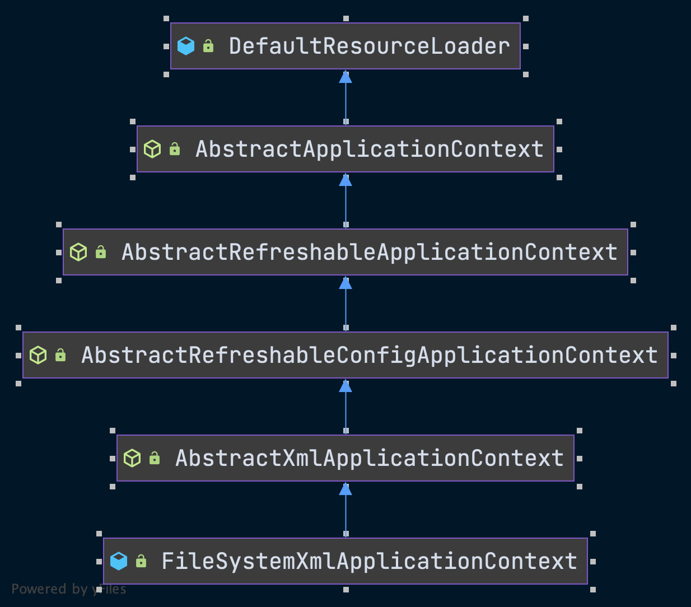
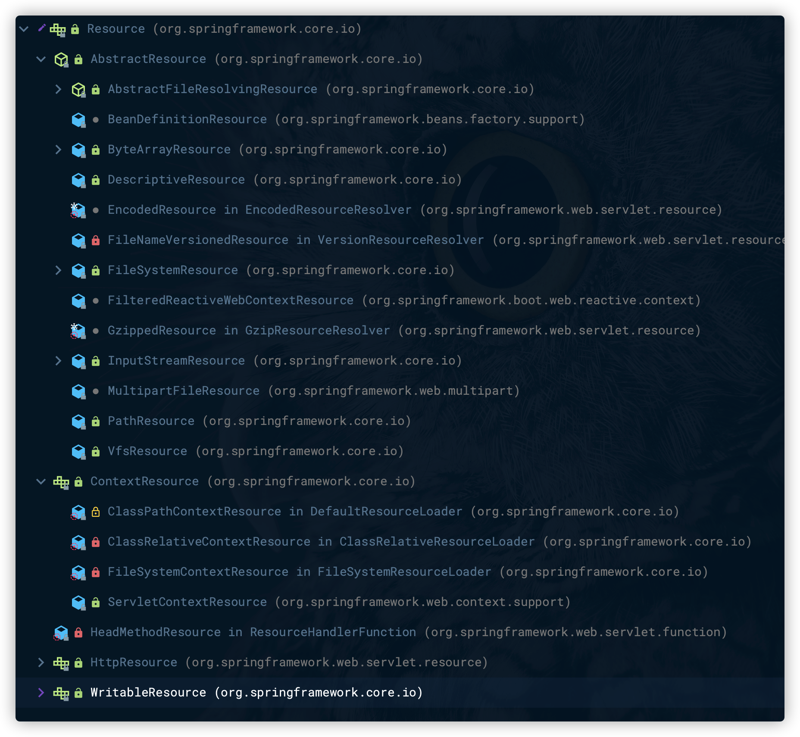

# IoC容器的实现

## Spring IoC容器概述

### IoC容器和依赖反转模式

- 对于依赖对象的获得反转了，更合适的叫法就是*依赖注入*。
- 如果合作对象的引用或依赖关系的管理由具体对象来完成，会导致代码的高度耦合和可测试性的降低。
- 在面向对象系统中，对象封装了数据和对数据的处理，对象的依赖关系常常体现在对**数据**和**方法**的依赖上。
- 把控制权从具体业务对象手中转交到平台或者框架中，是降低面向对象系统设计复杂性和提高面向对象系统可测试性的一个有效的解决方案。
- 控制反转是Spring框架的核心。
- 通过使用IoC容器，对象依赖关系的管理被反转了，转到IoC容器中来了，对象之间的相互依赖关系由IoC容器进行管理，并由Ioc容器完成对象的注入。

### 应用场景

#### Spring IoC对比EJB

- Spring IoC提供了一个基本的JavaBean容器，通过IoC模式管理依赖关系，并通过依赖注入和AOP切面增强了为JavaBean这样的POJO对象赋予事务管理、生命周期管理等基本功能。
- 对于EJB，一个简单的EJB组件需要编写远程/本地接口、Home接口以及Bean的实现类，而且EJB运行是不能脱离EJB容器的，查找其他EJB组件也需要通过诸如JNDI这样的方式。
- Spring把EJB组件还原成了POJO对象或者JavaBean对象，降低了应用开发对传统J2EE技术规范的依赖。

### Spring的注入实现

- 接口注入。
- setter注入。
- 构造器注入。

## IoC容器系列的设计与实现

>BeanFactory 和 ApplicationContext。

- `BeanFactory` 简单容器系列，这系列容器只实现了容器的最基本功能。是作为一个最基本的接口类出现在Spring的IoC容器体系中的。
- `ApplicationContext` 应用上下文，它作为容器的高级形态而存在。
- Spring通过定义**BeanDefinition**来管理基于Spring的应用中的**各种对象以及它们之间的相互依赖关系**。

### Spring的IoC容器系列

#### Spring的IoC容器系列概况


### Spring IoC容器的设计


- 从接口`BeanFactory`到`HierarchicalBeanFactory`，再到`ConfigurableBeanFactory`，是一条主要的BeanFactory设计路径。
  - `BeanFactory`接口定义了基本的IoC容器的规范，在这个接口定义中，包括了`getBean()`这样的IoC容器的基本方法（通过这个方法可以从容器中取得Bean）。
  - `HierarchicalBeanFactory`接口在继承了BeanFactory的基本接口之后，增加了`getParentBeanFactory()`的接口功能，使BeanFactory具备了**双亲IoC容器的管理功能**。
  - `ConfigurableBeanFactory`接口中，主要定义了一些对BeanFactory的配置功能，比如通过`setParentBeanFactory()`设置双亲IoC容器，通过`addBeanPostProcessor()`配置Bean后置处理器。
- 以`ApplicationContext`应用上下文接口为核心的接口设计，这里涉及的主要接口设计有，从`BeanFactory`到`ListableBeanFactory`，再到`ApplicationContext`，再到我们常用的`WebApplicationContext`或者`ConfigurableApplicationContext`接口。

  - 在这个接口体系中，`ListableBeanFactory`和`HierarchicalBeanFactory`两个接口，**连接** `BeanFactory`接口定义和`ApplicationConext`应用上下文的接口定义。
  - 在`ListableBeanFactory`接口中，细化了许多BeanFactory的接口功能，比如定义了`getBeanDefinitionNames()`接口方法。
  - 对于`ApplicationContext`接口，它通过继承`MessageSource`、`ResourceLoader`、`ApplicationEventPublisher`接口，在BeanFactory简单IoC容器的基础上**添加了许多对高级容器的特性的支持**。
- 这个接口系统是以BeanFactory和ApplicationContext为核心的。

#### BeanFactory的应用场景

- BeanFactory提供的是最基本的IoC容器的功能。

- 用户使用容器时，可以使用转义符**＆**来得到FactoryBean本身，用来区分通过容器来获取FactoryBean产生的对象和获取FactoryBean本身。

- 通过接口方法`containsBean`让用户能够判断容器是否**含有指定名字的Bean**。

- 通过接口方法`isSingleton`来查询指定名字的Bean**是否是Singleton类型的**Bean。对于Singleton属性，用户可以在`BeanDefinition`中指定。

- 通过接口方法`isPrototype`来查询指定名字的Bean**是否是prototype类型的**。与Singleton属性一样，这个属性也可以由用户在BeanDefinition中指定。

- 通过接口方法`isTypeMatch`来查询指定了名字的Bean的Class类型是否是特定的Class类型。这个Class类型可以由用户来指定。

- 通过接口方法`getType`来查询指定名字的Bean的Class类型。

- 通过接口方法`getAliases`来查询指定了名字的Bean的所有别名，这些别名都是用户在BeanDefinition中定义的。


#### BeanFactory和FactoryBean

- BeanFactory是Factory，也就是IoC容器或对象工厂。

- FactoryBean是Bean。

- Spring中Bean都是由BeanFactory（也就是IoC容器）来进行管理的。

- 对FactoryBean而言，这个Bean不是简单的Bean，而是一个能产生或者修饰对象生成的工厂Bean。

- BeanFactory接口设计了`getBean`方法，这个方法是使用IoC容器API的主要方法，通过这个方法，可以取得IoC容器中管理的Bean，Bean的取得是通过指定名字来索引的。

  

#### BeanFactory容器的设计原理

- BeanFactory实现是IoC容器的**基本形式**，而各种ApplicationContext的实现是IoC容器的**高级表现形式**。
- `DefaultListableBeanFactory`实际上包含了基本IoC容器所具有的重要功能，也是在很多地方都会用到的容器系列中的一个基本产品。
- 在Spring中，实际上是把`DefaultListableBeanFactory`作为一个**默认的功能完整的IoC容器**来使用的。

#### Ioc容器实现的关键类

- Resource。
- DefaultListableBeanFactory。
- BeanDefinitionReader。

#### 编程式的Ioc容器

- 创建IoC配置文件的抽象资源，这个抽象资源包括了BeanDefinition的定义信息。
- 创建一个BeanFactory，可以使用DeafultListableBeanFactory。
- 创建一个载入BeanDefinition的读取器。

```java
ClassPathResource res = new ClassPathResource("bean.xml");
DefaultListableBeanFactory factory = new DefaultListableBeanFactory();
XmlBeanDefinitionReader reader = new XmlBeanDefinitionReader(factory);
reader.loadBeanDefinitions(res);
```

#### ApplicationContext的应用场景

提供的高级功能

- **支持不同的信息源**。我们看到`ApplicationContext`扩展了`MessageSource`接口，这些信息源的扩展功能可以**支持国际化**的实现，为开发多语言版本的应用提供服务。
- **访问资源**。这一特性体现在对`ResourceLoader`和`Resource`的支持上，这样我们可以从不同地方得到Bean定义资源。
- **支持应用事件**。继承了接口`ApplicationEventPublisher`，从而在上下文中引入了事件机制。这些事件和Bean的生命周期的结合为Bean的管理提供了便利。
- 在ApplicationContext中提供的附加服务。

#### ApplicationContext容器的设计原理

以FileSystemXmlApplicationContext为例。

- `ApplicationContext`应用上下文的主要功能已经在`FileSystemXmlApplicationContext`的基类`AbstractXmlApplicationContext`中实现了。
- 在`FileSystemXmlApplicationContext`中，作为一个具体的应用上下文，只需要实现和它自身设计相关的两个功能。
  - 如果应用直接使用`FileSystemXmlApplicationContext`，对于实例化这个应用上下文的支持，同时启动IoC容器的`refresh()`过程。
  - 从文件系统中加载XML的Bean定义资源。


### IoC容器的初始化过程

>refresh()方法的基本过程主要包括BeanDefinition的Resource定位、载入、注册。Spring把这三个过程分开，并使用不同的模块来完成。

#### Resource定位

##### 基础概念

- **BeanDefinition**的资源定位，它由`ResourceLoader`通过统一的**Resource**接口来完成，这个Resource对各种形式的BeanDefinition的使用都提供了统一接口。
- 这个定位过程类似于容器寻找数据的过程，可以从文件系统中、类路径中寻找。
- Spring通过BeanDefinitionReader来对这些信息进行处理。
- ApplicationContext中，Spring已经为我们提供了一系列加载不同Resource的读取器的实现，而DefaultListableBeanFactory只是一个纯粹的IoC容器，需要为它配置特定的读取器才能完成这些功能。
- DefaultListableBeanFactory这种更底层的容器，能提高定制IoC容器的灵活性。

##### 流程

**以DefaultListableBeanFactory为例。**

- 定义一个`Resource`来定位容器使用的`BeanDefinition`。

- ClassPathResource，这意味着Spring会在类路径中去寻找以文件形式存在的BeanDefinition信息。

  ```java
  ClassPathResource res = new ClassPathResource("beans.xml");
  ```

- FileSystemXMLApplicationContext的继承体系



- `FileSystemXmlApplicationContext`已经通过继承`AbstractApplicationContext`具备了`ResourceLoader`读入以Resource定义的BeanDefinition的能力，因为`AbstractApplicationContext`的基类是**`DefaultResourceLoader`**。

- `BeanDefinitionReader.loadBeanDefintion()`采用了模板模式，具体的定位实现实际上是由各个子类来完成的。

- **getResourceByPath**流程

  

  - `AbstractRefreshableApplicationContext`的`refreshBeanFactory`方法的实现被`FileSystemXmlApplicationContext`构造函数中的`refresh`调用。
  - 通过`createBeanFactroy`构建了一个IoC容器【DefaultListableBeanFactory】供`ApplicationContext`使用。
  - `DefaultListableBeanFactory`启动了`loadBeanDefinitions`来载入`BeanDefinition`。

- AbstractRefreshableApplicationContext对容器的初始化

  ```java
  @Override
  protected final void refreshBeanFactory() throws BeansException {
    // 如果已经存在BeanFactory，关闭当前的BeanFactory
    if (hasBeanFactory()) {
      destroyBeans();
      closeBeanFactory();
    }
    try {
  		// 创建并设置持有的DefaultListableBeanFactory的地方同时调用
      DefaultListableBeanFactory beanFactory = createBeanFactory();
      beanFactory.setSerializationId(getId());
      customizeBeanFactory(beanFactory);
      // loadBeanDefinitions载入BeanDefinition的信息
      loadBeanDefinitions(beanFactory);
      synchronized (this.beanFactoryMonitor) {
        this.beanFactory = beanFactory;
      }
    }
    catch (IOException ex) {
      throw new ApplicationContextException("I/O error parsing bean definition source for " + getDisplayName(), ex);
    }
  }
  ```

- FileSystemXmlApplicationContext生成FileSystemResource对象

  ```java
  @Override
  protected Resource getResourceByPath(String path) {
    if (path.startsWith("/")) {
      path = path.substring(1);
    }
    return new FileSystemResource(path);
  }
  ```

##### Resource的继承关系




#### BeanDefinition载入

>BeanDefinition，实际上就是POJO对象在IoC容器中的抽象，通过这个BeanDefinition定义的数据结构，使IoC容器能够方便地对POJO对象也就是Bean进行管理。

- 把用户定义好的Bean表示成IoC容器内部的数据结构，而这个容器内部的数据结构就是BeanDefinition。

#### 注册BeanDefinition

>这里说的注册初始化过程，不包括Bean依赖注入的实现。
>
>在Spring IoC容器的设计中，Bean定义的载入和依赖注入是两个独立的过程。
>
>依赖注入一般发生在应用第一次通过getBean向容器索取Bean的时候。
>
>有一个例外值得注意，在使用IoC容器时有一个预实例化的配置，通过这个预实例化的配置——`lazyinit`。

- 通过调用`BeanDefinitionRegistry`接口的实现来完成的。
- 把载入过程中解析得到的`BeanDefinition`向IoC容器进行注册。
- 在IoC容器内部将`BeanDefinition`注入到一个HashMap中去，IoC容器就是通过这个HashMap来持有这些BeanDefinition数据的。