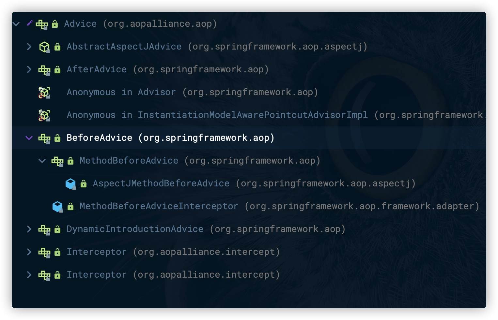
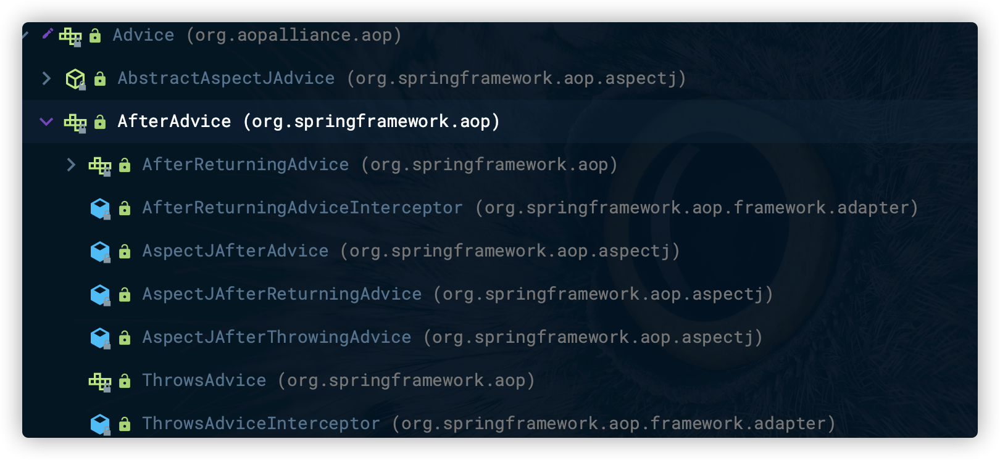
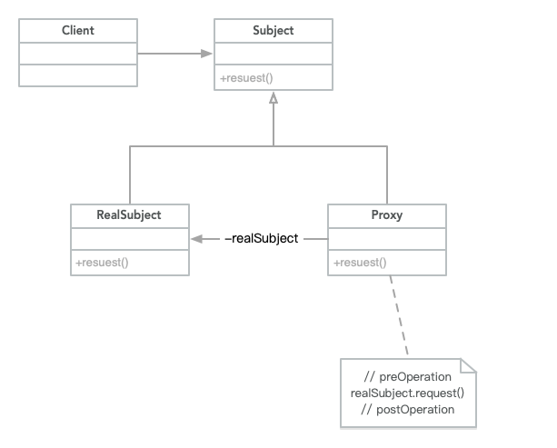

# Spring AOP的实现

## Spring AOP概述

### AOP概念回顾

- AOP是`Aspect-Oriented Programming`面向方面编程或面向切面的简称。
- Aspect是一种新的模块化机制，用来描述分散在对象、类或函数中的横切关注点`crosscutting concern`。
- `AspectJ` 源代码和字节码级别的编织器，用户需要使用不同于Java的新语言。
- `AspectWerkz` AOP框架，使用字节码动态编织器和XML配置。
- `JBoss-AOP` 基于拦截器和元数据的AOP框架，运行在JBoss应用服务器上。以及在AOP中用到的一些相关的技术实现。
- `BCEL` Byte-Code Engineering Library，Java字节码操作类库。
- `Javassist` Java字节码操作类库，JBoss的一个子项目。

#### AOP体系结构

- AOP联盟定义的AOP体系结构把与AOP相关的概念大致分为由高到低、从使用到实现的三个层次。
- 最高层是语言和开发环境，在这个环境中可以看到几个重要的概念。
  - `base` 基础，可以视为待增强对象或者说目标对象。
  - `aspect` 切面，通常包含对于基础的增强的应用。
  - `configuration` 配置，通过配置把基础和切面结合起来，完成对面对模板对象的编织实现。
- AOP体系结构的第二个层次是为语言和开发环境提供支持的。这个层次中可以看到AOP框架的高层实现，主要包括配置和编织实现两部分内容。

- 最底层是编织的具体实现模块。


### Advice 通知

- Advice（通知）定义在连接点做什么，为切面增强提供织入接口。
- 在Spring AOP中，它主要描述Spring AOP**围绕方法调用而注入的切面行为**。
- `Advice`是AOP联盟定义的一个接口，具体的接口定义在`org.aopalliance.aop.Advice`中。
- Spring封装定义了更为具体的通知类型，如`BeforeAdvice`、`AfterAdvice`、`ThrowsAdvice`等。

####  BeforeAdvice

- `MethodBeforeAdvice`是为待增强模板方法设置的前置增强接口，继承自`BeforeAdvice`。
- 作为回调函数，`before(Method method, Object[] args, @Nullable Object target)`方法的实现在Advice中被配置知道目标方法后，会在调用方法时被调用。
  - Method对象，目标方法的反射对象。
  - Object[]对象数组，这个对象数组中包含目标方法的输入参数。
  - target对象，调用的目标对象。

BeforeAdvice的类层次关系



```java
public interface MethodBeforeAdvice extends BeforeAdvice {

	void before(Method method, Object[] args, @Nullable Object target) throws Throwable;

}
```

#### AfterAdvice

- Spring提供了一系列对于`AfterAdvice`的实现和接口扩展。
- `AfterReturning-Advice`是Spring AOP常用一种通知。
- `afterReturning`方法也是一个回调函数，会在目标方法调用结束并成功返回的时候，接口会被Spring AOP回调。
  - `returnValue` 目标方法的返回结果。
  - `method` 调用的方法。
  - `args` 传入的参数。
  - `target` 目标对象。

接口结构



**AfterReturning-Advice代码**

```java
public interface AfterReturningAdvice extends AfterAdvice {

	void afterReturning(@Nullable Object returnValue, Method method, Object[] args, @Nullable Object target) throws Throwable;

}
```

#### ThrowsAdvice

`ThrowsAdvice`，并**没有指定需要实现的接口方法**，它**在抛出异常时被回调**，这个回调是AOP使用反射机制来完成的。

### Pointcut 切点

>Pointcut（切点）决定Advice通知应该作用于哪个连接点，也就是说通过Pointcut来定义需要增强的方法的集合，这些集合的选取可以按照一定的规则来完成。

- Pointcut通常意味着标识方法，如通过正则表达式标识的或者根据方法名匹配。
- Spring AOP封装了具体的切入点供用户使用。

#### Pointcut接口

- `MethodMatcher`封装了具体的Point的匹配判断功能，决定是否对当前方法调用进行增强或通知。

```java
public interface Pointcut {

	ClassFilter getClassFilter();

	MethodMatcher getMethodMatcher();

	Pointcut TRUE = TruePointcut.INSTANCE;

}
```

#### Pointcut接口继承体系

- `JdkRegexpMethodPointcut` 通过正则表达式对方法名进行匹配的功能。
- `AnnotationMatchingPointcut` 通过注解对方法名进行匹配的功能。


### Advisor 通知器

>通过Advisor，可以定义应该使用哪个通知并在哪个关注点使用它，这个结合为使用IoC容器配置AOP应用。
>

- `Advisor`通知器负责把切面增强设计`Advice`和关注点`Pointcut`结合在一起。

#### DefaultPointcutAdvisor

- 使用单例模式创建的`Pointcut.TRUE`作为默认的`Pointcut`。

```java
public class DefaultPointcutAdvisor extends AbstractGenericPointcutAdvisor implements Serializable {

  // Pointcut的默认单例
  // Pointcut TRUE = TruePointcut.INSTANCE;
  // public static final TruePointcut INSTANCE = new TruePointcut();
	private Pointcut pointcut = Pointcut.TRUE;

	public DefaultPointcutAdvisor() {
	}

	public DefaultPointcutAdvisor(Advice advice) {
		this(Pointcut.TRUE, advice);
	}

	public DefaultPointcutAdvisor(Pointcut pointcut, Advice advice) {
		this.pointcut = pointcut;
		setAdvice(advice);
	}

	public void setPointcut(@Nullable Pointcut pointcut) {
		this.pointcut = (pointcut != null ? pointcut : Pointcut.TRUE);
	}

	@Override
	public Pointcut getPointcut() {
		return this.pointcut;
	}

	@Override
	public String toString() {
		return getClass().getName() + ": pointcut [" + getPointcut() + "]; advice [" + getAdvice() + "]";
	}

}
```

#### TruePointcut

```java
final class TruePointcut implements Pointcut, Serializable {

	public static final TruePointcut INSTANCE = new TruePointcut();

	private TruePointcut() {
	}

	@Override
	public ClassFilter getClassFilter() {
		return ClassFilter.TRUE;
	}

	@Override
	public MethodMatcher getMethodMatcher() {
		return MethodMatcher.TRUE;
	}

	private Object readResolve() {
		return INSTANCE;
	}

	@Override
	public String toString() {
		return "Pointcut.TRUE";
	}

}
```

#### TrueMethodMatcher

```java
final class TrueMethodMatcher implements MethodMatcher, Serializable {

	public static final TrueMethodMatcher INSTANCE = new TrueMethodMatcher();

	private TrueMethodMatcher() {
	}


	@Override
	public boolean isRuntime() {
		return false;
	}

	@Override
	public boolean matches(Method method, Class<?> targetClass) {
		return true;
	}

	@Override
	public boolean matches(Method method, Class<?> targetClass, Object... args) {
		throw new UnsupportedOperationException();
	}

	@Override
	public String toString() {
		return "MethodMatcher.TRUE";
	}

	private Object readResolve() {
		return INSTANCE;
	}

}
```

## Spring AOP的设计与实现

### JVM的动态代理特性

- 在Spring AOP实现中，使用的核心技术是**动态代理**，这种动态代理是JDK的一个特性。
- 通过JDK的动态代理，可以为任意Java对象创建代理对象，对于具体使用来说，这个特性是通过`Java Reflection API`来完成的。

#### Proxy模式

类图




## 建立AopProxy代理对象

### 


## Spring AOP拦截器调用的实现

xx

## Spring AOP的高级特性

xx