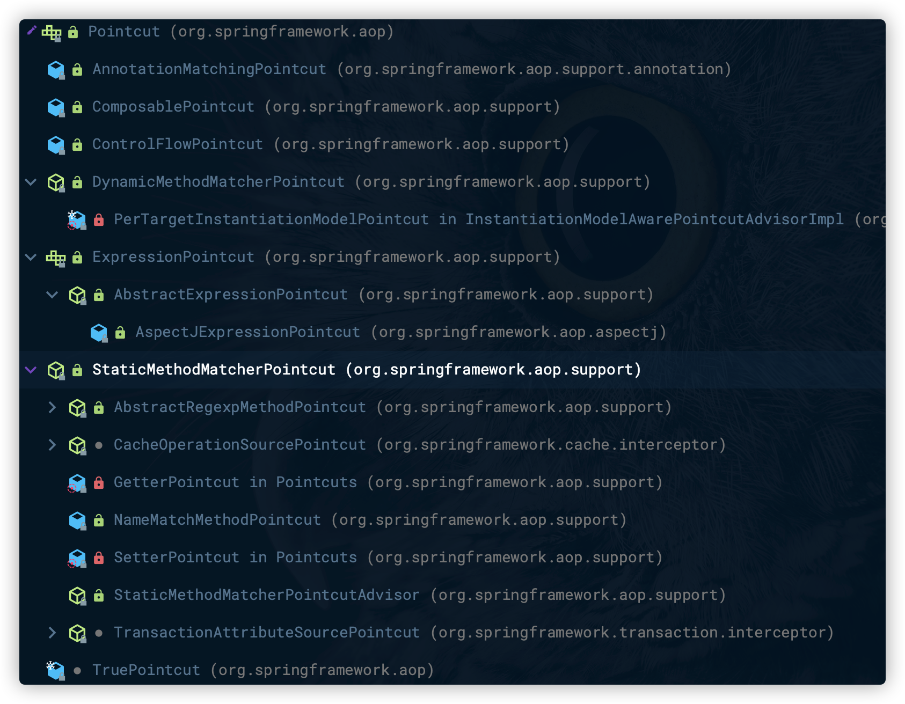

# Spring AOP的实现

## Spring AOP概述

### AOP概念回顾

- AOP是`Aspect-Oriented Programming`面向方面编程或面向切面的简称。
- Aspect是一种新的模块化机制，用来描述分散在对象、类或函数中的横切关注点`crosscutting concern`。
- `AspectJ` 源代码和字节码级别的编织器，用户需要使用不同于Java的新语言。
- `AspectWerkz` AOP框架，使用字节码动态编织器和XML配置。
- `JBoss-AOP` 基于拦截器和元数据的AOP框架，运行在JBoss应用服务器上。以及在AOP中用到的一些相关的技术实现。
- `BCEL` Byte-Code Engineering Library，Java字节码操作类库。
- `Javassist` Java字节码操作类库，JBoss的一个子项目。

#### AOP体系结构

- AOP联盟定义的AOP体系结构把与AOP相关的概念大致分为由高到低、从使用到实现的三个层次。
- 最高层是语言和开发环境，在这个环境中可以看到几个重要的概念。
  - `base` 基础，可以视为待增强对象或者说目标对象。
  - `aspect` 切面，通常包含对于基础的增强的应用。
  - `configuration` 配置，通过配置把基础和切面结合起来，完成对面对模板对象的编织实现。
- AOP体系结构的第二个层次是为语言和开发环境提供支持的。这个层次中可以看到AOP框架的高层实现，主要包括配置和编织实现两部分内容。

- 最底层是编织的具体实现模块。


### Advice 通知

- Advice（通知）定义在连接点做什么，为切面增强提供织入接口。
- 在Spring AOP中，它主要描述Spring AOP**围绕方法调用而注入的切面行为**。
- `Advice`是AOP联盟定义的一个接口，具体的接口定义在`org.aopalliance.aop.Advice`中。
- Spring封装定义了更为具体的通知类型，如`BeforeAdvice`、`AfterAdvice`、`ThrowsAdvice`等。

####  BeforeAdvice

- `MethodBeforeAdvice`是为待增强模板方法设置的前置增强接口，继承自`BeforeAdvice`。
- 作为回调函数，`before(Method method, Object[] args, @Nullable Object target)`方法的实现在Advice中被配置知道目标方法后，会在调用方法时被调用。
  - Method对象，目标方法的反射对象。
  - Object[]对象数组，这个对象数组中包含目标方法的输入参数。
  - target对象，调用的目标对象。

BeforeAdvice的类层次关系


```java
public interface MethodBeforeAdvice extends BeforeAdvice {

	void before(Method method, Object[] args, @Nullable Object target) throws Throwable;

}
```

#### AfterAdvice

- Spring提供了一系列对于`AfterAdvice`的实现和接口扩展。
- `AfterReturning-Advice`是Spring AOP常用一种通知。
- `afterReturning`方法也是一个回调函数，会在目标方法调用结束并成功返回的时候，接口会被Spring AOP回调。
  - `returnValue` 目标方法的返回结果。
  - `method` 调用的方法。
  - `args` 传入的参数。
  - `target` 目标对象。

接口结构


**AfterReturning-Advice代码**

```java
public interface AfterReturningAdvice extends AfterAdvice {

	void afterReturning(@Nullable Object returnValue, Method method, Object[] args, @Nullable Object target) throws Throwable;

}
```

#### ThrowsAdvice

`ThrowsAdvice`，并**没有指定需要实现的接口方法**，它**在抛出异常时被回调**，这个回调是AOP使用反射机制来完成的。

### Pointcut 切点

>Pointcut（切点）决定Advice通知应该作用于哪个连接点，也就是说通过Pointcut来定义需要增强的方法的集合，这些集合的选取可以按照一定的规则来完成。

- Pointcut通常意味着标识方法，如通过正则表达式标识的或者根据方法名匹配。
- Spring AOP封装了具体的切入点供用户使用。

#### Pointcut接口

- `MethodMatcher`封装了具体的Point的匹配判断功能，决定是否对当前方法调用进行增强或通知。

```java
public interface Pointcut {

	ClassFilter getClassFilter();

	MethodMatcher getMethodMatcher();

	Pointcut TRUE = TruePointcut.INSTANCE;

}
```

#### Pointcut接口继承体系

- `JdkRegexpMethodPointcut` 通过正则表达式对方法名进行匹配的功能。
- `AnnotationMatchingPointcut` 通过注解对方法名进行匹配的功能。



### Advisor 通知器

>通过Advisor，可以定义应该使用哪个通知并在哪个关注点使用它，这个结合为使用IoC容器配置AOP应用。
>

- `Advisor`通知器负责把切面增强设计`Advice`和关注点`Pointcut`结合在一起。

#### DefaultPointcutAdvisor

- 使用单例模式创建的`Pointcut.TRUE`作为默认的`Pointcut`。

```java
public class DefaultPointcutAdvisor extends AbstractGenericPointcutAdvisor implements Serializable {

  // Pointcut的默认单例
  // Pointcut TRUE = TruePointcut.INSTANCE;
  // public static final TruePointcut INSTANCE = new TruePointcut();
	private Pointcut pointcut = Pointcut.TRUE;

	public DefaultPointcutAdvisor() {
	}

	public DefaultPointcutAdvisor(Advice advice) {
		this(Pointcut.TRUE, advice);
	}

	public DefaultPointcutAdvisor(Pointcut pointcut, Advice advice) {
		this.pointcut = pointcut;
		setAdvice(advice);
	}

	public void setPointcut(@Nullable Pointcut pointcut) {
		this.pointcut = (pointcut != null ? pointcut : Pointcut.TRUE);
	}

	@Override
	public Pointcut getPointcut() {
		return this.pointcut;
	}

	@Override
	public String toString() {
		return getClass().getName() + ": pointcut [" + getPointcut() + "]; advice [" + getAdvice() + "]";
	}

}
```

#### TruePointcut

```java
final class TruePointcut implements Pointcut, Serializable {

	public static final TruePointcut INSTANCE = new TruePointcut();

	private TruePointcut() {
	}

	@Override
	public ClassFilter getClassFilter() {
		return ClassFilter.TRUE;
	}

	@Override
	public MethodMatcher getMethodMatcher() {
		return MethodMatcher.TRUE;
	}

	private Object readResolve() {
		return INSTANCE;
	}

	@Override
	public String toString() {
		return "Pointcut.TRUE";
	}

}
```

#### TrueMethodMatcher

```java
final class TrueMethodMatcher implements MethodMatcher, Serializable {

	public static final TrueMethodMatcher INSTANCE = new TrueMethodMatcher();

	private TrueMethodMatcher() {
	}


	@Override
	public boolean isRuntime() {
		return false;
	}

	@Override
	public boolean matches(Method method, Class<?> targetClass) {
		return true;
	}

	@Override
	public boolean matches(Method method, Class<?> targetClass, Object... args) {
		throw new UnsupportedOperationException();
	}

	@Override
	public String toString() {
		return "MethodMatcher.TRUE";
	}

	private Object readResolve() {
		return INSTANCE;
	}

}
```

## Spring AOP的设计与实现

### JVM的动态代理特性

- 在Spring AOP实现中，使用的核心技术是**动态代理**，这种动态代理是JDK的一个特性。
- 通过JDK的动态代理，可以为任意Java对象创建代理对象，对于具体使用来说，这个特性是通过`Java Reflection API`来完成的。

#### Proxy模式

在Proxy的调用过程中，如果客户`Client`调用Proxy的`request`方法，会在调用目标对象的request方法的前后调用一系列的处理，而这一系列的处理相对于目标对象来说是透明的，目标对象对这些处理可以毫不知情。

JDK中已经实现了这个Proxy模式，在基于Java虚拟机设计应用程序时，只需要直接使用这个特性即可。

- 在Java的`reflection`包中看到Proxy对象，这个对象生成后，所起的作用就类似于Proxy模式中的Proxy对象。
- 在使用时，还需要为代理对象Proxy设计一个**回调方法**，这个回调方法起到的作用是，在**其中加入了作为代理需要额外处理的动作**。
- 回调方法在JDK中的实现需要借助于实现`InvocationHandler`接口。

通过`Proxy.newIntance`方法把具体的`Proxy`对象和`InvocationHandler`结合在一起。


##### 类图


##### 调用关系


##### InvocationHandler接口

- `proxy` 代理对象实例。
- `method` 当前Proxy被调用的方法。
- `args` 被调用的方法中的参数。

```java
public interface InvocationHandler {

    public Object invoke(Object proxy, Method method, Object[] args)
        throws Throwable;
}
```

------

### Spring AOP的设计分析

Spring AOP的技术核心的JDK的动态代理。

Spring AOP的实现结合了AspectJ框架。

Spring AOP的过程

1. 需要为目标对象建立代理对象。
2. 启动代理对象的拦截器来完成各种横切面的织入。

------

### Spring AOP的应用场景

- 应用
  - 日志
  - 权限验证
  - 性能监控
  - 缓存优化
  - ...
- Spring内部的功能
  - 事务
  - 日志监控
  - 懒加载
  - 异常处理
  - 资源池
  - ...

## 建立AopProxy代理对象

### 设计原理

- 通过配置和调用Spring的`ProxyFactoryBean`来完成代理对象的生成。
  - JDK的Proxy。
  - CGLIB。

#### ProxyFactory的类继承关系

- 作为共同基类，可以将`ProxyConfig`看成是一个**数据基类**，这个数据基类为`ProxyFactoryBean`这样的子类提供了**配置属性**。
- `AdvisedSupport`的实现中，封装了AOP对**通知**和**通知器**的相关操作，这些操作对于不同的AOP的代理对象的生成都是一样的，但对于**具体的AOP代理对象的创建**，`AdvisedSupport`把它交给它的子类们去完成。
- `ProxyCreatorSupport`，可以将它看成是其子类创建AOP代理对象的一个**辅助类**。
- 通过继承以上提到的基类的功能实现，具体的AOP代理对象的生成，根据不同的需要，分别由`ProxyFactoryBean`、`AspectJProxyFactory`和`ProxyFactory`来完成。
- 对于需要使用AspectJ的AOP应用，`AspectJProxyFactory`起到集成Spring和AspectJ的作用。
- 对于使用Spring AOP的应用，`ProxyFactoryBean`和`ProxyFactoy`都提供了AOP功能的封装。
  - `ProxyFactoryBean`，可以在IoC容器中完成**声明式配置**。
  - `ProxyFactory`，则需要**编程式**地使用Spring AOP的功能。


### 配置ProxyFactoryBean

>ProxyFactoryBean是在Spring IoC环境中创建AOP应用的底层方法，也是最灵活的方法，Spring通过它完成了对AOP使用的封装。
>

基于XML的配置

1. 定义使用的通知器`Advisor`，这个通知器应该作为一个Bean来定义，通知器定义了对于目标对象进行增强的切面行为。
2. 定义`ProxyFactoryBean`，把它作为另一个Bean来定义，它是封装AOP功能的主要类。
   - `proxyInterface` 代理接口。
   - `interceptorNames` 设置为需要定义的通知器。
   - `target`
3. 定义target属性，作为target属性注入的Bean，是需要用AOP通知器中的切面应用来增强的对象。

```xml
<bean id="testAdvisor" class="com.abc.TestAdvisor"/>
<bean id="testAOP" class="org.springframework.aop.ProxyFactoryBean">
  <property name="proxyInterfaces">
    <value>com.test.AbcInterface</value>
  </property>
  <property name="target">
    <bean class="com.abc.TestTarget"/>
  </property>
  <property name="interceptorNames">
    <list>
      <value>testAdvisor</value>
    </list>
  </property>
</bean>
```

### ProxyFactoryBean生成AopProxy代理对象

> AOP的实现部分看成有**基础设施准备**和**AOP运行辅助**两部分。

#### 简介

- 在`ProxyFactoryBean`中，通过`interceptorNames`属性来配置已经定义好的通知器`Advisor`。虽然名字为`interceptorNames`，但实际上却是供AOP应用配置通知器的地方。
- `ProxyFactoryBean`的AOP实现需要依赖`JDK`或者`CGLIB`提供的Proxy特性。
- `ProxyFactoryBean`实现中的`getObject`方法，是FactoryBean需要实现的接口。
  1. 对通知器链进行初始化。
  2. 为代理对象的生成做好准备。
- `AopProxy`是一个接口，有`Cglib2AopProxy`、`JdkDynamicProxy`两个实现分别对应CGLIB和JDK的代理方式。

#### 时序图

创建代理对象的过程

- 从`AdvisedSupport`对象中取得配置的**目标对象**。
- 根据配置的情况来决定使用什么方式来创建`AopProxy`代理对象。
  - 默认的方式是使用**JDK**来产生AopProxy代理对象，但是如果遇到配置的目标对象不是接口类的实现，会使用CGLIB来产生AopProxy代理对象。
  - 使用CGLIB来产生AopProxy代理对象时，因为CGLIB是一个第三方的类库，本身不在JDK的基本类库中，所以需要在CLASSPATH路径中进行正确的配置，以便能够加载和使用。


#### 核心源码

`ProxyFactoryBean#getObject`

```java
@Override
@Nullable
public Object getObject() throws BeansException {
  // 初始化通知器链
  initializeAdvisorChain();
  // 单例和多例的Bean分支
  if (isSingleton()) {
    return getSingletonInstance();
  }
  else {
    if (this.targetName == null) {
      logger.info("Using non-singleton proxies with singleton targets is often undesirable. " +
                  "Enable prototype proxies by setting the 'targetName' property.");
    }
    return newPrototypeInstance();
  }
}
```

`ProxyFactoryBean#initializeAdvisorChain`

```java
private synchronized void initializeAdvisorChain() throws AopConfigException, BeansException {
  // 标志位，标识是否已经完成了通知器链的初始化。
  if (this.advisorChainInitialized) {
    return;
  }

  if (!ObjectUtils.isEmpty(this.interceptorNames)) {
    if (this.beanFactory == null) {
      throw new IllegalStateException("No BeanFactory available anymore (probably due to serialization) " +
                                      "- cannot resolve interceptor names " + Arrays.asList(this.interceptorNames));
    }

    // Globals can't be last unless we specified a targetSource using the property...
    if (this.interceptorNames[this.interceptorNames.length - 1].endsWith(GLOBAL_SUFFIX) &&
        this.targetName == null && this.targetSource == EMPTY_TARGET_SOURCE) {
      throw new AopConfigException("Target required after globals");
    }

    // 添加Advisor链的调用，是通过interceptorNames属性进行配置的
    for (String name : this.interceptorNames) {
      if (name.endsWith(GLOBAL_SUFFIX)) {
        if (!(this.beanFactory instanceof ListableBeanFactory)) {
          throw new AopConfigException(
            "Can only use global advisors or interceptors with a ListableBeanFactory");
        }
        addGlobalAdvisors((ListableBeanFactory) this.beanFactory,
                          name.substring(0, name.length() - GLOBAL_SUFFIX.length()));
      }

      else {
        // If we get here, we need to add a named interceptor.
        // 检查是单例还是多例的Bean
        Object advice;
        if (this.singleton || this.beanFactory.isSingleton(name)) {
          // Add the real Advisor/Advice to the chain.
          advice = this.beanFactory.getBean(name);
        }
        else {
          // It's a prototype Advice or Advisor: replace with a prototype.
          // Avoid unnecessary creation of prototype bean just for advisor chain initialization.
          advice = new PrototypePlaceholderAdvisor(name);
        }
        addAdvisorOnChainCreation(advice);
      }
    }
  }

  this.advisorChainInitialized = true;
}
```

`ProxyFactoryBean#getSingletonInstance`

```java
private synchronized Object getSingletonInstance() {
  if (this.singletonInstance == null) {
    this.targetSource = freshTargetSource();
    if (this.autodetectInterfaces && getProxiedInterfaces().length == 0 && !isProxyTargetClass()) {
      // 根据AOP框架来判断需要代理的接口
      Class<?> targetClass = getTargetClass();
      if (targetClass == null) {
        throw new FactoryBeanNotInitializedException("Cannot determine target class for proxy");
      }
      // 设置代理对象的接口
      setInterfaces(ClassUtils.getAllInterfacesForClass(targetClass, this.proxyClassLoader));
    }
    // Initialize the shared singleton instance.
    super.setFrozen(this.freezeProxy);
    // 使用ProxyFactory来生成需要的Proxy
    this.singletonInstance = getProxy(createAopProxy());
  }
  return this.singletonInstance;
}
protected Object getProxy(AopProxy aopProxy) {
  return aopProxy.getProxy(this.proxyClassLoader);
}
```

`ProxyCreatorSupport#createAopProxy`

```java
protected final synchronized AopProxy createAopProxy() {
  if (!this.active) {
    activate();
  }
  // 通过AopProxyFactory取得AopProxy，初始化定义的是DefaultAopProxyFactory
  return getAopProxyFactory().createAopProxy(this);
}
```

`DefaultAopProxyFactory#createAopProxy`

```java
@Override
public AopProxy createAopProxy(AdvisedSupport config) throws AopConfigException {
  if (config.isOptimize() || config.isProxyTargetClass() || hasNoUserSuppliedProxyInterfaces(config)) {
    Class<?> targetClass = config.getTargetClass();
    if (targetClass == null) {
      throw new AopConfigException("TargetSource cannot determine target class: " +
                                   "Either an interface or a target is required for proxy creation.");
    }
    // 如果目标对象是接口类，那么适合使用JDK来生成代理对象，否则使用CGLIB来生成代理对象。
    if (targetClass.isInterface() || Proxy.isProxyClass(targetClass)) {
      return new JdkDynamicAopProxy(config);
    }
    return new ObjenesisCglibAopProxy(config);
  }
  else {
    return new JdkDynamicAopProxy(config);
  }
}
```

### JDK生成AopProxy代理对象

- `ProxyFactoryBean`在AopProxy代理对象和IoC容器配置之间的作是为代理对象的最终生成做好了准备。
- `JdkDynamicAopProxy`是`AopProxy`的一个实现类。

#### AopProxy接口

```java
public interface AopProxy {

  Object getProxy();

  Object getProxy(@Nullable ClassLoader classLoader);

}
```

#### 类图


#### JdkDynamicAopProxy

- 从`advised`对象中取得代理对象的代理接口配置。
- 调用`Proxy`的`newProxyInstance`方法获取实例。
  - ClassLoader loader 类装载器
  - `Class<?>[] interfaces` 代理接口
  - `InvocationHandler h` Proxy回调方法所在的对象

```java
@Override
public Object getProxy(@Nullable ClassLoader classLoader) {
  if (logger.isTraceEnabled()) {
    logger.trace("Creating JDK dynamic proxy: " + this.advised.getTargetSource());
  }
  Class<?>[] proxiedInterfaces = AopProxyUtils.completeProxiedInterfaces(this.advised, true);
  findDefinedEqualsAndHashCodeMethods(proxiedInterfaces);
  return Proxy.newProxyInstance(classLoader, proxiedInterfaces, this);
}
```

### CGLIB生成AopProxy代理对象

- `Enhancer`对象`callback`回调的设置，封装了Spring AOP的实现。

#### 代码

```java
@Override
public Object getProxy(@Nullable ClassLoader classLoader) {
  if (logger.isTraceEnabled()) {
    logger.trace("Creating CGLIB proxy: " + this.advised.getTargetSource());
  }
  // 从advised中取得在IoC容器中配置的target对象
  try {
    Class<?> rootClass = this.advised.getTargetClass();
    Assert.state(rootClass != null, "Target class must be available for creating a CGLIB proxy");

    Class<?> proxySuperClass = rootClass;
    if (rootClass.getName().contains(ClassUtils.CGLIB_CLASS_SEPARATOR)) {
      proxySuperClass = rootClass.getSuperclass();
      Class<?>[] additionalInterfaces = rootClass.getInterfaces();
      for (Class<?> additionalInterface : additionalInterfaces) {
        this.advised.addInterface(additionalInterface);
      }
    }

    // Validate the class, writing log messages as necessary.
    validateClassIfNecessary(proxySuperClass, classLoader);

    // 创建并配置CGLIB的Enhancer，Enhancer对象是CGLIB的主要操作类
    Enhancer enhancer = createEnhancer();
    if (classLoader != null) {
      enhancer.setClassLoader(classLoader);
      if (classLoader instanceof SmartClassLoader &&
          ((SmartClassLoader) classLoader).isClassReloadable(proxySuperClass)) {
        enhancer.setUseCache(false);
      }
    }
    // 设置Enhancer对象，包括设置代理接口，回调方法
    enhancer.setSuperclass(proxySuperClass);
    enhancer.setInterfaces(AopProxyUtils.completeProxiedInterfaces(this.advised));
    enhancer.setNamingPolicy(SpringNamingPolicy.INSTANCE);
    enhancer.setStrategy(new ClassLoaderAwareGeneratorStrategy(classLoader));

    Callback[] callbacks = getCallbacks(rootClass);
    Class<?>[] types = new Class<?>[callbacks.length];
    for (int x = 0; x < types.length; x++) {
      types[x] = callbacks[x].getClass();
    }
    // fixedInterceptorMap only populated at this point, after getCallbacks call above
    enhancer.setCallbackFilter(new ProxyCallbackFilter(
      this.advised.getConfigurationOnlyCopy(), this.fixedInterceptorMap, this.fixedInterceptorOffset));
    enhancer.setCallbackTypes(types);

    // 通过 Enhancer 生成代理对象
    return createProxyClassAndInstance(enhancer, callbacks);
  }
  catch (CodeGenerationException | IllegalArgumentException ex) {
    throw new AopConfigException("Could not generate CGLIB subclass of " + this.advised.getTargetClass() +
                                 ": Common causes of this problem include using a final class or a non-visible class",
                                 ex);
  }
  catch (Throwable ex) {
    // TargetSource.getTarget() failed
    throw new AopConfigException("Unexpected AOP exception", ex);
  }
}

protected Object createProxyClassAndInstance(Enhancer enhancer, Callback[] callbacks) {
  enhancer.setInterceptDuringConstruction(false);
  enhancer.setCallbacks(callbacks);
  return (this.constructorArgs != null && this.constructorArgTypes != null ?
          enhancer.create(this.constructorArgTypes, this.constructorArgs) :
          enhancer.create());
}
```

## Spring AOP拦截器调用的实现

### 设计原理

在Spring AOP通过**JDK的Proxy方式**或**CGLIB方式**生成代理对象的时候，相关的**拦截器**已经配置到代理对象中去了，**拦截器在代理对象中起作用是通过对这些方法的回调来完成的**。

- **JDK的Proxy**，通过`InvocationHandler`来设置拦截器回调。
- **CGLIB**，根据CGLIB的使用要求，通过`Dynamic-AdvisedInterceptor`来完成回调。

### JdkDynamicAopProxy的invoke拦截

#### 生成代理对象的代码

- `this参数`，对应的是`InvocationHandler`对象，`InvocationHandler`是JDK定义的反射类的一个接口。
- `invoke`方法是作为`JDK Proxy`代理对象进行拦截的回调入口出现的。
- 当Proxy对象的代理方法被调用时，`JdkDynamicAopProxy`的`invoke`方法作为**Proxy对象的回调函数被触发**，从而通过`invoke`的具体实现，来完成对目标对象方法调用的**拦截或者说功能增强的工作**。
- 

```java
Proxy.newProxyInstance(classLoader, proxiedInterfaces, this);
```

```java
@Override
@Nullable
public Object invoke(Object proxy, Method method, Object[] args) throws Throwable {
  Object oldProxy = null;
  boolean setProxyContext = false;

  TargetSource targetSource = this.advised.targetSource;
  Object target = null;

  try {
    if (!this.equalsDefined && AopUtils.isEqualsMethod(method)) {
      // 如果目标对象没有实现Object类的基本方法，equals
      return equals(args[0]);
    }
    else if (!this.hashCodeDefined && AopUtils.isHashCodeMethod(method)) {
      // 如果目标对象没有实现Object类的基本方法，hashcode
      return hashCode();
    }
    else if (method.getDeclaringClass() == DecoratingProxy.class) {
      // There is only getDecoratedClass() declared -> dispatch to proxy config.
      return AopProxyUtils.ultimateTargetClass(this.advised);
    }
    else if (!this.advised.opaque && method.getDeclaringClass().isInterface() &&
             method.getDeclaringClass().isAssignableFrom(Advised.class)) {
      // 根据代理对象的配置来调用服务
      return AopUtils.invokeJoinpointUsingReflection(this.advised, method, args);
    }

    Object retVal;

    if (this.advised.exposeProxy) {
      // Make invocation available if necessary.
      oldProxy = AopContext.setCurrentProxy(proxy);
      setProxyContext = true;
    }

    // Get as late as possible to minimize the time we "own" the target,
    // 得到目标对象的地方
    target = targetSource.getTarget();
    Class<?> targetClass = (target != null ? target.getClass() : null);

    // 这里获得定义好的拦截器链
    List<Object> chain = this.advised.getInterceptorsAndDynamicInterceptionAdvice(method, targetClass);

    // Check whether we have any advice. If we don't, we can fallback on direct
    // reflective invocation of the target, and avoid creating a MethodInvocation.
    if (chain.isEmpty()) {
      // 如果没有设定拦截器，就直接调用方法
      Object[] argsToUse = AopProxyUtils.adaptArgumentsIfNecessary(method, args);
      retVal = AopUtils.invokeJoinpointUsingReflection(target, method, argsToUse);
    }
    else {
      // We need to create a method invocation...
      MethodInvocation invocation =
        new ReflectiveMethodInvocation(proxy, target, method, args, targetClass, chain);
      // 调用拦截器链继续前进
      retVal = invocation.proceed();
    }

    // Massage return value if necessary.
    Class<?> returnType = method.getReturnType();
    if (retVal != null && retVal == target &&
        returnType != Object.class && returnType.isInstance(proxy) &&
        !RawTargetAccess.class.isAssignableFrom(method.getDeclaringClass())) {
      // Special case: it returned "this" and the return type of the method
      // is type-compatible. Note that we can't help if the target sets
      // a reference to itself in another returned object.
      retVal = proxy;
    }
    else if (retVal == null && returnType != Void.TYPE && returnType.isPrimitive()) {
      throw new AopInvocationException(
        "Null return value from advice does not match primitive return type for: " + method);
    }
    return retVal;
  }
  finally {
    if (target != null && !targetSource.isStatic()) {
      // Must have come from TargetSource.
      targetSource.releaseTarget(target);
    }
    if (setProxyContext) {
      // Restore old proxy.
      AopContext.setCurrentProxy(oldProxy);
    }
  }
}
```

### Cglib2AopProxy的intercept拦截

- `Cglib2AopProxy`的`AopProxy`代理对象，对于AOP的拦截调用，是在回调`DynamicAdvisedInterceptor`对象中实现的。

- `Cglib2AopProxy`中构造`CglibMethodInvocation`对象来完成拦截器链的调用。

#### 动态通知拦截器源码

**org.springframework.aop.framework.CglibAopProxy.DynamicAdvisedInterceptor**

```java
private static class DynamicAdvisedInterceptor implements MethodInterceptor, Serializable {

  private final AdvisedSupport advised;

  public DynamicAdvisedInterceptor(AdvisedSupport advised) {
    this.advised = advised;
  }

  @Override
  @Nullable
  public Object intercept(Object proxy, Method method, Object[] args, MethodProxy methodProxy) throws Throwable {
    Object oldProxy = null;
    boolean setProxyContext = false;
    Object target = null;
    TargetSource targetSource = this.advised.getTargetSource();
    try {
      if (this.advised.exposeProxy) {
        // Make invocation available if necessary.
        oldProxy = AopContext.setCurrentProxy(proxy);
        setProxyContext = true;
      }
      // Get as late as possible to minimize the time we "own" the target, in case it comes from a pool...
      target = targetSource.getTarget();
      Class<?> targetClass = (target != null ? target.getClass() : null);
      // 从advised中取得配置好的AOP通知
      List<Object> chain = this.advised.getInterceptorsAndDynamicInterceptionAdvice(method, targetClass);
      Object retVal;
      // Check whether we only have one InvokerInterceptor: that is,
			// 如果没有AOP通知配置，那么直接调用target对象的调用方法
      if (chain.isEmpty() && Modifier.isPublic(method.getModifiers())) {
        // We can skip creating a MethodInvocation: just invoke the target directly.
        // Note that the final invoker must be an InvokerInterceptor, so we know
        // it does nothing but a reflective operation on the target, and no hot
        // swapping or fancy proxying.
        Object[] argsToUse = AopProxyUtils.adaptArgumentsIfNecessary(method, args);
        retVal = methodProxy.invoke(target, argsToUse);
      }
      else {
        // 通过CglibMethodInvocation来启动advice通知
        retVal = new CglibMethodInvocation(proxy, target, method, args, targetClass, chain, methodProxy).proceed();
      }
      retVal = processReturnType(proxy, target, method, retVal);
      return retVal;
    }
    finally {
      if (target != null && !targetSource.isStatic()) {
        targetSource.releaseTarget(target);
      }
      if (setProxyContext) {
        // Restore old proxy.
        AopContext.setCurrentProxy(oldProxy);
      }
    }
  }

  @Override
  public boolean equals(@Nullable Object other) {
    return (this == other ||
            (other instanceof DynamicAdvisedInterceptor &&
             this.advised.equals(((DynamicAdvisedInterceptor) other).advised)));
  }

  /**
		 * CGLIB uses this to drive proxy creation.
		 */
  @Override
  public int hashCode() {
    return this.advised.hashCode();
  }
}
```

### 目标对象方法的调用

- 如果没有设置拦截器，那么会对目标对象的方法直接进行调用。

#### JdkDynamicAopProxy

**AopUtils.invokeJoinpointUsingReflection**

```java
@Nullable
public static Object invokeJoinpointUsingReflection(@Nullable Object target, Method method, Object[] args)
  throws Throwable {

  // Use reflection to invoke the method.
  try {
    ReflectionUtils.makeAccessible(method);
    // 使用反射调用target对象方法
    return method.invoke(target, args);
  }
  catch (InvocationTargetException ex) {
    // 抛出AOP异常，对异常进行转换
    throw ex.getTargetException();
  }
  catch (IllegalArgumentException ex) {
    throw new AopInvocationException("AOP configuration seems to be invalid: tried calling method [" +
                                     method + "] on target [" + target + "]", ex);
  }
  catch (IllegalAccessException ex) {
    throw new AopInvocationException("Could not access method [" + method + "]", ex);
  }
}
```

#### Cglib2AopProxy

通过`CGLIB`的`MethodProxy`对象来直接完成对目标对象的调用的。

```java
Object retVal = methodProxy.invoke(this.target, args);
```

### AOP拦截器链的调用

>对于目标对象增强的实现封装在AOP拦截器链中，由一个个具体的拦截器来完成。

- 对拦截器链的调用都是在`ReflectiveMethodInvocation`中通过`proceed`方法实现的。
- 在`proceed`方法中，会逐个运行拦截器的拦截方法。

- 在`Pointcut`切点中需要进行`matches`的匹配过程，即`matches`调用对方法进行匹配判断，来决定是否需要实行通知增强。

#### 源码

`ReflectiveMethodInvocation#proceed`

```java
public Object proceed() throws Throwable {
  // 从索引为-1的拦截器开始调用，并按序递增，如果拦截器链中的拦截器迭代调用完毕，这里开始调用target的函数
  if (this.currentInterceptorIndex == this.interceptorsAndDynamicMethodMatchers.size() - 1) {
    return invokeJoinpoint();
  }
	// 链式调用interceptorOrInterceptionAdvice
  Object interceptorOrInterceptionAdvice =
    this.interceptorsAndDynamicMethodMatchers.get(++this.currentInterceptorIndex);
  if (interceptorOrInterceptionAdvice instanceof InterceptorAndDynamicMethodMatcher) {
    // 进行匹配
    InterceptorAndDynamicMethodMatcher dm =
      (InterceptorAndDynamicMethodMatcher) interceptorOrInterceptionAdvice;
    Class<?> targetClass = (this.targetClass != null ? this.targetClass : this.method.getDeclaringClass());
    if (dm.methodMatcher.matches(this.method, targetClass, this.arguments)) {
      return dm.interceptor.invoke(this);
    }
    else {
      // 匹配失败，跳过拦截器，继续调用下一个拦截器
      return proceed();
    }
  }
  else {
		// 如果是一个interceptpr，直接调用对应的方法
    return ((MethodInterceptor) interceptorOrInterceptionAdvice).invoke(this);
  }
}
```

### 配置通知器

- 获取配置。

- `interceptorOrInterceptionAdvice`是获得的拦截器，它通过拦截器机制对目标对象的行为增强起作用。

- `interceptorsAndDynamicMethodMatchers`是装配好的全部拦截器集合。

- `interceptorsAndDynamicMethodMatchers`的来源。

  ```java
  org.springframework.aop.framework.JdkDynamicAopProxy#invoke
  // 获取拦截器
  List<Object> chain = this.advised.getInterceptorsAndDynamicInterceptionAdvice(method, targetClass);
  ```

- 获取`interceptors`的操作是由advised对象完成的，advised是`AdvisedSupport`对象，`AdvisedSupport`类也是`ProxyFactoryBean`的基类。

- 取得拦截器链的工作是由配置好的`advisorChainFactory`来完成的，它是一个**生成通知器链**的工厂，默认使用的是`DefaultAdvisorChainFactory`。

- `DefaultAdvisorChainFactory`会通过一个`AdvisorAdapterRegistry`来实现拦截器的注册。

- `AdvisorAdapterRegistry`注册器，利用它来对从`ProxyFactoryBean`配置中得到的通知进行适配，从而获得相应的拦截器，再把它加入前面设置好的List中去，完成拦截器注册过程。

- 事实上，`advisor`通知器是从`AdvisorSupport`中取得的，在`ProxyFactoryBean`的`getObject`方法中对`advisor`进行初始化时，**从XML配置中获取了advisor通知器**。

- `ProxyFactoryBean`的`initializeAdvisorChain`方法对通知器链进行初始化，从Ioc容器中获取到Bean，`ProxyFactoryBean`本身实现了`BeanFactoryAware`接口，注入了`BeanFactory`。

#### 源码

获取配置 `ReflectiveMethodInvocation#proceed` 

```java
Object interceptorOrInterceptionAdvice =
  this.interceptorsAndDynamicMethodMatchers.get(++this.currentInterceptorIndex);  
```

从缓存中获取拦截器链 `AdvisedSupport#getInterceptorsAndDynamicInterceptionAdvice` 

```java
public List<Object> getInterceptorsAndDynamicInterceptionAdvice(Method method, @Nullable Class<?> targetClass) {
  // 根据Method获取缓存的Key
  MethodCacheKey cacheKey = new MethodCacheKey(method);
  // 从缓存中获取
  List<Object> cached = this.methodCache.get(cacheKey);
  if (cached == null) {
    cached = this.advisorChainFactory.getInterceptorsAndDynamicInterceptionAdvice(
      this, method, targetClass);
    this.methodCache.put(cacheKey, cached);
  }
  return cached;
}
```

解析配置并匹配拦截器集合`DefaultAdvisorChainFactory#getInterceptorsAndDynamicInterceptionAdvice` 

```java
public List<Object> getInterceptorsAndDynamicInterceptionAdvice(
  Advised config, Method method, @Nullable Class<?> targetClass) {

  // This is somewhat tricky... We have to process introductions first,
  // 获取AdvisorAdapterRegistry
  AdvisorAdapterRegistry registry = GlobalAdvisorAdapterRegistry.getInstance();
  // 从配置中读取Advisor
  Advisor[] advisors = config.getAdvisors();
  List<Object> interceptorList = new ArrayList<>(advisors.length);
  Class<?> actualClass = (targetClass != null ? targetClass : method.getDeclaringClass());
  Boolean hasIntroductions = null;

  for (Advisor advisor : advisors) {
    if (advisor instanceof PointcutAdvisor) {
      // Add it conditionally.
      PointcutAdvisor pointcutAdvisor = (PointcutAdvisor) advisor;
      if (config.isPreFiltered() || pointcutAdvisor.getPointcut().getClassFilter().matches(actualClass)) {
        MethodMatcher mm = pointcutAdvisor.getPointcut().getMethodMatcher();
        boolean match;
        if (mm instanceof IntroductionAwareMethodMatcher) {
          if (hasIntroductions == null) {
            hasIntroductions = hasMatchingIntroductions(advisors, actualClass);
          }
          match = ((IntroductionAwareMethodMatcher) mm).matches(method, actualClass, hasIntroductions);
        }
        else {
          match = mm.matches(method, actualClass);
        }
        if (match) {
          // 拦截器链是通过AdvisorAdapterRegistry来加入的
          MethodInterceptor[] interceptors = registry.getInterceptors(advisor);
          if (mm.isRuntime()) {
            // Creating a new object instance in the getInterceptors() method
            // isn't a problem as we normally cache created chains.
            for (MethodInterceptor interceptor : interceptors) {
              interceptorList.add(new InterceptorAndDynamicMethodMatcher(interceptor, mm));
            }
          }
          else {
            interceptorList.addAll(Arrays.asList(interceptors));
          }
        }
      }
    }
    else if (advisor instanceof IntroductionAdvisor) {
      IntroductionAdvisor ia = (IntroductionAdvisor) advisor;
      if (config.isPreFiltered() || ia.getClassFilter().matches(actualClass)) {
        Interceptor[] interceptors = registry.getInterceptors(advisor);
        interceptorList.addAll(Arrays.asList(interceptors));
      }
    }
    else {
      Interceptor[] interceptors = registry.getInterceptors(advisor);
      interceptorList.addAll(Arrays.asList(interceptors));
    }
  }

  return interceptorList;
}

// 判断Advisors是否符合配置要求
private static boolean hasMatchingIntroductions(Advisor[] advisors, Class<?> actualClass) {
  for (Advisor advisor : advisors) {
    if (advisor instanceof IntroductionAdvisor) {
      IntroductionAdvisor ia = (IntroductionAdvisor) advisor;
      if (ia.getClassFilter().matches(actualClass)) {
        return true;
      }
    }
  }
  return false;
}
```

初始化通知器`ProxyFactoryBean#initializeAdvisorChain`

```java
private synchronized void initializeAdvisorChain() throws AopConfigException, BeansException {
  // 保证仅加在一次
  if (this.advisorChainInitialized) {
    return;
  }

  if (!ObjectUtils.isEmpty(this.interceptorNames)) {
    if (this.beanFactory == null) {
      throw new IllegalStateException("No BeanFactory available anymore (probably due to serialization) " +
                                      "- cannot resolve interceptor names " + Arrays.asList(this.interceptorNames));
    }

    // Globals can't be last unless we specified a targetSource using the property...
    if (this.interceptorNames[this.interceptorNames.length - 1].endsWith(GLOBAL_SUFFIX) &&
        this.targetName == null && this.targetSource == EMPTY_TARGET_SOURCE) {
      throw new AopConfigException("Target required after globals");
    }

    // Materialize interceptor chain from bean names.
    for (String name : this.interceptorNames) {
      if (name.endsWith(GLOBAL_SUFFIX)) {
        if (!(this.beanFactory instanceof ListableBeanFactory)) {
          throw new AopConfigException(
            "Can only use global advisors or interceptors with a ListableBeanFactory");
        }
        addGlobalAdvisors((ListableBeanFactory) this.beanFactory,
                          name.substring(0, name.length() - GLOBAL_SUFFIX.length()));
      }

      else {
        Object advice;
        if (this.singleton || this.beanFactory.isSingleton(name)) {
					// 单例
          advice = this.beanFactory.getBean(name);
        }
        else {
          // 多例
          advice = new PrototypePlaceholderAdvisor(name);
        }
        addAdvisorOnChainCreation(advice);
      }
    }
  }
  this.advisorChainInitialized = true;
}
```

### Advice通知的实现

- 全局默认单例的通知器适配注册器

  ```java
  AdvisorAdapterRegistry registry = GlobalAdvisorAdapterRegistry.getInstance();
  ```

- `DefaultAdvisorAdapterRegistry`中，设置了一系列的adapter适配器，这些`adapter`适配器的实现，为Spring AOP的advice**提供编织能力**。

  - 调用adapter的`support`方法，通过这个方法来判断取得的advice属于什么类型的advice通知，从而根据不同的advice类型来注册不同的`AdviceInterceptor`。
  - `AdviceInterceptor`都是Spring AOP框架设计好了的，是为实现不同的advice功能提供服务的。有了这些AdviceInterceptor，可以方便地使用由Spring提供的各种不同的advice来设计AOP应用。

#### AdvisorAdapter

> 通知适配器

- AdvisorAdapter通过适配器模式，创建了与Advice名字相同的子类用来处理对用的通知，承担着不同的适配任务。
- `AdvisorAdapter`接口定义了两个方法
  - `boolean supportsAdvice(Advice advice);` 是否支持通知
  - `MethodInterceptor getInterceptor(Advisor advisor);` 获取方法拦截器


#### 源码

`DefaultAdvisorChainFactory#getInterceptorsAndDynamicInterceptionAdvice`

```java
@Override
public List<Object> getInterceptorsAndDynamicInterceptionAdvice(
  Advised config, Method method, @Nullable Class<?> targetClass) {

  // 得到注册器GlobalAdvisorAdapterRegistry，这是一个单件模式的实现
  AdvisorAdapterRegistry registry = GlobalAdvisorAdapterRegistry.getInstance();
  // 从配置中获取通知器
  Advisor[] advisors = config.getAdvisors();
  List<Object> interceptorList = new ArrayList<>(advisors.length);
  Class<?> actualClass = (targetClass != null ? targetClass : method.getDeclaringClass());
  Boolean hasIntroductions = null;

  for (Advisor advisor : advisors) {
    // 织入点通知器
    if (advisor instanceof PointcutAdvisor) {
      PointcutAdvisor pointcutAdvisor = (PointcutAdvisor) advisor;
      if (config.isPreFiltered() || pointcutAdvisor.getPointcut().getClassFilter().matches(actualClass)) {
        MethodMatcher mm = pointcutAdvisor.getPointcut().getMethodMatcher();
        boolean match;
        if (mm instanceof IntroductionAwareMethodMatcher) {
          if (hasIntroductions == null) {
            hasIntroductions = hasMatchingIntroductions(advisors, actualClass);
          }
          match = ((IntroductionAwareMethodMatcher) mm).matches(method, actualClass, hasIntroductions);
        }
        else {
          match = mm.matches(method, actualClass);
        }
        if (match) {
          // 从GlobalAdvisorAdapterRegistry中取得MethodInterceptor的实现
          MethodInterceptor[] interceptors = registry.getInterceptors(advisor);
          if (mm.isRuntime()) {
            // Creating a new object instance in the getInterceptors() method
            // isn't a problem as we normally cache created chains.
            for (MethodInterceptor interceptor : interceptors) {
              interceptorList.add(new InterceptorAndDynamicMethodMatcher(interceptor, mm));
            }
          }
          else {
            interceptorList.addAll(Arrays.asList(interceptors));
          }
        }
      }
    }
    // 应用级别的拦截器
    else if (advisor instanceof IntroductionAdvisor) {
      IntroductionAdvisor ia = (IntroductionAdvisor) advisor;
      if (config.isPreFiltered() || ia.getClassFilter().matches(actualClass)) {
        // 获取拦截器
        Interceptor[] interceptors = registry.getInterceptors(advisor);
        interceptorList.addAll(Arrays.asList(interceptors));
      }
    }
    else {
      // 获取拦截器
      Interceptor[] interceptors = registry.getInterceptors(advisor);
      interceptorList.addAll(Arrays.asList(interceptors));
    }
  }
  return interceptorList;
}
```

全局通知器适配注册器 `GlobalAdvisorAdapterRegistry`

```java
// final 不能被继承
public final class GlobalAdvisorAdapterRegistry {

  // 私有化的构造器
  private GlobalAdvisorAdapterRegistry() {
  }

  // 私有的静态变量
  private static AdvisorAdapterRegistry instance = new DefaultAdvisorAdapterRegistry();

  // 实例方法
  public static AdvisorAdapterRegistry getInstance() {
    return instance;
  }

  static void reset() {
    instance = new DefaultAdvisorAdapterRegistry();
  }

}
```

默认的通知适配注册器`DefaultAdvisorAdapterRegistry`

```java
public class DefaultAdvisorAdapterRegistry implements AdvisorAdapterRegistry, Serializable {

  // 持有一个AdvisorAdapter的List，这个List中的Adapter是与实现Spring AOP的advice增强功能相对应的，before、afterReturning、throws
  private final List<AdvisorAdapter> adapters = new ArrayList<>(3);


	// 构造器，注册spring提供的三个通知适配器
  public DefaultAdvisorAdapterRegistry() {
    registerAdvisorAdapter(new MethodBeforeAdviceAdapter());
    registerAdvisorAdapter(new AfterReturningAdviceAdapter());
    registerAdvisorAdapter(new ThrowsAdviceAdapter());
  }


  @Override
  public Advisor wrap(Object adviceObject) throws UnknownAdviceTypeException {
    if (adviceObject instanceof Advisor) {
      return (Advisor) adviceObject;
    }
    if (!(adviceObject instanceof Advice)) {
      throw new UnknownAdviceTypeException(adviceObject);
    }
    Advice advice = (Advice) adviceObject;
    if (advice instanceof MethodInterceptor) {
      // So well-known it doesn't even need an adapter.
      return new DefaultPointcutAdvisor(advice);
    }
    for (AdvisorAdapter adapter : this.adapters) {
      // Check that it is supported.
      if (adapter.supportsAdvice(advice)) {
        return new DefaultPointcutAdvisor(advice);
      }
    }
    throw new UnknownAdviceTypeException(advice);
  }

  @Override
  // 获取拦截器集合
  public MethodInterceptor[] getInterceptors(Advisor advisor) throws UnknownAdviceTypeException {
    List<MethodInterceptor> interceptors = new ArrayList<>(3);
    // 从Advisor通知器配置中取得advice通知
    Advice advice = advisor.getAdvice();
    // MethodInterceptor类型的通知，直接加入interceptors的List中，不需要适配
    if (advice instanceof MethodInterceptor) {
      interceptors.add((MethodInterceptor) advice);
    }
    // 对通知进行适配，使用已经配置好的Adapter：MethodBeforeAdviceAdapter、AfterReturningAdviceAdapter以及ThrowsAdviceAdapter，然后从对应的adapter中取出封装好AOP编织功能的拦截器
    for (AdvisorAdapter adapter : this.adapters) {
      if (adapter.supportsAdvice(advice)) {
        interceptors.add(adapter.getInterceptor(advisor));
      }
    }
    if (interceptors.isEmpty()) {
      throw new UnknownAdviceTypeException(advisor.getAdvice());
    }
    return interceptors.toArray(new MethodInterceptor[0]);
  }

  @Override
  public void registerAdvisorAdapter(AdvisorAdapter adapter) {
    this.adapters.add(adapter);
  }

}
```

`AdvisorAdapter`

```java
public interface AdvisorAdapter {

	boolean supportsAdvice(Advice advice);

	MethodInterceptor getInterceptor(Advisor advisor);

}
```

### ProxyFactory实现AOP

- 除了使用`ProxyFactoryBean`实现AOP应用之外，还可以使用`ProxyFactory`来实现Spring AOP的功能。
- 在使用`ProxyFactory`的时候，需要编程式地完成AOP应用的设置。
- `ProxyFactory`没有使用`FactoryBean`的IoC封装，而是通过直接继承`ProxyCreatorSupport`的功能来完成AOP的属性配置。
- `ProxyFactory`是以`getProxy`为入口，由`DefaultAopProxyFactory`来完成的。
- 

#### ProxyFactory获取代理类的代码

```java
public void getProxy() {
  TargetImpl target = new TargetImpl();
  ProxyFactory aopFactory = new ProxyFactory(target);
  aopFactory.addAdvisor(myAdvisor);
  aopFactory.addAdvice(myAdvice);
  TargetImpl proxy = aopFactory.getProxy();
}
```

#### 源码

```java
public class ProxyFactory extends ProxyCreatorSupport {

	public ProxyFactory() {
	}

	public ProxyFactory(Object target) {
		setTarget(target);
		setInterfaces(ClassUtils.getAllInterfaces(target));
	}

	public ProxyFactory(Class<?>... proxyInterfaces) {
		setInterfaces(proxyInterfaces);
	}

	public ProxyFactory(Class<?> proxyInterface, Interceptor interceptor) {
		addInterface(proxyInterface);
		addAdvice(interceptor);
	}

	public ProxyFactory(Class<?> proxyInterface, TargetSource targetSource) {
		addInterface(proxyInterface);
		setTargetSource(targetSource);
	}

	public Object getProxy() {
		return createAopProxy().getProxy();
	}

	public Object getProxy(@Nullable ClassLoader classLoader) {
		return createAopProxy().getProxy(classLoader);
	}

	@SuppressWarnings("unchecked")
	public static <T> T getProxy(Class<T> proxyInterface, Interceptor interceptor) {
		return (T) new ProxyFactory(proxyInterface, interceptor).getProxy();
	}

	@SuppressWarnings("unchecked")
	public static <T> T getProxy(Class<T> proxyInterface, TargetSource targetSource) {
		return (T) new ProxyFactory(proxyInterface, targetSource).getProxy();
	}

  // 获取代理类
	public static Object getProxy(TargetSource targetSource) {
		if (targetSource.getTargetClass() == null) {
			throw new IllegalArgumentException("Cannot create class proxy for TargetSource with null target class");
		}
		ProxyFactory proxyFactory = new ProxyFactory();
		proxyFactory.setTargetSource(targetSource);
		proxyFactory.setProxyTargetClass(true);
		return proxyFactory.getProxy();
	}

}
```

## Spring AOP的高级特性

#### HotSwappableTargetSource

- Spring提供了许多现成的`TargetSource`实现。
- `HotSwappableTargetSource`使用户可以**以线程安全的方式切换目标对象**，提供所谓的**热交换功能**。
- `HotSwappableTargetSource`的热交换功能的使用，是需要触发`swap`方法调用，它使用新的target对象来替换原有的target对象。
- 通过`getTarget`方法，完成了`HotSwappableTargetSource`与AOP的集成。


#### 源码

```java
public class HotSwappableTargetSource implements TargetSource, Serializable {

	private static final long serialVersionUID = 7497929212653839187L;

	private Object target;

	public HotSwappableTargetSource(Object initialTarget) {
		Assert.notNull(initialTarget, "Target object must not be null");
		this.target = initialTarget;
	}

	@Override
	public synchronized Class<?> getTargetClass() {
		return this.target.getClass();
	}

	@Override
	public final boolean isStatic() {
		return false;
	}

	@Override
	public synchronized Object getTarget() {
		return this.target;
	}

	@Override
	public void releaseTarget(Object target) {
		// nothing to do
	}


	public synchronized Object swap(Object newTarget) throws IllegalArgumentException {
		Assert.notNull(newTarget, "Target object must not be null");
		Object old = this.target;
		this.target = newTarget;
		return old;
	}


	@Override
	public boolean equals(Object other) {
		return (this == other || (other instanceof HotSwappableTargetSource &&
				this.target.equals(((HotSwappableTargetSource) other).target)));
	}

	@Override
	public int hashCode() {
		return HotSwappableTargetSource.class.hashCode();
	}

	@Override
	public String toString() {
		return "HotSwappableTargetSource for target: " + this.target;
	}

}
```

