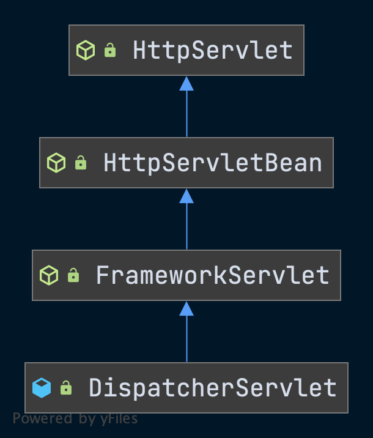

# Spring MVC与Web环境

## Spring MVC概述

- Spring 为展现层提供的基于 MVC 设计理念的优秀的Web 框架，是目前最主流的 MVC 框架之一。
- Spring 3.0 后全面超越 Struts2，成为最优秀的 MVC 框架。
- Spring MVC 通过一套 MVC 注解，让 POJO 成为处理请求的控制器，而无须实现任何接口。
- 支持 REST 风格的 URL 请求。
- 采用了松散耦合可插拔组件结构，比其他 MVC 框架更具扩展性和灵活性。

### MVC模式

**模型**

- 封装应用数据状态。
- 响应数据状态查询。
- 提供应用功能接口。
- 数据状态变化通知视图。

**控制器**

- 定义应用的功能。
- 映射用户动作到数据更新。
- 选择对应的视图。
- 一个控制器对应一组功能。

**视图**

- 通过视图展现应用数据。
- 向应用数据提交更新请求。
- 向控制器提交用户动作。
- 运行控制器选择不同的视图。


### Spring MVC 基本使用要点

- 在`web.xml`中配置`DispatcherServlet`，前端控制器。
- 在Bean定义中配置Web请求和`Controller`的对应关系。
- 配置各种视图的展现方式。
- 使用`Controller`的时候，会看到`ModelAndView`数据的生成，还会看到把`ModelAndView`数据交给相应的`View`来进行呈现。

## Web环境中的Spring MVC

Spring IoC是一个独立的模块，它并不是直接在Web容器中发挥作用的，如果要在Web环境中使用IoC容器，需要Spring为IoC设计一个启动过程，把IoC容器导入，并在Web容器中建立起来。

### Web环境下启动IoC容器

所谓的启动过程，就是在Web环容器的启动的时候完成IoC容器的启动。

- 启动Web容器环境。
- 使用特定的拦截器，将 IoC容器载入到Web环境中。
- 完成IoC容器初始化。

#### Tomcat的web.xml

- 首先定义了一个Servlet对象，它是Spring MVC的`DispatcherServlet`，是MVC中很重要的一个类，起着分发请求的作用。
- 为`DispatcherServlet`定义了**对应的URL映射**，这些URL映射为这个Servlet**指定了需要处理的HTTP请求**。
- `context-param`参数的配置用来指定Spring IoC容器读取**Bean定义**的XML文件的路径。
- 作为Spring MVC的启动类，`ContextLoaderListener`被定义为一个**监听器**，这个监听器是**与Web服务器的生命周期相关联的**，由`ContextLoaderListener`监听器负责**完成IoC容器在Web环境中的启动工作**。
- `DispatchServlet`和`ContextLoaderListener`提供了**在Web容器中对Spring的接口**，这些接口与Web容器耦合是通过`ServletContext`来实现的。
- `ServletContext`为Spring的IoC容器提供了一个**宿主环境**，在宿主环境中，Spring MVC建立起一个IoC容器的体系。
- IoC容器体系是通过`ContextLoaderListener`的初始化来建立的，在建立IoC容器体系后，把`DispatchServlet`作为Spring MVC处理**Web请求的转发器建立起来，从而完成响应HTTP请求的准备**。
- 

```xml
<!-- 配置 DispatcherServlet -->
<servlet>
  <servlet-name>dispatcherServlet</servlet-name>
  <servlet-class>org.springframework.web.servlet.DispatcherServlet</servlet-class>
  <!-- 配置 DispatcherServlet 的一个初始化参数: 配置 SpringMVC 配置文件的位置和名称 -->
  <!-- 
            实际上也可以不通过 contextConfigLocation 来配置 SpringMVC 的配置文件, 而使用默认的.
            默认的配置文件为: /WEB-INF/<servlet-name>-servlet.xml
        -->
  <init-param>
    <param-name>contextConfigLocation</param-name>
    <param-value>classpath:springmvc.xml</param-value>
  </init-param>
  <load-on-startup>1</load-on-startup>
</servlet>

<!--前端控制器拦截的请求-->
<servlet-mapping>
  <servlet-name>dispatcherServlet</servlet-name>
  <url-pattern>/*</url-pattern>
</servlet-mapping>
<listener>
  <listener-class>
    org.springframework.web.context.ContextLoaderListener
  </listener-class>
</listener>
...
```

## 上下文在Web容器中的启动

### IoC容器启动的基本过程

>IoC容器的启动过程就是建立上下文的过程，该上下文是与ServletContext相伴而生的，同时也是IoC容器在Web应用环境中的具体表现之一。

- 由`ContextLoaderListener`启动的上下文为**根上下文**。
- 在根上下文的基础上，还有一个与Web MVC相关的上下文用来保存控制器`DispatcherServlet`需要的MVC对象，作为根上下文的**子上下文**，构成一个层次化的上下文体系。
- `ContextLoaderListener`是由Spring提供的用于在Web容器中建立IoC容器服务的类，实现了`ServletContextListener`接口。
  - `ServletContextListener`是在`Servlet API`中定义的，提供了**与Servlet生命周期结合的回调**，比如`contextInitialized`方法和`contextDestroyed`方法。
- 在`ContextLoader`中，完成了两个IoC容器建立的基本过程，一个是在Web容器中建立起**双亲IoC容器**，另一个是生成相应的`WebApplicationContext`并将其**初始化**。


### Web容器中的上下文设计

- 为了方便在Web环境中使用IoC容器，Spring为Web应用提供了上下文的扩展接口`WebApplicationContext`来满足启动过程的需要。
- `WebApplicationContext`定义了一个`getServletContext`方法，通过这个方法可以得到当前Web容器的Servlet上下文环境，通过这个方法，相当于提供了一个**Web容器级别的全局环境**。
- **在启动过程中，Spring会使用一个默认的WebApplicationContext实现作为IoC容器**。
- `XmlWebApplicationContext`是从`ApplicationContext`继承下来的，在基本的ApplicationContext功能的基础上，**增加了对Web环境和XML配置定义的处理**。

#### WebApplicationContex结构层次


#### WebApplicationContext接口源码

```java
public interface WebApplicationContext extends ApplicationContext {

  // 定义用于在ServletContext中存取根上下文的常量
	String ROOT_WEB_APPLICATION_CONTEXT_ATTRIBUTE = WebApplicationContext.class.getName() + ".ROOT";

	String SCOPE_REQUEST = "request";

	String SCOPE_SESSION = "session";

	String SCOPE_APPLICATION = "application";

	String SERVLET_CONTEXT_BEAN_NAME = "servletContext";

	String CONTEXT_PARAMETERS_BEAN_NAME = "contextParameters";

	String CONTEXT_ATTRIBUTES_BEAN_NAME = "contextAttributes";

	@Nullable
  // 获取web容器的ServletContext的方法。
	ServletContext getServletContext();

}
```

#### XmlWebApplicationContext源码

```java
public class XmlWebApplicationContext extends AbstractRefreshableWebApplicationContext {

	// 默认根容器的配置文件路径
	public static final String DEFAULT_CONFIG_LOCATION = "/WEB-INF/applicationContext.xml";

	// 默认的配置文件位置在/WEB-INF/目录下
	public static final String DEFAULT_CONFIG_LOCATION_PREFIX = "/WEB-INF/";

	// 默认的配置文件后缀名.xml文件
	public static final String DEFAULT_CONFIG_LOCATION_SUFFIX = ".xml";

	@Override
	protected void loadBeanDefinitions(DefaultListableBeanFactory beanFactory) throws BeansException, IOException {
		// 定义XmlBean定义解析器
		XmlBeanDefinitionReader beanDefinitionReader = new XmlBeanDefinitionReader(beanFactory);
		// 设置环境变量
		beanDefinitionReader.setEnvironment(getEnvironment());
    // 设置资源加载器
		beanDefinitionReader.setResourceLoader(this);
    // 设置对象解析器
		beanDefinitionReader.setEntityResolver(new ResourceEntityResolver(this));
		// 初始化Bean定义解析器
		initBeanDefinitionReader(beanDefinitionReader);
    // 加载Bean定义
		loadBeanDefinitions(beanDefinitionReader);
	}

	protected void initBeanDefinitionReader(XmlBeanDefinitionReader beanDefinitionReader) {
	}

	protected void loadBeanDefinitions(XmlBeanDefinitionReader reader) throws IOException {
		String[] configLocations = getConfigLocations();
		if (configLocations != null) {
			for (String configLocation : configLocations) {
				reader.loadBeanDefinitions(configLocation);
			}
		}
	}

	@Override
	protected String[] getDefaultConfigLocations() {
		if (getNamespace() != null) {
			return new String[] {DEFAULT_CONFIG_LOCATION_PREFIX + getNamespace() + DEFAULT_CONFIG_LOCATION_SUFFIX};
		}
		else {
			return new String[] {DEFAULT_CONFIG_LOCATION};
		}
	}

}
```

### ContextLoader的设计与实现

- `ContextLoaderListener`通过使用`ContextLoader`来完成实际的`WebApplicationContext`初始化工作。
- `ContextLoader`就像Spring应用程序在Web容器中的启动器。

#### 启动过程

1. 从Servlet事件中得到`ServletContext`。

2. 读取配置在web.xml中的各个**相关的属性值**。

3. `ContextLoader`会实例化`WebApplicationContext`，并完成其载入和初始化过程。

4. 这个被初始化的第一个上下文作为**根上下文**而存在，这个根上下文载入后，被绑定到Web应用程序的`ServletContext`上。

   - 任何需要访问**根上下文**的应用程序代码都可以从`WebApplicationContextUtils`类的静态方法中得到。

     `WebApplicationContextUtils#getWebApplicationContext`

     ```java
     @Nullable
     public static WebApplicationContext getWebApplicationContext(ServletContext sc) {
       return getWebApplicationContext(sc, WebApplicationContext.ROOT_WEB_APPLICATION_CONTEXT_ATTRIBUTE);
     }
     ```

     

#### 根上下文的载入过程

- `ContextLoaderListener`监听器的回调方法响应Web容器创建和销毁的事件。
- 在`ContextLoaderListener#contextInitialized`方法中，做了IoC容器初始化的操作。

- `ContextLoaderListener#contextInitialized`中，调用了父类的`initWebApplicationContext`方法，由`ContextLoader#initWebApplicationContext`完成真正的初始化工作。
- 存取**根上下文**的路径是由Spring预先设置好的，在`ROOT_WEB_APPLICATION_CONTEXT_ATTRIBUTE`的属性中定义这个路径。
- 通过`web.xml#contextClass`参数指定特定的IoC容器，如果没有，将使用默认的IoC容器`XmlWebApplicationContext`。


```java
String ROOT_WEB_APPLICATION_CONTEXT_ATTRIBUTE = WebApplicationContext.class.getName() + ".ROOT";
```

```java
@Override
public void contextInitialized(ServletContextEvent event) {
   // 调用父类方法，传入ServletContext
   initWebApplicationContext(event.getServletContext());
}
```

```java
public WebApplicationContext initWebApplicationContext(ServletContext servletContext) {
  // 确保初始化的时候容器中没有根上下文，有则抛出异常。
  if (servletContext.getAttribute(WebApplicationContext.ROOT_WEB_APPLICATION_CONTEXT_ATTRIBUTE) != null) {
    throw new IllegalStateException(
      "Cannot initialize context because there is already a root application context present - " +
      "check whether you have multiple ContextLoader* definitions in your web.xml!");
  }

  servletContext.log("Initializing Spring root WebApplicationContext");
  Log logger = LogFactory.getLog(ContextLoader.class);
  if (logger.isInfoEnabled()) {
    logger.info("Root WebApplicationContext: initialization started");
  }
  long startTime = System.currentTimeMillis();

  try {
    // 创建容器
    if (this.context == null) {
      this.context = createWebApplicationContext(servletContext);
    }
    // 为容器配置父容器
    if (this.context instanceof ConfigurableWebApplicationContext) {
      ConfigurableWebApplicationContext cwac = (ConfigurableWebApplicationContext) this.context;
      if (!cwac.isActive()) {
        if (cwac.getParent() == null) {
          ApplicationContext parent = loadParentContext(servletContext);
          cwac.setParent(parent);
        }
        // 配置并调用容器的Refresh方法初始化容器
        configureAndRefreshWebApplicationContext(cwac, servletContext);
      }
    }
    // 设置当前容器为ServletContext的根容器
    servletContext.setAttribute(WebApplicationContext.ROOT_WEB_APPLICATION_CONTEXT_ATTRIBUTE, this.context);

    ClassLoader ccl = Thread.currentThread().getContextClassLoader();
    if (ccl == ContextLoader.class.getClassLoader()) {
      currentContext = this.context;
    }
    else if (ccl != null) {
      currentContextPerThread.put(ccl, this.context);
    }

    if (logger.isInfoEnabled()) {
      long elapsedTime = System.currentTimeMillis() - startTime;
      logger.info("Root WebApplicationContext initialized in " + elapsedTime + " ms");
    }

    return this.context;
  }
  catch (RuntimeException | Error ex) {
    logger.error("Context initialization failed", ex);
    servletContext.setAttribute(WebApplicationContext.ROOT_WEB_APPLICATION_CONTEXT_ATTRIBUTE, ex);
    throw ex;
  }
}

/**
 * 创建根上下文
 */
protected WebApplicationContext createWebApplicationContext(ServletContext sc) {
  // 决定使用什么样的类作为上下文
  Class<?> contextClass = determineContextClass(sc);
  if (!ConfigurableWebApplicationContext.class.isAssignableFrom(contextClass)) {
    throw new ApplicationContextException("Custom context class [" + contextClass.getName() +
                                          "] is not of type [" + ConfigurableWebApplicationContext.class.getName() + "]");
  }
  // 实例化根上下文
  return (ConfigurableWebApplicationContext) BeanUtils.instantiateClass(contextClass);
}

/**
 * 决定上下文的类
 */
protected Class<?> determineContextClass(ServletContext servletContext) {
  // 从初始化参数中获取参数
  String contextClassName = servletContext.getInitParameter(CONTEXT_CLASS_PARAM);
  if (contextClassName != null) {
    try {
      return ClassUtils.forName(contextClassName, ClassUtils.getDefaultClassLoader());
    }
    catch (ClassNotFoundException ex) {
      throw new ApplicationContextException(
        "Failed to load custom context class [" + contextClassName + "]", ex);
    }
  }
  else {
    // 启用默认容器，XmlWebApplicationContext
    contextClassName = defaultStrategies.getProperty(WebApplicationContext.class.getName());
    try {
      return ClassUtils.forName(contextClassName, ContextLoader.class.getClassLoader());
    }
    catch (ClassNotFoundException ex) {
      throw new ApplicationContextException(
        "Failed to load default context class [" + contextClassName + "]", ex);
    }
  }
}
```

## Spring MVC的设计与实现

### Spring MVC的应用场景

- 使用Spring MVC，在web.xml中，需要配置`ContextLoaderListener`之外，还要对`DispatcherServlet`进行配置。
- `DispatcherServlet`实现的是Sun的J2EE核心模式中的**前端控制器模式**`Front Controller`。
- `DispatcherServlet`作为一个前端控制器，所有的Web请求都需要通过它来**处理**，**进行转发**、**匹配**、数据处理后，并转由页面进行展现，是Spring MVC实现中最为核心的部分。
- 对于不同的Web请求的映射需求，Spring MVC提供了不同的`HandlerMapping`的实现，可以让应用开发选取不同的映射策略。在默认的情况下，`DispatcherSevlet`选取了`BeanNameUrlHandlerMapping`作为映射策略实现。
- Spring MVC提供了各种Controller的实现来供应用扩展和使用，以应对不同的控制器使用场景，这些Controller控制器的需要实现`handleRequest`接口方法，并返回`ModelAndView`对象。
- Spring MVC提供了各种视图实现，比如常用的**JSP视图**、**Excel视图**、**PDF视图**等。
- Spring MVC提供了**拦截器**供应用使用，允许应用对Web请求进行拦截，以及**前置处理和后置处理**。
- 针对Web应用中常用到的国际化支持，Spring MVC提供了`LocalResolver`实现和接口，应用可以**定制自己的区域解析器**。


### Spring MVC 设计概览

- 在完成对`ContextLoaderListener`的初始化以后，Web容器开始初始化`DispatcherServlet`，这个初始化的启动与在web.xml中对**载入次序**的定义有关。
- `DispatcherServlet`会**建立自己的上下文**来持有Spring MVC的Bean对象，在建立这个自己持有的IoC容器时，会**从ServletContext中得到根上下文作为DispatcherServlet持有上下文的双亲上下文**。
- `DispatcherServlet`有了**根上下文**后对自己持有的上下文进行初始化，并将自己持有的这个上下文保存到`ServletContext`中，供以后检索和使用。

#### 类继承关系

`DispatcherServlet`通过继承`FrameworkServlet`和`HttpServletBean`而继承了`HttpServlet`，通过使用`Servlet` API来**对HTTP请求进行响应**，成为Spring MVC的前端处理器，同时成为**MVC模块与Web容器集成的处理前端**。



#### DispatcherServlet的处理过程

DispatcherServlet的工作大致分为两种

- 初始化

- 对HTTP请求进行响应


### DispatcherServlet的启动和初始化

- 作为Servlet, `DispatcherServlet`的启动与Servlet的启动过程是相联系的。
- 在Servlet的初始化过程中，Servlet的`init`方法会被调用，以进行初始化。
- `DispatcherServlet`的基类`HttpServletBean`中`init`方法实现了这个初始化过程。
- 在一个Web应用中，往往可以容纳多个Servlet存在。与此相对应，对于应用在Web容器中的上下体系，一个根上下文可以作为许多Servlet上下文的双亲上下文。

#### HttpServletBean的初始化

1. 读取配置在`ServletContext`中的Bean属性参数，这些属性参数设置在`web.xml`的Web容器**初始化参数**中。
2. 执行`DispatcherServlet`持有的IoC容器的初始化过程，一个新的上下文被建立起来，这个**DispatcherServlet持有的上下文被设置为根上下文的子上下文**。可以认为，根上下文是和Web应用相对应的一个上下文，而DispatcherServlet持有的上下文是和Servlet对应的一个上下文。
3. `DispatcherServlet`持有的上下文被建立起来以后，也需要和其他IoC容器一样完成**初始化**，这个初始化也是通过`refresh`方法来完成的。
4. `DispatcherServlet`给这个自己持有的上下文命名，并把它设置到Web容器的上下文中，这个名称和在`web.xml`中设置的DispatcherServlet的Servlet名称有关，从而**保证了这个上下文在Web环境上下文体系中的唯一性**。

`HttpServletBean#init`

```java
@Override
public final void init() throws ServletException {

  // 获取Servlet的初始化参数，对Bean属性进行配置
  PropertyValues pvs = new ServletConfigPropertyValues(getServletConfig(), this.requiredProperties);
  if (!pvs.isEmpty()) {
    try {
      BeanWrapper bw = PropertyAccessorFactory.forBeanPropertyAccess(this);
      ResourceLoader resourceLoader = new ServletContextResourceLoader(getServletContext());
      bw.registerCustomEditor(Resource.class, new ResourceEditor(resourceLoader, getEnvironment()));
      initBeanWrapper(bw);
      bw.setPropertyValues(pvs, true);
    }
    catch (BeansException ex) {
      if (logger.isErrorEnabled()) {
        logger.error("Failed to set bean properties on servlet '" + getServletName() + "'", ex);
      }
      throw ex;
    }
  }

  // 调用子类的initServletBean进行具体的初始化
  initServletBean();
}
```

`FrameworkServlet#initServletBean`

```java
@Override
protected final void initServletBean() throws ServletException {
  getServletContext().log("Initializing Spring " + getClass().getSimpleName() + " '" + getServletName() + "'");
  if (logger.isInfoEnabled()) {
    logger.info("Initializing Servlet '" + getServletName() + "'");
  }
  long startTime = System.currentTimeMillis();
  try {
    this.webApplicationContext = initWebApplicationContext();
    // 初始化上下文
    initFrameworkServlet();
  }
  catch (ServletException | RuntimeException ex) {
    logger.error("Context initialization failed", ex);
    throw ex;
  }
  if (logger.isDebugEnabled()) {
    String value = this.enableLoggingRequestDetails ?
      "shown which may lead to unsafe logging of potentially sensitive data" :
    "masked to prevent unsafe logging of potentially sensitive data";
    logger.debug("enableLoggingRequestDetails='" + this.enableLoggingRequestDetails +
                 "': request parameters and headers will be " + value);
  }
  if (logger.isInfoEnabled()) {
    logger.info("Completed initialization in " + (System.currentTimeMillis() - startTime) + " ms");
  }
}

protected WebApplicationContext initWebApplicationContext() {
  // 获取根容器
  WebApplicationContext rootContext =
    WebApplicationContextUtils.getWebApplicationContext(getServletContext());
  WebApplicationContext wac = null;
  if (this.webApplicationContext != null) {
    wac = this.webApplicationContext;
    if (wac instanceof ConfigurableWebApplicationContext) {
      ConfigurableWebApplicationContext cwac = (ConfigurableWebApplicationContext) wac;
      if (!cwac.isActive()) {
        if (cwac.getParent() == null) {
					// 设置根容器为父容器
          cwac.setParent(rootContext);
        }
        configureAndRefreshWebApplicationContext(cwac);
      }
    }
  }
  if (wac == null) {
    wac = findWebApplicationContext();
  }
  if (wac == null) {
    // No context instance is defined for this servlet -> create a local one
    wac = createWebApplicationContext(rootContext);
  }
  if (!this.refreshEventReceived) {
		// refresh Bean
    synchronized (this.onRefreshMonitor) {
      onRefresh(wac);
    }
  }
  if (this.publishContext) {
    // 获取配置的容器名字并放到ServletContext中
    String attrName = getServletContextAttributeName();
    getServletContext().setAttribute(attrName, wac);
  }
  return wac;
}
```

#### FrameworkServlet

- `DispatcherServlet`的上下文建立过程与前面建立**根上下文**的过程非常类似。
- 建立`DispatcherServlet`的上下文，需要把**根上下文**作为参数传递给FrameworkServlet。
- 通过反射技术来实例化上下文对象，并为它设置参数。
- 根据默认的配置，这个上下文对象也是`XmlWebApplicationContext`对象，这个类型是在`DEFAULT_CONTEXT_CLASS`参数中设置的。
- 在实例化结束以后，需要为这个上下文对象设置好一些**基本的配置**，这些配置包括它的**双亲上下文**、**Bean定义配置的文件位置**等。
- 通过调用IoC容器的refresh方法来完成IoC容器的最终初始化。
- 对**MVC**的初始化是在`DispatcherServlet`的`initStrategies`中完成的。

`FrameworkServlet#createWebApplicationContext`

```java
protected WebApplicationContext createWebApplicationContext(@Nullable ApplicationContext parent) {
  Class<?> contextClass = getContextClass();
  if (!ConfigurableWebApplicationContext.class.isAssignableFrom(contextClass)) {
    throw new ApplicationContextException(
      "Fatal initialization error in servlet with name '" + getServletName() +
      "': custom WebApplicationContext class [" + contextClass.getName() +
      "] is not of type ConfigurableWebApplicationContext");
  }
  ConfigurableWebApplicationContext wac =
    (ConfigurableWebApplicationContext) BeanUtils.instantiateClass(contextClass);
  // 设置环境
  wac.setEnvironment(getEnvironment());
  // 设置根容器
  wac.setParent(parent);
  String configLocation = getContextConfigLocation();
  if (configLocation != null) {
    wac.setConfigLocation(configLocation);
  }
  // 通过refresh来调用容器的初始化过程
  configureAndRefreshWebApplicationContext(wac);
  return wac;
}
```

`DispatcherServlet#onRefresh`

```java
@Override
protected void onRefresh(ApplicationContext context) {
  initStrategies(context);
}

protected void initStrategies(ApplicationContext context) {
  initMultipartResolver(context);
  // 初始化支持国际化
  initLocaleResolver(context);
  initThemeResolver(context);
  // 初始化支持请求映射
  initHandlerMappings(context);
  // 初始化处理器适配器
  initHandlerAdapters(context);
  // 初始化异常处理器
  initHandlerExceptionResolvers(context);
  initRequestToViewNameTranslator(context);
  // 初始化视图解析器
  initViewResolvers(context);
  initFlashMapManager(context);
}
```

### MVC处理HTTP分发请求

#### HandlerMapping的配置和设计原理

xx

#### 使用HandlerMapping完成请求的映射处理

xx

#### Spring MVC对HTTP请求的分发处理

xxx


## Spring MVC视图的呈现

xx