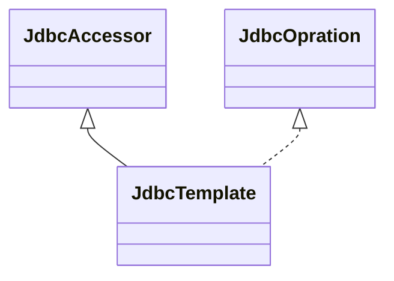
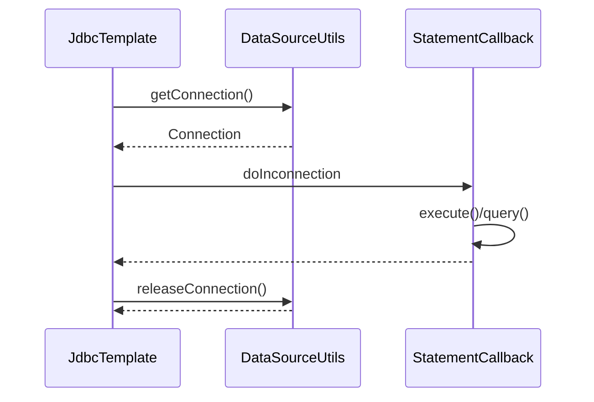
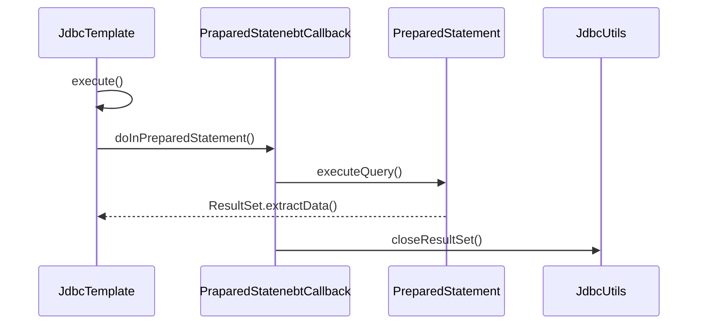

# 数据库操作组件的实现

## Spring JDBC的设计与实现

### 应用场景

- 通过JDBC, Java语言的客户端可以访问数据库的数据，进行增删改查的操作。
- JDBC已经能够满足大部分用户操作数据库数据的需求，但在使用JDBC时，应用必须自己来管理数据库资源。
  - 数据库连接。
  - 数据库提交。
  - 处理数据库抛出的异常。
- Spring对数据库操作需求提供了很好的支持，并在原始的JDBC基础上，构建了一个**抽象层**，提供了许多使用JDBC的**模板**和**驱动模块**，为Spring应用操作**关系数据库**提供了更大的便利。

### 设计概要

#### 模板模式

- 在模板模式中，一般会定义一个抽象类，在**抽象类**中定义了模板方法`TemplateMothod`。
- 在模板方法中，会对处理过程进行描述，同时，这个描述中的一些具体方法。
- 模板的使用者只需要设计一个具体的类，继承模板类，然后定制那些具体方法，这样**既能重用整个模板的处理框架，又能发挥具体子类的灵活性**。

## Spring JDBC中模板类的设计与实现

### 设计原理

- 在Spring JDBC中，`JdbcTemplate`是一个主要的模板类。
- `JdbcTemplate`继承了基类`JdbcAccessor`和接口类`JdbcOperation`。
- 在基类`JdbcAccessor`的设计中，对`DataSource`**数据源进行管理和配置**。
- 在`JdbcOperation`接口中，定义了**通过JDBC操作数据库的基本操作方法**，而`JdbcTemplate`提供这些接口方法的实现。




### JdbcTemplate的基本使用

- 在Spring JDBC中，`JdbcTemplate`是操作数据库的类，提供了许多便利的数据库操作方法。

- 在Spring中，有许多类似于JdbcTemplate的模板类，使用方法也都非常类似，比如在ORM包中会看到的`HibernateTemplate`等。

- Spring中设计和实现好的模板类都是通过**回调函数**的使用来完成其功能的，对满足应用的数据库操作需求而言，应用程序只需要**在回调接口中实现自己需要的定制行为**。

- `JdbcTemplate`中重写了很多`execute`方法，封装对数据库的不同操作。

  

```java
JdbcTemplate temp = new JdbcTemplate(dataSource);
class ExecuteStatementCallBack implements StatementCallBack<Object>, SqlProvider() {
  // xxxx 实现
}
temp.execute(new ExecuteStatementCallBack());
```


### JdbcTemplate的execute实现

- `JdbcTemplate.execute()`是经常被调用用来执行SQL语句的，主要包含如下几个过程。
  - 需要取得数据库`Connection`。
  - 根据应用对数据库操作的需要创建数据库的`Statement`。
  - 对数据库操作进行**回调**，**处理数据库异常**。
  - 最后把数据库`Connection`关闭等。



`JdbcTemplate#execute`

```java
/**
 * 执行输入的SQL语句
 **/
@Override
public void execute(final String sql) throws DataAccessException {
  if (logger.isDebugEnabled()) {
    logger.debug("Executing SQL statement [" + sql + "]");
  }

  /**
		 * Callback to execute the statement.
		 */
  class ExecuteStatementCallback implements StatementCallback<Object>, SqlProvider {
    @Override
    @Nullable
    public Object doInStatement(Statement stmt) throws SQLException {
      stmt.execute(sql);
      return null;
    }
    @Override
    public String getSql() {
      return sql;
    }
  }

  execute(new ExecuteStatementCallback());
}

/**
 * 使用java.sql.Statement处理静态SQL语句的方法
 **/
@Override
@Nullable
public <T> T execute(StatementCallback<T> action) throws DataAccessException {
  Assert.notNull(action, "Callback object must not be null");
  // 这里取得数据库的Connection，这个数据库的Connection已经在Spring的事务管理之下
  Connection con = DataSourceUtils.getConnection(obtainDataSource());
  Statement stmt = null;
  try {
    // 创建statement
    stmt = con.createStatement();
    applyStatementSettings(stmt);
    // 调用回调函数
    T result = action.doInStatement(stmt);
    handleWarnings(stmt);
    return result;
  }
  catch (SQLException ex) {
		// 如果捕捉到数据库异常，把数据库Connection释放，同时抛出一个经过Spring转换过的Spring数据库异常
    String sql = getSql(action);
    JdbcUtils.closeStatement(stmt);
    stmt = null;
    DataSourceUtils.releaseConnection(con, getDataSource());
    con = null;
    throw translateException("StatementCallback", sql, ex);
  }
  finally {
    // 关闭statement、释放连接
    JdbcUtils.closeStatement(stmt);
    DataSourceUtils.releaseConnection(con, getDataSource());
  }
}
```

### JdbcTemplate的query实现

- `JdbcTemplate`中给出的`query`、`update`等常用方法的实现，大多都是依赖于`execute`方法。




## Spring JDBC中RDBMS操作对象的实现

xx

## Spring ORM的设计与实现

xxx

## Spring驱动Hibernate的设计与实现

xxx

## Spring驱动iBatis的设计与实现

xxx