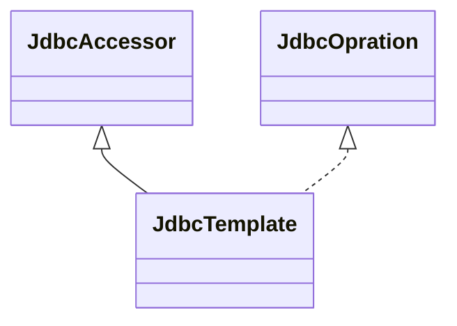
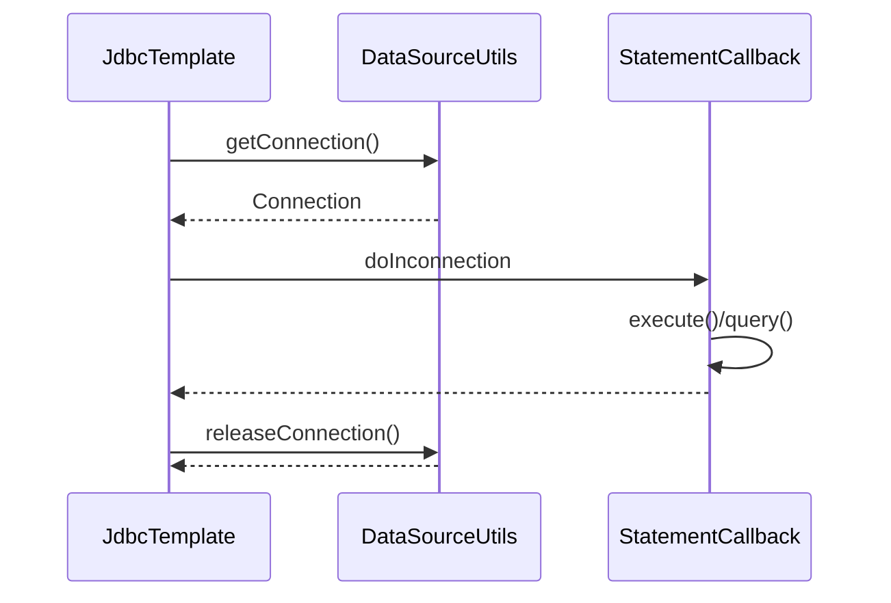
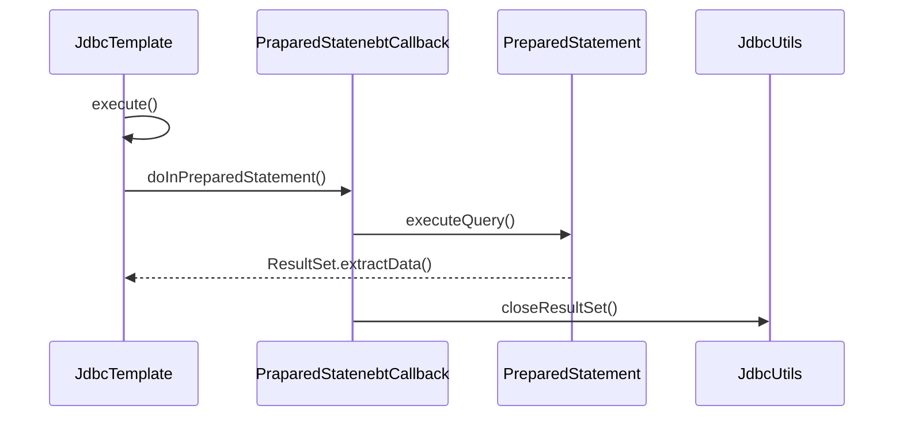
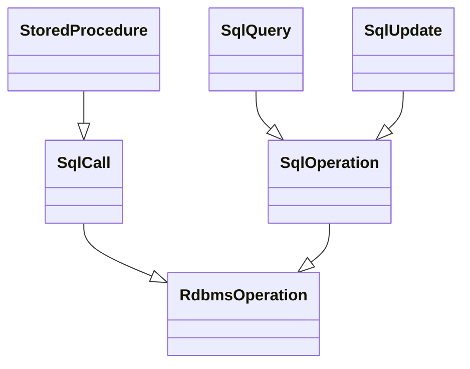
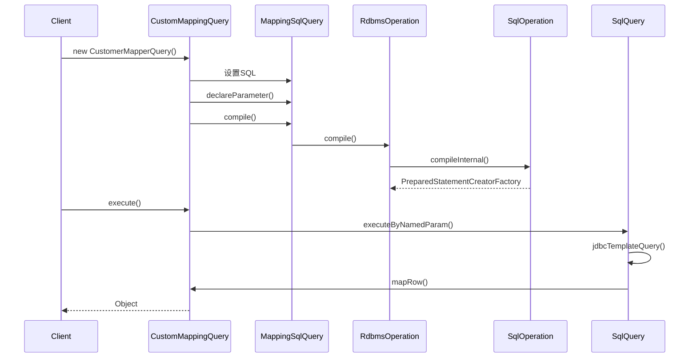
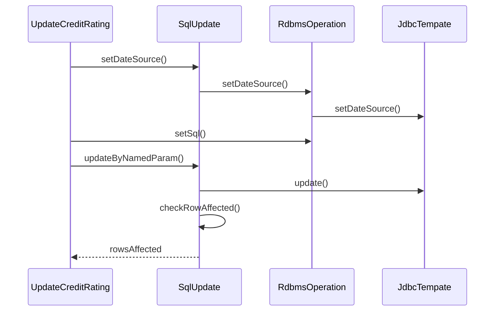
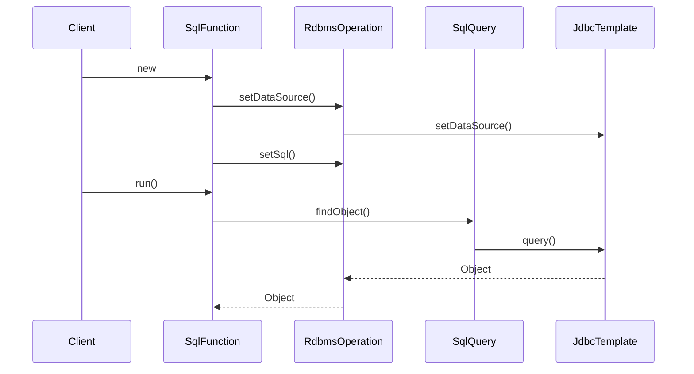
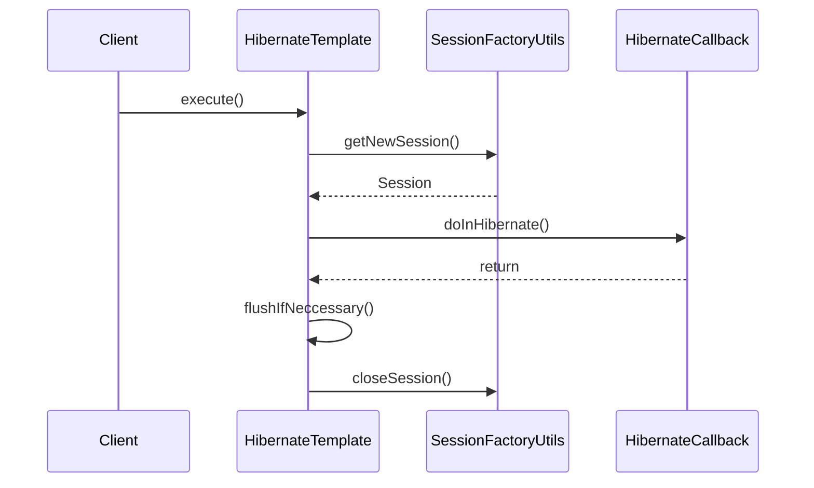
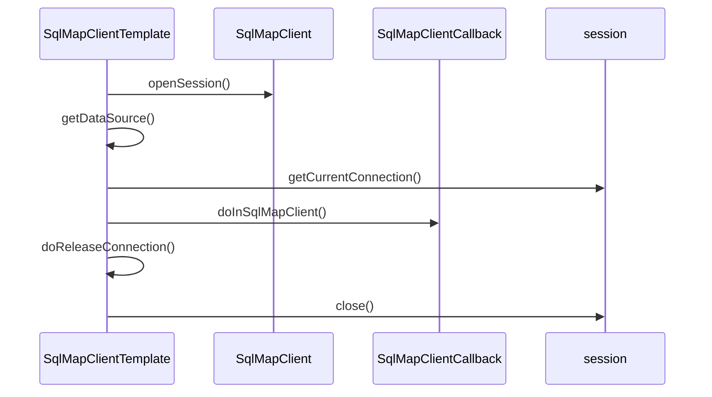

# 数据库操作组件的实现

## Spring JDBC的设计与实现

### 应用场景

- 通过JDBC, Java语言的客户端可以访问数据库的数据，进行增删改查的操作。
- JDBC已经能够满足大部分用户操作数据库数据的需求，但在使用JDBC时，应用必须自己来管理数据库资源。
  - 数据库连接。
  - 数据库提交。
  - 处理数据库抛出的异常。
- Spring对数据库操作需求提供了很好的支持，并在原始的JDBC基础上，构建了一个**抽象层**，提供了许多使用JDBC的**模板**和**驱动模块**，为Spring应用操作**关系数据库**提供了更大的便利。

### 设计概要

#### 模板模式

- 在模板模式中，一般会定义一个抽象类，在**抽象类**中定义了模板方法`TemplateMothod`。
- 在模板方法中，会对处理过程进行描述，同时，这个描述中的一些具体方法。
- 模板的使用者只需要设计一个具体的类，继承模板类，然后定制那些具体方法，这样**既能重用整个模板的处理框架，又能发挥具体子类的灵活性**。

## Spring JDBC中模板类的设计与实现

### 设计原理

- 在Spring JDBC中，`JdbcTemplate`是一个主要的模板类。
- `JdbcTemplate`继承了基类`JdbcAccessor`和接口类`JdbcOperation`。
- 在基类`JdbcAccessor`的设计中，对`DataSource`**数据源进行管理和配置**。
- 在`JdbcOperation`接口中，定义了**通过JDBC操作数据库的基本操作方法**，而`JdbcTemplate`提供这些接口方法的实现。




### JdbcTemplate的基本使用

- 在Spring JDBC中，`JdbcTemplate`是操作数据库的类，提供了许多便利的数据库操作方法。

- 在Spring中，有许多类似于JdbcTemplate的模板类，使用方法也都非常类似，比如在ORM包中会看到的`HibernateTemplate`等。

- Spring中设计和实现好的模板类都是通过**回调函数**的使用来完成其功能的，对满足应用的数据库操作需求而言，应用程序只需要**在回调接口中实现自己需要的定制行为**。

- `JdbcTemplate`中重写了很多`execute`方法，封装对数据库的不同操作。

- `JdbcTemplate`提供的许多现成的查询方法，比如`queryForInt`、`queryForObject`等。

  

```java
JdbcTemplate temp = new JdbcTemplate(dataSource);
class ExecuteStatementCallBack implements StatementCallBack<Object>, SqlProvider() {
  // xxxx 实现
}
temp.execute(new ExecuteStatementCallBack());
```


### JdbcTemplate的execute实现

- `JdbcTemplate.execute()`是经常被调用用来执行SQL语句的，主要包含如下几个过程。
  - 需要取得数据库`Connection`。
  - 根据应用对数据库操作的需要创建数据库的`Statement`。
  - 对数据库操作进行**回调**，**处理数据库异常**。
  - 最后把数据库`Connection`关闭等。



`JdbcTemplate#execute`

```java
/**
 * 执行输入的SQL语句
 **/
@Override
public void execute(final String sql) throws DataAccessException {
  if (logger.isDebugEnabled()) {
    logger.debug("Executing SQL statement [" + sql + "]");
  }

  /**
		 * Callback to execute the statement.
		 */
  class ExecuteStatementCallback implements StatementCallback<Object>, SqlProvider {
    @Override
    @Nullable
    public Object doInStatement(Statement stmt) throws SQLException {
      stmt.execute(sql);
      return null;
    }
    @Override
    public String getSql() {
      return sql;
    }
  }

  execute(new ExecuteStatementCallback());
}

/**
 * 使用java.sql.Statement处理静态SQL语句的方法
 **/
@Override
@Nullable
public <T> T execute(StatementCallback<T> action) throws DataAccessException {
  Assert.notNull(action, "Callback object must not be null");
  // 这里取得数据库的Connection，这个数据库的Connection已经在Spring的事务管理之下
  Connection con = DataSourceUtils.getConnection(obtainDataSource());
  Statement stmt = null;
  try {
    // 创建statement
    stmt = con.createStatement();
    applyStatementSettings(stmt);
    // 调用回调函数
    T result = action.doInStatement(stmt);
    handleWarnings(stmt);
    return result;
  }
  catch (SQLException ex) {
		// 如果捕捉到数据库异常，把数据库Connection释放，同时抛出一个经过Spring转换过的Spring数据库异常
    String sql = getSql(action);
    JdbcUtils.closeStatement(stmt);
    stmt = null;
    DataSourceUtils.releaseConnection(con, getDataSource());
    con = null;
    throw translateException("StatementCallback", sql, ex);
  }
  finally {
    // 关闭statement、释放连接
    JdbcUtils.closeStatement(stmt);
    DataSourceUtils.releaseConnection(con, getDataSource());
  }
}
```

### JdbcTemplate的query实现

- `JdbcTemplate`中给出的`query`、`update`等常用方法的实现，大多都是依赖于`execute`方法。
- `query`方法是通过使用`PreparedStatementCallback`的回调方法`doInPreparedStatement`来实现的。



```java
@Nullable
public <T> T query(
  PreparedStatementCreator psc, @Nullable final PreparedStatementSetter pss, final ResultSetExtractor<T> rse)
  throws DataAccessException {

  Assert.notNull(rse, "ResultSetExtractor must not be null");
  logger.debug("Executing prepared SQL query");

  // 调用excute并设置excute的回调函数
  return execute(psc, new PreparedStatementCallback<T>() {
    @Override
    @Nullable
    public T doInPreparedStatement(PreparedStatement ps) throws SQLException {
      // 准备查询结果集
      ResultSet rs = null;
      try {
        if (pss != null) {
          pss.setValues(ps);
        }
        // 执行SQL查询
        rs = ps.executeQuery();
        // 返回结果集
        return rse.extractData(rs);
      }
      finally {
        // 关闭查询记录集
        JdbcUtils.closeResultSet(rs);
        if (pss instanceof ParameterDisposer) {
          ((ParameterDisposer) pss).cleanupParameters();
        }
      }
    }
  });
}
```

### 使用数据库Connection

- Spring `JdbcTemplate`中使用了辅助类`DataSourceUtils`来对数据的`Connection`进行管理。
- 实际的DataSource对象是在上下文中进行配置的，`DataSource`对象作为`JdbcTemplate`基类`JdbcAccessor`的属性，可以通过IoC容器的依赖注入设置到JdbcTemplate中。
- DataSource**缓冲池**的实现，用户可以通过定义`Apache Jakarta Commons DBCP`或者`C3P0`提供的DataSource来完成，然后在IoC容器中配置好后交给JdbcTemplate就可以使用。

`DataSourceUtils#getConnection`

```java
public static Connection getConnection(DataSource dataSource) throws CannotGetJdbcConnectionException {
  try {
    return doGetConnection(dataSource);
  }
  catch (SQLException ex) {
    // 对数据库的异常进行了封装和转换
    throw new CannotGetJdbcConnectionException("Failed to obtain JDBC Connection", ex);
  }
  catch (IllegalStateException ex) {
    throw new CannotGetJdbcConnectionException("Failed to obtain JDBC Connection: " + ex.getMessage());
  }
}

public static Connection doGetConnection(DataSource dataSource) throws SQLException {
  Assert.notNull(dataSource, "No DataSource specified");
  // 把数据库的Connection放到书屋管理器中进行管理，在TransactionSynchronizationManager中定义了ThreadLocal变量来管理线程和数量链接的关系，如果已经已经存在与当前线程绑定的链接，那么直接拿出来使用。
  ConnectionHolder conHolder = (ConnectionHolder) TransactionSynchronizationManager.getResource(dataSource);
  if (conHolder != null && (conHolder.hasConnection() || conHolder.isSynchronizedWithTransaction())) {
    conHolder.requested();
    if (!conHolder.hasConnection()) {
      logger.debug("Fetching resumed JDBC Connection from DataSource");
      conHolder.setConnection(fetchConnection(dataSource));
    }
    return conHolder.getConnection();
  }
	// 得到需要的数据库Connection，它是在Bean配置文件中定义好的
  logger.debug("Fetching JDBC Connection from DataSource");
  Connection con = fetchConnection(dataSource);

  if (TransactionSynchronizationManager.isSynchronizationActive()) {
    try {
      // Use same Connection for further JDBC actions within the transaction.
      // Thread-bound object will get removed by synchronization at transaction completion.
      ConnectionHolder holderToUse = conHolder;
      if (holderToUse == null) {
        holderToUse = new ConnectionHolder(con);
      }
      else {
        holderToUse.setConnection(con);
      }
      holderToUse.requested();
      TransactionSynchronizationManager.registerSynchronization(
        new ConnectionSynchronization(holderToUse, dataSource));
      holderToUse.setSynchronizedWithTransaction(true);
      if (holderToUse != conHolder) {
        TransactionSynchronizationManager.bindResource(dataSource, holderToUse);
      }
    }
    catch (RuntimeException ex) {
      // Unexpected exception from external delegation call -> close Connection and rethrow.
      releaseConnection(con, dataSource);
      throw ex;
    }
  }

  return con;
}
```

## Spring JDBC中RDBMS操作对象的实现

>RDBMS一般指关系数据库管理系统。

- Spring为我们提供了`org.springframework.jdbc.object`包，其中包含了`SqlQuery`、`SqlMappingQuery`、`SqlUpdate`和`StoredProcedure`等类用于面向对象的方法来访问数据库。
- 使用这些类时需要配置好`JdbcTemplate`作为其基本的操作实现，因为在它们的功能实现中，对数据库操作的实现基本上还是**依赖**于`JdbcTemplate`来完成的。
- `RdbmsOperation`的一系列子类，比如`StoreProcedure`、`SqlQuery`、`MappingSqlQuery`、`SqlUpdate`等。这些子类构成了`RDBMS`体系，为通过JDBC完成数据库操作提供了更强大的功能。



### SqlQuery的实现

- `MappingSqlQuery`将**数据库表的数据记录直接映射到一个对象集合**，类似于一个简单的O/R映射实现。



#### MappingSqlQuery

- `mapRow`方法的实现中提供的数据转换规则和Hibernate的hbm文件的作用是非常类似的。

```java
public abstract class MappingSqlQuery<T> extends MappingSqlQueryWithParameters<T> {

	public MappingSqlQuery() {
	}

	public MappingSqlQuery(DataSource ds, String sql) {
		super(ds, sql);
	}

	@Override
	@Nullable
  /**
   * 映射结果集
   **/
	protected final T mapRow(ResultSet rs, int rowNum, @Nullable Object[] parameters, @Nullable Map<?, ?> context)
			throws SQLException {

		return mapRow(rs, rowNum);
	}

	@Nullable
	protected abstract T mapRow(ResultSet rs, int rowNum) throws SQLException;

}
```

`RdbmsOperation#declareParameter`

```java
public void declareParameter(SqlParameter param) throws InvalidDataAccessApiUsageException {
  // 在编译后定义参数是无效的
  if (isCompiled()) {
    throw new InvalidDataAccessApiUsageException("Cannot add parameters once the query is compiled");
  }
  // 声明参数，将参数加入到集合中
  this.declaredParameters.add(param);
}
```

`RdbmsOperation#compile`

```java
public final void compile() throws InvalidDataAccessApiUsageException {
  // 编译一次，不重复编译
  if (!isCompiled()) {
    if (getSql() == null) {
      throw new InvalidDataAccessApiUsageException("Property 'sql' is required");
    }

    try {
      this.jdbcTemplate.afterPropertiesSet();
    }
    catch (IllegalArgumentException ex) {
      throw new InvalidDataAccessApiUsageException(ex.getMessage());
    }
		// 调用compileInternal完成具体的compile过程，并设置compiled标志位
    compileInternal();
    this.compiled = true;
    if (logger.isDebugEnabled()) {
      logger.debug("RdbmsOperation with SQL [" + getSql() + "] compiled");
    }
  }
}
```

`SqlOperation#compileInternal`

```java
@Override
protected final void compileInternal() {
  // 获得statementfactory
  this.preparedStatementFactory = new PreparedStatementCreatorFactory(resolveSql(), getDeclaredParameters());
  // 设置返回值类型
  this.preparedStatementFactory.setResultSetType(getResultSetType());
  // 是否更新
  this.preparedStatementFactory.setUpdatableResults(isUpdatableResults());
  // 是否要生成的key
  this.preparedStatementFactory.setReturnGeneratedKeys(isReturnGeneratedKeys());
  if (getGeneratedKeysColumnNames() != null) {
    // 别名映射
    this.preparedStatementFactory.setGeneratedKeysColumnNames(getGeneratedKeysColumnNames());
  }

  onCompileInternal();
}
```

`SqlQuery#executeByNamedParam`

```java
public List<T> executeByNamedParam(Map<String, ?> paramMap, @Nullable Map<?, ?> context) throws DataAccessException {
  // 验证参数
  validateNamedParameters(paramMap);
  // 获得要执行的sql语句
  ParsedSql parsedSql = getParsedSql();
  MapSqlParameterSource paramSource = new MapSqlParameterSource(paramMap);
  String sqlToUse = NamedParameterUtils.substituteNamedParameters(parsedSql, paramSource);
  // 配置好SQL语句需要的Parameters及rowMapper，这个rowMapper完成数据记录到对象的转换
  Object[] params = NamedParameterUtils.buildValueArray(parsedSql, paramSource, getDeclaredParameters());
  RowMapper<T> rowMapper = newRowMapper(params, context);
  // 通过JDBCTemplate进行查询并封装结果集
  return getJdbcTemplate().query(newPreparedStatementCreator(sqlToUse, params), rowMapper);
}
```

#### 自定义实现

- 继承MappingSqlQuery。
- 构造函数传入数据源，定义SQL。
- 声明参数，编译。
- 重写mapRow方法，进行数据结果集和对象的映射。

```java
public class CustomMappingQuery extends MappingSqlQuery {

  public CustomMappingQuery(DataSource ds) {
    super(ds,"SELECT * FROM park WHERE id = ?");
    super.declareParameter(new SqlParameter("id", Types.BIGINT));
    compile();
  }

  @Override
  protected Object mapRow(ResultSet rs, int rowNum) throws SQLException {
    // TODO 映射
    return null;
  }
}

// 使用
{
  public static void main(Object[] args) {
    CustomerMappingQuery custQry = new CustomerMappingQuery(dataSource);
    Object[] params = new Object[1];
    params[0] = 1;
    List<Result> res = custQry.execute(params);
  }
}
```

### SqlUpdate的实现

- `SqlUpdate`是一个常用的RDBMS类，它主要提供**对数据的更新功能**。
- 具体的`update`过程是由`SqlUpdate`里的`updateByNamedParam`方法完成的。



`SqlUpdate#updateByNamedParam`

```java
public int updateByNamedParam(Map<String, ?> paramMap) throws DataAccessException {
  // 验证参数
  validateNamedParameters(paramMap);
  // 设置SQL配置参数
  ParsedSql parsedSql = getParsedSql();
  MapSqlParameterSource paramSource = new MapSqlParameterSource(paramMap);
  String sqlToUse = NamedParameterUtils.substituteNamedParameters(parsedSql, paramSource);
  Object[] params = NamedParameterUtils.buildValueArray(parsedSql, paramSource, getDeclaredParameters());
  // 调用jdbcTemplate更新数据
  int rowsAffected = getJdbcTemplate().update(newPreparedStatementCreator(sqlToUse, params));
  checkRowsAffected(rowsAffected);
  return rowsAffected;
}
```


#### 自定义实现

```java
public class UpdateCreditRating extends SqlUpdate {

  // 注入数据源，提供SQL语句以及声明参数，然后完成compile
  public UpdateCreditRating(DataSource ds) {
    setDataSource(ds);
    setSql("UPDATE park SET name = ? WHERE id = ?");
    declareParameter(new SqlParameter("name", Types.VARCHAR));
    declareParameter(new SqlParameter("id", Types.BIGINT));
    compile();
  }

  public static void main(String[] args) {
    UpdateCreditRating rating = new UpdateCreditRating(dataSource);
    Object[] params = new Object[2];
    params[0] = "test";
    params[1] = 2L;
    int update = rating.update(params);
  }

}
```

### SqlFunction

- `SqlFunction`类是`MappingSqlQuery`的子类。
- `SqlFunction` RDBMS操作类中封装了一个SQL函数包装器`wrapper`，使用这个包装器可以**查询并返回一个单行结果集**，对于这个单行结果集，SqlFunction默认的返回对象是一个int值。
- 如果需要返回其他的对象类型，可以仿照`JdbcTemplate`中`queryForXxx`的实现，由应用对它进行扩展以实现返回对象的调整。
- 使用SqlFunction无须手动创建JdbcTemplate。



`SqlFunction#run`

```java
public int run(Object... parameters) {
  Object obj = super.findObject(parameters);
  if (!(obj instanceof Number)) {
    throw new TypeMismatchDataAccessException("Could not convert result object [" + obj + "] to int");
  }
  return ((Number) obj).intValue();
}
```

`SqlQuery#findObject`

```java
@Nullable
public T findObject(@Nullable Object[] params, @Nullable Map<?, ?> context) throws DataAccessException {
  // 执行并获取结果
  List<T> results = execute(params, context);
  // 封装单个结果
  return DataAccessUtils.singleResult(results);
}
public List<T> execute(@Nullable Object[] params, @Nullable Map<?, ?> context) throws DataAccessException {
  validateParameters(params);
  RowMapper<T> rowMapper = newRowMapper(params, context);
  return getJdbcTemplate().query(newPreparedStatementCreator(params), rowMapper);
}
```

#### 自定义实现

```java
public int CountRows() {
  SqlFunction sf = new SqlFunction(dataSource, "SELECT COUNT(*) FROM park");
  sf.compile();
  return sf.run();
}
```

## Spring ORM的设计与实现

### 应用场景

- Spring提供的`Hibernate`封装，如`HibernateDaoSupport`、`HibernateTemplate`等，简化了处理`session`、`sessionFactory`、**事务控制**等通用过程。
- Spring的ORM包提供了对许多ORM产品的支持，Hibernate、iBatis、JPA等。

### 设计概要

- 应用通过Spring使用内置的ORM工具时，通常使用Spring提供的`Template`类。

## Spring驱动Hibernate的设计与实现

- `Hibernate`在很大程度上已经成为Java ORM产品的一个杰出代表。
- Spring对Hibernate进行了封装，提供了方便使用的`HibernateTemplate`模板类。

### 设计原理

- Spring的ORM模块不是重新开发ORM产品，而是**通过IoC容器和AOP模块对Hibernate的使用进行封装**。
- 通过Spring的AOP，将Hibernate模块的**事务处理**进行了封装，统一纳入Spring的事务框架中，实现类`HibernateTransactionManager`。

### Hibernate的SessionFactory

- `LocalSessionFactoryBean`作为一个基本的配置Bean，这个Bean是一个`FactoryBean`。
- **LocalSessionFactoryBean是用来对Hibernate的Session进行管理的**。

`AbstractSessionFactoryBean#getObject`

- `SessionFactory`就是在Hibernate中用到的SessionFactory，这个SessionFactory是一个单例，作为一个工厂对象，也可以用来生成`Session`。

```java
public SessionFactory getObject() {
 return this.sessionFactory;
}
```

`LocalSessionFactoryBean#buildSessionFactory`

- 对`SessionFactory`进行整体的初始化，加载配置、设置缓存器、设置缓存策略、设置监听器等。

### HibernateTemplate的实现

- 与JDBC的使用类似，在使用Hibernate完成O/R映射工作时，Spring为用户提供了`HibernateTemplate`。



### Session的管理

- Session是使用Hibernate完成持久化工作的一个**核心类**。
- Spring对Hibernate Session的管理功能是由`SessionFactoryUtils`类提供的。
- 在得到Session的过程中，考虑到事务处理的情况，如果当前线程已经绑定事务，而且这个事务是通过Hibernate的Session来实现的，那么Session使用的Connection就应该是与当前线程绑定的那个。

## Spring驱动iBatis的设计与实现

- iBatis采用XML描述的SQL语句来控制读取数据库的操作，使用户使用起来非常方便。

### 设计原理

- Spring对于`SqlMapClient`进行了封装，相当于Hibernate中的Session。
- Spring通过`SqlMapClientFactoryBean`来读取配置和创建Factory。
- Spring中同样为SqlMapClient的使用封装了`SqlMapClientTemplate`。

### 创建SqlMapClient

- iBatis实例通常通过SqlMapClientFactoryBean来设置。
- 创建过程包括对数据源的设置、参数设置等。

### SqlMapClientTemplate的实现

- `SqlMapClientTemplate`是一个核心，这个类持有一个`SqlMapClient`，这个类是iBatis的类，是直接使用iBatis时需要用到的，它提供了使用iBatis的API。
- `SqlMapClientDaoSupport`中持有一个`SqlMapClientTemplate`，尽管对iBatis的操作基本是由SqlMapClientTemplate来完成的，但应用**可以通过扩展SqlMapClientDaoSupport来对iBatis进行操作**。



## 小结

- 数据库的操作组件大致可以分为两个大类
  - Spring通过JDBC的封装为用户直接提供对数据库进行操作的组件。
  - Spring集成现有的ORM工具，在使用ORM工具的基础上，提供对数据库进行操作的组件。
- 与JdbcTemplate提供对JDBC操作的支持一样，Spring为使用Hibernate实现O/R映射的应用提供了HibernateTemplate。
- Spring通过FactoryBean来完成对iBatis的配置，使用Template来封装相应的操作。

