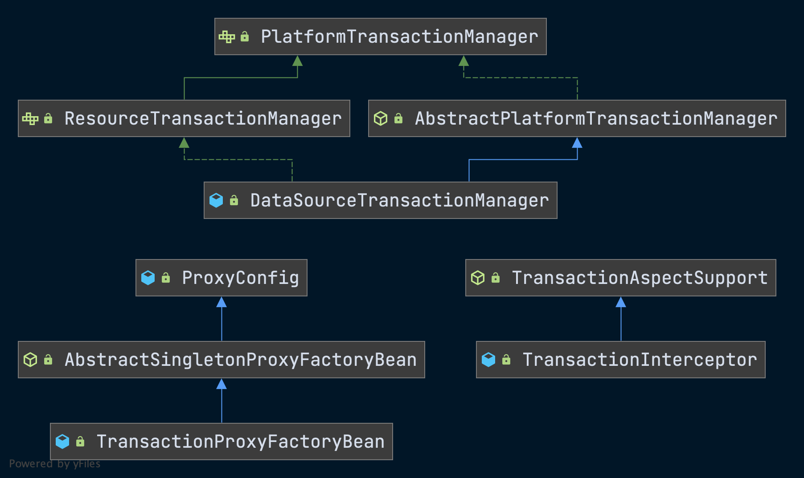
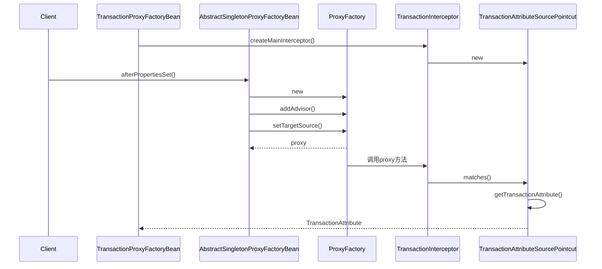
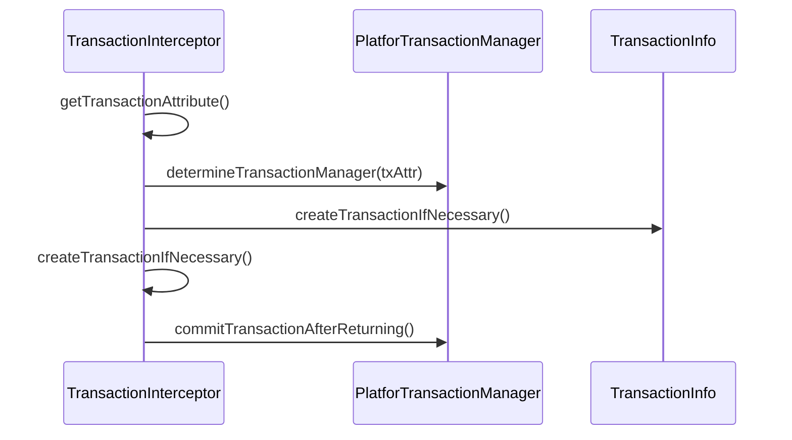
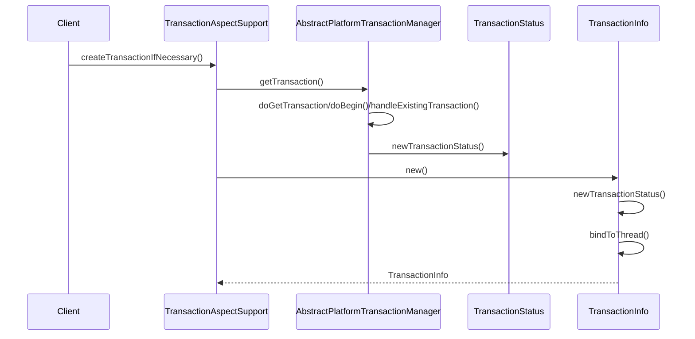
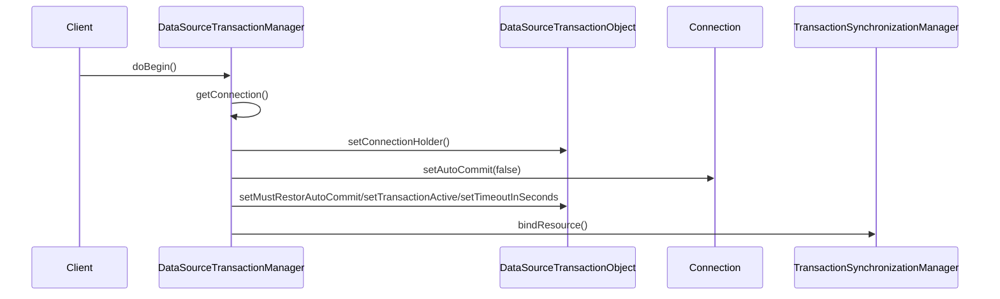

# Spring 事务处理的实现

## Spring与事务处理

- 事务管理的实现往往涉及**并发**和**数据一致性**方面的问题。
- 在涉及单个数据库局部事务的事务处理中，事务的最终实现和数据库的支持是紧密相关的。
- 在很多情况下，不会只有一个单独的数据库操作，而是有**一组数据库操作**。在这个处理过程中，首先涉及的是事务处理单元划分的问题，Spring借助IoC容器的强大配置能力，为应用提供了声明式的事务划分方式，这种声明式的事务处理，为Spring应用使用事务管理提供了统一的方式。

## Spring事务处理的设计概览

### 事务处理模块的类层次结构

- Spring事务处理模块是通过`AOP`功能来实现声明式事务处理的，比如事务属性的配置和读取，事务对象的抽象等。
- Spring事务处理中，可以通过设计一个`TransactionProxyFactoryBean`来使用AOP功能，通过这个`TransactionProxyFactoryBean`可以生成Proxy代理对象，在这个代理对象中，通过`TransactionInterceptor`来**完成对代理方法的拦截**，正是这些AOP的拦截功能，将事务处理的功能**编织**进来。



## Spring事务处理的应用场景

- Spring既支持**编程式**事务管理方式，又支持**声明式**事务处理方式。
- 通过声明式事务处理，可以将事务处理的过程和业务代码**分离**出来。
- 应用在选择数据源时可能会采取不同的方案，当以Spring作为平台时，Spring在应用和具体的数据源之间，搭建一个中间平台，通过这个中间平台，解耦应用和具体数据源之间的绑定，并且，Spring为常用的数据源的事务处理支持提供了一系列的`TransactionManager`。

## Spring声明式事务处理

### 设计原理与基本过程

- 在使用Spring**声明式事务处理**的时候，一种常用的方法是结合IoC容器和Spring已有的`TransactionProxyFactoryBean`对事务管理进行配置。

#### 声明式事务处理的实现

1. 读取和处理在IoC容器中**配置的事务处理属性**，并转化为Spring事务处理需要的内部**数据结构**。
2. Spring事务处理模块实现统一的事务处理过程。
   - 处理事务配置属性。
   - 与线程绑定完成事务处理。
   - Spring通过`TransactionInfo`和`TransactionStatus`这两个数据对象，在事务处理过程中记录和传递相关执行场景。
3. 底层的事务处理实现。

### 实现分析

#### 事务处理拦截器的配置

- 在使用声明式事务处理的时候，需要在IoC容器中配置`TransactionProxyFactoryBean`，是一个`FactoryBean`。

##### 建立事务处理对象的时序图

- Ioc进行注入的时候，会创建`TransactionInterceptor`对象。
- `TransactionInterceptor`对象会创建一个`TransactionAttributePointcut`，为读取`TransactionAttribute`做准备。
- 在容器初始化的过程中，由于实现了`InitializingBean`接口，因此`AbstractSingletonProxyFactoryBean`会实现`afterPropertiesSet()`方法，正是在这个方法实例化了一个`ProxyFactory`。
- 在`Proxy`代理对象建立起来以后，在调用其代理方法的时候，会调用相应的`TransactionInterceptor`拦截器，在这个调用中，会根据`TransactionAttribute`配置的事务属性进行配置。
- `createMainInterceptor`方法在IoC容器完成Bean的依赖注入时，通过`initializeBean`方法被调用。



##### TransactionProxyFactoryBean

```java
public class TransactionProxyFactoryBean extends AbstractSingletonProxyFactoryBean
  implements BeanFactoryAware {

  // 拦截器TransactionInterceptor通过AOP发挥作用，通过这个拦截器的实现，Spring封装了事务处理实现
  private final TransactionInterceptor transactionInterceptor = new TransactionInterceptor();

  @Nullable
  private Pointcut pointcut;
  // 通过依赖注入的PlatformTransactionManager
  public void setTransactionManager(PlatformTransactionManager transactionManager) {
    this.transactionInterceptor.setTransactionManager(transactionManager);
  }

  // 通过依赖注入的事务属性以Properties的形式出现把从BeanDefinition中读到的事务管理的属性信息注入到TransactionInterceptor中
  public void setTransactionAttributes(Properties transactionAttributes) {
    this.transactionInterceptor.setTransactionAttributes(transactionAttributes);
  }


  public void setTransactionAttributeSource(TransactionAttributeSource transactionAttributeSource) {
    this.transactionInterceptor.setTransactionAttributeSource(transactionAttributeSource);
  }

  public void setPointcut(Pointcut pointcut) {
    this.pointcut = pointcut;
  }

  @Override
  public void setBeanFactory(BeanFactory beanFactory) {
    this.transactionInterceptor.setBeanFactory(beanFactory);
  }

  @Override
  // 创建Spring AOP对事务处理的Advisor
  protected Object createMainInterceptor() {
    this.transactionInterceptor.afterPropertiesSet();
    if (this.pointcut != null) {
      return new DefaultPointcutAdvisor(this.pointcut, this.transactionInterceptor);
    }
    else {
      // Rely on default pointcut.
      return new TransactionAttributeSourceAdvisor(this.transactionInterceptor);
    }
  }

  @Override
  protected void postProcessProxyFactory(ProxyFactory proxyFactory) {
    proxyFactory.addInterface(TransactionalProxy.class);
  }

}
```

##### TransactionProxyFactoryBean#afterPropertiesSet

- 对`ProxyFactoryBean`的目标Bean设置进行检查。
- 创建一个`ProxyFactory`对象，从而实现AOP的使用。
- 在`afterPropertiesSet`的方法实现中，可以看到为ProxyFactory**生成代理对象**、**配置通知器**、**设置代理接口方法**等。
- `TransactionInterceptor`是作为AOP `Advice`的拦截器来实现它的功能。

```java
@Override
public void afterPropertiesSet() {
  // 必须配置target的属性，同时需要target是一个bean reference
  if (this.target == null) {
    throw new IllegalArgumentException("Property 'target' is required");
  }
  if (this.target instanceof String) {
    throw new IllegalArgumentException("'target' needs to be a bean reference, not a bean name as value");
  }
  if (this.proxyClassLoader == null) {
    this.proxyClassLoader = ClassUtils.getDefaultClassLoader();
  }

  // 提供Proxy对象，并将TransactionInterceptor设置为target方法调用的拦截器
  ProxyFactory proxyFactory = new ProxyFactory();

  if (this.preInterceptors != null) {
    for (Object interceptor : this.preInterceptors) {
      proxyFactory.addAdvisor(this.advisorAdapterRegistry.wrap(interceptor));
    }
  }

  // Spring加入通知器的地方
  proxyFactory.addAdvisor(this.advisorAdapterRegistry.wrap(createMainInterceptor()));

  if (this.postInterceptors != null) {
    for (Object interceptor : this.postInterceptors) {
      proxyFactory.addAdvisor(this.advisorAdapterRegistry.wrap(interceptor));
    }
  }

  proxyFactory.copyFrom(this);
	// 创建AOP的目标源，与在其他地方使用ProxyFactory没有什么差别
  TargetSource targetSource = createTargetSource(this.target);
  proxyFactory.setTargetSource(targetSource);

  if (this.proxyInterfaces != null) {
    proxyFactory.setInterfaces(this.proxyInterfaces);
  }
  else if (!isProxyTargetClass()) {
    // Rely on AOP infrastructure to tell us what interfaces to proxy.
    Class<?> targetClass = targetSource.getTargetClass();
    if (targetClass != null) {
      proxyFactory.setInterfaces(ClassUtils.getAllInterfacesForClass(targetClass, this.proxyClassLoader));
    }
  }

  postProcessProxyFactory(proxyFactory);
	// 获取并设置代理对象
  this.proxy = proxyFactory.getProxy(this.proxyClassLoader);
}
```

#### 事务处理配置的读入

- 在AOP配置完成的基础上，以`TransactionAttributeSourceAdvisor`的实现为入口，完成了具体的事务属性配读入。
- 对方法调用是否需要拦截进行判断，而判断的**依据**是在`TransactionProxyFactoryBean`中为目标对象设置的事务属性，也就是在`TransactionAttributeSourcePointcut`中完成判断。

##### TransactionAttributeSourceAdvisor

```java
public class TransactionAttributeSourceAdvisor extends AbstractPointcutAdvisor {

  // 与其他Advisor一样，同样需要定义AOP中用到的Interceptor和Pointcut
  @Nullable
  private TransactionInterceptor transactionInterceptor;

  private final TransactionAttributeSourcePointcut pointcut = new TransactionAttributeSourcePointcut() {
    @Override
    @Nullable
    protected TransactionAttributeSource getTransactionAttributeSource() {
      return (transactionInterceptor != null ? transactionInterceptor.getTransactionAttributeSource() : null);
    }
  };


  public TransactionAttributeSourceAdvisor() {
  }

  public TransactionAttributeSourceAdvisor(TransactionInterceptor interceptor) {
    setTransactionInterceptor(interceptor);
  }


  public void setTransactionInterceptor(TransactionInterceptor interceptor) {
    this.transactionInterceptor = interceptor;
  }

  public void setClassFilter(ClassFilter classFilter) {
    this.pointcut.setClassFilter(classFilter);
  }

  @Override
  public Advice getAdvice() {
    Assert.state(this.transactionInterceptor != null, "No TransactionInterceptor set");
    return this.transactionInterceptor;
  }

  @Override
  public Pointcut getPointcut() {
    return this.pointcut;
  }

}
```

##### TransactionAttributeSourcePointcut

`TransactionAttributeSourcePointcut#matches`

```java
@Override
public boolean matches(Method method, Class<?> targetClass) {
  TransactionAttributeSource tas = getTransactionAttributeSource();
  return (tas == null || tas.getTransactionAttribute(method, targetClass) != null);
}
```

##### TransactionAspectSupport

- 通过Ioc依赖注入设置事务属性

`TransactionAspectSupport#setTransactionAttributes`

```java
public void setTransactionAttributes(Properties transactionAttributes) {
  NameMatchTransactionAttributeSource tas = new NameMatchTransactionAttributeSource();
  tas.setProperties(transactionAttributes);
  this.transactionAttributeSource = tas;
}
```

##### NameMatchTransactionAttributeSource

`NameMatchTransactionAttributeSource#setProperties`

- 设置名称匹配事务属性。
- `NameMatchTransactionAttributeSource`作为`TransactionAttributeSource`的具体实现，是实际完成**事务处理属性读入和匹配**的地方。

```java
// key是方法名称，value是事务属性
private Map<String, TransactionAttribute> nameMap = new HashMap<>();

public void setProperties(Properties transactionAttributes) {
  // 创建事务属性编辑器
  TransactionAttributeEditor tae = new TransactionAttributeEditor();
  // 获取属性名称集合
  Enumeration<?> propNames = transactionAttributes.propertyNames();
  while (propNames.hasMoreElements()) {
    String methodName = (String) propNames.nextElement();
    String value = transactionAttributes.getProperty(methodName);
    // 解析value为事务属性对象并设置
    tae.setAsText(value);
    TransactionAttribute attr = (TransactionAttribute) tae.getValue();
    // 添加到nameMap中
    addTransactionalMethod(methodName, attr);
  }
}

public void addTransactionalMethod(String methodName, TransactionAttribute attr) {
  if (logger.isDebugEnabled()) {
    logger.debug("Adding transactional method [" + methodName + "] with attribute [" + attr + "]");
  }
  this.nameMap.put(methodName, attr);
}
```

`NameMatchTransactionAttributeSource#getTransactionAttribute`

- 获取事务属性。
- 通过是否能获得事务属性，当做判断当前方法是否是**事务方法**的标准。
- 命名模式匹配规则在`PatternMatchUtils#simpleMatch`中。

```java
@Override
@Nullable
public TransactionAttribute getTransactionAttribute(Method method, @Nullable Class<?> targetClass) {
  if (!ClassUtils.isUserLevelMethod(method)) {
    return null;
  }

  // 通过方法名直接匹配
  String methodName = method.getName();
  TransactionAttribute attr = this.nameMap.get(methodName);

  if (attr == null) {
    // 通过命名规则进行匹配
    String bestNameMatch = null;
    for (String mappedName : this.nameMap.keySet()) {
      if (isMatch(methodName, mappedName) &&
          (bestNameMatch == null || bestNameMatch.length() <= mappedName.length())) {
        attr = this.nameMap.get(mappedName);
        bestNameMatch = mappedName;
      }
    }
  }
  return attr;
}

protected boolean isMatch(String methodName, String mappedName) {
  return PatternMatchUtils.simpleMatch(mappedName, methodName);
}
```


##### 判断调用方法是否是事务方法

>通过在`NameMatchTransactionAttributeSource`中能否为这个调用方法返回事务属性来完成的。
>

1. 以**调用方法名**为索引在`nameMap`中查找相应的事务处理属性值，如果能够找到，那么就说明该调用方法和事务方法是直接对应的。
2. 如果找不到，那么就会遍历整个`nameMap`，对保存在`nameMap`中的每一个方法名，使用`PatternMatchUtils`的`SimpleMatch`方法进行**命名模式**上的匹配。
   - 命名模式可以匹配出通过通配符命名的规则。

#### 事务处理拦截器设计与的实现

- 经过`TransactionProxyFactoryBean`的AOP包装，此时如果对事务方法进行调用，会被设置的**事务处理拦截器**拦截。
- 通过`TransactionProxyFactoryBean`的`getObject`方法来得到的`Proxy`对象。

##### TransactionInterceptor

`TransactionInterceptor#invoke`

- 通过调用代理类的`invoke`方法，触发回调。

```java
@Override
@Nullable
public Object invoke(MethodInvocation invocation) throws Throwable {
  Class<?> targetClass = (invocation.getThis() != null ? AopUtils.getTargetClass(invocation.getThis()) : null);
  // 父类TransactionAspectSupport#invokeWithinTransaction方法触发事务内调用
  return invokeWithinTransaction(invocation.getMethod(), targetClass, invocation::proceed);
}
```

##### TransactionAspectSupport

`TransactionAspectSupport#invokeWithinTransaction`

```java
@Nullable
protected Object invokeWithinTransaction(Method method, @Nullable Class<?> targetClass,
                                         final InvocationCallback invocation) throws Throwable {

  TransactionAttributeSource tas = getTransactionAttributeSource();
  // 获取事务属性，属性为null则表示是非事务方法
  final TransactionAttribute txAttr = (tas != null ? tas.getTransactionAttribute(method, targetClass) : null);
  // 根据TransactionProxyFactoryBean的配置信息获得具体的事务处理器
  final TransactionManager tm = determineTransactionManager(txAttr);

  // 响应式事务处理流程
  if (this.reactiveAdapterRegistry != null && tm instanceof ReactiveTransactionManager) {
    ReactiveTransactionSupport txSupport = this.transactionSupportCache.computeIfAbsent(method, key -> {
      if (KotlinDetector.isKotlinType(method.getDeclaringClass()) && KotlinDelegate.isSuspend(method)) {
        throw new TransactionUsageException(
          "Unsupported annotated transaction on suspending function detected: " + method +
          ". Use TransactionalOperator.transactional extensions instead.");
      }
      ReactiveAdapter adapter = this.reactiveAdapterRegistry.getAdapter(method.getReturnType());
      if (adapter == null) {
        throw new IllegalStateException("Cannot apply reactive transaction to non-reactive return type: " +
                                        method.getReturnType());
      }
      return new ReactiveTransactionSupport(adapter);
    });
    return txSupport.invokeWithinTransaction(
      method, targetClass, invocation, txAttr, (ReactiveTransactionManager) tm);
  }
	// 转换事务管理器为平台事务管理器，并执行不同的调用流程
  PlatformTransactionManager ptm = asPlatformTransactionManager(tm);

  final String joinpointIdentification = methodIdentification(method, targetClass, txAttr);
	// 对非CallbackPreferringPlatformTransactionManager来说，不需要通过回调函数来实现事务的创建和提交，不需要通过回调的方式来使用
  if (txAttr == null || !(ptm instanceof CallbackPreferringPlatformTransactionManager)) {
    
    // 创建事务，同时把创建事务过程中得到的信息放到TransactionInfo中去，TransactionInfo是保存当前事务状态的对象
    TransactionInfo txInfo = createTransactionIfNecessary(ptm, txAttr, joinpointIdentification);

    Object retVal;
    try {
      // 沿着拦截器链进行调用，最后会调用目标对象的方法
      retVal = invocation.proceedWithInvocation();
    }
    catch (Throwable ex) {
			// 如果在事务处理方法调用中出现了异常，事务处理如何进行需要根据具体的情况考虑回滚或者提交
      completeTransactionAfterThrowing(txInfo, ex);
      throw ex;
    }
    finally {
      // 把与线程绑定的TransactionInfo设置为oldTransationInfo
      cleanupTransactionInfo(txInfo);
    }

    if (vavrPresent && VavrDelegate.isVavrTry(retVal)) {
      // Set rollback-only in case of Vavr failure matching our rollback rules...
      TransactionStatus status = txInfo.getTransactionStatus();
      if (status != null && txAttr != null) {
        retVal = VavrDelegate.evaluateTryFailure(retVal, txAttr, status);
      }
    }
		// 通过事务处理器来对事务进行提交
    commitTransactionAfterReturning(txInfo);
    return retVal;
  }
	// 对CallbackPreferringPlatformTransactionManager来说，需要回调函数来实现事务的创建和提交。
  else {
    final ThrowableHolder throwableHolder = new ThrowableHolder();

    // It's a CallbackPreferringPlatformTransactionManager: pass a TransactionCallback in.
    try {
      Object result = ((CallbackPreferringPlatformTransactionManager) ptm).execute(txAttr, status -> {
        TransactionInfo txInfo = prepareTransactionInfo(ptm, txAttr, joinpointIdentification, status);
        try {
          Object retVal = invocation.proceedWithInvocation();
          if (vavrPresent && VavrDelegate.isVavrTry(retVal)) {
            // Set rollback-only in case of Vavr failure matching our rollback rules...
            retVal = VavrDelegate.evaluateTryFailure(retVal, txAttr, status);
          }
          return retVal;
        }
        catch (Throwable ex) {
          if (txAttr.rollbackOn(ex)) {
            // RuntimeException会导致事务回滚
            if (ex instanceof RuntimeException) {
              throw (RuntimeException) ex;
            }
            else {
              throw new ThrowableHolderException(ex);
            }
          }
          else {
            // 正常的返回，导致事务提交
            throwableHolder.throwable = ex;
            return null;
          }
        }
        finally {
          cleanupTransactionInfo(txInfo);
        }
      });

      // Check result state: It might indicate a Throwable to rethrow.
      if (throwableHolder.throwable != null) {
        throw throwableHolder.throwable;
      }
      return result;
    }
    catch (ThrowableHolderException ex) {
      throw ex.getCause();
    }
    catch (TransactionSystemException ex2) {
      if (throwableHolder.throwable != null) {
        logger.error("Application exception overridden by commit exception", throwableHolder.throwable);
        ex2.initApplicationException(throwableHolder.throwable);
      }
      throw ex2;
    }
    catch (Throwable ex2) {
      if (throwableHolder.throwable != null) {
        logger.error("Application exception overridden by commit exception", throwableHolder.throwable);
      }
      throw ex2;
    }
  }
}
```

##### 事务提交的时序图



## Spring事务处理的设计与实现

- 事务的创建、提交和回滚的实现都比较复杂。
  - 这些处理会涉及很多**事务属性**的处理。
  - 会涉及事务处理过程中**状态**的设置，同时在事务处理的过程中，有许多处理也需要根据相应的状态来完成。

### Spring事务处理的编程式使用

- 在**编程式**使用事务处理的过程中，利用`DefaultTransactionDefinition`对象来持有事务处理属性。

#### 编程式事务使用代码

```java
public class TestTransaction {

  private PlatformTransactionManager transactionManager;

  public void test() {
    TransactionDefinition td = new DefaultTransactionDefinition();
    TransactionStatus status = transactionManager.getTransaction(td);
    try {
      // 需要进行事务处理的方法调用
    }catch (ApplicationException e){
      transactionManager.rollback(status);
      throw e;
    }
    transactionManager.commit(status);
  }

}
```

### 事务的创建

- 作为**声明式事务处理实现的起始点**，需要注意`TransactionInterceptor`拦截器的`invoke`回调中使用的`createTransactionIfNecessary`方法，这个方法是在`TransactionInterceptor`的基类`TransactionAspectSupport`中实现的。

- 新事务的创建需要根据**事务属性配置**。所谓创建，首先是把创建工作交给**具体的事务处理器**来完成，把创建的**事务对象**在`TransactionStatus`中保存下来，然后将其他的事务属性和线程`ThreadLocal`变量进行**绑定**。

  

#### 创建事务时序图



#### TransactionAspectSupport

`TransactionAspectSupport#createTransactionIfNecessary`

- **根据当前的事务状态和事务属性配置完成事务创建**。
- 调用中过程中，会向`AbstractTransactionManager`执行`getTransaction()`获取事务对象。

```java
protected TransactionInfo createTransactionIfNecessary(@Nullable PlatformTransactionManager tm,
                                                       @Nullable TransactionAttribute txAttr, 
                                                       final String joinpointIdentification) {

  // 如果没有指定名字，使用方法特征来作为事务名
  if (txAttr != null && txAttr.getName() == null) {
    txAttr = new DelegatingTransactionAttribute(txAttr) {
      @Override
      public String getName() {
        return joinpointIdentification;
      }
    };
  }

  // TransactionStatus封装了事务执行的状态信息
  TransactionStatus status = null;
  if (txAttr != null) {
    if (tm != null) {
      // 使用了定义好的事务方法的配置信息事务创建由事务处理器来完成，同时返回TransactionStatus来记录当前的事务状态，包括已经创建的事务
      status = tm.getTransaction(txAttr);
    }
    else {
      if (logger.isDebugEnabled()) {
        logger.debug("Skipping transactional joinpoint [" + joinpointIdentification +
                     "] because no transaction manager has been configured");
      }
    }
  }
  return prepareTransactionInfo(tm, txAttr, joinpointIdentification, status);
}

protected TransactionInfo prepareTransactionInfo(@Nullable PlatformTransactionManager tm,
                                                 @Nullable TransactionAttribute txAttr, 
                                                 String joinpointIdentification,
                                                 @Nullable TransactionStatus status) {

  TransactionInfo txInfo = new TransactionInfo(tm, txAttr, joinpointIdentification);
  if (txAttr != null) {
    if (logger.isTraceEnabled()) {
      logger.trace("Getting transaction for [" + txInfo.getJoinpointIdentification() + "]");
    }
    // 设置TransactionStatus
    txInfo.newTransactionStatus(status);
  }
  else {
    if (logger.isTraceEnabled()) {
      logger.trace("No need to create transaction for [" + joinpointIdentification +
                   "]: This method is not transactional.");
    }
  }
	// 绑定线程信息
  txInfo.bindToThread();
  return txInfo;
}
```

#### AbstractPlatformTransactionManager

`AbstractPlatformTransactionManager#getTransaction`

- 根据**事务属性配置**和**当前进程绑定的事务信息**，对事务是否需要创建，怎样创建进行一些通用的处理，然后把事务创建的**底层**工作交给具体的事务处理器完成。
- 这个实现过程是Spring提供**统一事务处理的一个重要部分**。
- 事务创建的结果是生成一个`TransactionStatus`对象，通过这个对象来**保存事务处理需要的基本信息**，`TransactionStatus`是`TransactionInfo`的一个属性。
- 会把`TransactionInfo`保存在`ThreadLocal`对象里，从而把**事务的处理信息**与**调用事务方法的当前线程**绑定起来。

```java
@Override
public final TransactionStatus getTransaction(@Nullable TransactionDefinition definition)
  throws TransactionException {

  // 没有定义具体的事务定义就使用默认规则
  TransactionDefinition def = (definition != null ? definition : TransactionDefinition.withDefaults());
  // 抽象方法，具体实现交给具体的事务处理器
  Object transaction = doGetTransaction();
  boolean debugEnabled = logger.isDebugEnabled();

  // 检查当前线程是否已经存在事务，如果已经存在事务，那么需要根据在事务属性中定义的事务传播属性配置来处理事务的产生
  if (isExistingTransaction(transaction)) {
    // Existing transaction found -> check propagation behavior to find out how to behave.
    return handleExistingTransaction(def, transaction, debugEnabled);
  }

  // 检查事务属性中timeout的设置是否合理
  if (def.getTimeout() < TransactionDefinition.TIMEOUT_DEFAULT) {
    throw new InvalidTimeoutException("Invalid transaction timeout", def.getTimeout());
  }

  // 当前没有事务存在，这时需要根据事务属性设置来创建事务
  if (def.getPropagationBehavior() == TransactionDefinition.PROPAGATION_MANDATORY) {
    throw new IllegalTransactionStateException(
      "No existing transaction found for transaction marked with propagation 'mandatory'");
  }
  else if (def.getPropagationBehavior() == TransactionDefinition.PROPAGATION_REQUIRED ||
           def.getPropagationBehavior() == TransactionDefinition.PROPAGATION_REQUIRES_NEW ||
           def.getPropagationBehavior() == TransactionDefinition.PROPAGATION_NESTED) {
    SuspendedResourcesHolder suspendedResources = suspend(null);
    if (debugEnabled) {
      logger.debug("Creating new transaction with name [" + def.getName() + "]: " + def);
    }
    try {
      // 创建事务的调用，由具体的事务处理器来完成
      return startTransaction(def, transaction, debugEnabled, suspendedResources);
    }
    catch (RuntimeException | Error ex) {
      resume(null, suspendedResources);
      throw ex;
    }
  }
  else {
    // Create "empty" transaction: no actual transaction, but potentially synchronization.
    if (def.getIsolationLevel() != TransactionDefinition.ISOLATION_DEFAULT && logger.isWarnEnabled()) {
      logger.warn("Custom isolation level specified but no actual transaction initiated; " +
                  "isolation level will effectively be ignored: " + def);
    }
    boolean newSynchronization = (getTransactionSynchronization() == SYNCHRONIZATION_ALWAYS);
    // TransationStatus没有transaction对象，因为在newTransactionStatus中对应于transaction的参数是null
    return prepareTransactionStatus(def, null, true, newSynchronization, debugEnabled, null);
  }
}

protected final DefaultTransactionStatus prepareTransactionStatus(
  TransactionDefinition definition, @Nullable Object transaction, boolean newTransaction,
  boolean newSynchronization, boolean debug, @Nullable Object suspendedResources) {

  DefaultTransactionStatus status = newTransactionStatus(
    definition, transaction, newTransaction, newSynchronization, debug, suspendedResources);
  prepareSynchronization(status, definition);
  return status;
}

protected void prepareSynchronization(DefaultTransactionStatus status, TransactionDefinition definition) {
  if (status.isNewSynchronization()) {
    TransactionSynchronizationManager.setActualTransactionActive(status.hasTransaction());
    TransactionSynchronizationManager.setCurrentTransactionIsolationLevel(
      definition.getIsolationLevel() != TransactionDefinition.ISOLATION_DEFAULT ?
      definition.getIsolationLevel() : null);
    TransactionSynchronizationManager.setCurrentTransactionReadOnly(definition.isReadOnly());
    TransactionSynchronizationManager.setCurrentTransactionName(definition.getName());
    TransactionSynchronizationManager.initSynchronization();
  }
}
```

`AbstractPlatformTransactionManager#newTransactionStatus`

- 创建事务状态对象。

```java
	protected DefaultTransactionStatus newTransactionStatus(
			TransactionDefinition definition, @Nullable Object transaction, boolean newTransaction,
			boolean newSynchronization, boolean debug, @Nullable Object suspendedResources) {
		// 这里判断是不是新事务，如果是新事务，那么需要把事务属性存放到当前线程中
    // TransactionSynchronizationManager维护一系列的ThreadLocal变量来保持事务属性，比如并发事务隔离级别，是否有活跃的事务等
		boolean actualNewSynchronization = newSynchronization &&
				!TransactionSynchronizationManager.isSynchronizationActive();
    // 把结果记录在DefaultTransactionStatus中返回
		return new DefaultTransactionStatus(
				transaction, newTransaction, actualNewSynchronization,
				definition.isReadOnly(), debug, suspendedResources);
	}
```

`AbstractPlatformTransactionManager#handleExistingTransaction`

- 创建事务的时候，事务已经存在，对已存在的事务的进行处理。

```java
private TransactionStatus handleExistingTransaction(
  TransactionDefinition definition, Object transaction, boolean debugEnabled)
  throws TransactionException {

  // 如果当前线程已有事务存在，且当前事务的传播属性设置是never，那么抛出异常
  if (definition.getPropagationBehavior() == TransactionDefinition.PROPAGATION_NEVER) {
    throw new IllegalTransactionStateException(
      "Existing transaction found for transaction marked with propagation 'never'");
  }

  // 如果当前事务的配置属性是PROPAGATION_NOT_SUPPORTED，同时当前线程已经存在事务了，那么将事务挂起
  if (definition.getPropagationBehavior() == TransactionDefinition.PROPAGATION_NOT_SUPPORTED) {
    if (debugEnabled) {
      logger.debug("Suspending current transaction");
    }
    Object suspendedResources = suspend(transaction);
    boolean newSynchronization = (getTransactionSynchronization() == SYNCHRONIZATION_ALWAYS);
    return prepareTransactionStatus(
      definition, null, false, newSynchronization, debugEnabled, suspendedResources);
  }
	// PROPAGATION_REQUIRES_NEW，那么创建新的事务
  if (definition.getPropagationBehavior() == TransactionDefinition.PROPAGATION_REQUIRES_NEW) {
    if (debugEnabled) {
      logger.debug("Suspending current transaction, creating new transaction with name [" +
                   definition.getName() + "]");
    }
    SuspendedResourcesHolder suspendedResources = suspend(transaction);
    try {
      // 创建事务
      return startTransaction(definition, transaction, debugEnabled, suspendedResources);
    }
    catch (RuntimeException | Error beginEx) {
      resumeAfterBeginException(transaction, suspendedResources, beginEx);
      throw beginEx;
    }
  }

  // 嵌套事务的创建
  if (definition.getPropagationBehavior() == TransactionDefinition.PROPAGATION_NESTED) {
    if (!isNestedTransactionAllowed()) {
      throw new NestedTransactionNotSupportedException(
        "Transaction manager does not allow nested transactions by default - " +
        "specify 'nestedTransactionAllowed' property with value 'true'");
    }
    if (debugEnabled) {
      logger.debug("Creating nested transaction with name [" + definition.getName() + "]");
    }
    // 创建事务保存点
    if (useSavepointForNestedTransaction()) {
      // Create savepoint within existing Spring-managed transaction,
      // through the SavepointManager API implemented by TransactionStatus.
      // Usually uses JDBC 3.0 savepoints. Never activates Spring synchronization.
      DefaultTransactionStatus status =
        prepareTransactionStatus(definition, transaction, false, false, debugEnabled, null);
      status.createAndHoldSavepoint();
      return status;
    }
    else {
      // Nested transaction through nested begin and commit/rollback calls.
      // Usually only for JTA: Spring synchronization might get activated here
      // in case of a pre-existing JTA transaction.
      return startTransaction(definition, transaction, debugEnabled, null);
    }
  }

  // Assumably PROPAGATION_SUPPORTS or PROPAGATION_REQUIRED.
  if (debugEnabled) {
    logger.debug("Participating in existing transaction");
  }
  // 这里判断在当前事务方法中的属性配置与已有事务的属性配置是否一致，如果不一致，那么不执行事务方法并抛出异常
  if (isValidateExistingTransaction()) {
    if (definition.getIsolationLevel() != TransactionDefinition.ISOLATION_DEFAULT) {
      Integer currentIsolationLevel = TransactionSynchronizationManager.getCurrentTransactionIsolationLevel();
      if (currentIsolationLevel == null || currentIsolationLevel != definition.getIsolationLevel()) {
        Constants isoConstants = DefaultTransactionDefinition.constants;
        throw new IllegalTransactionStateException("Participating transaction with definition [" +
                                                   definition + "] specifies isolation level which is incompatible with existing transaction: " +
                                                   (currentIsolationLevel != null ?
                                                    isoConstants.toCode(currentIsolationLevel, DefaultTransactionDefinition.PREFIX_ISOLATION) :
                                                    "(unknown)"));
      }
    }
    if (!definition.isReadOnly()) {
      if (TransactionSynchronizationManager.isCurrentTransactionReadOnly()) {
        throw new IllegalTransactionStateException("Participating transaction with definition [" +
                                                   definition + "] is not marked as read-only but existing transaction is");
      }
    }
  }
  boolean newSynchronization = (getTransactionSynchronization() != SYNCHRONIZATION_NEVER);
  // 返回TransactionStatus，注意第三个参数false代表当前事务方法没有使用新的事务
  return prepareTransactionStatus(definition, transaction, false, newSynchronization, debugEnabled, null);
}
```

### 事务的挂起

- 事务的挂起牵涉**线程与事务处理信息的保存**。

#### AbstractPlatformTransactionManager

`AbstractPlatformTransactionManager#suspend`

- 返回的`SuspendedResourcesHolder`会作为参数传给`TransactionStatus`。

```java
@Nullable
protected final SuspendedResourcesHolder suspend(@Nullable Object transaction) throws TransactionException {
  //
  if (TransactionSynchronizationManager.isSynchronizationActive()) {
    List<TransactionSynchronization> suspendedSynchronizations = doSuspendSynchronization();
    try {
      Object suspendedResources = null;
      if (transaction != null) {
        // 由具体事务处理器去完成挂起实现，如果具体的事务处理器不支持，会抛出异常TransactionSuspensionNotSupportedException
        suspendedResources = doSuspend(transaction);
      }
      // 在线程中保存与事务处理有关的信息，并重置线程中相关的ThreadLocal变量
      String name = TransactionSynchronizationManager.getCurrentTransactionName();
      TransactionSynchronizationManager.setCurrentTransactionName(null);
      boolean readOnly = TransactionSynchronizationManager.isCurrentTransactionReadOnly();
      TransactionSynchronizationManager.setCurrentTransactionReadOnly(false);
      Integer isolationLevel = TransactionSynchronizationManager.getCurrentTransactionIsolationLevel();
      TransactionSynchronizationManager.setCurrentTransactionIsolationLevel(null);
      boolean wasActive = TransactionSynchronizationManager.isActualTransactionActive();
      TransactionSynchronizationManager.setActualTransactionActive(false);
      return new SuspendedResourcesHolder(
        suspendedResources, suspendedSynchronizations, name, readOnly, isolationLevel, wasActive);
    }
    catch (RuntimeException | Error ex) {
      // 挂起失败，原始事务依然存在
      doResumeSynchronization(suspendedSynchronizations);
      throw ex;
    }
  }
  else if (transaction != null) {
    // 事务激活，但是处理器未激活
    Object suspendedResources = doSuspend(transaction);
    return new SuspendedResourcesHolder(suspendedResources);
  }
  else {
    // Neither transaction nor synchronization active.
    return null;
  }
}
```

### 事务的提交

#### TransactionAspectSupport

`TransactionAspectSupport#commitTransactionAfterReturning`

- 事务方法执行完毕，未产生异常进行事务提交。
- 通过直接调用**事务处理器**来完成事务提交。

```java
protected void commitTransactionAfterReturning(@Nullable TransactionInfo txInfo) {
  if (txInfo != null && txInfo.getTransactionStatus() != null) {
    if (logger.isTraceEnabled()) {
      logger.trace("Completing transaction for [" + txInfo.getJoinpointIdentification() + "]");
    }
    // 提交
    txInfo.getTransactionManager().commit(txInfo.getTransactionStatus());
  }
}
```

#### AbstractPlatformTransactionManager

`AbstractPlatformTransactionManager#commit`

- 事务管理器的**提交事务**方法实现。
- 事务提交的处理，需要通过对`TransactionStatus`保存的**事务处理的相关状态**进行判断。
- `AbstractPlatformTransactionManager`中的`doCommit`和`prepareForCommit`方法，它们都是抽象方法，都在具体的事务处理器中完成实现。

```java
@Override
public final void commit(TransactionStatus status) throws TransactionException {
  // 事务已经完成
  if (status.isCompleted()) {
    throw new IllegalTransactionStateException(
      "Transaction is already completed - do not call commit or rollback more than once per transaction");
  }
  DefaultTransactionStatus defStatus = (DefaultTransactionStatus) status;
  // 本地回滚
  if (defStatus.isLocalRollbackOnly()) {
    if (defStatus.isDebug()) {
      logger.debug("Transactional code has requested rollback");
    }
    processRollback(defStatus, false);
    return;
  }
  // 全局回滚
  if (!shouldCommitOnGlobalRollbackOnly() && defStatus.isGlobalRollbackOnly()) {
    if (defStatus.isDebug()) {
      logger.debug("Global transaction is marked as rollback-only but transactional code requested commit");
    }
    processRollback(defStatus, true);
    return;
  }
  // 提交
  processCommit(defStatus);
}

private void processCommit(DefaultTransactionStatus status) throws TransactionException {
  try {
    boolean beforeCompletionInvoked = false;

    try {
      boolean unexpectedRollback = false;
      prepareForCommit(status);
      triggerBeforeCommit(status);
      triggerBeforeCompletion(status);
      beforeCompletionInvoked = true;
			// 嵌套事务的处理
      if (status.hasSavepoint()) {
        if (status.isDebug()) {
          logger.debug("Releasing transaction savepoint");
        }
        unexpectedRollback = status.isGlobalRollbackOnly();
        status.releaseHeldSavepoint();
      }
      // 对根据当前线程中保存的事务状态进行处理，如果当前的事务是一个新事务，调用具体事务处理器的完成提交
      else if (status.isNewTransaction()) {
        if (status.isDebug()) {
          logger.debug("Initiating transaction commit");
        }
        unexpectedRollback = status.isGlobalRollbackOnly();
        // 具体的事务提交由具体的事务处理器来完成
        doCommit(status);
      }
      // 如果当前所持有的事务不是一个新事务，则不提交，由已经存在的事务来完成提交
      else if (isFailEarlyOnGlobalRollbackOnly()) {
        unexpectedRollback = status.isGlobalRollbackOnly();
      }
      // Throw UnexpectedRollbackException if we have a global rollback-only
      // marker but still didn't get a corresponding exception from commit.
      if (unexpectedRollback) {
        throw new UnexpectedRollbackException(
          "Transaction silently rolled back because it has been marked as rollback-only");
      }
    }
    catch (UnexpectedRollbackException ex) {
      // can only be caused by doCommit
      triggerAfterCompletion(status, TransactionSynchronization.STATUS_ROLLED_BACK);
      throw ex;
    }
    catch (TransactionException ex) {
      // can only be caused by doCommit
      if (isRollbackOnCommitFailure()) {
        doRollbackOnCommitException(status, ex);
      }
      else {
        triggerAfterCompletion(status, TransactionSynchronization.STATUS_UNKNOWN);
      }
      throw ex;
    }
    catch (RuntimeException | Error ex) {
      if (!beforeCompletionInvoked) {
        triggerBeforeCompletion(status);
      }
      doRollbackOnCommitException(status, ex);
      throw ex;
    }
		// 触发afterCommit()回滚
    try {
      triggerAfterCommit(status);
    }
    finally {
      triggerAfterCompletion(status, TransactionSynchronization.STATUS_COMMITTED);
    }

  }
  finally {
    cleanupAfterCompletion(status);
  }
}
```

### 事务的回滚

#### AbstractPlatformTransactionManager

`AbstractPlatformTransactionManager#processRollback`

```java
private void processRollback(DefaultTransactionStatus status, boolean unexpected) {
  try {
    boolean unexpectedRollback = unexpected;

    try {
      triggerBeforeCompletion(status);
			// 嵌套事务回滚处理
      if (status.hasSavepoint()) {
        if (status.isDebug()) {
          logger.debug("Rolling back transaction to savepoint");
        }
        status.rollbackToHeldSavepoint();
      }
      // 当前事务调用方法中新建事务的回滚处理
      else if (status.isNewTransaction()) {
        if (status.isDebug()) {
          logger.debug("Initiating transaction rollback");
        }
        // 具体的事务处理器来完成的
        doRollback(status);
      }
      else {
        // 由线程中的前一个事务来处理回滚，这里不执行任何操作
        if (status.hasTransaction()) {
          // 参与事务失败-标记当前事务仅回滚
          if (status.isLocalRollbackOnly() || isGlobalRollbackOnParticipationFailure()) {
            if (status.isDebug()) {
              logger.debug("Participating transaction failed - marking existing transaction as rollback-only");
            }
            doSetRollbackOnly(status);
          }
          // 参与事务失败-让事务发起人决定回滚
          else {
            if (status.isDebug()) {
              logger.debug("Participating transaction failed - letting transaction originator decide on rollback");
            }
          }
        }
        else {
          logger.debug("Should roll back transaction but cannot - no transaction available");
        }
        // Unexpected rollback only matters here if we're asked to fail early
        if (!isFailEarlyOnGlobalRollbackOnly()) {
          unexpectedRollback = false;
        }
      }
    }
    catch (RuntimeException | Error ex) {
      triggerAfterCompletion(status, TransactionSynchronization.STATUS_UNKNOWN);
      throw ex;
    }

    triggerAfterCompletion(status, TransactionSynchronization.STATUS_ROLLED_BACK);

    // Raise UnexpectedRollbackException if we had a global rollback-only marker
    if (unexpectedRollback) {
      throw new UnexpectedRollbackException(
        "Transaction rolled back because it has been marked as rollback-only");
    }
  }
  finally {
    cleanupAfterCompletion(status);
  }
}
```

## Spring事务处理器的设计与实现

### Spring事务处理的应用场景

- `AbstractPlatformManager`，作为一个基类，`AbstractPlatfromManager`封装了**Spring事务处理中通用的处理部分**，比如**事务的创建**、**提交**、**回滚**，**事务状态**和**信息的处理**，**与线程的绑定**等。
- 具体的事务管理器而言，它们只需要处理和具体数据源相关的组件设置就可以。
- `PlatformTransactionManager`设计了一系列**与事务处理息息相关的接口方法**，如`getTransaction`、`commit`、`rollback`这些和事务处理相关的统一接口。对于这些接口的实现，很大一部分是由`AbstractTransactionManager`来完成的。
- `AbstractTransactionManager`中的`doGetTransaction`、`doCommit`等方法和`PlatformTransactionManager`的方法对应，实现的是事务处理中相对通用的部分。

### DataSourceTransactionManager的实现

- 在`DataSourceTransactionManager`中，在事务开始的时候，会调用`doBegin`方法，首先会得到相对应的`Connection`，然后可以根据事务设置的需要，对`Connection`的相关属性进行配置，最后通过`TransactionSynchronizationManager`来对**资源进行绑定**。
- 使用`DataSource`创建事务，最终通过设置`Connection`的`AutoCommit`属性来对事务处理进行配置。
- 在实现过程中，需要把数据库的`Connection`和**当前的线程**进行绑定。
- 对于事务的提交和回滚，都是通过直接调用`Connection`的提交和回滚来完成的。

#### 时序图



#### 源码

```java
public class DataSourceTransactionManager extends AbstractPlatformTransactionManager
  implements ResourceTransactionManager, InitializingBean {

  @Nullable
  private DataSource dataSource;

  private boolean enforceReadOnly = false;

  public DataSourceTransactionManager() {
    setNestedTransactionAllowed(true);
  }

  public DataSourceTransactionManager(DataSource dataSource) {
    this();
    setDataSource(dataSource);
    afterPropertiesSet();
  }

  public void setDataSource(@Nullable DataSource dataSource) {
    if (dataSource instanceof TransactionAwareDataSourceProxy) {
      this.dataSource = ((TransactionAwareDataSourceProxy) dataSource).getTargetDataSource();
    }
    else {
      this.dataSource = dataSource;
    }
  }

  @Nullable
  public DataSource getDataSource() {
    return this.dataSource;
  }

  protected DataSource obtainDataSource() {
    DataSource dataSource = getDataSource();
    Assert.state(dataSource != null, "No DataSource set");
    return dataSource;
  }

  public void setEnforceReadOnly(boolean enforceReadOnly) {
    this.enforceReadOnly = enforceReadOnly;
  }

  public boolean isEnforceReadOnly() {
    return this.enforceReadOnly;
  }

  @Override
  public void afterPropertiesSet() {
    if (getDataSource() == null) {
      throw new IllegalArgumentException("Property 'dataSource' is required");
    }
  }


  @Override
  public Object getResourceFactory() {
    return obtainDataSource();
  }

  @Override
  protected Object doGetTransaction() {
    DataSourceTransactionObject txObject = new DataSourceTransactionObject();
    txObject.setSavepointAllowed(isNestedTransactionAllowed());
    ConnectionHolder conHolder =
      (ConnectionHolder) TransactionSynchronizationManager.getResource(obtainDataSource());
    txObject.setConnectionHolder(conHolder, false);
    return txObject;
  }

  @Override
  protected boolean isExistingTransaction(Object transaction) {
    DataSourceTransactionObject txObject = (DataSourceTransactionObject) transaction;
    return (txObject.hasConnectionHolder() && txObject.getConnectionHolder().isTransactionActive());
  }

  /**
	 * This implementation sets the isolation level but ignores the timeout.
	 */
  @Override
  protected void doBegin(Object transaction, TransactionDefinition definition) {
    DataSourceTransactionObject txObject = (DataSourceTransactionObject) transaction;
    Connection con = null;

    try {
      if (!txObject.hasConnectionHolder() ||
          txObject.getConnectionHolder().isSynchronizedWithTransaction()) {
        Connection newCon = obtainDataSource().getConnection();
        if (logger.isDebugEnabled()) {
          logger.debug("Acquired Connection [" + newCon + "] for JDBC transaction");
        }
        txObject.setConnectionHolder(new ConnectionHolder(newCon), true);
      }

      txObject.getConnectionHolder().setSynchronizedWithTransaction(true);
      con = txObject.getConnectionHolder().getConnection();

      Integer previousIsolationLevel = DataSourceUtils.prepareConnectionForTransaction(con, definition);
      txObject.setPreviousIsolationLevel(previousIsolationLevel);
      txObject.setReadOnly(definition.isReadOnly());
      
      if (con.getAutoCommit()) {
        txObject.setMustRestoreAutoCommit(true);
        if (logger.isDebugEnabled()) {
          logger.debug("Switching JDBC Connection [" + con + "] to manual commit");
        }
        con.setAutoCommit(false);
      }

      prepareTransactionalConnection(con, definition);
      txObject.getConnectionHolder().setTransactionActive(true);

      int timeout = determineTimeout(definition);
      if (timeout != TransactionDefinition.TIMEOUT_DEFAULT) {
        txObject.getConnectionHolder().setTimeoutInSeconds(timeout);
      }

      // Bind the connection holder to the thread.
      if (txObject.isNewConnectionHolder()) {
        TransactionSynchronizationManager.bindResource(obtainDataSource(), txObject.getConnectionHolder());
      }
    }

    catch (Throwable ex) {
      if (txObject.isNewConnectionHolder()) {
        DataSourceUtils.releaseConnection(con, obtainDataSource());
        txObject.setConnectionHolder(null, false);
      }
      throw new CannotCreateTransactionException("Could not open JDBC Connection for transaction", ex);
    }
  }

  @Override
  protected Object doSuspend(Object transaction) {
    DataSourceTransactionObject txObject = (DataSourceTransactionObject) transaction;
    txObject.setConnectionHolder(null);
    return TransactionSynchronizationManager.unbindResource(obtainDataSource());
  }

  @Override
  protected void doResume(@Nullable Object transaction, Object suspendedResources) {
    TransactionSynchronizationManager.bindResource(obtainDataSource(), suspendedResources);
  }

  @Override
  protected void doCommit(DefaultTransactionStatus status) {
    DataSourceTransactionObject txObject = (DataSourceTransactionObject) status.getTransaction();
    Connection con = txObject.getConnectionHolder().getConnection();
    if (status.isDebug()) {
      logger.debug("Committing JDBC transaction on Connection [" + con + "]");
    }
    try {
      con.commit();
    }
    catch (SQLException ex) {
      throw new TransactionSystemException("Could not commit JDBC transaction", ex);
    }
  }

  @Override
  protected void doRollback(DefaultTransactionStatus status) {
    DataSourceTransactionObject txObject = (DataSourceTransactionObject) status.getTransaction();
    Connection con = txObject.getConnectionHolder().getConnection();
    if (status.isDebug()) {
      logger.debug("Rolling back JDBC transaction on Connection [" + con + "]");
    }
    try {
      con.rollback();
    }
    catch (SQLException ex) {
      throw new TransactionSystemException("Could not roll back JDBC transaction", ex);
    }
  }

  @Override
  protected void doSetRollbackOnly(DefaultTransactionStatus status) {
    DataSourceTransactionObject txObject = (DataSourceTransactionObject) status.getTransaction();
    if (status.isDebug()) {
      logger.debug("Setting JDBC transaction [" + txObject.getConnectionHolder().getConnection() +
                   "] rollback-only");
    }
    txObject.setRollbackOnly();
  }

  @Override
  protected void doCleanupAfterCompletion(Object transaction) {
    DataSourceTransactionObject txObject = (DataSourceTransactionObject) transaction;

    // Remove the connection holder from the thread, if exposed.
    if (txObject.isNewConnectionHolder()) {
      TransactionSynchronizationManager.unbindResource(obtainDataSource());
    }

    // Reset connection.
    Connection con = txObject.getConnectionHolder().getConnection();
    try {
      if (txObject.isMustRestoreAutoCommit()) {
        con.setAutoCommit(true);
      }
      DataSourceUtils.resetConnectionAfterTransaction(
        con, txObject.getPreviousIsolationLevel(), txObject.isReadOnly());
    }
    catch (Throwable ex) {
      logger.debug("Could not reset JDBC Connection after transaction", ex);
    }

    if (txObject.isNewConnectionHolder()) {
      if (logger.isDebugEnabled()) {
        logger.debug("Releasing JDBC Connection [" + con + "] after transaction");
      }
      DataSourceUtils.releaseConnection(con, this.dataSource);
    }

    txObject.getConnectionHolder().clear();
  }


  /**
	 * Prepare the transactional {@code Connection} right after transaction begin.
	 * <p>The default implementation executes a "SET TRANSACTION READ ONLY" statement
	 * if the {@link #setEnforceReadOnly "enforceReadOnly"} flag is set to {@code true}
	 * and the transaction definition indicates a read-only transaction.
	 * <p>The "SET TRANSACTION READ ONLY" is understood by Oracle, MySQL and Postgres
	 * and may work with other databases as well. If you'd like to adapt this treatment,
	 * override this method accordingly.
	 * @param con the transactional JDBC Connection
	 * @param definition the current transaction definition
	 * @throws SQLException if thrown by JDBC API
	 * @since 4.3.7
	 * @see #setEnforceReadOnly
	 */
  protected void prepareTransactionalConnection(Connection con, TransactionDefinition definition)
    throws SQLException {

    if (isEnforceReadOnly() && definition.isReadOnly()) {
      try (Statement stmt = con.createStatement()) {
        stmt.executeUpdate("SET TRANSACTION READ ONLY");
      }
    }
  }


  /**
	 * DataSource transaction object, representing a ConnectionHolder.
	 * Used as transaction object by DataSourceTransactionManager.
	 */
  private static class DataSourceTransactionObject extends JdbcTransactionObjectSupport {

    private boolean newConnectionHolder;

    private boolean mustRestoreAutoCommit;

    public void setConnectionHolder(@Nullable ConnectionHolder connectionHolder, boolean newConnectionHolder) {
      super.setConnectionHolder(connectionHolder);
      this.newConnectionHolder = newConnectionHolder;
    }

    public boolean isNewConnectionHolder() {
      return this.newConnectionHolder;
    }

    public void setMustRestoreAutoCommit(boolean mustRestoreAutoCommit) {
      this.mustRestoreAutoCommit = mustRestoreAutoCommit;
    }

    public boolean isMustRestoreAutoCommit() {
      return this.mustRestoreAutoCommit;
    }

    public void setRollbackOnly() {
      getConnectionHolder().setRollbackOnly();
    }

    @Override
    public boolean isRollbackOnly() {
      return getConnectionHolder().isRollbackOnly();
    }

    @Override
    public void flush() {
      if (TransactionSynchronizationManager.isSynchronizationActive()) {
        TransactionSynchronizationUtils.triggerFlush();
      }
    }
  }

}
```

