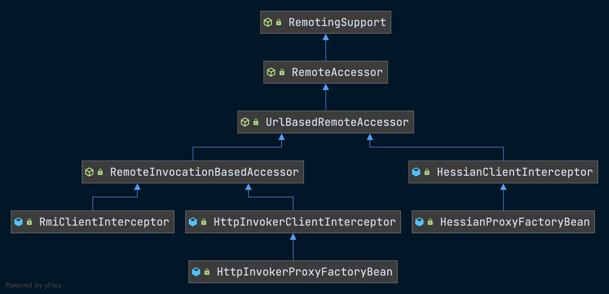
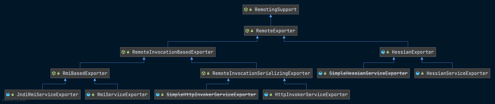
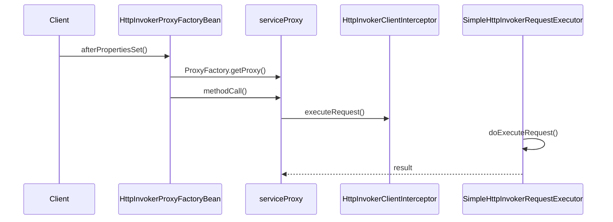
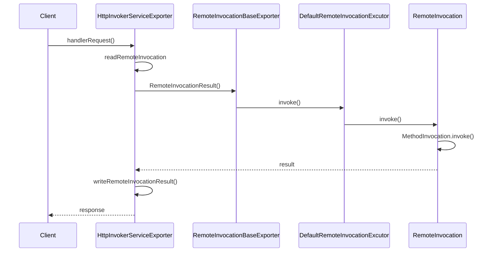

# Spring 远端调用的实现

## Spring 远端调用的应用场景

- 在分布式计算中，常常涉及服务器系统中各种不同进程之间的通信与计算交互，远端调用`RMI`是实现这种计算场景的一种有效方式。
- Spring提供了**轻量级的远端调用模块**，从而为分布式系统、云计算等应用场景开发提供平台支持。
- 根据Spring的既定策略，它依然只是起到一个**集成平台**的作用，而并不期望在实现方案上与已有的远端调用方案形成竞争。
- 对Spring来说，他要在已有远端调用技术实现的基础上，通过`IoC`与`AOP`的封装，让应用更方便地使用这些远端调用服务，并能够更方便灵活地与现有应用系统实现集成。

## Spring 远端调用的设计概览

### 客户端类结构图

- Spring为`RemotingSupport`设计的一系列子类，这一系列的子类是Spring用来**封装远端服务客户端**所使用的。
- 具体实现上，有一系列的拦截器实现，在这些拦截器中完成了**对客户端远端调用的主要封装**，和Spring提供的与具体远端调用实现对应的`FactoryBean`一起，构成了远端调用客户端的**基础设施**。
- 在`RemoteService`下有一系列子类，这些子类是**为远端调用的服务器端的实现提供导出服务**的，通过这个服务导出的设计支持，客户端可以**完成对这些导出的远端服务的调用**。
- 在Spring远端调用的客户端，已经为常用的远端调用解决方案提供了一系列的`ProxyFactoryBean`。
- `ProxyFactoryBean` 通过AOP的方式，设计了拦截器来封装对远端调用客户端的处理，并且在其中都会继承对应的拦截器，这些拦截器作为`ProxyFactoryBean`的基类，是实现远端调用客户端封装的重点所在。



### 服务器端类结构图

- 在服务器端，需要对客户端的请求进行响应。



## Spring 远端调用的实现

### Spring HTTP调用器的实现

>HTTP调用器是基于HTTP协议提供的一种远端调用方案。
>

#### 设计原理和实现过程

- HTTP调用器是Spring远端调用实现方案中最简单的一种。
- 在IoC容器的Bean定义中，配置好相应的HTTP调用器的客户端，并将服务器端的调用接口通过`HttpInvokerServiceExporter`导出到MVC模块中，就可以使用。
- `HttpInvokerProxyFactoryBean`是一个`ProxyFactoryBean`，它会使用Spring AOP来对HTTP调用器的客户端进行封装。
- `HttpInvokerProxyFactoryBean`中，设置的拦截器是`HttpInvokerClientInterceptor`，拦截器中封装客户端的基本实现。
- 服务器端的设计是通过`HttpInvokerServiceExporter`来完成的，因为需要处理HTTP的服务请求，它的设计是需要**依赖Spring的MVC模块**的。在这个`HttpInvokerServiceExporter`中，会封装MVC框架的`DispatcherServlet`，并且设置相应的`Controller`，这个控制器`Controller`执行相应的HTTP请求处理。
- 在这个HTTP调用器的设计中，并不需要依赖其他的**第三方模块**，主要通过HTTP协议，通过HTTP协议的**对象序列化**和**反序列化**，以及Spring的MVC模块来处理HTTP请求和响应的。

#### 配置HTTP调用器客户端

- 使用HTTP调用器和使用Java RMI一样，需要使用**Java的序列化机制**来完成客户端和服务器端通信。
- HttpInvokerProxyFactoryBean中封装了对应的远端服务的信息。
  - 域名
  - 端口号
  - 服务所在URL

```xml
<bean id="proxy" class="org.springframework.remoting.
                        httpinvoker.HttpInvokerProxyFactoryBean">
  <property name="serviceUrl">
    <value>http://yourhost:8080/yourURL</value>
  </property>
  <property name="serviceInterface">
    <value>yourInterface</value>
  </property>
</bean>
<bean id="yourBean" class="yourClass">
  <property name="remoteService">
    <ref bean="proxy"/>
  </property>
</bean>
```

#### HTTP调用器客户端的实现

- `HttpInvoker`的实现特点在于，它使用的是Java虚拟机提供的基本特性，不依赖于第三方类库。

##### 时序图

- 在`HtttpInvokerProxyFactory`中设置了`serviceProxy`对象作为远端服务的本地代理对象。
- 代理对象的设置是在依赖注入完成以后，通过`afterPropertiesSet`来对远端调用进行设置。
  - 使用ProxyFactory生成**代理对象**。
  - 为代理对象设置**代理接口方法**。
  - 把`ProxyFactory`生成的代理对象设置给`serviceProxy`。



##### HttpInvokerProxyFactoryBean

```java
public class HttpInvokerProxyFactoryBean extends HttpInvokerClientInterceptor implements FactoryBean<Object> {

  // 远程代理的对象
  @Nullable
  private Object serviceProxy;

  // 在注入完成之后，设置远端对象代理
  @Override
  public void afterPropertiesSet() {
    super.afterPropertiesSet();
    Class<?> ifc = getServiceInterface();
    Assert.notNull(ifc, "Property 'serviceInterface' is required");
    this.serviceProxy = new ProxyFactory(ifc, this).getProxy(getBeanClassLoader());
  }

  @Override
  @Nullable
  public Object getObject() {
    return this.serviceProxy;
  }

  @Override
  public Class<?> getObjectType() {
    return getServiceInterface();
  }

  @Override
  public boolean isSingleton() {
    return true;
  }

}
```

##### HttpInvokerClientInterceptor

- 在`HttpInvokerClientInterceptor`的`invoke`方法中实现的回调流程。

  - 通过HTTP请求触发远端服务，在触发远端服务的时候，通过生成一个MethodInvocation对象来封装当前代理方法调用的具体调用场景。

  - 代理对象会`MethodInvocation`对象作为参数，通过HTTP的Java对象序列化机制传输到**服务器端**。

  - 远端服务处理请求并传回给客户端。

  - 接收远端服务器传回来封装在`RemoteInvocationResult`对象结果，将结果通过HTTP的Java对象序列化机制回送到客户端，从而交由客户端应用来使用。

- `RemoteInvocation`实际上是一个数据对象。这个数据对象中封装了调用的具体信息，比如调用方法名、参数、参数类型等。

- 远端调用的具体实现过程是由`executeRequest`方法来完成的。

- `HttpInvokerRequestExecutor`是`SimpleHttpInvokerRequestExecutor`的子类。

  

```java
public class HttpInvokerClientInterceptor extends RemoteInvocationBasedAccessor
  implements MethodInterceptor, HttpInvokerClientConfiguration {

  @Nullable
  private String codebaseUrl;

  @Nullable
  private HttpInvokerRequestExecutor httpInvokerRequestExecutor;

  public void setCodebaseUrl(@Nullable String codebaseUrl) {
    this.codebaseUrl = codebaseUrl;
  }

  @Override
  @Nullable
  public String getCodebaseUrl() {
    return this.codebaseUrl;
  }

  public void setHttpInvokerRequestExecutor(HttpInvokerRequestExecutor httpInvokerRequestExecutor) {
    this.httpInvokerRequestExecutor = httpInvokerRequestExecutor;
  }

  public HttpInvokerRequestExecutor getHttpInvokerRequestExecutor() {
    if (this.httpInvokerRequestExecutor == null) {
      SimpleHttpInvokerRequestExecutor executor = new SimpleHttpInvokerRequestExecutor();
      executor.setBeanClassLoader(getBeanClassLoader());
      this.httpInvokerRequestExecutor = executor;
    }
    return this.httpInvokerRequestExecutor;
  }

  @Override
  public void afterPropertiesSet() {
    super.afterPropertiesSet();

    // Eagerly initialize the default HttpInvokerRequestExecutor, if needed.
    getHttpInvokerRequestExecutor();
  }


  // 代理对象的方法调用入口
  @Override
  public Object invoke(MethodInvocation methodInvocation) throws Throwable {
    if (AopUtils.isToStringMethod(methodInvocation.getMethod())) {
      return "HTTP invoker proxy for service URL [" + getServiceUrl() + "]";
    }
    // 创建RemoteInvocation对象，这个对象封装了对远端的调用，这些远端调用通过序列化机制完成
    RemoteInvocation invocation = createRemoteInvocation(methodInvocation);
    RemoteInvocationResult result;

    try {
      // 执行请求
      result = executeRequest(invocation, methodInvocation);
    }
    catch (Throwable ex) {
      RemoteAccessException rae = convertHttpInvokerAccessException(ex);
      throw (rae != null ? rae : ex);
    }

    try {
      // 返回远端调用的结果
      return recreateRemoteInvocationResult(result);
    }
    catch (Throwable ex) {
      if (result.hasInvocationTargetException()) {
        throw ex;
      }
      else {
        throw new RemoteInvocationFailureException("Invocation of method [" + methodInvocation.getMethod() +
                                                   "] failed in HTTP invoker remote service at [" + getServiceUrl() + "]", ex);
      }
    }
  }

  protected RemoteInvocationResult executeRequest(
    RemoteInvocation invocation, MethodInvocation originalInvocation) throws Exception {

    return executeRequest(invocation);
  }

  protected RemoteInvocationResult executeRequest(RemoteInvocation invocation) throws Exception {
    return getHttpInvokerRequestExecutor().executeRequest(this, invocation);
  }

  @Nullable
  protected RemoteAccessException convertHttpInvokerAccessException(Throwable ex) {
    if (ex instanceof ConnectException) {
      return new RemoteConnectFailureException(
        "Could not connect to HTTP invoker remote service at [" + getServiceUrl() + "]", ex);
    }

    if (ex instanceof ClassNotFoundException || ex instanceof NoClassDefFoundError ||
        ex instanceof InvalidClassException) {
      return new RemoteAccessException(
        "Could not deserialize result from HTTP invoker remote service [" + getServiceUrl() + "]", ex);
    }

    if (ex instanceof Exception) {
      return new RemoteAccessException(
        "Could not access HTTP invoker remote service at [" + getServiceUrl() + "]", ex);
    }

    return null;
  }

}

protected RemoteInvocationResult executeRequest(
  RemoteInvocation invocation, MethodInvocation originalInvocation) throws Exception {

  return executeRequest(invocation);
}
```

##### HttpInvokerClientInterceptor

- 整个HTTP调用器客户端实现的基本过程，与Servlet实现机制大致一样。
  - 打开一个HTTP链接。
  - 通过HTTP的对象序列化，把封装好的调用场景，也就是在前面生成的`RemoteInvocation`传送到服务器端，请求服务响应。
  - 在服务器端完成服务以后，会把执行结果，以对象序列化的方式回送给HTTP响应`HttpResponse`。
  - 从HTTP响应中读出远端服务的执行结果。
- 

`HttpInvokerClientInterceptor#executeRequest`

```java
protected RemoteInvocationResult executeRequest(RemoteInvocation invocation) throws Exception {
  return getHttpInvokerRequestExecutor().executeRequest(this, invocation);
}

```

##### SimpleHttpInvokerRequestExecutor

`SimpleHttpInvokerRequestExecutor#doExecuteRequest`

```java
@Override
protected RemoteInvocationResult doExecuteRequest(
  HttpInvokerClientConfiguration config, ByteArrayOutputStream baos)
  throws IOException, ClassNotFoundException {
  // 打开一个连接
  HttpURLConnection con = openConnection(config);
  prepareConnection(con, baos.size());
  // 将请求写入body中
  writeRequestBody(config, con, baos);
  // 验证响应
  validateResponse(config, con);
  // 读取响应
  InputStream responseBody = readResponseBody(config, con);

  return readRemoteInvocationResult(responseBody, config.getCodebaseUrl());
}

/**
	* 向request body写入
 **/
protected void writeRequestBody(
  HttpInvokerClientConfiguration config, HttpURLConnection con, ByteArrayOutputStream baos)
  throws IOException {

  baos.writeTo(con.getOutputStream());
}

/**
	* 从响应中获取body数据
 **/
protected InputStream readResponseBody(HttpInvokerClientConfiguration config, HttpURLConnection con)
  throws IOException {

  if (isGzipResponse(con)) {
    // GZIP response found - need to unzip.
    return new GZIPInputStream(con.getInputStream());
  }
  else {
    // Plain response found.
    return con.getInputStream();
  }
}
```

##### AbstractHttpInvokerRequestExecutor

`AbstractHttpInvokerRequestExecutor#readRemoteInvocationResult`

- **对远端服务执行结果的返回对象的处理**是在`AbstractHttpInvokerRequestExecutor`中实现的。
- 在通过HTTP把对象**反序列化**之后，会把远端的服务结果封装成`RemoteInvocationResult`对象。

```java
protected RemoteInvocationResult readRemoteInvocationResult(InputStream is, @Nullable String codebaseUrl)
  throws IOException, ClassNotFoundException {

  try (ObjectInputStream ois = createObjectInputStream(decorateInputStream(is), codebaseUrl)) {
    return doReadRemoteInvocationResult(ois);
  }
}

protected RemoteInvocationResult doReadRemoteInvocationResult(ObjectInputStream ois)
  throws IOException, ClassNotFoundException {

  Object obj = ois.readObject();
  if (!(obj instanceof RemoteInvocationResult)) {
    throw new RemoteException("Deserialized object needs to be assignable to type [" +
                              RemoteInvocationResult.class.getName() + "]: " + ClassUtils.getDescriptiveType(obj));
  }
  return (RemoteInvocationResult) obj;
}
```

#### 配置HTTP调用器远端服务器端

##### 配置

- 通过配置，可以把远端调用服务在服务器端导出，暴露给客户端使用。
- 需要配置远端服务对应的URL，还需要设置提供服务的Bean。
- `HttpInvokerServiceExporter`封装了对HTTP协议的处理以及Java对象的序列化功能，然后通过`Proxy`代理类进行封装，从而成为HTTP调用器服务器端的基础设施。

```xml
<bean name="/remoteServiceURL" class="org.springframework.
                                      remoting.httpinvoker.HttpInvokerServiceExporter">
  <property name="service">
    <ref bean="serviebean"/>
  </property>
  <property name="serviceInterface">
    <value>yourInterface</value>
  </property>
</bean>
```

#### HTTP调用器服务器端的实现

- `HttpInvokerServiceExporter`的使用是与Spring MVC结合在一起的，实际上是Spring MVC框架中的一个`Controller`。

##### 时序图

- 在服务器端，`RemoteInvocation`对象是通过从HTTP请求中**反序列化**得到的。
- 具体的服务执行是由执行器`DefaultRemoteInvocationExecutor`来完成的。




##### HttpInvokerServiceExporter

`HttpInvokerServiceExporter#handleRequest`

- 处理远程调用。

```java
@Override
public void handleRequest(HttpServletRequest request, HttpServletResponse response)
  throws ServletException, IOException {

  try {
    // 从request中获取RemoteInvocation
    RemoteInvocation invocation = readRemoteInvocation(request);
    // 调用并获得结果
    RemoteInvocationResult result = invokeAndCreateResult(invocation, getProxy());
    // 将结果写入到响应体中
    writeRemoteInvocationResult(request, response, result);
  }
  catch (ClassNotFoundException ex) {
    throw new NestedServletException("Class not found during deserialization", ex);
  }
}
```

`HttpInvokerServiceExporter#readRemoteInvocation`

````java
protected RemoteInvocation readRemoteInvocation(HttpServletRequest request)
  throws IOException, ClassNotFoundException {

  return readRemoteInvocation(request, request.getInputStream());
}

protected RemoteInvocation readRemoteInvocation(HttpServletRequest request, InputStream is)
  throws IOException, ClassNotFoundException {

  ObjectInputStream ois = createObjectInputStream(decorateInputStream(request, is));
  try {
    return doReadRemoteInvocation(ois);
  }
  finally {
    ois.close();
  }
}
````

`HttpInvokerServiceExporter#writeRemoteInvocationResult`

- 向响应写入远程结果方法。

- 需要设置响应的`ContentType`属性，设置为`application/x-java-serialized-object`。

```java
protected void writeRemoteInvocationResult(
  HttpServletRequest request, HttpServletResponse response, RemoteInvocationResult result)
  throws IOException {

  response.setContentType(getContentType());
  writeRemoteInvocationResult(request, response, result, response.getOutputStream());
}
```


##### RemoteInvocationSerializingExporter

`RemoteInvocationSerializingExporter#doReadRemoteInvocation`

- 从流中获取请求对象，并转换成`RemoteInvocation`。

```java
protected RemoteInvocation doReadRemoteInvocation(ObjectInputStream ois)
  throws IOException, ClassNotFoundException {

  Object obj = ois.readObject();
  if (!(obj instanceof RemoteInvocation)) {
    throw new RemoteException("Deserialized object needs to be assignable to type [" +
                              RemoteInvocation.class.getName() + "]: " + ClassUtils.getDescriptiveType(obj));
  }
  return (RemoteInvocation) obj;
}
```

##### RemoteInvocationBasedExporter

`RemoteInvocationBasedExporter#invokeAndCreateResult`

- 调用实际的方法，并把结果转成`RemoteInvocationResult`返回。

```java
protected RemoteInvocationResult invokeAndCreateResult(RemoteInvocation invocation, Object targetObject) {
  try {
    Object value = invoke(invocation, targetObject);
    return new RemoteInvocationResult(value);
  }
  catch (Throwable ex) {
    return new RemoteInvocationResult(ex);
  }
}
```

`RemoteInvocationBasedExporter#invoke`

- invoke方法通过反射调用代理类的方法。

```java
protected Object invoke(RemoteInvocation invocation, Object targetObject)
  throws NoSuchMethodException, IllegalAccessException, InvocationTargetException {

  if (logger.isTraceEnabled()) {
    logger.trace("Executing " + invocation);
  }
  try {
    // 调用RemoteInvocationExecutor，这个执行器是DefaultRemoteInvocationExecutor
    return getRemoteInvocationExecutor().invoke(invocation, targetObject);
  }
  catch (NoSuchMethodException ex) {
    if (logger.isDebugEnabled()) {
      logger.debug("Could not find target method for " + invocation, ex);
    }
    throw ex;
  }
  catch (IllegalAccessException ex) {
    if (logger.isDebugEnabled()) {
      logger.debug("Could not access target method for " + invocation, ex);
    }
    throw ex;
  }
  catch (InvocationTargetException ex) {
    if (logger.isDebugEnabled()) {
      logger.debug("Target method failed for " + invocation, ex.getTargetException());
    }
    throw ex;
  }
}
```

##### DefaultRemoteInvocationExecutor

`DefaultRemoteInvocationExecutor#invoke`

```java
@Override
public Object invoke(RemoteInvocation invocation, Object targetObject)
  throws NoSuchMethodException, IllegalAccessException, InvocationTargetException{

  Assert.notNull(invocation, "RemoteInvocation must not be null");
  Assert.notNull(targetObject, "Target object must not be null");
  return invocation.invoke(targetObject);
}
```

##### RemoteInvocation

`RemoteInvocation#invoke`

```java
public Object invoke(Object targetObject)
  throws NoSuchMethodException, IllegalAccessException, InvocationTargetException {

  Method method = targetObject.getClass().getMethod(this.methodName, this.parameterTypes);
  return method.invoke(targetObject, this.arguments);
}
```

### Spring Hession/Burlap的实现原理

- `Hession`，Caocho公司开发的轻量级的**二进制协议**。
- `Burlap`是基于XML协议的一种实现。
- `Hession`、`Burlap`都是建立在使用HTTP协议的基础上，把HTTP作为其传输数据的基本协议。

#### 设计原理和实现过程

- Spring Hessian/Burlap远端模块的具体设计主要体现。
  - 客户端封装。
  - 服务器端的设计。
- 客户端设计上，`HessianProxyFactoryBean`/`BurlapProxyFactoryBean`和`HessianClientInterceptor`是Spring对Hessian/Burlap进行封装的主要类。
- 服务器端的设计，Spring提供`HessianServiceExporter`和`BurlapServiceExporter`来简化对Hessian/Burlap服务器的使用。
- 通过Spring MVC的`DispatcherServlet`将服务请求传递到`HessianSkeleton`/`BurlapSkeleton`服务中，将请求直接交由`Hessian`/`Burlap`处理，完成**特定协议的处理**和**服务对象的调用**，并将服务结果封装到**特定的Hessian/Burlap协议**中去，由网络写回到客户端，从而完成一次完整的服务请求和响应。

#### Hessian/Burlap的配置

##### 客户端配置

```xml
<bean id="hessianProxy" class="org.springframework.remoting.caucho.
                              HessianProxyFactoryBean">
  <property name="serviceUrl">
    <value>http://yourhost:8080/serviceURL</value>
  </property>
  <property name="serviceInterface">
    <value>yourInterface</value>
  </property>
</bean>
```

##### 服务端配置

```xml
<bean name="/serviceURL" class="org.springframework.remoting.caucho.
                                HessianServiceExporter">
  <property name="service">
    <ref bean="seviceBean"/>
  </property>
  <property name="serviceInterface">
    <value>yourInterface</value>
  </property>
</bean>
```

#### Hessian客户端的实现


