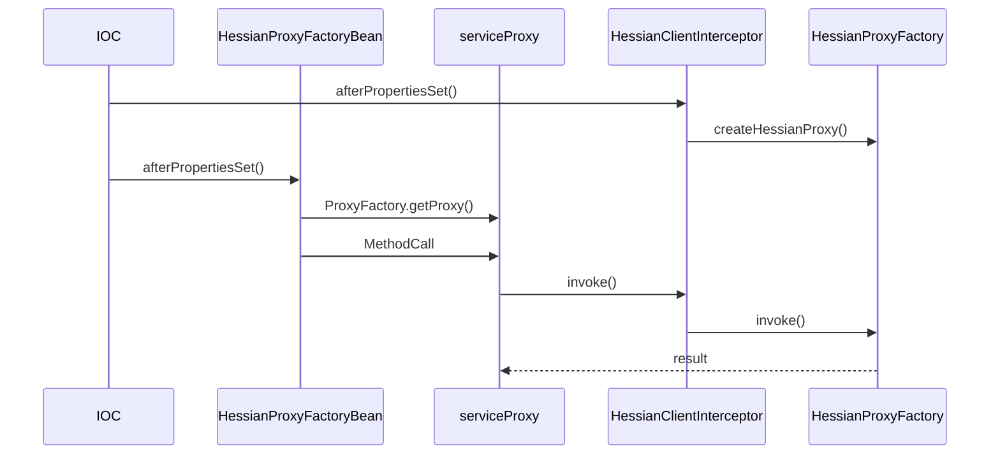
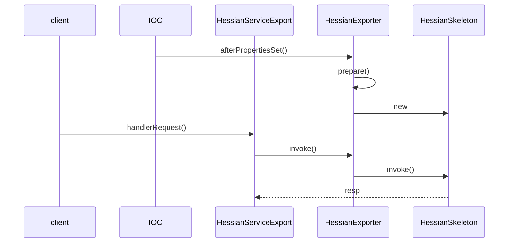

# Spring 远端调用的实现

## Spring 远端调用的应用场景

- 在分布式计算中，常常涉及服务器系统中各种不同进程之间的通信与计算交互，远端调用`RMI`是实现这种计算场景的一种有效方式。
- Spring提供了**轻量级的远端调用模块**，从而为分布式系统、云计算等应用场景开发提供平台支持。
- 根据Spring的既定策略，它依然只是起到一个**集成平台**的作用，而并不期望在实现方案上与已有的远端调用方案形成竞争。
- 对Spring来说，他要在已有远端调用技术实现的基础上，通过`IoC`与`AOP`的封装，让应用更方便地使用这些远端调用服务，并能够更方便灵活地与现有应用系统实现集成。

## Spring 远端调用的设计概览

### 客户端类结构图

- Spring为`RemotingSupport`设计的一系列子类，这一系列的子类是Spring用来**封装远端服务客户端**所使用的。
- 具体实现上，有一系列的拦截器实现，在这些拦截器中完成了**对客户端远端调用的主要封装**，和Spring提供的与具体远端调用实现对应的`FactoryBean`一起，构成了远端调用客户端的**基础设施**。
- 在`RemoteService`下有一系列子类，这些子类是**为远端调用的服务器端的实现提供导出服务**的，通过这个服务导出的设计支持，客户端可以**完成对这些导出的远端服务的调用**。
- 在Spring远端调用的客户端，已经为常用的远端调用解决方案提供了一系列的`ProxyFactoryBean`。
- `ProxyFactoryBean` 通过AOP的方式，设计了拦截器来封装对远端调用客户端的处理，并且在其中都会继承对应的拦截器，这些拦截器作为`ProxyFactoryBean`的基类，是实现远端调用客户端封装的重点所在。


### 服务器端类结构图

- 在服务器端，需要对客户端的请求进行响应。


## Spring 远端调用的实现

### Spring HTTP调用器的实现

>HTTP调用器是基于HTTP协议提供的一种远端调用方案。
>

#### 设计原理和实现过程

- HTTP调用器是Spring远端调用实现方案中最简单的一种。
- 在IoC容器的Bean定义中，配置好相应的HTTP调用器的客户端，并将服务器端的调用接口通过`HttpInvokerServiceExporter`导出到MVC模块中，就可以使用。
- `HttpInvokerProxyFactoryBean`是一个`ProxyFactoryBean`，它会使用Spring AOP来对HTTP调用器的客户端进行封装。
- `HttpInvokerProxyFactoryBean`中，设置的拦截器是`HttpInvokerClientInterceptor`，拦截器中封装客户端的基本实现。
- 服务器端的设计是通过`HttpInvokerServiceExporter`来完成的，因为需要处理HTTP的服务请求，它的设计是需要**依赖Spring的MVC模块**的。在这个`HttpInvokerServiceExporter`中，会封装MVC框架的`DispatcherServlet`，并且设置相应的`Controller`，这个控制器`Controller`执行相应的HTTP请求处理。
- 在这个HTTP调用器的设计中，并不需要依赖其他的**第三方模块**，主要通过HTTP协议，通过HTTP协议的**对象序列化**和**反序列化**，以及Spring的MVC模块来处理HTTP请求和响应的。

#### 配置HTTP调用器客户端

- 使用HTTP调用器和使用Java RMI一样，需要使用**Java的序列化机制**来完成客户端和服务器端通信。
- HttpInvokerProxyFactoryBean中封装了对应的远端服务的信息。
  - 域名
  - 端口号
  - 服务所在URL

```xml
<bean id="proxy" class="org.springframework.remoting.
                        httpinvoker.HttpInvokerProxyFactoryBean">
  <property name="serviceUrl">
    <value>http://yourhost:8080/yourURL</value>
  </property>
  <property name="serviceInterface">
    <value>yourInterface</value>
  </property>
</bean>
<bean id="yourBean" class="yourClass">
  <property name="remoteService">
    <ref bean="proxy"/>
  </property>
</bean>
```

#### HTTP调用器客户端的实现

- `HttpInvoker`的实现特点在于，它使用的是Java虚拟机提供的基本特性，不依赖于第三方类库。

##### 时序图

- 在`HtttpInvokerProxyFactory`中设置了`serviceProxy`对象作为远端服务的本地代理对象。
- 代理对象的设置是在依赖注入完成以后，通过`afterPropertiesSet`来对远端调用进行设置。
  - 使用ProxyFactory生成**代理对象**。
  - 为代理对象设置**代理接口方法**。
  - 把`ProxyFactory`生成的代理对象设置给`serviceProxy`。


##### HttpInvokerProxyFactoryBean

```java
public class HttpInvokerProxyFactoryBean extends HttpInvokerClientInterceptor implements FactoryBean<Object> {

  // 远程代理的对象
  @Nullable
  private Object serviceProxy;

  // 在注入完成之后，设置远端对象代理
  @Override
  public void afterPropertiesSet() {
    super.afterPropertiesSet();
    Class<?> ifc = getServiceInterface();
    Assert.notNull(ifc, "Property 'serviceInterface' is required");
    this.serviceProxy = new ProxyFactory(ifc, this).getProxy(getBeanClassLoader());
  }

  @Override
  @Nullable
  public Object getObject() {
    return this.serviceProxy;
  }

  @Override
  public Class<?> getObjectType() {
    return getServiceInterface();
  }

  @Override
  public boolean isSingleton() {
    return true;
  }

}
```

##### HttpInvokerClientInterceptor

- 在`HttpInvokerClientInterceptor`的`invoke`方法中实现的回调流程。

  - 通过HTTP请求触发远端服务，在触发远端服务的时候，通过生成一个MethodInvocation对象来封装当前代理方法调用的具体调用场景。

  - 代理对象会`MethodInvocation`对象作为参数，通过HTTP的Java对象序列化机制传输到**服务器端**。

  - 远端服务处理请求并传回给客户端。

  - 接收远端服务器传回来封装在`RemoteInvocationResult`对象结果，将结果通过HTTP的Java对象序列化机制回送到客户端，从而交由客户端应用来使用。

- `RemoteInvocation`实际上是一个数据对象。这个数据对象中封装了调用的具体信息，比如调用方法名、参数、参数类型等。

- 远端调用的具体实现过程是由`executeRequest`方法来完成的。

- `HttpInvokerRequestExecutor`是`SimpleHttpInvokerRequestExecutor`的子类。

  

```java
public class HttpInvokerClientInterceptor extends RemoteInvocationBasedAccessor
  implements MethodInterceptor, HttpInvokerClientConfiguration {

  @Nullable
  private String codebaseUrl;

  @Nullable
  private HttpInvokerRequestExecutor httpInvokerRequestExecutor;

  public void setCodebaseUrl(@Nullable String codebaseUrl) {
    this.codebaseUrl = codebaseUrl;
  }

  @Override
  @Nullable
  public String getCodebaseUrl() {
    return this.codebaseUrl;
  }

  public void setHttpInvokerRequestExecutor(HttpInvokerRequestExecutor httpInvokerRequestExecutor) {
    this.httpInvokerRequestExecutor = httpInvokerRequestExecutor;
  }

  public HttpInvokerRequestExecutor getHttpInvokerRequestExecutor() {
    if (this.httpInvokerRequestExecutor == null) {
      SimpleHttpInvokerRequestExecutor executor = new SimpleHttpInvokerRequestExecutor();
      executor.setBeanClassLoader(getBeanClassLoader());
      this.httpInvokerRequestExecutor = executor;
    }
    return this.httpInvokerRequestExecutor;
  }

  @Override
  public void afterPropertiesSet() {
    super.afterPropertiesSet();

    // Eagerly initialize the default HttpInvokerRequestExecutor, if needed.
    getHttpInvokerRequestExecutor();
  }


  // 代理对象的方法调用入口
  @Override
  public Object invoke(MethodInvocation methodInvocation) throws Throwable {
    if (AopUtils.isToStringMethod(methodInvocation.getMethod())) {
      return "HTTP invoker proxy for service URL [" + getServiceUrl() + "]";
    }
    // 创建RemoteInvocation对象，这个对象封装了对远端的调用，这些远端调用通过序列化机制完成
    RemoteInvocation invocation = createRemoteInvocation(methodInvocation);
    RemoteInvocationResult result;

    try {
      // 执行请求
      result = executeRequest(invocation, methodInvocation);
    }
    catch (Throwable ex) {
      RemoteAccessException rae = convertHttpInvokerAccessException(ex);
      throw (rae != null ? rae : ex);
    }

    try {
      // 返回远端调用的结果
      return recreateRemoteInvocationResult(result);
    }
    catch (Throwable ex) {
      if (result.hasInvocationTargetException()) {
        throw ex;
      }
      else {
        throw new RemoteInvocationFailureException("Invocation of method [" + methodInvocation.getMethod() +
                                                   "] failed in HTTP invoker remote service at [" + getServiceUrl() + "]", ex);
      }
    }
  }

  protected RemoteInvocationResult executeRequest(
    RemoteInvocation invocation, MethodInvocation originalInvocation) throws Exception {

    return executeRequest(invocation);
  }

  protected RemoteInvocationResult executeRequest(RemoteInvocation invocation) throws Exception {
    return getHttpInvokerRequestExecutor().executeRequest(this, invocation);
  }

  @Nullable
  protected RemoteAccessException convertHttpInvokerAccessException(Throwable ex) {
    if (ex instanceof ConnectException) {
      return new RemoteConnectFailureException(
        "Could not connect to HTTP invoker remote service at [" + getServiceUrl() + "]", ex);
    }

    if (ex instanceof ClassNotFoundException || ex instanceof NoClassDefFoundError ||
        ex instanceof InvalidClassException) {
      return new RemoteAccessException(
        "Could not deserialize result from HTTP invoker remote service [" + getServiceUrl() + "]", ex);
    }

    if (ex instanceof Exception) {
      return new RemoteAccessException(
        "Could not access HTTP invoker remote service at [" + getServiceUrl() + "]", ex);
    }

    return null;
  }

}

protected RemoteInvocationResult executeRequest(
  RemoteInvocation invocation, MethodInvocation originalInvocation) throws Exception {

  return executeRequest(invocation);
}
```

##### HttpInvokerClientInterceptor

- 整个HTTP调用器客户端实现的基本过程，与Servlet实现机制大致一样。
  - 打开一个HTTP链接。
  - 通过HTTP的对象序列化，把封装好的调用场景，也就是在前面生成的`RemoteInvocation`传送到服务器端，请求服务响应。
  - 在服务器端完成服务以后，会把执行结果，以对象序列化的方式回送给HTTP响应`HttpResponse`。
  - 从HTTP响应中读出远端服务的执行结果。
- 

`HttpInvokerClientInterceptor#executeRequest`

```java
protected RemoteInvocationResult executeRequest(RemoteInvocation invocation) throws Exception {
  return getHttpInvokerRequestExecutor().executeRequest(this, invocation);
}

```

##### SimpleHttpInvokerRequestExecutor

`SimpleHttpInvokerRequestExecutor#doExecuteRequest`

```java
@Override
protected RemoteInvocationResult doExecuteRequest(
  HttpInvokerClientConfiguration config, ByteArrayOutputStream baos)
  throws IOException, ClassNotFoundException {
  // 打开一个连接
  HttpURLConnection con = openConnection(config);
  prepareConnection(con, baos.size());
  // 将请求写入body中
  writeRequestBody(config, con, baos);
  // 验证响应
  validateResponse(config, con);
  // 读取响应
  InputStream responseBody = readResponseBody(config, con);

  return readRemoteInvocationResult(responseBody, config.getCodebaseUrl());
}

/**
	* 向request body写入
 **/
protected void writeRequestBody(
  HttpInvokerClientConfiguration config, HttpURLConnection con, ByteArrayOutputStream baos)
  throws IOException {

  baos.writeTo(con.getOutputStream());
}

/**
	* 从响应中获取body数据
 **/
protected InputStream readResponseBody(HttpInvokerClientConfiguration config, HttpURLConnection con)
  throws IOException {

  if (isGzipResponse(con)) {
    // GZIP response found - need to unzip.
    return new GZIPInputStream(con.getInputStream());
  }
  else {
    // Plain response found.
    return con.getInputStream();
  }
}
```

##### AbstractHttpInvokerRequestExecutor

`AbstractHttpInvokerRequestExecutor#readRemoteInvocationResult`

- **对远端服务执行结果的返回对象的处理**是在`AbstractHttpInvokerRequestExecutor`中实现的。
- 在通过HTTP把对象**反序列化**之后，会把远端的服务结果封装成`RemoteInvocationResult`对象。

```java
protected RemoteInvocationResult readRemoteInvocationResult(InputStream is, @Nullable String codebaseUrl)
  throws IOException, ClassNotFoundException {

  try (ObjectInputStream ois = createObjectInputStream(decorateInputStream(is), codebaseUrl)) {
    return doReadRemoteInvocationResult(ois);
  }
}

protected RemoteInvocationResult doReadRemoteInvocationResult(ObjectInputStream ois)
  throws IOException, ClassNotFoundException {

  Object obj = ois.readObject();
  if (!(obj instanceof RemoteInvocationResult)) {
    throw new RemoteException("Deserialized object needs to be assignable to type [" +
                              RemoteInvocationResult.class.getName() + "]: " + ClassUtils.getDescriptiveType(obj));
  }
  return (RemoteInvocationResult) obj;
}
```

#### 配置HTTP调用器远端服务器端

##### 配置

- 通过配置，可以把远端调用服务在服务器端导出，暴露给客户端使用。
- 需要配置远端服务对应的URL，还需要设置提供服务的Bean。
- `HttpInvokerServiceExporter`封装了对HTTP协议的处理以及Java对象的序列化功能，然后通过`Proxy`代理类进行封装，从而成为HTTP调用器服务器端的基础设施。

```xml
<bean name="/remoteServiceURL" class="org.springframework.
                                      remoting.httpinvoker.HttpInvokerServiceExporter">
  <property name="service">
    <ref bean="serviebean"/>
  </property>
  <property name="serviceInterface">
    <value>yourInterface</value>
  </property>
</bean>
```

#### HTTP调用器服务器端的实现

- `HttpInvokerServiceExporter`的使用是与Spring MVC结合在一起的，实际上是Spring MVC框架中的一个`Controller`。

##### 时序图

- 在服务器端，`RemoteInvocation`对象是通过从HTTP请求中**反序列化**得到的。
- 具体的服务执行是由执行器`DefaultRemoteInvocationExecutor`来完成的。


##### HttpInvokerServiceExporter

`HttpInvokerServiceExporter#handleRequest`

- 处理远程调用。

```java
@Override
public void handleRequest(HttpServletRequest request, HttpServletResponse response)
  throws ServletException, IOException {

  try {
    // 从request中获取RemoteInvocation
    RemoteInvocation invocation = readRemoteInvocation(request);
    // 调用并获得结果
    RemoteInvocationResult result = invokeAndCreateResult(invocation, getProxy());
    // 将结果写入到响应体中
    writeRemoteInvocationResult(request, response, result);
  }
  catch (ClassNotFoundException ex) {
    throw new NestedServletException("Class not found during deserialization", ex);
  }
}
```

`HttpInvokerServiceExporter#readRemoteInvocation`

````java
protected RemoteInvocation readRemoteInvocation(HttpServletRequest request)
  throws IOException, ClassNotFoundException {

  return readRemoteInvocation(request, request.getInputStream());
}

protected RemoteInvocation readRemoteInvocation(HttpServletRequest request, InputStream is)
  throws IOException, ClassNotFoundException {

  ObjectInputStream ois = createObjectInputStream(decorateInputStream(request, is));
  try {
    return doReadRemoteInvocation(ois);
  }
  finally {
    ois.close();
  }
}
````

`HttpInvokerServiceExporter#writeRemoteInvocationResult`

- 向响应写入远程结果方法。

- 需要设置响应的`ContentType`属性，设置为`application/x-java-serialized-object`。

```java
protected void writeRemoteInvocationResult(
  HttpServletRequest request, HttpServletResponse response, RemoteInvocationResult result)
  throws IOException {

  response.setContentType(getContentType());
  writeRemoteInvocationResult(request, response, result, response.getOutputStream());
}
```


##### RemoteInvocationSerializingExporter

`RemoteInvocationSerializingExporter#doReadRemoteInvocation`

- 从流中获取请求对象，并转换成`RemoteInvocation`。

```java
protected RemoteInvocation doReadRemoteInvocation(ObjectInputStream ois)
  throws IOException, ClassNotFoundException {

  Object obj = ois.readObject();
  if (!(obj instanceof RemoteInvocation)) {
    throw new RemoteException("Deserialized object needs to be assignable to type [" +
                              RemoteInvocation.class.getName() + "]: " + ClassUtils.getDescriptiveType(obj));
  }
  return (RemoteInvocation) obj;
}
```

##### RemoteInvocationBasedExporter

`RemoteInvocationBasedExporter#invokeAndCreateResult`

- 调用实际的方法，并把结果转成`RemoteInvocationResult`返回。

```java
protected RemoteInvocationResult invokeAndCreateResult(RemoteInvocation invocation, Object targetObject) {
  try {
    Object value = invoke(invocation, targetObject);
    return new RemoteInvocationResult(value);
  }
  catch (Throwable ex) {
    return new RemoteInvocationResult(ex);
  }
}
```

`RemoteInvocationBasedExporter#invoke`

- invoke方法通过反射调用代理类的方法。

```java
protected Object invoke(RemoteInvocation invocation, Object targetObject)
  throws NoSuchMethodException, IllegalAccessException, InvocationTargetException {

  if (logger.isTraceEnabled()) {
    logger.trace("Executing " + invocation);
  }
  try {
    // 调用RemoteInvocationExecutor，这个执行器是DefaultRemoteInvocationExecutor
    return getRemoteInvocationExecutor().invoke(invocation, targetObject);
  }
  catch (NoSuchMethodException ex) {
    if (logger.isDebugEnabled()) {
      logger.debug("Could not find target method for " + invocation, ex);
    }
    throw ex;
  }
  catch (IllegalAccessException ex) {
    if (logger.isDebugEnabled()) {
      logger.debug("Could not access target method for " + invocation, ex);
    }
    throw ex;
  }
  catch (InvocationTargetException ex) {
    if (logger.isDebugEnabled()) {
      logger.debug("Target method failed for " + invocation, ex.getTargetException());
    }
    throw ex;
  }
}
```

##### DefaultRemoteInvocationExecutor

`DefaultRemoteInvocationExecutor#invoke`

```java
@Override
public Object invoke(RemoteInvocation invocation, Object targetObject)
  throws NoSuchMethodException, IllegalAccessException, InvocationTargetException{

  Assert.notNull(invocation, "RemoteInvocation must not be null");
  Assert.notNull(targetObject, "Target object must not be null");
  return invocation.invoke(targetObject);
}
```

##### RemoteInvocation

`RemoteInvocation#invoke`

```java
public Object invoke(Object targetObject)
  throws NoSuchMethodException, IllegalAccessException, InvocationTargetException {

  Method method = targetObject.getClass().getMethod(this.methodName, this.parameterTypes);
  return method.invoke(targetObject, this.arguments);
}
```

### Spring Hession/Burlap的实现原理

- `Hession`，Caocho公司开发的轻量级的**二进制协议**。
- `Burlap`是基于XML协议的一种实现。
- `Hession`、`Burlap`都是建立在使用HTTP协议的基础上，把HTTP作为其传输数据的基本协议。

#### 设计原理和实现过程

- Spring Hessian/Burlap远端模块的具体设计主要体现。
  - 客户端封装。
  - 服务器端的设计。
- 客户端设计上，`HessianProxyFactoryBean`/`BurlapProxyFactoryBean`和`HessianClientInterceptor`是Spring对Hessian/Burlap进行封装的主要类。
- 服务器端的设计，Spring提供`HessianServiceExporter`和`BurlapServiceExporter`来简化对Hessian/Burlap服务器的使用。
- 通过Spring MVC的`DispatcherServlet`将服务请求传递到`HessianSkeleton`/`BurlapSkeleton`服务中，将请求直接交由`Hessian`/`Burlap`处理，完成**特定协议的处理**和**服务对象的调用**，并将服务结果封装到**特定的Hessian/Burlap协议**中去，由网络写回到客户端，从而完成一次完整的服务请求和响应。

#### Hessian/Burlap的配置

##### 客户端配置

```xml
<bean id="hessianProxy" class="org.springframework.remoting.caucho.
                              HessianProxyFactoryBean">
  <property name="serviceUrl">
    <value>http://yourhost:8080/serviceURL</value>
  </property>
  <property name="serviceInterface">
    <value>yourInterface</value>
  </property>
</bean>
```

##### 服务端配置

```xml
<bean name="/serviceURL" class="org.springframework.remoting.caucho.
                                HessianServiceExporter">
  <property name="service">
    <ref bean="seviceBean"/>
  </property>
  <property name="serviceInterface">
    <value>yourInterface</value>
  </property>
</bean>
```

#### Hessian客户端的实现

##### 时序图



##### HessianProxyFactoryBean

- `FactoryBean`的主要功能是完成代理Proxy对象的生成和拦截器的设置。

```java
public class HessianProxyFactoryBean extends HessianClientInterceptor implements FactoryBean<Object> {

   @Nullable
   // 代理对象
   private Object serviceProxy;


   @Override
   // 依赖注入完成以后，设置Proxy代理对象
   public void afterPropertiesSet() {
      super.afterPropertiesSet();
      // 通过ProxyFactory生成代理对象，拦截器使用HessianClientInterceptor，因为HessianProxyFactoryBean本身是HessianClientInterceptor的子类，所以这里使用this为代理对象设置拦截器，getServiceInterface取得在BeanDefinition中定义的接口
      this.serviceProxy = new ProxyFactory(getServiceInterface(), this).getProxy(getBeanClassLoader());
   }


   @Override
   @Nullable
   public Object getObject() {
      return this.serviceProxy;
   }

   @Override
   public Class<?> getObjectType() {
      return getServiceInterface();
   }

   @Override
   public boolean isSingleton() {
      return true;
   }

}
```

##### HessianClientInterceptor

`HessianClientInterceptor#invoke`

- 通过Method的反射来实现对Hessian的Proxy代理对象的远程调用。
- proxy对象是Hessian的一个实现类，而不是通常看到的Java的Proxy代理对象。

```java
@Override
@Nullable
public Object invoke(MethodInvocation invocation) throws Throwable {
  if (this.hessianProxy == null) {
    throw new IllegalStateException("HessianClientInterceptor is not properly initialized - " +
                                    "invoke 'prepare' before attempting any operations");
  }

  ClassLoader originalClassLoader = overrideThreadContextClassLoader();
  try {
    // 通过反射实现远程调用
    return invocation.getMethod().invoke(this.hessianProxy, invocation.getArguments());
  }
  catch (InvocationTargetException ex) {
    Throwable targetEx = ex.getTargetException();
    // Hessian 4.0 check: another layer of InvocationTargetException.
    if (targetEx instanceof InvocationTargetException) {
      targetEx = ((InvocationTargetException) targetEx).getTargetException();
    }
    if (targetEx instanceof HessianConnectionException) {
      throw convertHessianAccessException(targetEx);
    }
    else if (targetEx instanceof HessianException || targetEx instanceof HessianRuntimeException) {
      Throwable cause = targetEx.getCause();
      throw convertHessianAccessException(cause != null ? cause : targetEx);
    }
    else if (targetEx instanceof UndeclaredThrowableException) {
      UndeclaredThrowableException utex = (UndeclaredThrowableException) targetEx;
      throw convertHessianAccessException(utex.getUndeclaredThrowable());
    }
    else {
      throw targetEx;
    }
  }
  catch (Throwable ex) {
    throw new RemoteProxyFailureException(
      "Failed to invoke Hessian proxy for remote service [" + getServiceUrl() + "]", ex);
  }
  finally {
    resetThreadContextClassLoader(originalClassLoader);
  }
}
```

`HessianClientInterceptor#afterPropertiesSet`

```java
@Override
public void afterPropertiesSet() {
  super.afterPropertiesSet();
  prepare();
}
// 调用createHessianProxy，这里的proxyFactory是Hessian的类HessianProxyFactory
public void prepare() throws RemoteLookupFailureException {
  try {
    this.hessianProxy = createHessianProxy(this.proxyFactory);
  }
  catch (MalformedURLException ex) {
    throw new RemoteLookupFailureException("Service URL [" + getServiceUrl() + "] is invalid", ex);
  }
}

protected Object createHessianProxy(HessianProxyFactory proxyFactory) throws MalformedURLException {
  Assert.notNull(getServiceInterface(), "'serviceInterface' is required");
  return proxyFactory.create(getServiceInterface(), getServiceUrl(), getBeanClassLoader());
}
```

#### Burlap客户端的实现

- `Burlap`客户端的实现原理和`Hessian`客户端的实现原理是非常类似的。
- Spring为`Burlap`的使用设计了`BurlapProxyFactoryBean`。

#### Hessian/Burlap服务器端的配置

```xml
<bean name="/serviceURL" class="org.springframework.remoting.caucho.HessianServiceExporter">
  <property name="service" ref="sevice"/>
  <property name="serviceInterface" value="yourInterface"/>
</bean>
<bean name="/serviceURL" class="org.springframework.remoting.caucho.BurlapServiceExporter">
  <property name="service" ref="sevice"/>
  <property name="serviceInterface" value="yourInterface"/>
</bean>
```

#### Hessian服务器端的实现

- `Hessian`通过`HessianServiceExporter`完成服务器端的服务导出。
- `HessianServiceExporter`接收`handleRequest`方法响应远端客户端发送过来的远端服务请求。
- 通过`invoke`方法，启动`HessianExporter`和`HessianSkeleton`的本地服务调用。

##### 时序图

- 在准备好HTTP的`Response`之后，服务器端对服务的调用和执行结果的返回都是由`invoke`方法来完成的。
- invoke方法是在HessianServiceExporter的基类`HessianExporter`中实现的。




##### HessianServiceExporter

- `HessianServiceExporter`实际上是Spring MVC框架中的一个`Controller`。

- `HessianServiceExporter`把远端服务整合到Spring MVC框架中，将提供的服务封装到`HttpRequestHandler`的`handleRequest`方法中去完成，从而借助`Spring MVC`的**实现完成服务在服务器端的导出**。

```java
public class HessianServiceExporter extends HessianExporter implements HttpRequestHandler {

  /**
	 * Processes the incoming Hessian request and creates a Hessian response.
	 */
  @Override
  public void handleRequest(HttpServletRequest request, HttpServletResponse response)
    throws ServletException, IOException {

    if (!"POST".equals(request.getMethod())) {
      throw new HttpRequestMethodNotSupportedException(request.getMethod(),
                                                       new String[] {"POST"}, "HessianServiceExporter only supports POST requests");
    }
		// 设置response的输出类型
    response.setContentType(CONTENT_TYPE_HESSIAN);
    try {
      // 对服务器端的远端对象的方法调用
      invoke(request.getInputStream(), response.getOutputStream());
    }
    catch (Throwable ex) {
      throw new NestedServletException("Hessian skeleton invocation failed", ex);
    }
  }

}
```

##### HessianExporter

`HessianExporter#prepare`

```java
public void prepare() {
  checkService();
  checkServiceInterface();
  this.skeleton = new HessianSkeleton(getProxyForService(), getServiceInterface());
}

protected void checkService() throws IllegalArgumentException {
  Assert.notNull(getService(), "Property 'service' is required");
}
protected void checkServiceInterface() throws IllegalArgumentException {
  Class<?> serviceInterface = getServiceInterface();
  Assert.notNull(serviceInterface, "Property 'serviceInterface' is required");

  Object service = getService();
  if (service instanceof String) {
    throw new IllegalArgumentException("Service [" + service + "] is a String " +
                                       "rather than an actual service reference: Have you accidentally specified " +
                                       "the service bean name as value instead of as reference?");
  }
  if (!serviceInterface.isInstance(service)) {
    throw new IllegalArgumentException("Service interface [" + serviceInterface.getName() +
                                       "] needs to be implemented by service [" + service + "] of class [" +
                                       service.getClass().getName() + "]");
  }
}
```

`HessianExporter#invoke`

```java
public void invoke(InputStream inputStream, OutputStream outputStream) throws Throwable {
  Assert.notNull(this.skeleton, "Hessian exporter has not been initialized");
  doInvoke(this.skeleton, inputStream, outputStream);
}

protected void doInvoke(HessianSkeleton skeleton, InputStream inputStream, OutputStream outputStream)
  throws Throwable {

  ClassLoader originalClassLoader = overrideThreadContextClassLoader();
  try {
    InputStream isToUse = inputStream;
    OutputStream osToUse = outputStream;

    if (this.debugLogger != null && this.debugLogger.isDebugEnabled()) {
      try (PrintWriter debugWriter = new PrintWriter(new CommonsLogWriter(this.debugLogger))){
        @SuppressWarnings("resource")
        HessianDebugInputStream dis = new HessianDebugInputStream(inputStream, debugWriter);
        @SuppressWarnings("resource")
        HessianDebugOutputStream dos = new HessianDebugOutputStream(outputStream, debugWriter);
        dis.startTop2();
        dos.startTop2();
        isToUse = dis;
        osToUse = dos;
      }
    }

    if (!isToUse.markSupported()) {
      isToUse = new BufferedInputStream(isToUse);
      isToUse.mark(1);
    }

    int code = isToUse.read();
    int major;
    int minor;

    AbstractHessianInput in;
    AbstractHessianOutput out;
		// 判断Hessian的版本
    if (code == 'H') {
      // Hessian 2.0 stream
      major = isToUse.read();
      minor = isToUse.read();
      if (major != 0x02) {
        throw new IOException("Version " + major + '.' + minor + " is not understood");
      }
      in = new Hessian2Input(isToUse);
      out = new Hessian2Output(osToUse);
      in.readCall();
    }
    else if (code == 'C') {
      // Hessian 2.0 call... for some reason not handled in HessianServlet!
      isToUse.reset();
      in = new Hessian2Input(isToUse);
      out = new Hessian2Output(osToUse);
      in.readCall();
    }
    else if (code == 'c') {
      // Hessian 1.0 call
      major = isToUse.read();
      minor = isToUse.read();
      in = new HessianInput(isToUse);
      if (major >= 2) {
        out = new Hessian2Output(osToUse);
      }
      else {
        out = new HessianOutput(osToUse);
      }
    }
    else {
      throw new IOException("Expected 'H'/'C' (Hessian 2.0) or 'c' (Hessian 1.0) in hessian input at " + code);
    }

    in.setSerializerFactory(this.serializerFactory);
    out.setSerializerFactory(this.serializerFactory);
    if (this.remoteResolver != null) {
      in.setRemoteResolver(this.remoteResolver);
    }

    try {
      skeleton.invoke(in, out);
    }
    finally {
      try {
        in.close();
        isToUse.close();
      }
      catch (IOException ex) {
        // ignore
      }
      try {
        out.close();
        osToUse.close();
      }
      catch (IOException ex) {
        // ignore
      }
    }
  }
  finally {
    resetThreadContextClassLoader(originalClassLoader);
  }
}
```

#### Burlap服务器端的实现

`Burlap`服务器端的封装和使用的实现方式也与`Hessian`非常相似，它也是通过`BurlapServiceExporter`来完成远端服务的导出的。

------

### Spring RMI的实现

#### 设计原理和实现过程

- Spring通过对IoC容器和AOP的使用，为用户提供了**基于RMI机制**的远端调用服务。
- RMI实现的网络通信实现是基于`TCP/IP`，而不是`HTTP`。
- 在Spring的RMI实现中，集成了标准的`RMI-JRMP`解决方案，这个方案是**Java虚拟机实现的一部分**，它**使用Java序列化来完成对象的传输**，是一个Java到Java环境的分布式处理技术，因而**不涉及异构平台的处理**。
- 在Spring RMI中，设计了`RMIProxyFactoryBean`来支持Spring应用对RMI的使用。
- `RmiClientIntercepter`封装了对**RMI客户端处理**的主要过程和**RMI基础设施**。

#### Spring RMI客户端的配置

```xml
<bean id="rmiProxy" class="org.springframework.remoting.rmi.RmiProxyFactoryBean">
  <property name="serviceUrl" value="rmi://YourHostName:1099/YourService"/>
  <property name="serviceInterface" value="YourServiceInterface"/>
</bean>
<bean id="rmiClient" class="yourClass">
  <property name="YourServiceInterface" ref="rmiProxy"/>
</bean>
```

#### Spring RMI客户端的实现

- 通过提供`RMIProxyFactoryBean`完成对客户端的封装。

```java
public class RmiProxyFactoryBean extends RmiClientInterceptor implements FactoryBean<Object>, BeanClassLoaderAware {

  private Object serviceProxy;

  @Override
  // 在依赖注入完成以后，容器回调afterPropertiesSet，通过ProxyFactory生成代理对象，这个代理对象的拦截器是RmiClientInterceptor
  public void afterPropertiesSet() {
    super.afterPropertiesSet();
    Class<?> ifc = getServiceInterface();
    Assert.notNull(ifc, "Property 'serviceInterface' is required");
    this.serviceProxy = new ProxyFactory(ifc, this).getProxy(getBeanClassLoader());
  }

  @Override
  public Object getObject() {
    return this.serviceProxy;
  }

  @Override
  public Class<?> getObjectType() {
    return getServiceInterface();
  }

  @Override
  public boolean isSingleton() {
    return true;
  }

}
```

##### Spring RMI客户端实现的设计时序

- 在拦截器中，首先看到的是对`stub`对象的获取，作为**实现RMI的基本准备**，获取这个stub的实现是在拦截器的`afterPropertiesSet()`方法中完成的。
- 在实现中，Spring还为这个stub对象提供了**缓存**，从而提高对它的性能。

```mermaid
```


##### RmiClientInterceptor

`RmiClientInterceptor#prepare`

```java
public void prepare() throws RemoteLookupFailureException {
  // Cache RMI stub on initialization?
  // stub缓存
  if (this.lookupStubOnStartup) {
    Remote remoteObj = lookupStub();
    if (logger.isDebugEnabled()) {
      if (remoteObj instanceof RmiInvocationHandler) {
        logger.debug("RMI stub [" + getServiceUrl() + "] is an RMI invoker");
      }
      else if (getServiceInterface() != null) {
        boolean isImpl = getServiceInterface().isInstance(remoteObj);
        logger.debug("Using service interface [" + getServiceInterface().getName() +
                     "] for RMI stub [" + getServiceUrl() + "] - " +
                     (!isImpl ? "not " : "") + "directly implemented");
      }
    }
    if (this.cacheStub) {
      this.cachedStub = remoteObj;
    }
  }
}

protected Remote lookupStub() throws RemoteLookupFailureException {
  try {
    Remote stub = null;
    if (this.registryClientSocketFactory != null) {
      // RMIClientSocketFactory specified for registry access.
      // Unfortunately, due to RMI API limitations, this means
      // that we need to parse the RMI URL ourselves and perform
      // straight LocateRegistry.getRegistry/Registry.lookup calls.
      URL url = new URL(null, getServiceUrl(), new DummyURLStreamHandler());
      String protocol = url.getProtocol();
      if (protocol != null && !"rmi".equals(protocol)) {
        throw new MalformedURLException("Invalid URL scheme '" + protocol + "'");
      }
      String host = url.getHost();
      int port = url.getPort();
      String name = url.getPath();
      if (name != null && name.startsWith("/")) {
        name = name.substring(1);
      }
      Registry registry = LocateRegistry.getRegistry(host, port, this.registryClientSocketFactory);
      stub = registry.lookup(name);
    }
    else {
      // Can proceed with standard RMI lookup API...
      stub = Naming.lookup(getServiceUrl());
    }
    if (logger.isDebugEnabled()) {
      logger.debug("Located RMI stub with URL [" + getServiceUrl() + "]");
    }
    return stub;
  }
  catch (MalformedURLException ex) {
    throw new RemoteLookupFailureException("Service URL [" + getServiceUrl() + "] is invalid", ex);
  }
  catch (NotBoundException ex) {
    throw new RemoteLookupFailureException(
      "Could not find RMI service [" + getServiceUrl() + "] in RMI registry", ex);
  }
  catch (RemoteException ex) {
    throw new RemoteLookupFailureException("Lookup of RMI stub failed", ex);
  }
}
```

`RmiClientInterceptor#invoke`

```java
@Override
public Object invoke(MethodInvocation invocation) throws Throwable {
  Remote stub = getStub();
  try {
    return doInvoke(invocation, stub);
  }
  catch (RemoteConnectFailureException ex) {
    return handleRemoteConnectFailure(invocation, ex);
  }
  catch (RemoteException ex) {
    if (isConnectFailure(ex)) {
      return handleRemoteConnectFailure(invocation, ex);
    }
    else {
      throw ex;
    }
  }
}

@Nullable
protected Object doInvoke(MethodInvocation invocation, Remote stub) throws Throwable {
  // 执行不同方式的远程调用
  if (stub instanceof RmiInvocationHandler) {
    // RMI invoker
    try {
      return doInvoke(invocation, (RmiInvocationHandler) stub);
    }
    catch (RemoteException ex) {
      throw RmiClientInterceptorUtils.convertRmiAccessException(
        invocation.getMethod(), ex, isConnectFailure(ex), getServiceUrl());
    }
    catch (InvocationTargetException ex) {
      Throwable exToThrow = ex.getTargetException();
      RemoteInvocationUtils.fillInClientStackTraceIfPossible(exToThrow);
      throw exToThrow;
    }
    catch (Throwable ex) {
      throw new RemoteInvocationFailureException("Invocation of method [" + invocation.getMethod() +
                                                 "] failed in RMI service [" + getServiceUrl() + "]", ex);
    }
  }
  else {
    // traditional RMI stub
    try {
      return RmiClientInterceptorUtils.invokeRemoteMethod(invocation, stub);
    }
    catch (InvocationTargetException ex) {
      Throwable targetEx = ex.getTargetException();
      if (targetEx instanceof RemoteException) {
        RemoteException rex = (RemoteException) targetEx;
        throw RmiClientInterceptorUtils.convertRmiAccessException(
          invocation.getMethod(), rex, isConnectFailure(rex), getServiceUrl());
      }
      else {
        throw targetEx;
      }
    }
  }
}
```

#### Spring RMI服务器端的配置

```xml
<bean id="rmiService" class="org.springframework.remoting.rmi.RmiServiceExporter">
  <property name="service" ref="yourServiceBean"/>
  <property name="serviceInterface" value="YourServiceInterface"/>
  <property name="serviceName" value="yourService"/>
  <property name="registryPort" value="1099"/>
</bean>
```

#### Spring RMI服务器端的实现

- 在Spring RMI服务器端，通过`RmiServiceExporter`来导出RMI服务。
- 在RMI的导出器中，建立RMI服务器端的实现，主要集中在`prepare`方法中，这个方法在`afterPropertiesSet`中调用。

##### RmiServiceExporter

`RmiServiceExporter#prepare`

```java
public void prepare() throws RemoteException {
  checkService();

  if (this.serviceName == null) {
    throw new IllegalArgumentException("Property 'serviceName' is required");
  }

  // Check socket factories for exported object.
  if (this.clientSocketFactory instanceof RMIServerSocketFactory) {
    this.serverSocketFactory = (RMIServerSocketFactory) this.clientSocketFactory;
  }
  if ((this.clientSocketFactory != null && this.serverSocketFactory == null) ||
      (this.clientSocketFactory == null && this.serverSocketFactory != null)) {
    throw new IllegalArgumentException(
      "Both RMIClientSocketFactory and RMIServerSocketFactory or none required");
  }

  // Check socket factories for RMI registry.
  if (this.registryClientSocketFactory instanceof RMIServerSocketFactory) {
    this.registryServerSocketFactory = (RMIServerSocketFactory) this.registryClientSocketFactory;
  }
  if (this.registryClientSocketFactory == null && this.registryServerSocketFactory != null) {
    throw new IllegalArgumentException(
      "RMIServerSocketFactory without RMIClientSocketFactory for registry not supported");
  }

  this.createdRegistry = false;

  // Determine RMI registry to use.
  if (this.registry == null) {
    this.registry = getRegistry(this.registryHost, this.registryPort,
                                this.registryClientSocketFactory, this.registryServerSocketFactory);
    this.createdRegistry = true;
  }

  // Initialize and cache exported object.
  this.exportedObject = getObjectToExport();

  if (logger.isDebugEnabled()) {
    logger.debug("Binding service '" + this.serviceName + "' to RMI registry: " + this.registry);
  }

  // Export RMI object.
  if (this.clientSocketFactory != null) {
    UnicastRemoteObject.exportObject(
      this.exportedObject, this.servicePort, this.clientSocketFactory, this.serverSocketFactory);
  }
  else {
    UnicastRemoteObject.exportObject(this.exportedObject, this.servicePort);
  }

  // Bind RMI object to registry.
  try {
    if (this.replaceExistingBinding) {
      this.registry.rebind(this.serviceName, this.exportedObject);
    }
    else {
      this.registry.bind(this.serviceName, this.exportedObject);
    }
  }
  catch (AlreadyBoundException ex) {
    // Already an RMI object bound for the specified service name...
    unexportObjectSilently();
    throw new IllegalStateException(
      "Already an RMI object bound for name '"  + this.serviceName + "': " + ex.toString());
  }
  catch (RemoteException ex) {
    // Registry binding failed: let's unexport the RMI object as well.
    unexportObjectSilently();
    throw ex;
  }
}
```

