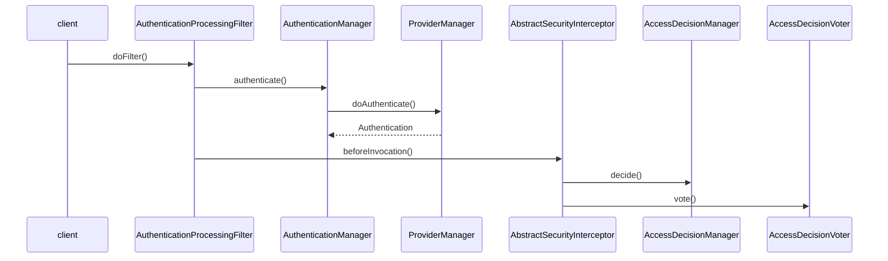

# 安全框架ACEGI的设计与实现

## Spring ACEGI安全框架概述

### 概述

- 虽然ACEGI不属于Spring平台的范畴，但是他是建立在Spring的基础上的，并且可以方便的为Spring应用提供安全服务。
- 作为一个完整的Java EE安全应用解决方案，ACEGI能够为基于Spring构建的应用项目提供全面的安全服务，处理应用需要的各种典型的安全需求。

### 设计原理与基本实现过程

- `ACEGI安全应用模块`与其他的Spring的上层应用模块一样，都建立在IoC容器和AOP的基础上，也可以把ACEGI看成是一个**特殊**的Spring应用。
- 对于**不同的用户登录请求**，ACEGI提供了不同的拦截器`AuthenticationProcessingFilter`供用户使用。
- 对于**不同的用户验证数据来源**，ACEGI也提供了不同的**验证数据提供器**，通过随开随用地使用验证数据提供器，并对这些数据提供器进行配置，可以从不同的用户验证数据源得到用户验证信息。
- 在得到**用户验证数据**、**拦截用户的验证请求**并进**行用户基本信息的验证**之后，完成对一个用户的**验证**过程。
- 完成验**证过**程后，会对用户进行**授权**，权限都是预先规划和设计好的，可以通过各种用户信息的方式体现出来，通过`AccessDecisionManager`的`decide`方法完成授权。
- 匹配到对应的权限规则后，会调用`AccessDecisionVoter`的`vote`方法进行最后的授权表决。

#### 时序图



### ACEGI的Bean配置

- ACEGI通过各种`Filter`过滤器与ACEGI的应用环境进行集成，并通过这些过滤器来提供安全方面的**功能增强**。
- 在验证过程中，起到核心作用的`AuthenticationManager`及`AuthenticationProvider`的配置是完成验证工作的主要实现，同时它们也是为验证提供用户数据的模块。

## 配置Spring ACEGI

### Web页面的登录过滤器

- 拦截指定请求。
- 配置错误页面。
- 配置rememberMeServices。

```xml
<bean id="authenticationProcessingFilter" class="org.ACEGIsecurity.ui.webapp.
                                                 AuthenticationProcessingFilter">
  <property name="authenticationManager" ref="authenticationManager"/>
  <property name="authenticationFailureUrl" value="/ACEGIlogin.
                                                   jsp?login_error=1"/>
  <property name="defaultTargetUrl" value="/secure/index.jsp"/>
  <property name="filterProcessesUrl" value="/j_ACEGI_security_check"/>
  <property name="rememberMeServices" ref="rememberMeServices"/>
</bean>
```

### 资源请求的安全性配置

- 配置拦截器。
- 配置authenticationManager。
- 配置decisionVoters。

```xml
<bean id="filterInvocationInterceptor" class="org.ACEGIsecurity.intercept.
                                              web.FilterSecurityInterceptor">
  <property name="authenticationManager" ref="authenticationManager"/>
  <property name="accessDecisionManager">
    <bean class="org.ACEGIsecurity.vote.AffirmativeBased">
      <property name="allowIfAllAbstainDecisions" value="false"/>
      <property name="decisionVoters">
        <list>
          <bean class="org.ACEGIsecurity.vote.RoleVoter"/>
          <bean class="org.ACEGIsecurity.vote.AuthenticatedVoter"/>
        </list>
      </property>
    </bean>
  </property>
  <property name="objectDefinitionSource">
    <value>CONVERT_URL_TO_LOWERCASE_BEFORE_COMPARISON_PATTERN_TYPE_APACHE_ANT
      /manage.manage/**=ROLE_SUPERVISOR
      /secure/**=IS_AUTHENTICATED_REMEMBERED
      /home.home/**=IS_AUTHENTICATED_REMEMBERED
      /**=IS_AUTHENTICATED_ANONYMOUSLY
    </value>
  </property>
</bean>
```

### authenticationManager的配置

- 配置decisionVoters的具体provider。

```xml
<bean id="authenticationManager" class="org.ACEGIsecurity.providers.ProviderManager">
  <property name="decisionVoters">
    <list>
      <ref local="daoAuthenticationProvider"/>
      <bean class="org.ACEGIsecurity.providers.anonymous.AnonymousAuthenticationProvider">
        <property name="key" value="changeThis"/>
      </bean>
      <bean class="org.ACEGIsecurity.providers.rememberme.RememberMeAuthenticationProvider">
        <property name="key" value="changeThis"/>
      </bean>
    </list>
  </property>
</bean>
```

#### authenticationProvider的配置

- 配置密码解码器。
- 配置用户认证提供者`DaoAuthenticationProvider`。

```xml
<bean id="daoAuthenticationProvider" class="org.ACEGIsecurity.providers.dao.DaoAuthenticationProvider">
  <property name="userDetailsService" ref="jdbcDaoImpl"/>
  <property name="passwordEncoder">
    <bean id="md5Encoder" class="org.ACEGIsecurity.providers.encoding.Md5PasswordEncoder"/>
  </property>
</bean>
<bean id="jdbcDaoImpl" class="org.ACEGIsecurity.userdetails.jdbc.JdbcDaoImpl">
  <property name="dataSource" ref="dataSource"/>
</bean>
```

#### 配置数据库数据源

- 配置基于数据库的用户信息认证数据源。

```xml
<bean id="dataSource" class="org.springframework.jdbc.datasource.DriverManagerDataSource">
  <property name="driverClassName" value="org.hsqldb.jdbcDriver"/>
  <property name="url" value="jdbc:hsqldb:hsql://localhost/xdb"/>
  <property name="username" value="sa"/>
  <property name="password" value=""/>
</bean>
```

## ACEGI的Web过滤器实现

- authenticationProcessingFilter，对特定的Web请求进行拦截，并在拦截过程中完成对使用Web页面进行登录所需要的身份验证以及授权的处理。
- 在一个Web应用程序中，可以注册多个过滤器，每个过滤器可以对一个或一组Servlet程序进行拦截ACEGI验证器的实现。
- 如果对这些不同的过滤器都设置了同一个Servlet作为拦截的目标对象，那么Web容器会把这些过滤器组合起来，形成一个包含一连串过滤器的**过滤器链**，顺序和在web.xml中配置的顺序是一致的。

### AbstractProcessingFilter

`AbstractProcessingFilter#doFilter`

```java
public void doFilter(ServletRequest request, ServletResponse response, FilterChain chain)
  throws IOException, ServletException {
  // 检验是不是符合ServletRequest/SevletResponse的要求
  if (!(request instanceof HttpServletRequest)) {
    throw new ServletException("Can only process HttpServletRequest");
  }

  if (!(response instanceof HttpServletResponse)) {
    throw new ServletException("Can only process HttpServletResponse");
  }

  HttpServletRequest httpRequest = (HttpServletRequest) request;
  HttpServletResponse httpResponse = (HttpServletResponse) response;

  if (requiresAuthentication(httpRequest, httpResponse)) {
    if (logger.isDebugEnabled()) {
      logger.debug("Request is to process authentication");
    }
    // 定义ACEGI中的Authentication对象，从而通过这个对象来持有用户验证信息
    Authentication authResult;
    try {
      onPreAuthentication(httpRequest, httpResponse);
      // 抽象方法attemptAuthentication，具体验证过程委托给子类完成
      authResult = attemptAuthentication(httpRequest);
    } catch (AuthenticationException failed) {
      // Authentication failed
      unsuccessfulAuthentication(httpRequest, httpResponse, failed);
      return;
    }
    // Authentication success
    if (continueChainBeforeSuccessfulAuthentication) {
      chain.doFilter(request, response);
    }
    // 验证工作完成后的后续工作，跳转到相应的页面，跳转的页面路径已经做好了配置
    successfulAuthentication(httpRequest, httpResponse, authResult);
    return;
  }
  chain.doFilter(request, response);
}

```

### AuthenticationProcessingFilter

`AuthenticationProcessingFilter#attemptAuthentication`

- 首先会从HTTP请求中取得用户名和密码，得到HTTP请求中的用户验证信。
- 生成一个Token对象来封装用户验证信息。
- 把Token对象交给配置的`authenticationManager`验证器来完成具体验证工作。

```java
public Authentication attemptAuthentication(HttpServletRequest request)
  throws AuthenticationException {
  // 从Http请求中获取用户名和密码
  String username = obtainUsername(request);
  String password = obtainPassword(request);
  if (username == null) {
    username = "";
  }
  if (password == null) {
    password = "";
  }
  // 创建token对象
  UsernamePasswordAuthenticationToken authRequest = new UsernamePasswordAuthenticationToken(username, password);

  request.getSession().setAttribute(ACEGI_SECURITY_LAST_USERNAME_KEY, username);

  setDetails(request, authRequest);
  // 完成验证
  return this.getAuthenticationManager().authenticate(authRequest);
}
```

## ACEGI验证器的实现

### 整体验证流程

- `AuthenticationProcessingFilter`拦截HTTP请求。
- 从HTTP请求中得到用户输入的用户名和密码。
- 将这些输入的用户信息放到`Authentication`对象中。
- 将这个Authentication对象传递给`AuthenticationManager`使用，让验证器完成用户验证功能的具体实现。
- 在验证完成以后，ACEGI会把通过验证的、有效的用户信息封装在一个Authentication对象中，供以后的授权器使用。

### AuthenticationManager

- 在ACEGI框架中，**完成验证**工作的主要类是`AuthenticationManager`，称之为验证器。

### AbstractAuthenticationManager

`AbstractAuthenticationManager#authenticate`

```java
public final Authentication authenticate(Authentication authRequest)
  throws AuthenticationException {
  try {
    // doAuthentication是一个抽象方法，由具体的AuthenticationManager实现
    Authentication authResult = doAuthentication(authRequest);
    copyDetails(authRequest, authResult);

    return authResult;
  } catch (AuthenticationException e) {
    e.setAuthentication(authRequest);
    throw e;
  }
}

// 复制用户验证信息到Token对象中
private void copyDetails(Authentication source, Authentication dest) {
  if ((dest instanceof AbstractAuthenticationToken) && (dest.getDetails() == null)) {
    AbstractAuthenticationToken token = (AbstractAuthenticationToken) dest;

    token.setDetails(source.getDetails());
  }
}

protected abstract Authentication doAuthentication(Authentication authentication)
  throws AuthenticationException;
```

### ProviderManager

- 在进行验证的时侯，考虑到可能会有多个Provider提供存储在服务器端的用户数据，因此在这里的验证实现中，验证器会逐一遍历配置好的这个List，也就是遍历这个List中的多个数据提供器来完成用户验证，然后返回验证结果。
- 最后，退出对数据提供器链的逐一遍历工作。

`ProviderManager#doAuthentication`

```java
public Authentication doAuthentication(Authentication authentication)
  throws AuthenticationException {
  Iterator iter = providers.iterator();
  Class toTest = authentication.getClass();
  AuthenticationException lastException = null;
  while (iter.hasNext()) {
    AuthenticationProvider provider = (AuthenticationProvider) iter.next();
    if (provider.supports(toTest)) {
      logger.debug("Authentication attempt using " + provider.getClass().getName());
      // 这个result对象用来包含验证得到的结果信息
      Authentication result = null;
      try {
        // 使用Provider来完成用户的验证
        result = provider.authenticate(authentication);
        sessionController.checkAuthenticationAllowed(result);
      } catch (AuthenticationException ae) {
        lastException = ae;
        result = null;
      }
      if (result != null) {
        sessionController.registerSuccessfulAuthentication(result);
        applicationEventPublisher.publishEvent(new AuthenticationSuccessEvent(result));
        return result;
      }
    }
  }
  if (lastException == null) {
    lastException = new ProviderNotFoundException(messages.getMessage("ProviderManager.providerNotFound",
                                                                      new Object[] {toTest.getName()}, "No AuthenticationProvider found for {0}"));
  }
  // Publish the event
  String className = exceptionMappings.getProperty(lastException.getClass().getName());
  AbstractAuthenticationEvent event = null;
  if (className != null) {
    try {
      Class clazz = getClass().getClassLoader().loadClass(className);
      Constructor constructor = clazz.getConstructor(new Class[] {
        Authentication.class, AuthenticationException.class
          });
      Object obj = constructor.newInstance(new Object[] {authentication, lastException});
      Assert.isInstanceOf(AbstractAuthenticationEvent.class, obj, "Must be an AbstractAuthenticationEvent");
      event = (AbstractAuthenticationEvent) obj;
    } catch (ClassNotFoundException ignored) {}
    catch (NoSuchMethodException ignored) {}
    catch (IllegalAccessException ignored) {}
    catch (InstantiationException ignored) {}
    catch (InvocationTargetException ignored) {}
  }
  if (event != null) {
    applicationEventPublisher.publishEvent(event);
  } else {
    if (logger.isDebugEnabled()) {
      logger.debug("No event was found for the exception " + lastException.getClass().getName());
    }
  }
  // Throw the exception
  throw lastException;
}
```

### DaoAuthenticationProvider的实现

- `DaoAuthenticationProvider`的基类是`AbstractUserDetailsAuthenticationProvider`。
- `AbstractUserDetailsAuthenticationProvider`实现了接口`AuthenticationProvider`、`MessageSourceAware`以及`InitializingBean`。
- `DaoAutheniticationProvider`可以从数据库中**获取用户验证信息**之外，还提供其他子类可以从其他的途径获得用户验证信息。

### AbstractUserDetailsAuthenticationProvider

`AbstractUserDetailsAuthenticationProvider#authenticate`

```java
public Authentication authenticate(Authentication authentication)
  throws AuthenticationException {
  Assert.isInstanceOf(UsernamePasswordAuthenticationToken.class, authentication,
                      messages.getMessage("AbstractUserDetailsAuthenticationProvider.onlySupports",
                                          "Only UsernamePasswordAuthenticationToken is supported"));

  // 获取用户名
  String username = (authentication.getPrincipal() == null) ? "NONE_PROVIDED" : authentication.getName();

  boolean cacheWasUsed = true;
  // 从缓存中检索用户信息
  UserDetails user = this.userCache.getUserFromCache(username);

  if (user == null) {
    cacheWasUsed = false;

    try {
      // 调用UserDetailService到用户数据库中获取用户信息
      user = retrieveUser(username, (UsernamePasswordAuthenticationToken) authentication);
    } catch (UsernameNotFoundException notFound) {
      if (hideUserNotFoundExceptions) {
        throw new BadCredentialsException(messages.getMessage(
          "AbstractUserDetailsAuthenticationProvider.badCredentials", "Bad credentials"));
      } else {
        throw notFound;
      }
    }
		// 得到了用户信息以后，判断当前用户的状态，比如账户是否被锁定、用户是否有效、账户是否过期等
    Assert.notNull(user, "retrieveUser returned null - a violation of the interface contract");
  }

  if (!user.isAccountNonLocked()) {
    throw new LockedException(messages.getMessage("AbstractUserDetailsAuthenticationProvider.locked",
                                                  "User account is locked"));
  }

  if (!user.isEnabled()) {
    throw new DisabledException(messages.getMessage("AbstractUserDetailsAuthenticationProvider.disabled",
                                                    "User is disabled"));
  }

  if (!user.isAccountNonExpired()) {
    throw new AccountExpiredException(messages.getMessage("AbstractUserDetailsAuthenticationProvider.expired",
                                                          "User account has expired"));
  }

  // This check must come here, as we don't want to tell users
  // about account status unless they presented the correct credentials
  try {
    // 验证过程，在retrieveUser中保存着从数据库中得到的用户信息，在additionalAuthenticationChecks方法实现中，完成用户输入信息和服务器端的用户信息的对比工作
    additionalAuthenticationChecks(user, (UsernamePasswordAuthenticationToken) authentication);
  } catch (AuthenticationException exception) {
    // There was a problem, so try again after checking we're using latest data
    cacheWasUsed = false;
    user = retrieveUser(username, (UsernamePasswordAuthenticationToken) authentication);
    additionalAuthenticationChecks(user, (UsernamePasswordAuthenticationToken) authentication);
  }

  if (!user.isCredentialsNonExpired()) {
    throw new CredentialsExpiredException(messages.getMessage(
      "AbstractUserDetailsAuthenticationProvider.credentialsExpired", "User credentials have expired"));
  }

  if (!cacheWasUsed) {
    this.userCache.putUserInCache(user);
  }

  Object principalToReturn = user;

  if (forcePrincipalAsString) {
    principalToReturn = user.getUsername();
  }

  return createSuccessAuthentication(principalToReturn, authentication, user);
}
```

### 读取数据库用户信息

- 在ACEGI实现中，获取服务器端用户信息的工作是由具体的数据提供器`Provider`来完成的。

#### DaoAuthenticationProvider

`DaoAuthenticationProvider#retrieveUser`

```java
protected final UserDetails retrieveUser(String username, UsernamePasswordAuthenticationToken authentication)
  throws AuthenticationException {
  UserDetails loadedUser;

  try {
    loadedUser = this.getUserDetailsService().loadUserByUsername(username);
  } catch (DataAccessException repositoryProblem) {
    throw new AuthenticationServiceException(repositoryProblem.getMessage(), repositoryProblem);
  }

  if (loadedUser == null) {
    throw new AuthenticationServiceException(
      "AuthenticationDao returned null, which is an interface contract violation");
  }

  return loadedUser;
}
```

#### org.acegisecurity.userdetails.jdbc.JdbcDaoImpl

- 在使用ACEGI的JdbcDaoImpl时，**对数据库的查询是固定的**。
- 对**用户数据库表的设计要遵从ACEGI的用户表的设计规范**，ACEGI安全框架才能起作用。

`org.acegisecurity.userdetails.jdbc.JdbcDaoImpl#loadUserByUsername`

- 从users表中根据用户名取得用户信息，这些用户信息包括用户名、密码、用户有效标志。
- `UsersByUsernameMapping` 根据查询结果生成UserDetails对象，在这个`UserDetails`对象中存储了用户的基本信息，如用户名和密码等。
- `AuthoritiesByUsernameMapping` 会根据查询结果生成`GrantedAuthorityImpl`对象，在这个对象中存储的是用户的权限信息。

```java
public UserDetails loadUserByUsername(String username)
  throws UsernameNotFoundException, DataAccessException {
  List users = usersByUsernameMapping.execute(username);
  if (users.size() == 0) {
    throw new UsernameNotFoundException("User not found");
  }
  // 用户名重复的情况下取第一个结果
  UserDetails user = (UserDetails) users.get(0); // contains no GrantedAuthority[]
	// 来完成用户权限信息的查询
  List dbAuths = authoritiesByUsernameMapping.execute(user.getUsername());
  addCustomAuthorities(user.getUsername(), dbAuths);
  if (dbAuths.size() == 0) {
    throw new UsernameNotFoundException("User has no GrantedAuthority");
  }
  GrantedAuthority[] arrayAuths = (GrantedAuthority[]) dbAuths.toArray(new GrantedAuthority[dbAuths.size()]);
  String returnUsername = user.getUsername();
  if (!usernameBasedPrimaryKey) {
    returnUsername = username;
  }
  // 根据查询的用户信息和权限信息，构造User对象返回
  return new User(returnUsername, user.getPassword(), user.isEnabled(), true, true, true, arrayAuths);
}
```

### 完成用户信息的对比验证

- 通过对比用户的输入信息和服务器端的用户信息来确定用户的身份和权限，完成验证工作。

#### DaoAuthenticationProvider

`DaoAuthenticationProvider#additionalAuthenticationChecks`

- 对比之前，使用配置的passwordEncoder对象来对用户输入的密码进行MD5加密。
- 在得到加密后的输入密码以后，才能将这个加密密码与在服务器数据库中设置的密码进行比较。
- 根据比较结果，两者相同表示通过验证。否则将会抛出异常，表明验证失败。

```java
protected void additionalAuthenticationChecks(UserDetails userDetails,
                                              UsernamePasswordAuthenticationToken authentication)
  throws AuthenticationException {
  Object salt = null;

  if (this.saltSource != null) {
    salt = this.saltSource.getSalt(userDetails);
  }

  if (!passwordEncoder.isPasswordValid(userDetails.getPassword(), authentication.getCredentials().toString(), salt)) {
    throw new BadCredentialsException(messages.getMessage(
      "AbstractUserDetailsAuthenticationProvider.badCredentials", "Bad credentials"), userDetails);
  }
}
```

## ACEGI授权器的实现

- 验证用户信息成功之后，会进行用户授权工作。

### 与Web环境的接口FilterSecurityInterceptor

#### FilterSecurityInterceptor

- 通过doFilter方法来对HTTP请求进行拦截和处理的。
- 首先，需要对HTTP请求进行检查，判断在当前的调用场合是否有安全检查的必要，因为，拦截器有可能已经对HTTP请求进行过安全检查了，如果是这样，这里就不需要再重复这个过程。
- 拦截器会根据判断结果调用基类`AbstractSecurityInterceptor`的`beforeInvocation`方法去完成具体的检查工作。

```java
public class FilterSecurityInterceptor extends AbstractSecurityInterceptor implements Filter {

  private static final String FILTER_APPLIED = "__acegi_filterSecurityInterceptor_filterApplied";

  private FilterInvocationDefinitionSource objectDefinitionSource;
  private boolean observeOncePerRequest = true;

  public void destroy() {}

  public void doFilter(ServletRequest request, ServletResponse response, FilterChain chain)
    throws IOException, ServletException {
    FilterInvocation fi = new FilterInvocation(request, response, chain);
    invoke(fi);
  }

  public FilterInvocationDefinitionSource getObjectDefinitionSource() {
    return this.objectDefinitionSource;
  }

  public Class getSecureObjectClass() {
    return FilterInvocation.class;
  }

  public void init(FilterConfig arg0) throws ServletException {}

  public void invoke(FilterInvocation fi) throws IOException, ServletException {
    if ((fi.getRequest() != null) && (fi.getRequest().getAttribute(FILTER_APPLIED) != null)
        && observeOncePerRequest) {
      // filter already applied to this request and user wants us to observce
      // once-per-request handling, so don't re-do security checking
      fi.getChain().doFilter(fi.getRequest(), fi.getResponse());
    } else {
      // first time this request being called, so perform security checking
      if (fi.getRequest() != null) {
        fi.getRequest().setAttribute(FILTER_APPLIED, Boolean.TRUE);
      }

      InterceptorStatusToken token = super.beforeInvocation(fi);

      try {
        fi.getChain().doFilter(fi.getRequest(), fi.getResponse());
      } finally {
        super.afterInvocation(token, null);
      }
    }
  }

  public boolean isObserveOncePerRequest() {
    return observeOncePerRequest;
  }

  public ObjectDefinitionSource obtainObjectDefinitionSource() {
    return this.objectDefinitionSource;
  }

  public void setObjectDefinitionSource(FilterInvocationDefinitionSource newSource) {
    this.objectDefinitionSource = newSource;
  }

  public void setObserveOncePerRequest(boolean observeOncePerRequest) {
    this.observeOncePerRequest = observeOncePerRequest;
  }
}
```

#### AbstractSecurityInterceptor

- `FilterSecurityInterceptor`的基类`AbstractSecurityInterceptor`。

`AbstractSecurityInterceptor#beforeInvocation`

- 首先，需要读取IoC容器中Bean的配置，在这些属性配置中配置了对HTTP请求资源的安全需求。
- 到`SecurityContextHolder`对象中取得`Authentication`对象，这个SecurityContextHolder相当于一个全局的缓存，是在通过验证后被设置进去的。

```java
protected InterceptorStatusToken beforeInvocation(Object object) {
  Assert.notNull(object, "Object was null");

  if (!getSecureObjectClass().isAssignableFrom(object.getClass())) {
    throw new IllegalArgumentException("Security invocation attempted for object "
                                       + object.getClass().getName()
                                       + " but AbstractSecurityInterceptor only configured to support secure objects of type: "
                                       + getSecureObjectClass());
  }
	// 这里读取FilterSecurityInterceptor配置的ObjectDefinitionSource属性，这些属性配置了资源的安全设置
  ConfigAttributeDefinition attr = this.obtainObjectDefinitionSource().getAttributes(object);

  if ((attr == null) && rejectPublicInvocations) {
    throw new IllegalArgumentException(
      "No public invocations are allowed via this AbstractSecurityInterceptor. This indicates a configuration error because the AbstractSecurityInterceptor.rejectPublicInvocations property is set to 'true'");
  }

  if (attr != null) {
    if (logger.isDebugEnabled()) {
      logger.debug("Secure object: " + object.toString() + "; ConfigAttributes: " + attr.toString());
    }
    
    if (SecurityContextHolder.getContext().getAuthentication() == null) {
      credentialsNotFound(messages.getMessage("AbstractSecurityInterceptor.authenticationNotFound",
                                              "An Authentication object was not found in the SecurityContext"), object, attr);
    }

    Authentication authenticated;
		// 如果前面没有处理验证，这里要先要进行用户验证
    if (!SecurityContextHolder.getContext().getAuthentication().isAuthenticated() || alwaysReauthenticate) {
      try {
        // 调用配置好的AuthenticationManager处理用户验证，如果用户验证不成功，抛出异常结束处理
        authenticated = this.authenticationManager.authenticate(SecurityContextHolder.getContext()
                                                                .getAuthentication());
      } catch (AuthenticationException authenticationException) {
        throw authenticationException;
      }

      // We don't authenticated.setAuthentication(true), because each provider should do that
      if (logger.isDebugEnabled()) {
        logger.debug("Successfully Authenticated: " + authenticated.toString());
      }
			// 把用户验证成功后得到的Authentication保存到SecurityContextHolder中，供下次使用
      SecurityContextHolder.getContext().setAuthentication(authenticated);
    } else {
      authenticated = SecurityContextHolder.getContext().getAuthentication();

      if (logger.isDebugEnabled()) {
        logger.debug("Previously Authenticated: " + authenticated.toString());
      }
    }

    // Attempt authorization
    try {
      // 调用配置好的AccessDecisionManager来完成授权工作，decide方法，它为用户设置权限
      this.accessDecisionManager.decide(authenticated, object, attr);
    } catch (AccessDeniedException accessDeniedException) {
      AuthorizationFailureEvent event = new AuthorizationFailureEvent(object, attr, authenticated,                                                                 accessDeniedException);
      this.eventPublisher.publishEvent(event);
      throw accessDeniedException;
    }
    if (logger.isDebugEnabled()) {
      logger.debug("Authorization successful");
    }
    AuthorizedEvent event = new AuthorizedEvent(object, attr, authenticated);
    this.eventPublisher.publishEvent(event);
    Authentication runAs = this.runAsManager.buildRunAs(authenticated, object, attr);
    if (runAs == null) {
      if (logger.isDebugEnabled()) {
        logger.debug("RunAsManager did not change Authentication object");
      }
      return new InterceptorStatusToken(authenticated, false, attr, object);
    } else {
      if (logger.isDebugEnabled()) {
        logger.debug("Switching to RunAs Authentication: " + runAs.toString());
      }
      SecurityContextHolder.getContext().setAuthentication(runAs);
      return new InterceptorStatusToken(authenticated, true, attr, object);
    }
  } else {
    if (logger.isDebugEnabled()) {
      logger.debug("Public object - authentication not attempted");
    }
    this.eventPublisher.publishEvent(new PublicInvocationEvent(object));
    return null;
  }
}
```

### 授权器的实现

- 为用户授权是由`AccessDecisionManager`授权器来完成的，授权的过程在授权器的`decide`方法中实现。
- `AccessDecisionManager`的基类`AbstractAccessDecisionManager`。
- 不同的授权器的实现遵循了不同的规则，如少数服从多数、一票否决等。

### 投票器的实现

- 有了授权器，相当于建立了一个**决策机制**或**决策委员会**。
- 投票器会根据判断投出授权结果。
- 授权器会根据授权规则对投票器提交的投票结果进行汇总判断，得到最后的决策结果。

#### RoleVoter

`RoleVoter#vote`

- 在投票前，首先设置了一个变量来记录投票结果，这个投票结果的初始值被设置为`ACCESS_ABSTAIN`弃权。
- 投票器会读入对**URL资源配置的安全需求**，根据这些安全需求逐条进行判断。
- 如果**资源配置的授权角色与当前请求用户的角色配置相匹配**，安全需求得到满足，那么将会投票表示同意。

```java
public int vote(Authentication authentication, Object object, ConfigAttributeDefinition config) {
  int result = ACCESS_ABSTAIN;
  // 获取资源的安全配置
  Iterator iter = config.getConfigAttributes();

  while (iter.hasNext()) {
    ConfigAttribute attribute = (ConfigAttribute) iter.next();

    if (this.supports(attribute)) {
      result = ACCESS_DENIED;

      // Attempt to find a matching granted authority
      for (int i = 0; i < authentication.getAuthorities().length; i++) {
        if (attribute.getAttribute().equals(authentication.getAuthorities()[i].getAuthority())) {
          return ACCESS_GRANTED;
        }
      }
    }
  }

  return result;
}
```

## 小结

- 应用的安全需求管理主要是通过过滤器、验证器、用户数据提供器、授权器、投票器这几个基本模块协作完成的。
- 从架构的关系上来看，ACEGI安全框架可以看成是一个基于Spring的应用，因此实现安全需求管理的ACEGI的基本模块，都需要在IoC容器中得以正确配置，才能有效地发挥其作用。