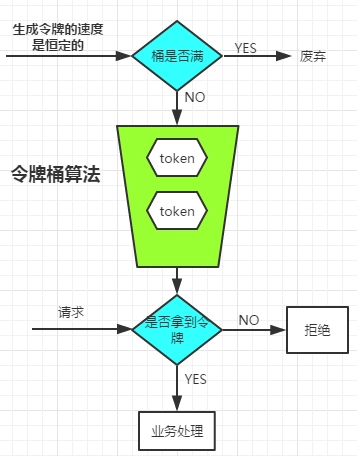

# 基于Guava的令牌桶限流方案

## 令牌桶算法简介

### 生成令牌

- 正常情况下，以恒定的速度向令牌桶中生成令牌。
- 如果达到了桶的上线，则废弃本次生成的令牌。

### 获取令牌

- 客户端每次进行请求之前，都要先尝试从令牌桶里面获取一个令牌，才能处理业务。
- 因为令牌桶的大小固定，生成令牌的频率固定。从而也就保证了数据接口的访问流量。




## Guava

- 谷歌的一个工具库，提供了大量的Java工具类，像hash算法、字符串处理、集合处理等。

```xml
<dependency>
	<groupId>com.google.guava</groupId>
	<artifactId>guava</artifactId>
	<version>29.0-jre</version>
</dependency>
```

## 速率限制器 RateLimiter

- 创建一个**限速器**，指定令牌的生产频率。
- 核心的方法就是2种，**阻塞获取令牌**，**非阻塞获取令牌**。

```java
/**
 * 创建一个限速器，每1秒，产生2.5个令牌 
 */
RateLimiter rateLimiter = RateLimiter.create(2.5, 1, TimeUnit.SECONDS);

/**
 * 尝试获取1个令牌，如果没有，会阻塞当前线程。直到获取成功返回。
 * 返回值是，阻塞的秒数
 */
double waitSeconds = rateLimiter.acquire();

/**
 * 尝试获取1个令牌，不会阻塞当前线程。
 * 立即返回是否获取成功。
 */
boolean success = rateLimiter.tryAcquire();
```

## 限制器的重载方法

- 不论是**阻塞获取令牌**还是**非阻塞获取令牌**，它们都有几个重载方法。
- 可以设置**获取令牌的数量**，以及阻塞的时间。

```java
public double acquire(int permits)

public boolean tryAcquire(Duration timeout)
public boolean tryAcquire(int permits)
public boolean tryAcquire(long timeout, TimeUnit unit)
public boolean tryAcquire(int permits, long timeout, TimeUnit unit) 
public boolean tryAcquire(int permits, Duration timeout)
```

## 限流拦截器

- 负责拦截请求获取令牌。
- 成功获取到令牌的继续执行请求。
- 未能获取到令牌的，向客户端响应繁忙。

```java
import java.nio.charset.StandardCharsets;

import javax.servlet.http.HttpServletRequest;
import javax.servlet.http.HttpServletResponse;

import org.springframework.http.MediaType;
import org.springframework.web.servlet.handler.HandlerInterceptorAdapter;

import com.google.common.util.concurrent.RateLimiter;

public class RateLimiterInterceptor extends HandlerInterceptorAdapter {

	private final RateLimiter rateLimiter;

	/**
	 * 通过构造函数初始化限速器
	 */
	public RateLimiterInterceptor(RateLimiter rateLimiter) {
		super();
		this.rateLimiter = rateLimiter;
	}

	@Override
	public boolean preHandle(HttpServletRequest request, HttpServletResponse response, Object handler) throws Exception {
		
		if(this.rateLimiter.tryAcquire()) {
			/**
			 * 成功获取到令牌
			 */
			return true;
		}

		/**
		 * 获取失败，直接响应“错误信息”
		 * 也可以通过抛出异常，通过全全局异常处理器响应客户端
		 */
		response.setCharacterEncoding(StandardCharsets.UTF_8.name());
		response.setContentType(MediaType.TEXT_PLAIN_VALUE);
		response.getWriter().write("服务器繁忙");
		return false;
	}
}
```

## 配置拦截器

```java
import java.util.concurrent.TimeUnit;

import org.springframework.context.annotation.Configuration;
import org.springframework.web.servlet.config.annotation.InterceptorRegistry;
import org.springframework.web.servlet.config.annotation.WebMvcConfigurer;

import com.google.common.util.concurrent.RateLimiter;

import io.springboot.jwt.web.interceptor.RateLimiterInterceptor;


@Configuration
public class WebMvcConfiguration implements WebMvcConfigurer {
	
	@Override
	public void addInterceptors(InterceptorRegistry registry) {
		/**
		 * test接口，1秒钟生成1个令牌，也就是1秒中允许一个人访问
		 */
		registry.addInterceptor(new RateLimiterInterceptor(RateLimiter.create(1, 1, TimeUnit.SECONDS)))
			.addPathPatterns("/test");
	}
	
}
```
