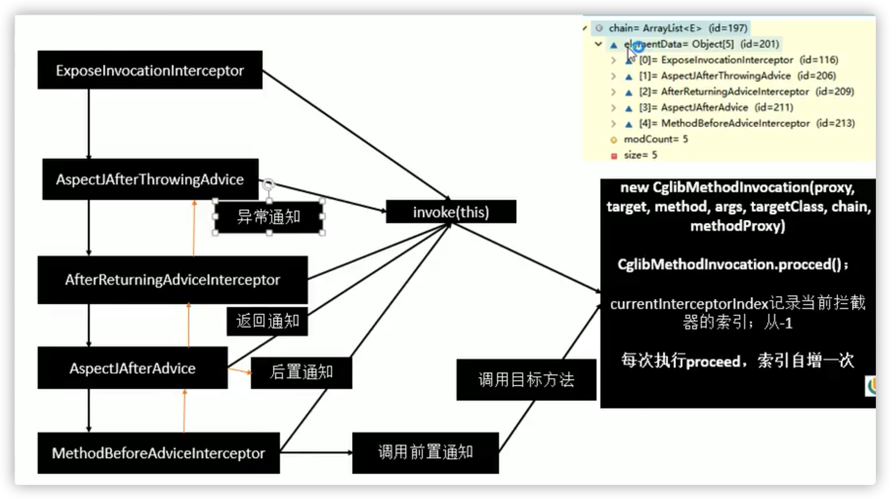
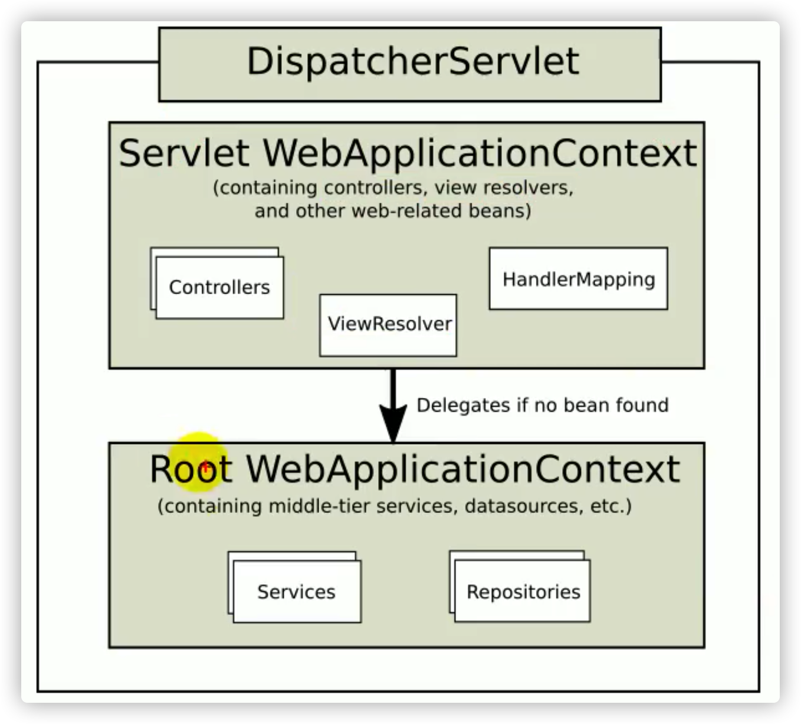

# Spring注解驱动开发

## 容器相关

### AnnotationConfigApplicationContext

- 基于注解配置的应用上下文。                                     
- 对注解配置进行解析和加载，过程等同于 `ClassPathXmlApplicationContext`。

### @Configuration

- 标记的类会被 `Spring` 认定为配置类，容器启动的时候会加载配置类中配置信息。
- 配置类等同于配置文件，对 Bean 的信息进行配置和注册。
- 配置类也会被当做是组件被注入到 IOC 容器中。

## 组件添加

### @Bean

- 配置类中的方法上标记 `@Bean` 注解，该方法会被认定为是向容器中注册 Bean 的方法。
- Bean 的类型是方法返回值的类型。
- 默认注册到 IOC 容器中的 bean 的 name 是**当前方法的名称**。
- 可以用过 `@Bean` 的 `name` 或者 `value` 属性，指定注入到容器中 Bean 的名称。
- `@Bean` 标注的方法创建对象的时候，**方法参数的值从 Ioc 容器中获取**。

### @CompomentScan

- 指定组件的扫描规则，等同于 xml 配置文件中的 `<context:component-scan>` 标签。
- @CompomentScan 注解可以标记在容器**启动类**或者**配置类**上。
- `basePackages` 设定扫描的包。
- `includeFilters` 设定引用过滤器规则。
- `excludeFilters` 设定排除过滤器规则。
- `useDefaultFilters` 设置是否启用默认的过滤器，默认是 **true**。
- 使用 `includeFilters` 情况下需要指定 `useDefaultFilters` 属性为 **false**，禁用默认的过滤器规则。

### @CompomentScans

- 可以用来指定多个 `@CompomentScan`。
- 解决 JDK7 及以下注解不可重复使用的场景下的问题。

### @Filter

- `@Filter` 指定不同类型的过滤器。
- `@Filter` 支持有多种的过滤类型。
  - `FilterType.ANNOTATION` 按照注解过滤。
  - `FilterType.ASSIGNABLE_TYPE` 按照给定的类型过滤。
  - `FilterType.ASPECTJ` 按照 ASPECTJ 表达式过滤。
  - `FilterType.REGEX` 按照正则表达式过滤。
  - `FilterType.CUSTOM` 按照自定义规则进行过滤。

#### TypeFilter

- 用于在配置组件包扫描规则的时候，指定特定的扫描规则的接口。
- 可以通过自定义 `TypeFilter` 指定过滤规则。
- 通过实现 `TypeFilter` 接口和实现 `match` 方法来自定义规则。
  - `MetadataReader` 读取到的当前正在扫描的类的信息。
  - `MetadataReaderFactory` 可以获取到其他任何类信息。

### @Scope

- 通过 @Scope 注解用来设置组件的**作用域**。
- `@Scope` 的效果等同于在 xml 配置文件中的 `<Bean>` 标签中配置的 `scope` 属性。
- 默认情况下组件是单例的，在IOC启动的时候就会创建对象。
- 如果是多例的，会在每次获取对象的时候创建对象。
- `singleton` 单例。
- `prototype` 多例。
- `request` 同一个请求下是一个对象实例。
- `session` 同一个 session下是一个对象实例。

### @Lazy

- 单实例 bean 默认在容器启动的时候创建对象。
- `@Lazy` 是控制单实例Bean的创建时间的，延迟到使用的时候在进行对象创建。

### @Conditional

- 按照一定的条件进行判断，满足条件给容器中注册  bean。
- `Condition` 接口用来实现具体的匹配规则。
- 标记在方法是对当前方法要注入的 bean 进行判断。
- 标记在类上是对当前类的全部方法要注入的 bean 进行判断。

### @Import

- `@Import` 给容器中快速导入一个组件，可以直接指定组件的类名、`ImportSelector`或者 `ImportBeanDefinitionRegistrar`。
- 导入后的 Bean 的 id 是 Bean 的全类名。
- `ImportSelector`接口用于定义要导入类的全类名信息，重写 `selectImports` 方法。
  - `AnnotationMetadata` 当前标注 `@Import` 注解的类的所有注解信息。
  - 方法不要返回 null 值。
- `ImportBeanDefinitionRegistrar` 接口用于定义，`registerBeanDefinitions` 方法。
  - `AnnotationMetadata` 当前类的注解信息。
  - `BeanDefinitionRegistry` BeanDefinition的注册类。
  - 把所有需要添加到容器中的 bean 通过调用 `BeanDefinitionRegistry#registerBeanDefinition`方法手动注册到容器中。

### FactoryBean

- 使用 FactoryBean 注入组件，也叫工厂 Bean，泛型参数代表着当前工厂的所属类型。
- `getObject` 方法用于获取对象。
- `getObjectType` 方法用于获取当前工厂创建的对象的类型。
- `isSingleton` 方法用于返回当前对象是否的单例。
- FactoryBean 通过 `Context#getBean` 方法获取的是调用 `getObject` 创建的对象。
- 通过  `Context#getBean` 方法在参数前缀 `&`，可以获取 `FactoryBean` 本身。

## Bean生命周期管理

### 简介

- Bean 的生命周期是指 从 Bean 创建、初始化、使用中、销毁的整个过程。
- IOC 容器管理 Bean 的生命周期。

### 整体流程

1. 对象创建。
2. set方法赋值。
3. `BeanPostProcessor#postProcessBeforeInitialization`方法。
4. 初始化方法前。
5. 初始化方法。
6. 初始化方法后。
7. `BeanPostProcessor#postProcessAfterInitialization`方法。
8. 销毁。

### 阶段

- 对象构造阶段。
  - 单实例，在容器启动的时候创建对象。
  - 多实例，在每次获取的时候创建对象。
- 初始化阶段。
  - 对象创建完成，并完成属性赋值后，调用初始化方法。
- 销毁阶段。
  - 单例对象在容器关闭的时候被销毁，会调用 Bean 的销毁方法。
  - 多实例对象的销毁不被容器管理。

### 基于 xml 配置指定初始化和销毁方法

- 基于 xml 配置的 Bean 标签下通过 `init-method` 属性指定 Bean 的初始化方法。
- 基于 xml 配置的 Bean 标签下通过 `destory-method` 属性指定 Bean 的销毁方法。

### 基于 @Bean 注解指定初始化和销毁方法

- 通过 `@Bean` 注解中的 `initMethod` 属性指定 Bean 的初始化方法。
- 通过 `@Bean` 注解中的 `destoryMethod` 属性指定 Bean 的销毁方法。

### 通过 InitializingBean 接口指定初始化

- `InitializingBean` 是 Spring 提供的一个接口，其实现类可以在属性赋值结束后被调用 `afterPropertiesSet` 方法进行初始化操作。

### 通过 DisposableBean 接口指定初始化

- `DisposableBean` 是 Spring 提供的一个接口，其实现类可以在单例对象销毁时被调用 `destroy` 方法进行销毁操作。

### 通过 @PostConstruct 进行初始化

- `@PostConstruct` 是 JSR250 中定义的规范。
- 注解标注在方法上，会在 Bean 对象创建完成并且属性赋值完成后被调用，进行一些初始化操作。

### 通过 @PreDestroy 进行销毁

- `@PreDestroy` 是 JSR250 中定义的规范。
- 注解标注在方法上，会在 Bean 对象被销毁之前被调用，进行一些销毁操作。

### 通过 BeanPostProcessor 进行处理操作

#### 简介

- `BeanPostProcessor` 被称为**对象后置处理器**。
- `BeanPostProcessor` 是 Spring 定义的接口，用来在 Bean 的**初始化前后**进行处理操作。
- 
- `postProcessBeforeInitialization` 方法用于对象完成创建和赋值后，**在任何初始化方法被调用之前**进行后置处理工作。
  - `bean` 是容器中创建的对象。
  - `beanName` 是对象在容器中的名称。
  - **返回值是后续要用的Bean实例，可以返回当前对象或者是包装后的对象**。
- `postProcessAfterInitialization` 方法用于在**全部的初始化之执行之后**进行后置处理工作。

#### 原理

- 在容器初始化过程中，Spring Ioc 容器的 refresh 方法被调用，完成的对象的初始化、实例化和依赖注入。
- 首先会加载 Bean 的属性及配置并生成对应的 BeanDefinition 对象。
- 根据 BeanDefinition 和 Bean 的类型，决定是否在 IOC 容器启动的过程中进行对象创建。
- 容器对非懒加载的单例对象进行立即对象的创建和赋值，调用的是 `DefaultListableBeanFactory#populateBean`。
- 完成对象创建和赋值后，调用 `postProcessBeforeInitialization` 进行自定义处理。
  - 获取全部的 `BeanPostProcessor` ，遍历全部的 `postProcessBeforeInitialization` 方法。
  - 如果返回 **null**，不会继续调用后续的 `BeanPostProcessor`。
- 调用 init 方法进行初始化方法。
- 调用 `postProcessAfterInitialization` 进行自定义处理。

#### Spring 的底层应用

- Spring 提供了各种 `XXXAware` 接口，继承自 `Aware` 接口，用于感知和处理各种增强事件。
- Spring 提供了各种 `XxxAwareProcessor` 接口，用于对在容器启动阶段通过 `BeanPostProcessor` 的自定义扩展处理方法对 Bean 的功能增强或者功能扩展。
- Spring 框架底层对 **Bean 赋值**、**组件注入**、**@Autowired**、**生命周期注解**、**@Async** 等功能，都是通过特定的 `BeanPostProcessor` 完成的。

##### ApplicationContextAwareProcessor

- Spring 提供的接口，是应用程序上下文感知处理器。
- 实现此接口的类可以通过实现 `setApplicationContext` 方法获得到 Ioc 容器。

##### BeanValidationPostProcessor

- 对数据属性进行校验的后置处理器。

##### InitDestroyAnnotationBeanPostProcessor

- Spring 容器框架内部的后置处理器。
- 用于处理 `@PostConstruct`、`@PreDestroy` 注解标记的方法，分别在对象初始化后和对象销毁前调用对应的方法。

##### AutowiredAnnotationBeanPostProcessor

- Spring 容器框架内部的后置处理器。
- 用于处理在容器启动过程中通过 `@Autowired` 进行依赖注入的对象关系。

## 组件赋值

### @Value

- 通过 `@Value` 标记在 Bean 对象的属性上，可以完成对属性的赋值操作。
- 可以通过 @Value 进行赋值的途径。
  - 基本数值。
  - SpEL表达式，`#{}`。
  - 配置文件中的值、运行环境变量中的值，`${}`。

### @PropertySource

- 通过 `@PropertySource` 加载外部配置文件的 `key-value`，并保存到运行的环境变量中 。
- `value` 属性用于指定配置文件的路径。
  - `classpath:/com/xxx/app.properties`
  - `file:/path/to/file`
- 通过 `${}` 可以获取到配置文件中的属性。
- 通过 `ConfigurableEnvironment#getProperty` 方法可以获取到配置文件中的属性。

### @PropertySources

- 可以一次性指定多个配置文件地址的注解。
- `value` 属性是 `PropertySource` 数组。

## 自动装配

- Spring 利用依赖注入 `DI`，完成对 IOC 容器中各个组件的依赖关系赋值。

### @Autowired

- 自动注入。
- **默认优先按照类型去容器中找对应的组件**。
  - `ApplicationContext#getBean(xxx.class);`
- **如果找到多个相同类型的组件，再将属性的名称作为组件的 id 去容器中查找。**
  - `ApplicationContext#getBean("xxxName");`
- 默认情况下，如果找不到对应的Bean，不能完成依赖注入，会抛出 `NoSuchBeanException` 的异常。
- 属性 `require` 可以指定 `@Autowired` 注入行为是否必须完成，默认为 `true`。

#### 适用场景

- `构造器`
  - 默认情况下，添加在 Ioc 容器中的组件，容器启动会调用无参构造器创建对象，再进行初始化赋值操作。
  - 构造器要用的自定义类型的组件，都是从容器中获取。
  - 如果**只有一个有参构造器的**情况下，不标记 `@Autowired` 注解，也会进行对应参数的依赖注入。
- `参数`
  - 标记在参数上，则当前参数会从 Ioc 容器中获取。
- `方法`
  - Spring 容器创建当前对象，就会调用方法，完成赋值。
  - 方法使用的参数中**自定义类型的值**会从 Ioc 容器中获取。
  - 
- `属性`
  - 比较常见的使用方式。
  - 通常是标记在属性上，完成对象注入。

### @Qualifier

- 使用 `@Qualifier` 指定需要装配的组件的 `id`，不使用属性名称匹配。

### @Primary

- 在进行属性自动装配的时候，**默认使用首选的 Bean。**
- 在 `@Qualifier` 标记的属性下不生效。
- 如果不想注入首选的 Bean，可以使用`@Qualifier` 指定注入 Bean 的 id。

### @Resource

- Spring 支持 `@Resource` 注解实现自动注入。
- `@Resource` 是 **JSR250** 规范中包含的注解。
- 默认是按照组件名称进行装配的。
- 通过 `name` 属性可以指定要注入 bean 的名称。
- 在 Spring5 中支持 `@Primary` 功能。
- 没有能支持 `required=false`。

### @Inject

- Spring 支持 `@Inject` 注解实现自动注入。
- `@Inject` 是 JSR3Inject30 规范中包含的注解。
- 需要导入 `javax.inject` 的 jar 包。
- 注入的方式和 **@Autowired** 一样，但是注解本身没有其他的属性用于扩展。

### Aware 注入 Spring 底层组件 & 原理

- Spring 提供了一些列的 `xxxAware`接口以便于**自定义组件使用 Spring 容器底层的组件**。
- `Aware` 感知接口，是这一些列接口的顶级接口，通过回调的方式，将各种底层资源**注入**到自定义组件中。
- **`XXXAware`接口实现的注入功能都是因为有对应的实现了 `BeanPostProcessor`接口的 `XXXAwareProcessor`，在Bean初始化前后进行对应资源的注入操作。**

#### ApplicationContextAware

- 用于注入 Ioc 容器的 Aware 接口实现。

#### ApplicationEventPublisherAware

- 用于注入**事件派发器**的 Aware 接口实现。

#### BeanClassloaderAware

- 用于注入**类加载器**的 Aware 接口实现。

#### BeanFactoryAware

- 用于注入**BeanFactory**的 Aware 接口实现。

#### BeanNameAware

- 用于注入**Bean名称**的 Aware 接口实现。

#### EmbeddedValueResolverAware

- 用于注入**内置属性解析器**的 Aware 接口实现。
- 方法传入的 `StringValueResolver` 可以用来解析带占位符的配置字符串。

#### EnvironmentAware

- 用于注入**环境变量**的 Aware 接口实现。

#### ImportAware

- 用于注入**导入配置**的 Aware 接口实现。

#### LoadTimeWeaverAware

- 用于注入**LoadTime相关**的 Aware 接口实现。

#### MessageSourceAware

- 用于注入**国际化资源**的 Aware 接口实现。

#### NotificationPublisherAware

- 用于注入**通知发布者**的 Aware 接口实现。

#### ResourceLoaderAware

- 用于注入**资源加载器**的 Aware 接口实现。

### @Profile

- Spring 提供的可以根据当前**环境**，**动态的激活和切换**一系列组件的能力。
- `@Profile` 标记在**组件**或者**配置类**上，指定组件在哪个环境的情况下才能被注册到容器中。
- 没有标注环境标识的 bean 在，任何环境下都是加载的。
- 加了环境标识的 bean，只有这个环境被激活的时侯才能注册到容器中，默认是 `default` 环境。

#### 指定运行环境的方式

- 通过命令行动态参数，在虚拟机参数位置添加 `-Dspring.profiles.active=xxx`。
- 通过设置容器参数，`applicationContext.getEnvironment().setActiveProfiles("xxx")`。

------

## AOP

### 简介

- 指在程序运行期闻动态的将某段代码切入到指定方法指定位置进行运行的编程方式。
- AOP 的底层就是动态代理。

### 通知的种类

- `前置通知` 
  - 在目标方法运行之前运行。
  - `@Before`
- `后置通知`
  - 在目标方法运行结束之后运行，无论方法正常结束还是异常结束。
  - `@After`
- `返回通知`
  - 在目标方法正常返回之后运行。
  - `@AfterReturning`
- `异常通知`
  - 在目标方法运行发生异常以后运行。
  - `@AfterThrowing`
- `环绕通知`
  -  动态代理，手动推进目标发送的运行。
  - `@Around`

### @PointCut

- `@PointCut` 注解用于抽取公共的**切入点表达式**。
- `value` 属性用于指定切入点表达式。
  - `execution (**)`
- 本类引用直接使用 `方法名()`。
- 外部类引用 `全类名.方法名()`。

### @EnableAspectJAutoProxy

- 开启基于注解的AOP模式。
- 需要标记在配置类或者入口类上。
- 相当于配置文件中的 `<aop:aspectj-autoproxy></aop:aspectj-autoproxy>`。

### 使用

1. 导入 Spring AOP 模块，`spring-aspects`。
2. 定义业务逻辑类。
3. 定义日志切面类。
4. 根据业务需要给切面类的目标方法标注对应的通知注解，`value` 属性指定切入点表达式。
5. 将**切面类**和**业务逻辑类**都加入到容器中。
6. 在切面类上添加 `@Aspect` 注解声明此类为切面类。
7. 在配置类或者入口类上添加 `@EnableAspectJAutoProxy` 注解开启动态代理AOP功能。

### 原理

- `@EnableAspectJAutoProxy` 注解上标记了 `@Import` 注解。
- 通过 `@Import` 注解，向 Ioc 容器中导入了`AspectJAutoProxyRegistrar.class`。
- `AspectJAutoProxyRegistrar` 是接口 `ImportBeanDefinitionRegistrar` 的实现类，向容器中注册 `AnnotationAwareAspectJAutoProxyCreator` 组件，id 为 `internalAutoProxyCreator`。

#### AnnotationAwareAspectJAutoProxyCreator

- 注解切面动态代理创建器。
- 继承关系。
  - AnnotationAwareAspectJAutoProxyCreator
    - AspectJAwareAdvisorAutoProxyCreator
      - AbstractAdvisorAutoProxyCreator
        - AbstractAutoProxyCreator
          - SmartInstantiationAwareBeanPostProcessor & BeanFactoryAware
- 作为 `BeanPostProccessor` 实现的逻辑
- 作为 `BeanFactoryAware` 实现的逻辑

### 流程

#### 加载和创建后置处理器

1. 传入配置类，创建 Ioc 容器。

2. 注册配置类，调用 `refresh()` 刷新容器。

3. 调用 `registerBeanPostProcessors(beanFactory)` 方法，注册 bean 的后置处理器来方便拦截 bean 的创建。

   1. 先获取 ioc 容器已经定义了的需要创建对象的所有 `BeanPostProcessor`。

   2. 给容器中加别的 `BeanPostProcessor`。

   3. 按照 `PriorityOrdered` 、 `Ordered`和没有优先级接口的顺序将 `BeanPostProcessor` 的按照优先级完成注册。

   4. 注册 `BeanPostProcessor`，实际上就是创建 `BeanPostProcessor` 对象，保存在容器中，`AnnotationAwareAspectJAutoProxyCreator` 会在这个时候被创建，id 为 `internalAutoProxyCreator`。

      1. 创建 Bean 的实例。
      2. `populateBean`，给 bean 的各种属性赋值。
      3. `initializeBean`，初始化 bean。
         1. `invokeAwareMethods`，处理 Aware 接口的方法回调。
         2. `applyBeanPostProcessorsBeforeInitialization` ，应用后置处理器的 `beforeInitialization`方法。
         3. `invokeInitMethods` 调用初始化方法。
         4. `applyBeanPostProcessorsAfterInitialization`，应用后置处理器的 `afterInitialization`方法。
      4. `BeanPostProcessor(AnnotationAwareAspectJAutoProxyCreator)` 创建成功。

   5. 把 `BeanPostProcessor` 注册到 `BeanFactory` 中。

      ------

      至此完成了后置处理器的注册，`AnnotationAwareAspectJAutoProxyCreator` 已经注册完毕。

      ------

#### 创建对象

- `AnnotationAwareAspectJAutoProxyCreator` 是 `InstantiationAwareBeanPostProcessor` 的子类，实现了 `postProcessBeforeInstantiation` 方法，会在 Bean 创建之前进行拦截。
- 

1. `finishBeanFactoryInitialization(beanFactory)`，完成 BeanFactory 的初始化，创建剩下的单实例 Bean。
   1. 遍历获取容器中所有的 Bean，依次创建对象 `getBean(beanName)`。
   2. 创建Bean的过程。
      1. 先从缓存中获取当前 bean，能获取到直接使用，不能获取再进行创建。**所有创建好的单实例 Bean 都会被缓存起来**。
      2. 通过 `createBean()` 方法创建 Bean 对象。
      3. `resolveBeforeInstantiation(beanName, mbdToUse)`，希望后置处理器在此能返回一个代理对象替代原对象，如果能返回，就使用这个对象。
         1. 后置处理器先尝试返回对象。
         2. 调用 `applyBeanPostProcessorsBeforeInstantiation`方法，遍历全部的后置处理器，在其中找到`InstantiationAwareBeanPostProcessor`类型的后置处理器，调用其 `postProcessorsBeforeInstantiation`方法来尝试获得代理的 Bean 对象。
         3. 判断当前 bean 是否在 `advisedBeans` 中（保存了所有需要增强 bean)。
         4. 判断当前 bean 是否是基础类型的 `Advice`、`Pointcut`、`Advisor`、`AopInfrastructureBean`或者是否是切面。
         5. 是否需要跳过。
            1. 获取候选的增强器（切面里面的通知方法），每个增强器封装为 `InstantiationModelAwarePointcutAdvisor`对象。
         6. 创建对象
         7. 调用 `postProcessAfterInitialization` 方法，`wrapIfNecessary(bean, beanName, cacheKey)`，包装对象 如果需要的话。
            1. 获取当前 bean 的所有增强器（通知方法）。
            2. 根据切入点表达式判断当前方法是否需要增强，找到当前Bean需要的用的增强器。
            3. 给增强器进行排序。
         8. 保存当前 bean 在 advisedBeans中，表示已经增强处理。
         9. **如果当前 bean 需要增强，创建当前 bean 的代理对象。**
         10. 保存增强器到代理工厂，proxyFactory。
         11. 创建代理对象，使用JDK默认代理或者CGLIB。
         12. 给容器中返回当前组件增强后的**代理对象**。
      4. 如果不能就继续调用 `doCreateBean(beanName, mbdToUse, args)` 方法创建对象。

#### 代理对象执行方法流程

>容器中保存了组件的代理对象，每次调用目标方法时，会调用对应的增强通知方法。

1. 调用目标方法实际上调用的是 `CglibAopProxy#intercept`，拦截目标法的执行。
2. 根据 `ProxyFactory` 对象获取将要执行的目标方法的拦截器链。
   1. 创建 `List <Object> interceptorList` 保存所有拦截器。
   2. 遍历所有的增强器，将其转为 `Interceptor`。
   3. 将增强器转为 `List <MethodInterceptor>`。
      1. 如果是 `MethodInterceptor`，直接加入到集合中。
      2. 如果不是，使用 `AdvisorAdapter` 将增强器转为 `MethodInterceptor`，再加入到集合中。
   4. 
3. 如果没有拦截器链，直接执行目标方法。
4. 如果有拦截器链，把需要执行的**目标对象**、**目标方法**、**拦截器链**等信息传入创建一个 `CglibMethodInvocation` 对象，并调用 `proceed` 方法。

#### 拦截器链的调用过程

>拦截器链是将每一个通知方法又被包装为方法拦截器，利用 MethodInterceptor 机制。
>
>通过拦截器链的机制，保证通知方法与目标方法的执行。

1. 如果没有拦截器或者拦截器的索引和拦截器数组 - 1 大小一样（指定到了最后一个拦截器）执行目标方法。
2. 链式获取每一个拦截器，拦截器执行 invoke 方法，每一个拦截器等待下一个拦截器执行完成返回以后再来。



### 总结

- `@EnableAspectJAutoProxy` 开启 AOP 功能。
- `@EnableAspectJAutoProxy` 会给容器中注册一个组件 `AnnotationAwareAspectJAutoProxyCreator`。
- `AnnotationAwareAspectJAutoProxyCreator` 是一个后置处理器。
- 容器的创建流程。
  - `registerBeanPostProcessors()` 注册后置处理器。
  - `finishBeanFactoryInitialization()` 初始化剩下的单实例 bean。
    - 创建业务逻辑组件和切面组件。
    - `AnnotationAwareAspectJAutoProxyCreator` 拦截组件的创建过程。
    - 组件创建完之后，判断组件是否需要增强。
      - 将切面的通知方法，包装成增强器 `Advisor`。给业务逻辑组件创建一个代理对象。
- 执行目标方法。
  - 代理对象执行目标方法。
  - 通过 `CglibAopProxy.intercept()` 进行方法的拦截。
    - 得到目标方法的拦截器链，即**增强器包装成拦截器**集合， `List<MethodInterceptor>`。
    - 利用拦截器的链式机制，依次进入每一个拦截器进行执行。
      - `正常执行` 前置通知 —> 目标方法 —> 后置通知 —> 返回通知。
      - `出现异常` 前置通知 —> 目标方法 —> 后置通知 —> 异常通知。

------

## 声明式事务

### 环境搭建

- 导入相关依赖。
  - 数据源、数据库驱动、spring-jdbc 模块。
- 配置数据源、JdbcTemplate 操作数据库。
- 配置事务控制器来管理事务，`PlatformTransactionManager`。
- 在配置类获取启动类上开启基于注解的事务管理功能，`@EnableTransactionManagement`。
- 在事务方法上添加 `@Transactional` 声明方法为事务方法。

### @Transactional

- 给方法上标注 `@Transactional` 表示当前方法是一个事务方法。

### @EnableTransactionManagement

- 用于开启基于注解的事务管理功能的注解。
- 标记在配置类获取入口类上。

### 原理

- `@EnableTransactionManagement` 注解利用 `@Import(TransactionManagementConfigurationSelector.class)` 向容器中导入组件。
- 在 `AdviceMode`为 默认的 `PROXY` 的情况下， `AutoProxyRegistrar`、`ProxyTransactionManagementConfiguration`被导入。
- `AutoProxyRegistrar` 组件实现了 `ImportBeanDefinitionRegistrar` 接口，会向容器中注册 `InfrastructureAdvisorAutoProxyCreator` 组件。
  - `InfrastructureAdvisorAutoProxyCreator` 利用后置处理器机制在对象创建以后，包装对象，返回一个代理对象。
- `ProxyTransactionManagementConfiguration` 组件向容器中注册事务增强器和事务拦截器。
  - 事务增强器要用事务注解的信息 `TransactionAttributeSource` 解析事务注解中的属性。
  - 事务拦截器 `TransactionInterceptor`，保存了事务属性信息和事务管理器。
  - `TransactionInterceptor` 实现了 `MethodInterceptor`接口。
  - 在目标方法执行的时候，会执行拦截器链，拦截处理事务。
    - 获取事务相关的属性。
    - 获取平台事务管理器，`PlatformTransactionManager`。
    - 执行目标方法。
      - 如果异常，获取到事务管理器，利用事务管理回滚操作。
      - 如果正常，利用事务管理器，提交事务。

------

## 扩展原理

### BeanFactoryPostProcessor

#### 简介

- BeanFactory 的后置处理器，**定制和修改 BeanFactory 的内容**。
- 在 BeanFactory 标准初始化之后调用，所有的 bean 定义已经保存加载到 `beanFactory`，但是还没开始任何组件的创建和注册。

#### 原理

- 在容器调用refresh方法的时候，`invokeBeanFactoryPostProcessors(beanFactory)` 方法调用了 BeanFactory 的后置处理器。
- 根据优先级排序接口、排序接口、普通接口的顺序对 `BeanFactoryPostProcessor` 进行分组和调用。

### BeanDefinitionRegistryPostProcessor

#### 简介

- `BeanDefinitionRegistryPostProcessor` 是 `BeanFactoryPostProcessor` 的子接口。
- `BeanDefinitionRegistryPostProcessor` 接口中定义了 `postProcessBeanDefinitionRegistry` 方法，用于完成 Bean定义信息的注册。
- **调用时机是在所有常规bean定义都已加载，但尚未实例化任何 bean**。
- `BeanDefinitionRegistry` 是 Bean 定义信息的存储中心。
- `BeanFactory` 就是按照 `BeanDefinitionRegistry` 里面保存的每一个 bean 定义信息创建 bean 实例。
- **`BeanDefinitionRegistryPostProcessor` 优先于 `BeanFactoryPostProcessor` 执行。**
- **可以利用  `BeanDefinitionRegistryPostProcessor` 给容器中再额外添加一些组件。**

#### 原理

1. Ioc 容器创建对象。
2. 容器调用 `refresh` 方法创建容器。
3. `invokeBeanFactoryPostProcessors(beanFactory)`方法被调用。
4. 从容器中获取到所有的 `BeanDefinitionRegistryPostProcessor` 组件。
   1. 依次触发所有组件的 `postProcessBeanDefinitionRegistry` 方法。
   2. 再来触发 `postProcessBeanFactory` 方法。
5. 再来从容器中找到 `BeanFactoryPostProcessor` 组件，分组后依次触发 `postProcessBeanFactory`方法。

### ApplicationListener

#### 简介

- `ApplicationListener` 是应用监听器，是用来实现对于事件驱动的功能。
- 用于监听容器中发布的事件。
- 监听器用来监听 `ApplicationEvent` 及其下面的子事件。
  - `ContextClosedEvent` 容器关闭事件
  - `ContextRefreshedEvent` 容器刷新完成事件
  - `ContextStartedEvent` 容器启动事件
  - `ContextStoppedEvent` 容器停止事件

#### 基于事件驱动的流程

- 通过调用 `ApplicationContext#PubllishEvent` 方法来发布事件。
- 编写一个**监听器**来监听某个事件，事件必须是 ApplicationEvent 及其子类。
- 把监听器加入到容器。
- 只要容器中有相关事件的发布，就能监听到这个事件并调用相应监听器的回调方法完成**事件响应**。

#### 原理

**ContextRefreshedEvent 事件**

1. Ioc 容器创建对象，调用容器的 `refresh` 方法。
2. refresh 方法的最后调用 `finishRefresh` 方法。
3. finishRefresh 方法中通过 `publishEvent (new ContextRefreshedEvent(this))` 发布了容器刷新完成事件。
   1. 获取事件的派发器，`getApplicationEventMulticaster`。
      1. 在容器启动过程中，调用 `initApplicationEventMulticaster`方法完成了应用事件派发器的初始化与创建。
      2. 先去容器中找 `id="applicationEventMulticaster"` 的组件。
      3. 如果有，通过 `getBean` 方法获取该组件。
      4. 如果容器中没有，创建一个 `SimpleApplicationEventMulticaster`，并注册到容器中。
   2. 通过派发器的 `multicastEvent` 方法派发事件。
      1. 获取到容器中全部的监听器，遍历并调用其 `onApplicationEvent` 方法。
         1. 监听器是在容器初始化的时候，`refresh` 方法中通过 `registerListeners` 方法将组件中的监听器注册到 `ApplicationEventMulticaster` 中。
      2. 如果有 Executor，可以支持使用 Executor 进行异步派发。
      3. 如果没有 Executor，则同步派发。

#### @EventListener

- 标记 `@EventListener` 注解的方法可以监听应用事件。
- 注解中 `classes` 属性用来指定监听的事件类型。
- 方法的入参通过指定为 `ApplicationEvent event` 来获取到事件对象。
- Spring 使用 `EventListenerMethodProcessor` 处理器来解析方法上的 `@EventListener` 注解。
- `EventListenerMethodProcessor` 是 `SmartInitializingSingleton`的子类，实现了 `afterSingletonsInstantiated` 方法。
- 在 `afterSingletonsInstantiated` 方法中，完成了对注解的解析，并将方法转换成监听器注册到容器中。

### SmartInitializingsingleton

#### 简介

- `SmartInitializingsingleton` 接口定义了 `afterSingletonsInstantiated` 方法，用于在单例对象创建完成之后调用。
- `afterSingletonsInstantiated` 方法的调用时机类似于 `ContextRefreshedEvent`。

#### 原理

1. Ioc 容器启动创建对象并刷新容器。
2. 通过 `finishBeanFactoryInitialization (beanFactory)`，初始化剩下的单实例 Bean 对象。
   1. 先创建所有的单实例Bean。
   2. 遍历单实例Bean，判断是否是 `SmartInitializingsingleton` 的实现类，是的话，调用他的 `afterSingletonsInstantiated` 方法。

## Spring容器创建过程

>容器通过调用 `AbstractApplicationContext#refresh`方法进行容器的创建和刷新。

- `refresh` 方法定义了容器启动的全部流程。
- refresh 方法全程加锁，保证不会出现并发问题。

------

BeanFactory 预准备工作开始

------

### 1. prepareRefresh

> 主要的工作是容器刷新前的预处理。

-  清除缓存。
- 设置容器状态。
- 打印日志。
- `initPropertySources()`
  - 初始化一些属性设置。
  - 子类自定义个性化的属性设置方法。
- `getEnvironment().validateRequiredProperties()`
  - 检验属性的合法等。
- 保存容器中的一些早期的事件。

### 2. obtainFreshBeanFactory

>获取BeanFactory。

- `refreshBeanFactory()`
  - 刷新 BeanFactory。
  - `new DefaultListableBeanFactory ()`。
  - 为 BeanFactory 设置 ID 。
- `getBeanFactory()`
  - 返回 `GenericApplicationContext` 创建的 `BeanFactory` 对象。

### 3. prepareBeanFactory

>完成 BeanFactory 的预准备工作，进行一些设置。

- 设置 BeanFactory 的类加载器、支持表达式解析器等。
- 添加部分 `BeanPostProcessor`。
- 设置忽略的自动装配的接口，即无法通过 @Autowired 注解注入的组件。
- 注册可以解析的自动装配，即可以直接使用 @Autowired 注解注入的组件。
  - BeanFactory
  - ResourceLoader
  - ApplicationEventPublisher
  - ApplicationContext
- 添加 BeanPostProcessor 的实现类 `ApplicationListenerDetector`。
- 添加编译时的 AspectJ 支持的组件。
- 给 BeanFactory 中注册一些能用的组件。
  - ConfigurableEnvironment environment
  - Map systemProperties
  - Map systemEnvironment

### 4. postProcessBeanFactory

>完成对 BeanFactory 的后置处理。

- 方法默认实现为空。
- 子类通过重写方法在 BeanFactory 创建并预准备完成以后做进一步的设置。

------

BeanFactory 预准备工作完成

------

### 5. invokeBeanFactoryPostProcessors

>执行调用 BeanFactory 的后置处理器。

- 在 BeanFactory 标准初始化之后执行。
- 执行该方法过程中会将 `BeanFactoryPostProcessor`、`BeanDefinitionRegistryPostProcessor`分开处理。
  - 先处理 `BeanDefinitionRegistryPostProcessor` 接口，根据优先级分组，重新排序并顺序调用，**用于向BeanFactory中注册扩展的 BeanDefinition 信息**。
    - Priorityordered 接口。
    - Ordered 接口。
    - 未实现任何排序接口。
  - 后处理 `BeanFactoryPostProcessor` 接口，根据优先级分组，重新排序并顺序调用。
    - Priorityordered 接口。
    - Ordered 接口。
    - 未实现任何排序接口。

### 6. registerBeanPostProcessors

>注册 Bean 的后置处理器。

- BeanPostProcessor 是用来拦截Bean的注册过程的。

- 获取所有的 BeanPostProcessor，包含实现类和子接口。

  - `BeanPostProcessor` Bean后置处理器顶级接口

  - `DestructionAwareBeanPostProcessor` 销毁感知后置处理器

  - `InstantiationAwareBeanPostProcessor` 初始化感知后置处理器

  - `SmartInstantiationAwareBeanPostProcessor` 实例化完成后置处理器

  - `MergedBeanDefinitionPostProcessor` 

    

- 后置处理器都默认可以通过 `Priorityordered`、`Ordered` 接口来执行优先级。

- 先注册 `PriorityOrdered` 优先级接口的 **BeanPostProcessor**。

  - `BeanFactory#addBeanPostProcessor(postProcessor)`

- 再注册实现 `Ordered` 接口的 **BeanPostProcessor**。

- 其次注册**没有实现任何优先级接口**的 **BeanPostProcessor**。

- 最终注册 `MergedBeanDefinitionPostProcessor`。

### 7. initMessageSource

>初始化 MessageSource 组件。

- MessageSource 组件在 SpringMVC 中，用于完成国际化、消息绑定、消息解析功能。
- MessageSource 组件可以根据区域信息取出国际化配置文件中的某个 key 的值。
- 判断容器中是否有 `id=messageSource` 的组件，有则使用该组件。
- 如果没有，创建 `DelegatingMessageSource` 对象。
- 将消息组件 MessageSource 注册到容器中，**应用可以通过 @Autowired 自动装配**。

### 8. initApplicationEventMulticaster

>初始化应用事件派发器。

- 获取 BeanFactory。
- 从 BeanFactory 中获取名称为 `applicationEventMulticaster` 的 `ApplicationEventMulticaster`。
- 如果没有，则创建一个 `SimpleApplicationEventMulticaster` 对象，并注册在容器中。
- 应用红可以通过 **@Autowired** 自动装配 ApplicationEventMulticaster。

### 9. onRefresh

>实现容器刷新的扩展逻辑。

- 方法为空，留给子容器（子类）实现。
- 用于子类进行刷新逻辑的扩展和自定义。

### 10. registerListeners

>注册监听器。

- 检查并注册容器中的 `ApplicationListener`。
- 从容器中拿到所有的 ApplicationListener。
- 将每个监听器添加到事件派发器中。
- 派发之前步骤产生的早期事件。 

### 11. finishBeanFactoryInitialization

>初始化剩下的全部单实例 Bean，完成 BeanFactory 的初始化。

#### IoC容器的三级缓存

- 单实例Bean的缓存。

  ```java
  private final Map<String, Object> singletonObjects = new ConcurrentHashMap<>(256);
  ```

- todo

#### 初始化Bean的过程

- `BeanFactory#preInstantiatesingletons` 初始化剩下的单实例 Bean。

  1. 获取容器中的所有 Bean，依次进行初始化和创建对象。

  2. 获取 Bean 的定义信息，`RootBeanDefinition`。

  3. 判断 Bean 不是抽象的、是单实例的、不是懒加载的。

     1. 判断是否是 FactoryBean，即是否是实现 FactoryBean 接口的 Bean。

     2. 如果是 FactoryBean，通过 `FactoryBean#getObject` 方法获取对象。

     3. 如果不是，利用 `getBean(beanName)` 创建对象。

        1. 调用 `AbstractBeanFactory#doGetBean`。

        2. 先获取**缓存中**保存的单实例 Bean。如果能获取到说明这个 Bean 之前被创建过。

        3. 如果缓存中获取不到，开始 Bean 的创建对象流程。

        4. 获取 ParentBeanFactory。

        5. 标记当前 Bean 正在创建中。

        6. 获取 BeanDefinition 信息。

        7. 根据 `DependsOn`注解或者配置获取当前 Bean 依赖的其他 Bean。

        8. **如果有依赖的Bean，先通过 `getBean` 方法将依赖 Bean 完成创建**。

        9. 启动单实例 Bean 的创建流程。

           1. 通过 `AbstractAutowireCapableBeanFactory#createBean(String, RootBeanDefinition, Object[])` 方法创建单例对象。

           2. `Object bean = resolveBeforeInstantiation(beanName, mbdToUse)`，给 `BeanPostProcessor` 机会返回代理对象，类型为 `hasInstantiationAwareBeanPostProcessors`。

              1. 触发 `postProcessBeforeInstantiation` 方法。
              2. 如果有返回值，再触发 `postProcessAfterInitialization` 方法。

           3. 如果前面的 `InstantiationAwareBeanPostProcessor`没有返回代理对象，调用 `doCreateBean(beanName, mbdToUse, args)`。

              1. **创建Bean实例**。

                 - 通过 `createBeanInstance(beanName, mbd, args)` 方法。
                 - 利用工厂方法或者对象的构造器创建出 Bean 实例。

              2. 遍历并调用  `MergedBeanDefinitionPostProcessor#postProcessMergedBeanDefinition` 方法来完成实例化的后置任务。

              3. **完成 Bean 属性赋值**。

                 - 通过 `populateBean(beanName, mbd, instanceWrapper)`方法完成属性赋值。
                 - 遍历并调用 `InstantiationAwareBeanPostProcessor` 后置处理器的 `postProcessAfterInstantiation` 方法，完成实例化后的后置处理。
                 - 遍历并调用 `InstantiationAwareBeanPostProcessor` 后置处理器的 `postProcessPropertyValues` 方法，完成处理属性工作。
                 - 调用 `applyPropertyValues (beanName, mbd, bw, pvs)` 完成属性赋值。

              4. **对 Bean 进行初始化**。

                 - 调用方法 `AbstractAutowireCapableBeanFactory#initializeBean(beanName, exposedObject, mbd)` 完成Bean的初始化。

                 -  调用 `invokeAwareMethods(beanName, bean)` 方法，执行 **XXXAware** 接口的方法。

                   - BeanNameAware
                   - BeanClassLoaderAware
                   - BeanFactoryAware

                 - **执行后置处理器初始化之前方法**。

                   通过 `applyBeanPostProcessorsBeforeInitialization(wrappedBean, beanName)` 遍历 **BeanPostProcessor** 并调用 `postProcessBeforeInitialization` 方法。

                 - **执行初始化方法**

                   - 通过 `invokeInitMethods(beanName, wrappedBean, mbd)` 方法，触发Bean 的初始化操作。
                     - InitializingBean 接口的实现类，调用 `afterPropertiesSet` 方法。
                     - 如果包含自定义的初始化方法，通过反射调用自定义的初始化方法。

                 - **执行后置处理器初始化之后方法**。

                   - 通过 `applyBeanPostProcessorsAfterInitialization(wrappedBean, beanName)` 方法，触发后置处理器的初始化后方法。

              5. **注册Bean的销毁方法。**

                 - 通过 `registerDisposableBeanIfNecessary(beanName, bean, mbd)` 方法完成对 Bean 销毁方法的注册。
                   - 
                 - 销毁方法会在容器关闭的时候进行调

     4. 将创建的 Bean 添加到缓存中。

        - 通过 `addSingleton(beanName, singletonObject)` 方法缓存单例对象。

        - Ioc 容器的本质就是一系列的Map。

          ```java
          this.singletonObjects.put(beanName, singletonObject);
          this.singletonFactories.remove(beanName);
          this.earlySingletonObjects.remove(beanName);
          this.registeredSingletons.add(beanName);
          ```

  4. **触发 Bean 初始化回调方法**。

     1. 遍历全部的 Bean，如果是 `SmartInitializingSingleton` 实现类，调用其 `afterSingletonsInstantiated` 方法。

### 12. finishRefresh

> 完成容器刷新。

1. 完成 BeanFactory 的初始化创建工作，IOC 容器创建完成。
   - `initLifecycleProcessor`，初始化和生命周期有关的后置处理器。
   - `LifecycleProcessor`的实现类可以定义**容器刷新或者关闭**时候的回调方法。
2. 发布容器刷新完成事件。
   - `publishEvent(new ContextRefreshedEvent(this))`

### 总结

1. Spring 容器在启动的时候，先会保存所有注册进来的 Bean 的定义信息。
   - xml 注册 Bean。
   - 注解注册 Bean，@Service、@Compoment、@Bean 等。
2. Spring 容器会合适的时机创建 Bean。
   1. 在用到 Bean 的时候，利用 `getBean` 方法创建，创建好以后保存在容器中。
   2. 统一创建剩下所有的 Bean ，`AbstractApplicationContext#finishBeanFactoryInitialization`。
3. 后置处理器。
   - 每一个 bean 创建完成，都会使用各种后置处理器进行处理，来增强 bean 的功能。
   - BeanPostProcessor。
4. 事件驱动模型。
   - `ApplicationListener` 事件监听。
   - `ApplicationEventMulticaster` 事件监听。

------

## 注解版 Web

### Servlet 3.0

#### 简介

- Servlet 3.0 属于 JSR315 的规范。
- Servlet 3.0 需要Tomcat7及以上的支持。
- Servlet 3.0 提供基于注解的三大组件注册方式，并且支持可插拔的组件实现方式。

#### @WebServlet

- 通过注解指定 Bean 为 Servlet。
- `value` 属性或者 `urlPatterns` 属性用来指定当前 Servlet 拦截的路径。

#### @WebFilter

- 通过注解指定 Bean 为 Filter。

#### @WebListener

- 通过注解指定 Bean 为 Listener。

#### 共享库与运行时插件能力

> Shared libraries & Runtimes pluggability。

1. Servlet 容器启动会扫描，当前应用里面每一个 jar 包的 `ServletContainerInitializer` 的实现，运行其 `onStartup` 方法。
   - `ServletContext` 参数代表当前 Web 应用的 ServletContext。
     - **利用 ServletContext 对象，使用编码的时候，完成三大组件的注册**。
     - **此外，实现 `ServletContextListener`接口，通过重写 `contextInitialized` 方法也可以注册组件。**
   - `Set <Class <?>>` 参数是容器启动的时候会将 `@HandlesTypes` 指定的类型的全部子类封装到 Set 中。
2. jar 包所提供 ServletContainerInitializer 的实现类，必须绑定在 `META-INF/services/javax.servlet.ServletContainerInitializer` 文件下，文件内容为实现类的全限定类名。

### 整合 SpringMVC

##### 通过类似于监听器的方式，完成父子容器创建。

- 添加 Servlet、SpringMVC 依赖。
- 实现 `WebApplicationInitializer` 接口，重写 `onStartup` 方法，注册 DispatcherServlet 到 Web 环境中。

##### 利用 ServletContainerlnitializer 完成注册。

- `spring-web` 的jar 中，文件指定的全类名是 `org.springframework.web.SpringServletContainerInitializer`。
- `SpringServletContainerInitializer` 标记注解 `@HandlesTypes(WebApplicationInitializer.class)`。
- 重写的 `onStartup` 方法中，加载类型为 `WebApplicationInitializer` 的非接口、非抽象类的全部组件。
  - `AbstractContextLoaderInitializer` 
    - 创建根容器。
  - `AbstractDispatcherServletInitializer` 
    - DispatcherServlet 初始化器。
    - 创建一个 Web 容器，之后创建 DispatchServlet，并将创建的 DispatcherServlet 添加到 ServletContext 中。
  - `AbstractAnnotationConfigDispatcherservletInitializer` 
    - 注解方式配置的 `Dispatcherservlet` 初始化器。
    - `createRootApplicationContext()`，通过配置类创建根容器。
    - `createServletApplicationContext()`，创建 web 的 Ioc 容器。
- 通过实现 `AbstractAnnotationConfigDispatcherservletInitializer` 中的方法，指定 DispatcherServlet 的配置信息。
  - `getRootConfigClasses()` 获取根配置类方法，即 Spring 父容器的配置文件地址，用于形成父容器。
  - `getServletConfigClasses()` 获取 Servlet Web 容器配置类方法，用于形成 SpringMVC 子容器。
  - `getServletMappings()` 设置 DispatcherServlet 的拦截地址。
    - `/` 拦截所有请求，包括静资源，但是不包括 `*.jsp`。
    - `/*` 拦截所有请求，连 `*.jsp` 页面都拦截。



### 接管 SpringMVC

#### SpringMVC 高级功能

- `<mvc: default-servlet-handler/>` 将 SpringMVC 处理不了的请求交给 Tomcat，静态资源就可以访问。
- `<mvc: annotation-driven/>` SpringMVC 的高级功能开启。

#### @EnableWebMvc 

- 通过注解方式开启 SpringMvc 高级定制功能，配合 @Configuration 注解使用。
- 自定义配置类实现 `WebMvcConfigurer` 接口，并实现相关方法。
- 由于接口中定义的方法过多，通常使用 `WebMvcConfigurerAdapter` 接口，重写关注的方法。

------

### 异步请求

#### 非异步请求

- 请求在 Tomcat 主线程池中获取线程进行业务处理，因此主线程池的大小会影响到应用的吞吐量。
- 请求获得到线程后，方可进行业务请求，响应结束会释放线程，线程重新回到线程池中。

#### 简介

- 异步处理会在 Servlet 接收到请求后立即返回。
- 主线程池的线程立即得到释放，可以接收更多的请求。
- 业务处理通过异步线程的方式进行处理，处理完成后，将结果响应给 Tomcat。
- 客户端对整个异步处理没有任何感知。

#### 使用方式

- 开启 Servlet 的异步处理能力，`@WebServlet` 注解属性 `asyncSupported=true`。

- 开启对请求的异步处理模式。

  ```java
  AsyncContext startAsync = req.startAsync();
  ```

- 业务逻辑进行异步处理。

  ```java
  startAsync.start(new Runnable(){});

- 标记异步请求完成。

  ```java
  startAsync.complete();
  ```

- 输出响应

  ```java
  ServletResponse resp = startAsync.getResponse();
    resp.getWriter().write(xxx);
  ```

### 基于 SpringMVC 异步处理

#### 简介

- 使用 `DeferredResult` 类型或者 `Callable` 类型的返回值，通过实现匿名内部类的方法完成业务逻辑，即可实现异步处理。
- SpringMvc 创建了专门的线程池用于处理异步任务。

#### Callable 流程

 >回调异步处理流程。

1. 定义控制器返回 Callable 类型对象。
2. SpringMvc 会将 Callable 任务提交到 TaskExecutor 中使用一个隔离的线程去执行。
3. DispatcherServlet 和 Filter 会退出 Web 容器的线程，但是 Response 依旧保持打开状态。
4. Callable 返回结果，SpringMVC 将请求重新派发给容器，恢复之前的处理。
5. 根据 Callable 返回的结果，SpringMVC 继续进行视图渲染流程等，此过程会从接受请求重新开始处理。

#### DeferredResult 流程

>延迟结果，复杂的异步处理流程。

1. 定义控制器返回 DeferredResult 类型对象。
2. 将 DeferredResult 存储到中间件或者缓存中。
3. 直接返回 DeferredResult，响应阻塞等候真正的结果。
4. 当其他线程调用 set 方法给 DeferredResult 设置结果。
5. 响应处理真正的结果。

#### 异步拦截器

>普通的同步拦截器拦截不到异步处理请求。

- 原生 API 的 `AsyncListener`。
- SpringMvc 提供 `AsyncHandlerInterceptor` 异步拦截器接口。

