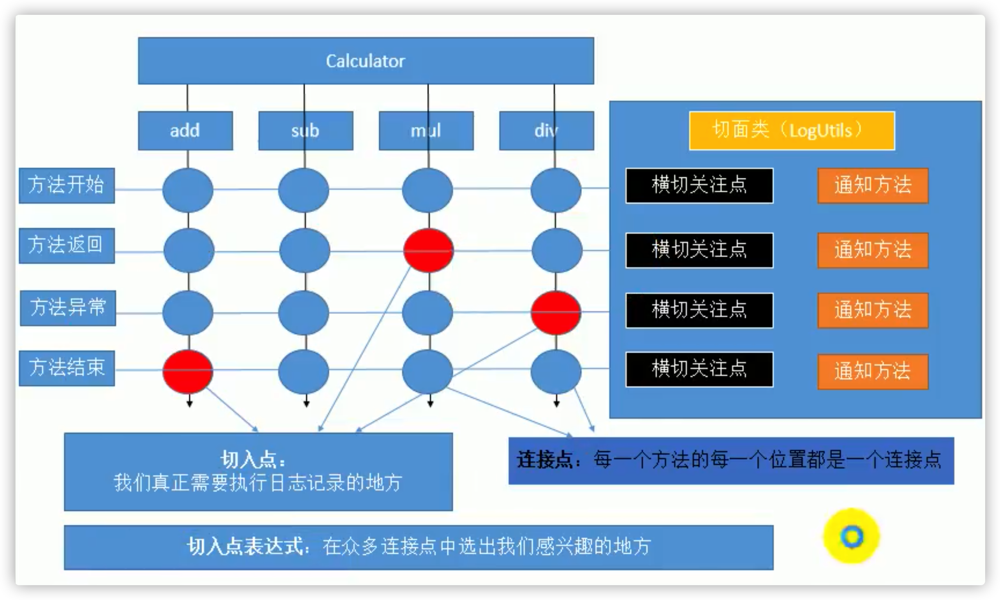

# Spring

## 概述

### 简介

- Spring是一个轻量级的控制反转==IOC/DI==和面向切面编程==AOP==的对象容器框架。
- [官网](http://spring.io/)
- Spring是一个于2003年兴起的一个轻量级的Java开源开发框架。

### 功能

- 方便解耦，简化开发。
- AOP编程的支持。
- 声明式事务的支持。
- 方便程序的测试。
- 方便集成各种优秀框架。

## 基础

### Bean的创建

#### 通过构造器(有参或无参)

- bean的创建默认就是框架利用反射new出来的bean实例。
- `<bean id="" class=""/>`

#### 通过静态工厂方法

- `<bean id="" class="工厂类" factory-method="静态工厂方法"/>`

#### 通过实例工厂方法(非静态方法)

- `<bean id="factory" class="工厂类"/>`
- `<bean id="" factory-bean="factory" factory-method="实例工厂方法"/>`

#### FactoryBean

- Spring提供的接口。
- 用于创建对象。

### Bean的作用域

#### singleton

- 单例的，是默认的作用域。
- 在容器启动完成之前就己经创建好对象，保存在容器中了。
- 任何获取都是获取之前创建好的那个对象。

#### prototype

- 原型，多例的。
- 容器启动默认不会去创建多实例bean。
- 每次请求的时候创建对象。

#### session

- 会话级别的作用域。
- 每次会话期间，返回的是同一个bean。

#### request

- 请求级别的作用域。
- 同一个请求内，获取到的bean是同一个对象。

### 静态工厂与实例工厂

#### 静态工厂

- 工厂本身不用创建对象。

- 通过静态方法调用，**对象=工厂类.工厂方法名();**

- 在静态工厂的工厂方法上添加注解@Bean。

  ```java
  public class StaticFactory {
  
      @Bean
      public static Cat staticCat(@Value("${cat.age}") int age) {
          Cat cat = new Cat();
          cat.setAge(age);
          cat.setName("static cat");
          return cat;
      }
  
  }
  ```

- 在配置类中导入这个静态工厂类。

  ```java
  @Configuration
  @Import(StaticFactory.class)
  public class BeanConfig {}
  ```

#### 实例工厂

- 工厂本身需要创建对象。
- 通过**调用工厂对象的工厂方法**来获取对象。

### FactoryBean

- 创建类实现`FactoryBean`接口。

  ```java
  public class CatFactory implements FactoryBean<Cat> {
  
      @Override
      public Cat getObject() {
          Cat cat = new Cat();
          cat.setAge(1);
          cat.setHasChild(false);
          cat.setName("xiao liu");
          return cat;
      }
  
      @Override
      public Class<?> getObjectType() {
          return Cat.class;
      }
  
      @Override
      public boolean isSingleton() {
          return true;
      }
  }
  ```

- 通过注解`@Bean`注入到容器中。

  ```java
  @Bean
  public CatFactory catFactory(){
    return new CatFactory();
  }
  ```

- 通过`applicationContext.getBean("&catFactory");`获取工厂类本身。

- 通过`applicationContext.getBean("catFactory");`获取工厂类的对象。

  

### 生命周期

- 单例对象在容器初始化的时候创建，在容器关闭的时候被调用销毁方法。
- 多例对象在获取的时候进行创建，销毁的时候不会被调用销毁方法，销毁由用户控制。

### BeanPostProcessor

Spring提供的一个Bean的后置处理器，用于在Bean**初始化前后**调用方法对Bean对象进行一些处理。

无论Bean是否有初始化方法，BeanPostProcessor都会生效并工作。

#### 生命周期

1. 容器启动
2. 构造函数。
3. `postProcessBeforeInitialization`。
4. bean的`initMethod`方法。
5. `postProcessAfterInitialization`。
6. bean的`destroyMethod`。
7. 容器销毁。

#### 使用方式

1. 编写自定义类实现`BeanPostProcessor`接口，并实现方法。
2. 将自定义实现类注册到容器中。

#### postProcessBeforeInitialization

- 初始化前调用。

#### postProcessAfterInitialization

- 初始化后调用。

### 引用外部配置文件

- `xml`

  ```xml
  <context:property-placeholder location="classpath:application.properties"/>
  ```

- `注解`

  ```java
  @PropertySource("classpath:application.properties")
  ```

- 在`@Value`注解中或者是在`xml文件`中通过`${}`取出配置文件中的值。

## IOC

### autowire规则

被Spring容器管理的Bean的自定义类型的属性会根据一定规则进行自动赋值。

```java
private Car car
```

#### byName

- 按照名字。
- 以**属性名作为id**去容器中找到这个组件，给他赋值。
- 如果找不到就装配null。
- `ioc.getBean("car");`

#### byType

- 以**属性的类型**作为查找依据去容器中找到这个组件。
- 如果容器中有多个这个类型的组件，报错。
- 如果找不到就装配null。
- `ioc.getBean(Car.class);`

#### constructor

- 按照构造器进行赋值。
- 先按照有参构造器参数的类型进行装配，没有就直接为组件装配null即可。
- 如果按照类型找到了多个。以**参数的名**作为id继续匹配。找到就装配，找不到就null。
- 不会报错。

### 通过注解向容器中注入Bean

#### 标识组件

- `@Controller`
- `@Component`
- `@Service`
- `@Repository`

#### 指定扫描包

- `@ComponentScan`
  - 通过属性`base-package`指定扫描哪些包
- `@ComponentScans`

#### 指定Bean的作用域

- `@Scope`

#### 过滤扫描的Bean

- `exclude-filter` 过滤bean的规则。
- `include-filter` 包含bean的规则。
- type属性可以指定的种类。
  - `annotation` 按照注解进行过滤Bean。
  - `assignable` 指定过滤某个具体的类，按照类过滤Bean。
  - `aspectj` xxx。
  - `custom` 按照自定义的TypeFilter实现类来过滤Bean。
  - `regex ` 按照正则表达式表达式过滤Bean。

### @AutoWired

自动装配。

#### 特性

- 默认一定要装配属性，找不到就报错。
- 通过属性`required=false`修改默认规则，找不到就装配null。

#### 规则

按照**类型**去容器中找到对应的组件。

- 找到一个，赋值。
- 没找到，抛异常。
- 找到多个，按照**变量名**作为id继续匹配。
  - 匹配上，赋值。
  - 没有匹配上，抛异常。

#### 作用范围

- 构造器。
- 字段。
- 方法，方法上的每一个参数都会自动注入。
- 注解。

### @Qualifier

指定一个名作为id，让Spring别使用变量名作为id。

#### 规则

- 找到，装配。
- 找不到，抛异常。

### @Resource、@AutoWired和@Inject

- 三者都能实现自动注入Bean。
- `@AutoWired`最强大，是Spring规定的。
- `@Resource`是java的标准，位于javax包下，扩展性更强，适用于不同的框架。
- `@Inject`是EJB的注入标准。

### Spring单元测试

Spring提供了对于基于容器的单元测试的支持。

#### @ContextConfiguration

- 指定Spring配置文件文件的位置。

#### @RunWith

- 指定用哪种单元测试的驱动进行启动，默认是**JUnit**。
- `SpringJunit4ClassRunner.class` Spring的Junit4模块。

### 泛型依赖注入

Spring支持泛型依赖注入。

Spring中可以使用带泛型的父类类型来确定这个子类的类型。

#### 原理

- xxx.getClass.getGenericsSuperclass，获取带泛型的父类。

- 根据泛型匹配正确泛型依赖，注入。

#### 应用

- 定义`BaseService`和`BaseDao`，子类Service中的BaseDao会根据泛型自动匹配到对应的`xxxDao`。

## AOP

>Aspect Oriented Programming 面向切面编程，作为面向对象编程的补充。

指在程序运行期间，**将某段代码动态的切入到指定方法的指定位置进行运行**的这种编程方式，称之为面向切面编程。

可以利用Spring一句代码都不写的去创建动态代理，而且没有强制要求目标对象必须实现接口。

### 动态代理

Proxy。

#### 示例代码

```java
public class CalcProxy {

    public static Add getProxy(Add calculator) {
        // 类加载器
        ClassLoader loader = calculator.getClass().getClassLoader();
        // 接口
        Class<?>[] interfaces = calculator.getClass().getInterfaces();
        // 代理执行器
        InvocationHandler h = (proxy, method, args) -> {
            System.out.println("StartTime: " + currentTimeMillis());
            // 代理方法调用
            Object result = method.invoke(calculator, args);
            System.out.println("EndTime: " + currentTimeMillis());
            // 被执行方法的返回值
            return result;
        };
        Object o = Proxy.newProxyInstance(loader, interfaces, h);
        return (Add) o;
    }
}
```

#### 总结

- 写起来难。
- jdk默认的动态代理，如果目标对象没有实现任何接口，是无法为他创建代理对象的。

### InvocationHandler

jdk动态代理的方法执行器。

#### 参数

- `proxy` 代理对象，给jdk使用，任何时候都不要动这个对象。
- `method` 当前将要执行的目标对象的方法。
- `args` 这个方法调用时外界传入的参数值。

### AOP术语

#### 术语

- ==横切关注点== 方法开始、方法返回、方法异常、方法结束都是横切关注点。
- ==通知方法== 横切关注点调用的方法是通知方法。
- ==切面类== 维护通知方法的类叫做切面类。
- ==连接点== 每一个方法的每一个位置都是连接点。
- ==切入点== 也叫织入点，真正需要进行切面拦截执行通知方法的地方，切入点只是连接点的一部分。
- ==切入点表达式== 在连接点中筛选出切入点的表达式。

#### 图示



### Spring AOP的使用

#### 整合步骤

1. 将目标类和切面类加入IOC容器。

2. 给切面类加入`@Aspect`注解以标明切面类。

3. 给切面类中的方法添加对应的注解声明为通知方法。

   - `@Before` 前置通知，在目标方法之前执行。
   - `@After` 后置通知，在目前方法结束支付执行。
   - `@AfterReturning` 返回通知，在目标方法正常返回之后执行。
   - `@AfterThrowing` 异常通知，在目标方法抛出异常之后执行。
   - `@Around` 环绕通知，是Spring最强大的通知，就是上面四种通知的合集。

4. 编写exection表达式，指定具体的织入点。

   - `execution(访问权限符 返回值类型 全限定类名.方法名(方法签名))`。
   - **\*** *匹配一个或者多个字符*或者*匹配任意一个参数*或者*匹配一层路径*。
   - **..** *匹配任意多个参数，任意类型参数*或者*匹配任意多层路径*。
   - 最模糊，`"exection(* *(..))"`或者`"exection(* *.*(..))"`。
   - 支持**&&、||、!**三种逻辑表达式。

5. 开启基于注解的AOP

   ```xml
   <aop:aspectj-autoproxy></aop:aspectj-autoproxy>
   ```

#### 通知注解执行示例代码

```java
try {
    // @Before
    method.invoke(xxx, args);
    // @AfterReturning
} catch (Exception e) {
    // @AfterThrowing
} finally {
    // @After
}
```


### Spring AOP 细节

#### 代理规则

- 如果被代理类实现了接口，默认使用jdk的Proxy创建代理类。
- 如果被代理类没有实现任何接口，使用CGLIB创建出代理类。

#### 容器中的Bean

- 容器中保存的是被代理对象的Proxy对象，而非本身。

#### 为通知方法加入参数

- JoinPoint joinPoint 封装了当前目标方法的详细信息。
- `joinPoint.getArgs();` 获取参数列表。
- `joinPoint.getSignature();` 获取方法签名。
- 添加参数`Object result`接收结果，需要在通知注解的`returning`属性上指定接收结果参数的名称。
- 添加参数`Exception e`接收异常，需要在通知注解的`throwing`属性上指定接收异常参数的名称。

#### 通知方法的要求

- Spring对通知方法的要求不严格，任意权限符、任意返回值的方法都可以作为通知方法。
- 对参数列表有一定限制，要和注解中的`returning`、`throwing`属性匹配，且第一个参数一定是JoinPoint。

#### 通知方法的执行顺序

##### 正常执行

1. @Before，前置通知。
2. @After，后置通知。
3. @AfterReturning，正常返回。

##### 异常执行

1. @Before，前置通知。
2. @After，后置通知。
3. @AfterThrowing，抛出异常。

##### **Spring5之后，执行逻辑发送变化!!!!**

#### 抽取可重用的切入点表达式

1. 随便声明一个没有实现的返回void的空方法。
2. 给方法上标注`@Pointcut`注解，`exection`表达式写入到`@Pointcut`的属性上。
3. 在通知方法的注解上直接引用带有`@Pointcut`注解的方法即可。

#### 环绕通知的特性

- 就是手写动态代理。
- 依赖于强大的参数`ProceedingJoinPoint pjp`。
  - `pjp`可以获取到方法参数。
  - 通过调用`pjp.proceed();`等同于调用`method.invoke();`。
  - 返回值要进行返回。

#### 环绕通知的执行顺序

- 环绕通知的代码优先执行。
- 环绕通知的处理中不要吞异常，要正常抛到业务层。

#### 多切面的运行顺序

- 根据切面类的名称的字母顺序排序决定执行顺序。
- 先执行的后出去，后执行的先出去。
- 可以使用`@Order`注解指定切面顺序，数值越小，优先级越高。

### AOP应用

- 日志。
- 权限验证。
- 安全检查。
- 事务控制。

### 基于配置的AOP

- 声明`<bean/>`。

- 声明切面。

  ```xml
  <aop:config>
    <aop:aspect ref="myLogger">
      <!-- <aop:before method="before" pointcut="execution(* com.atguigu.spring.aopxml.*.*(..))"/> -->
      <aop:pointcut expression="execution(* com.atguigu.spring.aopxml.*.*(..))" id="cut"/>
      <aop:before method="before" pointcut-ref="cut"/>
    </aop:aspect>
  </aop:config>
  ```

  

## 声明式事务

### JDBCTemplate

#### 使用方式

1. 向容器中加入一个数据源，id声明为`dataSource`。
   - `${}`取出配置文件中的值。
   - `#{}`Spring的表达式语言。
2. 导入Spring的数据库模块，`JDBC`、`ORM`、`Transtations`。
3. 向容器中注入一个`JDBCTemplate`类型的Bean，将`dataSource`注入到`JDBCTemplate`中。
4. 从容器中获取JDBCTemplate使用即可。

#### 结果对象封装

- 需要数据库列和JavaBean的属性同名，否则无法映射。
- 如果查询没有结果，会报错。

#### NamedParameterJDBCTempale

- 使用`NamedParameterJDBCTempale`可以执行具名参数的SQL。
- 具有名字的参数，参数不是占位符了，而是一个变量名。
- 语法格式 **:参数名**。
- 占位符参数**?**的顺序千万不能乱。传参的时候一定注意。但是具名参数可以传递一个map，map中的key和具名参数的名称匹配即可。

### 事务概念

事务就是一组由主逻辑上紧密关联而台并成一个整体(工作单元)的多个数据库操作，这些操作要么都执行，要么都不执行。

#### 关键属性

ACID。

- 原子性。
- 一致性。
- 隔离性。
- 持久性。

#### 事务隔离级别

##### 数据库事务并发问题

>假设现在有两个事务，Transaction1 和 Transaction2 并发执行。

- 脏读
  1. Transaction1将某条记录的AGE值从20修改为30。
  2. Transaction2读取了Transaction1更新后的值:30。
  3. Transaction1**回滚**，AGE值恢复到了20。
  4. Transaction2读取到的30就是一个**无效的值**。
- 不可重复读。
  1. Transaction1读取了AGE值为20。
  2. Transaction2将AGE值修改为30。
  3. Transaction1**再次读取**AGE值为30，**和第一次读取不一致**。
- 幻读。
  1. Transaction1读取了STUDENT表中的一部分数据。
  2. Transaction2向STUDENT表中**插入**了新的行。
  3. Transaction1读取了STUDENT表时，**多出**了一些行。

##### 数据库事务隔离级别

- 数据库系统必须具有隔离并发运行各个事务的能力，使它们不会相互影响，避免各种并发问题。
- 一个事务与其他事务隔离的程度称为隔离级别。SQL标准中规定了多种事务级别，不同隔离级别对应不的下程度，隔离级别越高，数据一致性就越好，但并发性越弱。

**具体级别**

- 读未提交`READ UNCOMMITTED`

  - 允许Transaction1读取Transaction2**未提交**的修改。
  - 存在脏读的可能，事务2的数据可能回滚。

- 读已提交`READ COMMITTED`

  - 要求Transaction1只能读取Transaction2**已提交**的修改。

  -  避免了脏读，但是同一事务内可能读取到了不同的结果。
  - 出现了不可重复的问题，是某些业务场景下期望的场景。

- 可重复读`REPEATABLE READ`

  - 快照读。
  - 确保Transaction1可以**多次从一个字段中读取到相同的值**，即使该数据已经删除。
  - Transaction1执行期间**禁止其它事务对这个字段进行更新**。
  - MySQL数据库的默认数据库隔离级别。
  - 解决了读的各种问题。

- 串行化 `SERIALIZABLE`

  - 确保Transaction1可以多次从一个表中读取到相同的行，在Transaction1执行期间，**禁止其它事务对这个表进行添加、更新、删除操作**。
  - 可以避免任何并发问题，但性能十分低下。

#### 事务传播行为

- `REQUIRED`

  如果有事务在运行，当前的方法就在这个事务内运行，否则，就启动一个新的事务，并在自己的事务内运行。

- `REQUIRED NEW` 

  当前的方法必须启动新事务，并在它自己的事务内运行。如果有事务正在运行，应该将它起。

- `SUPPORTS`

  如果有事务在运行，当前的方法就在这个事务内运行。否则它可以不运行在事务中。

- `NOT SUPPORTED`

  当前的方法不应该运行在事务中。如果有运行的事务，将事务挂起。

- `MANDATORY`

  当前的方法必须运行在事务内部，如果没有正在运行的事务，就**抛出异常**。

- `NEVER`

  当前的方法不应该运行在事务中。如果有运行的事务，就**抛出异常**。

- `NESTED`

  如果有事务在运行，当前的方法就应该在这个事务的嵌套事务内运行。否则，就启动一个新的事务，并在它自己的事务内运行。

  

### 编程式事务

```java
// transtation filter
try {
    // 获取链接
    // 关闭自动提交
    filterChain.do(xxx)
    // 提交事务
} catch (Exception e) {
    e.printStackTrace();
    // 回滚事务
} finally {
    // 释放连接
}
```

### 声明式事务

- 以前通过复杂的编程来编写一个事务，替换为只需要告诉Spring哪个方法是事务方法即可。
- Spring自动进行事务控制。

#### 实现原理

- 事务管理代码的**固定模式作为一种横切关注点**，可以通过AOP方法模块化，进而借助Spring AOP框架实现声明式事务管理。

- AOP的环绕通知可以实现事务功能。

#### 接口

- `PlatformTransactionManager` 事务管理器。

#### 使用事务管理器

1. 配置事务管理器。

   - 控制数据源。

   ```xml
   <bean id="transactionManager" class="org.springframework.jdbc.datasource.DataSourceTransactionManager">
     <property name="dataSource" ref="dataSource" />
   </bean>
   ```

2. 开启基于注解的事务控制器，依赖tx名称空间。

   ```xml
   <tx:annotation-driven transaction-manager="transactionManager"/>
   ```

3. 给事务方法加注解`@Transactional`。

### 声明式事务注解的属性

#### isolation

- 事务的隔离级别。

#### propagation

- 事务的传播行为。

#### timeout

- 事务超出指定执行时长后自动终止并回滚。

#### readOnly

- 设置事务为只读事务。
- 加快查询速度。


>异常分类。
>
>- 运行时异常（非检査异常）
>
> - 可以不用处理。
> - 默认都回滚。
>
>- 编译时异常（检查异常） 
>
> - 必须处理，要么 try-catch，要么在方法上声明throws。
>
> - 默认不回滚。
>
>事务的回滚：**默认发生运行时异常都回滚，发生编译时异常不会回滚**。

#### rollbackFor

- 回滚-类型。

#### rollbackForClassName

- 回滚-全类名。

#### noRollbackFor

- 不回滚-类型。

#### noRollbackForClassName

- 不回滚-全类名。

## 源码-IOC容器启动

#### 容器基础

- IOC是一个容器。
- 容器启动的时候创建所有单实例对象。
- 可以直接从容器中获取到这个对象。

#### IOC容器启动过程

>分析过程以ClassPathXmlApplicationContext为例。
>
>都实现了`ResourceLoader`接口，都是资源加载器的实现。

1. 调用`ClassPathXmlApplicationContext`三个参数的构造方法。

   ```java
   /**
    * ClassPathXmlApplicationContext构造方法
    *
    * @param configLocations 配置文件的位置
    * @param refresh         是否刷新容器
    * @param parent          父容器
    */
   public ClassPathXmlApplicationContext(String[] configLocations, boolean refresh,
       @Nullable ApplicationContext parent)
       throws BeansException {
       super(parent);
       // 逐条解析传入配置文件
       setConfigLocations(configLocations);
   		// 刷新容器  
       if (refresh) {
           refresh();
       }
   }
   ```

2. refresh()流程。

   - 方法加锁，避免并发容器初始化。

   - prepareRefresh()

     - initPropertySources()
     - getEnvironment().validateRequiredProperties();
     - **pre-refresh ApplicationListeners** 初始化早期应用监听器。
     - **earlyApplicationEvents** 初始化早期应用事件集合。

   - `obtainFreshBeanFactory()` 获取刷新Bean工厂，**解析xml获取Bean定义信息并保存起来**。

     - `refreshBeanFactory()` 
     - `getBeanFactory()`

   - `prepareBeanFactory(beanFactory);` 准备在上下文中使用Bean工厂。

     - 给Bean工厂设置回调函数。

       ```java
       // Configure the bean factory with context callbacks.
       beanFactory.addBeanPostProcessor(new ApplicationContextAwareProcessor(this));
       beanFactory.ignoreDependencyInterface(EnvironmentAware.class);
       beanFactory.ignoreDependencyInterface(EmbeddedValueResolverAware.class);
       beanFactory.ignoreDependencyInterface(ResourceLoaderAware.class);
       beanFactory.ignoreDependencyInterface(ApplicationEventPublisherAware.class);
       beanFactory.ignoreDependencyInterface(MessageSourceAware.class);
       beanFactory.ignoreDependencyInterface(ApplicationContextAware.class);
       beanFactory.ignoreDependencyInterface(ApplicationStartupAware.class);
       ```

     - xx

       ```java
       beanFactory.registerResolvableDependency(BeanFactory.class, beanFactory);
       beanFactory.registerResolvableDependency(ResourceLoader.class, this);
       beanFactory.registerResolvableDependency(ApplicationEventPublisher.class, this);
       beanFactory.registerResolvableDependency(ApplicationContext.class, this);
       ```

     - 注册早期后处理器

       ```java
       beanFactory.addBeanPostProcessor(new ApplicationListenerDetector(this));
       ```

     - 注册默认环境Bean

       ```java
       if (!beanFactory.containsLocalBean(ENVIRONMENT_BEAN_NAME)) {
         beanFactory.registerSingleton(ENVIRONMENT_BEAN_NAME, getEnvironment());
       }
       if (!beanFactory.containsLocalBean(SYSTEM_PROPERTIES_BEAN_NAME)) {
         beanFactory.registerSingleton(SYSTEM_PROPERTIES_BEAN_NAME, getEnvironment().getSystemProperties());
       }
       if (!beanFactory.containsLocalBean(SYSTEM_ENVIRONMENT_BEAN_NAME)) {
         beanFactory.registerSingleton(SYSTEM_ENVIRONMENT_BEAN_NAME, getEnvironment().getSystemEnvironment());
       }
       if (!beanFactory.containsLocalBean(APPLICATION_STARTUP_BEAN_NAME)) {
         beanFactory.registerSingleton(APPLICATION_STARTUP_BEAN_NAME, getApplicationStartup());
       }
       ```

   - `postProcessBeanFactory(beanFactory);`允许在上下文子类中对Bean工厂进行后处理。

   - `invokeBeanFactoryPostProcessors(beanFactory);` 调用BeanFactory后处理器。

   - `registerBeanPostProcessors(beanFactory);` 注册Bean后置处理器。

   - `initMessageSource();` 初始化消息源。

   - `initApplicationEventMulticaster();` 初始化应用事件多波器。

   - `onRefresh();` 初始化特定上下文子类中的其他特殊Bean。

   - `registerListeners();` 检查并注册监听器。

   - `finishBeanFactoryInitialization(beanFactory);` 实例化所有剩余的（非延迟初始化）单例Bean。

   - `finishRefresh();` 发布对应事件。

3. xx

4. 

调用`ClassPathXmlApplicationContext`三个参数的构造方法。

#### 如何创建并管理单实例的Bean

## 源码摘录-IOC容器启动

### AbstractApplicationContext#refresh

>Spring IOC容器初始化的核心方法。

```java
@Override
public void refresh() throws BeansException, IllegalStateException {
  // 加锁，避免并发初始化。
  synchronized (this.startupShutdownMonitor) {
    
    StartupStep contextRefresh = this.applicationStartup.start("spring.context.refresh");

    // Prepare this context for refreshing.
    // 预准备刷新。
    prepareRefresh();

    // Tell the subclass to refresh the internal bean factory.
    // ⭐️ 构建BeanFactory，解析XML配置文件，将Bean定义信息读取并保存。
    ConfigurableListableBeanFactory beanFactory = obtainFreshBeanFactory();

    // Prepare the bean factory for use in this context.
    // 准备BeanFactory。
    prepareBeanFactory(beanFactory);

    try {
      // Allows post-processing of the bean factory in context subclasses.
      // 注册BeanFactory的后置处理器
      postProcessBeanFactory(beanFactory);

      StartupStep beanPostProcess = this.applicationStartup.start("spring.context.beans.post-process");
      // Invoke factory processors registered as beans in the context.
      // 调用BeanFactory的后置处理器。
      invokeBeanFactoryPostProcessors(beanFactory);

      // Register bean processors that intercept bean creation.
      // 注册Spring组件内部使用的一些后置处理器。
      registerBeanPostProcessors(beanFactory);
      beanPostProcess.end();

      // Initialize message source for this context.
      // ⭐️ 支持国际化功能。
      initMessageSource();

      // Initialize event multicaster for this context.
      // 初始化事件多播器。
      initApplicationEventMulticaster();

      // Initialize other special beans in specific context subclasses.
      // 留给子类的方法，用于做一些初始化工作。
      onRefresh();

      // Check for listener beans and register them.
      // 注册监听器。
      registerListeners();

      // Instantiate all remaining (non-lazy-init) singletons.
      // ⭐️⭐️⭐️ 完成BeanFactory初始化工作，初始化所有非懒加载的单实例的Bean。
      finishBeanFactoryInitialization(beanFactory);

      // Last step: publish corresponding event.
      finishRefresh();
    }

    catch (BeansException ex) {
      if (logger.isWarnEnabled()) {
        logger.warn("Exception encountered during context initialization - " +
                    "cancelling refresh attempt: " + ex);
      }

      // Destroy already created singletons to avoid dangling resources.
      destroyBeans();

      // Reset 'active' flag.
      cancelRefresh(ex);

      // Propagate exception to caller.
      throw ex;
    }

    finally {
      // Reset common introspection caches in Spring's core, since we
      // might not ever need metadata for singleton beans anymore...
      resetCommonCaches();
      contextRefresh.end();
    }
  }
}
```

### AbstractApplicationContext#finishBeanFactoryInitialization

>初始化全部单实例非懒加载的单实例的Bean的方法。

```java
// 完成此上下文的 bean 工厂的初始化，初始化所有剩余的单例 bean。
protected void finishBeanFactoryInitialization(ConfigurableListableBeanFactory beanFactory) {
  
  // Initialize conversion service for this context.
  // 初始化用于自定义类型转换的服务。
  if (beanFactory.containsBean(CONVERSION_SERVICE_BEAN_NAME) &&
      beanFactory.isTypeMatch(CONVERSION_SERVICE_BEAN_NAME, ConversionService.class)) {
    beanFactory.setConversionService(
      beanFactory.getBean(CONVERSION_SERVICE_BEAN_NAME, ConversionService.class));
  }

  // Register a default embedded value resolver if no BeanFactoryPostProcessor
  // (such as a PropertySourcesPlaceholderConfigurer bean) registered any before:
  // at this point, primarily for resolution in annotation attribute values.
  // 如果前面没有注册占位符解析器的情况下，向BeanFactory添加一个默认的占位符解析器。
  if (!beanFactory.hasEmbeddedValueResolver()) {
    beanFactory.addEmbeddedValueResolver(strVal -> getEnvironment().resolvePlaceholders(strVal));
  }

  // Initialize LoadTimeWeaverAware beans early to allow for registering their transformers early.
  // 初始化加载时WeaverAware相关组件。
  String[] weaverAwareNames = beanFactory.getBeanNamesForType(LoadTimeWeaverAware.class, false, false);
  for (String weaverAwareName : weaverAwareNames) {
    getBean(weaverAwareName);
  }

  // Stop using the temporary ClassLoader for type matching.
  // 停止使用临时的类加载器。
  beanFactory.setTempClassLoader(null);

  // Allow for caching all bean definition metadata, not expecting further changes.
  // 冻结BeanDefinition元数据，不希望被修改了。
  beanFactory.freezeConfiguration();

  // Instantiate all remaining (non-lazy-init) singletons.
  // 预初始化单例Bean。
  beanFactory.preInstantiateSingletons();
}
```

### DefaultListableBeanFactory#preInstantiateSingletons

>单例对象的预初始化方法。

```java
@Override
public void preInstantiateSingletons() throws BeansException {
  
  if (logger.isTraceEnabled()) {
    logger.trace("Pre-instantiating singletons in " + this);
  }

  // Iterate over a copy to allow for init methods which in turn register new bean definitions.
  // While this may not be part of the regular factory bootstrap, it does otherwise work fine.
  // 拷贝一份所有要初始化的Bean的名字集合。
  List<String> beanNames = new ArrayList<>(this.beanDefinitionNames);

  // Trigger initialization of all non-lazy singleton beans...
  // 按顺序初始化非懒加载的单实例Bean。
  for (String beanName : beanNames) {
    
    // 获取Bean的定义信息。
    RootBeanDefinition bd = getMergedLocalBeanDefinition(beanName);
    // 对非抽象、单例、非懒加载的Bean进行初始化。
    if (!bd.isAbstract() && bd.isSingleton() && !bd.isLazyInit()) {
      // FactoryBean的初始化流程
      if (isFactoryBean(beanName)) {
        Object bean = getBean(FACTORY_BEAN_PREFIX + beanName);
        if (bean instanceof FactoryBean) {
          FactoryBean<?> factory = (FactoryBean<?>) bean;
          boolean isEagerInit;
          if (System.getSecurityManager() != null && factory instanceof SmartFactoryBean) {
            isEagerInit = AccessController.doPrivileged(
              (PrivilegedAction<Boolean>) ((SmartFactoryBean<?>) factory)::isEagerInit,
              getAccessControlContext());
          } else {
            isEagerInit = (factory instanceof SmartFactoryBean &&
                           ((SmartFactoryBean<?>) factory).isEagerInit());
          }
          if (isEagerInit) {
            getBean(beanName);
          }
        }
      } else {
        // 普通的单例Bean的初始化流程。
        getBean(beanName);
      }
    }
  }

  // Trigger post-initialization callback for all applicable beans...
  for (String beanName : beanNames) {
    Object singletonInstance = getSingleton(beanName);
    if (singletonInstance instanceof SmartInitializingSingleton) {
      StartupStep smartInitialize = this.getApplicationStartup().start("spring.beans.smart-initialize")
        .tag("beanName", beanName);
      SmartInitializingSingleton smartSingleton = (SmartInitializingSingleton) singletonInstance;
      if (System.getSecurityManager() != null) {
        AccessController.doPrivileged((PrivilegedAction<Object>) () -> {
          smartSingleton.afterSingletonsInstantiated();
          return null;
        }, getAccessControlContext());
      }
      else {
        smartSingleton.afterSingletonsInstantiated();
      }
      smartInitialize.end();
    }
  }
}
```

### AbstractBeanFactory#doGetBean

>真正的单实例Bean的初始化实现方法。

```java
protected <T> T doGetBean(
    String name, @Nullable Class<T> requiredType, @Nullable Object[] args, boolean typeCheckOnly)
    throws BeansException {

    // 获取到转换后的Bean名称。
    String beanName = transformedBeanName(name);
    Object beanInstance;

    // Eagerly check singleton cache for manually registered singletons.
    // 检查缓存中是否已经保存了要注册的单实例的Bean。
    Object sharedInstance = getSingleton(beanName);
    if (sharedInstance != null && args == null) {
        if (logger.isTraceEnabled()) {
            if (isSingletonCurrentlyInCreation(beanName)) {
                logger.trace("Returning eagerly cached instance of singleton bean '" + beanName +
                    "' that is not fully initialized yet - a consequence of a circular reference");
            } else {
                logger.trace("Returning cached instance of singleton bean '" + beanName + "'");
            }
        }
        beanInstance = getObjectForBeanInstance(sharedInstance, name, beanName, null);
    } else {
        // Fail if we're already creating this bean instance:
        // We're assumably within a circular reference.
        // 检查目前的对象时候已经被创建好了，避免创造出多例。
        if (isPrototypeCurrentlyInCreation(beanName)) {
            throw new BeanCurrentlyInCreationException(beanName);
        }

        // Check if bean definition exists in this factory.
	      // 检查此工厂中是否存在Bean定义。
        BeanFactory parentBeanFactory = getParentBeanFactory();
        if (parentBeanFactory != null && !containsBeanDefinition(beanName)) {
            // Not found -> check parent.
            String nameToLookup = originalBeanName(name);
            if (parentBeanFactory instanceof AbstractBeanFactory) {
                return ((AbstractBeanFactory) parentBeanFactory).doGetBean(
                    nameToLookup, requiredType, args, typeCheckOnly);
            } else if (args != null) {
                // Delegation to parent with explicit args.
                return (T) parentBeanFactory.getBean(nameToLookup, args);
            } else if (requiredType != null) {
                // No args -> delegate to standard getBean method.
                return parentBeanFactory.getBean(nameToLookup, requiredType);
            } else {
                return (T) parentBeanFactory.getBean(nameToLookup);
            }
        }
				// 如果不是类型检查的话，就标记这个Bean的状态为被创建。
        if (!typeCheckOnly) {
            markBeanAsCreated(beanName);
        }

        StartupStep beanCreation = this.applicationStartup.start("spring.beans.instantiate")
            .tag("beanName", name);
        try {
            if (requiredType != null) {
                beanCreation.tag("beanType", requiredType::toString);
            }
          	// 获取到合并后的Bean定义信息。
            RootBeanDefinition mbd = getMergedLocalBeanDefinition(beanName);
            checkMergedBeanDefinition(mbd, beanName, args);

            // Guarantee initialization of beans that the current bean depends on.
            // 获取到Bean的Bean集合。
            String[] dependsOn = mbd.getDependsOn();
            // 如果存在依赖的Bean集合，那么就先注册、创建依赖Bean。
            if (dependsOn != null) {
                for (String dep : dependsOn) {
                    if (isDependent(beanName, dep)) {
                        throw new BeanCreationException(mbd.getResourceDescription(), beanName,
                            "Circular depends-on relationship between '" + beanName + "' and '" + dep + "'");
                    }
                    registerDependentBean(dep, beanName);
                    try {
                        getBean(dep);
                    } catch (NoSuchBeanDefinitionException ex) {
                        throw new BeanCreationException(mbd.getResourceDescription(), beanName,
                            "'" + beanName + "' depends on missing bean '" + dep + "'", ex);
                    }
                }
            }

            // Create bean instance.
            // 创建单例的bean实例。
            if (mbd.isSingleton()) {
              // ⭐️ 获取单实例Bean。
                sharedInstance = getSingleton(beanName, () -> {
                    try {
                        return createBean(beanName, mbd, args);
                    } catch (BeansException ex) {
                        // Explicitly remove instance from singleton cache: It might have been put there
                        // eagerly by the creation process, to allow for circular reference resolution.
                        // Also remove any beans that received a temporary reference to the bean.
                        destroySingleton(beanName);
                        throw ex;
                    }
                });
                beanInstance = getObjectForBeanInstance(sharedInstance, name, beanName, mbd);
            } else if (mbd.isPrototype()) {
                // It's a prototype -> create a new instance.
                Object prototypeInstance = null;
                try {
                    beforePrototypeCreation(beanName);
                    prototypeInstance = createBean(beanName, mbd, args);
                } finally {
                    afterPrototypeCreation(beanName);
                }
                beanInstance = getObjectForBeanInstance(prototypeInstance, name, beanName, mbd);
            } else {
                String scopeName = mbd.getScope();
                if (!StringUtils.hasLength(scopeName)) {
                    throw new IllegalStateException("No scope name defined for bean ´" + beanName + "'");
                }
                Scope scope = this.scopes.get(scopeName);
                if (scope == null) {
                    throw new IllegalStateException("No Scope registered for scope name '" + scopeName + "'");
                }
                try {
                    Object scopedInstance = scope.get(beanName, () -> {
                        beforePrototypeCreation(beanName);
                        try {
                            return createBean(beanName, mbd, args);
                        } finally {
                            afterPrototypeCreation(beanName);
                        }
                    });
                    beanInstance = getObjectForBeanInstance(scopedInstance, name, beanName, mbd);
                } catch (IllegalStateException ex) {
                    throw new ScopeNotActiveException(beanName, scopeName, ex);
                }
            }
        } catch (BeansException ex) {
            beanCreation.tag("exception", ex.getClass().toString());
            beanCreation.tag("message", String.valueOf(ex.getMessage()));
            cleanupAfterBeanCreationFailure(beanName);
            throw ex;
        } finally {
            beanCreation.end();
        }
    }

    return adaptBeanInstance(name, beanInstance, requiredType);
}
```

### DefaultSingletonBeanRegistry#getSingleton

>获取单实例Bean的方法。

```java
public Object getSingleton(String beanName, ObjectFactory<?> singletonFactory) {
  
  Assert.notNull(beanName, "Bean name must not be null");
  // 加锁，避免并发问题。
  synchronized (this.singletonObjects) {
    // 根据Bean的名称从集合中获取单例。
    Object singletonObject = this.singletonObjects.get(beanName);
    // 集合中不存在单例。
    if (singletonObject == null) {
      if (this.singletonsCurrentlyInDestruction) {
        throw new BeanCreationNotAllowedException(beanName,
                                                  "Singleton bean creation not allowed while singletons of this factory are in destruction " +
                                                  "(Do not request a bean from a BeanFactory in a destroy method implementation!)");
      }
      if (logger.isDebugEnabled()) {
        logger.debug("Creating shared instance of singleton bean '" + beanName + "'");
      }
      beforeSingletonCreation(beanName);
      boolean newSingleton = false;
      boolean recordSuppressedExceptions = (this.suppressedExceptions == null);
      if (recordSuppressedExceptions) {
        this.suppressedExceptions = new LinkedHashSet<>();
      }
      try {
        // ⭐️⭐️⭐️ 真正的创建了对象！！！通过Bean工厂中基于反射创建一个单例对象。
        singletonObject = singletonFactory.getObject();
        newSingleton = true;
      }
      catch (IllegalStateException ex) {
        // Has the singleton object implicitly appeared in the meantime ->
        // if yes, proceed with it since the exception indicates that state.
        singletonObject = this.singletonObjects.get(beanName);
        if (singletonObject == null) {
          throw ex;
        }
      }
      catch (BeanCreationException ex) {
        if (recordSuppressedExceptions) {
          for (Exception suppressedException : this.suppressedExceptions) {
            ex.addRelatedCause(suppressedException);
          }
        }
        throw ex;
      }
      finally {
        if (recordSuppressedExceptions) {
          this.suppressedExceptions = null;
        }
        afterSingletonCreation(beanName);
      }
      if (newSingleton) {
        // 将创建好的对象放入到单例的集合中。
        addSingleton(beanName, singletonObject);
      }
    }
    return singletonObject;
  }
}
```

### IoC保存Bean的容器

#### 保存所有单例Bean

- `DefaultSingletonBeanRegistry#singletonObjects` 保存单实例的BeanMap。

#### xxx

x

#### xxx

x

## 面试题

### BeanFactory和ApplicationContext的区别

- `ApplicationContext`是`BeanFactory`的子接口，功能更加强大。
- BeanFactory是Spring框架最底层的接口。
- BeanFactory是bean工厂，负责bean的创建，并将创建好的Bean保存到Map中。
- ApplicationContext是容器接口，更多负责容器功能的实现，从Map获取Bean对象，并进行AOP、DI等功能的实现。

## Spring框架用到设计模式

### 工厂模式

- 根据Bean定义创建Bean对象。