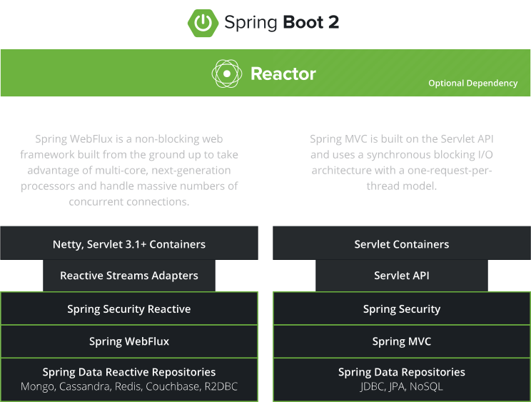

# SpringBoot 核心技术

## 官网

[官方文档](https://spring.io/projects/spring-boot)

## 基础入门

### Spring

#### Spring 生态能力

- `Spring Boot & Spring Cloud` 微服务开发。
- `Spring WebFlux & Spring Data Reactive Repositories` 响应式编程。
- `Spring Cloud` 分布式云开发。
- `Spring Frameworks & Spring MVC` Web 应用开发。
-  `Spring Cloud Function & Spring Data` 无服务开发，FaaS，Function as a Service。
- `Spring Cloud Stream & Spring Cloud Data Flow & Spring Cloud Function & Spring Cloud Kafka Streams & Spring Integration` 事件驱动的实时数据流。
- `Spring Batch` 批处理。

#### Spring 5 重大升级

- 响应式编程

  Spring 提供了两套异步编程技术栈。

  - `Servlet Statck` SpringMVC 基于原生 API 的技术方案。
  - `Reactive Stack` Spring WebFlux。

  

- 内部代码优化
  - 基于 Java8 的一些新特性，进行接口默认实现，取消了大量的适配器模式产生的 `XxxAdapter` 类。
  - 重新设计源码架构。

### Spring Boot 简介

#### 框架总述

- Spring Boot是一个致力于简化配置、直接创建可以投入到生产环境的 Spring 应用的框架。
- Spring Boot 的使命之一就是完成和各种框架和类库的整合工作，通过引用各种各样的 `starter`，启用相应的能力。
- SpringBoot 是整合 Spring 技术栈的一站式框架。
- SpringBoot 是简化 Spring 技术栈的快速开发脚手架。

#### Spring Boot 优点

- 创建独立 Spring 应用。
- 内嵌 web 服务器。
- 自动 starter 依赖，简化构建配置。
- 自动配置 Spring 以及第三方功能。
- 提供生产级别的监控、健康检查及外部化配置。
- 无代码生成、无需编写 XML。

#### Spring Boot 缺点

- 深度封装，内部原理复杂，很难精通。

### 时代背景

#### 微服务

- 微服务是一种架构风格。
- 一个应用拆分为一组小型服务。
- 每个服务运行在自己的进程内，也就是可独立部罢和升级。
- 服务之间使用轻量级 HTTP 交互。
- 服务围绕业务功能拆分。
- 可以由全自动部署机制独立部署。
- 去中心化，服务自治。服务可以使用不同的语言、不同的存储技术。

#### 分布式

##### 分布式的困难

- 远程调用。
- 服务发现。
- 负载均衡。
- 服务容错。
- 配置管理。
- 服务监控。
- 链路追踪。
- 日志管理。
- 任务调度。
- ......

##### 问题解决

- Spring Boot + Spring Cloud

#### 云原生

##### 上云的困难

> 原生应用如何上云，`Cloud Native`。

- 服务自愈。
- 弹性伸缩。
- 服务隔离。
- 自动化部署。
- 灰度发布。
- 流量治理。
- ......

##### 问题解决

- Docker 容器化技术。
- K8S 容器编排技术。
- DevOps 企业云平台搭建。

------

### SpringBoot2 入门

#### 系统要求

- JDK8 & 兼容 JDK14
- Maven 3.3+
- IDEA 2019.1.2 及后版本

#### Maven 配置

```xml
<mirrors>
  <mirror>
    <id>nexus-aliyun</id>
    <mirrorOf>central</mirrorOf>
    <name>Nexus aliyun</name>
    <url>http://maven.aliyun.com/nexus/content/groups/public</url>
  </mirror>
</mirrors>

<profiles>
  <profile>
    <id>jdk-1.8</id>
    <activation>
      <activeByDefault>true</activeByDefault>
      <jdk>1.8</jdk>
    </activation>
    <properties>
      <maven.compiler.source>1.8</maven.compiler.source>
      <maven.compiler.target>1.8</maven.compiler.target>
      <maven.compiler.compilerVersion>1.8</maven.compiler.compilerVersion>
    </properties>
  </profile>
</profiles>
```

#### HelloWorld

- 创建工程。

- 引入依赖。

  ```xml
  <parent>
    <groupId>org.springframework.boot</groupId>
    <artifactId>spring-boot-starter-parent</artifactId>
    <version>2.3.4.RELEASE</version>
  </parent>
  
  <dependencies>
    <dependency>
      <groupId>org.springframework.boot</groupId>
      <artifactId>spring-boot-starter-web</artifactId>
    </dependency>
  </dependencies>
  ```

- 编写 Controller 及方法。

- 编写主程序类，标记 `@SpringBootApplication` 注解。

- 修改 `application.properties` 配置文件，修改端口。

- 通过运行应用的入口类的 `main` 方法，启动服务。

- 访问服务。

- 通过插件，打包生成可执行的 jar。

  ```xml
  <build>
    <plugins>
      <plugin>
        <groupId>org.springframework.boot</groupId>
        <artifactId>spring-boot-maven-plugin</artifactId>
      </plugin>
    </plugins>
  </build>
  ```

- 通过 `java -jar xxx.jar` 运行应用。

------

### 自动配置原理

#### 依赖管理

- 父项目做依赖管理。

  - SpringBoot 父项目管理整个应用的三方依赖的版本。
  - 几乎所有常用的依赖版本都在父项目中有定义和维护。

  ```xml
  <parent>
    <groupId>org.springframework.boot</groupId>
    <artifactId>spring-boot-starter-parent</artifactId>
    <version>2.6.6</version>
    <relativePath/>
  </parent>
  ```

- 开发导入 `starter` **场景启动器**。

  - 引入了众多 `spring-boot-starter-*` 命名的官方场景启动器，`*` 即代表着对应的场景。
  - 引入了对应的场景启动器，就意味着自动化引入了该场景所需的全部依赖。
  - Spring 官方提供了众多的场景启动器，[参考文档](https://docs.spring.io/spring-boot/docs/current/reference/html/using.html#using.build-systems.starters)。
  - 可以扩展开发第三方 starter 用于简化第三方框架集成与应用的场景。
  - 第三方 starter 命名规范 `*-spring-boot-starter`。

- 无需关注版本号，自动版本仲裁。

  - `spring-boot-starter-parent` 的父项目是管理版本号的项目。

  - `spring-boot-dependencies` pom 文件中定义和约定了众多常用的第三方依赖及其版本。

  - 引入被版本仲裁约束的 jar 时，不需要指定版本号。

    ```xml
    <parent>
      <groupId>org.springframework.boot</groupId>
      <artifactId>spring-boot-dependencies</artifactId>
      <version>2.6.4</version>
    </parent>
    ```

- 可以修改版本号。

  - 在项目的 `pom.xml` 文件中，覆盖父项目中指定的版本号属性，即可完成版本号覆盖。

  - 利用 Maven 的就近优先原则。

    ```xml
    <properties>
      <mysql.version>5.1.43</mysql.version>
    </properties>
    ```


#### 自动配置

>Spring Boot 提出了 `约定大于配置` 的口号，帮我们完成了大多数常用功能、组件的配置。

- 自动配好 Tomcat。
- 自动配好 Spring MVC。
- 自动配好 Wb 常见功能。
  - 字符编码问题。
- 默认的包结构。
  - 自动扫描主程序包及其子包的组件。
  - 修改 @SpringbootApplication 的 `scanBasePackages` 属性可以指定扫描的路径。
  - 可以通过 `@ComponentScan` 注解指定扫描规则。
  - `@SpringBootApplication` 等价于以下三个注解。
    - @SpringBootConfiguration
    - @EnableAutoConfiguration
    - @ComponentScan

- 各种配置拥有默认值。
  - 配置文件的值最终会绑定每个类上，这个类会在容器中创建对象。

- 按需加载所有自动配置项。
  - SpringBoot 所有的自动配置功能都在 `spring-boot-autoconfigure` 包里面。
  - SpringBoot 会根据容器内组件的情况，按需加载相关的自动配置。

- ......

------

## 底层注解

### 组件添加

#### @Configuration

- 标记在类上，告诉 SpringBoot 该类等同于一个配置文件。
- 配置类本身也会被当做一个组件注册到容器中。
- `proxyBeanMethods` 属性用于表示是否创建代理对接管理创建 Bean 的方法，默认值为 true。
  - 当 `proxyBeanMethods = false` 时，容器中的配置类对象不再是代理对象，且每次调用方法产生一个新的对象。

#### @Bean

- @Bean 注解标记在方法上，用于向容器中添加组件。
- 以**方法名**作为组件的 **id**。
- 方法返回值类型就是组件类型。
- 方法的返回值就是在容器注册的组件实例。
- 默认注册的 Bean 的单例的，外部无论对配置类中的这个组件注册方法调用多少次获取的都是之前注册容器中的单实例对象。

#### @CompantScan

- 指定容器中组件的扫码规则。

#### @Import

- 指定组件的导入规则，常用于指定第三方组件。
- 标记在配置类或者其他组件上都可以生效。
- `value` 属性的类型是 `Class` 类型的数组。
- 容器创建过程中会调用指定类的无参构造器，默认组件的名字是组件类的全类名。

#### @Conditional

- 条件装配，当满足条件的时候，注册组件。
- @Conditional 是根注解，下面包含众多子注解。
  - @ConditionalOnClass
  - @ConditionalOnProperty
  - @ConditionalOnBean
  - @ConditionalOnWebApplication
  - ......
- 可以标记在方法上或者类上。

### 原生配置文件引入

#### @ImportResource

- 导入原生的 xml 配置文件。
- 标记在配置类上。

### 配置绑定

#### @ConfigurationProperties

- 将配置和 Java 类的属性完成绑定。
- 标记在要绑定的类的上面，被标记的类也需要是容器中的组件。
- 通过指定 `prefix` 前缀和 完成和 Java 类中同名属性的绑定。

#### @EnablelConfigurationProperties

- 标记在配置类上。
- 开启属性配置功能，并将指定的类自动注册到容器中。
- `value` 传入要开启属性配置功能的类。
- 被开启的配置绑定的类需要添加 `@ConfigurationProperties` 注解并配置属性的绑定关系。
- 可以解决引入第三方包中类不能添加 `@Component` 注解的问题。
- 

------

## 核心功能


## 场景整合

