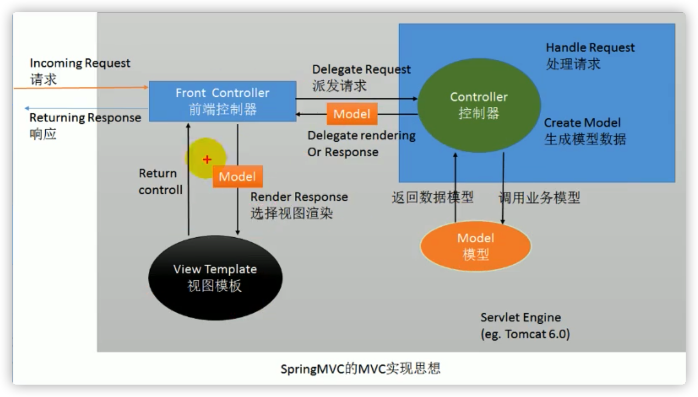
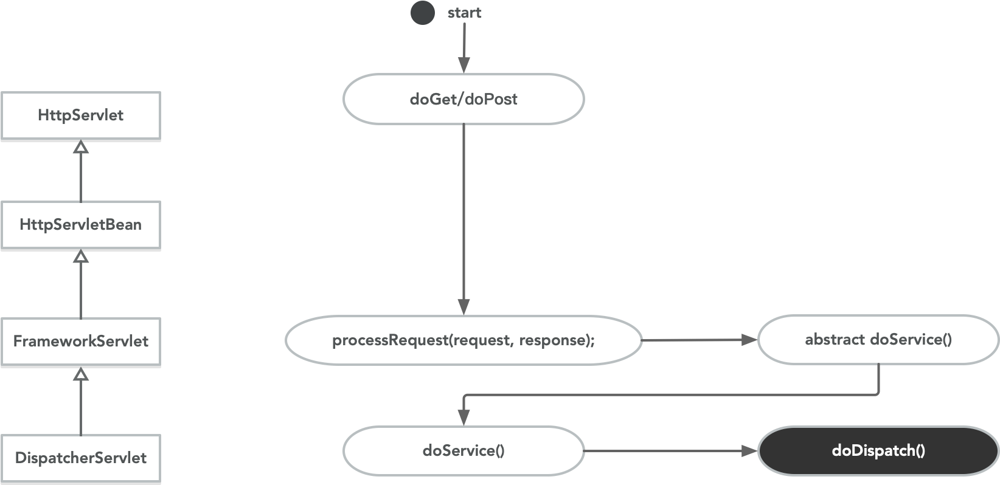

# Spring MVC

## 概述

- Spring 为**展现层**提供的基于 MVC 设计理念的优秀的 web 框架，是目前最主流的 MVC 框架之一。

- `Spring 3.0` 后全面超越 `Struts2`， 成为最优秀的 MVC 框架。
- Spring MVC 通过一套 **MVC 注解**，让 POJO 成为处理请求的控制器，而无须实现任何接口。
- **支持 REST 风格的 URL 请求**。
- 采用了**松散耦合可插拔组件结构**，比其他 MVC 框架更具扩展性和灵活性。

## Spring 的 MVC 实现

## HelloWorld

### web项目版本

- Web 2.5 版本会自动创建web.xml。
- Web 3.0 需要单独配置。
- Web 三大组件
  - Servlet
  - Filter
  - Linstener

### 流程

- 导包
- 写配置
  - SpringMVC需要配置一个前端控制器，`DispatcherServlet`，在`web.xml`中配置。
  - `load-on-startup` 配置启动顺序，否则 Servlet 默认是在第一次访问的时候创建对象，值越小，优先级越高。
  - `contextConfigurationLocation` 指定配置文件位置。
  - `servlet-mapping` 配置 Servlet拦截的请求表达式，`/`。
    - `/` 和 `/*`都拦截所有的请求。
    - `/*`的范围会更大，还会拦截到*.jps请求。 
  - `spring-mvc.xml` 配置文件。
    - 指定扫描的控制器组件的包范围。
    - 配置**视图解析器** `InternalResourceResolver` 进行视图解析。
- 编写代码
  - 编写控制器`Controller`。
  - 编写具有映射请求地址的方法。
- 测试

### 总结

- `@RequestMapping` 指定映射的请求路径。
- `web.xml`不指定配置文件位置，默认去`/WEB-INF/xxx-servlet.xml`找配置，`xxx`表示配置的Servlet的名称。
- 前端控制的配置问题
  - 服务器的全局`web.xml`中有一个 `DefaultServlet` 是 `url-pattern=/`。
  - SpringMVC配置的前端控制器也是`url-pattern=/`，会禁用掉Tomcat中的DefaultServlet。
  - DefaultServlet是服务于各种静态资源，除了JSP和Servlet之外，都属于静态资源。
  - `/*`会拦截所有的请求，DispatcherServlet配置的过程中，使用`/`，也是为了可能兼容Rest风格的请求。

## RequestMapping 注解

### 简介

- Spring MVC 使用 `@RequestMapping` 注解为控制器指定可以处理哪些URL请求。
- 可以标记在控制器的类或者方法上。
  - `类` 提供初步的请求映射信息。相对于 WEB 应用的根目录。
  - `方法` 提供进一步的细分映射信息。相对于类定义处的URL。
- `DispatcherServlet` 截获请求后，就通过控制器上`RequestMapping`提供的映射信息确定请求所对应的处理方法。
- 

### 注解参数

#### value

- 指定请求路径。
- 默认可以不写。

#### method

- 指定限制具体的请求类型。
- 如果不指定，默认是POST、GET均可。

#### params

- 规定请求参数。
- 支持简单的表达式，`=`、`!=`...。

#### headers

- 规定请求头参数。
- 支持简单的表达式。

#### consumes

- 指定可以接受请求的**内容类型**。
- 规定请求头中的`Content-Type`。

#### produces

- 告诉浏览器返回的内容类型是什么。
- 相当于给响应头加上`Content-Type`。

### 模糊匹配

>URL地址可以使用模糊的通配符进行定义。

#### 通配符

- `?` 替代任意一个字符，0个多个都不行。
- `*` 能替代任意多少个字符或者一层路径。
- `**` 能替代任意多少个字符或者多层路径。

#### 规则

- 精确和模糊都匹配的情况下，精确优先。 

## PathVariable注解

>路径占位符

### 简介

- 带**占位符**的 URL 是 Spring3.0 新增的功能。
- 支持占位符请求是 SpringMVC 向 `REST` 目标挺进发展过程中具有里程碑的意义。
- 通过 `@PathVariable` 可以**将 URL 中占位符参数绑定到控制器处理方法的入参中**。
  - URL中指定`{xxx}`。
  - 参数中使用`@PathVariable("xxx")`获取参数值。
- 路径占位符只能占一层路径。

### HiddenHttpMethodFilter

>对PUT、DELETE请求的支持。

### 简介

- `SpringMVC` 中有一个 Filter，`HiddenHttpMethodFilter`，可以**把普通的请求转化为规定形式的请求**。

- 在 `web.xml` 中配置并开启 HiddenHttpMethodFilter。
- 配置拦截的路径是 `/*`。
- post请求中携带一个参数`_method`，值为目标请求类型。
- 高版本的Tomcat（大于8.0）处理JSP页面的PUT、DELETE请求遇到405报错的情况下，在JSP页面上配置`isErrorPage=true`。

### 实现原理

- 获取表单中`_method`的值。
- 如果不是POST请求，直接放行。
- 如果是是POST，并且`_method`的参数值合法，将参数值转大写。
- 包装请求为指定类型的请求重写当前请求的`getMethod()`方法，`HttpMethodRequestWrapper`，并放行。

## RequestParam 注解

### 简介

- Spring MVC默认方式获取参数，在方法上写一个和请求参数同名的参数来接受请求参数值。
  - 传入就封装。
  - 不传入参数为null。

- 通过`@RequestParam("xxx")`指定获取请求参数。
- `@RequestParam("xxx")` 等同于`request.getParamter("xxx")`。
- 默认是必须携带的参数。

### 参数

- `value` 指定要获取的参数的key。仅此一个属性的时候，可以省略。

- `required` 指定参数是否必填，默认是true。
- `defaultValue` 指明参数默认值。

## RequestHeader 注解

### 简介

- 获取请求头中某个key的值。
- `@RequestHeader("xxx")` 等同于 `request.getHeader("xxx")`。
- 默认是必须携带的请求头。

### 参数

- `value` 指定要获取的请求头的key。仅此一个属性的时候，可以省略。

- `required` 指定请求头是否必填，默认是true。
- `defaultValue` 指明请求头默认值。

## CookieValue 注解

### 简介

- 获取某个cookie的值。

- `@CookieValue("xxx")` 等同于 `request.getCookies()`后循环找出指定key的cookie。

### 参数

- `value` 指定要获取的请求头的key。仅此一个属性的时候，可以省略。

- `required` 指定请求头是否必填，默认是true。
- `defaultValue` 指明请求头默认值。

## POJO 封装参数

- POJO必须有无参的构造方法。
- 参数需要有set方法。
- SpringMVC 会自动为POJO进行赋值，从请求中获取属性，并封装到POJO的同名属性中。
- **支持级联封装**。

## 传入原生API

- 可以直接在请求方法的入参传入Servlet原生API。
- `HttpServletRequest` 请求
- `HttpServletResponse` 响应
- `HttpSession` session
- `java.security.Principal`  安全协议相关
- `Locale` 国际化相关的区域
- `InputStream` 输入字节流
- `OutputStream` 输出字节流
- `Reader` 输入字符流
- `Writer` 输出字符流

## 乱码的解决

### 请求乱码

#### GET请求

- 修改`server.xml`，添加配置`<Connector URIEncoding="UTF-8"/>`。

#### POST请求

- 在第一次获取请求参数之前设置`request.setCharacterEncoding("utf-8");`。
- 编写一个Filter，确保获取参数之前，设置`CharacterEncoding`。
- 配置SpringMVC提供的 `CharacterEncodingFilter` 也可以指定编码。
  - 配置Filter的initParam的`encoding`设置入参的编码集。
  - 配置Filter的initParam的`forceEncoding`设置是否强制转换响应编码。
- **字符编码Filter一般都在其他Filter之前，否则可能失效。**

### 响应乱码

- `response.setContextType("text/html;charset=UTF-8");`。

## 数据输出

### 原生 request

略

### 原生 session

略

### Map、Model、ModelMap

- 在方法入参传入`Map`、`Model` 或者 `ModelMap`这些参数里面保存的所有数据都会放在**请求域**中。
- SpringMVC中Map、Model、ModelMap的类型都是`BindingAwareModelMap`。
- 保存在`BindingAwareModelMap`中的数据最终都会被带到请求域中。

#### Map

- JDK的接口。

#### Model

- Spring 定义的接口。

#### ModelMap

- 类。
- 继承自`LinkedHashMap`。

#### BindingAwareModelMap

- 继承自`ExtendedModelMap`。
- `ExtendedModelMap` 继承自 `ModelMap` 并且实现`Model`接口。
- **BindingAwareModelMap 是 SpringMVC 保存在请求域中的共享容器对象。**

### ModelAndView

- 既包含视图信息，也包含模型信息。
- 向request域中带数据。

- 方法的返回值可以变为 `ModelAndView` 类型。

- `viewName`视图名，指向想要跳转的页面。
- `addObject()`方法，保存对象。

### SessionAttributes 注解

- 向Session域中携带数据。
- 是一个标记在类上的注解。
- 当给`BindingAwareModelMap` 中保存的数据的时候，同时给 `session` 中放一份。
- 不建议使用`@SessionAttributes`，可能会产生异常。
- 建议使用原生API。

#### 参数

- `value` 指明要同步保存数据的key。
- `types` 指明要同步保存数据的类型。

### ModelAttribute 注解

- 方法入参标注该注解后，入参的对象就会放到数据模型中。
- **标记在方法上，该方法就会提前与目标方法先运行，可以进行校验或者数据获取**，将查询结果存入到`Model`、`Map` 或者 `ModelMap` 中。
- 标记在参数上，取出保存在 `Model`、`Map` 或者 `ModelMap` 中保存的同名对象。

## SpringMVC 源码

### DispatcherServlet

#### 请求流程

1. 请求来到`org.springframework.web.servlet.DispatcherServlet#doDispatch`方法。
1. 检查请求是否属于文件上传请求，是的话，包装原请求。
3. 根据请求找到目标处理器，`HandlerAdapter ha = getHandlerAdapter(mappedHandler.getHandler());`。
   - `HandlerAdapter` 中包含了**拦截器链**和**目标控制器**，在IOC容器启动的时候，初始化的这些`Controller`信息。
   - `handlerMappings`中对象的`handlerMapping`集合中保存了所有的**请求地址和对应处理器的信息**。
   - 根据请求的地址，来匹配出对应的处理器。
   - 返回的对象类型是 `HandlerExecutionChain`。

4. 找不到处理就抛404异常。
5. 拿到能执行这个类的所有方法的适配器。
6. `mv = ha.handle(processedRequest, response, mappedHandler.getHandler());`调用适配器处理当前请求，得到`ModelAndView`对象。
7. 调用`processDispatchResult(processedRequest, response, mappedHandler, mv, dispatchException);`方法处理请求结果，转发到目标页面。

#### 请求流程图

